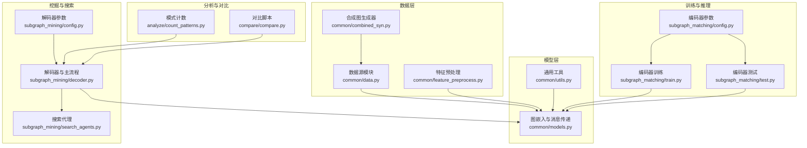
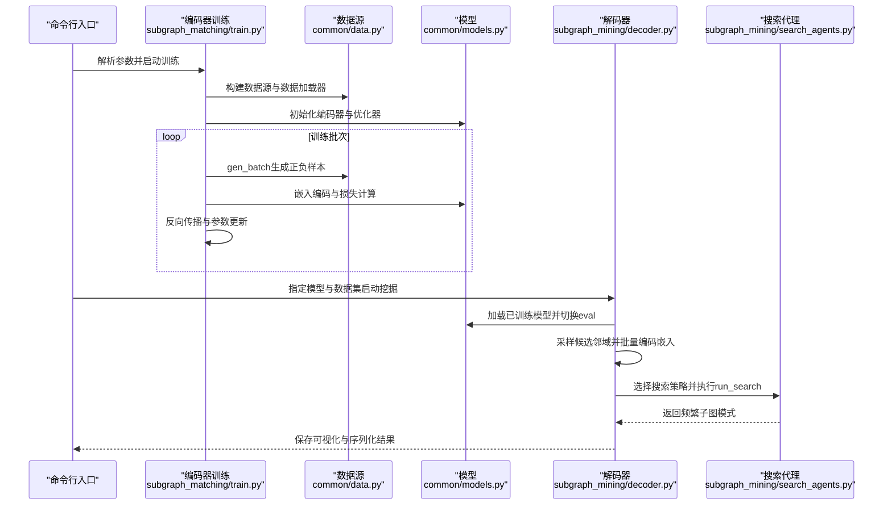
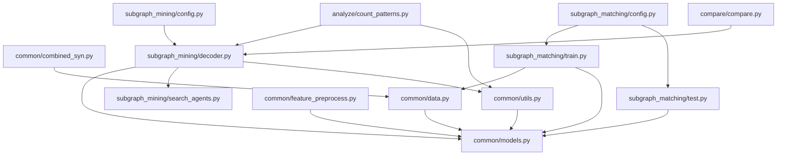

# API参考文档

<cite>
**本文档引用的文件**
- [common/data.py](file://common/data.py)
- [common/models.py](file://common/models.py)
- [common/utils.py](file://common/utils.py)
- [common/feature_preprocess.py](file://common/feature_preprocess.py)
- [common/combined_syn.py](file://common/combined_syn.py)
- [subgraph_mining/search_agents.py](file://subgraph_mining/search_agents.py)
- [subgraph_mining/decoder.py](file://subgraph_mining/decoder.py)
- [subgraph_mining/config.py](file://subgraph_mining/config.py)
- [subgraph_matching/config.py](file://subgraph_matching/config.py)
- [subgraph_matching/train.py](file://subgraph_matching/train.py)
- [subgraph_matching/test.py](file://subgraph_matching/test.py)
- [analyze/count_patterns.py](file://analyze/count_patterns.py)
- [compare/compare.py](file://compare/compare.py)
</cite>

## 目录
1. [简介](#简介)
2. [项目结构](#项目结构)
3. [核心组件](#核心组件)
4. [架构概览](#架构概览)
5. [详细组件分析](#详细组件分析)
6. [依赖分析](#依赖分析)
7. [性能考虑](#性能考虑)
8. [故障排除指南](#故障排除指南)
9. [结论](#结论)
10. [附录](#附录)

## 简介
本文件为SPMiner项目的全面API参考文档，涵盖数据源API、模型API、搜索API与工具API的接口规范与使用说明。内容面向开发者与研究者，既提供高层概念说明，也包含代码级的调用流程与参数配置细节。

## 项目结构
SPMiner采用模块化组织，核心模块包括：
- common：通用数据处理、模型定义、特征预处理与工具函数
- subgraph_matching：子图匹配（编码器）训练与测试
- subgraph_mining：子图挖掘（解码器）与搜索策略
- analyze：模式计数与分析工具
- compare：与gSpan等基准算法的对比脚本

**图表来源**
- [common/data.py:77-430](file://common/data.py#L77-L430)
- [common/models.py:21-318](file://common/models.py#L21-L318)
- [common/feature_preprocess.py:71-230](file://common/feature_preprocess.py#L71-L230)
- [common/combined_syn.py:9-134](file://common/combined_syn.py#L9-L134)
- [subgraph_matching/train.py:49-253](file://subgraph_matching/train.py#L49-L253)
- [subgraph_matching/test.py:11-140](file://subgraph_matching/test.py#L11-L140)
- [subgraph_mining/decoder.py:62-276](file://subgraph_mining/decoder.py#L62-L276)
- [subgraph_mining/search_agents.py:14-442](file://subgraph_mining/search_agents.py#L14-L442)
- [subgraph_mining/config.py:4-65](file://subgraph_mining/config.py#L4-L65)
- [subgraph_matching/config.py:4-82](file://subgraph_matching/config.py#L4-L82)
- [analyze/count_patterns.py:26-431](file://analyze/count_patterns.py#L26-L431)
- [compare/compare.py:16-612](file://compare/compare.py#L16-L612)

**章节来源**
- [common/data.py:1-447](file://common/data.py#L1-L447)
- [common/models.py:1-318](file://common/models.py#L1-L318)
- [common/feature_preprocess.py:1-230](file://common/feature_preprocess.py#L1-L230)
- [common/combined_syn.py:1-134](file://common/combined_syn.py#L1-L134)
- [subgraph_mining/decoder.py:1-276](file://subgraph_mining/decoder.py#L1-L276)
- [subgraph_mining/search_agents.py:1-442](file://subgraph_mining/search_agents.py#L1-L442)
- [subgraph_mining/config.py:1-65](file://subgraph_mining/config.py#L1-L65)
- [subgraph_matching/config.py:1-82](file://subgraph_matching/config.py#L1-L82)
- [subgraph_matching/train.py:1-253](file://subgraph_matching/train.py#L1-L253)
- [subgraph_matching/test.py:1-140](file://subgraph_matching/test.py#L1-L140)
- [analyze/count_patterns.py:1-431](file://analyze/count_patterns.py#L1-L431)
- [compare/compare.py:1-612](file://compare/compare.py#L1-L612)

## 核心组件
本节概述各模块的关键API与职责边界，帮助快速定位功能入口。

- 数据源API
  - 作用：提供训练与挖掘所需的图数据批次，支持在线合成与磁盘数据集两类来源
  - 关键类与方法：
    - DataSource：抽象基类，定义gen_batch接口
    - OTFSynDataSource：在线合成数据源，动态生成正负样本
    - DiskDataSource：磁盘数据集数据源，从真实数据集中采样子图
    - OTFSynImbalancedDataSource/DiskImbalancedDataSource：不平衡采样变体
  - 相关工具：load_dataset、batch_nx_graphs、sample_neigh

- 模型API
  - 作用：定义图嵌入编码器与子图匹配判别器，支持多种GNN与损失函数
  - 关键类与方法：
    - SkipLastGNN：支持跳跃连接的GNN编码器
    - OrderEmbedder：序嵌入模型，学习子图包含关系
    - BaselineMLP：拼接双图向量的基线分类器
    - 自定义卷积层：SAGEConv、GINConv
  - 损失与预测：forward、predict、criterion、loss

- 搜索API
  - 作用：在嵌入空间中搜索频繁子图模式，支持贪心与MCTS策略
  - 关键类与方法：
    - SearchAgent：抽象基类，run_search主循环与候选嵌入缓存
    - GreedySearchAgent：贪心扩展，支持counts/margin/hybrid排序
    - MCTSSearchAgent：蒙特卡洛树搜索，UCT准则

- 工具API
  - 作用：提供图操作、可视化、分析与计数工具
  - 关键函数：
    - enumerate_subgraph、gen_baseline_queries_rand_esu、gen_baseline_queries_mfinder
    - load_snap_edgelist、get_device、build_optimizer、parse_optimizer
    - count_graphlets、count_exact、dedup_isomorphic_queries

**章节来源**
- [common/data.py:77-430](file://common/data.py#L77-L430)
- [common/models.py:21-318](file://common/models.py#L21-L318)
- [subgraph_mining/search_agents.py:14-442](file://subgraph_mining/search_agents.py#L14-L442)
- [common/utils.py:18-302](file://common/utils.py#L18-L302)
- [analyze/count_patterns.py:26-431](file://analyze/count_patterns.py#L26-L431)

## 架构概览
SPMiner整体流程分为三阶段：编码器训练（子图匹配）、嵌入计算（挖掘采样）、搜索与输出（频繁子图模式）。

**图表来源**
- [subgraph_matching/train.py:91-222](file://subgraph_matching/train.py#L91-L222)
- [common/data.py:77-430](file://common/data.py#L77-L430)
- [common/models.py:46-100](file://common/models.py#L46-L100)
- [subgraph_mining/decoder.py:62-171](file://subgraph_mining/decoder.py#L62-L171)
- [subgraph_mining/search_agents.py:54-68](file://subgraph_mining/search_agents.py#L54-L68)

## 详细组件分析

### 数据源API
数据源模块提供两类数据生成方式：在线合成与磁盘真实数据集。支持平衡与不平衡采样策略，并可结合节点锚定增强训练稳定性。

- 接口规范
  - DataSource.gen_batch：抽象接口，生成正负样本批次
  - OTFSynDataSource.gen_batch：在线生成正负样本，支持困难负例与锚定节点
  - DiskDataSource.gen_batch：从磁盘数据集中采样子图，支持多种采样策略
  - OTFSynImbalancedDataSource/DiskImbalancedDataSource：不平衡采样，适合推理场景
  - 工具函数：load_dataset、batch_nx_graphs、sample_neigh

- 参数与行为
  - 数据集名称：支持TUDataset常见图数据集与特定社交网络数据
  - 采样策略：tree-pair、subgraph-tree等
  - 节点锚定：在图中显式标记锚定节点，提升匹配稳定性
  - 设备与批处理：自动在CPU/GPU间移动张量，支持分布式采样

- 错误处理与边界
  - 不连通图：通过取最大连通子图保证子图采样连通性
  - 缓存与重复：不平衡采样结果缓存至本地文件，避免重复计算

**章节来源**
- [common/data.py:21-75](file://common/data.py#L21-L75)
- [common/data.py:77-114](file://common/data.py#L77-L114)
- [common/data.py:271-354](file://common/data.py#L271-L354)
- [common/data.py:356-429](file://common/data.py#L356-L429)
- [common/utils.py:18-53](file://common/utils.py#L18-L53)
- [common/utils.py:286-302](file://common/utils.py#L286-L302)

### 模型API
模型模块定义了图嵌入编码器与子图匹配判别器，支持多种GNN与损失函数，满足不同任务需求。

- 类与方法
  - SkipLastGNN：支持跳跃连接的GNN编码器，可配置PNA、SAGE、GIN等卷积类型
  - OrderEmbedder：序嵌入模型，通过违反量与margin损失学习子图包含关系
  - BaselineMLP：拼接双图嵌入后经MLP分类，用于对比实验
  - 自定义卷积：SAGEConv、GINConv，支持边权与自环处理

- 训练与推理
  - forward：返回嵌入对或最终预测
  - predict：根据模型类型计算违反量或分类得分
  - criterion：序嵌入损失，包含margin约束
  - loss：基线模型的分类损失

- 参数配置
  - 卷积类型、层数、隐藏维度、跳跃策略、dropout
  - 优化器与学习率调度器：Adam、SGD、RMSprop、Adagrad及其调度策略

**章节来源**
- [common/models.py:21-44](file://common/models.py#L21-L44)
- [common/models.py:46-99](file://common/models.py#L46-L99)
- [common/models.py:101-229](file://common/models.py#L101-L229)
- [common/models.py:231-317](file://common/models.py#L231-L317)
- [common/utils.py:245-284](file://common/utils.py#L245-L284)

### 搜索API
搜索模块在嵌入空间中搜索频繁子图模式，支持贪心与MCTS两种策略，并提供候选嵌入缓存与剪枝机制。

- 类与方法
  - SearchAgent.run_search：统一搜索驱动器，封装初始化、步进与收尾
  - GreedySearchAgent：贪心扩展，支持counts/margin/hybrid排序策略
  - MCTSSearchAgent：MCTS扩展，使用UCT准则选择种子节点与候选节点

- 候选管理
  - 候选嵌入缓存：避免重复计算，加速大规模搜索
  - 剪枝策略：frontier_top_k限制每步候选节点数量
  - WL哈希去重：按WL签名对候选模式去重

- 参数配置
  - 模式大小范围、搜索试验次数、输出数量、frontier剪枝阈值
  - 节点锚定开关与分析可视化选项

**章节来源**
- [subgraph_mining/search_agents.py:14-68](file://subgraph_mining/search_agents.py#L14-L68)
- [subgraph_mining/search_agents.py:129-282](file://subgraph_mining/search_agents.py#L129-L282)
- [subgraph_mining/search_agents.py:284-442](file://subgraph_mining/search_agents.py#L284-L442)

### 工具API
工具模块提供图操作、可视化、分析与计数等实用功能，支撑数据预处理与结果评估。

- 图操作与采样
  - sample_neigh：按图大小加权采样连通邻域
  - load_snap_edgelist：从边列表加载无向图并取最大连通子图
  - batch_nx_graphs：将NetworkX图批量转换为PyG格式并增强特征

- 嵌入与哈希
  - wl_hash：基于WL迭代的图签名计算
  - vec_hash：向量稳定哈希映射，用于WL签名更新

- 计数与基线
  - enumerate_subgraph：基于ESU思想枚举子图并按WL签名聚类
  - gen_baseline_queries_rand_esu/gen_baseline_queries_mfinder：生成基线查询集
  - count_graphlets/count_exact：多进程并行计数与精确计数

- 优化器与设备
  - build_optimizer/build_scheduler：创建优化器与学习率调度器
  - get_device：懒加载运行设备（CUDA/CPU）

**章节来源**
- [common/utils.py:18-53](file://common/utils.py#L18-L53)
- [common/utils.py:70-96](file://common/utils.py#L70-L96)
- [common/utils.py:121-171](file://common/utils.py#L121-L171)
- [common/utils.py:172-206](file://common/utils.py#L172-L206)
- [common/utils.py:208-233](file://common/utils.py#L208-L233)
- [common/utils.py:235-243](file://common/utils.py#L235-L243)
- [common/utils.py:245-284](file://common/utils.py#L245-L284)
- [common/utils.py:286-302](file://common/utils.py#L286-L302)
- [analyze/count_patterns.py:53-102](file://analyze/count_patterns.py#L53-L102)
- [analyze/count_patterns.py:166-229](file://analyze/count_patterns.py#L166-L229)
- [analyze/count_patterns.py:231-278](file://analyze/count_patterns.py#L231-L278)
- [analyze/count_patterns.py:280-330](file://analyze/count_patterns.py#L280-L330)

## 依赖分析
模块间的依赖关系如下：

**图表来源**
- [common/data.py:17-20](file://common/data.py#L17-L20)
- [common/models.py:18-19](file://common/models.py#L18-L19)
- [common/feature_preprocess.py:24-25](file://common/feature_preprocess.py#L24-L25)
- [common/combined_syn.py:7-8](file://common/combined_syn.py#L7-L8)
- [subgraph_matching/train.py:39-47](file://subgraph_matching/train.py#L39-L47)
- [subgraph_matching/test.py:1-1](file://subgraph_matching/test.py#L1-L1)
- [subgraph_mining/decoder.py:12-17](file://subgraph_mining/decoder.py#L12-L17)
- [subgraph_mining/search_agents.py:4-5](file://subgraph_mining/search_agents.py#L4-L5)
- [analyze/count_patterns.py:10-12](file://analyze/count_patterns.py#L10-L12)
- [compare/compare.py:1-9](file://compare/compare.py#L1-L9)

**章节来源**
- [common/data.py:1-447](file://common/data.py#L1-L447)
- [common/models.py:1-318](file://common/models.py#L1-L318)
- [common/feature_preprocess.py:1-230](file://common/feature_preprocess.py#L1-L230)
- [common/combined_syn.py:1-134](file://common/combined_syn.py#L1-L134)
- [subgraph_matching/train.py:1-253](file://subgraph_matching/train.py#L1-L253)
- [subgraph_matching/test.py:1-140](file://subgraph_matching/test.py#L1-L140)
- [subgraph_mining/decoder.py:1-276](file://subgraph_mining/decoder.py#L1-L276)
- [subgraph_mining/search_agents.py:1-442](file://subgraph_mining/search_agents.py#L1-L442)
- [analyze/count_patterns.py:1-431](file://analyze/count_patterns.py#L1-L431)
- [compare/compare.py:1-612](file://compare/compare.py#L1-L612)

## 性能考虑
- 训练阶段
  - 多进程数据生成：通过队列与共享内存并行生成批次，提高吞吐
  - 分布式采样：支持分布式采样器，适配多GPU环境
  - 梯度裁剪与优化器调度：防止梯度爆炸，稳定收敛

- 挖掘阶段
  - 候选嵌入缓存：避免重复计算嵌入，显著降低搜索成本
  - frontier剪枝：限制每步候选节点数量，控制搜索空间
  - 批量嵌入编码：将候选邻域批量转换为图批次，提升推理效率

- 计数与分析
  - 多进程并行计数：通过进程池与分块策略加速大规模计数
  - 快速过滤：利用度序列与锚定节点等必要条件减少同构检查

[本节为通用指导，无需列出具体文件来源]

## 故障排除指南
- 设备与CUDA
  - 现象：CUDA不可用或显存不足
  - 处理：检查GPU可用性，适当降低batch_size或使用CPU

- 数据加载
  - 现象：边列表格式错误或注释行导致图加载失败
  - 处理：确认边列表格式，忽略空行与注释行

- 训练不稳定
  - 现象：损失震荡或精度停滞
  - 处理：调整学习率、启用梯度裁剪、检查优化器调度器配置

- 搜索效率低
  - 现象：搜索耗时过长或内存占用过高
  - 处理：增大frontier_top_k阈值、减少n_trials、启用候选缓存

**章节来源**
- [common/utils.py:235-243](file://common/utils.py#L235-L243)
- [common/utils.py:245-284](file://common/utils.py#L245-L284)
- [subgraph_mining/decoder.py:139-152](file://subgraph_mining/decoder.py#L139-L152)
- [subgraph_mining/search_agents.py:121-128](file://subgraph_mining/search_agents.py#L121-L128)

## 结论
SPMiner提供了完整的从子图匹配到频繁子图挖掘的端到端框架。数据源API支持多样化的数据生成策略，模型API覆盖主流GNN与判别器设计，搜索API提供高效的贪心与MCTS策略，工具API则完善了图操作、计数与对比评测能力。通过合理的参数配置与性能优化，可在真实大规模图数据上高效完成子图模式挖掘任务。

[本节为总结性内容，无需列出具体文件来源]

## 附录

### API清单与调用流程

- 数据源API
  - DataSource.gen_batch：生成正负样本批次
  - OTFSynDataSource.gen_batch：在线合成正负样本
  - DiskDataSource.gen_batch：磁盘数据集采样子图
  - 工具函数：load_dataset、batch_nx_graphs、sample_neigh

- 模型API
  - SkipLastGNN.forward/predict/criterion：编码器与损失
  - OrderEmbedder.forward/predict/criterion：序嵌入模型
  - BaselineMLP.forward/predict/criterion：基线分类器
  - 自定义卷积：SAGEConv、GINConv

- 搜索API
  - SearchAgent.run_search：统一搜索驱动
  - GreedySearchAgent.step/finish_search：贪心扩展与输出
  - MCTSSearchAgent.step/finish_search：MCTS扩展与输出

- 工具API
  - enumerate_subgraph：枚举子图并聚类
  - gen_baseline_queries_rand_esu/gen_baseline_queries_mfinder：生成基线查询
  - count_graphlets/count_exact：并行计数与精确计数
  - load_snap_edgelist/get_device/build_optimizer：图加载与设备/优化器

**章节来源**
- [common/data.py:77-430](file://common/data.py#L77-L430)
- [common/models.py:21-318](file://common/models.py#L21-L318)
- [subgraph_mining/search_agents.py:14-442](file://subgraph_mining/search_agents.py#L14-L442)
- [common/utils.py:18-302](file://common/utils.py#L18-L302)
- [analyze/count_patterns.py:26-431](file://analyze/count_patterns.py#L26-L431)