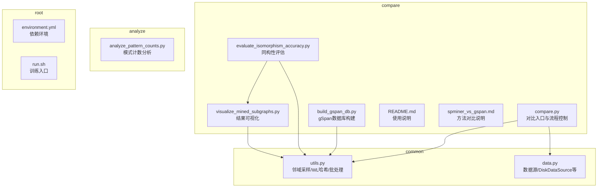
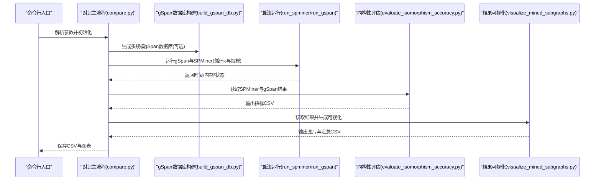
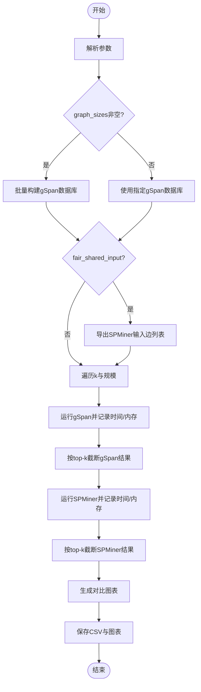
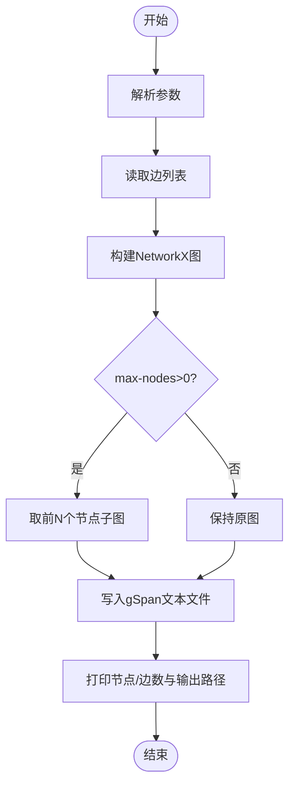
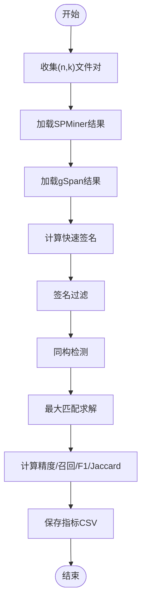
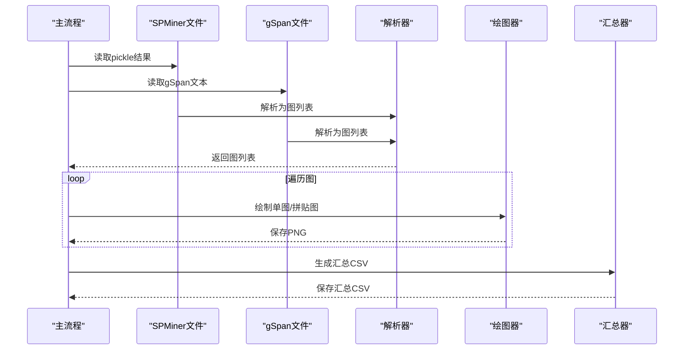
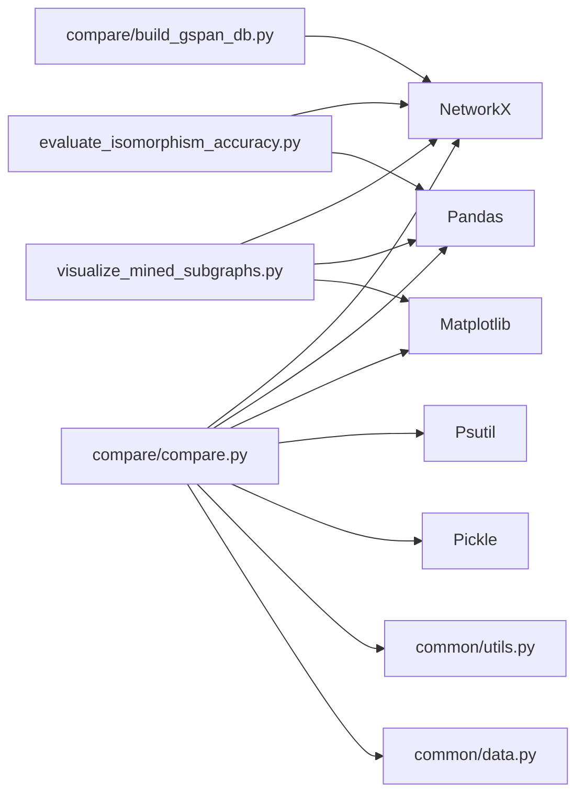

# 对比分析API

<cite>
**本文引用的文件**
- [compare/compare.py](file://compare/compare.py)
- [compare/build_gspan_db.py](file://compare/build_gspan_db.py)
- [compare/evaluate_isomorphism_accuracy.py](file://compare/evaluate_isomorphism_accuracy.py)
- [compare/visualize_mined_subgraphs.py](file://compare/visualize_mined_subgraphs.py)
- [compare/README.md](file://compare/README.md)
- [compare/spminer_vs_gspan.md](file://compare/spminer_vs_gspan.md)
- [common/utils.py](file://common/utils.py)
- [common/data.py](file://common/data.py)
- [environment.yml](file://environment.yml)
- [run.sh](file://run.sh)
</cite>

## 目录
1. [简介](#简介)
2. [项目结构](#项目结构)
3. [核心组件](#核心组件)
4. [架构总览](#架构总览)
5. [详细组件分析](#详细组件分析)
6. [依赖分析](#依赖分析)
7. [性能考量](#性能考量)
8. [故障排查指南](#故障排查指南)
9. [结论](#结论)
10. [附录](#附录)

## 简介
本文件为性能对比分析系统的API参考文档，覆盖以下能力：
- 对比入口API：支持多规模测试、性能监控（时间/内存）、结果分析与可视化
- gSpan数据库构建API：从边列表生成gSpan数据库文件，支持多规模图生成与输入格式转换
- 同构性评估API：基于同构测试的准确性评估与结果验证
- 结果可视化API：模式可视化、结果展示与图表生成

文档提供接口规范、参数说明、数据流、错误处理与最佳实践，并给出完整的使用示例与结果解读方法。

## 项目结构
该仓库围绕“对比分析”形成清晰的模块划分：
- compare：对比分析主流程与工具脚本（对比入口、gSpan数据库构建、同构性评估、结果可视化）
- common：通用工具与数据源（邻域采样、WL哈希、图加载、批处理等）
- analyze：分析与统计（模式计数、统计图表）
- 其他：训练入口、环境配置

**图表来源**
- [compare/compare.py:1-612](file://compare/compare.py#L1-L612)
- [compare/build_gspan_db.py:1-50](file://compare/build_gspan_db.py#L1-L50)
- [compare/evaluate_isomorphism_accuracy.py:1-215](file://compare/evaluate_isomorphism_accuracy.py#L1-L215)
- [compare/visualize_mined_subgraphs.py:1-191](file://compare/visualize_mined_subgraphs.py#L1-L191)
- [common/utils.py:1-302](file://common/utils.py#L1-L302)
- [common/data.py:1-447](file://common/data.py#L1-L447)
- [analyze/analyze_pattern_counts.py:1-80](file://analyze/analyze_pattern_counts.py#L1-L80)
- [environment.yml:1-129](file://environment.yml#L1-L129)
- [run.sh:1-2](file://run.sh#L1-L2)

**章节来源**
- [compare/README.md:1-34](file://compare/README.md#L1-L34)
- [compare/spminer_vs_gspan.md:1-200](file://compare/spminer_vs_gspan.md#L1-L200)

## 核心组件
- 对比入口API（compare/compare.py）
  - 多规模测试：支持从边列表批量生成不同规模的gSpan数据库，统一运行对比
  - 性能监控：记录算法运行时间与最大内存占用，支持超时与轮询
  - 结果分析：生成CSV汇总与对比图表（时间/内存）
  - 公平共享输入：可将gSpan数据库的第一张图导出为SPMiner可读的边列表，确保输入一致
- gSpan数据库构建API（compare/build_gspan_db.py）
  - 输入：边列表文件（支持注释行与空行跳过）
  - 输出：gSpan数据库文本文件（顶点/边块、支持度标记）
  - 多规模：可限制最大节点数，生成不同规模的数据库
- 同构性评估API（compare/evaluate_isomorphism_accuracy.py）
  - 输入：SPMiner pickle结果与gSpan文本结果
  - 处理：解析图形、快速签名过滤、最大匹配求解
  - 输出：精度、召回、F1、Jaccard、宏观与加权准确率
- 结果可视化API（compare/visualize_mined_subgraphs.py）
  - 输入：SPMiner pickle结果与gSpan文本结果
  - 处理：解析图形、绘制单图与拼贴图、生成汇总CSV
  - 输出：PNG图片与汇总CSV

**章节来源**
- [compare/compare.py:16-125](file://compare/compare.py#L16-L125)
- [compare/build_gspan_db.py:6-11](file://compare/build_gspan_db.py#L6-L11)
- [compare/evaluate_isomorphism_accuracy.py:156-174](file://compare/evaluate_isomorphism_accuracy.py#L156-L174)
- [compare/visualize_mined_subgraphs.py:134-140](file://compare/visualize_mined_subgraphs.py#L134-L140)

## 架构总览
对比分析系统采用“命令行脚本 + 工具函数 + 可视化”的分层架构：
- 命令行入口：parse_args解析参数，统一调度各模块
- 工具函数层：构建数据库、运行算法、提取结果、评估指标
- 可视化层：生成图表与汇总文件
- 依赖层：NetworkX、Pandas、Matplotlib、Psutil、Pickled数据

**图表来源**
- [compare/compare.py:495-612](file://compare/compare.py#L495-L612)
- [compare/build_gspan_db.py:14-46](file://compare/build_gspan_db.py#L14-L46)
- [compare/evaluate_isomorphism_accuracy.py:156-215](file://compare/evaluate_isomorphism_accuracy.py#L156-L215)
- [compare/visualize_mined_subgraphs.py:134-191](file://compare/visualize_mined_subgraphs.py#L134-L191)

## 详细组件分析

### 对比入口API（compare/compare.py）
- 主要职责
  - 解析参数并定位仓库根目录与输出目录
  - 多规模图构建：从边列表生成多个规模的gSpan数据库
  - 公平共享输入：将gSpan数据库首图导出为SPMiner可读边列表
  - 算法运行与监控：分别运行gSpan与SPMiner，记录时间与内存
  - 结果整理与可视化：生成汇总CSV与对比图表
- 关键函数
  - parse_args：参数解析（数据集、边列表、图规模、k范围、gSpan命令模板、超时、轮询间隔、Python可执行文件、模型路径、SPMiner参数、gSpan参数、输出目录、公平共享输入、top-k）
  - build_gspan_db_from_edge_list：从边列表构建gSpan数据库
  - prepare_spminer_dataset_from_gspan_db：导出gSpan首图为SPMiner边列表
  - run_and_monitor：进程监控（超时、内存采集、日志输出）
  - run_spminer/run_gspan：分别运行SPMiner与gSpan
  - trim_spminer_top_k/trim_gspan_top_k：按top-k截断结果
  - plot_results：绘制时间/内存对比图
  - main：主流程编排
- 参数与行为
  - graph_sizes：多规模测试开关，为空则单图模式
  - ks：子图大小列表
  - min_sup：gSpan最小支持度
  - timeout_sec/poll_interval：超时与轮询间隔
  - fair_shared_input：启用公平共享输入
  - top_k_patterns：保留高频子图数量
  - use_gspan_mining：使用内置gspan_mining命令（Windows推荐）

**图表来源**
- [compare/compare.py:495-612](file://compare/compare.py#L495-L612)

**章节来源**
- [compare/compare.py:16-125](file://compare/compare.py#L16-L125)
- [compare/compare.py:133-166](file://compare/compare.py#L133-L166)
- [compare/compare.py:169-214](file://compare/compare.py#L169-L214)
- [compare/compare.py:217-262](file://compare/compare.py#L217-L262)
- [compare/compare.py:264-296](file://compare/compare.py#L264-L296)
- [compare/compare.py:299-348](file://compare/compare.py#L299-L348)
- [compare/compare.py:351-364](file://compare/compare.py#L351-L364)
- [compare/compare.py:410-444](file://compare/compare.py#L410-L444)
- [compare/compare.py:450-493](file://compare/compare.py#L450-L493)
- [compare/compare.py:495-612](file://compare/compare.py#L495-L612)

### gSpan数据库构建API（compare/build_gspan_db.py）
- 主要职责
  - 将边列表转换为gSpan数据库格式（顶点/边块、支持度标记）
  - 支持多规模：可限制最大节点数，生成不同规模数据库
- 关键函数
  - parse_args：edge-list、out、max-nodes
  - main：读取边列表、构建NetworkX图、生成gSpan文本文件
- 输入格式
  - 边列表：每行“节点1 节点2”，支持注释行（以#开头）与空行
- 输出格式
  - gSpan文本：每个图以“t # 0”开头，“t # -1”结尾，中间为“v 节点ID 标签”和“e 节点ID 节点ID 标签”

**图表来源**
- [compare/build_gspan_db.py:14-46](file://compare/build_gspan_db.py#L14-L46)

**章节来源**
- [compare/build_gspan_db.py:6-11](file://compare/build_gspan_db.py#L6-L11)
- [compare/build_gspan_db.py:14-46](file://compare/build_gspan_db.py#L14-L46)

### 同构性评估API（compare/evaluate_isomorphism_accuracy.py）
- 主要职责
  - 读取SPMiner pickle结果与gSpan文本结果
  - 解析图形、快速签名过滤、最大匹配求解
  - 计算精度、召回、F1、Jaccard、宏观与加权准确率
- 关键函数
  - parse_gspan_output：解析gSpan输出为NetworkX图列表
  - load_spminer_pickle：读取SPMiner pickle结果
  - quick_sig：快速签名（节点数、边数、度序列）
  - count_isomorphic_matches：基于快速签名与最大匹配统计同构匹配数
  - evaluate_pair：计算各项指标
  - collect_files_from_summary：从汇总CSV收集文件对
  - main：主流程（读取汇总CSV、评估、输出指标CSV）
- 输入输出
  - 输入：SPMiner pickle文件与gSpan文本文件（按(n,k)配对）
  - 输出：per-(n,k)指标CSV，包含宏观与加权准确率

**图表来源**
- [compare/evaluate_isomorphism_accuracy.py:103-135](file://compare/evaluate_isomorphism_accuracy.py#L103-L135)
- [compare/evaluate_isomorphism_accuracy.py:156-215](file://compare/evaluate_isomorphism_accuracy.py#L156-L215)

**章节来源**
- [compare/evaluate_isomorphism_accuracy.py:14-48](file://compare/evaluate_isomorphism_accuracy.py#L14-L48)
- [compare/evaluate_isomorphism_accuracy.py:51-57](file://compare/evaluate_isomorphism_accuracy.py#L51-L57)
- [compare/evaluate_isomorphism_accuracy.py:66-101](file://compare/evaluate_isomorphism_accuracy.py#L66-L101)
- [compare/evaluate_isomorphism_accuracy.py:103-135](file://compare/evaluate_isomorphism_accuracy.py#L103-L135)
- [compare/evaluate_isomorphism_accuracy.py:137-154](file://compare/evaluate_isomorphism_accuracy.py#L137-L154)
- [compare/evaluate_isomorphism_accuracy.py:156-215](file://compare/evaluate_isomorphism_accuracy.py#L156-L215)

### 结果可视化API（compare/visualize_mined_subgraphs.py）
- 主要职责
  - 读取SPMiner pickle结果与gSpan文本结果
  - 解析图形、绘制单图与拼贴图、生成汇总CSV
- 关键函数
  - parse_gspan_output/load_spminer_pickle：解析与加载
  - draw_graph：绘制单图（含锚点着色）
  - save_single_graphs/save_montage：保存单图与拼贴图
  - summarize_records：生成汇总CSV
  - main：主流程（遍历文件、绘图、汇总）

**图表来源**
- [compare/visualize_mined_subgraphs.py:134-191](file://compare/visualize_mined_subgraphs.py#L134-L191)

**章节来源**
- [compare/visualize_mined_subgraphs.py:12-53](file://compare/visualize_mined_subgraphs.py#L12-L53)
- [compare/visualize_mined_subgraphs.py:63-84](file://compare/visualize_mined_subgraphs.py#L63-L84)
- [compare/visualize_mined_subgraphs.py:86-125](file://compare/visualize_mined_subgraphs.py#L86-L125)
- [compare/visualize_mined_subgraphs.py:127-133](file://compare/visualize_mined_subgraphs.py#L127-L133)
- [compare/visualize_mined_subgraphs.py:134-191](file://compare/visualize_mined_subgraphs.py#L134-L191)

## 依赖分析
- 外部依赖
  - NetworkX：图解析与同构检测
  - Pandas：结果汇总与CSV处理
  - Matplotlib：图表生成
  - Psutil：进程监控与内存采集
  - Pickle：SPMiner结果序列化
- 内部依赖
  - common/utils.py：邻域采样、WL哈希、批处理
  - common/data.py：数据源与图加载（用于SPMiner输入准备）

**图表来源**
- [compare/compare.py:10-14](file://compare/compare.py#L10-L14)
- [compare/build_gspan_db.py](file://compare/build_gspan_db.py#L3)
- [compare/evaluate_isomorphism_accuracy.py:6-8](file://compare/evaluate_isomorphism_accuracy.py#L6-L8)
- [compare/visualize_mined_subgraphs.py:6-9](file://compare/visualize_mined_subgraphs.py#L6-L9)
- [common/utils.py:1-15](file://common/utils.py#L1-L15)
- [common/data.py:1-20](file://common/data.py#L1-L20)

**章节来源**
- [environment.yml:93-127](file://environment.yml#L93-L127)
- [common/utils.py:1-302](file://common/utils.py#L1-L302)
- [common/data.py:1-447](file://common/data.py#L1-L447)

## 性能考量
- 时间复杂度
  - 对比入口：O(S·K·T)，S为规模数，K为k数，T为算法运行时间
  - 同构性评估：O(N^2)（快速签名过滤后），N为结果数量
  - 可视化：O(N·V)，N为图数，V为平均节点数
- 内存占用
  - 进程监控：实时采集RSS，上限为max_mem_mb
  - 结果存储：Pickle与CSV，注意大结果集的磁盘占用
- 超时与轮询
  - timeout_sec控制算法运行上限，poll_interval控制轮询频率
- 并发与I/O
  - 多规模批量构建与对比时，建议合理设置轮询间隔与超时，避免I/O瓶颈

[本节为通用性能讨论，无需特定文件引用]

## 故障排查指南
- 常见问题
  - gSpan命令模板缺失：当未启用内置gspan_mining时需提供命令模板
  - gSpan数据库文件不存在：检查路径与权限
  - SPMiner输入不一致：启用fair_shared_input确保输入一致
  - 结果为空：检查top-k截断逻辑与输入格式
- 错误处理
  - run_and_monitor：超时抛出TimeoutError，退出码非0抛出RuntimeError
  - parse_gspan_output/load_spminer_pickle：格式错误抛出异常
  - evaluate_pair：空结果返回相应指标0
- 日志与输出
  - SPMiner日志文件保存在指定路径，便于调试
  - CSV与图表输出到指定目录，便于后续分析

**章节来源**
- [compare/compare.py:217-262](file://compare/compare.py#L217-L262)
- [compare/compare.py:299-348](file://compare/compare.py#L299-L348)
- [compare/evaluate_isomorphism_accuracy.py:51-57](file://compare/evaluate_isomorphism_accuracy.py#L51-L57)
- [compare/evaluate_isomorphism_accuracy.py:103-135](file://compare/evaluate_isomorphism_accuracy.py#L103-L135)

## 结论
本对比分析系统提供了从数据准备、算法运行、结果评估到可视化的完整链路。通过多规模测试与公平共享输入，能够有效对比SPMiner与gSpan在时间与内存方面的表现；通过同构性评估与可视化，能够从结构一致性与直观展示两个维度验证结果质量。建议在实际使用中结合具体数据规模与硬件条件，合理设置超时与轮询参数，并利用可视化结果指导后续优化。

[本节为总结性内容，无需特定文件引用]

## 附录

### 使用示例
- 生成gSpan数据库
  - 示例命令：[compare/README.md:13-15](file://compare/README.md#L13-L15)
- 运行对比（Windows推荐内置gspan_mining）
  - 示例命令：[compare/README.md:17-21](file://compare/README.md#L17-L21)
- 生成可视化
  - 示例命令：[compare/visualize_mined_subgraphs.py:134-140](file://compare/visualize_mined_subgraphs.py#L134-L140)
- 评估同构性
  - 示例命令：[compare/evaluate_isomorphism_accuracy.py:156-174](file://compare/evaluate_isomorphism_accuracy.py#L156-L174)

### 参数一览
- 对比入口（compare/compare.py）
  - --dataset：数据集名称
  - --edge-list：边列表文件
  - --graph-sizes：多规模图规模列表
  - --gspan-db-file：gSpan数据库文件
  - --ks：子图大小列表
  - --min-sup：gSpan最小支持度
  - --timeout-sec：超时秒数
  - --poll-interval：轮询间隔
  - --python-bin：Python可执行文件
  - --repo-root：仓库根目录
  - --model-path：SPMiner模型路径
  - --spminer-trials：SPMiner n_trials
  - --spminer-neighborhoods：SPMiner n_neighborhoods
  - --spminer-batch-size：SPMiner batch_size
  - --gspan-cmd-template：gSpan命令模板
  - --use-gspan-mining：使用内置gspan_mining
  - --out-dir：输出目录
  - --fair-shared-input：启用公平共享输入
  - --top-k-patterns：保留top-k模式数
- gSpan数据库构建（compare/build_gspan_db.py）
  - --edge-list：输入边列表
  - --out：输出gSpan数据库
  - --max-nodes：最大节点数
- 同构性评估（compare/evaluate_isomorphism_accuracy.py）
  - --summary-csv：可视化汇总CSV
  - --out-csv：输出指标CSV
  - --top-k：每组top-k
- 结果可视化（compare/visualize_mined_subgraphs.py）
  - --spminer：SPMiner pickle文件列表
  - --gspan：gSpan文本文件列表
  - --out-dir：输出目录
  - --max-graphs：最大绘制图数

**章节来源**
- [compare/compare.py:16-125](file://compare/compare.py#L16-L125)
- [compare/build_gspan_db.py:6-11](file://compare/build_gspan_db.py#L6-L11)
- [compare/evaluate_isomorphism_accuracy.py:156-174](file://compare/evaluate_isomorphism_accuracy.py#L156-L174)
- [compare/visualize_mined_subgraphs.py:134-140](file://compare/visualize_mined_subgraphs.py#L134-L140)