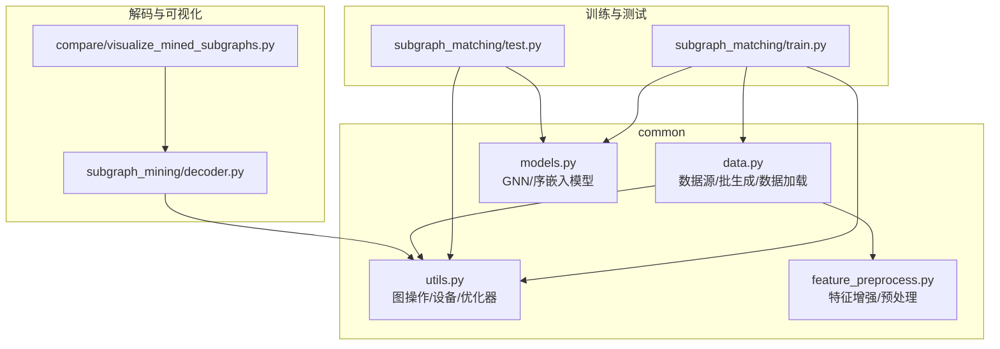
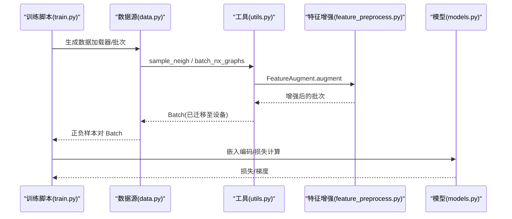
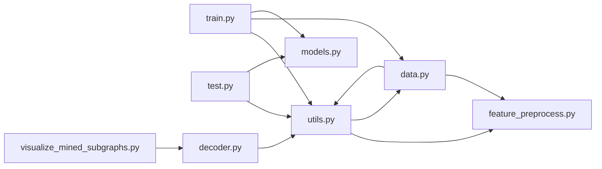

# 工具API

<cite>
**本文引用的文件**
- [common/utils.py](file://common/utils.py)
- [common/data.py](file://common/data.py)
- [common/feature_preprocess.py](file://common/feature_preprocess.py)
- [common/models.py](file://common/models.py)
- [subgraph_matching/train.py](file://subgraph_matching/train.py)
- [subgraph_matching/test.py](file://subgraph_matching/test.py)
- [subgraph_mining/decoder.py](file://subgraph_mining/decoder.py)
- [compare/visualize_mined_subgraphs.py](file://compare/visualize_mined_subgraphs.py)
</cite>

## 目录
1. [简介](#简介)
2. [项目结构](#项目结构)
3. [核心组件](#核心组件)
4. [架构总览](#架构总览)
5. [详细组件分析](#详细组件分析)
6. [依赖关系分析](#依赖关系分析)
7. [性能考量](#性能考量)
8. [故障排查指南](#故障排查指南)
9. [结论](#结论)
10. [附录](#附录)

## 简介
本文件为 SPMiner 项目的工具API参考文档，聚焦以下工具函数与相关能力：
- 图操作工具：sample_neigh 邻居采样、batch_nx_graphs 批处理、load_snap_edgelist 数据加载
- 设备管理工具：get_device
- 批处理工具：DeepSNAP Batch 的使用方式与数据格式转换
- 可视化工具：图形绘制参数与样式配置
- 实用函数：数据类型转换、张量操作与内存管理
- 错误处理与调试建议
- 实际应用示例：数据预处理、模型训练、结果分析

## 项目结构
本项目采用按功能域划分的目录组织，工具API主要集中在 common 子模块，配合训练/测试脚本与解码器模块使用。

图表来源
- [common/utils.py:1-302](file://common/utils.py#L1-L302)
- [common/data.py:1-447](file://common/data.py#L1-L447)
- [common/feature_preprocess.py:1-230](file://common/feature_preprocess.py#L1-L230)
- [common/models.py:1-318](file://common/models.py#L1-L318)
- [subgraph_matching/train.py:1-253](file://subgraph_matching/train.py#L1-L253)
- [subgraph_matching/test.py:1-140](file://subgraph_matching/test.py#L1-L140)
- [subgraph_mining/decoder.py:87-137](file://subgraph_mining/decoder.py#L87-L137)
- [compare/visualize_mined_subgraphs.py:63-95](file://compare/visualize_mined_subgraphs.py#L63-L95)

章节来源
- [common/utils.py:1-302](file://common/utils.py#L1-L302)
- [common/data.py:1-447](file://common/data.py#L1-L447)
- [common/feature_preprocess.py:1-230](file://common/feature_preprocess.py#L1-L230)
- [common/models.py:1-318](file://common/models.py#L1-L318)
- [subgraph_matching/train.py:1-253](file://subgraph_matching/train.py#L1-L253)
- [subgraph_matching/test.py:1-140](file://subgraph_matching/test.py#L1-L140)
- [subgraph_mining/decoder.py:87-137](file://subgraph_mining/decoder.py#L87-L137)
- [compare/visualize_mined_subgraphs.py:63-95](file://compare/visualize_mined_subgraphs.py#L63-L95)

## 核心组件
- 图操作工具
  - sample_neigh：按图大小加权采样连通邻域，返回图与节点列表
  - batch_nx_graphs：将 networkx 图列表转换为 DeepSNAP Batch，并进行特征增强与设备迁移
  - load_snap_edgelist：从 SNAP 风格边列表加载无向图，返回最大连通子图
- 设备管理工具
  - get_device：懒加载运行设备（优先 CUDA），缓存设备实例
- 批处理工具
  - DeepSNAP Batch：封装图批数据，支持 collate、to(device)、apply_transform 等
- 可视化工具
  - draw_graph：基于 NetworkX 的 spring 布局绘制子图，支持锚点着色
- 实用函数
  - FeatureAugment：节点特征增强（度、介数中心性、路径长、PageRank、聚类系数等）
  - Preprocess：特征拼接/相加策略，调整输出维度
  - 优化器构建：build_optimizer、parse_optimizer
  - 内存/设备管理：get_device、to(device)、CPU/GPU 迁移

章节来源
- [common/utils.py:18-301](file://common/utils.py#L18-L301)
- [common/data.py:77-429](file://common/data.py#L77-L429)
- [common/feature_preprocess.py:71-230](file://common/feature_preprocess.py#L71-L230)
- [common/models.py:101-226](file://common/models.py#L101-L226)
- [compare/visualize_mined_subgraphs.py:63-95](file://compare/visualize_mined_subgraphs.py#L63-L95)

## 架构总览
工具API在训练/测试与解码流程中的位置如下：

图表来源
- [subgraph_matching/train.py:91-151](file://subgraph_matching/train.py#L91-L151)
- [common/data.py:290-354](file://common/data.py#L290-L354)
- [common/utils.py:286-301](file://common/utils.py#L286-L301)
- [common/feature_preprocess.py:186-192](file://common/feature_preprocess.py#L186-L192)
- [common/models.py:46-99](file://common/models.py#L46-L99)

## 详细组件分析

### 图操作工具

#### sample_neigh 邻居采样
- 功能：在图集合中按图大小加权采样一个连通邻域，支持前沿扩展直至目标节点数
- 参数
  - graphs：networkx 图列表
  - size：目标邻域节点数
- 返回
  - (graph, neigh_nodes)：原始图与采样到的节点列表
- 关键行为
  - 按 |V| 权重选择图
  - 随机起点，前沿扩展，若前沿耗尽则重新采样
- 复杂度
  - 时间复杂度与图规模和扩展步数相关；平均 O(|V| + |E|) 每次采样
- 异常与边界
  - 若图为空或无法扩展到 size，内部循环会持续重试，直至成功
  - 当图数量极少或 size 过大时，可能较慢
- 调试建议
  - 检查 graphs 是否包含空图
  - 设置合理 size，避免过大导致前沿耗尽

章节来源
- [common/utils.py:18-53](file://common/utils.py#L18-L53)

#### batch_nx_graphs 批处理
- 功能：将 networkx 图列表转换为 DeepSNAP Batch，执行特征增强并迁移到设备
- 参数
  - graphs：networkx 图列表
  - anchors：可选锚点节点列表（用于 node_anchored 场景）
- 返回
  - Batch：DeepSNAP Batch 对象，包含节点特征、边索引、批次索引等
- 关键行为
  - FeatureAugment.augment：为每个节点添加增强特征
  - DSGraph(g)：包装为 DeepSNAP Graph
  - Batch.from_data_list：合并为 Batch
  - batch.to(get_device())：迁移到设备
- 复杂度
  - O(N + E) 转换与增强，Batch 合并开销与图数量线性相关
- 异常与边界
  - 若 graphs 为空，Batch 仍可创建，但 num_graphs 为 0
  - anchors 与 graphs 数量需一致
- 调试建议
  - 检查 anchors 与 graphs 数量一致性
  - 确认 FeatureAugment 配置正确

章节来源
- [common/utils.py:286-301](file://common/utils.py#L286-L301)
- [common/feature_preprocess.py:186-192](file://common/feature_preprocess.py#L186-L192)

#### load_snap_edgelist 数据加载
- 功能：从 SNAP 风格边列表文件加载无向图，自动跳过注释与空行，返回最大连通子图
- 参数
  - path：边列表文件路径（每行格式为“节点1 节点2”）
- 返回
  - networkx.Graph：最大连通子图
- 关键行为
  - 自动跳过以“#”开头的注释行与空行
  - 若非连通，取最大连通子图
- 复杂度
  - O(E) 读取与构建图
- 异常与边界
  - 文件不存在或格式异常时抛出异常
  - 非连通图会自动裁剪
- 调试建议
  - 确认文件路径与分隔符（空格/制表符）
  - 检查节点 ID 是否连续或需要重映射

章节来源
- [common/utils.py:208-233](file://common/utils.py#L208-L233)
- [common/data.py:53-60](file://common/data.py#L53-L60)

### 设备管理工具

#### get_device
- 功能：懒加载运行设备（优先 CUDA），缓存设备实例
- 返回
  - torch.device：cuda 或 cpu
- 平台兼容性
  - 依赖 torch.cuda.is_available()，在无 CUDA 环境下回退到 CPU
- 使用建议
  - 在模型构建与数据迁移处统一调用，避免硬编码设备字符串
  - 在多进程环境中注意设备缓存的初始化时机

章节来源
- [common/utils.py:235-243](file://common/utils.py#L235-L243)
- [common/models.py:94-96](file://common/models.py#L94-L96)

### 批处理工具与 DeepSNAP Batch

#### DeepSNAP Batch 使用方式
- 创建
  - Batch.from_data_list([DSGraph(g) for g in graphs])：将多个图包装为 Batch
- 数据格式
  - node_feature：节点特征张量
  - edge_index：边索引
  - batch：节点到图的映射
  - 其他属性由 FeatureAugment 增强
- 设备迁移
  - batch.to(get_device())：迁移到 GPU/CPU
- 数据加载器
  - DataLoader(dataset, collate_fn=Batch.collate([]), ...)：用于分布式采样与批加载
- 与训练/测试集成
  - 训练脚本中通过 data_source.gen_batch 获取正负样本对 Batch
  - 测试脚本中将 Batch 迁移到设备并进行推理

章节来源
- [common/utils.py:286-301](file://common/utils.py#L286-L301)
- [common/data.py:104-112](file://common/data.py#L104-L112)
- [common/data.py:383-387](file://common/data.py#L383-L387)
- [subgraph_matching/train.py:118-129](file://subgraph_matching/train.py#L118-L129)
- [subgraph_matching/test.py:23-29](file://subgraph_matching/test.py#L23-L29)

### 可视化工具

#### draw_graph 图形绘制
- 功能：基于 NetworkX 的 spring 布局绘制子图，支持锚点节点高亮
- 参数
  - ax：matplotlib 轴对象
  - graph：networkx.Graph
  - title：标题文本
- 样式配置
  - 节点颜色：存在锚点时红色锚点，蓝色其他节点；否则统一蓝色
  - 边颜色：#5c677d
  - 字体大小：8
  - 节点大小：380
- 输出
  - 保存为 PNG 图像，分辨率 220 DPI

章节来源
- [compare/visualize_mined_subgraphs.py:63-95](file://compare/visualize_mined_subgraphs.py#L63-L95)

### 实用函数

#### FeatureAugment 特征增强
- 功能：为节点添加多种增强特征（度、介数中心性、路径长、PageRank、聚类系数、身份矩阵谱等）
- 方法
  - augment(dataset)：对 Batch 应用增强
  - node_features_base_fun：确保每个节点有基础特征
- 维度控制
  - FEATURE_AUGMENT：增强特征名称列表
  - FEATURE_AUGMENT_DIMS：对应维度列表
- 复杂度
  - 计算复杂度取决于所选增强特征与图规模

章节来源
- [common/feature_preprocess.py:71-192](file://common/feature_preprocess.py#L71-L192)

#### Preprocess 特征预处理
- 功能：在 concat/add 两种策略下调整节点特征维度
- 策略
  - concat：拼接基础特征与增强特征
  - add：通过线性层将增强特征加到基础特征
- 输出维度
  - dim_out：根据策略与增强维度计算

章节来源
- [common/feature_preprocess.py:194-230](file://common/feature_preprocess.py#L194-L230)

#### 优化器与调度器
- 注册参数
  - parse_optimizer：向解析器注册优化器、调度器、学习率、权重衰减、梯度裁剪等参数
- 构建
  - build_optimizer：按配置创建优化器与学习率调度器（支持 adam、sgd、rmsprop、adagrad 与 step/cos 调度器）

章节来源
- [common/utils.py:245-284](file://common/utils.py#L245-L284)

#### 内存与设备管理
- get_device：统一设备选择
- batch.to(device)：将 Batch 迁移到指定设备
- CPU/GPU 迁移：在训练/测试中显式迁移，避免跨设备错误

章节来源
- [common/utils.py:235-243](file://common/utils.py#L235-L243)
- [common/utils.py:300-301](file://common/utils.py#L300-L301)
- [subgraph_matching/train.py:187-191](file://subgraph_matching/train.py#L187-L191)
- [subgraph_matching/test.py:24-29](file://subgraph_matching/test.py#L24-L29)

### 错误处理机制与调试建议

- sample_neigh
  - 异常类型：无显式异常，内部通过重试保证成功；极端情况下可能导致长时间循环
  - 调试建议：检查 graphs 是否为空、size 是否过大
- batch_nx_graphs
  - 异常类型：anchors 与 graphs 数量不一致会引发断言失败
  - 调试建议：确认 anchors 与 graphs 数量一致；检查 FeatureAugment 配置
- load_snap_edgelist
  - 异常类型：文件读取异常、格式错误
  - 调试建议：确认文件路径、分隔符与注释行格式
- get_device
  - 异常类型：无异常，但多进程环境需确保初始化顺序
  - 调试建议：在主进程中初始化后再分发到子进程
- 训练/测试
  - 异常类型：设备不匹配、Batch 为空、模型参数不匹配
  - 调试建议：统一使用 get_device；检查 Batch.num_graphs；确保模型与数据维度一致

章节来源
- [common/utils.py:18-53](file://common/utils.py#L18-L53)
- [common/utils.py:208-233](file://common/utils.py#L208-L233)
- [common/utils.py:235-243](file://common/utils.py#L235-L243)
- [common/utils.py:286-301](file://common/utils.py#L286-L301)
- [subgraph_matching/train.py:118-129](file://subgraph_matching/train.py#L118-L129)
- [subgraph_matching/test.py:23-29](file://subgraph_matching/test.py#L23-L29)

### 实际应用示例

- 数据预处理
  - 使用 load_snap_edgelist 加载 SNAP 数据集，再用 sample_neigh 采样邻域，最后 batch_nx_graphs 转换为 Batch
  - 示例路径：[common/data.py:53-60](file://common/data.py#L53-L60), [common/data.py:290-354](file://common/data.py#L290-L354), [common/utils.py:208-233](file://common/utils.py#L208-L233), [common/utils.py:286-301](file://common/utils.py#L286-L301)
- 模型训练
  - 训练脚本通过 data_source.gen_batch 获取正负样本对 Batch，模型前向得到嵌入，计算损失并反向传播
  - 示例路径：[subgraph_matching/train.py:118-151](file://subgraph_matching/train.py#L118-L151), [common/models.py:46-99](file://common/models.py#L46-L99)
- 结果分析
  - 测试脚本在固定测试点上评估模型，计算准确率、精确率、召回率、AUROC、AP 等指标
  - 示例路径：[subgraph_matching/test.py:11-119](file://subgraph_matching/test.py#L11-L119)
- 子图可视化
  - 使用 draw_graph 绘制子图，支持锚点高亮与标题信息
  - 示例路径：[compare/visualize_mined_subgraphs.py:63-95](file://compare/visualize_mined_subgraphs.py#L63-L95)

章节来源
- [common/data.py:53-60](file://common/data.py#L53-L60)
- [common/data.py:290-354](file://common/data.py#L290-L354)
- [common/utils.py:208-233](file://common/utils.py#L208-L233)
- [common/utils.py:286-301](file://common/utils.py#L286-L301)
- [subgraph_matching/train.py:118-151](file://subgraph_matching/train.py#L118-L151)
- [common/models.py:46-99](file://common/models.py#L46-L99)
- [subgraph_matching/test.py:11-119](file://subgraph_matching/test.py#L11-L119)
- [compare/visualize_mined_subgraphs.py:63-95](file://compare/visualize_mined_subgraphs.py#L63-L95)

## 依赖关系分析

图表来源
- [common/utils.py:1-302](file://common/utils.py#L1-L302)
- [common/data.py:1-447](file://common/data.py#L1-L447)
- [common/feature_preprocess.py:1-230](file://common/feature_preprocess.py#L1-L230)
- [common/models.py:1-318](file://common/models.py#L1-L318)
- [subgraph_matching/train.py:1-253](file://subgraph_matching/train.py#L1-L253)
- [subgraph_matching/test.py:1-140](file://subgraph_matching/test.py#L1-L140)
- [subgraph_mining/decoder.py:87-137](file://subgraph_mining/decoder.py#L87-L137)
- [compare/visualize_mined_subgraphs.py:63-95](file://compare/visualize_mined_subgraphs.py#L63-L95)

章节来源
- [common/utils.py:1-302](file://common/utils.py#L1-L302)
- [common/data.py:1-447](file://common/data.py#L1-L447)
- [common/feature_preprocess.py:1-230](file://common/feature_preprocess.py#L1-L230)
- [common/models.py:1-318](file://common/models.py#L1-L318)
- [subgraph_matching/train.py:1-253](file://subgraph_matching/train.py#L1-L253)
- [subgraph_matching/test.py:1-140](file://subgraph_matching/test.py#L1-L140)
- [subgraph_mining/decoder.py:87-137](file://subgraph_mining/decoder.py#L87-L137)
- [compare/visualize_mined_subgraphs.py:63-95](file://compare/visualize_mined_subgraphs.py#L63-L95)

## 性能考量
- sample_neigh
  - 前沿扩展的效率与图密度和目标 size 相关；可通过限制 size 或预过滤图集合提升速度
- batch_nx_graphs
  - FeatureAugment 的计算成本取决于增强特征数量；建议按需启用
  - Batch 合并与设备迁移为 O(N+E)，注意内存峰值
- get_device
  - 缓存设备实例避免重复判断 CUDA 可用性
- 训练/测试
  - 使用 DataLoader 与 Batch.collate 提升批处理吞吐
  - 合理设置 batch_size 与 n_workers 平衡吞吐与内存占用

## 故障排查指南
- 设备相关
  - 症状：CUDA 不可用或设备不匹配
  - 排查：确认 torch.cuda.is_available()；统一使用 get_device；检查 batch.to(device) 调用
- 数据加载
  - 症状：文件读取失败或格式错误
  - 排查：确认路径与分隔符；检查注释行与空行处理
- 批处理
  - 症状：Batch 为空或维度不匹配
  - 排查：确认 graphs 非空；anchors 与 graphs 数量一致；FeatureAugment 配置正确
- 训练/测试
  - 症状：梯度异常或损失 NaN
  - 排查：检查梯度裁剪；确认标签与预测维度一致；核对设备迁移

章节来源
- [common/utils.py:235-243](file://common/utils.py#L235-L243)
- [common/utils.py:208-233](file://common/utils.py#L208-L233)
- [common/utils.py:286-301](file://common/utils.py#L286-L301)
- [subgraph_matching/train.py:129-133](file://subgraph_matching/train.py#L129-L133)
- [subgraph_matching/test.py:78-88](file://subgraph_matching/test.py#L78-L88)

## 结论
本工具API围绕图采样、批处理、设备管理与可视化提供了完整的支撑能力，结合 DeepSNAP Batch 与特征增强模块，能够高效地完成子图匹配任务的数据预处理与模型训练。建议在实际使用中关注设备一致性、批处理维度与增强特征配置，以获得稳定与高效的运行表现。

## 附录

### API 参考速查

- 图操作
  - sample_neigh(graphs, size) -> (graph, neigh_nodes)
  - batch_nx_graphs(graphs, anchors=None) -> Batch
  - load_snap_edgelist(path) -> networkx.Graph
- 设备管理
  - get_device() -> torch.device
- 批处理
  - Batch.from_data_list([...]) -> Batch
  - Batch.collate([]) -> collate_fn
  - batch.to(device)
- 可视化
  - draw_graph(ax, graph, title) -> None
- 实用函数
  - FeatureAugment.augment(dataset) -> Dataset
  - Preprocess.forward(batch) -> batch
  - build_optimizer(args, params) -> (scheduler, optimizer)
  - parse_optimizer(parser) -> 注册参数

章节来源
- [common/utils.py:18-301](file://common/utils.py#L18-L301)
- [common/feature_preprocess.py:71-230](file://common/feature_preprocess.py#L71-L230)
- [common/data.py:104-112](file://common/data.py#L104-L112)
- [compare/visualize_mined_subgraphs.py:63-95](file://compare/visualize_mined_subgraphs.py#L63-L95)
- [subgraph_matching/train.py:118-129](file://subgraph_matching/train.py#L118-L129)
- [subgraph_matching/test.py:23-29](file://subgraph_matching/test.py#L23-L29)