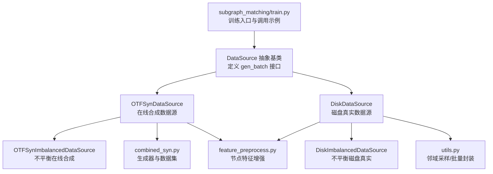
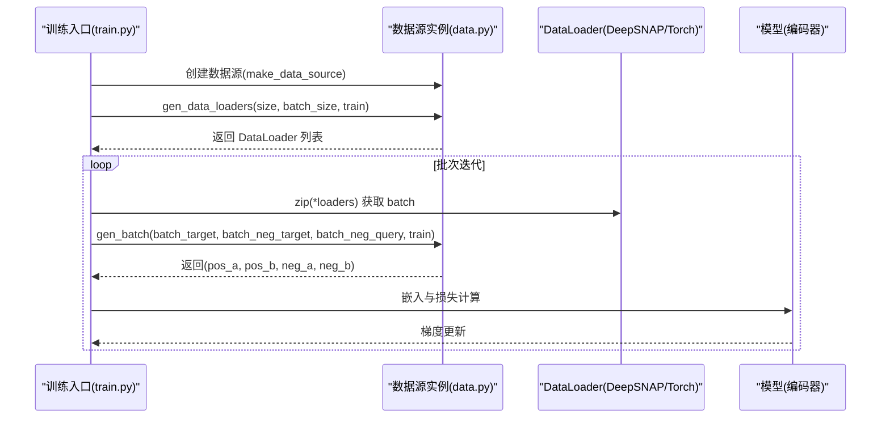
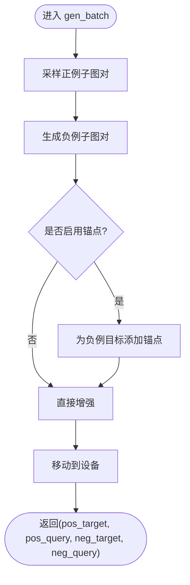
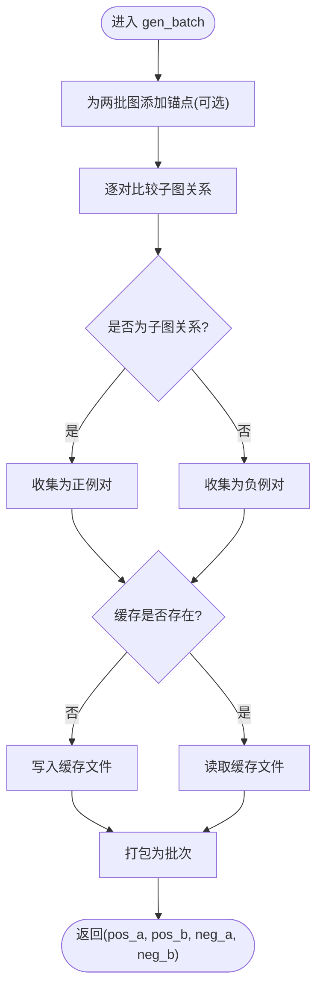
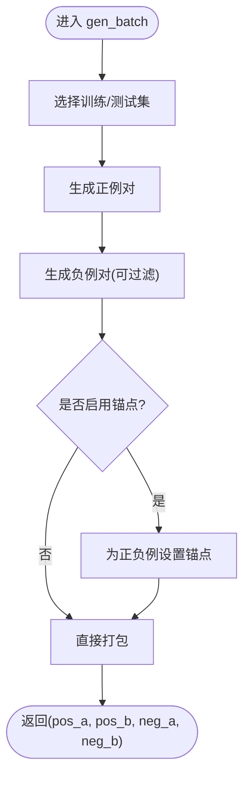
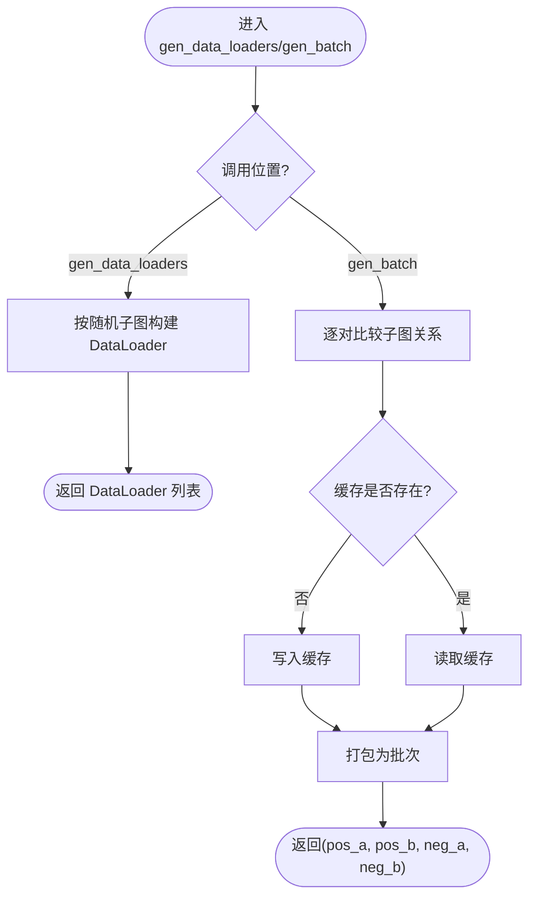
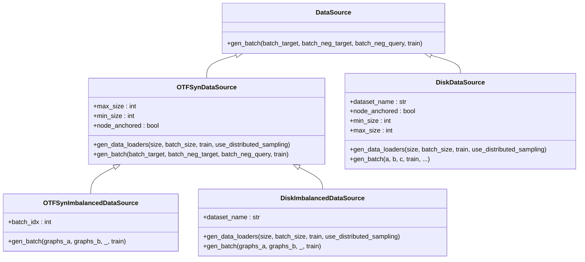
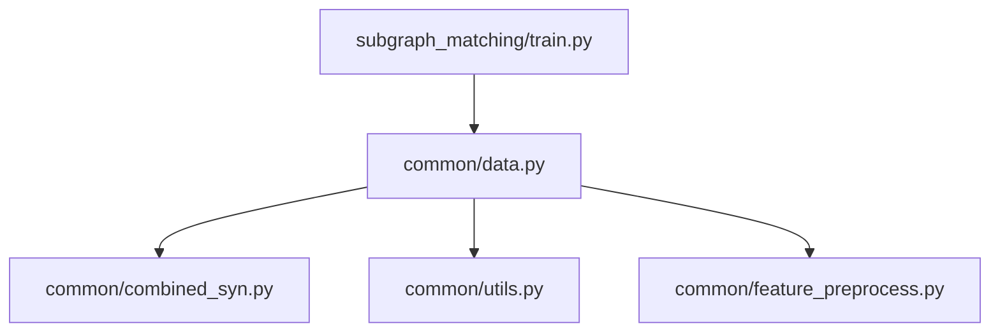

# 数据源API

<cite>
**本文引用的文件**
- [data.py](file://common/data.py)
- [combined_syn.py](file://common/combined_syn.py)
- [utils.py](file://common/utils.py)
- [feature_preprocess.py](file://common/feature_preprocess.py)
- [train.py](file://subgraph_matching/train.py)
</cite>

## 目录
1. [简介](#简介)
2. [项目结构](#项目结构)
3. [核心组件](#核心组件)
4. [架构总览](#架构总览)
5. [详细组件分析](#详细组件分析)
6. [依赖分析](#依赖分析)
7. [性能考量](#性能考量)
8. [故障排查指南](#故障排查指南)
9. [结论](#结论)
10. [附录](#附录)

## 简介
本文件为 SPMiner 项目的数据源API参考文档，聚焦于以下四类数据源类：
- DataSource 抽象基类及其 gen_batch 接口
- OTFSynDataSource 在线合成数据源
- OTFSynImbalancedDataSource 不平衡在线合成数据源
- DiskDataSource 磁盘真实数据源
- DiskImbalancedDataSource 不平衡磁盘真实数据源

文档将系统说明各数据源的接口定义、参数规范、返回值类型、采样策略、缓存机制、初始化示例、参数校验规则以及性能注意事项，并给出与训练流程结合的实际使用路径。

## 项目结构
围绕数据源API的关键文件组织如下：
- common/data.py：定义 DataSource 抽象基类与四种具体数据源实现
- common/combined_syn.py：在线合成图生成器与数据集包装
- common/utils.py：通用工具函数，如邻域采样、批量封装等
- common/feature_preprocess.py：节点特征增强模块
- subgraph_matching/train.py：训练脚本中数据源的创建与使用示例

图表来源
- [data.py:77-371](file://common/data.py#L77-L371)
- [combined_syn.py:1-134](file://common/combined_syn.py#L1-L134)
- [utils.py:18-301](file://common/utils.py#L18-L301)
- [feature_preprocess.py:186-192](file://common/feature_preprocess.py#L186-L192)
- [train.py:61-89](file://subgraph_matching/train.py#L61-L89)

章节来源
- [data.py:1-447](file://common/data.py#L1-L447)
- [combined_syn.py:1-134](file://common/combined_syn.py#L1-L134)
- [utils.py:1-302](file://common/utils.py#L1-L302)
- [feature_preprocess.py:1-229](file://common/feature_preprocess.py#L1-L229)
- [train.py:1-253](file://subgraph_matching/train.py#L1-L253)

## 核心组件
- DataSource 抽象基类
  - 定义统一的 gen_batch 接口，要求派生类实现以产出正负样本批次
- OTFSynDataSource
  - 在线合成数据源，使用 combined_syn 生成器动态产生图批次
  - 提供 gen_data_loaders 与 gen_batch 方法
- OTFSynImbalancedDataSource
  - 不平衡在线合成数据源，按对比较子图关系并缓存结果
- DiskDataSource
  - 使用磁盘上真实数据集，支持多种采样策略
  - 提供 gen_data_loaders 与 gen_batch 方法
- DiskImbalancedDataSource
  - 不平衡磁盘真实数据源，按对比较子图关系并缓存结果

章节来源
- [data.py:77-371](file://common/data.py#L77-L371)

## 架构总览
数据源与训练流程的交互如下：
- 训练入口根据命令行参数选择具体数据源类型
- 数据源生成 DataLoader 列表，训练循环中按批拉取
- 每个 batch 通过 data_source.gen_batch 获取正负样本对
- 模型对样本进行嵌入与损失计算

图表来源
- [train.py:61-89](file://subgraph_matching/train.py#L61-L89)
- [train.py:105-150](file://subgraph_matching/train.py#L105-L150)
- [data.py:98-112](file://common/data.py#L98-L112)
- [data.py:114-214](file://common/data.py#L114-L214)

## 详细组件分析

### DataSource 抽象基类
- 角色：定义统一接口，约束所有数据源的 gen_batch 行为
- gen_batch 接口
  - 输入：batch_target, batch_neg_target, batch_neg_query, train
  - 输出：由具体实现决定，典型为正负样本对的批次
  - 异常：未实现时抛出 NotImplementedError

章节来源
- [data.py:77-79](file://common/data.py#L77-L79)

### OTFSynDataSource 在线合成数据源
- 构造函数参数
  - max_size：目标子图最大节点数，默认 29
  - min_size：目标子图最小节点数，默认 5
  - n_workers：生成器工作线程数（用于生成器内部）
  - max_queue_size：生成器队列上限（用于生成器内部）
  - node_anchored：是否启用锚点节点特征
- gen_data_loaders
  - 功能：返回两个 DataLoader 列表，分别承载正样本与负样本的在线生成
  - 参数：size, batch_size, train, use_distributed_sampling
  - 返回：包含两个 DataLoader 的列表，第三个元素为占位列表
- gen_batch
  - 功能：在线生成正负样本对，应用变换与特征增强，并移动至设备
  - 输入：batch_target, batch_neg_target, batch_neg_query, train
  - 输出：pos_target, pos_query, neg_target, neg_query
  - 关键细节：
    - 子图采样策略：支持按训练阶段对小图超采样
    - 负例构造：通过在线生成器生成负例，或使用 hard negative
    - 锚点：当 node_anchored 为真时，为每张图添加锚点节点特征
    - 特征增强：使用 FeatureAugment 对节点特征进行增强
    - 设备：最终批次移动到可用设备

图表来源
- [data.py:114-214](file://common/data.py#L114-L214)
- [combined_syn.py:101-117](file://common/combined_syn.py#L101-L117)
- [feature_preprocess.py:186-192](file://common/feature_preprocess.py#L186-L192)
- [utils.py:286-301](file://common/utils.py#L286-L301)

章节来源
- [data.py:81-214](file://common/data.py#L81-L214)
- [combined_syn.py:1-134](file://common/combined_syn.py#L1-L134)
- [feature_preprocess.py:186-192](file://common/feature_preprocess.py#L186-L192)
- [utils.py:286-301](file://common/utils.py#L286-L301)

### OTFSynImbalancedDataSource 不平衡在线合成数据源
- 继承关系：OTFSynDataSource
- 特殊接口
  - gen_batch：按对比较子图关系，将满足子图关系的视为正例，否则为负例
  - 缓存机制：将每批次的比较结果序列化到 data/cache 目录，避免重复计算
  - 参数：继承父类构造参数，新增 batch_idx 用于缓存文件命名
- 使用注意
  - 首次运行会生成并缓存结果，后续运行直接读取缓存
  - 缓存文件名包含 node_anchored 与 batch_idx 标识

图表来源
- [data.py:216-269](file://common/data.py#L216-L269)
- [utils.py:286-301](file://common/utils.py#L286-L301)

章节来源
- [data.py:216-269](file://common/data.py#L216-L269)

### DiskDataSource 磁盘真实数据源
- 构造函数参数
  - dataset_name：真实数据集名称，需在 load_dataset 中支持
  - node_anchored：是否启用锚点节点特征
  - min_size：采样子图最小节点数，默认 5
  - max_size：采样子图最大节点数，默认 29
- gen_data_loaders
  - 功能：返回三个占位列表，表示磁盘数据源的批次数规划
  - 参数：size, batch_size, train, use_distributed_sampling
- gen_batch
  - 功能：从磁盘数据集中采样子图，构造正负样本对
  - 输入：a（batch_size），b，c，train，以及若干控制参数
  - 控制参数：
    - max_size：采样上限
    - min_size：采样下限
    - seed：随机种子
    - filter_negs：过滤掉负例中已经是正例的对
    - sample_method：采样策略
      - tree-pair：随机采样两个邻域，使前者为后者子集
      - subgraph-tree：先固定一个树，再在其子图中采样另一个邻域
  - 输出：pos_a, pos_b, neg_a, neg_b

图表来源
- [data.py:271-354](file://common/data.py#L271-L354)
- [utils.py:18-53](file://common/utils.py#L18-L53)
- [utils.py:286-301](file://common/utils.py#L286-L301)

章节来源
- [data.py:271-354](file://common/data.py#L271-L354)
- [utils.py:18-53](file://common/utils.py#L18-L53)
- [utils.py:286-301](file://common/utils.py#L286-L301)

### DiskImbalancedDataSource 不平衡磁盘真实数据源
- 继承关系：OTFSynDataSource
- 特殊接口
  - gen_data_loaders：从训练/测试集中按随机子图生成 DataLoader
  - gen_batch：按对比较子图关系，缓存到 data/cache，格式与不平衡在线合成一致
- 参数
  - dataset_name：真实数据集名称
  - max_size/min_size/n_workers/max_queue_size/node_anchored：继承自父类
- 缓存机制
  - 缓存文件名包含 dataset_name 与 node_anchored 标识

图表来源
- [data.py:356-429](file://common/data.py#L356-L429)
- [utils.py:286-301](file://common/utils.py#L286-L301)

章节来源
- [data.py:356-429](file://common/data.py#L356-L429)

### 类关系与依赖图

图表来源
- [data.py:77-371](file://common/data.py#L77-L371)

## 依赖分析
- 内部依赖
  - data.py 依赖 combined_syn.py（生成器）、utils.py（采样与批量封装）、feature_preprocess.py（特征增强）
  - train.py 依赖 data.py（数据源创建与使用）
- 外部依赖
  - DeepSNAP Batch/GraphDataset
  - PyTorch Geometric（TUDataset、PPI、QM9等）
  - NetworkX、NumPy、SciPy、Torch

图表来源
- [data.py:1-447](file://common/data.py#L1-L447)
- [train.py:1-253](file://subgraph_matching/train.py#L1-L253)

章节来源
- [data.py:1-447](file://common/data.py#L1-L447)
- [train.py:1-253](file://subgraph_matching/train.py#L1-L253)

## 性能考量
- 在线合成数据源
  - 生成器队列与工作线程数量影响吞吐，建议根据硬件资源调整 n_workers 与 max_queue_size
  - 训练阶段对小图超采样可提升模型泛化，但会增加计算开销
- 磁盘数据源
  - 邻域采样采用按节点数加权的图选择策略，大图更易被选中，建议合理设置 min_size 与 max_size
  - 过滤负例（filter_negs）可减少无效负例，但会增加比较成本
- 缓存机制
  - 不平衡数据源的缓存显著降低重复计算，建议首次运行后复用缓存
- 设备与特征增强
  - 批次最终移动到设备，注意显存占用
  - 特征增强会增加节点特征维度，建议根据模型容量调整增强策略

[本节为通用性能讨论，无需特定文件来源]

## 故障排查指南
- 未识别的数据集名称
  - 现象：创建 DiskDataSource/DiskImbalancedDataSource 时报错
  - 原因：dataset_name 未在 load_dataset 中支持
  - 解决：确认数据集名称拼写与 load_dataset 支持列表一致
- 采样失败或邻域不足
  - 现象：sample_neigh 循环无法达到目标 size
  - 原因：图规模过小或前沿耗尽
  - 解决：增大 min_size 或 max_size，或检查数据集质量
- 缓存文件损坏或缺失
  - 现象：读取不平衡数据源缓存失败
  - 原因：缓存文件不存在或内容异常
  - 解决：删除 data/cache 中对应文件，允许重新生成
- 设备不匹配
  - 现象：批次移动到设备时报错
  - 原因：设备不可用或类型不匹配
  - 解决：检查 utils.get_device() 返回值与模型设备一致性

章节来源
- [data.py:21-75](file://common/data.py#L21-L75)
- [utils.py:18-53](file://common/utils.py#L18-L53)
- [data.py:240-261](file://common/data.py#L240-L261)
- [utils.py:286-301](file://common/utils.py#L286-L301)

## 结论
本文档系统梳理了 SPMiner 数据源API，明确了 DataSource 抽象接口与四类具体实现的职责边界、参数规范、采样策略与缓存机制。结合训练脚本的使用示例，用户可据此正确选择与配置数据源，以获得高效且稳定的训练体验。

[本节为总结性内容，无需特定文件来源]

## 附录

### 初始化示例与参数校验
- OTFSynDataSource
  - 示例：创建实例时传入 node_anchored 控制锚点
  - 参数校验：max_size ≥ min_size；n_workers、max_queue_size 为正整数
- OTFSynImbalancedDataSource
  - 示例：继承父类参数，首次运行生成缓存
  - 参数校验：与父类一致，缓存目录存在性自动处理
- DiskDataSource
  - 示例：指定 dataset_name 与 node_anchored；可选设置 min_size、max_size
  - 参数校验：dataset_name 必须在 load_dataset 支持列表中
- DiskImbalancedDataSource
  - 示例：指定 dataset_name 与 node_anchored；可选设置 min_size、max_size
  - 参数校验：与父类一致，缓存目录存在性自动处理

章节来源
- [data.py:89-96](file://common/data.py#L89-L96)
- [data.py:224-227](file://common/data.py#L224-L227)
- [data.py:278-283](file://common/data.py#L278-L283)
- [data.py:364-371](file://common/data.py#L364-L371)
- [data.py:21-75](file://common/data.py#L21-L75)

### 实际使用路径（训练脚本）
- 数据源创建
  - 根据命令行参数选择 syn/balanced、syn/imbalanced、disk/balanced、disk/imbalanced
- DataLoader 生成
  - 调用 data_source.gen_data_loaders 生成批次数规划
- 批次生成
  - 在训练循环中调用 data_source.gen_batch 获取正负样本对
- 模型训练
  - 将样本送入模型进行嵌入与损失计算

章节来源
- [train.py:61-89](file://subgraph_matching/train.py#L61-L89)
- [train.py:105-150](file://subgraph_matching/train.py#L105-L150)
- [train.py:178-191](file://subgraph_matching/train.py#L178-L191)