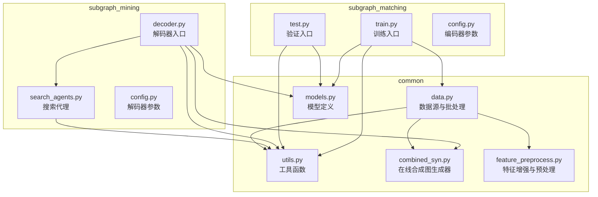
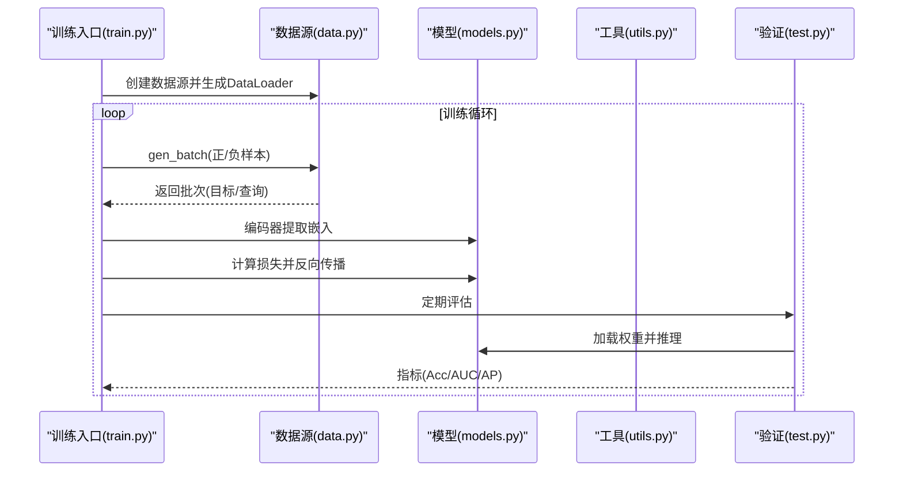
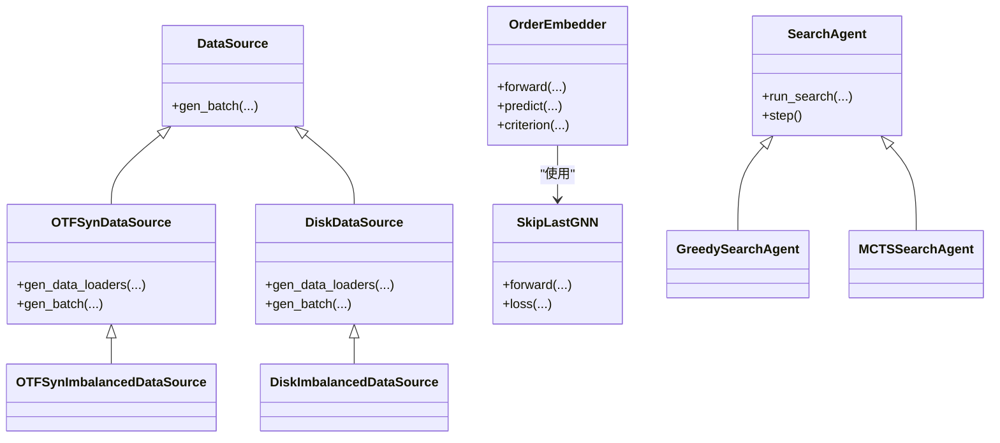

# 核心API

<cite>
**本文引用的文件**
- [common/data.py](file://common/data.py)
- [common/models.py](file://common/models.py)
- [common/utils.py](file://common/utils.py)
- [common/combined_syn.py](file://common/combined_syn.py)
- [common/feature_preprocess.py](file://common/feature_preprocess.py)
- [subgraph_matching/config.py](file://subgraph_matching/config.py)
- [subgraph_mining/config.py](file://subgraph_mining/config.py)
- [subgraph_matching/train.py](file://subgraph_matching/train.py)
- [subgraph_matching/test.py](file://subgraph_matching/test.py)
- [subgraph_mining/decoder.py](file://subgraph_mining/decoder.py)
- [subgraph_mining/search_agents.py](file://subgraph_mining/search_agents.py)
</cite>

## 目录
1. [简介](#简介)
2. [项目结构](#项目结构)
3. [核心组件](#核心组件)
4. [架构总览](#架构总览)
5. [详细组件分析](#详细组件分析)
6. [依赖关系分析](#依赖关系分析)
7. [性能考量](#性能考量)
8. [故障排查指南](#故障排查指南)
9. [结论](#结论)
10. [附录](#附录)

## 简介
本文件为 SPMiner 项目的核心API参考文档，聚焦以下三类API的完整接口规范与使用说明：
- 数据源API：OTFSynDataSource、DiskDataSource 等数据源类的方法签名、参数说明与返回值类型
- 模型API：OrderEmbedder、SkipLastGNN 等模型类的初始化参数、训练接口与推理方法
- 工具API：图操作、批处理与可视化相关的函数接口

文档还涵盖参数验证规则、异常处理机制与性能注意事项，并提供基于仓库代码的实际调用路径示例，帮助读者快速掌握最佳实践。

## 项目结构
项目采用模块化组织，核心API分布在 common 与 subgraph_* 子模块中：
- common：通用数据结构、数据源、模型与工具函数
- subgraph_matching：子图匹配（编码器）训练与测试
- subgraph_mining：子图挖掘（解码器）与搜索代理
- analyze、compare：分析与对比工具（非本文重点）

图表来源
- [common/data.py:77-430](file://common/data.py#L77-L430)
- [common/models.py:21-318](file://common/models.py#L21-L318)
- [common/utils.py:18-302](file://common/utils.py#L18-L302)
- [common/combined_syn.py:9-134](file://common/combined_syn.py#L9-L134)
- [common/feature_preprocess.py:71-230](file://common/feature_preprocess.py#L71-L230)
- [subgraph_matching/train.py:49-253](file://subgraph_matching/train.py#L49-L253)
- [subgraph_matching/test.py:11-140](file://subgraph_matching/test.py#L11-L140)
- [subgraph_mining/decoder.py:62-276](file://subgraph_mining/decoder.py#L62-L276)
- [subgraph_mining/search_agents.py:14-442](file://subgraph_mining/search_agents.py#L14-L442)

章节来源
- [common/data.py:1-447](file://common/data.py#L1-L447)
- [common/models.py:1-318](file://common/models.py#L1-L318)
- [common/utils.py:1-302](file://common/utils.py#L1-L302)
- [common/combined_syn.py:1-134](file://common/combined_syn.py#L1-L134)
- [common/feature_preprocess.py:1-230](file://common/feature_preprocess.py#L1-L230)
- [subgraph_matching/train.py:1-253](file://subgraph_matching/train.py#L1-L253)
- [subgraph_matching/test.py:1-140](file://subgraph_matching/test.py#L1-L140)
- [subgraph_mining/decoder.py:1-276](file://subgraph_mining/decoder.py#L1-L276)
- [subgraph_mining/search_agents.py:1-442](file://subgraph_mining/search_agents.py#L1-L442)

## 核心组件
本节概述三大API类别及其职责边界：
- 数据源API：负责生成训练/测试批次，支持在线合成与磁盘数据集两类来源
- 模型API：提供图嵌入编码器与判别头，支撑子图匹配与挖掘阶段
- 工具API：封装图采样、批处理、设备选择、可视化等通用能力

章节来源
- [common/data.py:77-430](file://common/data.py#L77-L430)
- [common/models.py:21-318](file://common/models.py#L21-L318)
- [common/utils.py:18-302](file://common/utils.py#L18-L302)

## 架构总览
训练与挖掘的整体流程如下：
- 训练阶段（编码器）：通过数据源生成正负样本对，编码器提取图嵌入，计算序嵌入损失并更新参数
- 推理阶段（解码器）：加载已训练模型，对候选邻域进行嵌入编码，使用搜索代理（贪心/MCTS）挖掘频繁子图

图表来源
- [subgraph_matching/train.py:91-222](file://subgraph_matching/train.py#L91-L222)
- [common/data.py:114-214](file://common/data.py#L114-L214)
- [common/models.py:46-100](file://common/models.py#L46-L100)
- [subgraph_matching/test.py:11-119](file://subgraph_matching/test.py#L11-L119)

## 详细组件分析

### 数据源API

#### OTFSynDataSource
- 类型：在线合成数据源
- 作用：动态生成正负样本对，支持节点锚定与困难负例策略
- 关键方法
  - gen_data_loaders(size, batch_size, train, use_distributed_sampling)
    - 返回：DataLoader列表（长度为3），用于并行生成批次
    - 参数验证：size/batch_size需为正整数；分布式采样仅在分布式环境下生效
    - 异常：分布式采样依赖hvd环境，未安装时需禁用
  - gen_batch(batch_target, batch_neg_target, batch_neg_query, train)
    - 返回：pos_target, pos_query, neg_target, neg_query（DeepSNAP Batch）
    - 参数验证：batch_target/batch_neg_target/batch_neg_query为Batch实例；train为布尔
    - 异常：采样失败或图为空时返回空Batch；节点锚定时需确保节点特征存在
    - 性能：使用多进程采样与缓存，建议合理设置batch_size与队列大小

- 关键参数
  - max_size/min_size：子图大小范围
  - node_anchored：是否启用节点锚定
  - n_workers/max_queue_size：采样并发与队列容量

- 示例调用路径
  - [OTFSynDataSource.gen_data_loaders:98-112](file://common/data.py#L98-L112)
  - [OTFSynDataSource.gen_batch:114-214](file://common/data.py#L114-L214)

章节来源
- [common/data.py:81-214](file://common/data.py#L81-L214)

#### OTFSynImbalancedDataSource
- 类型：不平衡在线合成数据源
- 作用：随机采样两图并判断是否为子图关系，构造不平衡正负样本
- 关键方法
  - gen_batch(graphs_a, graphs_b, _, train)
    - 返回：pos_a, pos_b, neg_a, neg_b（DeepSNAP Batch）
    - 参数验证：graphs_a/graphs_b为Batch实例；train为布尔
    - 异常：若无法加载缓存文件，将重新计算并写入缓存
    - 性能：使用缓存减少重复计算；建议控制batch_idx避免缓存膨胀

- 示例调用路径
  - [OTFSynImbalancedDataSource.gen_batch:230-269](file://common/data.py#L230-L269)

章节来源
- [common/data.py:216-269](file://common/data.py#L216-L269)

#### DiskDataSource
- 类型：磁盘数据集数据源
- 作用：从真实数据集中采样子图，构造正负样本对
- 关键方法
  - __init__(dataset_name, node_anchored, min_size, max_size)
    - 参数验证：dataset_name需在支持列表内；min_size < max_size
  - gen_data_loaders(size, batch_size, train, use_distributed_sampling)
    - 返回：DataLoader列表（长度为3）
  - gen_batch(a, b, c, train, max_size, min_size, seed, filter_negs, sample_method)
    - 返回：pos_a, pos_b, neg_a, neg_b（DeepSNAP Batch）
    - 参数验证：a为batch_size；sample_method ∈ {"tree-pair","subgraph-tree"}；seed可选
    - 异常：当filter_negs启用时，过滤掉与目标同构的负样本
    - 性能：支持多种采样策略，建议结合min_size/max_size与sample_method优化

- 示例调用路径
  - [DiskDataSource.__init__:278-283](file://common/data.py#L278-L283)
  - [DiskDataSource.gen_data_loaders:285-288](file://common/data.py#L285-L288)
  - [DiskDataSource.gen_batch:290-354](file://common/data.py#L290-L354)

章节来源
- [common/data.py:271-354](file://common/data.py#L271-L354)

#### DiskImbalancedDataSource
- 类型：不平衡磁盘数据集数据源
- 作用：与DiskDataSource类似，但采用随机采样策略构造不平衡样本
- 关键方法
  - gen_data_loaders(size, batch_size, train, use_distributed_sampling)
  - gen_batch(graphs_a, graphs_b, _, train)
    - 返回：pos_a, pos_b, neg_a, neg_b（DeepSNAP Batch）
    - 异常：与OTFSynImbalancedDataSource相同，使用缓存加速

- 示例调用路径
  - [DiskImbalancedDataSource.gen_data_loaders:373-388](file://common/data.py#L373-L388)
  - [DiskImbalancedDataSource.gen_batch:390-429](file://common/data.py#L390-L429)

章节来源
- [common/data.py:356-429](file://common/data.py#L356-L429)

#### 在线合成图生成器（combined_syn）
- 作用：提供ER/WS/BA/PowerLawCluster等图生成器，用于在线合成数据
- 关键类
  - ERGenerator、WSGenerator、BAGenerator、PowerLawClusterGenerator
  - get_generator(sizes, size_prob, dataset_len)
  - get_dataset(task, dataset_len, sizes, size_prob, **kwargs)
- 示例调用路径
  - [combined_syn.get_generator:101-111](file://common/combined_syn.py#L101-L111)
  - [combined_syn.get_dataset:113-117](file://common/combined_syn.py#L113-L117)

章节来源
- [common/combined_syn.py:1-134](file://common/combined_syn.py#L1-L134)

### 模型API

#### OrderEmbedder
- 作用：序嵌入模型，通过约束“子图嵌入应小于或等于超图嵌入”学习表达子图包含关系
- 关键方法
  - forward(emb_as, emb_bs)
    - 返回：(emb_as, emb_bs)，供predict/criterion使用
  - predict(pred)
    - 返回：违反序关系的得分张量（越小表示更可能是子图关系）
  - criterion(pred, intersect_embs, labels)
    - 返回：序嵌入损失（正例接近0，负例至少大于margin）
- 关键参数
  - margin：损失边界
  - use_intersection：是否使用交集嵌入（当前未使用）
- 示例调用路径
  - [OrderEmbedder.forward:60-62](file://common/models.py#L60-L62)
  - [OrderEmbedder.predict:64-75](file://common/models.py#L64-L75)
  - [OrderEmbedder.criterion:77-99](file://common/models.py#L77-L99)

章节来源
- [common/models.py:46-99](file://common/models.py#L46-L99)

#### SkipLastGNN
- 作用：支持skip connection的图神经网络编码器，先线性预处理，再堆叠多层消息传递，最后全图池化得到固定维度图表示
- 关键方法
  - __init__(input_dim, hidden_dim, output_dim, args)
    - 参数验证：args需包含conv_type、n_layers、dropout、skip等字段
  - forward(data)
    - 返回：图级嵌入张量
  - loss(pred, label)
    - 返回：分类损失（当前用于基线模型）
- 关键参数
  - conv_type：支持GCN/GIN/SAGE/GraphConv/GAT/Gated/PNA
  - skip：支持'all'/'learnable'/None
  - dropout：丢弃率
- 示例调用路径
  - [SkipLastGNN.__init__:107-157](file://common/models.py#L107-L157)
  - [SkipLastGNN.forward:182-226](file://common/models.py#L182-L226)

章节来源
- [common/models.py:101-226](file://common/models.py#L101-L226)

#### 自定义卷积层
- SAGEConv：GraphSAGE风格卷积，显式去除自环并在update阶段拼接中心节点特征
- GINConv：带边权支持的GIN卷积实现
- 示例调用路径
  - [SAGEConv.forward:249-262](file://common/models.py#L249-L262)
  - [GINConv.forward:303-310](file://common/models.py#L303-L310)

章节来源
- [common/models.py:231-317](file://common/models.py#L231-L317)

### 工具API

#### 图采样与批处理
- sample_neigh(graphs, size)
  - 作用：按图大小加权采样连通邻域
  - 返回：(graph, neigh_nodes)
  - 参数验证：size为正整数；graphs为NetworkX图列表
- batch_nx_graphs(graphs, anchors=None)
  - 作用：将NetworkX图转换为PyG Batch并进行特征增强与设备迁移
  - 返回：DeepSNAP Batch
  - 参数验证：anchors可选；节点锚定时需提供锚点
- 示例调用路径
  - [utils.sample_neigh:18-53](file://common/utils.py#L18-L53)
  - [utils.batch_nx_graphs:286-301](file://common/utils.py#L286-L301)

章节来源
- [common/utils.py:18-301](file://common/utils.py#L18-L301)

#### 设备与优化器
- get_device()
  - 作用：懒加载运行设备（优先CUDA）
  - 返回：torch.device
- parse_optimizer(parser) / build_optimizer(args, params)
  - 作用：注册与创建优化器及调度器
  - 支持：Adam/SGD/RMSprop/Adagrad；Step/Cosine退火
- 示例调用路径
  - [utils.get_device:236-243](file://common/utils.py#L236-L243)
  - [utils.parse_optimizer:245-264](file://common/utils.py#L245-L264)
  - [utils.build_optimizer:265-284](file://common/utils.py#L265-L284)

章节来源
- [common/utils.py:235-284](file://common/utils.py#L235-L284)

#### 特征增强与预处理
- FeatureAugment
  - 作用：对节点特征进行增强（度、介数中心性、路径长、PageRank、聚类系数、身份矩阵谱等）
  - 方法：augment(dataset)
- Preprocess
  - 作用：特征拼接/相加预处理，调整输出维度
  - 方法：forward(batch)
- 示例调用路径
  - [feature_preprocess.FeatureAugment.augment:186-192](file://common/feature_preprocess.py#L186-L192)
  - [feature_preprocess.Preprocess.forward:216-229](file://common/feature_preprocess.py#L216-L229)

章节来源
- [common/feature_preprocess.py:71-230](file://common/feature_preprocess.py#L71-L230)

#### 解码器与搜索代理
- 解码器入口：decoder.py
  - pattern_growth(dataset, task, args)
    - 作用：加载模型、采样邻域、编码嵌入、调用搜索代理、输出可视化与序列化结果
- 搜索代理：search_agents.py
  - SearchAgent：抽象基类，定义run_search主循环与候选嵌入缓存
  - GreedySearchAgent：贪心搜索，支持counts/margin/hybrid三种排名策略
  - MCTSSearchAgent：MCTS搜索，使用UCT准则探索
- 示例调用路径
  - [decoder.pattern_growth:62-171](file://subgraph_mining/decoder.py#L62-L171)
  - [search_agents.SearchAgent.run_search:54-67](file://subgraph_mining/search_agents.py#L54-L67)
  - [search_agents.GreedySearchAgent.step:329-394](file://subgraph_mining/search_agents.py#L329-L394)
  - [search_agents.MCTSSearchAgent.step:166-266](file://subgraph_mining/search_agents.py#L166-L266)

章节来源
- [subgraph_mining/decoder.py:62-171](file://subgraph_mining/decoder.py#L62-L171)
- [subgraph_mining/search_agents.py:14-442](file://subgraph_mining/search_agents.py#L14-L442)

## 依赖关系分析

图表来源
- [common/data.py:77-430](file://common/data.py#L77-L430)
- [common/models.py:46-226](file://common/models.py#L46-L226)
- [subgraph_mining/search_agents.py:14-442](file://subgraph_mining/search_agents.py#L14-L442)

章节来源
- [common/data.py:77-430](file://common/data.py#L77-L430)
- [common/models.py:46-226](file://common/models.py#L46-L226)
- [subgraph_mining/search_agents.py:14-442](file://subgraph_mining/search_agents.py#L14-L442)

## 性能考量
- 数据源
  - OTFSynDataSource：合理设置n_workers与max_queue_size，避免内存与CPU瓶颈
  - DiskDataSource：min_size/max_size与sample_method影响采样效率，建议结合任务规模调参
- 模型
  - SkipLastGNN：n_layers与skip策略影响计算复杂度；PNA/GraphConv等conv_type对性能有差异
  - OrderEmbedder：margin设置影响收敛速度与稳定性
- 工具
  - batch_nx_graphs：特征增强与设备迁移为I/O密集步骤，建议批量处理与缓存
  - SearchAgent：候选嵌入缓存可显著降低重复计算；frontier_top_k用于剪枝加速

[本节为通用指导，无需特定文件来源]

## 故障排查指南
- 数据源异常
  - 未识别的dataset：检查dataset_name是否在支持列表内
  - 分布式采样报错：确认hvd环境已正确初始化
  - 缓存文件缺失：首次运行时会自动生成缓存，注意目录权限
- 模型异常
  - 设备不匹配：确保模型与数据在同一设备上；使用get_device()统一设备
  - 参数缺失：确认args包含conv_type、n_layers、dropout、skip等必需字段
- 工具异常
  - 优化器/调度器：检查opt/opt_scheduler配置；确保参数名与默认值一致
  - 图采样失败：确认graphs非空且size合法；必要时增大min_size或调整采样策略

章节来源
- [common/data.py:77-430](file://common/data.py#L77-L430)
- [common/utils.py:235-284](file://common/utils.py#L235-L284)
- [subgraph_mining/decoder.py:197-276](file://subgraph_mining/decoder.py#L197-L276)

## 结论
本文系统梳理了SPMiner的核心API，覆盖数据源、模型与工具三大类，并结合训练与挖掘流程展示了各组件的协作关系。通过参数验证规则、异常处理机制与性能考量的说明，读者可据此在实际工程中安全高效地使用这些API。

[本节为总结性内容，无需特定文件来源]

## 附录

### 参数与默认值速查
- 训练参数（编码器）
  - conv_type：SAGE（默认）
  - method_type：order（默认）
  - dataset：syn（默认）
  - n_layers：8（默认）
  - batch_size：64（默认）
  - hidden_dim：64（默认）
  - skip："learnable"（默认）
  - dropout：0.0（默认）
  - n_batches：1000000（默认）
  - opt：adam（默认）
  - opt_scheduler：none（默认）
  - opt_restart：100（默认）
  - weight_decay：0.0（默认）
  - lr：1e-4（默认）
  - margin：0.1（默认）
  - test_set：空字符串（默认）
  - eval_interval：1000（默认）
  - n_workers：4（默认）
  - model_path："ckpt/model.pt"（默认）
  - tag：空字符串（默认）
  - val_size：4096（默认）
  - node_anchored：True（默认）
- 挖掘参数（解码器）
  - sample_method："tree"（默认）
  - motif_dataset：空字符串（默认）
  - radius：3（默认）
  - subgraph_sample_size：0（默认）
  - out_path："results/out-patterns.p"（默认）
  - n_clusters：空（默认）
  - min_pattern_size：5（默认）
  - max_pattern_size：20（默认）
  - min_neighborhood_size：20（默认）
  - max_neighborhood_size：29（默认）
  - n_neighborhoods：10000（默认）
  - n_trials：1000（默认）
  - out_batch_size：10（默认）
  - frontier_top_k：5（默认）
  - analyze：False（默认）
  - search_strategy："greedy"（默认）
  - use_whole_graphs：False（默认）

章节来源
- [subgraph_matching/config.py:14-77](file://subgraph_matching/config.py#L14-L77)
- [subgraph_mining/config.py:13-59](file://subgraph_mining/config.py#L13-L59)