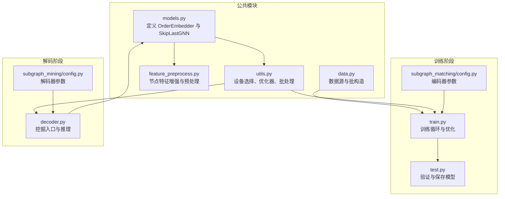
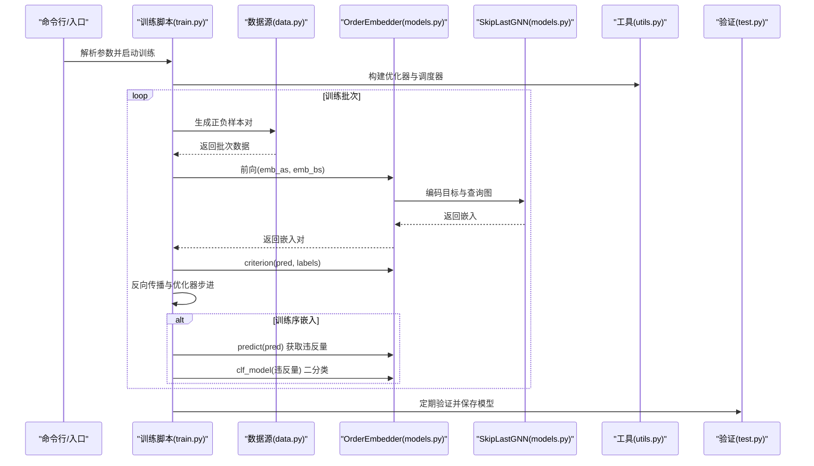
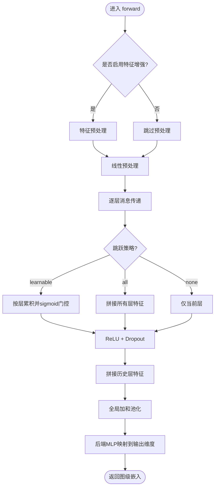
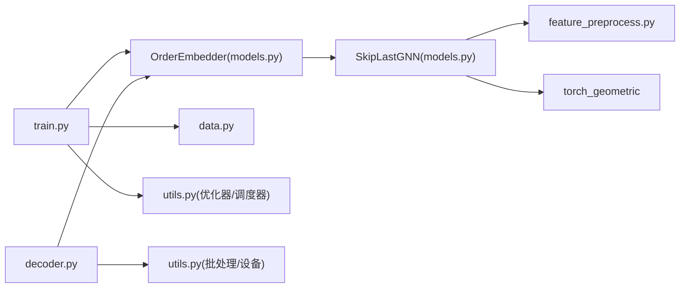

# 模型API

<cite>
**本文引用的文件**
- [models.py](file://common/models.py)
- [data.py](file://common/data.py)
- [utils.py](file://common/utils.py)
- [feature_preprocess.py](file://common/feature_preprocess.py)
- [decoder.py](file://subgraph_mining/decoder.py)
- [config.py](file://subgraph_mining/config.py)
- [train.py](file://subgraph_matching/train.py)
- [test.py](file://subgraph_matching/test.py)
- [config.py](file://subgraph_matching/config.py)
</cite>

## 目录
1. [简介](#简介)
2. [项目结构](#项目结构)
3. [核心组件](#核心组件)
4. [架构总览](#架构总览)
5. [详细组件分析](#详细组件分析)
6. [依赖分析](#依赖分析)
7. [性能考虑](#性能考虑)
8. [故障排查指南](#故障排查指南)
9. [结论](#结论)
10. [附录](#附录)

## 简介
本文件为 SPMiner 项目中模型API的权威参考，聚焦以下内容：
- OrderEmbedder 序嵌入模型的完整接口：初始化参数、forward 方法输入输出规范、训练接口与推理方法。
- SkipLastGNN 支持跳跃连接的图神经网络架构：网络层配置、特征传递机制、输出格式。
- 参数验证规则、设备管理（GPU/CPU）、内存优化策略。
- 模型保存与加载接口：权重文件格式与兼容性要求。
- 训练完整API使用示例：损失函数计算、反向传播与梯度更新。
- 推理接口使用方法：批量预测与单样本预测的区别。
- 性能调优建议与最佳实践。

## 项目结构
本项目围绕“编码器（子图匹配）+ 解码器（子图挖掘）”两阶段展开，模型API主要位于 common/models.py，训练与推理分别在 subgraph_matching 与 subgraph_mining 下的脚本中使用。

图表来源
- [models.py:1-318](file://common/models.py#L1-L318)
- [utils.py:235-302](file://common/utils.py#L235-L302)
- [feature_preprocess.py:1-230](file://common/feature_preprocess.py#L1-L230)
- [data.py:1-447](file://common/data.py#L1-L447)
- [train.py:1-253](file://subgraph_matching/train.py#L1-L253)
- [test.py:1-140](file://subgraph_matching/test.py#L1-L140)
- [config.py:1-82](file://subgraph_matching/config.py#L1-L82)
- [decoder.py:1-276](file://subgraph_mining/decoder.py#L1-L276)
- [config.py:1-65](file://subgraph_mining/config.py#L1-L65)

章节来源
- [models.py:1-318](file://common/models.py#L1-L318)
- [train.py:1-253](file://subgraph_matching/train.py#L1-L253)
- [decoder.py:1-276](file://subgraph_mining/decoder.py#L1-L276)

## 核心组件
- OrderEmbedder：序嵌入模型，通过约束“子图嵌入应小于或等于超图嵌入”学习表达子图包含关系的空间。其内部封装 SkipLastGNN 作为图编码器，并提供 predict/criterion 用于训练与推理。
- SkipLastGNN：支持跳跃连接的图神经网络编码器，具备可配置的卷积类型、层数、跳跃策略与特征增强，最终输出固定维度的图级嵌入。

章节来源
- [models.py:46-100](file://common/models.py#L46-L100)
- [models.py:101-226](file://common/models.py#L101-L226)

## 架构总览
训练与推理的关键交互如下：

图表来源
- [train.py:91-151](file://subgraph_matching/train.py#L91-L151)
- [data.py:77-214](file://common/data.py#L77-L214)
- [models.py:46-100](file://common/models.py#L46-L100)
- [models.py:101-226](file://common/models.py#L101-L226)
- [utils.py:265-284](file://common/utils.py#L265-L284)
- [test.py:11-118](file://subgraph_matching/test.py#L11-L118)

## 详细组件分析

### OrderEmbedder 接口规范
- 初始化参数
  - input_dim: 输入节点特征维度（在训练入口中传入1，实际由特征增强模块决定最终维度）。
  - hidden_dim: 隐层维度，用于 SkipLastGNN 的中间与输出维度。
  - args: 命令行参数对象，包含 margin、dropout、n_layers、conv_type、skip 等。
- forward 输入输出
  - 输入: (emb_as, emb_bs)，即两个图的嵌入向量。
  - 输出: 原样返回 (emb_as, emb_bs)，供 predict/criterion 使用。
- predict
  - 输入: forward 输出的嵌入对 (emb_as, emb_bs)。
  - 输出: 每对图的违反序关系程度（向量），用于二分类或阈值判定。
- criterion
  - 输入: pred（forward 输出）、intersect_embs（未使用）、labels（每对图的子图标签，1表示 a 是 b 的子图，0 否则）。
  - 输出: 序嵌入损失，正例最小化违反量，负例强制违反量不低于 margin。

章节来源
- [models.py:46-100](file://common/models.py#L46-L100)

### SkipLastGNN 架构与接口
- 初始化参数
  - input_dim: 节点特征维度（经特征增强后可能变化）。
  - hidden_dim: 隐层维度。
  - output_dim: 输出嵌入维度。
  - args: 包含 conv_type、n_layers、dropout、skip 等。
- 特征增强
  - 若启用特征增强，先对节点特征进行预处理，最终维度由 Preprocess 模块决定。
- 卷积层配置
  - 支持 GCN、GIN、SAGE、graph、GAT、gated、PNA 等类型，通过 build_conv_model 动态选择。
  - PNA 模式下分别构建 sum/mean/max 三种卷积分支。
- 跳跃连接
  - 支持 skip='all'、'learnable'、None。learnable 时引入可学习的门控参数，按层累积特征。
- 前向传播
  - 线性预处理 -> 多层消息传递 -> ReLU/ Dropout -> 全图池化 -> MLP -> 输出固定维度嵌入。
- 输出格式
  - 返回形状为 [B, output_dim] 的图级嵌入向量。

图表来源
- [models.py:101-226](file://common/models.py#L101-L226)
- [feature_preprocess.py:194-230](file://common/feature_preprocess.py#L194-L230)

章节来源
- [models.py:101-226](file://common/models.py#L101-L226)
- [feature_preprocess.py:194-230](file://common/feature_preprocess.py#L194-L230)

### 设备管理与内存优化
- 设备选择
  - 通过 utils.get_device() 懒加载优先使用 CUDA 的设备，否则回退到 CPU。
  - 所有模型与数据在训练/推理前均移动至相同设备。
- 内存优化
  - 训练中使用 torch.no_grad() 在验证阶段减少显存占用。
  - 使用全局加和池化替代全局平均池化，有助于稳定梯度。
  - Dropout 与层间拼接在训练时开启，推理时关闭。

章节来源
- [utils.py:235-244](file://common/utils.py#L235-L244)
- [train.py:116-134](file://subgraph_matching/train.py#L116-L134)
- [test.py:20-41](file://subgraph_matching/test.py#L20-L41)
- [models.py:222-226](file://common/models.py#L222-L226)

### 训练接口与API使用示例
- 训练入口
  - 训练脚本负责构建模型、数据源、优化器与调度器，并在多进程环境中周期性生成批次进行训练。
- 关键步骤
  - 生成正负样本对（来自 OTFSynDataSource/DiskDataSource）。
  - 使用模型的 emb_model 编码目标与查询图，得到嵌入。
  - 调用 model(emb_as, emb_bs) 获取嵌入对，随后 model.criterion(pred, labels) 计算损失。
  - 反向传播与优化器步进；若为序嵌入模型，还需对违反量进行二分类训练。
  - 定期验证并保存模型权重。
- 示例流程（文字描述）
  - 准备数据源与模型：构建 OrderEmbedder，移动到设备。
  - 生成批次：调用 data_source.gen_batch 获取正负样本对。
  - 嵌入编码：model.emb_model(正负样本) 得到嵌入。
  - 前向与损失：model(emb_as, emb_bs) -> model.criterion(...)。
  - 反向传播：loss.backward() -> 优化器步进。
  - 可选：对违反量进行二分类训练（序嵌入模型）。
  - 保存：torch.save(model.state_dict(), args.model_path)。

章节来源
- [train.py:49-151](file://subgraph_matching/train.py#L49-L151)
- [data.py:77-214](file://common/data.py#L77-L214)
- [test.py:11-118](file://subgraph_matching/test.py#L11-L118)

### 推理接口与批量/单样本预测
- 批量预测
  - 解码器入口将候选邻域批量编码为嵌入，随后交由搜索代理进行模式挖掘。
  - 使用 torch.no_grad() 与模型 eval()，并将嵌入移回 CPU 以便后续处理。
- 单样本预测
  - 通过 utils.batch_nx_graphs 将单个图转换为批数据，再调用 model.emb_model 获取嵌入。
- 区别
  - 批量预测强调吞吐与内存效率；单样本预测强调灵活性与易用性。

章节来源
- [decoder.py:139-151](file://subgraph_mining/decoder.py#L139-L151)
- [utils.py:286-302](file://common/utils.py#L286-L302)

### 模型保存与加载
- 保存
  - 使用 torch.save(model.state_dict(), args.model_path) 保存权重文件。
- 加载
  - 使用 torch.load(args.model_path, map_location=utils.get_device()) 加载权重。
  - 训练/解码阶段均需将权重映射到当前设备。
- 文件格式
  - PyTorch state_dict 格式，包含模型各模块参数张量。
- 兼容性
  - 保持 args.conv_type、n_layers、hidden_dim、skip 等关键参数一致，以确保权重兼容。

章节来源
- [test.py:117-118](file://subgraph_matching/test.py#L117-L118)
- [decoder.py:79-82](file://subgraph_mining/decoder.py#L79-L82)
- [train.py:56-58](file://subgraph_matching/train.py#L56-L58)

## 依赖分析
- 模型依赖
  - OrderEmbedder 依赖 SkipLastGNN 作为编码器。
  - SkipLastGNN 依赖 feature_preprocess 进行特征增强，依赖 torch_geometric 进行消息传递与池化。
- 训练与推理依赖
  - 训练脚本依赖 utils 构建优化器与调度器、数据源模块生成批次。
  - 解码器依赖 utils 批处理与设备管理，依赖搜索代理进行模式挖掘。

图表来源
- [models.py:46-226](file://common/models.py#L46-L226)
- [feature_preprocess.py:1-230](file://common/feature_preprocess.py#L1-L230)
- [train.py:1-253](file://subgraph_matching/train.py#L1-L253)
- [decoder.py:1-276](file://subgraph_mining/decoder.py#L1-L276)
- [utils.py:265-302](file://common/utils.py#L265-L302)
- [data.py:1-447](file://common/data.py#L1-L447)

章节来源
- [models.py:46-226](file://common/models.py#L46-L226)
- [train.py:1-253](file://subgraph_matching/train.py#L1-L253)
- [decoder.py:1-276](file://subgraph_mining/decoder.py#L1-L276)

## 性能考虑
- 层配置
  - 建议使用 SAGE 卷积与 learnable 跳跃策略，提升表达能力与稳定性。
  - n_layers 建议 8 层，hidden_dim 64，dropout 0.0 以稳定训练。
- 设备与批大小
  - 优先使用 GPU；若显存不足，适当降低 batch_size 或使用 torch.no_grad() 进行验证。
- 优化器与学习率
  - Adam 优化器配合较小学习率（如 1e-4），必要时启用权重衰减。
- 损失与阈值
  - margin 建议 0.1；在不平衡数据上可结合困难负例采样与阈值调整。
- 推理吞吐
  - 批量推理时尽量对齐 batch_size，避免余数导致的额外开销。

[本节为通用性能建议，无需特定文件来源]

## 故障排查指南
- 设备不匹配
  - 症状：CUDA OOM 或 CPU 过慢。
  - 处理：确认 utils.get_device() 返回预期设备；检查模型与数据是否在同一设备。
- 权重不兼容
  - 症状：加载权重时报错或精度异常。
  - 处理：确保 conv_type、n_layers、hidden_dim、skip 等参数与训练时一致。
- 梯度爆炸/消失
  - 症状：loss NaN 或收敛缓慢。
  - 处理：启用梯度裁剪（clip_grad_norm）、调整学习率、减少 n_layers 或增加 dropout。
- 内存泄漏
  - 症状：长时间运行后显存增长。
  - 处理：在验证阶段使用 torch.no_grad()，及时将张量移回 CPU。

章节来源
- [utils.py:235-244](file://common/utils.py#L235-L244)
- [train.py:129-134](file://subgraph_matching/train.py#L129-L134)
- [test.py:117-118](file://subgraph_matching/test.py#L117-L118)

## 结论
本文系统梳理了 SPMiner 的模型API，重点覆盖了 OrderEmbedder 与 SkipLastGNN 的接口、训练与推理流程、设备与内存优化、保存与加载策略，并提供了性能调优建议。遵循本文档可高效地完成模型训练、部署与推理。

[本节为总结性内容，无需特定文件来源]

## 附录

### 参数与默认值速查
- 编码器参数（训练/测试）
  - conv_type: 卷积类型（默认 SAGE）
  - method_type: 嵌入类型（默认 order）
  - n_layers: 卷积层数（默认 8）
  - hidden_dim: 隐层维度（默认 64）
  - skip: 跳跃策略（默认 learnable）
  - dropout: Dropout 比率（默认 0.0）
  - batch_size: 批大小（默认 64）
  - n_batches: 训练批次数（默认 1000000）
  - margin: 损失 margin（默认 0.1）
  - dataset: 数据集（默认 syn）
  - model_path: 模型保存路径（默认 ckpt/model.pt）
  - opt_scheduler: 优化器调度器（默认 none）
  - node_anchored: 是否使用节点锚定（默认 True）
- 解码器参数（挖掘）
  - sample_method: 采样方式（tree/radial）
  - radius: 邻域半径（默认 3）
  - subgraph_sample_size: 每邻域采样节点数（默认 0）
  - n_neighborhoods: 邻域数量（默认 10000）
  - n_trials: 搜索试验次数（默认 1000）
  - search_strategy: 搜索策略（默认 greedy）
  - out_batch_size: 每种图大小输出数量（默认 10）
  - frontier_top_k: 剪枝保留数量（默认 5）

章节来源
- [config.py:15-77](file://subgraph_matching/config.py#L15-L77)
- [config.py:14-59](file://subgraph_mining/config.py#L14-L59)