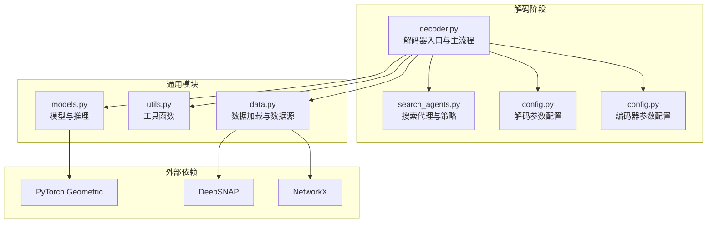
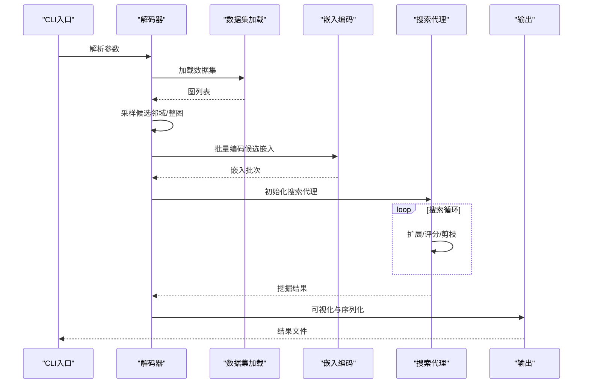
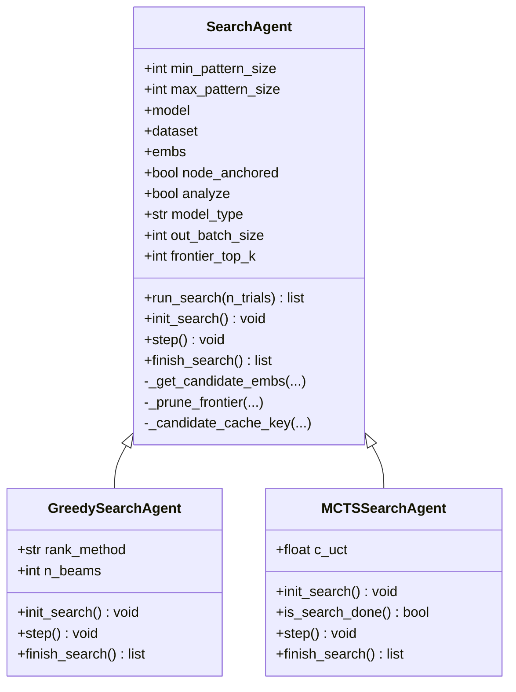
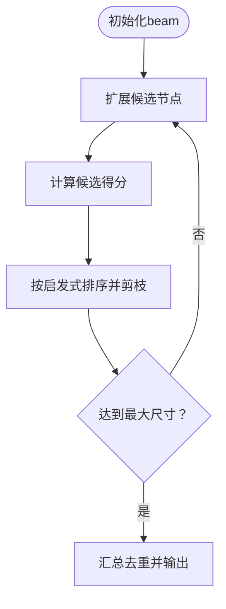
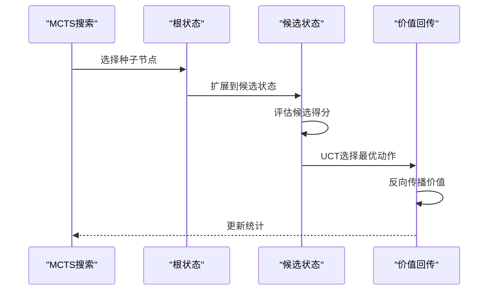
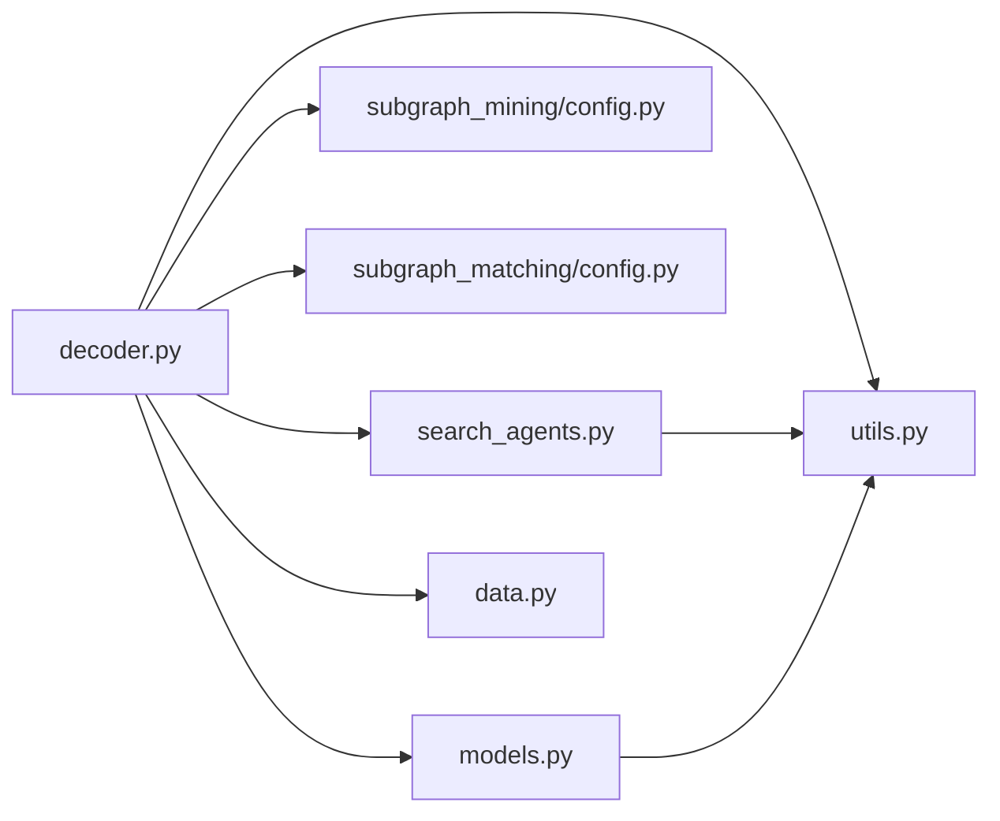

# 解码API

<cite>
**本文档引用的文件**
- [decoder.py](file://subgraph_mining/decoder.py)
- [search_agents.py](file://subgraph_mining/search_agents.py)
- [config.py](file://subgraph_mining/config.py)
- [config.py](file://subgraph_matching/config.py)
- [models.py](file://common/models.py)
- [utils.py](file://common/utils.py)
- [data.py](file://common/data.py)
- [README.md](file://README.md)
</cite>

## 目录
1. [简介](#简介)
2. [项目结构](#项目结构)
3. [核心组件](#核心组件)
4. [架构总览](#架构总览)
5. [详细组件分析](#详细组件分析)
6. [依赖分析](#依赖分析)
7. [性能考量](#性能考量)
8. [故障排查指南](#故障排查指南)
9. [结论](#结论)
10. [附录](#附录)

## 简介
本文件为子图挖掘解码系统的API参考文档，聚焦于解码器入口的接口规范与数据流，涵盖数据集加载、模型推理与结果输出的完整流程。文档详细说明搜索算法API的设计与参数配置，包括SearchAgent基类、GreedySearchAgent与MCTSSearchAgent的接口与行为差异；解释解码配置API的使用方法，包括搜索参数、算法配置与性能调优；并提供搜索策略API的详细说明与实际使用示例。

## 项目结构
解码系统位于子图挖掘模块，围绕以下关键文件组织：
- 解码入口与主流程：subgraph_mining/decoder.py
- 搜索代理与策略：subgraph_mining/search_agents.py
- 解码参数配置：subgraph_mining/config.py
- 编码器参数配置：subgraph_matching/config.py
- 模型与推理：common/models.py
- 通用工具与数据加载：common/utils.py、common/data.py
- 项目总体说明：README.md

图表来源
- [decoder.py:197-276](file://subgraph_mining/decoder.py#L197-L276)
- [search_agents.py:14-442](file://subgraph_mining/search_agents.py#L14-L442)
- [config.py:4-65](file://subgraph_mining/config.py#L4-L65)
- [config.py:4-82](file://subgraph_matching/config.py#L4-L82)
- [models.py:1-318](file://common/models.py#L1-L318)
- [utils.py:1-302](file://common/utils.py#L1-L302)
- [data.py:1-447](file://common/data.py#L1-L447)

章节来源
- [decoder.py:197-276](file://subgraph_mining/decoder.py#L197-L276)
- [README.md:30-62](file://README.md#L30-L62)

## 核心组件
- 解码器入口与主流程：负责参数解析、数据集加载、候选邻域采样、嵌入编码、搜索策略执行与结果输出。
- 搜索代理基类：定义统一的搜索接口与通用能力（候选嵌入缓存、前沿剪枝、WL哈希等）。
- 贪心搜索代理：基于beam搜索与启发式评分的贪心扩展。
- 蒙特卡洛树搜索代理：基于UCT准则的MCTS扩展与回传。
- 模型与推理：提供图嵌入编码器与匹配模型，支撑候选模式的打分。
- 通用工具：邻域采样、WL哈希、批处理、设备管理等。

章节来源
- [decoder.py:62-171](file://subgraph_mining/decoder.py#L62-L171)
- [search_agents.py:14-128](file://subgraph_mining/search_agents.py#L14-L128)
- [models.py:22-100](file://common/models.py#L22-L100)
- [utils.py:18-96](file://common/utils.py#L18-L96)

## 架构总览
解码API的调用链路如下：
- CLI入口解析编码器与解码器参数
- 加载目标数据集并统一为NetworkX图列表
- 采样候选邻域或整图，构建候选集合
- 批量编码候选邻域嵌入
- 选择搜索策略（贪心或MCTS），执行搜索
- 输出可视化与序列化结果

图表来源
- [decoder.py:208-271](file://subgraph_mining/decoder.py#L208-L271)
- [decoder.py:128-171](file://subgraph_mining/decoder.py#L128-L171)
- [search_agents.py:54-68](file://subgraph_mining/search_agents.py#L54-L68)

## 详细组件分析

### 解码器入口与主流程
- 参数解析：合并编码器与解码器参数，设置默认值与数据集映射。
- 数据集加载：支持TUDataset、PPI、本地边列表等多种数据源，统一转换为NetworkX图。
- 候选采样：支持“树形”和“辐射形”两种采样策略，可控制邻域半径、采样规模与是否使用整图。
- 嵌入编码：将候选邻域批量转换为DeepSNAP Batch，调用模型的嵌入编码器生成嵌入。
- 搜索策略：根据配置选择贪心或MCTS代理，执行搜索并返回高频模式。
- 结果输出：保存图像与pickle序列化结果。

章节来源
- [decoder.py:208-271](file://subgraph_mining/decoder.py#L208-L271)
- [decoder.py:128-171](file://subgraph_mining/decoder.py#L128-L171)
- [decoder.py:175-196](file://subgraph_mining/decoder.py#L175-L196)

### 搜索代理基类（SearchAgent）
- 角色：抽象搜索策略的通用骨架，提供候选嵌入缓存、前沿剪枝、WL哈希去重等通用能力。
- 关键接口：
  - run_search：统一的搜索主循环，调用init_search、is_search_done、step、finish_search。
  - init_search/step/is_search_done/finish_search：由子类实现具体策略。
  - _get_candidate_embs：批量获取候选子图嵌入并缓存，避免重复计算。
  - _prune_frontier：按节点度数剪枝，保留前K个前沿候选。
  - _candidate_cache_key：生成候选子图稳定缓存键，支持锚定节点。

图表来源
- [search_agents.py:14-128](file://subgraph_mining/search_agents.py#L14-L128)
- [search_agents.py:284-442](file://subgraph_mining/search_agents.py#L284-L442)
- [search_agents.py:129-283](file://subgraph_mining/search_agents.py#L129-L283)

章节来源
- [search_agents.py:14-128](file://subgraph_mining/search_agents.py#L14-L128)

### 贪心搜索代理（GreedySearchAgent）
- 目标：在每一步贪心地选择下一个节点，使模式尽可能频繁。
- 关键特性：
  - beam搜索：维护多个候选扩展路径，按启发式分数排序，保留前n_beams条路径。
  - 启发式评分：支持“计数”“margin”“混合”三种策略，分别基于历史计数、模型margin分数或二者结合。
  - 模型类型兼容：支持“order”“mlp”“end2end”等模型类型，分别采用不同的打分方式。
  - 锚定节点：支持节点锚定模式，锚定节点在后续扩展中保持不变。
- 输出：按尺寸聚合去重后的高频模式，输出到results目录。

图表来源
- [search_agents.py:284-442](file://subgraph_mining/search_agents.py#L284-L442)
- [search_agents.py:329-395](file://subgraph_mining/search_agents.py#L329-L395)

章节来源
- [search_agents.py:284-442](file://subgraph_mining/search_agents.py#L284-L442)

### 蒙特卡洛树搜索代理（MCTSSearchAgent）
- 目标：使用MCTS在搜索空间中探索，通过UCT准则平衡探索与利用。
- 关键特性：
  - 种子节点选择：基于已有访问统计与UCT分数选择最佳种子，或随机选择新种子。
  - 状态表示：使用WL哈希对状态进行去重与计数。
  - 价值回传：将末端评分沿路径累计，更新访问次数与累积价值。
  - 前沿剪枝：每步保留度数最高的前K个候选节点。
- 输出：按访问次数统计，输出每种尺寸的高频模式。

图表来源
- [search_agents.py:129-283](file://subgraph_mining/search_agents.py#L129-L283)
- [search_agents.py:166-266](file://subgraph_mining/search_agents.py#L166-L266)

章节来源
- [search_agents.py:129-283](file://subgraph_mining/search_agents.py#L129-L283)

### 模型与推理
- 模型类型：
  - OrderEmbedder：序嵌入模型，通过约束“子图嵌入应小于或等于超图嵌入”学习包含关系空间。
  - BaselineMLP：双图拼接分类基线，直接拼接两个图的嵌入后送入MLP。
  - SkipLastGNN：支持skip connection的GNN编码器，提供多种卷积类型与池化。
- 推理接口：
  - emb_model：图嵌入编码器，返回固定维度的图表示。
  - predict：对图对嵌入进行打分，用于贪心或MCTS的评分。
  - criterion：损失函数，支持序嵌入的margin损失。

章节来源
- [models.py:22-100](file://common/models.py#L22-L100)
- [models.py:101-227](file://common/models.py#L101-L227)

### 通用工具与数据加载
- 邻域采样：按图大小加权采样连通邻域，支持前沿扩展直至目标尺寸。
- WL哈希：计算图的WL风格哈希签名，用于结构去重与计数。
- 批处理：将NetworkX图批量转换为DeepSNAP Batch，支持节点锚定特征注入。
- 设备管理：懒加载运行设备（优先CUDA），统一张量与模型设备。

章节来源
- [utils.py:18-96](file://common/utils.py#L18-L96)
- [utils.py:286-302](file://common/utils.py#L286-L302)
- [data.py:21-75](file://common/data.py#L21-L75)

## 依赖分析
- 解码器依赖：
  - 搜索代理：GreedySearchAgent与MCTSSearchAgent继承SearchAgent，共享候选嵌入缓存与前沿剪枝。
  - 模型：OrderEmbedder/BaselineMLP/SkipLastGNN，提供嵌入编码与打分。
  - 工具：utils提供采样、WL哈希、批处理与设备管理。
  - 数据源：支持TUDataset、PPI与本地边列表，统一转换为NetworkX图。
- 参数耦合：
  - 解码参数与编码器参数通过CLI合并，部分参数如method_type、model_path、hidden_dim在解码阶段复用。
  - 搜索策略与模型类型需匹配（例如MCTS要求order模型）。

图表来源
- [decoder.py:15-17](file://subgraph_mining/decoder.py#L15-L17)
- [search_agents.py:4](file://subgraph_mining/search_agents.py#L4)
- [config.py:4-65](file://subgraph_mining/config.py#L4-L65)
- [config.py:4-82](file://subgraph_matching/config.py#L4-L82)
- [models.py:18-20](file://common/models.py#L18-L20)
- [utils.py:1-16](file://common/utils.py#L1-L16)
- [data.py:17-19](file://common/data.py#L17-L19)

章节来源
- [decoder.py:15-17](file://subgraph_mining/decoder.py#L15-L17)
- [search_agents.py:4](file://subgraph_mining/search_agents.py#L4)
- [config.py:4-65](file://subgraph_mining/config.py#L4-L65)
- [config.py:4-82](file://subgraph_matching/config.py#L4-L82)
- [models.py:18-20](file://common/models.py#L18-L20)
- [utils.py:1-16](file://common/utils.py#L1-L16)
- [data.py:17-19](file://common/data.py#L17-L19)

## 性能考量
- 候选采样规模：n_neighborhoods与n_trials直接影响时间复杂度，建议先用较小规模验证流程。
- 批处理大小：batch_size越大，嵌入编码效率越高，但需注意显存限制。
- 前沿剪枝：frontier_top_k可显著减少每步扩展候选数量，提高速度。
- 模型类型：order模型在MCTS中更适用，mlp模型在贪心中提供更快的打分。
- 设备选择：优先使用GPU，utils提供懒加载设备管理，避免重复初始化。

章节来源
- [config.py:30-59](file://subgraph_mining/config.py#L30-L59)
- [decoder.py:139-152](file://subgraph_mining/decoder.py#L139-L152)
- [utils.py:235-243](file://common/utils.py#L235-L243)

## 故障排查指南
- 找不到数据文件：确保Facebook/AS-733等数据集对应的边列表文件存在于data/目录。
- 挖掘过慢：减小n_neighborhoods、n_trials、batch_size；开启frontier_top_k剪枝。
- MCTS报错：确认method_type为order，MCTS仅支持order模型。
- 设备不可用：检查CUDA与PyTorch版本匹配，确保torch.cuda.is_available()为真。
- 结果为空：检查模型checkpoint路径与method_type一致性，确认嵌入编码成功。

章节来源
- [decoder.py:238-269](file://subgraph_mining/decoder.py#L238-L269)
- [decoder.py:158-169](file://subgraph_mining/decoder.py#L158-L169)
- [utils.py:235-243](file://common/utils.py#L235-L243)

## 结论
解码API通过清晰的参数配置、统一的数据流与可插拔的搜索策略，实现了从候选邻域到高频模式的高效挖掘。SearchAgent基类提供了通用能力，GreedySearchAgent与MCTSSearchAgent分别适用于不同场景：贪心策略快速稳定，MCTS策略更具探索性。结合合理的参数调优与设备配置，可在真实数据集上获得高质量的频繁子图模式。

## 附录

### 解码配置API使用说明
- 基本参数
  - dataset：目标数据集名称，支持TUDataset、PPI与本地边列表。
  - model_path：训练好的匹配模型checkpoint路径。
  - n_neighborhoods：采样邻域数量。
  - batch_size：嵌入编码批大小。
  - n_trials：搜索试验次数。
  - out_path：输出结果文件路径。
  - search_strategy：搜索策略，"greedy"或"mcts"。
  - frontier_top_k：每步保留的前沿候选数量，0表示不剪枝。
  - radius：邻域半径。
  - sample_method：采样方式，"tree"或"radial"。
  - min_pattern_size/max_pattern_size：模式最小/最大尺寸。
  - node_anchored：是否使用节点锚定。
- 默认值与推荐
  - 默认out_path="results/out-patterns.p"，batch_size=1000，n_trials=1000，radius=3，frontier_top_k=5，search_strategy="greedy"，min_pattern_size=5，max_pattern_size=20。

章节来源
- [config.py:14-59](file://subgraph_mining/config.py#L14-L59)
- [README.md:244-260](file://README.md#L244-L260)

### 搜索策略API说明
- 贪心策略（GreedySearchAgent）
  - rank_method：支持"counts"（计数）、"margin"（margin分数）、"hybrid"（混合）。
  - n_beams：beam宽度，控制每步扩展路径数量。
  - model_type：与模型一致，支持"order"、"mlp"、"end2end"。
- 蒙特卡洛树搜索（MCTSSearchAgent）
  - c_uct：UCT探索常数。
  - 仅支持"order"模型类型。
- 通用参数
  - node_anchored：是否锚定节点。
  - analyze：是否启用分析可视化。
  - out_batch_size：每种尺寸输出的模式数量。

章节来源
- [search_agents.py:284-442](file://subgraph_mining/search_agents.py#L284-L442)
- [search_agents.py:129-283](file://subgraph_mining/search_agents.py#L129-L283)

### 实际使用示例
- 训练子图匹配模型（示例命令见README）
- 运行频繁子图挖掘（以ENZYMES为例）
  - 基本命令：python -m subgraph_mining.decoder --dataset=enzymes --node_anchored
  - 调参示例：python -m subgraph_mining.decoder --dataset=facebook --node_anchored --model_path results/facebook_train_big.pt --n_neighborhoods 50 --batch_size 50 --n_trials 5 --out_path results/facebook_patterns_big.p
- 结果查看
  - 图像输出：plots/cluster/下的PNG与PDF文件。
  - 序列化结果：results/out-patterns.p或自定义out_path。

章节来源
- [README.md:151-163](file://README.md#L151-L163)
- [README.md:329-333](file://README.md#L329-L333)
- [decoder.py:175-196](file://subgraph_mining/decoder.py#L175-L196)