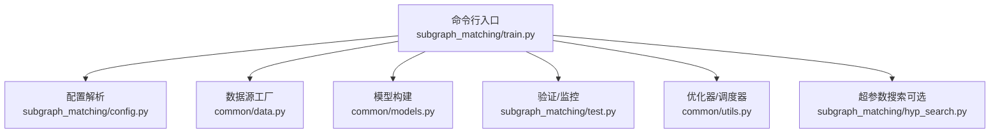
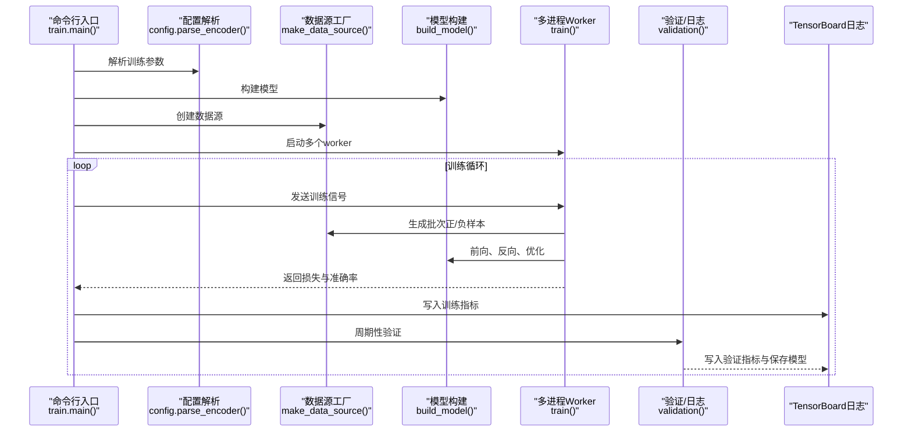
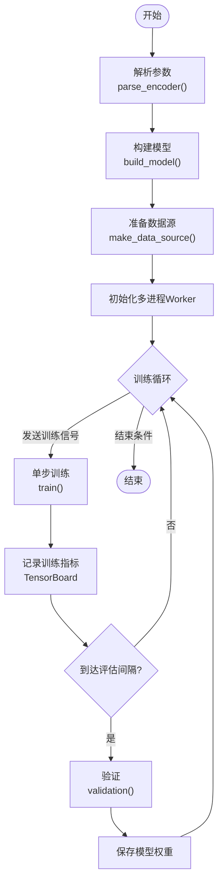
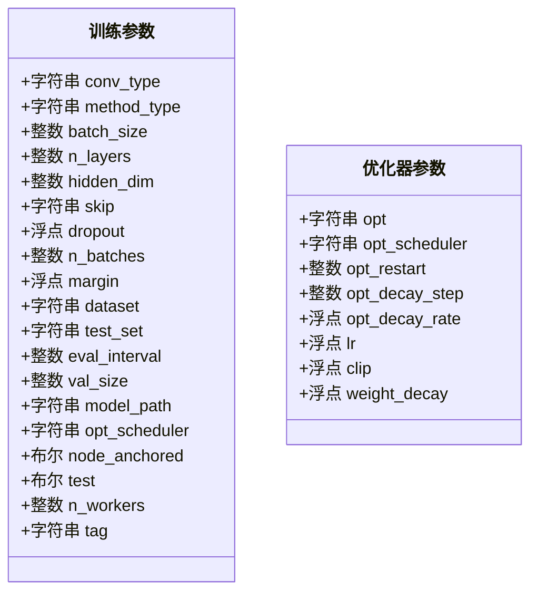
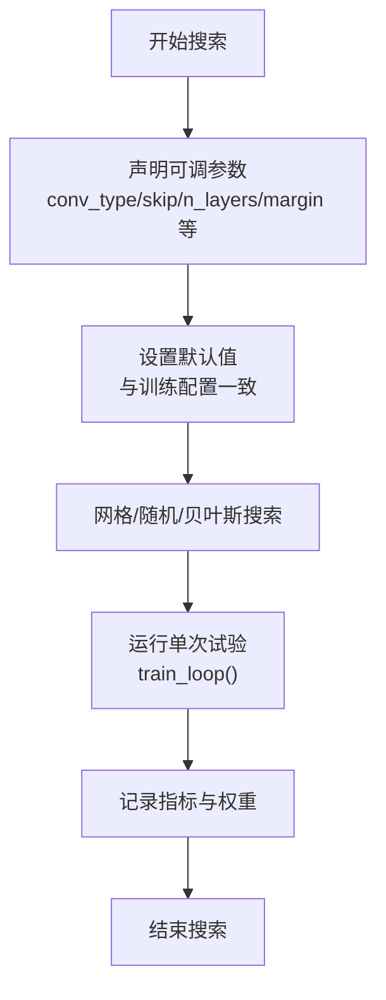
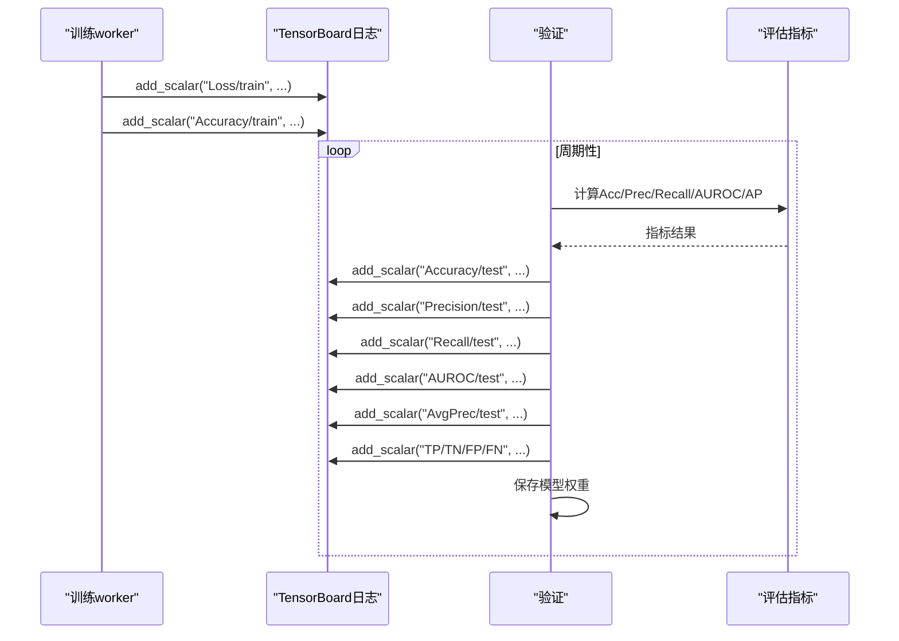
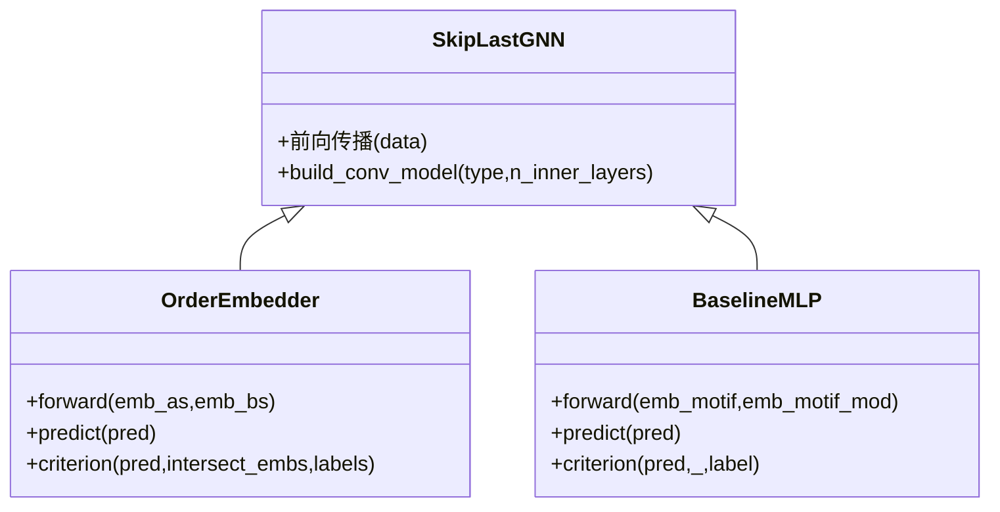
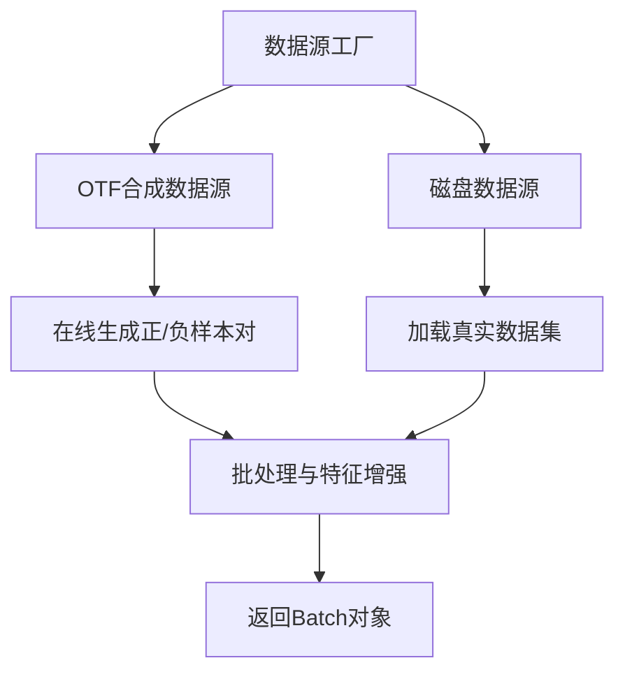
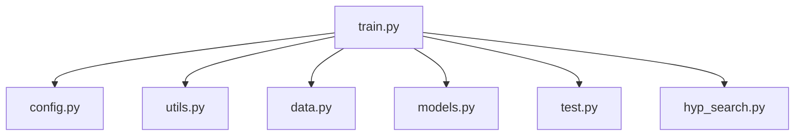

# 训练API

<cite>
**本文引用的文件**
- [subgraph_matching/train.py](file://subgraph_matching/train.py)
- [subgraph_matching/config.py](file://subgraph_matching/config.py)
- [subgraph_matching/hyp_search.py](file://subgraph_matching/hyp_search.py)
- [subgraph_matching/test.py](file://subgraph_matching/test.py)
- [common/models.py](file://common/models.py)
- [common/data.py](file://common/data.py)
- [common/utils.py](file://common/utils.py)
- [run.sh](file://run.sh)
- [environment.yml](file://environment.yml)
</cite>

## 目录
1. [简介](#简介)
2. [项目结构](#项目结构)
3. [核心组件](#核心组件)
4. [架构总览](#架构总览)
5. [详细组件分析](#详细组件分析)
6. [依赖分析](#依赖分析)
7. [性能考虑](#性能考虑)
8. [故障排查指南](#故障排查指南)
9. [结论](#结论)
10. [附录](#附录)

## 简介
本文件为子图匹配训练系统的训练API参考文档，覆盖以下内容：
- 训练入口点的命令行参数与配置选项
- 训练流程控制与多进程训练循环
- 训练配置API的参数设置（超参数、模型配置、训练参数）
- 超参数搜索API的使用方法（网格搜索、随机搜索、贝叶斯优化）
- 训练监控API（损失函数、评估指标、日志记录）
- 完整的训练流程示例与参数调优最佳实践

## 项目结构
训练系统围绕“训练入口”“配置解析”“数据源”“模型”“验证/监控”等模块组织，采用命令行驱动与多进程并行的训练范式。

**图表来源**
- [subgraph_matching/train.py:1-253](file://subgraph_matching/train.py#L1-L253)
- [subgraph_matching/config.py:1-82](file://subgraph_matching/config.py#L1-L82)
- [common/data.py:1-447](file://common/data.py#L1-L447)
- [common/models.py:1-318](file://common/models.py#L1-L318)
- [common/utils.py:1-302](file://common/utils.py#L1-L302)
- [subgraph_matching/hyp_search.py:1-83](file://subgraph_matching/hyp_search.py#L1-L83)
- [subgraph_matching/test.py:1-140](file://subgraph_matching/test.py#L1-L140)

**章节来源**
- [subgraph_matching/train.py:1-253](file://subgraph_matching/train.py#L1-L253)
- [subgraph_matching/config.py:1-82](file://subgraph_matching/config.py#L1-L82)
- [common/data.py:1-447](file://common/data.py#L1-L447)
- [common/models.py:1-318](file://common/models.py#L1-L318)
- [common/utils.py:1-302](file://common/utils.py#L1-L302)
- [subgraph_matching/hyp_search.py:1-83](file://subgraph_matching/hyp_search.py#L1-L83)
- [subgraph_matching/test.py:1-140](file://subgraph_matching/test.py#L1-L140)

## 核心组件
- 训练入口与主循环：负责解析参数、构建模型、准备数据、多进程训练、周期性验证与日志记录。
- 训练配置API：提供编码器训练所需的超参数、优化器与调度器、数据集与采样策略等配置。
- 超参数搜索API：提供网格搜索、随机搜索、贝叶斯优化等搜索策略的参数声明与默认值。
- 训练监控API：提供验证阶段的指标计算与TensorBoard日志写入。
- 模型与数据：封装图嵌入模型（SkipLastGNN、OrderEmbedder、BaselineMLP）、多种数据源（合成/真实/不平衡）与批处理工具。

**章节来源**
- [subgraph_matching/train.py:91-222](file://subgraph_matching/train.py#L91-L222)
- [subgraph_matching/config.py:4-82](file://subgraph_matching/config.py#L4-L82)
- [subgraph_matching/hyp_search.py:1-83](file://subgraph_matching/hyp_search.py#L1-L83)
- [subgraph_matching/test.py:11-119](file://subgraph_matching/test.py#L11-L119)
- [common/models.py:22-100](file://common/models.py#L22-L100)
- [common/data.py:77-429](file://common/data.py#L77-L429)
- [common/utils.py:245-284](file://common/utils.py#L245-L284)

## 架构总览
训练系统采用“命令行入口 + 参数解析 + 数据源 + 模型 + 多进程worker + 验证/日志”的流水线式架构。

**图表来源**
- [subgraph_matching/train.py:223-253](file://subgraph_matching/train.py#L223-L253)
- [subgraph_matching/train.py:152-222](file://subgraph_matching/train.py#L152-L222)
- [subgraph_matching/train.py:91-151](file://subgraph_matching/train.py#L91-L151)
- [subgraph_matching/test.py:11-119](file://subgraph_matching/test.py#L11-L119)

## 详细组件分析

### 训练入口与主流程
- 入口函数支持两种模式：正常训练与测试模式（仅验证不更新参数）。
- 支持超参数搜索入口（需开启开关），通过TestTube进行网格搜索。
- 主循环负责：
  - 初始化日志器（TensorBoard）
  - 构建模型并共享内存
  - 准备固定测试点
  - 启动多进程worker并周期性评估
  - 在非测试模式下保存模型权重

**图表来源**
- [subgraph_matching/train.py:223-253](file://subgraph_matching/train.py#L223-L253)
- [subgraph_matching/train.py:152-222](file://subgraph_matching/train.py#L152-L222)
- [subgraph_matching/train.py:91-151](file://subgraph_matching/train.py#L91-L151)

**章节来源**
- [subgraph_matching/train.py:223-253](file://subgraph_matching/train.py#L223-L253)
- [subgraph_matching/train.py:152-222](file://subgraph_matching/train.py#L152-L222)
- [subgraph_matching/train.py:91-151](file://subgraph_matching/train.py#L91-L151)

### 训练配置API（命令行参数与默认值）
- 编码器训练参数（通过解析器注册）：
  - 卷积类型、嵌入类型、批大小、层数、隐藏维度、skip连接策略、dropout、训练小批次数、margin、数据集、测试集、评估频率、验证集大小、模型保存/加载路径、优化器调度器、节点锚定、测试模式、worker数量、运行标签等。
- 默认值偏向稳定训练：SAGE卷积 + order embedding + 适当的学习率与margin。
- 优化器与调度器参数：
  - 优化器类型、学习率、权重衰减、梯度裁剪、调度器类型、重启步数、衰减步长与比率等。

**图表来源**
- [subgraph_matching/config.py:18-77](file://subgraph_matching/config.py#L18-L77)
- [common/utils.py:245-284](file://common/utils.py#L245-L284)

**章节来源**
- [subgraph_matching/config.py:4-82](file://subgraph_matching/config.py#L4-L82)
- [common/utils.py:245-284](file://common/utils.py#L245-L284)

### 超参数搜索API
- 支持TestTube网格搜索策略，可声明可调参数与不可调参数。
- 可调参数示例：卷积类型、skip策略、嵌入类型、层数、margin等。
- 不可调参数示例：内部层数、最大图尺寸、训练小批次数、数据集类型、节点锚定等。
- 默认值与训练配置保持一致，便于直接替换。

**图表来源**
- [subgraph_matching/hyp_search.py:1-83](file://subgraph_matching/hyp_search.py#L1-L83)
- [subgraph_matching/train.py:243-249](file://subgraph_matching/train.py#L243-L249)

**章节来源**
- [subgraph_matching/hyp_search.py:1-83](file://subgraph_matching/hyp_search.py#L1-L83)
- [subgraph_matching/train.py:243-249](file://subgraph_matching/train.py#L243-L249)

### 训练监控API（损失、指标与日志）
- 训练阶段：
  - 记录训练损失与准确率到TensorBoard。
  - 每个batch输出简要进度。
- 验证阶段：
  - 计算准确率、精确率、召回率、AUROC、平均精度等指标。
  - 写入TensorBoard验证指标并保存模型权重。
  - 可选保存PR曲线图像。

**图表来源**
- [subgraph_matching/train.py:213-216](file://subgraph_matching/train.py#L213-L216)
- [subgraph_matching/test.py:11-119](file://subgraph_matching/test.py#L11-L119)

**章节来源**
- [subgraph_matching/train.py:213-216](file://subgraph_matching/train.py#L213-L216)
- [subgraph_matching/test.py:11-119](file://subgraph_matching/test.py#L11-L119)

### 模型与损失函数
- 模型：
  - SkipLastGNN：支持多种卷积类型（SAGE/GIN/GCN/GAT/GraphConv/Gated/PNA），可选learnable/all/last skip连接。
  - OrderEmbedder：基于“子图嵌入序关系”的损失，返回违反量并可进一步分类。
  - BaselineMLP：拼接双图嵌入后用MLP分类，用于对比。
- 损失函数：
  - 训练损失为序关系损失（正例最小化违反量，负例强制违反量不低于margin）。
  - 可选二分类头（order模型）用于将违反量映射为概率。

**图表来源**
- [common/models.py:101-227](file://common/models.py#L101-L227)
- [common/models.py:46-100](file://common/models.py#L46-L100)
- [common/models.py:22-44](file://common/models.py#L22-L44)

**章节来源**
- [common/models.py:101-227](file://common/models.py#L101-L227)
- [common/models.py:46-100](file://common/models.py#L46-L100)
- [common/models.py:22-44](file://common/models.py#L22-L44)

### 数据源与批处理
- 数据源工厂：
  - 合成数据源（平衡/不平衡）：在线生成正/负样本对，支持节点锚定。
  - 真实数据源（平衡/不平衡）：从磁盘数据集加载，支持多种图数据集。
- 批处理工具：
  - 将NetworkX图转换为PyG Batch，支持特征增强与设备迁移。
  - 支持分布式采样（HVD）与节点锚定。

**图表来源**
- [common/data.py:81-429](file://common/data.py#L81-L429)
- [common/utils.py:286-301](file://common/utils.py#L286-L301)

**章节来源**
- [common/data.py:81-429](file://common/data.py#L81-L429)
- [common/utils.py:286-301](file://common/utils.py#L286-L301)

## 依赖分析
- 训练入口依赖：
  - 配置解析（训练参数与优化器参数）
  - 数据源工厂（合成/真实/不平衡）
  - 模型构建（SkipLastGNN/OrderEmbedder/BaselineMLP）
  - 验证与日志（TensorBoard）
  - 可选超参数搜索（TestTube）
- 关键耦合点：
  - 训练循环与验证流程通过队列通信协调多进程worker。
  - 模型与数据源解耦，便于替换与扩展。

**图表来源**
- [subgraph_matching/train.py:1-47](file://subgraph_matching/train.py#L1-L47)
- [subgraph_matching/config.py:1-3](file://subgraph_matching/config.py#L1-L3)
- [common/utils.py:1-16](file://common/utils.py#L1-L16)
- [common/data.py:1-20](file://common/data.py#L1-L20)
- [common/models.py:1-20](file://common/models.py#L1-L20)
- [subgraph_matching/test.py:1-7](file://subgraph_matching/test.py#L1-L7)
- [subgraph_matching/hyp_search.py:1-4](file://subgraph_matching/hyp_search.py#L1-L4)

**章节来源**
- [subgraph_matching/train.py:1-47](file://subgraph_matching/train.py#L1-L47)
- [subgraph_matching/config.py:1-3](file://subgraph_matching/config.py#L1-L3)
- [common/utils.py:1-16](file://common/utils.py#L1-L16)
- [common/data.py:1-20](file://common/data.py#L1-L20)
- [common/models.py:1-20](file://common/models.py#L1-L20)
- [subgraph_matching/test.py:1-7](file://subgraph_matching/test.py#L1-L7)
- [subgraph_matching/hyp_search.py:1-4](file://subgraph_matching/hyp_search.py#L1-L4)

## 性能考虑
- 多进程并行：通过多进程worker并行生成训练步，提升吞吐。
- 设备选择：自动选择CUDA或CPU，建议在GPU上运行以加速训练。
- 梯度裁剪：防止梯度爆炸，提高稳定性。
- 评估频率：合理设置评估间隔，平衡训练速度与收敛监控。
- 数据源缓存：不平衡数据源支持缓存正/负样本对，减少重复计算。

[本节为通用指导，无需特定文件来源]

## 故障排查指南
- 训练不收敛或发散：
  - 检查学习率与优化器设置，尝试降低学习率或切换优化器。
  - 调整margin与dropout，避免过度拟合。
- GPU显存不足：
  - 降低batch_size或n_layers，或关闭节点锚定。
- 验证指标异常：
  - 检查数据源是否正确（平衡/不平衡），确认测试集划分。
  - 查看TensorBoard日志，定位异常波动。
- 超参数搜索失败：
  - 确认TestTube可用，检查可调参数范围与默认值。
  - 限制搜索空间，先网格搜索少量组合。

**章节来源**
- [common/utils.py:265-284](file://common/utils.py#L265-L284)
- [subgraph_matching/test.py:11-119](file://subgraph_matching/test.py#L11-L119)
- [subgraph_matching/hyp_search.py:1-83](file://subgraph_matching/hyp_search.py#L1-L83)

## 结论
本训练API提供了从命令行参数到模型训练、验证与日志的完整闭环，支持多进程并行与可选的超参数搜索。通过清晰的参数体系与监控指标，用户可以高效地完成子图匹配模型的训练与调优。

[本节为总结，无需特定文件来源]

## 附录

### 命令行入口与运行方式
- 直接运行训练入口：
  - 使用脚本或直接调用模块入口。
- 环境准备：
  - 使用提供的环境文件安装依赖（PyTorch、PyG、DeepSnap、scikit-learn、TensorBoard等）。

**章节来源**
- [run.sh:1-2](file://run.sh#L1-L2)
- [environment.yml:1-129](file://environment.yml#L1-L129)

### 训练流程最佳实践
- 参数调优顺序建议：
  - 先确定卷积类型与层数，再调整隐藏维度与dropout。
  - 使用较小的margin与学习率起步，逐步扩大搜索空间。
- 数据与采样：
  - 在不平衡场景下，优先使用不平衡数据源并缓存正/负样本对。
  - 节点锚定有助于提升子图匹配的判别能力。
- 监控与保存：
  - 设置合理的评估频率，关注AUROC与平均精度。
  - 定期保存模型权重，便于中断恢复与后期微调。

[本节为通用指导，无需特定文件来源]