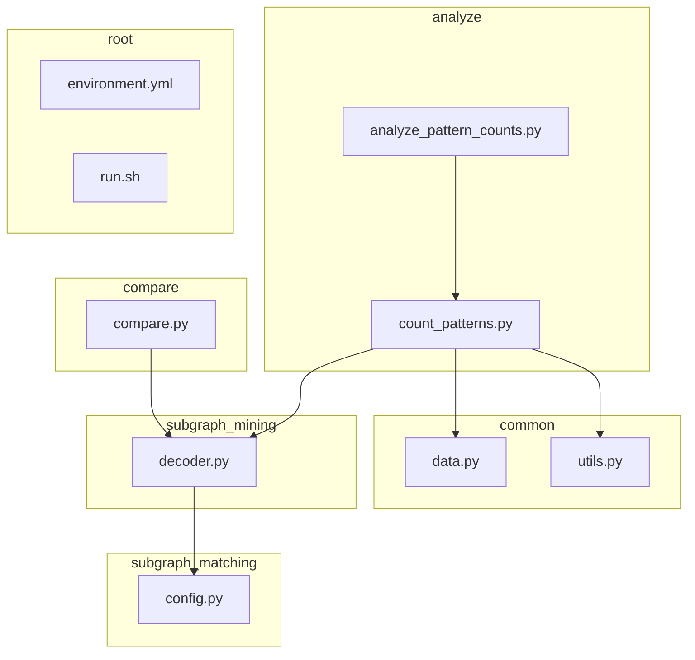
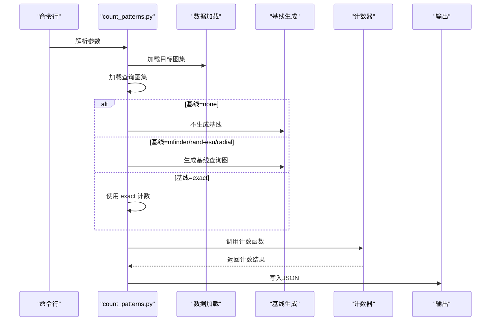
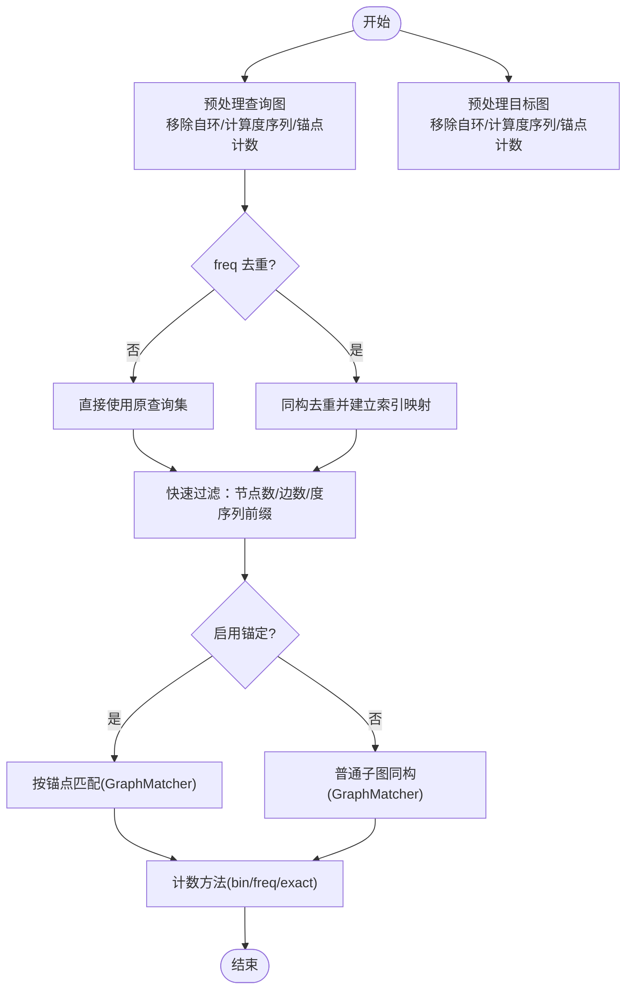
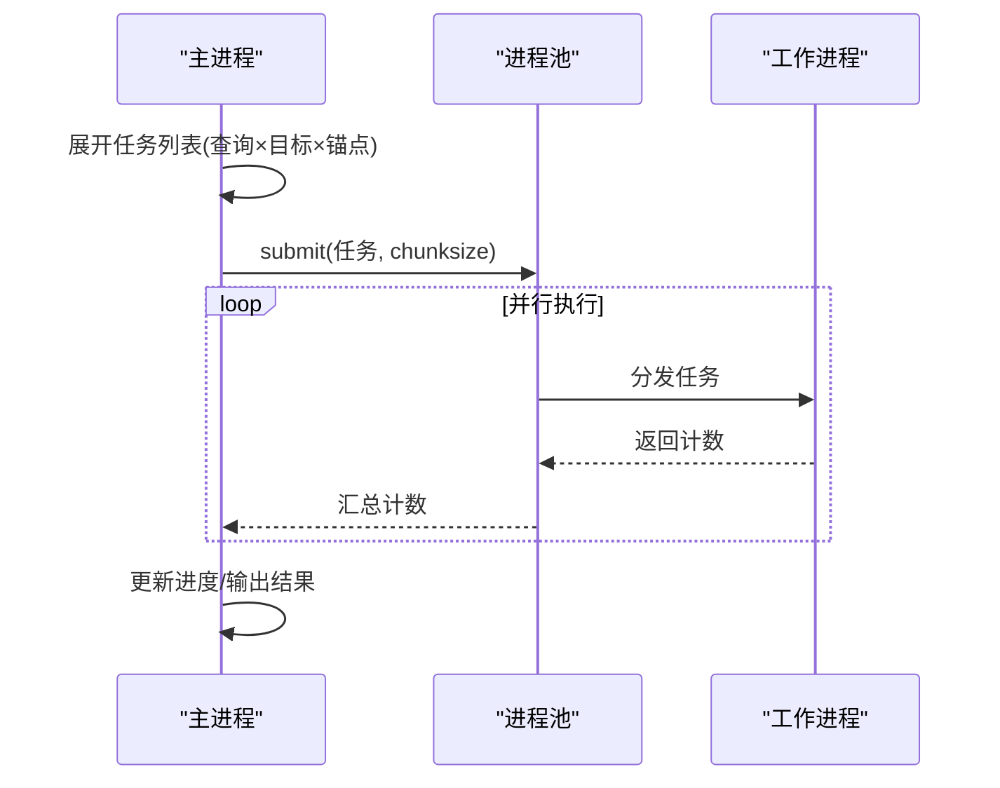
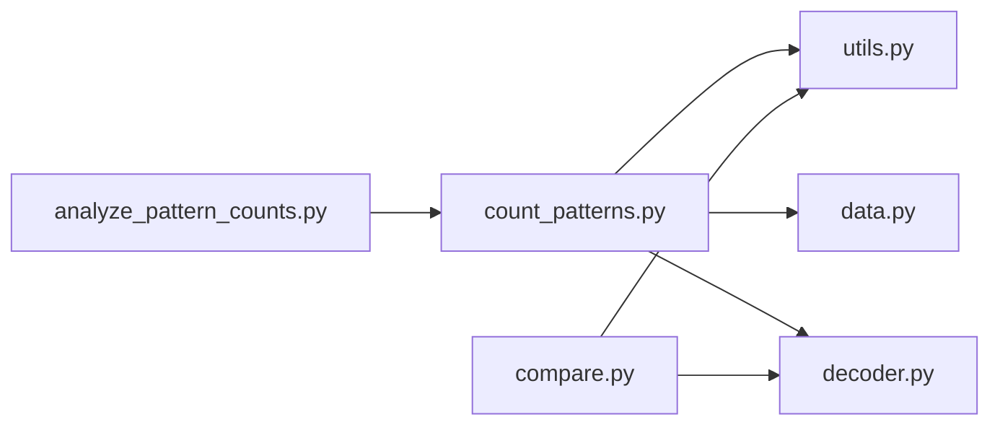

# 模式统计工具

<cite>
**本文引用的文件**
- [count_patterns.py](file://analyze/count_patterns.py)
- [analyze_pattern_counts.py](file://analyze/analyze_pattern_counts.py)
- [utils.py](file://common/utils.py)
- [data.py](file://common/data.py)
- [decoder.py](file://subgraph_mining/decoder.py)
- [config.py](file://subgraph_matching/config.py)
- [compare.py](file://compare/compare.py)
- [environment.yml](file://environment.yml)
- [run.sh](file://run.sh)
</cite>

## 目录
1. [简介](#简介)
2. [项目结构](#项目结构)
3. [核心组件](#核心组件)
4. [架构总览](#架构总览)
5. [详细组件分析](#详细组件分析)
6. [依赖关系分析](#依赖关系分析)
7. [性能考量](#性能考量)
8. [故障排查指南](#故障排查指南)
9. [结论](#结论)
10. [附录](#附录)

## 简介
本文件面向“模式统计工具”的技术文档，聚焦于统计图中子图模式（图元）出现频次的实现与使用。重点覆盖以下方面：
- 计数算法与子图同构检测流程
- 并行处理机制与性能优化策略
- 不同计数方法（bin、freq、exact）的原理与适用场景
- 节点锚定（node_anchored）功能的工作原理
- 命令行参数配置指南
- 基线比较（mfinder、rand-esu、radial 等）的实现
- 实际使用示例与性能基准测试
- 常见问题与性能调优建议

## 项目结构
该项目围绕“模式统计”与“模式挖掘”两条主线组织：
- analyze：模式统计与结果分析脚本
- common：通用数据加载、工具函数与数据源
- subgraph_mining：模式挖掘（训练/推理）入口
- subgraph_matching：匹配模型与配置
- compare：与 gSpan 等工具的对比脚本
- 根目录：环境配置与运行入口

图表来源
- [count_patterns.py:1-431](file://analyze/count_patterns.py#L1-L431)
- [analyze_pattern_counts.py:1-80](file://analyze/analyze_pattern_counts.py#L1-L80)
- [data.py:1-447](file://common/data.py#L1-L447)
- [utils.py:1-302](file://common/utils.py#L1-L302)
- [decoder.py:1-276](file://subgraph_mining/decoder.py#L1-L276)
- [config.py:1-82](file://subgraph_matching/config.py#L1-L82)
- [compare.py:1-612](file://compare/compare.py#L1-L612)
- [environment.yml:1-129](file://environment.yml#L1-L129)
- [run.sh:1-2](file://run.sh#L1-L2)

章节来源
- [count_patterns.py:1-431](file://analyze/count_patterns.py#L1-L431)
- [analyze_pattern_counts.py:1-80](file://analyze/analyze_pattern_counts.py#L1-L80)
- [data.py:1-447](file://common/data.py#L1-L447)
- [utils.py:1-302](file://common/utils.py#L1-L302)
- [decoder.py:1-276](file://subgraph_mining/decoder.py#L1-L276)
- [config.py:1-82](file://subgraph_matching/config.py#L1-L82)
- [compare.py:1-612](file://compare/compare.py#L1-L612)
- [environment.yml:1-129](file://environment.yml#L1-L129)
- [run.sh:1-2](file://run.sh#L1-L2)

## 核心组件
- 模式计数器：负责对查询图集在目标图集中进行子图同构计数，支持 bin、freq、exact 三种计数方式，并可启用节点锚定。
- 基线生成器：提供多种策略生成基线查询图，用于与真实查询图集进行对比。
- 结果分析器：对多个统计结果进行聚合与可视化。
- 数据源与工具：提供数据集加载、图采样、WL 哈希、基线枚举等通用能力。

章节来源
- [count_patterns.py:26-51](file://analyze/count_patterns.py#L26-L51)
- [utils.py:98-206](file://common/utils.py#L98-L206)
- [analyze_pattern_counts.py:8-16](file://analyze/analyze_pattern_counts.py#L8-L16)

## 架构总览
模式统计工具的运行流程如下：
- 解析命令行参数，确定数据集、查询图集、输出路径、并行度、计数方法、基线策略等。
- 加载目标图集（PyG/TU 数据集或自定义边列表），转换为 NetworkX 图。
- 加载查询图集（pickle 序列化），可限制最大查询数量。
- 依据基线策略生成基线查询图或直接使用真实查询图。
- 调用计数器对查询图集在目标图集中进行子图同构计数，支持并行与进度反馈。
- 将统计结果写入 JSON 文件，供后续分析器使用。

图表来源
- [count_patterns.py:332-431](file://analyze/count_patterns.py#L332-L431)

章节来源
- [count_patterns.py:332-431](file://analyze/count_patterns.py#L332-L431)

## 详细组件分析

### 子图同构检测与计数算法
- 输入预处理：对查询图与目标图移除自环，计算度序列；当启用节点锚定时，统计锚点数量。
- 同构去重（freq 方法）：对查询图按节点数、边数、度序列、锚点数与图同构性进行去重，降低重复计算。
- 快速过滤：先用节点数、边数与度序列前缀比较快速排除不可能匹配的情形，减少昂贵的同构检测次数。
- 节点锚定匹配：当启用锚定时，通过节点属性匹配限定锚点位置，仅在目标图上尝试锚点匹配。
- 计数方法：
  - bin：只要存在子图同构即计为 1，适合二分类或存在性判断。
  - freq：统计所有同构映射数并除以查询图的对称数（ISMAGS），得到“频率”计数，适合统计分布。
  - exact：依赖 ORCA 提供轨道计数，仅在节点锚定场景下可用，适合与真实计数进行对比。
- 并行处理：将查询图与目标图的笛卡尔积展开为任务列表，使用多进程池并行执行，支持分块大小与进度反馈。

图表来源
- [count_patterns.py:104-229](file://analyze/count_patterns.py#L104-L229)

章节来源
- [count_patterns.py:104-229](file://analyze/count_patterns.py#L104-L229)

### 并行处理机制与性能优化
- 多进程池：使用进程池并行执行计数任务，支持分块大小（chunksize）控制调度开销与吞吐。
- 任务展开：将查询图与目标图的笛卡尔积展开为任务元组，便于并行化。
- 进度反馈：按设定步长打印进度，便于监控长时间运行任务。
- 快速过滤：在昂贵的同构检测前使用低成本的度序列与锚点约束，显著减少无效匹配。
- 去重策略：freq 方法对同构查询图去重，避免重复计数。

图表来源
- [count_patterns.py:231-278](file://analyze/count_patterns.py#L231-L278)

章节来源
- [count_patterns.py:231-278](file://analyze/count_patterns.py#L231-L278)

### 不同计数方法（bin、freq、exact）详解
- bin（存在性计数）
  - 特点：只要存在子图同构就计为 1，不考虑多重映射。
  - 适用：需要快速判断某模式是否存在，或进行二分类任务。
- freq（频率计数）
  - 特点：统计所有子图同构映射数，除以查询图的对称数（ISMAGS），得到“平均映射数”。
  - 适用：统计模式分布、比较不同模式的普遍程度。
  - 优化：通过同构去重减少重复计算。
- exact（轨道计数）
  - 特点：依赖 ORCA 提供节点轨道计数，仅在节点锚定场景下可用。
  - 适用：与真实计数进行对比，评估其他方法的准确性。
  - 限制：需要安装 ORCA，且仅支持锚定查询图。

章节来源
- [count_patterns.py:199-229](file://analyze/count_patterns.py#L199-L229)
- [count_patterns.py:280-330](file://analyze/count_patterns.py#L280-L330)

### 节点锚定功能（node_anchored）
- 工作原理：在查询图与目标图上设置锚点属性，仅允许锚点位置匹配，从而限定匹配范围。
- 启用方式：命令行参数中设置节点锚定开关；在基线生成与计数过程中均会应用。
- 影响：
  - 计数阶段：GraphMatcher 使用节点属性匹配，仅在目标图上尝试锚点位置。
  - 去重阶段：同构判断时考虑锚点属性，避免不同锚点位置的同构被视为重复。
  - 基线生成：在随机邻域采样时设置锚点，确保基线查询图具备锚点。

章节来源
- [count_patterns.py:135-164](file://analyze/count_patterns.py#L135-L164)
- [utils.py:172-206](file://common/utils.py#L172-L206)

### 基线比较功能（mfinder、rand-esu、radial）
- mfinder：基于随机邻域采样，对目标图进行多次随机邻域扩展，形成与查询图尺寸相同的候选子图，并按 WL 哈希聚类，选取代表性样本作为基线。
- rand-esu：基于 ESU 思想枚举目标图中的子图，按 WL 哈希聚类，按出现频次排序，选取最高频样本作为基线。
- radial：从目标图中随机选择节点，收集其半径为 3 的最短路邻居，取最大连通分量并重编号，形成与查询图尺寸相同的候选子图。
- 生成策略差异：
  - mfinder：强调“邻域采样 + WL 聚类”，更贴近真实数据分布。
  - rand-esu：强调“枚举 + 聚类”，覆盖更广但可能引入噪声。
  - radial：强调“局部邻域 + 连通性”，适合小半径探索。

章节来源
- [count_patterns.py:53-102](file://analyze/count_patterns.py#L53-L102)
- [utils.py:98-206](file://common/utils.py#L98-L206)

### 命令行参数配置指南
- 关键参数
  - --dataset：数据集名称（如 enzymes、cox2、reddit-binary、coil、ppi、facebook、as20000102、roadnet-* 等）
  - --queries_path：查询图集 pickle 文件路径
  - --out_path：输出 JSON 文件路径
  - --n_workers：并行进程数
  - --count_method：计数方法（bin/freq/exact）
  - --baseline：基线策略（none/mfinder/rand-esu/radial/exact）
  - --max_queries：仅统计前 N 个查询图（0 表示全部）
  - --chunksize：多进程分块大小（越大越省调度开销）
  - --progress_every：每处理 N 个任务打印一次进度（0 关闭）
  - --node_anchored：启用节点锚定
- 默认值与行为
  - 默认数据集：enzymes
  - 默认查询图集路径：results/out-patterns.p
  - 默认输出路径：results/counts.json
  - 默认并行进程数：4
  - 默认计数方法：bin
  - 默认基线策略：none
  - 默认最大查询数：0（全部）
  - 默认分块大小：32
  - 默认进度打印：1000

章节来源
- [count_patterns.py:26-51](file://analyze/count_patterns.py#L26-L51)

### 实际使用示例
- 统计特定数据集中的图元模式
  - 示例：统计 ENZYMES 数据集中的模式，使用 bin 方法，启用节点锚定，输出到指定 JSON 文件。
  - 命令：python3 analyze/count_patterns.py --dataset enzymes --queries_path results/out-patterns.p --out_path results/counts.json --n_workers 8 --count_method bin --node_anchored
- 进行性能基准测试
  - 示例：使用 mfinder 基线策略，比较不同并行度与分块大小对性能的影响。
  - 命令：python3 analyze/count_patterns.py --dataset reddit-binary --baseline mfinder --n_workers 4 --chunksize 64 --progress_every 500
- 与 gSpan 对比
  - 使用 compare/compare.py 进行 SPMiner 与 gSpan 的对比，支持多规模图与共享输入模式。
  - 命令：python3 compare/compare.py --dataset facebook --ks 5 8 10 12 --timeout-sec 900 --out-dir compare/out

章节来源
- [count_patterns.py:332-431](file://analyze/count_patterns.py#L332-L431)
- [compare.py:495-612](file://compare/compare.py#L495-L612)

## 依赖关系分析
- 外部依赖
  - NetworkX：图表示、子图同构检测、图操作
  - PyTorch Geometric：图数据加载与转换
  - NumPy：数值计算
  - Matplotlib/Seaborn：结果可视化（分析器）
  - ORCA：精确计数（exact 模式）
- 内部模块依赖
  - analyze/count_patterns.py 依赖 common/data.py、common/utils.py、subgraph_mining/decoder.py
  - analyze/analyze_pattern_counts.py 依赖 analyze/count_patterns.py 的输出
  - compare/compare.py 依赖 subgraph_mining/decoder.py 与 common/utils.py

图表来源
- [count_patterns.py:1-25](file://analyze/count_patterns.py#L1-L25)
- [analyze_pattern_counts.py:1-16](file://analyze/analyze_pattern_counts.py#L1-L16)
- [compare.py:1-14](file://compare/compare.py#L1-L14)

章节来源
- [count_patterns.py:1-25](file://analyze/count_patterns.py#L1-L25)
- [analyze_pattern_counts.py:1-16](file://analyze/analyze_pattern_counts.py#L1-L16)
- [compare.py:1-14](file://compare/compare.py#L1-L14)

## 性能考量
- 并行度与分块大小
  - n_workers：根据 CPU 核心数与内存资源合理设置，过高可能导致上下文切换开销。
  - chunksize：增大可减少调度开销，但过大会增加单任务负载；建议从 32 起步调整。
- 快速过滤
  - 启用快速过滤可显著减少昂贵的同构检测次数，建议始终启用。
- 去重策略
  - freq 方法配合同构去重可避免重复计数，提高统计效率。
- 节点锚定
  - 锚定可缩小搜索空间，提升匹配效率；但需确保查询图与目标图均具备锚点信息。
- 精确计数（exact）
  - ORCA 依赖安装与可用性；仅在节点锚定场景下可用，适合与真实计数对比。

[本节为通用性能建议，无需特定文件引用]

## 故障排查指南
- ORCA 未安装（exact 模式）
  - 现象：报错提示 ORCA 未安装。
  - 处理：安装 ORCA 或改用其他基线策略。
- 基线生成失败
  - 现象：基线生成过程卡顿或无输出。
  - 处理：检查目标图是否足够大、radial 半径设置是否合理、mfinder/rand-esu 的采样次数是否充足。
- 计数结果异常
  - 现象：freq 结果为 0 或过低。
  - 处理：确认查询图是否经过同构去重、锚点设置是否正确、目标图是否包含自环并已移除。
- 内存不足
  - 现象：多进程运行时内存占用过高。
  - 处理：降低 n_workers、增大 chunksize、限制 max_queries、关闭进度打印。

章节来源
- [count_patterns.py:280-283](file://analyze/count_patterns.py#L280-L283)
- [utils.py:98-206](file://common/utils.py#L98-L206)

## 结论
本工具提供了高效、可扩展的图元模式统计能力，结合多种计数方法与基线策略，能够满足从存在性判断到频率统计再到精确对比的多样化需求。通过合理的并行配置与快速过滤策略，可在大规模图数据上取得良好的性能表现。建议在实际使用中根据数据规模与硬件条件调整并行度与分块大小，并结合节点锚定与基线策略提升统计的准确性与可解释性。

[本节为总结性内容，无需特定文件引用]

## 附录

### 命令行参数一览
- --dataset：数据集名称
- --queries_path：查询图集 pickle 文件路径
- --out_path：输出 JSON 文件路径
- --n_workers：并行进程数
- --count_method：计数方法（bin/freq/exact）
- --baseline：基线策略（none/mfinder/rand-esu/radial/exact）
- --max_queries：仅统计前 N 个查询图（0 表示全部）
- --chunksize：多进程分块大小
- --progress_every：进度打印间隔
- --node_anchored：启用节点锚定

章节来源
- [count_patterns.py:26-51](file://analyze/count_patterns.py#L26-L51)

### 环境与运行
- 环境配置：参考 environment.yml，确保安装必要的依赖（NetworkX、PyTorch、ORCA 等）。
- 运行入口：可通过 run.sh 或直接调用 analyze/count_patterns.py。

章节来源
- [environment.yml:1-129](file://environment.yml#L1-L129)
- [run.sh:1-2](file://run.sh#L1-L2)