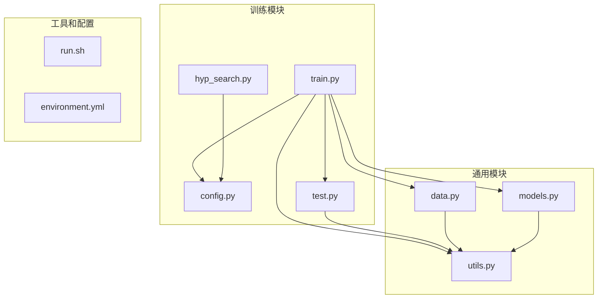
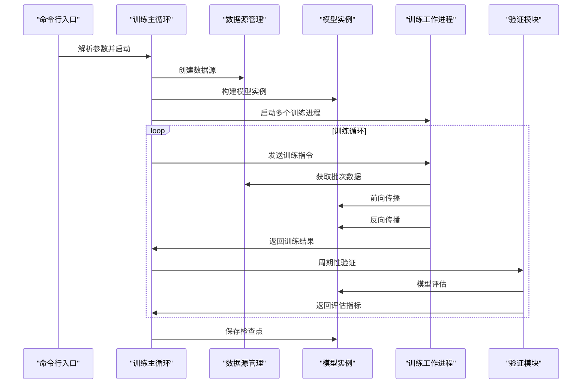
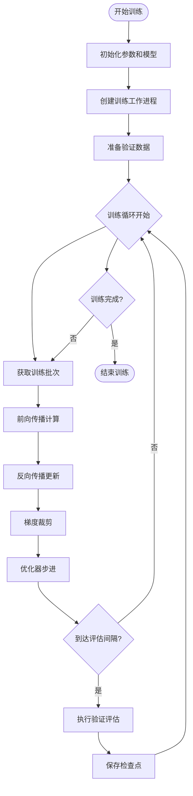
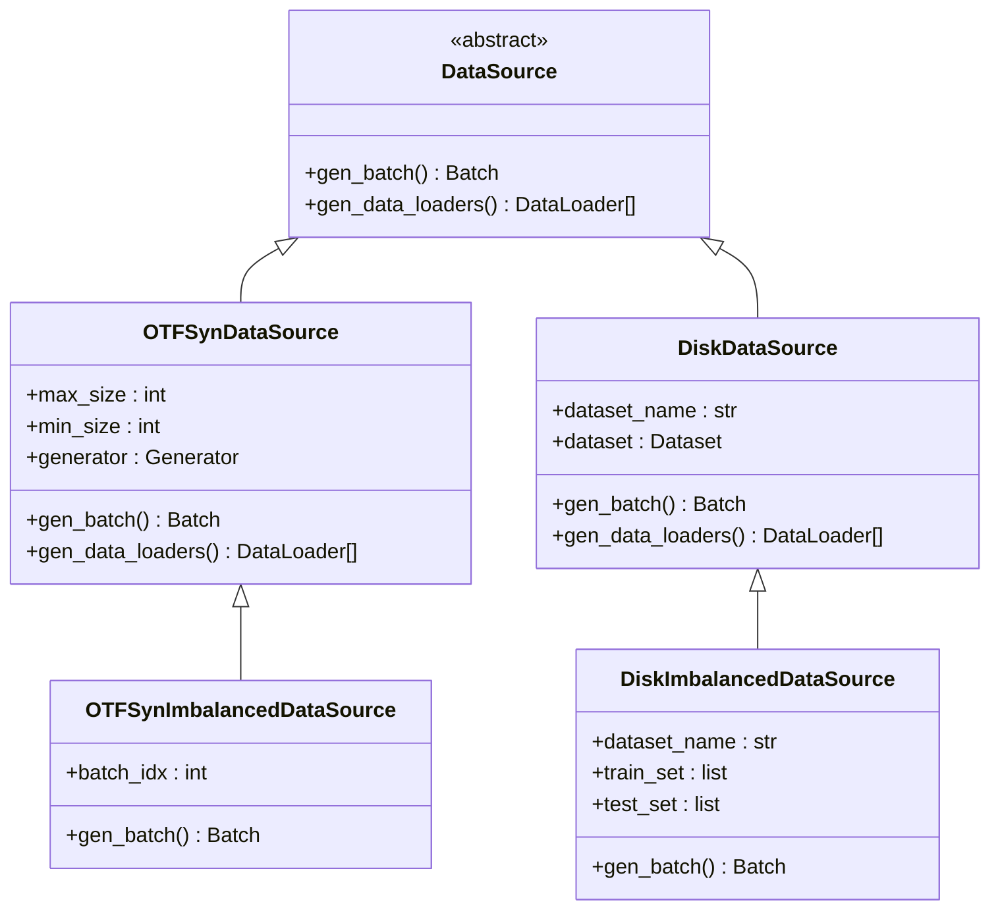
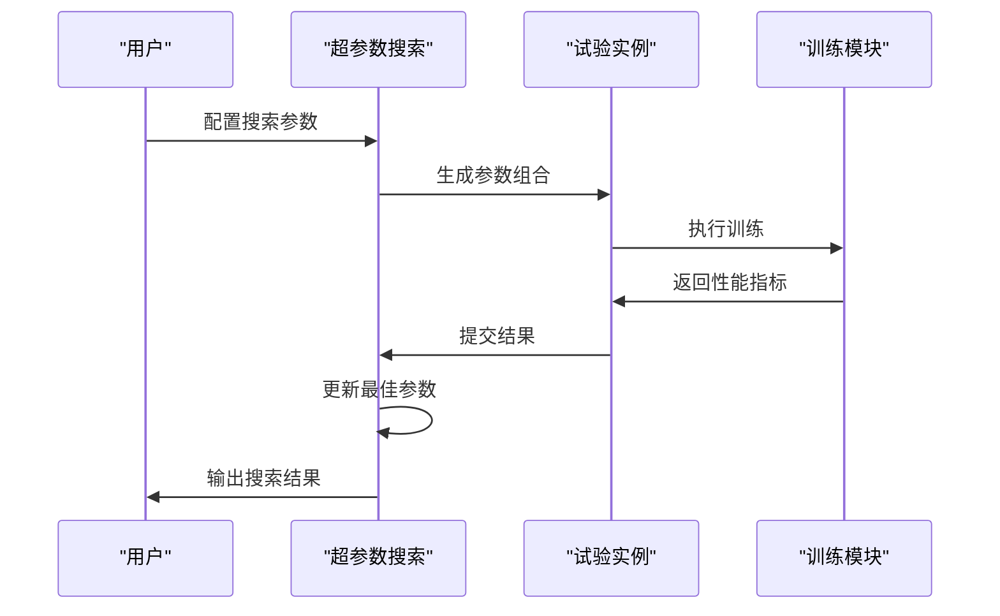
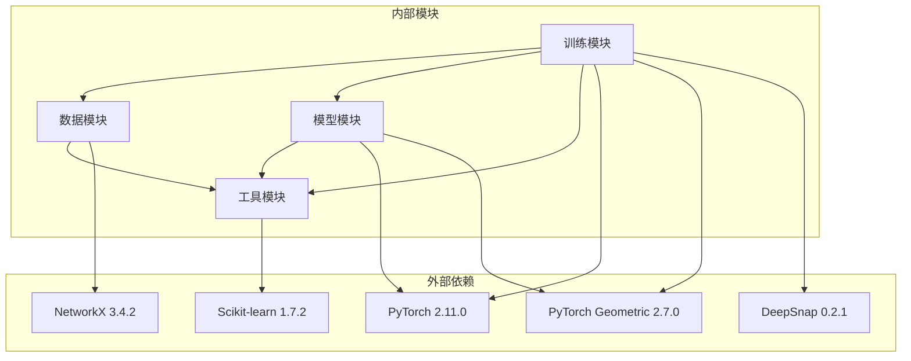

# 子图匹配训练系统

<cite>
**本文档引用的文件**
- [subgraph_matching/train.py](file://subgraph_matching/train.py)
- [subgraph_matching/config.py](file://subgraph_matching/config.py)
- [subgraph_matching/test.py](file://subgraph_matching/test.py)
- [subgraph_matching/hyp_search.py](file://subgraph_matching/hyp_search.py)
- [common/data.py](file://common/data.py)
- [common/models.py](file://common/models.py)
- [common/utils.py](file://common/utils.py)
- [run.sh](file://run.sh)
- [environment.yml](file://environment.yml)
</cite>

## 目录
1. [简介](#简介)
2. [项目结构](#项目结构)
3. [核心组件](#核心组件)
4. [架构概览](#架构概览)
5. [详细组件分析](#详细组件分析)
6. [依赖关系分析](#依赖关系分析)
7. [性能考虑](#性能考虑)
8. [故障排除指南](#故障排除指南)
9. [结论](#结论)
10. [附录](#附录)

## 简介

子图匹配训练系统是一个基于深度学习的图神经网络框架，专门用于训练子图匹配模型。该系统实现了基于序嵌入的学习方法，通过约束"子图嵌入应小于或等于超图嵌入"的方式来学习能够表达子图包含关系的空间表示。

系统支持多种数据源（合成数据和真实数据集）、多种图卷积架构（SAGE、GIN、GCN等），并提供了完整的训练、验证、评估和检查点保存机制。该框架特别适用于大规模图数据的子图匹配任务，如分子结构分析、社交网络挖掘等领域。

## 项目结构

项目采用模块化的组织结构，主要分为以下几个核心模块：



**图表来源**
- [subgraph_matching/train.py:1-253](file://subgraph_matching/train.py#L1-L253)
- [common/data.py:1-447](file://common/data.py#L1-L447)
- [common/models.py:1-318](file://common/models.py#L1-L318)

**章节来源**
- [subgraph_matching/train.py:1-50](file://subgraph_matching/train.py#L1-L50)
- [common/data.py:1-50](file://common/data.py#L1-L50)
- [common/models.py:1-50](file://common/models.py#L1-L50)

## 核心组件

### 训练入口模块

训练入口模块是整个系统的控制中心，负责协调数据准备、模型训练、验证评估和检查点保存等所有核心功能。

**主要功能特性：**
- 多进程并行训练支持
- 动态数据源切换（合成数据 vs 真实数据集）
- 周期性验证和性能监控
- TensorBoard集成的训练日志记录
- 模型检查点的自动保存

**章节来源**
- [subgraph_matching/train.py:91-222](file://subgraph_matching/train.py#L91-L222)

### 数据源管理

系统提供了多种数据源实现，支持不同的训练场景和数据类型：

**数据源类型：**
1. **合成数据源**：在线生成的合成图数据，支持平衡和不平衡采样
2. **磁盘数据源**：使用存储在磁盘上的真实图数据集
3. **不平衡数据源**：专门设计用于处理子图关系稀疏的情况

**章节来源**
- [common/data.py:77-447](file://common/data.py#L77-L447)

### 模型架构

系统实现了两种主要的模型架构：

**序嵌入模型（OrderEmbedder）：**
- 基于图神经网络的嵌入学习
- 通过序关系约束学习子图包含关系
- 支持额外的二分类头用于概率预测

**基线MLP模型：**
- 简单的双图拼接分类器
- 用于与序嵌入模型进行对比实验

**章节来源**
- [common/models.py:21-100](file://common/models.py#L21-L100)
- [common/models.py:46-100](file://common/models.py#L46-L100)

## 架构概览

系统采用分层架构设计，各组件职责明确，耦合度低：



**图表来源**
- [subgraph_matching/train.py:152-222](file://subgraph_matching/train.py#L152-L222)
- [subgraph_matching/test.py:11-119](file://subgraph_matching/test.py#L11-L119)

## 详细组件分析

### 训练流程详解

训练流程采用多进程并行架构，实现了高效的分布式训练：



**图表来源**
- [subgraph_matching/train.py:91-222](file://subgraph_matching/train.py#L91-L222)

**章节来源**
- [subgraph_matching/train.py:91-222](file://subgraph_matching/train.py#L91-L222)

### 数据准备机制

系统提供了灵活的数据准备机制，支持多种数据源和采样策略：



**图表来源**
- [common/data.py:77-447](file://common/data.py#L77-L447)

**章节来源**
- [common/data.py:81-447](file://common/data.py#L81-L447)

### 模型训练算法

系统实现了基于序嵌入的学习算法，通过约束子图嵌入的序关系来学习图的包含关系：

```mermaid
flowchart TD
Input([输入图对 (a,b)]) --> EmbA["计算图a的嵌入"]
Input --> EmbB["计算图b的嵌入"]
EmbA --> Compare["比较嵌入关系"]
EmbB --> Compare
Compare --> Violation["计算违反量 e"]
Violation --> LossCalc["计算损失函数"]
LossCalc --> TrainStep["执行训练步骤"]
TrainStep --> Update["更新模型参数"]
Update --> Output([输出训练结果])
```

**图表来源**
- [common/models.py:77-99](file://common/models.py#L77-L99)

**章节来源**
- [common/models.py:46-100](file://common/models.py#L46-L100)

### 超参数搜索机制

系统提供了完整的超参数搜索框架，支持网格搜索和参数调优：



**图表来源**
- [subgraph_matching/hyp_search.py:1-83](file://subgraph_matching/hyp_search.py#L1-L83)

**章节来源**
- [subgraph_matching/hyp_search.py:1-83](file://subgraph_matching/hyp_search.py#L1-L83)

## 依赖关系分析

系统依赖关系清晰，模块间耦合度低，便于维护和扩展：



**图表来源**
- [environment.yml:101-127](file://environment.yml#L101-L127)
- [subgraph_matching/train.py:24-47](file://subgraph_matching/train.py#L24-L47)

**章节来源**
- [environment.yml:1-129](file://environment.yml#L1-129)

## 性能考虑

### 训练性能优化

系统在多个层面进行了性能优化：

**内存管理：**
- 使用共享内存的多进程架构
- 智能的GPU/CPU设备切换
- 批量数据处理和缓存机制

**计算效率：**
- 并行数据生成和处理
- 梯度裁剪防止梯度爆炸
- 学习率调度优化收敛速度

**存储优化：**
- 检查点增量保存
- 内存映射文件支持
- 数据预处理缓存机制

### 超参数调优策略

**学习率调优：**
- 自适应学习率调度
- 学习率衰减策略
- 动态学习率调整

**网络架构调优：**
- 层数和宽度的权衡
- 卷积类型的对比实验
- 跳跃连接策略优化

**数据采样策略：**
- 平衡与不平衡采样的选择
- 子图大小分布优化
- 难例挖掘技术

## 故障排除指南

### 常见问题及解决方案

**训练不收敛：**
- 检查学习率设置是否合适
- 验证梯度裁剪阈值
- 确认数据预处理质量

**内存不足：**
- 减少批次大小
- 降低网络层数
- 使用更小的图尺寸

**验证性能差：**
- 检查数据集划分
- 验证标签一致性
- 调整正则化参数

**多进程问题：**
- 确认CUDA设备可用性
- 检查进程间通信
- 验证共享内存权限

**章节来源**
- [common/utils.py:235-284](file://common/utils.py#L235-L284)

### 调试技巧

**训练监控：**
- 使用TensorBoard实时监控指标
- 定期保存中间检查点
- 记录详细的训练日志

**性能分析：**
- 分析GPU利用率
- 监控内存使用情况
- 评估数据加载瓶颈

**模型诊断：**
- 检查梯度流
- 验证前向传播正确性
- 分析特征重要性

## 结论

子图匹配训练系统是一个功能完整、架构清晰的深度学习框架。系统通过精心设计的模块化架构，实现了高效、可扩展的子图匹配训练能力。

**主要优势：**
- 灵活的数据源支持，适应多种应用场景
- 完善的训练和验证流程，确保模型质量
- 丰富的超参数调优选项，支持性能优化
- 良好的可扩展性，便于功能扩展和定制

**应用前景：**
该系统在分子结构分析、社交网络挖掘、生物信息学等领域具有广泛的应用价值。通过进一步的优化和扩展，可以支持更大规模的图数据处理和更复杂的子图匹配任务。

## 附录

### 训练命令示例

**基础训练命令：**
```bash
python3 -m subgraph_matching.train --dataset syn --n_batches 10000 --batch_size 64 --hidden_dim 64
```

**真实数据集训练：**
```bash
python3 -m subgraph_matching.train --dataset enzymes --n_batches 50000 --batch_size 32 --conv_type GIN
```

**不平衡数据训练：**
```bash
python3 -m subgraph_matching.train --dataset syn-imbalanced --n_batches 20000 --batch_size 128 --node_anchored
```

**超参数搜索：**
```bash
python3 -m subgraph_matching.train --dataset syn --n_batches 1000 --conv_type SAGE --n_layers 8
```

### 关键配置参数说明

**学习率相关：**
- `--lr`: 基础学习率，默认1e-4
- `--opt_scheduler`: 学习率调度器类型
- `--opt_decay_step`: 衰减步长
- `--opt_decay_rate`: 衰减率

**网络架构参数：**
- `--conv_type`: 卷积类型（SAGE/GIN/GCN等）
- `--n_layers`: 卷积层数量
- `--hidden_dim`: 隐藏层维度
- `--skip`: 跳跃连接策略

**训练配置：**
- `--batch_size`: 批次大小
- `--n_batches`: 训练批次总数
- `--eval_interval`: 评估间隔
- `--val_size`: 验证集大小

**数据相关：**
- `--dataset`: 数据集名称
- `--node_anchored`: 是否使用节点锚定
- `--margin`: 损失函数margin参数

### 模型保存和加载

**检查点保存：**
- 自动保存最佳验证性能模型
- 支持增量检查点
- 模型状态完整保存

**模型加载：**
- 支持从检查点恢复训练
- 状态字典加载机制
- 设备兼容性处理

**章节来源**
- [subgraph_matching/config.py:18-77](file://subgraph_matching/config.py#L18-L77)
- [subgraph_matching/train.py:154-176](file://subgraph_matching/train.py#L154-L176)