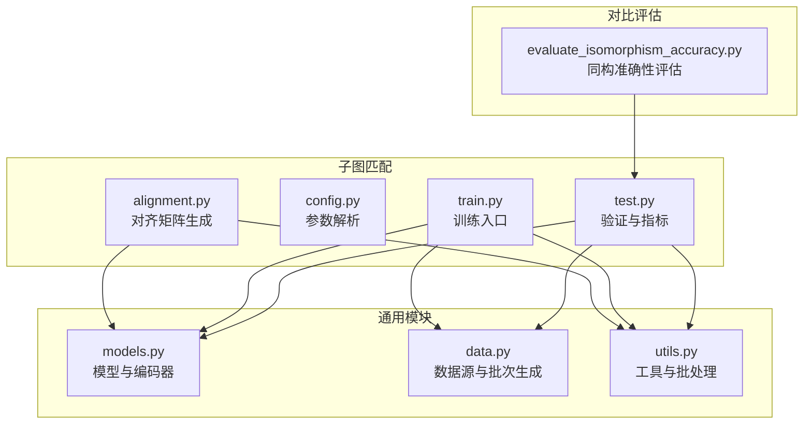
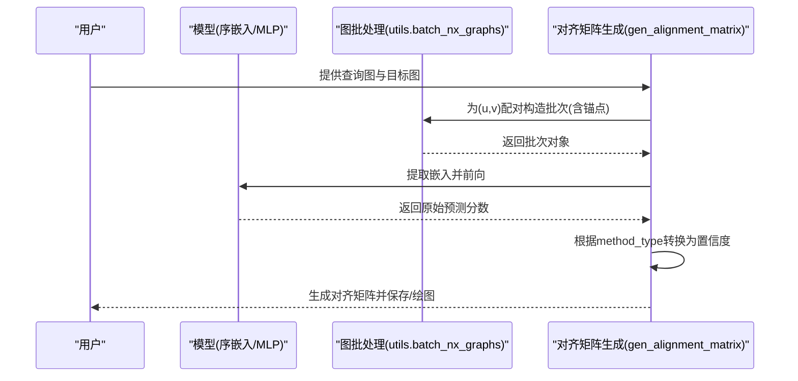
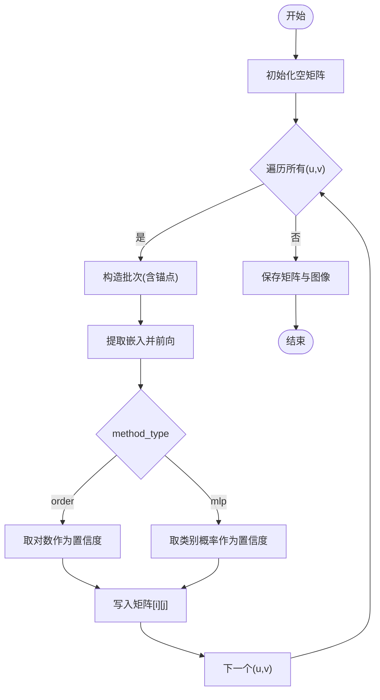
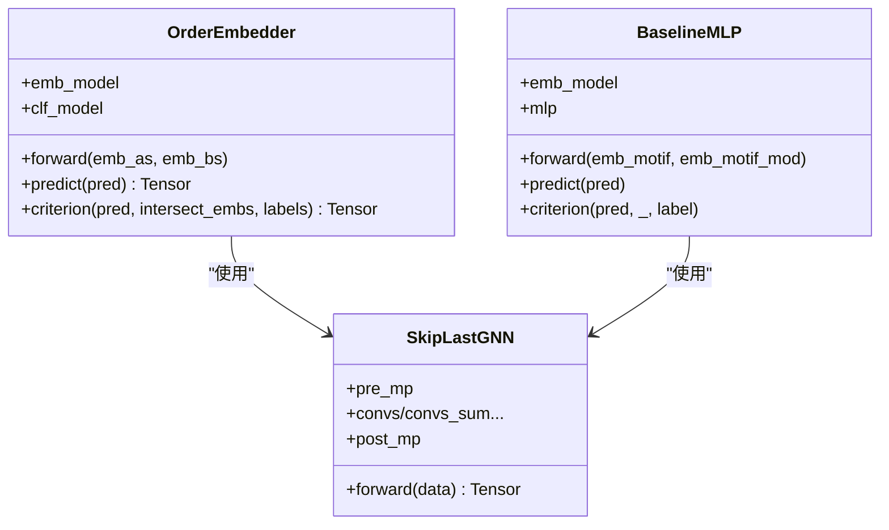
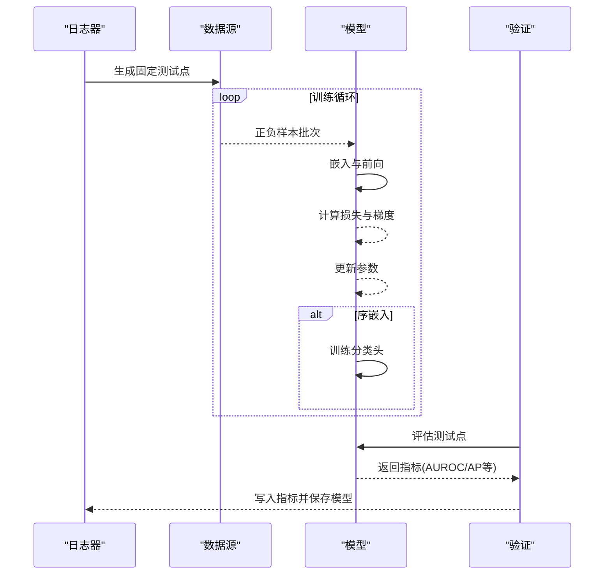
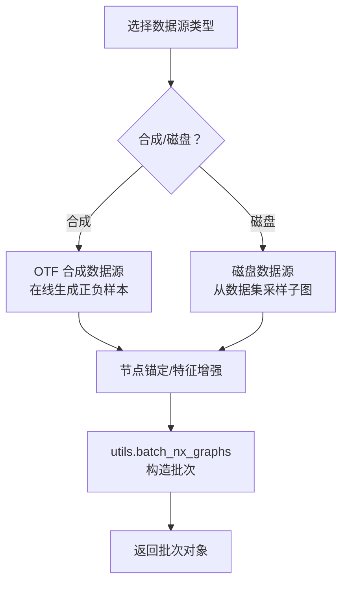
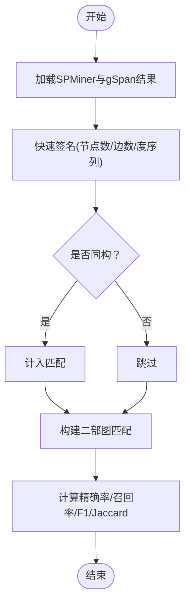
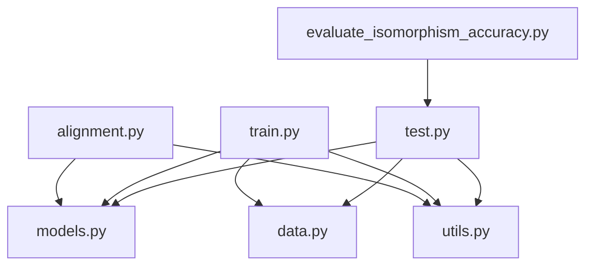

# 对齐模块

<cite>
**本文引用的文件**
- [alignment.py](file://subgraph_matching/alignment.py)
- [config.py](file://subgraph_matching/config.py)
- [train.py](file://subgraph_matching/train.py)
- [test.py](file://subgraph_matching/test.py)
- [models.py](file://common/models.py)
- [data.py](file://common/data.py)
- [utils.py](file://common/utils.py)
- [evaluate_isomorphism_accuracy.py](file://compare/evaluate_isomorphism_accuracy.py)
</cite>

## 目录
1. [简介](#简介)
2. [项目结构](#项目结构)
3. [核心组件](#核心组件)
4. [架构总览](#架构总览)
5. [详细组件分析](#详细组件分析)
6. [依赖分析](#依赖分析)
7. [性能考量](#性能考量)
8. [故障排查指南](#故障排查指南)
9. [结论](#结论)
10. [附录](#附录)

## 简介
本文件针对“对齐模块”的技术文档，聚焦于子图匹配中的图对齐算法与实现。对齐模块的核心目标是为查询子图在目标图中的匹配构建对齐矩阵，矩阵条目表示以某个查询节点为锚点的子图与以某个目标节点为锚点的目标图之间的子图包含关系置信度。通过对齐矩阵，可以进行节点对齐、边对齐以及全局对齐策略，从而支撑后续的子图匹配任务。

对齐模块的关键实现包括：
- 对齐矩阵生成：遍历查询图与目标图的所有节点对，构造置信度得分矩阵。
- 模型与嵌入：采用图神经网络编码器与序嵌入（Order Embedding）学习子图包含关系。
- 训练与评估：支持多种数据源（合成/真实数据），提供验证指标与可视化。
- 评估与对比：提供与同构匹配的评估方法，便于衡量对齐质量。

## 项目结构
对齐模块位于子图匹配目录下，配合通用的模型、数据与工具模块共同完成训练、推理与评估。

图表来源
- [alignment.py:1-102](file://subgraph_matching/alignment.py#L1-L102)
- [config.py:1-82](file://subgraph_matching/config.py#L1-L82)
- [train.py:1-253](file://subgraph_matching/train.py#L1-L253)
- [test.py:1-140](file://subgraph_matching/test.py#L1-L140)
- [models.py:1-318](file://common/models.py#L1-L318)
- [data.py:1-447](file://common/data.py#L1-L447)
- [utils.py:1-302](file://common/utils.py#L1-L302)
- [evaluate_isomorphism_accuracy.py:1-215](file://compare/evaluate_isomorphism_accuracy.py#L1-L215)

章节来源
- [alignment.py:1-102](file://subgraph_matching/alignment.py#L1-L102)
- [config.py:1-82](file://subgraph_matching/config.py#L1-L82)
- [train.py:1-253](file://subgraph_matching/train.py#L1-L253)
- [test.py:1-140](file://subgraph_matching/test.py#L1-L140)
- [models.py:1-318](file://common/models.py#L1-L318)
- [data.py:1-447](file://common/data.py#L1-L447)
- [utils.py:1-302](file://common/utils.py#L1-L302)
- [evaluate_isomorphism_accuracy.py:1-215](file://compare/evaluate_isomorphism_accuracy.py#L1-L215)

## 核心组件
- 对齐矩阵生成器：遍历查询图与目标图节点对，构造置信度矩阵，支持“序嵌入”和“MLP”两种方法类型。
- 训练与验证：构建编码器模型，使用合成或真实数据源生成正负样本批次，周期性评估指标。
- 模型与编码器：包含序嵌入模型与可选的分类头，以及支持多种图卷积类型的编码器。
- 数据源与批处理：支持在线合成数据与磁盘数据集，提供节点锚定与特征增强。
- 评估与对比：提供 AUROC、平均精度等指标，支持与同构匹配的对比评估。

章节来源
- [alignment.py:34-59](file://subgraph_matching/alignment.py#L34-L59)
- [train.py:49-89](file://subgraph_matching/train.py#L49-L89)
- [models.py:46-100](file://common/models.py#L46-L100)
- [data.py:77-429](file://common/data.py#L77-L429)
- [test.py:11-119](file://subgraph_matching/test.py#L11-L119)
- [evaluate_isomorphism_accuracy.py:103-134](file://compare/evaluate_isomorphism_accuracy.py#L103-L134)

## 架构总览
对齐模块的控制流围绕“对齐矩阵生成”展开，其核心步骤如下：
- 构建模型：根据参数选择序嵌入或 MLP 模型。
- 批处理：将查询图与目标图配对，加入锚点特征后打包为批次。
- 嵌入与预测：提取图嵌入，计算子图包含关系的原始分数。
- 矩阵填充：按节点对填充置信度矩阵，保存为 NumPy 数组并可视化。

图表来源
- [alignment.py:34-59](file://subgraph_matching/alignment.py#L34-L59)
- [utils.py:286-301](file://common/utils.py#L286-L301)
- [models.py:46-100](file://common/models.py#L46-L100)

## 详细组件分析

### 对齐矩阵生成器
- 输入：查询图、目标图、模型、方法类型（序嵌入/MLP）。
- 处理：对每个节点对(u,v)，构造批次并计算置信度；序嵌入方法对预测取对数，MLP方法取类别概率。
- 输出：形状为(|QueryNodes| × |TargetNodes|)的对齐矩阵，元素值越大表示(u,v)越可能构成子图包含关系。

图表来源
- [alignment.py:34-59](file://subgraph_matching/alignment.py#L34-L59)

章节来源
- [alignment.py:34-59](file://subgraph_matching/alignment.py#L34-L59)

### 模型与编码器
- 序嵌入模型：通过“违反量”约束学习子图包含关系，损失函数在正例上最小化违反量，在负例上强制违反量不低于 margin。
- 编码器：支持多种图卷积（如 SAGE、GIN、GCN 等），可配置跳跃连接与 Dropout，最终输出固定维度的图级嵌入。
- MLP 基线：直接拼接两图嵌入后经 MLP 分类，用于对比序嵌入效果。

图表来源
- [models.py:46-100](file://common/models.py#L46-L100)
- [models.py:101-226](file://common/models.py#L101-L226)
- [models.py:22-43](file://common/models.py#L22-L43)

章节来源
- [models.py:46-100](file://common/models.py#L46-L100)
- [models.py:101-226](file://common/models.py#L101-L226)
- [models.py:22-43](file://common/models.py#L22-L43)

### 训练与验证流程
- 数据源：支持合成数据（平衡/不平衡）与磁盘数据集（平衡/不平衡），可配置节点锚定。
- 训练：多进程并行生成批次，计算损失并更新参数；序嵌入模型额外训练分类头。
- 验证：汇总分类指标（Accuracy、Precision、Recall、AUROC、Average Precision），可保存 PR 曲线与模型权重。

图表来源
- [train.py:91-151](file://subgraph_matching/train.py#L91-L151)
- [train.py:152-222](file://subgraph_matching/train.py#L152-L222)
- [test.py:11-119](file://subgraph_matching/test.py#L11-L119)

章节来源
- [train.py:91-151](file://subgraph_matching/train.py#L91-L151)
- [train.py:152-222](file://subgraph_matching/train.py#L152-L222)
- [test.py:11-119](file://subgraph_matching/test.py#L11-L119)

### 数据源与批处理
- 合成数据源：在线生成正负样本，支持节点锚定与特征增强；不平衡数据源通过同构检测构造正负样本。
- 磁盘数据源：从真实数据集中采样子图，支持树对采样与子图-树采样策略。
- 批处理工具：将 NetworkX 图转换为几何图并加入锚点特征，返回可迁移至设备的批次对象。

图表来源
- [data.py:81-214](file://common/data.py#L81-L214)
- [data.py:271-354](file://common/data.py#L271-L354)
- [utils.py:286-301](file://common/utils.py#L286-L301)

章节来源
- [data.py:81-214](file://common/data.py#L81-L214)
- [data.py:271-354](file://common/data.py#L271-L354)
- [utils.py:286-301](file://common/utils.py#L286-L301)

### 对齐质量评估与对比
- 指标：AUROC、平均精度、精确率、召回率、混淆矩阵等，用于评估模型在子图匹配任务上的表现。
- 对比：通过与同构匹配的对比评估，计算匹配数量、精确率、召回率、F1 与 Jaccard 系数，衡量对齐质量。

图表来源
- [evaluate_isomorphism_accuracy.py:103-134](file://compare/evaluate_isomorphism_accuracy.py#L103-L134)
- [evaluate_isomorphism_accuracy.py:156-214](file://compare/evaluate_isomorphism_accuracy.py#L156-L214)

章节来源
- [evaluate_isomorphism_accuracy.py:103-134](file://compare/evaluate_isomorphism_accuracy.py#L103-L134)
- [evaluate_isomorphism_accuracy.py:156-214](file://compare/evaluate_isomorphism_accuracy.py#L156-L214)

## 依赖分析
- 对齐模块依赖模型与工具模块：对齐矩阵生成器调用模型的嵌入与预测接口，并使用批处理工具构造节点锚定的批次。
- 训练模块依赖模型、数据与工具模块：构建编码器、生成批次、训练与验证。
- 评估模块依赖验证模块与对比工具：在验证基础上扩展同构匹配评估。

图表来源
- [alignment.py:27-32](file://subgraph_matching/alignment.py#L27-L32)
- [train.py:39-47](file://subgraph_matching/train.py#L39-L47)
- [test.py:1-7](file://subgraph_matching/test.py#L1-L7)
- [evaluate_isomorphism_accuracy.py:1-7](file://compare/evaluate_isomorphism_accuracy.py#L1-L7)

章节来源
- [alignment.py:27-32](file://subgraph_matching/alignment.py#L27-L32)
- [train.py:39-47](file://subgraph_matching/train.py#L39-L47)
- [test.py:1-7](file://subgraph_matching/test.py#L1-L7)
- [evaluate_isomorphism_accuracy.py:1-7](file://compare/evaluate_isomorphism_accuracy.py#L1-L7)

## 性能考量
- 计算复杂度：对齐矩阵生成的时间复杂度为 O(|QueryNodes| × |TargetNodes|)，空间复杂度为 O(|QueryNodes| × |TargetNodes|)。对于大规模图，建议限制查询/目标图规模或采用近似策略。
- 训练效率：多进程并行生成批次，结合梯度裁剪与合适的优化器配置可提升稳定性与收敛速度。
- 内存占用：节点锚定与特征增强会增加批次维度，需合理设置批次大小与隐藏维度。
- 评估开销：AUROC、PR 曲线等指标在大批量测试点上计算成本较高，建议定期抽样或缓存中间结果。

## 故障排查指南
- 对齐矩阵为空或全零：检查模型是否正确加载权重、方法类型是否匹配、锚点是否正确注入。
- 训练不稳定：调整学习率、启用梯度裁剪、检查数据源的正负样本比例与节点锚定设置。
- 验证指标异常：确认标签构造逻辑、损失函数参数（如 margin）、以及评估指标的计算流程。
- 同构对比不一致：核对快速签名与同构检测的节点/边标签一致性，确保输入图格式正确。

章节来源
- [train.py:91-151](file://subgraph_matching/train.py#L91-L151)
- [test.py:11-119](file://subgraph_matching/test.py#L11-L119)
- [evaluate_isomorphism_accuracy.py:103-134](file://compare/evaluate_isomorphism_accuracy.py#L103-L134)

## 结论
对齐模块通过构建节点级对齐矩阵，为子图匹配提供了直观且可解释的匹配依据。结合序嵌入模型与多种数据源，系统能够在合成与真实场景中稳定训练并评估。通过 AUROC、平均精度与同构对比等指标，用户可以全面评估对齐质量，并据此选择精确对齐或近似对齐策略以平衡性能与效率。

## 附录
- 参数与配置：通过命令行参数控制卷积类型、层数、隐藏维度、跳跃连接、Dropout、批次大小、学习率、margin 等，支持节点锚定与测试模式。
- 使用建议：在小规模查询图与目标图上优先使用精确对齐；在大规模场景下可考虑降采样、近似匹配或缓存中间嵌入以提升效率。

章节来源
- [config.py:4-81](file://subgraph_matching/config.py#L4-L81)
- [train.py:223-253](file://subgraph_matching/train.py#L223-L253)