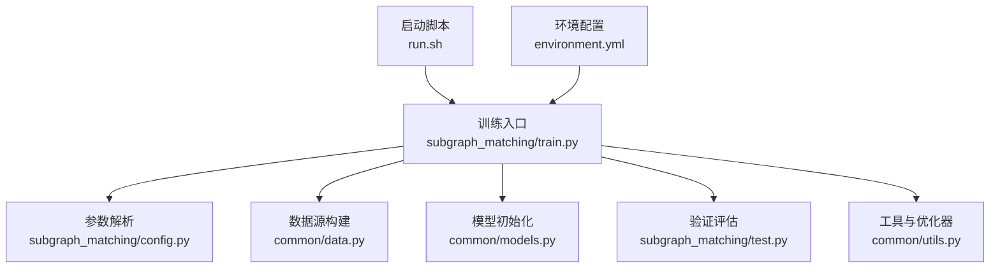
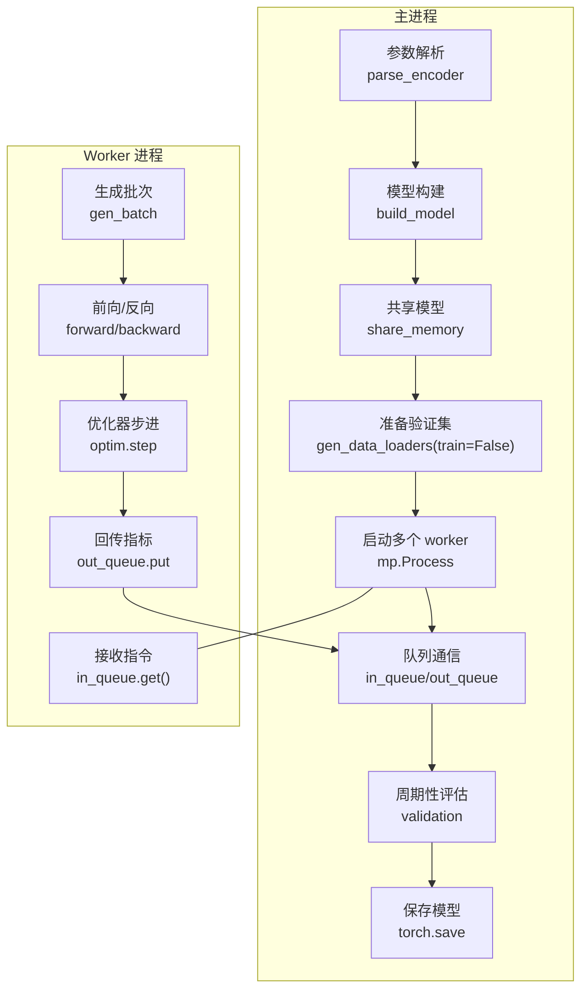
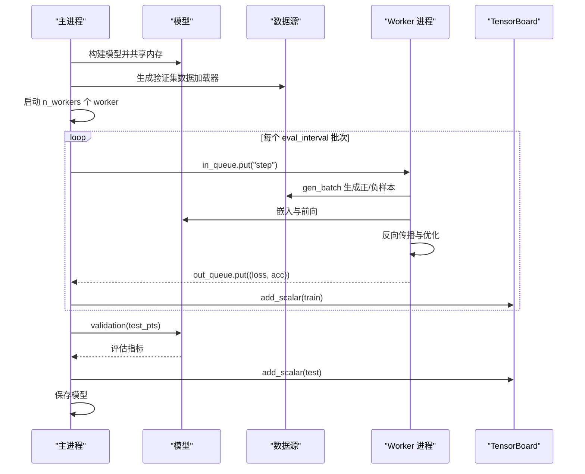
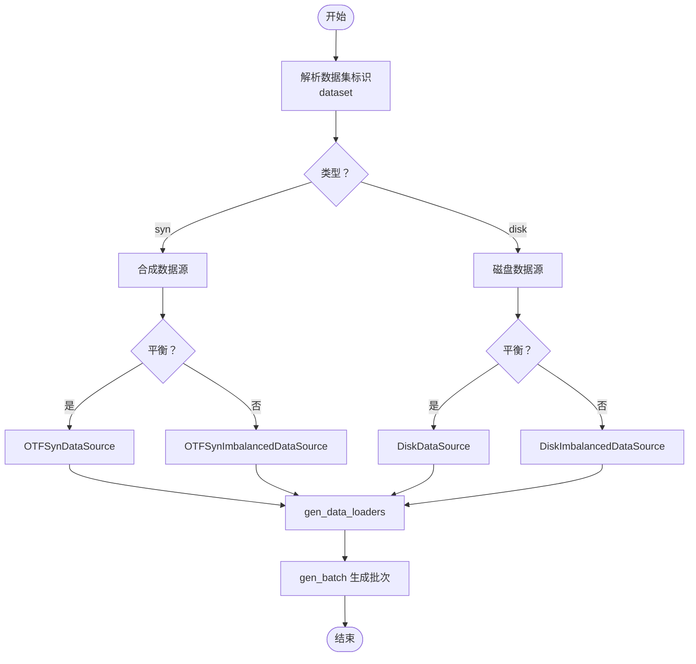
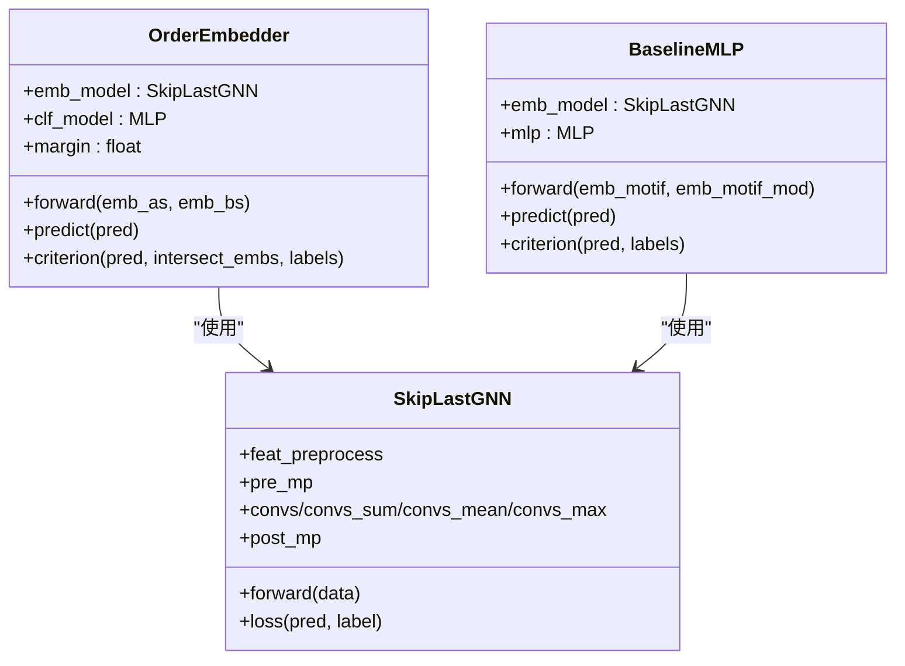
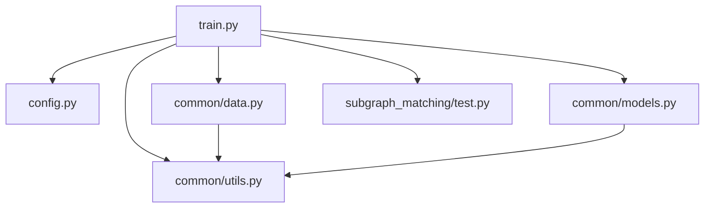

# 训练入口模块

<cite>
**本文引用的文件**
- [train.py](file://subgraph_matching/train.py)
- [config.py](file://subgraph_matching/config.py)
- [test.py](file://subgraph_matching/test.py)
- [data.py](file://common/data.py)
- [models.py](file://common/models.py)
- [utils.py](file://common/utils.py)
- [run.sh](file://run.sh)
- [environment.yml](file://environment.yml)
</cite>

## 目录
1. [简介](#简介)
2. [项目结构](#项目结构)
3. [核心组件](#核心组件)
4. [架构总览](#架构总览)
5. [详细组件分析](#详细组件分析)
6. [依赖分析](#依赖分析)
7. [性能考虑](#性能考虑)
8. [故障排查指南](#故障排查指南)
9. [结论](#结论)
10. [附录](#附录)

## 简介
本文件面向训练入口模块，系统性阐述 train.py 的整体设计与实现原理，重点覆盖以下方面：
- 训练流程总体设计与控制流
- 多进程训练机制与 worker 管理
- 数据源构建与采样策略
- 模型初始化与损失函数设计
- train_loop 主循环的工作原理（worker 管理、队列通信、批次处理、验证评估）
- 训练参数解析与配置方法（命令行参数定义与默认值）
- 训练命令示例与参数配置指南
- 训练过程监控、日志记录与模型保存最佳实践

## 项目结构
训练入口位于 subgraph_matching/train.py，围绕其展开的模块与文件如下：
- 训练入口与主循环：subgraph_matching/train.py
- 训练参数定义：subgraph_matching/config.py
- 验证评估：subgraph_matching/test.py
- 数据源与采样：common/data.py
- 模型定义：common/models.py
- 工具与优化器：common/utils.py
- 启动脚本：run.sh
- 环境配置：environment.yml

图表来源
- [train.py:1-253](file://subgraph_matching/train.py#L1-L253)
- [config.py:1-82](file://subgraph_matching/config.py#L1-L82)
- [data.py:1-447](file://common/data.py#L1-L447)
- [models.py:1-318](file://common/models.py#L1-L318)
- [test.py:1-140](file://subgraph_matching/test.py#L1-L140)
- [utils.py:1-302](file://common/utils.py#L1-L302)
- [run.sh:1-2](file://run.sh#L1-L2)
- [environment.yml:1-129](file://environment.yml#L1-L129)

章节来源
- [train.py:1-253](file://subgraph_matching/train.py#L1-L253)
- [config.py:1-82](file://subgraph_matching/config.py#L1-L82)
- [data.py:1-447](file://common/data.py#L1-L447)
- [models.py:1-318](file://common/models.py#L1-L318)
- [test.py:1-140](file://subgraph_matching/test.py#L1-L140)
- [utils.py:1-302](file://common/utils.py#L1-L302)
- [run.sh:1-2](file://run.sh#L1-L2)
- [environment.yml:1-129](file://environment.yml#L1-L129)

## 核心组件
- 训练入口与主循环：负责参数解析、模型构建、数据源选择、多进程 worker 启动、训练批次循环与周期性验证。
- 数据源模块：提供合成数据与真实数据两类数据源，支持平衡与不平衡采样策略，以及节点锚定增强。
- 模型模块：包含序嵌入模型与基线 MLP 模型，支持多种图卷积类型与跳跃连接策略。
- 工具与优化器：提供设备选择、优化器与调度器构建、批处理等通用能力。
- 验证评估：在固定测试点上进行推理与指标统计，记录 TensorBoard 指标并保存模型。

章节来源
- [train.py:91-222](file://subgraph_matching/train.py#L91-L222)
- [data.py:77-429](file://common/data.py#L77-L429)
- [models.py:22-100](file://common/models.py#L22-L100)
- [utils.py:235-284](file://common/utils.py#L235-L284)
- [test.py:11-119](file://subgraph_matching/test.py#L11-L119)

## 架构总览
训练入口采用“主进程 + 多 worker 进程”的并行架构：
- 主进程负责：参数解析、模型构建、共享内存、验证集准备、队列通信协调、周期性评估与模型保存。
- worker 进程负责：从数据源生成批次、前向传播、反向传播、梯度裁剪与优化器步进、将训练指标回传主进程。
- 数据源抽象：通过 DataSource 及其子类实现在线合成与磁盘真实数据的统一接口。
- 模型抽象：通过 OrderEmbedder/BaselineMLP 等实现不同的嵌入与判别策略。

图表来源
- [train.py:152-222](file://subgraph_matching/train.py#L152-L222)
- [train.py:91-151](file://subgraph_matching/train.py#L91-L151)
- [data.py:77-429](file://common/data.py#L77-L429)
- [models.py:46-100](file://common/models.py#L46-L100)

## 详细组件分析

### 训练入口与主循环（train_loop）
- 参数解析与默认值：通过 parse_encoder 注册训练参数并设置默认值，支持优化器类型、调度器、卷积类型、层数、隐藏维度、dropout、批次数、margin、数据集、评估频率、验证集大小、模型路径、标签、节点锚定、测试模式、worker 数量等。
- 模型构建：根据 method_type 选择 OrderEmbedder 或 BaselineMLP，并将模型移动至设备，必要时加载预训练权重。
- 共享内存：模型调用 share_memory 以便多进程共享参数。
- 验证集准备：固定一批测试点，避免训练期间动态采样带来的噪声。
- 多进程训练：启动 n_workers 个 worker，使用两个队列进行通信；主进程发送“开始训练”信号，worker 完成一次训练后回传指标。
- 周期性评估：每隔 eval_interval 批次进行一次验证，记录 TensorBoard 指标并保存模型。

图表来源
- [train.py:152-222](file://subgraph_matching/train.py#L152-L222)
- [test.py:11-119](file://subgraph_matching/test.py#L11-L119)

章节来源
- [train.py:152-222](file://subgraph_matching/train.py#L152-L222)
- [config.py:18-77](file://subgraph_matching/config.py#L18-L77)
- [test.py:11-119](file://subgraph_matching/test.py#L11-L119)

### 数据源构建与采样策略
- 数据集类型：
  - syn-balanced / syn-imbalanced：在线生成合成数据，支持节点锚定增强。
  - disk-balanced / disk-imbalanced：使用磁盘真实数据集，支持节点锚定增强。
- 采样策略：
  - 平衡采样：正负样本比例约 1:1。
  - 不平衡采样：从在线生成器随机采样，记录真实标签，使子图关系更稀有。
- 节点锚定：在图节点特征中加入锚点指示，提升模型对子图包含关系的判别能力。
- 数据加载器：使用 DeepSNAP Batch 与 DataLoader 统一批次组织。

图表来源
- [train.py:61-89](file://subgraph_matching/train.py#L61-L89)
- [data.py:81-429](file://common/data.py#L81-L429)

章节来源
- [train.py:61-89](file://subgraph_matching/train.py#L61-L89)
- [data.py:81-429](file://common/data.py#L81-L429)

### 模型初始化与损失函数
- 模型类型：
  - OrderEmbedder：通过“违反量”约束学习子图包含关系，支持额外的二分类头（仅 order 模型）。
  - BaselineMLP：将两个图的嵌入拼接后经 MLP 判别，作为对比基线。
- 编码器：SkipLastGNN 支持多种图卷积（如 SAGE、GIN、GCN、GraphConv、GAT、PNA），并提供 all/last/learnable 三种跳跃连接策略。
- 损失函数：序嵌入损失基于违反量与 margin 的组合，正例尽量接近 0，负例至少大于 margin；MLP 使用 NLLLoss。

图表来源
- [models.py:22-100](file://common/models.py#L22-L100)
- [models.py:101-227](file://common/models.py#L101-L227)

章节来源
- [models.py:22-100](file://common/models.py#L22-L100)
- [models.py:101-227](file://common/models.py#L101-L227)

### 训练参数解析与配置
- 参数注册：parse_encoder 在解析器中注册所有训练相关参数，并设置默认值（如卷积类型、层数、隐藏维度、dropout、批次数、margin、数据集、评估频率、验证集大小、模型路径、标签、节点锚定、测试模式、worker 数量等）。
- 优化器与调度器：utils.parse_optimizer 与 utils.build_optimizer 提供统一的优化器与调度器配置接口。
- 超参数搜索：支持通过 TestTube 进行网格搜索（需开启 HYPERPARAM_SEARCH 标志）。

章节来源
- [config.py:4-77](file://subgraph_matching/config.py#L4-L77)
- [utils.py:245-284](file://common/utils.py#L245-L284)
- [train.py:223-249](file://subgraph_matching/train.py#L223-L249)

### 训练命令示例与参数配置指南
- 基本启动：通过 run.sh 或直接运行 Python 模块入口。
- 常用参数示例（结合默认值）：
  - --dataset：选择数据集类型与采样策略（如 syn-balanced、syn-imbalanced、enzymes-balanced 等）
  - --method_type：选择模型类型（order 或 mlp）
  - --batch_size：训练批次大小
  - --n_batches：总训练批次数
  - --eval_interval：评估间隔（以批次为单位）
  - --val_size：验证集大小
  - --n_workers：worker 数量
  - --model_path：模型保存路径
  - --conv_type：图卷积类型（SAGE/GCN/GIN/GraphConv/GAT/PNA）
  - --n_layers：图卷积层数
  - --hidden_dim：隐藏维度
  - --dropout：dropout 比率
  - --margin：序嵌入损失的 margin
  - --node_anchored：是否启用节点锚定
  - --test：仅运行验证逻辑（不更新参数）
- 场景配置建议：
  - 合成数据训练：使用 syn-balanced 或 syn-imbalanced，配合节点锚定增强。
  - 真实数据训练：使用 disk-* 类型，注意数据集名称与默认路径。
  - 调试模式：设置较小的 batch_size、n_batches 和 eval_interval，快速验证流程。
  - 大规模训练：增加 n_workers 与 batch_size，合理设置 margin 与 dropout。

章节来源
- [run.sh:1-2](file://run.sh#L1-L2)
- [config.py:18-77](file://subgraph_matching/config.py#L18-L77)
- [train.py:223-249](file://subgraph_matching/train.py#L223-L249)

### 训练过程监控、日志记录与模型保存
- TensorBoard 日志：使用 SummaryWriter 记录训练与验证指标（Loss/train、Accuracy/train、Accuracy/test、Precision/test、Recall/test、AUROC/test、AvgPrec/test 等）。
- 模型保存：在验证阶段保存模型权重至指定路径。
- 控制台输出：训练过程中打印批次损失与准确率，便于实时观察收敛情况。

章节来源
- [train.py:168-222](file://subgraph_matching/train.py#L168-L222)
- [test.py:107-118](file://subgraph_matching/test.py#L107-L118)

## 依赖分析
- 模块耦合关系：
  - train.py 依赖 config.py（参数）、data.py（数据源）、models.py（模型）、test.py（验证）、utils.py（工具与优化器）。
  - data.py 依赖 common.feature_preprocess 与 utils，提供数据加载与批处理。
  - models.py 依赖 torch、torch_geometric 与 utils，实现图卷积与嵌入。
  - utils.py 提供设备选择、优化器构建、批处理等通用能力。
- 外部依赖：
  - PyTorch、PyTorch Geometric、DeepSNAP、NetworkX、Scikit-learn、TensorBoard 等。

图表来源
- [train.py:1-47](file://subgraph_matching/train.py#L1-L47)
- [config.py:1-3](file://subgraph_matching/config.py#L1-L3)
- [data.py:1-20](file://common/data.py#L1-L20)
- [models.py:1-20](file://common/models.py#L1-L20)
- [utils.py:1-16](file://common/utils.py#L1-L16)

章节来源
- [train.py:1-47](file://subgraph_matching/train.py#L1-L47)
- [config.py:1-3](file://subgraph_matching/config.py#L1-L3)
- [data.py:1-20](file://common/data.py#L1-L20)
- [models.py:1-20](file://common/models.py#L1-L20)
- [utils.py:1-16](file://common/utils.py#L1-L16)

## 性能考虑
- 多进程并行：通过 n_workers 提升数据生成与训练吞吐，注意队列通信开销与 CPU/GPU 资源分配。
- 批次大小与评估频率：较大的 batch_size 可提高 GPU 利用率，但需平衡内存占用；合理的 eval_interval 有助于及时发现过拟合。
- 设备选择：优先使用 CUDA，若显存不足可降低 batch_size 或隐藏维度。
- 梯度裁剪：在训练中对梯度进行裁剪，有助于稳定训练。
- 数据源缓存：不平衡数据源支持缓存中间结果，减少重复计算。

## 故障排查指南
- CUDA 可用性：确认设备选择逻辑与 CUDA 可用状态，必要时切换到 CPU。
- 数据集路径：确保磁盘数据集文件存在且路径正确。
- 内存不足：降低 batch_size、n_layers 或 hidden_dim，或减少 n_workers。
- 队列阻塞：检查 in_queue/out_queue 的发送与接收是否匹配，确保每个 worker 完成训练后正确回传指标。
- 验证失败：确认验证集生成与 gen_batch 的一致性，避免在验证阶段出现设备不匹配。

章节来源
- [utils.py:235-244](file://common/utils.py#L235-L244)
- [train.py:160-222](file://subgraph_matching/train.py#L160-L222)
- [test.py:20-119](file://subgraph_matching/test.py#L20-L119)

## 结论
训练入口模块通过清晰的职责划分与模块化设计，实现了从参数解析、数据源构建、模型初始化到多进程训练与周期性验证的完整闭环。借助统一的数据源抽象与模型抽象，用户可以灵活地在合成与真实数据之间切换，并针对不同场景调整参数与策略。建议在实际部署中结合硬件资源与数据特性，合理设置批次大小、评估频率与 worker 数量，以获得最佳的训练效率与稳定性。

## 附录
- 环境安装：使用 environment.yml 创建 Conda 环境，确保依赖版本一致。
- 启动方式：通过 run.sh 或直接运行 Python 模块入口启动训练。

章节来源
- [environment.yml:1-129](file://environment.yml#L1-L129)
- [run.sh:1-2](file://run.sh#L1-L2)