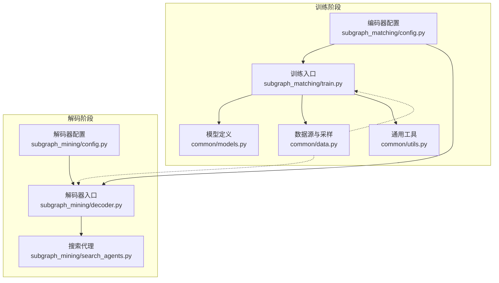
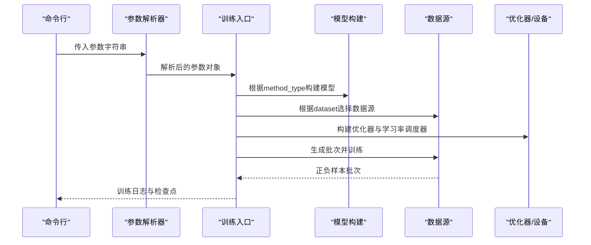
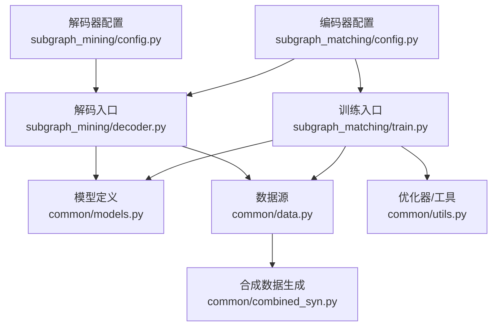

# 训练配置管理

<cite>
**本文档引用的文件**
- [subgraph_matching/config.py](file://subgraph_matching/config.py)
- [subgraph_mining/config.py](file://subgraph_mining/config.py)
- [common/utils.py](file://common/utils.py)
- [common/models.py](file://common/models.py)
- [common/data.py](file://common/data.py)
- [subgraph_matching/train.py](file://subgraph_matching/train.py)
- [subgraph_mining/decoder.py](file://subgraph_mining/decoder.py)
- [subgraph_mining/search_agents.py](file://subgraph_mining/search_agents.py)
- [common/combined_syn.py](file://common/combined_syn.py)
- [run.sh](file://run.sh)
</cite>

## 目录
1. [简介](#简介)
2. [项目结构](#项目结构)
3. [核心组件](#核心组件)
4. [架构概览](#架构概览)
5. [详细组件分析](#详细组件分析)
6. [依赖分析](#依赖分析)
7. [性能考量](#性能考量)
8. [故障排查指南](#故障排查指南)
9. [结论](#结论)
10. [附录](#附录)

## 简介
本技术文档聚焦于训练配置管理模块，系统阐述配置参数的设计理念、作用机制与最佳实践。文档涵盖模型架构参数（如卷积类型、层数、隐藏维度）、优化器配置（优化器类型、学习率调度、权重衰减）、训练超参数（批次大小、训练批次数、评估间隔、dropout、margin）、数据处理选项（数据集类型、采样方法、邻域半径、节点锚定）以及配置文件的加载与解析机制。同时提供针对合成数据与真实数据的配置差异、参数调优指导原则与性能影响分析，帮助读者在不同任务场景下高效配置与调优。

## 项目结构
该项目围绕“子图匹配训练”和“子图挖掘解码”两大阶段组织配置与实现：
- 训练配置（子图匹配）：通过命令行参数注册与默认值设置，贯穿模型构建、数据源选择、训练循环与验证。
- 解码配置（子图挖掘）：在编码器参数基础上叠加解码阶段的搜索与输出参数，支持贪心与MCTS两种搜索策略。
- 公共工具：优化器构建、设备选择、数据批处理、采样与特征预处理等。

图表来源
- [subgraph_matching/config.py:1-82](file://subgraph_matching/config.py#L1-L82)
- [subgraph_mining/config.py:1-65](file://subgraph_mining/config.py#L1-L65)
- [subgraph_matching/train.py:1-253](file://subgraph_matching/train.py#L1-L253)
- [subgraph_mining/decoder.py:1-276](file://subgraph_mining/decoder.py#L1-L276)
- [common/models.py:1-318](file://common/models.py#L1-L318)
- [common/data.py:1-447](file://common/data.py#L1-L447)
- [common/utils.py:1-302](file://common/utils.py#L1-L302)
- [subgraph_mining/search_agents.py:1-442](file://subgraph_mining/search_agents.py#L1-L442)

章节来源
- [subgraph_matching/config.py:1-82](file://subgraph_matching/config.py#L1-L82)
- [subgraph_mining/config.py:1-65](file://subgraph_mining/config.py#L1-L65)
- [subgraph_matching/train.py:1-253](file://subgraph_matching/train.py#L1-L253)
- [subgraph_mining/decoder.py:1-276](file://subgraph_mining/decoder.py#L1-L276)
- [common/models.py:1-318](file://common/models.py#L1-L318)
- [common/data.py:1-447](file://common/data.py#L1-L447)
- [common/utils.py:1-302](file://common/utils.py#L1-L302)
- [subgraph_mining/search_agents.py:1-442](file://subgraph_mining/search_agents.py#L1-L442)

## 核心组件
- 训练配置注册器：在编码器阶段注册所有训练相关的参数，并提供稳定默认值，确保快速可用与可复现实验。
- 解码配置注册器：在解码阶段注册挖掘相关的参数，覆盖部分编码器默认值以适配解码场景。
- 优化器与调度器：统一的优化器构建与学习率调度器注册，支持多种调度策略。
- 数据源与采样：支持在线合成数据与磁盘真实数据，提供平衡与不平衡两种采样策略。
- 模型定义：包含序嵌入模型、基线MLP模型与可插拔的图卷积层实现。

章节来源
- [subgraph_matching/config.py:4-82](file://subgraph_matching/config.py#L4-L82)
- [subgraph_mining/config.py:4-65](file://subgraph_mining/config.py#L4-L65)
- [common/utils.py:245-284](file://common/utils.py#L245-L284)
- [common/data.py:77-430](file://common/data.py#L77-L430)
- [common/models.py:22-318](file://common/models.py#L22-L318)

## 架构概览
训练配置管理采用“参数注册 + 默认值 + 外部解析 + 模块化实现”的架构：
- 参数注册：在各自阶段的配置文件中注册参数组，避免全局污染。
- 默认值：提供稳定默认值，兼顾收敛稳定性与实验可复现性。
- 解析与验证：通过命令行解析器统一解析，结合模块内部逻辑进行参数一致性检查。
- 模块化：训练入口与解码入口分别组合编码器/解码器参数，形成独立的配置子集。

图表来源
- [subgraph_matching/train.py:223-253](file://subgraph_matching/train.py#L223-L253)
- [common/utils.py:265-284](file://common/utils.py#L265-L284)
- [common/models.py:46-100](file://common/models.py#L46-L100)
- [common/data.py:61-89](file://common/data.py#L61-L89)

## 详细组件分析

### 训练配置参数详解（编码器阶段）
- 卷积类型（conv_type）：支持GCN、GIN、SAGE、Graph、GAT、Gated、PNA等，决定消息传递层实现与聚合方式。
- 嵌入类型（method_type）：支持order（序嵌入）与mlp（基线MLP），决定模型结构与损失函数。
- 批次大小（batch_size）：控制单次训练的样本数量，影响显存占用与收敛速度。
- 层数（n_layers）：图卷积堆叠层数，影响感受野与表达能力。
- 隐藏维度（hidden_dim）：中间层维度，平衡表达能力与计算成本。
- 跳跃连接（skip）：支持all、last、learnable三种策略，提升梯度流动与特征融合。
- Dropout（dropout）：控制正则化强度，防止过拟合。
- 训练小批次数量（n_batches）：总训练步数，与eval_interval共同决定评估频率。
- Margin（margin）：序嵌入损失的边界参数，影响正负样本的判别难度。
- 数据集（dataset）：支持syn（在线合成）与真实数据集名称，可附加balanced/imbalanced后缀。
- 测试集（test_set）：指定测试集文件名（可选）。
- 评估间隔（eval_interval）：每eval_interval个批次进行一次验证。
- 验证集大小（val_size）：固定验证集规模。
- 模型路径（model_path）：模型保存/加载路径。
- 优化器调度器（opt_scheduler）：支持none、step、cos等策略。
- 节点锚定（node_anchored）：是否使用锚定节点特征进行训练。
- 测试开关（test）：仅验证不更新参数。
- 工作线程数（n_workers）：多进程训练的工作进程数。
- 标签（tag）：运行标识，用于区分实验。

默认值设计要点：
- 卷积类型默认SAGE，嵌入类型默认order，数据集默认syn，层数默认8，批次大小默认64，隐藏维度默认64，跳跃连接默认learnable，dropout默认0.0，训练批次数默认1000000，优化器默认adam，学习率默认1e-4，margin默认0.1，评估间隔默认1000，工作线程数默认4，模型路径默认ckpt/model.pt，验证集大小默认4096，节点锚定默认True。

章节来源
- [subgraph_matching/config.py:18-77](file://subgraph_matching/config.py#L18-L77)

### 解码配置参数详解（挖掘阶段）
- 采样方法（sample_method）：支持tree（树形）与radial（辐射形），决定邻域采样策略。
- 模体数据集（motif_dataset）：模体挖掘的数据集名称（可选）。
- 邻域半径（radius）：辐射形采样的半径阈值。
- 子图采样数量（subgraph_sample_size）：每邻域采样的节点数，0表示不限制。
- 输出路径（out_path）：候选模体输出文件路径。
- 聚类数量（n_clusters）：聚类相关参数（可选）。
- 最小/最大模式尺寸（min_pattern_size/max_pattern_size）：待挖掘模式的尺寸范围。
- 最小/最大邻域大小（min_neighborhood_size/max_neighborhood_size）：邻域采样的尺寸范围。
- 邻域数量（n_neighborhoods）：采样邻域总数。
- 试验次数（n_trials）：搜索试验次数，直接影响耗时。
- 输出批次大小（out_batch_size）：每种图大小输出的模体数量。
- 前沿剪枝（frontier_top_k）：每步保留度数最高的前K个前沿候选，0表示不剪枝。
- 分析开关（analyze）：是否启用分析可视化。
- 搜索策略（search_strategy）：支持greedy（贪心）与mcts（蒙特卡洛树搜索）。
- 使用整图（use_whole_graphs）：是否对完整图聚类而非采样邻域。

默认值设计要点：
- 输出路径默认results/out-patterns.p，邻域数量默认10000，试验次数默认1000，半径默认3，采样方法默认tree，最小/最大模式尺寸默认5/20，最小/最大邻域大小默认20/29，搜索策略默认greedy，输出批次大小默认10，前沿剪枝默认5，节点锚定默认True。
- 解码阶段会复用编码器参数中的dataset与batch_size，并覆盖为更适合解码场景的默认值。

章节来源
- [subgraph_mining/config.py:14-64](file://subgraph_mining/config.py#L14-L64)

### 优化器与学习率调度配置
- 优化器类型（opt）：支持adam、sgd、rmsprop、adagrad。
- 学习率（lr）：初始学习率。
- 权重衰减（weight_decay）：L2正则化系数。
- 学习率调度器（opt_scheduler）：支持none、step、cos。
- 衰减步长（opt_decay_step）：step调度的衰减周期。
- 衰减率（opt_decay_rate）：step调度的衰减因子。
- 重启步数（opt_restart）：cos调度的周期长度。
- 梯度裁剪（clip）：梯度范数裁剪阈值。

优化器构建流程：
- 根据参数选择优化器类型与超参数，构建优化器实例。
- 根据调度器类型构建对应的调度器，若为none则返回None。
- 训练循环中按步更新学习率（如启用调度器）。

章节来源
- [common/utils.py:245-284](file://common/utils.py#L245-L284)

### 数据源与采样策略
- 在线合成数据源（OTFSynDataSource）：动态生成正负样本对，支持节点锚定与特征增强。
- 不平衡在线合成数据源（OTFSynImbalancedDataSource）：打破1:1比例，模拟真实推理场景。
- 磁盘真实数据源（DiskDataSource）：从TUDataset等真实数据集中采样子图，支持平衡与不平衡两种策略。
- 不平衡磁盘数据源（DiskImbalancedDataSource）：从真实数据集中随机采样并标注标签，形成不平衡数据集。

数据源选择逻辑：
- dataset字段支持"syn-balanced"、"syn-imbalanced"、"真实数据集名-balanced/imbalanced"等格式。
- 根据选择创建对应的数据源对象，生成数据加载器与批次。

章节来源
- [common/data.py:81-430](file://common/data.py#L81-L430)
- [subgraph_matching/train.py:61-89](file://subgraph_matching/train.py#L61-L89)

### 模型架构与损失函数
- 序嵌入模型（OrderEmbedder）：通过约束“子图嵌入应小于或等于超图嵌入”的方式学习表达包含关系，使用margin控制正负样本的判别边界。
- 基线MLP模型（BaselineMLP）：将两个图的嵌入拼接后送入MLP进行二分类，用于对比order嵌入的效果。
- SkipLastGNN：支持多种图卷积类型的编码器，具备跳跃连接与可学习skip参数，通过全图池化得到固定维度图表示。

损失函数：
- 序嵌入损失：计算违反序关系的平方和，正例要求接近0，负例要求至少大于margin。
- 基线MLP损失：使用NLLLoss进行二分类。

章节来源
- [common/models.py:22-100](file://common/models.py#L22-L100)
- [common/models.py:101-229](file://common/models.py#L101-L229)

### 训练流程与参数验证
- 训练入口（train.py）：解析参数、构建模型、选择数据源、启动多进程训练循环、周期性验证与保存检查点。
- 参数验证：在训练入口中对数据集格式进行校验，异常时抛出错误；对测试模式进行特殊处理。
- 设备选择：统一通过懒加载获取GPU/CPU设备，避免重复初始化。

章节来源
- [subgraph_matching/train.py:91-222](file://subgraph_matching/train.py#L91-L222)
- [common/utils.py:235-243](file://common/utils.py#L235-L243)

### 解码流程与搜索策略
- 解码入口（decoder.py）：组合编码器与解码器参数，加载数据集，执行模式增长流程。
- 模式增长：采样邻域 -> 编码嵌入 -> 搜索策略 -> 输出可视化与序列化结果。
- 搜索策略：
  - 贪心搜索（GreedySearchAgent）：基于模型预测分数进行贪心扩展，支持counts、margin、hybrid三种排名方法。
  - MCTS搜索（MCTSSearchAgent）：基于UCT准则进行蒙特卡洛树搜索，适合探索更广泛的模式空间。

章节来源
- [subgraph_mining/decoder.py:62-196](file://subgraph_mining/decoder.py#L62-L196)
- [subgraph_mining/search_agents.py:129-282](file://subgraph_mining/search_agents.py#L129-L282)
- [subgraph_mining/search_agents.py:284-441](file://subgraph_mining/search_agents.py#L284-L441)

## 依赖分析
- 训练配置依赖：训练入口依赖编码器配置注册器、优化器构建器与数据源工厂；模型定义依赖公共工具与特征预处理。
- 解码配置依赖：解码入口依赖编码器配置注册器与解码器配置注册器，搜索代理依赖模型与工具函数。
- 数据生成：合成数据生成器依赖DeepSNAP与NetworkX，支持ER、WS、BA、PowerLaw Cluster等多种图生成策略。

图表来源
- [subgraph_matching/config.py:1-82](file://subgraph_matching/config.py#L1-L82)
- [subgraph_mining/config.py:1-65](file://subgraph_mining/config.py#L1-L65)
- [subgraph_matching/train.py:1-253](file://subgraph_matching/train.py#L1-L253)
- [subgraph_mining/decoder.py:1-276](file://subgraph_mining/decoder.py#L1-L276)
- [common/models.py:1-318](file://common/models.py#L1-L318)
- [common/data.py:1-447](file://common/data.py#L1-L447)
- [common/utils.py:1-302](file://common/utils.py#L1-L302)
- [common/combined_syn.py:1-134](file://common/combined_syn.py#L1-L134)

章节来源
- [subgraph_matching/config.py:1-82](file://subgraph_matching/config.py#L1-L82)
- [subgraph_mining/config.py:1-65](file://subgraph_mining/config.py#L1-L65)
- [subgraph_matching/train.py:1-253](file://subgraph_matching/train.py#L1-L253)
- [subgraph_mining/decoder.py:1-276](file://subgraph_mining/decoder.py#L1-L276)
- [common/models.py:1-318](file://common/models.py#L1-L318)
- [common/data.py:1-447](file://common/data.py#L1-L447)
- [common/utils.py:1-302](file://common/utils.py#L1-L302)
- [common/combined_syn.py:1-134](file://common/combined_syn.py#L1-L134)

## 性能考量
- 计算资源：隐藏维度与层数直接影响显存占用与计算时间；建议根据GPU显存调整hidden_dim与n_layers。
- 批次大小：batch_size越大，吞吐越高但显存占用越大；需与隐藏维度协同调整。
- 评估频率：eval_interval过大可能导致过拟合检测滞后，过小增加I/O开销。
- 采样策略：不平衡数据会降低正例比例，需结合损失函数与采样策略提升召回。
- 搜索策略：n_trials与frontier_top_k显著影响解码耗时；贪心策略更快但可能局部最优，MCTS策略更全面但更耗时。
- 设备选择：优先使用GPU，懒加载设备避免重复初始化带来的性能损耗。

## 故障排查指南
- 数据集格式错误：当dataset字段格式不正确时，训练入口会抛出异常。请确认dataset字段为"syn-balanced"、"syn-imbalanced"或"真实数据集名-balanced/imbalanced"之一。
- 设备不可用：若CUDA不可用，系统将自动回退至CPU。可通过get_device函数确认当前设备。
- 学习率调度异常：若opt_scheduler设置为none，调度器返回None；若设置为step或cos，请确保相应的衰减步长与衰减率参数有效。
- 模型路径不存在：训练入口会在首次运行时创建模型保存目录；若权限不足，需手动创建目录或调整路径。
- 解码输出路径：默认输出路径为results/out-patterns.p；若目标路径不存在，需手动创建目录。

章节来源
- [subgraph_matching/train.py:70-89](file://subgraph_matching/train.py#L70-L89)
- [common/utils.py:235-243](file://common/utils.py#L235-L243)
- [common/utils.py:265-284](file://common/utils.py#L265-L284)
- [subgraph_mining/decoder.py:192-196](file://subgraph_mining/decoder.py#L192-L196)

## 结论
训练配置管理模块通过清晰的参数注册、稳健的默认值与模块化的实现，为子图匹配与子图挖掘提供了灵活而可靠的配置框架。合理设置卷积类型、层数、隐藏维度、批次大小与学习率等关键参数，结合数据源与采样策略的选择，能够在不同任务场景下取得良好的训练效果与挖掘性能。建议在实际应用中遵循本文档的最佳实践，并根据硬件条件与任务需求进行针对性调优。

## 附录

### 配置参数调优指导原则
- 学习率（lr）：从1e-4开始尝试，若收敛缓慢可适当增大；若不稳定可减小。
- 批次大小（batch_size）：在显存允许范围内尽可能增大，以提升吞吐；若显存不足则减小。
- 隐藏维度（hidden_dim）：从64起步，逐步增大至128/256，观察验证集性能变化。
- 层数（n_layers）：从8层开始，逐步增加至16/32，注意过拟合风险。
- Dropout（dropout）：从0.0开始，逐步增加至0.3/0.5，缓解过拟合。
- Margin（margin）：从0.1开始，逐步增大至0.3，提升正负样本判别能力。
- 评估间隔（eval_interval）：根据训练耗时与显存情况调整，建议在1000~5000之间。
- 搜索策略（search_strategy）：n_trials较大时优先MCTS；n_trials较小或追求速度时优先贪心。
- 前沿剪枝（frontier_top_k）：从5开始，逐步增大至10/20，平衡搜索效率与质量。

### 不同数据集与任务场景下的配置差异
- 合成数据（syn）：默认使用在线合成数据源，适合快速验证模型与算法；可选择balanced或imbalanced采样策略。
- 真实数据集：支持ENZYMES、PROTEINS、COX2、AIDS、REDDIT-BINARY、IMDB-BINARY、FIRSTMM_DB、DBLP_v1、PPI、QM9等；默认使用磁盘数据源，支持平衡与不平衡采样。
- 节点锚定（node_anchored）：在训练与解码阶段均可启用，有助于提升锚定模式的识别效果；需确保模型与数据源支持该功能。

### 配置文件加载与解析机制
- 训练入口：通过argparse解析编码器配置，同时注册优化器参数；随后解析参数并进入训练循环。
- 解码入口：组合编码器与解码器配置，解析参数后加载数据集并执行模式增长流程。
- 默认值：在各自配置文件中设置默认值，确保快速可用与可复现实验。
- 参数验证：在训练入口中对数据集格式进行校验，异常时抛出错误；在解码入口中对数据集名称进行映射与校验。

章节来源
- [subgraph_matching/train.py:223-253](file://subgraph_matching/train.py#L223-L253)
- [subgraph_mining/decoder.py:197-271](file://subgraph_mining/decoder.py#L197-L271)
- [subgraph_matching/config.py:55-77](file://subgraph_matching/config.py#L55-L77)
- [subgraph_mining/config.py:42-64](file://subgraph_mining/config.py#L42-L64)