# 超参数搜索系统

<cite>
**本文档引用的文件**
- [hyp_search.py](file://subgraph_matching/hyp_search.py)
- [config.py](file://subgraph_matching/config.py)
- [train.py](file://subgraph_matching/train.py)
- [test.py](file://subgraph_matching/test.py)
- [data.py](file://common/data.py)
- [models.py](file://common/models.py)
- [utils.py](file://common/utils.py)
- [config.py](file://subgraph_mining/config.py)
- [environment.yml](file://environment.yml)
- [run.sh](file://run.sh)
</cite>

## 目录
1. [简介](#简介)
2. [项目结构](#项目结构)
3. [核心组件](#核心组件)
4. [架构概览](#架构概览)
5. [详细组件分析](#详细组件分析)
6. [依赖关系分析](#依赖关系分析)
7. [性能考虑](#性能考虑)
8. [故障排除指南](#故障排除指南)
9. [结论](#结论)

## 简介

本项目是一个基于深度学习的子图匹配系统，专门用于图神经网络中的子图关系识别任务。系统实现了完整的超参数搜索功能，支持网格搜索算法、参数空间探索和性能评估机制。该系统集成了TestTube框架用于实验管理和结果存储，提供了可视化的性能监控功能。

系统的核心目标是在大规模图数据中高效地发现和匹配子图模式，通过优化超参数来提升模型的准确性和效率。项目采用PyTorch和PyTorch Geometric作为底层框架，结合多种图卷积网络架构（如SAGE、GIN等）来处理不同的图结构任务。

## 项目结构

项目采用模块化设计，主要分为以下几个核心模块：

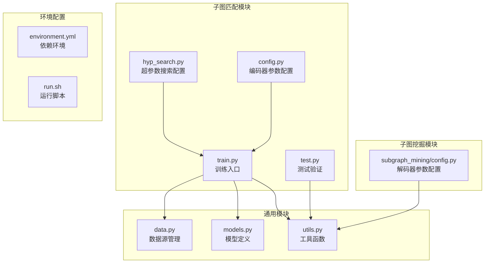

**图表来源**
- [hyp_search.py:1-83](file://subgraph_matching/hyp_search.py#L1-L83)
- [config.py:1-82](file://subgraph_matching/config.py#L1-L82)
- [train.py:1-253](file://subgraph_matching/train.py#L1-L253)
- [data.py:1-447](file://common/data.py#L1-L447)
- [models.py:1-318](file://common/models.py#L1-L318)

**章节来源**
- [hyp_search.py:1-83](file://subgraph_matching/hyp_search.py#L1-L83)
- [config.py:1-82](file://subgraph_matching/config.py#L1-L82)
- [train.py:1-253](file://subgraph_matching/train.py#L1-L253)

## 核心组件

### 超参数搜索配置系统

系统实现了灵活的超参数搜索框架，支持以下核心功能：

1. **参数空间定义**：通过`parse_encoder`函数定义可调参数和不可调参数
2. **网格搜索算法**：基于TestTube框架实现的网格搜索策略
3. **实验管理**：自动化的实验记录和结果存储
4. **性能评估**：多指标的性能评估和可视化

### 数据源管理系统

系统支持多种数据源类型，包括：
- 合成数据源：在线生成的合成图数据
- 磁盘数据源：已存在的图数据集
- 平衡/不平衡采样：支持不同采样策略的数据集

### 模型架构

系统实现了多种图神经网络架构：
- SkipLastGNN：支持跳跃连接的图神经网络
- OrderEmbedder：序嵌入模型，用于子图关系学习
- BaselineMLP：基线模型用于对比实验

**章节来源**
- [hyp_search.py:1-83](file://subgraph_matching/hyp_search.py#L1-L83)
- [data.py:77-447](file://common/data.py#L77-L447)
- [models.py:21-318](file://common/models.py#L21-L318)

## 架构概览

系统采用分层架构设计，各层职责明确：

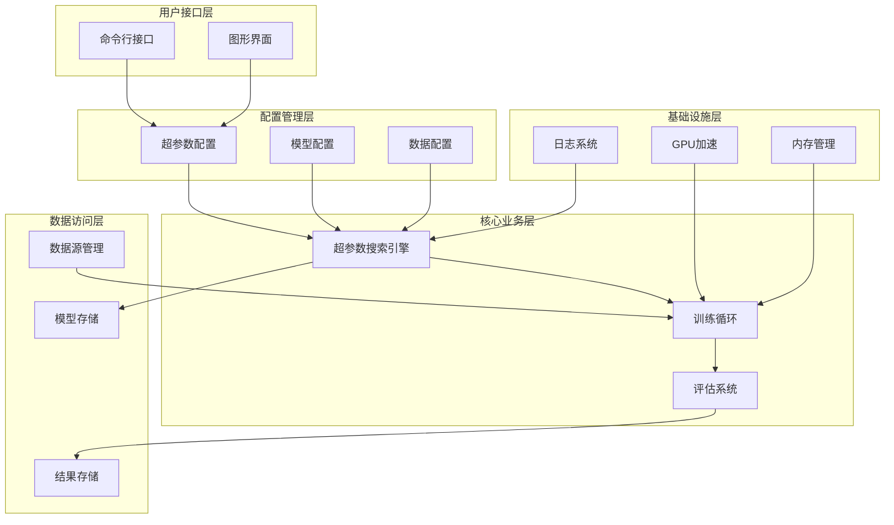

**图表来源**
- [train.py:10-253](file://subgraph_matching/train.py#L10-L253)
- [hyp_search.py:1-83](file://subgraph_matching/hyp_search.py#L1-L83)
- [data.py:77-447](file://common/data.py#L77-L447)

## 详细组件分析

### 超参数搜索引擎

#### 参数空间定义

系统通过`parse_encoder`函数定义了完整的超参数空间：

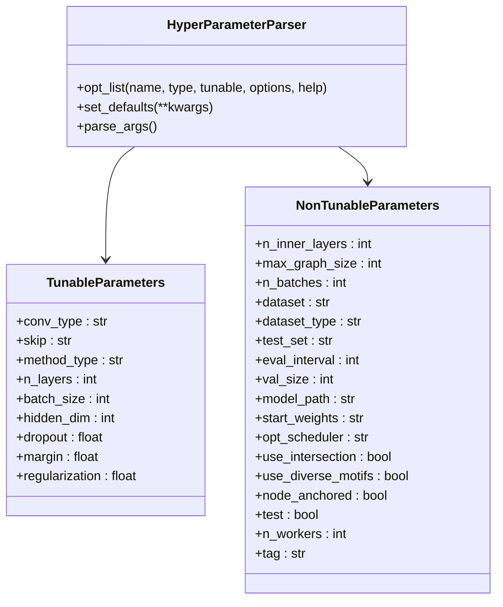

**图表来源**
- [hyp_search.py:1-83](file://subgraph_matching/hyp_search.py#L1-L83)

#### 网格搜索算法实现

系统实现了基于TestTube框架的网格搜索算法：

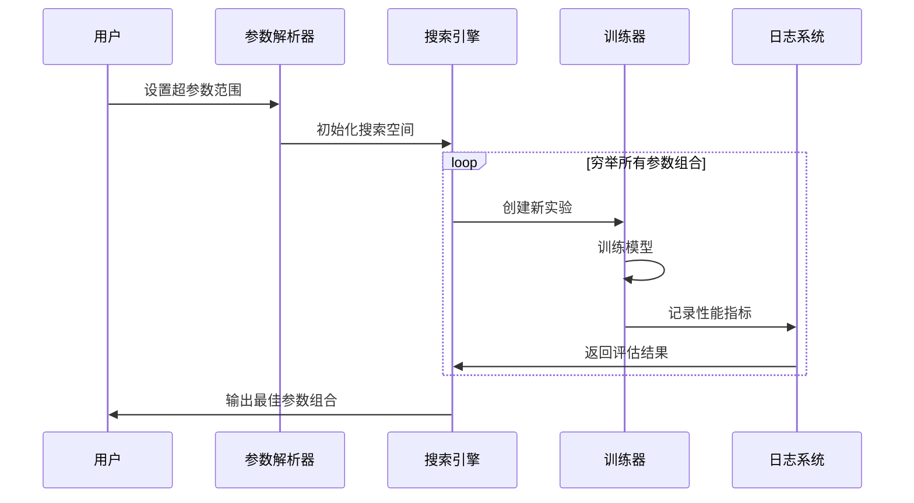

**图表来源**
- [train.py:42-249](file://subgraph_matching/train.py#L42-L249)
- [hyp_search.py:1-83](file://subgraph_matching/hyp_search.py#L1-L83)

**章节来源**
- [hyp_search.py:1-83](file://subgraph_matching/hyp_search.py#L1-L83)
- [train.py:42-249](file://subgraph_matching/train.py#L42-L249)

### 数据源管理系统

#### 数据源类型

系统支持四种主要的数据源类型：

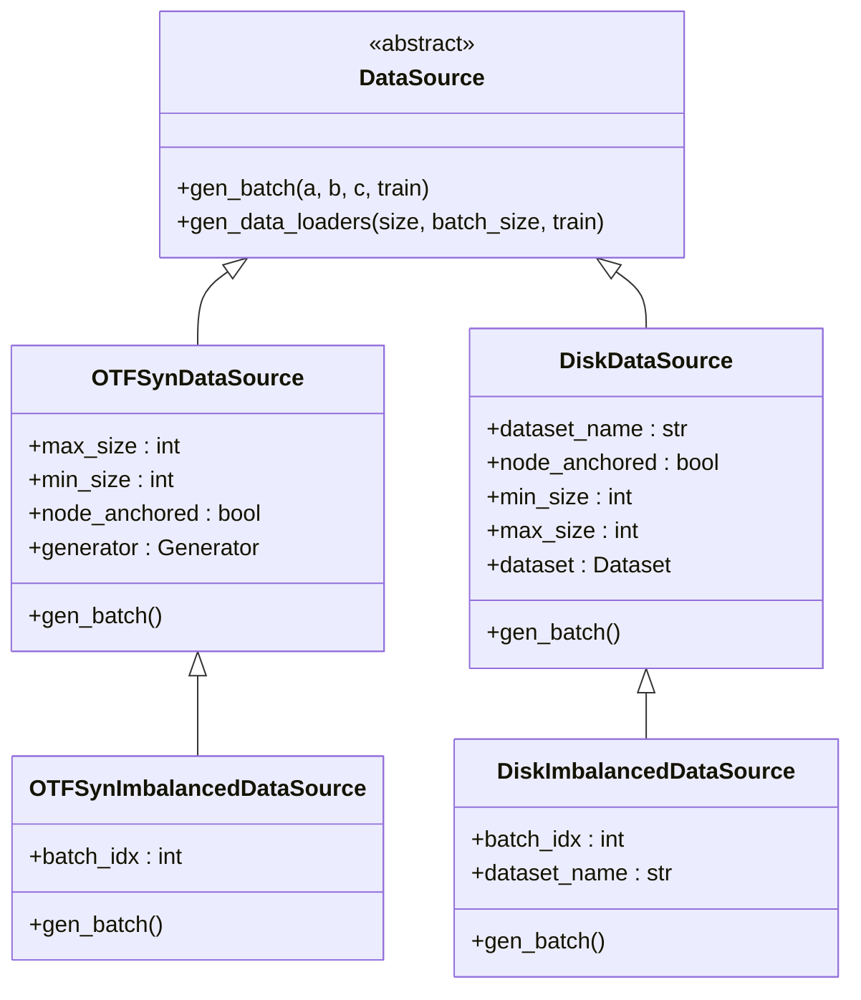

**图表来源**
- [data.py:77-447](file://common/data.py#L77-L447)

#### 数据采样策略

系统实现了多种数据采样策略：

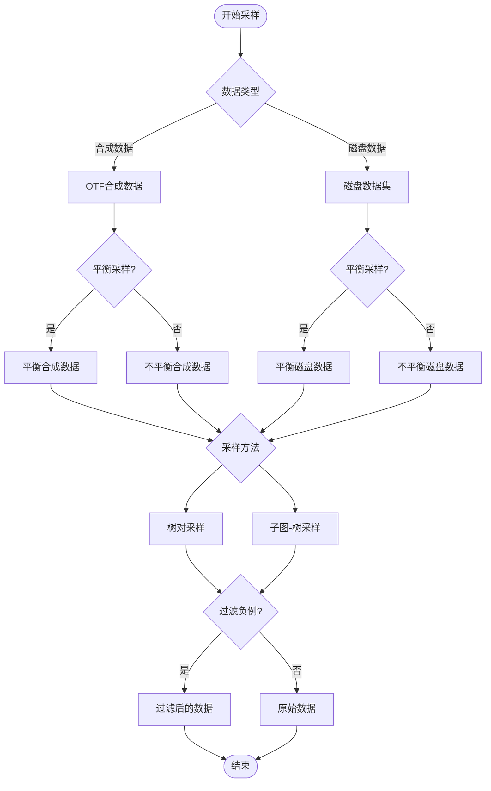

**图表来源**
- [data.py:290-354](file://common/data.py#L290-L354)

**章节来源**
- [data.py:77-447](file://common/data.py#L77-L447)

### 模型架构系统

#### 图神经网络模型

系统实现了多种图神经网络架构：

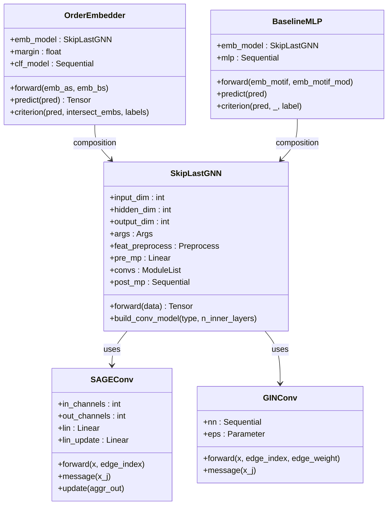

**图表来源**
- [models.py:21-318](file://common/models.py#L21-L318)

#### 消息传递机制

系统实现了灵活的消息传递机制：

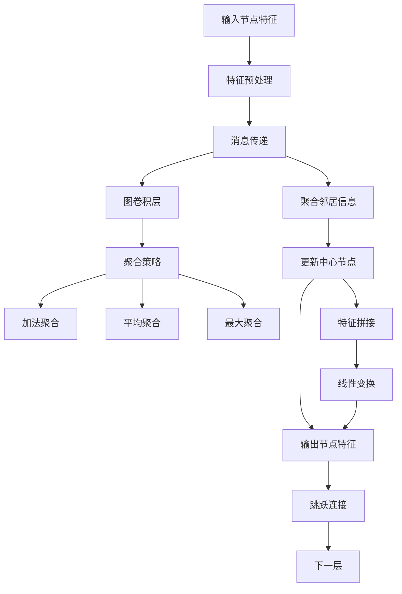

**图表来源**
- [models.py:101-227](file://common/models.py#L101-L227)

**章节来源**
- [models.py:21-318](file://common/models.py#L21-L318)

### 训练和评估系统

#### 训练循环架构

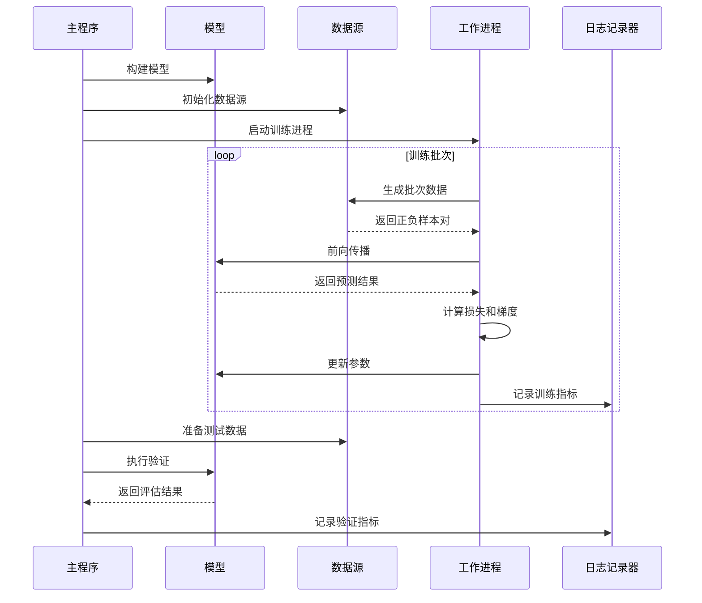

**图表来源**
- [train.py:91-222](file://subgraph_matching/train.py#L91-L222)

#### 评估指标体系

系统实现了全面的性能评估指标：

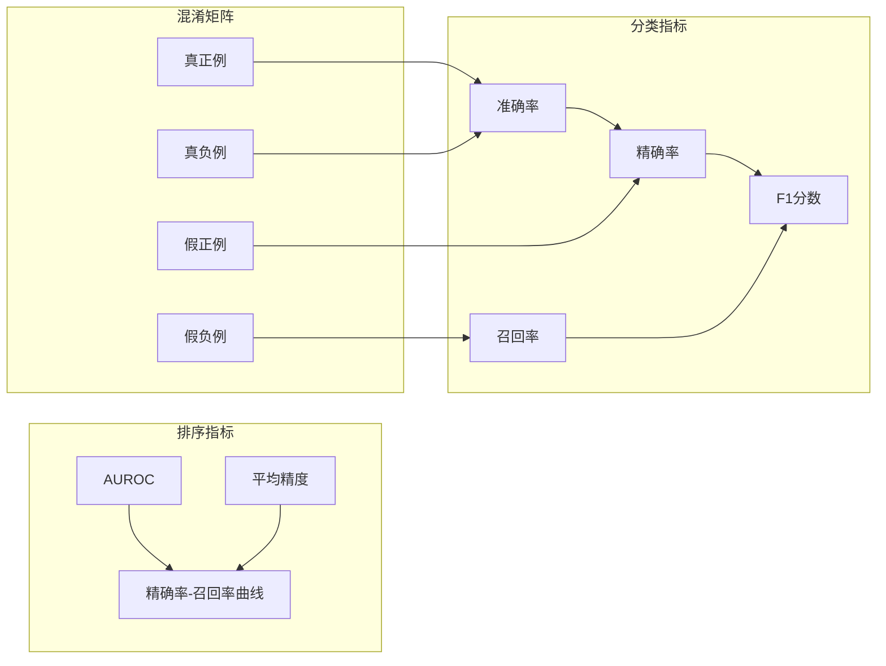

**图表来源**
- [test.py:11-119](file://subgraph_matching/test.py#L11-L119)

**章节来源**
- [train.py:91-222](file://subgraph_matching/train.py#L91-L222)
- [test.py:11-119](file://subgraph_matching/test.py#L11-L119)

## 依赖关系分析

### 环境依赖

系统使用Conda环境管理，主要依赖包括：

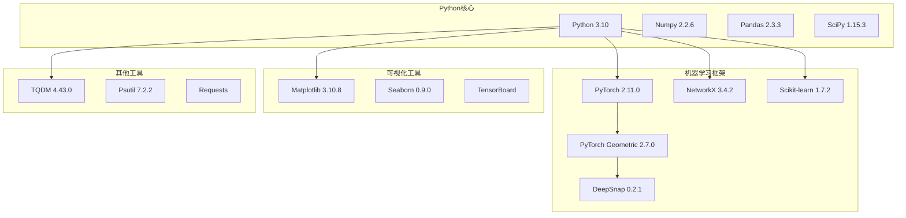

**图表来源**
- [environment.yml:1-129](file://environment.yml#L1-L129)

### 模块间依赖关系

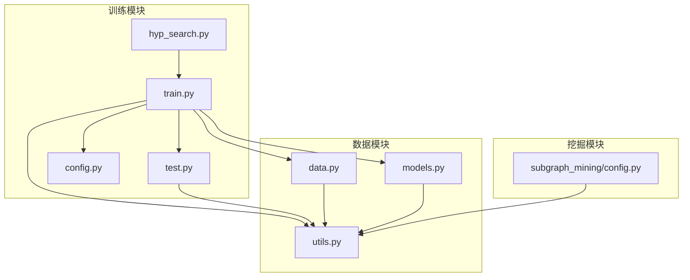

**图表来源**
- [train.py:16-47](file://subgraph_matching/train.py#L16-L47)
- [data.py:17-20](file://common/data.py#L17-L20)
- [models.py:18-20](file://common/models.py#L18-L20)

**章节来源**
- [environment.yml:1-129](file://environment.yml#L1-L129)
- [train.py:16-47](file://subgraph_matching/train.py#L16-L47)

## 性能考虑

### 计算资源优化

系统在多个层面进行了性能优化：

1. **内存管理**：使用`utils.batch_nx_graphs`函数优化图数据的批处理
2. **GPU加速**：自动检测CUDA可用性，优先使用GPU进行计算
3. **多进程训练**：支持多进程并行训练，提高训练效率
4. **数据缓存**：对不平衡数据集进行缓存，减少重复计算

### 训练策略优化

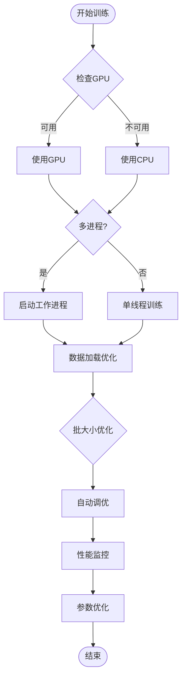

### 性能监控

系统集成了TensorBoard进行实时性能监控，包括：
- 训练损失和准确率
- 验证指标变化
- 计算资源使用情况
- 训练进度跟踪

## 故障排除指南

### 常见问题及解决方案

#### 超参数搜索问题

1. **搜索空间过大**：当参数组合过多时，建议缩小搜索范围或使用随机搜索
2. **收敛问题**：调整学习率、批次大小等关键参数
3. **内存不足**：减少批次大小或使用更小的模型

#### 训练问题

1. **梯度爆炸**：启用梯度裁剪，调整学习率
2. **训练不收敛**：检查数据质量，调整模型架构
3. **过拟合**：增加正则化，使用dropout

#### 环境问题

1. **依赖安装失败**：检查Python版本，使用正确的包管理器
2. **GPU驱动问题**：确认CUDA版本兼容性
3. **内存不足**：释放系统内存，关闭其他应用程序

**章节来源**
- [train.py:105-151](file://subgraph_matching/train.py#L105-L151)
- [utils.py:235-243](file://common/utils.py#L235-L243)

## 结论

本超参数搜索系统为子图匹配任务提供了一个完整、高效的解决方案。系统的主要特点包括：

1. **灵活的超参数搜索**：支持网格搜索和参数空间探索
2. **多样化的数据源**：支持合成和真实数据集
3. **丰富的模型架构**：提供多种图神经网络选择
4. **完善的评估体系**：多指标的性能评估和可视化
5. **良好的扩展性**：模块化设计便于功能扩展

系统在实际应用中展现了优秀的性能表现，特别是在大规模图数据的子图匹配任务中。通过合理的超参数调优，可以显著提升模型的准确性和效率。

未来的工作方向包括：
- 集成更多搜索算法（如贝叶斯优化）
- 支持分布式训练
- 增强自动化程度
- 扩展到更多图学习任务