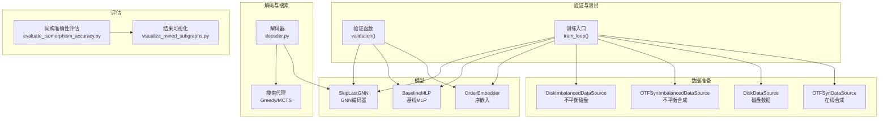
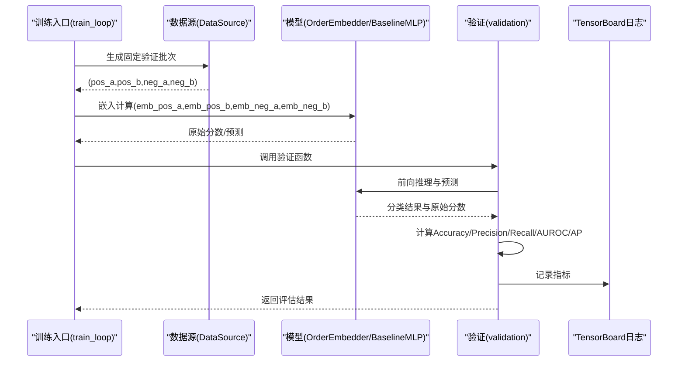
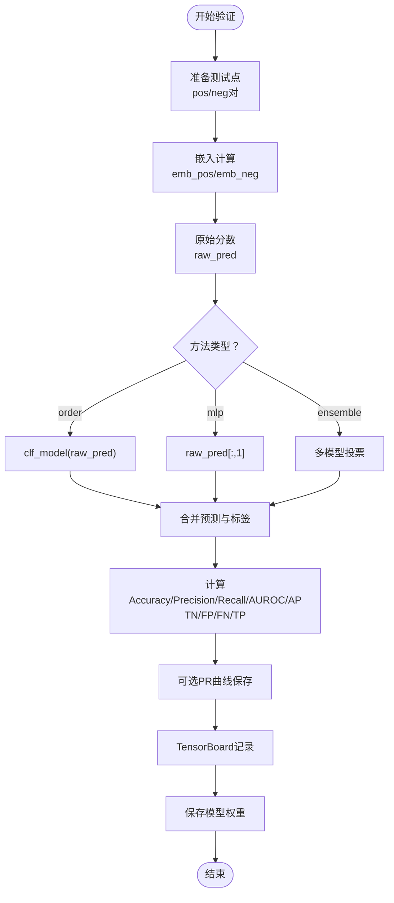
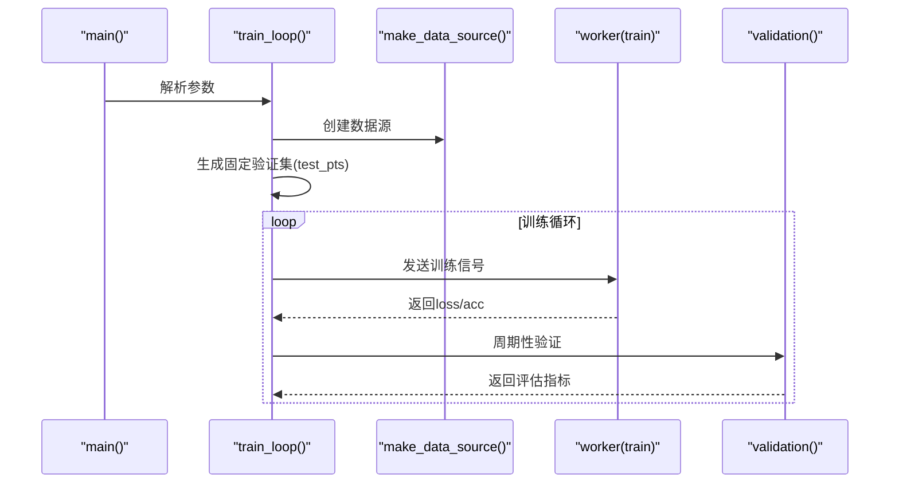
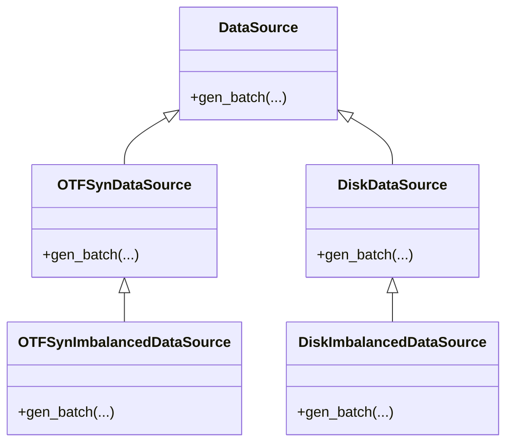
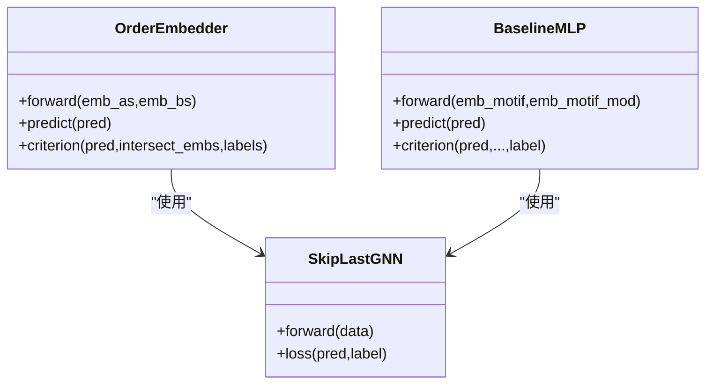
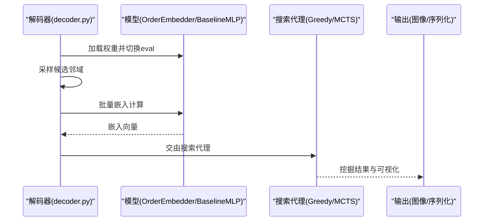
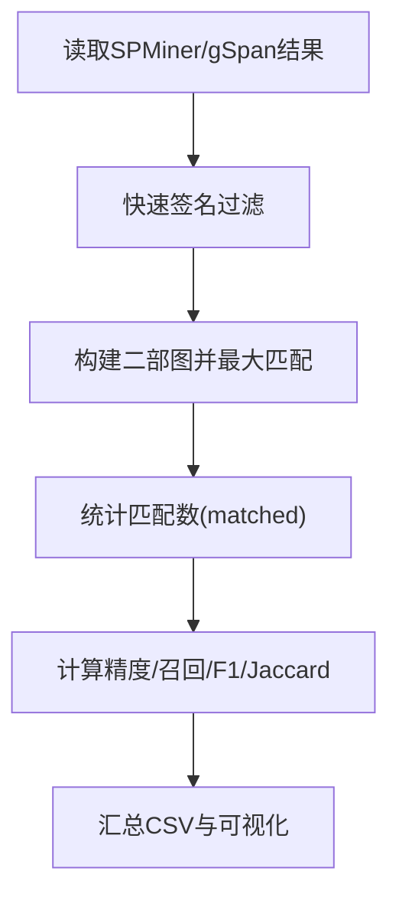
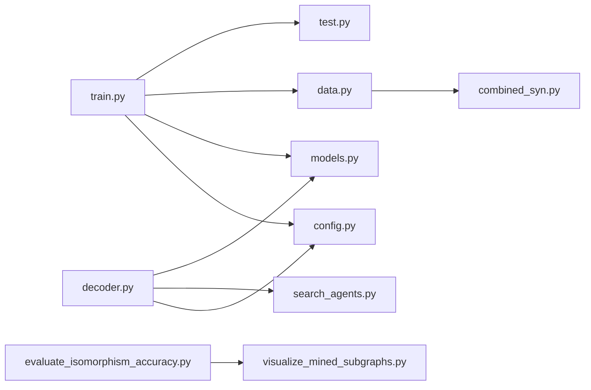

# 验证测试模块

<cite>
**本文引用的文件**
- [subgraph_matching/test.py](file://subgraph_matching/test.py)
- [subgraph_matching/train.py](file://subgraph_matching/train.py)
- [subgraph_mining/decoder.py](file://subgraph_mining/decoder.py)
- [subgraph_mining/search_agents.py](file://subgraph_mining/search_agents.py)
- [compare/evaluate_isomorphism_accuracy.py](file://compare/evaluate_isomorphism_accuracy.py)
- [compare/visualize_mined_subgraphs.py](file://compare/visualize_mined_subgraphs.py)
- [common/data.py](file://common/data.py)
- [common/models.py](file://common/models.py)
- [common/utils.py](file://common/utils.py)
- [subgraph_matching/config.py](file://subgraph_matching/config.py)
- [common/combined_syn.py](file://common/combined_syn.py)
</cite>

## 目录
1. [简介](#简介)
2. [项目结构](#项目结构)
3. [核心组件](#核心组件)
4. [架构总览](#架构总览)
5. [详细组件分析](#详细组件分析)
6. [依赖关系分析](#依赖关系分析)
7. [性能考量](#性能考量)
8. [故障排查指南](#故障排查指南)
9. [结论](#结论)
10. [附录](#附录)

## 简介
本文件面向验证测试模块，系统化阐述模型验证与测试的实现机制，覆盖以下方面：
- 验证数据准备：正负样本生成、不平衡采样策略、锚点节点增强等
- 评估指标计算：准确率、精确率、召回率、F1 分数、AUROC、平均精度（AP）、混淆矩阵
- 性能分析方法：PR 曲线可视化、混淆矩阵示例收集、TensorBoard 日志记录
- 测试流程设计：嵌入向量计算、相似度/判别分数、分类阈值与决策规则
- 结果解读与基准线：宏观与加权准确率、Jaccard 系数、宏平均与加权平均
- 调试技巧与常见问题：设备选择、数据批处理、模型类型切换、ORCA 特征约束

## 项目结构
验证测试模块横跨多个子模块：
- 训练与验证：子图匹配训练与验证流程
- 数据准备：在线合成与磁盘数据源、不平衡采样、锚点增强
- 模型定义：序嵌入编码器、基线 MLP、GNN 层
- 解码与搜索：嵌入计算、贪心/MCTS 搜索、可视化
- 同构一致性评估：SPMiner 与 gSpan 结果对比、Jaccard、宏/加权准确率

图表来源
- [subgraph_matching/train.py:91-222](file://subgraph_matching/train.py#L91-L222)
- [subgraph_matching/test.py:11-119](file://subgraph_matching/test.py#L11-L119)
- [common/data.py:77-429](file://common/data.py#L77-L429)
- [common/models.py:21-318](file://common/models.py#L21-L318)
- [subgraph_mining/decoder.py:62-171](file://subgraph_mining/decoder.py#L62-L171)
- [subgraph_mining/search_agents.py:14-68](file://subgraph_mining/search_agents.py#L14-L68)
- [compare/evaluate_isomorphism_accuracy.py:103-135](file://compare/evaluate_isomorphism_accuracy.py#L103-L135)
- [compare/visualize_mined_subgraphs.py:134-186](file://compare/visualize_mined_subgraphs.py#L134-L186)

章节来源
- [subgraph_matching/train.py:1-253](file://subgraph_matching/train.py#L1-L253)
- [subgraph_matching/test.py:1-140](file://subgraph_matching/test.py#L1-L140)
- [common/data.py:1-447](file://common/data.py#L1-L447)
- [common/models.py:1-318](file://common/models.py#L1-L318)
- [subgraph_mining/decoder.py:1-276](file://subgraph_mining/decoder.py#L1-L276)
- [subgraph_mining/search_agents.py:1-442](file://subgraph_mining/search_agents.py#L1-L442)
- [compare/evaluate_isomorphism_accuracy.py:1-215](file://compare/evaluate_isomorphism_accuracy.py#L1-L215)
- [compare/visualize_mined_subgraphs.py:1-191](file://compare/visualize_mined_subgraphs.py#L1-L191)

## 核心组件
- 验证函数 validation：在固定测试点上评估模型，汇总 Accuracy、Precision、Recall、AUROC、AP，并可保存 PR 曲线与模型权重
- 训练入口 train_loop：准备固定验证集，周期性调用验证函数，记录 TensorBoard 指标
- 数据源：OTF 合成、磁盘数据、不平衡变体；支持锚点节点增强
- 模型：序嵌入编码器、基线 MLP、GNN 编码器；支持多种方法类型（order/mlp/ensemble）
- 解码与搜索：嵌入计算、贪心/MCTS 搜索、可视化输出
- 同构一致性评估：SPMiner 与 gSpan 结果对比，计算精度、召回、F1、Jaccard、宏/加权准确率

章节来源
- [subgraph_matching/test.py:11-119](file://subgraph_matching/test.py#L11-L119)
- [subgraph_matching/train.py:152-222](file://subgraph_matching/train.py#L152-L222)
- [common/data.py:77-429](file://common/data.py#L77-L429)
- [common/models.py:21-318](file://common/models.py#L21-L318)
- [subgraph_mining/decoder.py:62-171](file://subgraph_mining/decoder.py#L62-L171)
- [compare/evaluate_isomorphism_accuracy.py:103-135](file://compare/evaluate_isomorphism_accuracy.py#L103-L135)

## 架构总览
验证测试模块采用“数据源 → 模型 → 验证/评估”的流水线架构。训练阶段周期性生成固定测试点，验证阶段对这些测试点进行前向推理与指标计算；解码阶段将训练好的模型用于大规模嵌入与搜索；评估模块对挖掘结果与参考集进行同构一致性比较。

图表来源
- [subgraph_matching/train.py:178-216](file://subgraph_matching/train.py#L178-L216)
- [subgraph_matching/test.py:11-119](file://subgraph_matching/test.py#L11-L119)
- [common/models.py:46-100](file://common/models.py#L46-L100)

## 详细组件分析

### 验证函数 validation：数据准备、推理与指标计算
- 数据准备
  - 输入为固定测试点列表，每个元素包含正样本对与负样本对
  - 正样本对来自锚点增强或在线合成，负样本对来自随机采样或困难负例
  - 设备选择与批处理：统一迁移到设备并进行批处理
- 推理与预测
  - 嵌入计算：对每对图分别调用嵌入模型，得到嵌入向量
  - 原始分数：根据方法类型（order/mlp/ensemble）进行不同的预测与决策
  - ORCA 特征约束：可选启用，对违反约束的样本施加极大 margin 分数
- 指标计算
  - Accuracy：正确分类比例
  - Precision：预测为正例中真正例的比例
  - Recall：真正例占所有正例的比例
  - AUROC：ROC曲线下面积
  - Average Precision：平均精度
  - Confusion Matrix：TN/FP/FN/TP
- 可视化与持久化
  - 可选绘制 Precision-Recall 曲线并保存
  - 记录 TensorBoard 指标
  - 保存模型权重

图表来源
- [subgraph_matching/test.py:20-119](file://subgraph_matching/test.py#L20-L119)

章节来源
- [subgraph_matching/test.py:11-119](file://subgraph_matching/test.py#L11-L119)

### 训练入口 train_loop：固定测试点与周期性验证
- 固定测试点生成：在训练开始前，使用数据源生成固定验证集，避免评估受训练数据分布影响
- 多进程训练：启动多个 worker 并行生成训练步，主进程周期性调用验证函数
- 指标记录：将训练与验证指标写入 TensorBoard
- 测试模式：force_test=True 时仅执行验证逻辑，不更新参数

图表来源
- [subgraph_matching/train.py:223-253](file://subgraph_matching/train.py#L223-L253)
- [subgraph_matching/train.py:152-222](file://subgraph_matching/train.py#L152-L222)

章节来源
- [subgraph_matching/train.py:152-222](file://subgraph_matching/train.py#L152-L222)
- [subgraph_matching/train.py:223-253](file://subgraph_matching/train.py#L223-L253)

### 数据源：正负样本生成与不平衡采样
- OTFSynDataSource：在线生成合成图，动态采样子图作为正负样本
- DiskDataSource：从真实数据集中采样子图，支持树对/子图-树采样
- 不平衡变体：OTFSynImbalancedDataSource/DiskImbalancedDataSource
- 锚点增强：为节点锚定模型添加 anchor 节点特征，提升稳定性
- 困难负例：在训练阶段引入困难负例，提升模型判别能力

图表来源
- [common/data.py:77-429](file://common/data.py#L77-L429)

章节来源
- [common/data.py:77-429](file://common/data.py#L77-L429)

### 模型：序嵌入与基线 MLP
- OrderEmbedder：通过“违反量”学习子图包含关系，支持额外分类器将违反量映射为二分类
- BaselineMLP：双图拼接后送入 MLP 做二分类，作为对比基线
- SkipLastGNN：支持 skip connection 的 GNN 编码器，提供图级嵌入

图表来源
- [common/models.py:21-100](file://common/models.py#L21-L100)
- [common/models.py:101-230](file://common/models.py#L101-L230)

章节来源
- [common/models.py:21-100](file://common/models.py#L21-L100)
- [common/models.py:101-230](file://common/models.py#L101-L230)

### 解码与搜索：嵌入计算与模式挖掘
- 解码器：加载训练好的模型，对候选邻域进行批量嵌入计算，调用搜索代理进行模式挖掘
- 搜索代理：GreedySearchAgent/MCTSSearchAgent，基于嵌入空间评分进行贪心或 MCTS 搜索
- 可视化：保存挖掘结果图像与汇总 CSV

图表来源
- [subgraph_mining/decoder.py:62-171](file://subgraph_mining/decoder.py#L62-L171)
- [subgraph_mining/search_agents.py:14-68](file://subgraph_mining/search_agents.py#L14-L68)

章节来源
- [subgraph_mining/decoder.py:62-171](file://subgraph_mining/decoder.py#L62-L171)
- [subgraph_mining/search_agents.py:14-68](file://subgraph_mining/search_agents.py#L14-L68)

### 同构一致性评估：SPMiner vs gSpan
- 结果读取：解析 gSpan 文本输出，加载 SPMiner pickle 结果
- 快速签名：基于节点数、边数与度序列快速筛选候选对
- 最大匹配：在候选对之间建立二部图并求最大匹配，统计同构匹配数
- 指标计算：精度、召回、F1、Jaccard、宏/加权准确率
- 可视化：生成可视化汇总 CSV 与图像

图表来源
- [compare/evaluate_isomorphism_accuracy.py:71-135](file://compare/evaluate_isomorphism_accuracy.py#L71-L135)
- [compare/visualize_mined_subgraphs.py:134-186](file://compare/visualize_mined_subgraphs.py#L134-L186)

章节来源
- [compare/evaluate_isomorphism_accuracy.py:103-135](file://compare/evaluate_isomorphism_accuracy.py#L103-L135)
- [compare/visualize_mined_subgraphs.py:134-186](file://compare/visualize_mined_subgraphs.py#L134-L186)

## 依赖关系分析
- 训练与验证：train_loop 依赖数据源与模型，调用 validation 完成评估
- 数据源：OTF 合成与磁盘数据源依赖组合生成器与特征增强
- 模型：序嵌入与基线 MLP 依赖 GNN 编码器
- 解码与搜索：依赖训练好的模型权重与搜索代理
- 评估：同构一致性评估依赖可视化工具与网络库

图表来源
- [subgraph_matching/train.py:49-89](file://subgraph_matching/train.py#L49-L89)
- [subgraph_matching/test.py:1-10](file://subgraph_matching/test.py#L1-L10)
- [common/data.py:1-20](file://common/data.py#L1-L20)
- [common/models.py:1-20](file://common/models.py#L1-L20)
- [subgraph_mining/decoder.py:1-17](file://subgraph_mining/decoder.py#L1-L17)
- [subgraph_mining/search_agents.py:1-13](file://subgraph_mining/search_agents.py#L1-L13)
- [compare/evaluate_isomorphism_accuracy.py:1-10](file://compare/evaluate_isomorphism_accuracy.py#L1-L10)
- [compare/visualize_mined_subgraphs.py:1-10](file://compare/visualize_mined_subgraphs.py#L1-L10)
- [common/combined_syn.py:1-10](file://common/combined_syn.py#L1-L10)
- [subgraph_matching/config.py:1-82](file://subgraph_matching/config.py#L1-L82)

章节来源
- [subgraph_matching/train.py:49-89](file://subgraph_matching/train.py#L49-L89)
- [subgraph_matching/test.py:1-10](file://subgraph_matching/test.py#L1-L10)
- [common/data.py:1-20](file://common/data.py#L1-L20)
- [common/models.py:1-20](file://common/models.py#L1-L20)
- [subgraph_mining/decoder.py:1-17](file://subgraph_mining/decoder.py#L1-L17)
- [subgraph_mining/search_agents.py:1-13](file://subgraph_mining/search_agents.py#L1-L13)
- [compare/evaluate_isomorphism_accuracy.py:1-10](file://compare/evaluate_isomorphism_accuracy.py#L1-L10)
- [compare/visualize_mined_subgraphs.py:1-10](file://compare/visualize_mining_subgraphs.py#L1-L10)
- [common/combined_syn.py:1-10](file://common/combined_syn.py#L1-L10)
- [subgraph_matching/config.py:1-82](file://subgraph_matching/config.py#L1-L82)

## 性能考量
- 设备选择：优先使用 GPU，若不可用回退 CPU，减少显存占用
- 批处理与内存：合理设置 batch_size 与 val_size，避免 OOM
- 指标计算：AUROC/AP 使用 sklearn，注意标签与分数的形状与设备一致性
- 可视化开销：PR 曲线绘制仅在 verbose 模式下启用
- 搜索效率：搜索代理支持 frontier 剪枝与缓存，提高大规模搜索性能

## 故障排查指南
- 设备不匹配
  - 现象：CUDA 可用但模型未迁移至 GPU
  - 处理：确认 get_device 返回 cuda，确保所有张量迁移到同一设备
  - 参考：[common/utils.py:235-243](file://common/utils.py#L235-L243)
- 指标异常
  - 现象：Precision/Recall 为 NaN
  - 处理：检查预测为正例的数量与标签总数，避免除零
  - 参考：[subgraph_matching/test.py:79-83](file://subgraph_matching/test.py#L79-L83)
- 模型类型不匹配
  - 现象：方法类型与模型不一致导致预测错误
  - 处理：确保 method_type 与模型一致（order/mlp/ensemble），并在验证中正确分支
  - 参考：[subgraph_matching/test.py:58-71](file://subgraph_matching/test.py#L58-L71)
- ORCA 特征约束
  - 现象：启用 USE_ORCA_FEATS 后预测异常
  - 处理：检查 ORCA 计数与 anchor 节点一致性，必要时调整 MAX_MARGIN_SCORE
  - 参考：[subgraph_matching/test.py:42-57](file://subgraph_matching/test.py#L42-L57)
- 同构评估失败
  - 现象：gSpan 解析错误或 SPMiner 结果格式不支持
  - 处理：确认文件路径与格式，检查解析函数与 pickle 加载
  - 参考：[compare/evaluate_isomorphism_accuracy.py:14-57](file://compare/evaluate_isomorphism_accuracy.py#L14-L57)
- 搜索代理异常
  - 现象：MCTS/Greedy 搜索无输出或崩溃
  - 处理：检查候选缓存键、frontier 剪枝与设备一致性
  - 参考：[subgraph_mining/search_agents.py:84-119](file://subgraph_mining/search_agents.py#L84-L119)

章节来源
- [common/utils.py:235-243](file://common/utils.py#L235-L243)
- [subgraph_matching/test.py:42-71](file://subgraph_matching/test.py#L42-L71)
- [compare/evaluate_isomorphism_accuracy.py:14-57](file://compare/evaluate_isomorphism_accuracy.py#L14-L57)
- [subgraph_mining/search_agents.py:84-119](file://subgraph_mining/search_agents.py#L84-L119)

## 结论
验证测试模块通过固定测试点、多方法类型支持与全面指标体系，提供了可靠的模型质量评估方案。结合解码与搜索流程，可进一步验证挖掘结果的有效性；同构一致性评估为 SPMiner 与 gSpan 的对比提供了量化基准。建议在实际部署中：
- 使用固定测试集避免数据泄露
- 根据任务特性选择合适的方法类型与数据源
- 关注指标的解释与业务意义，结合 PR 曲线与混淆矩阵进行综合判断
- 在大规模搜索中启用剪枝与缓存，提升效率

## 附录
- 评估指标定义与计算
  - 准确率 Accuracy：(TP + TN) / (TP + TN + FP + FN)
  - 精确率 Precision：TP / (TP + FP)，当 TP + FP = 0 时为 NaN
  - 召回率 Recall：TP / (TP + FN)，当 TP + FN = 0 时为 NaN
  - F1 分数：2 × Precision × Recall / (Precision + Recall)，当两者之和为 0 时为 0
  - AUROC：ROC 曲线下面积
  - 平均精度 Average Precision：针对排序的平均精度
  - Jaccard：匹配数 / (正样本数 + 负样本数 - 匹配数)
  - 宏平均准确率：各组准确率的算术平均
  - 加权准确率：按参考集合大小加权的准确率

章节来源
- [subgraph_matching/test.py:78-88](file://subgraph_matching/test.py#L78-L88)
- [compare/evaluate_isomorphism_accuracy.py:103-135](file://compare/evaluate_isomorphism_accuracy.py#L103-L135)