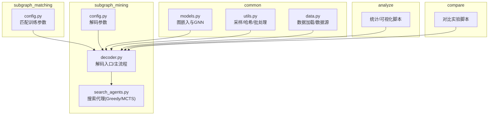
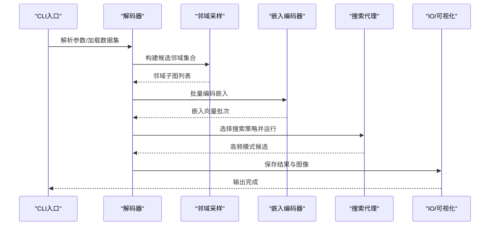
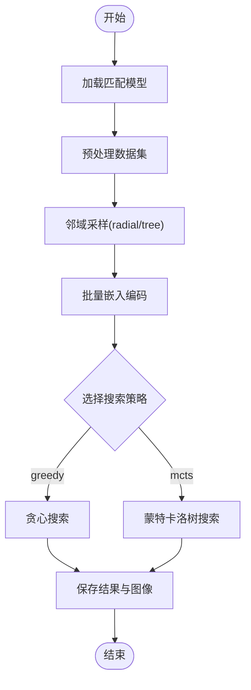
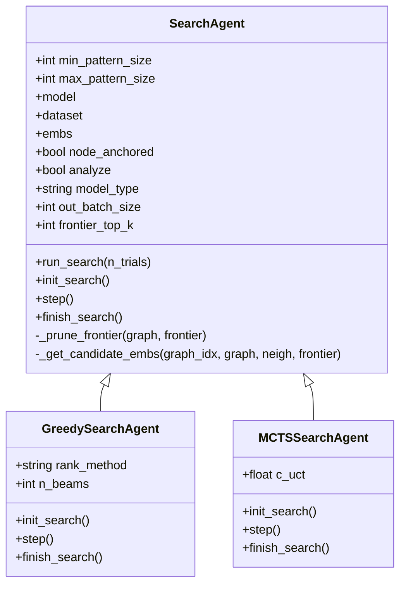
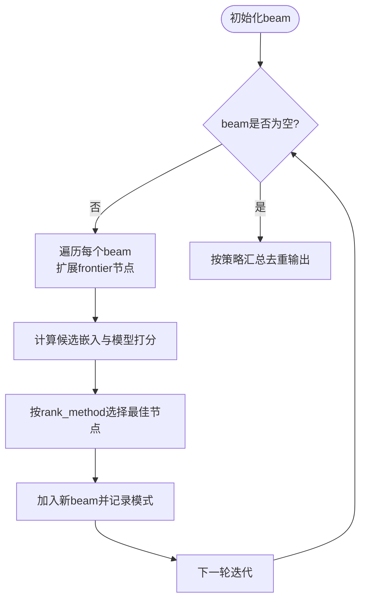
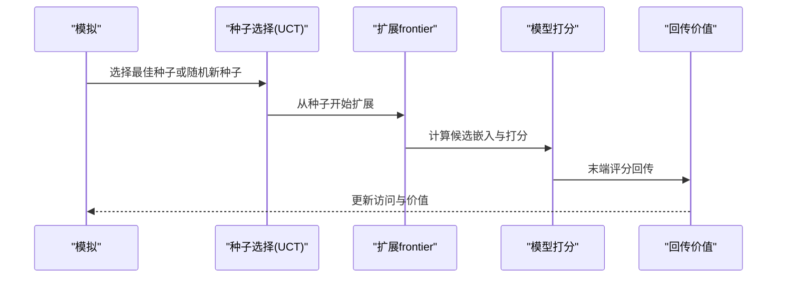
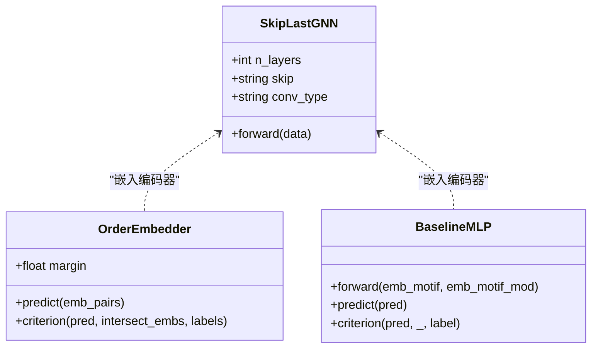
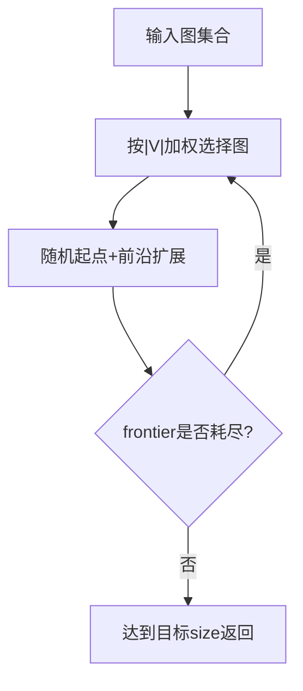
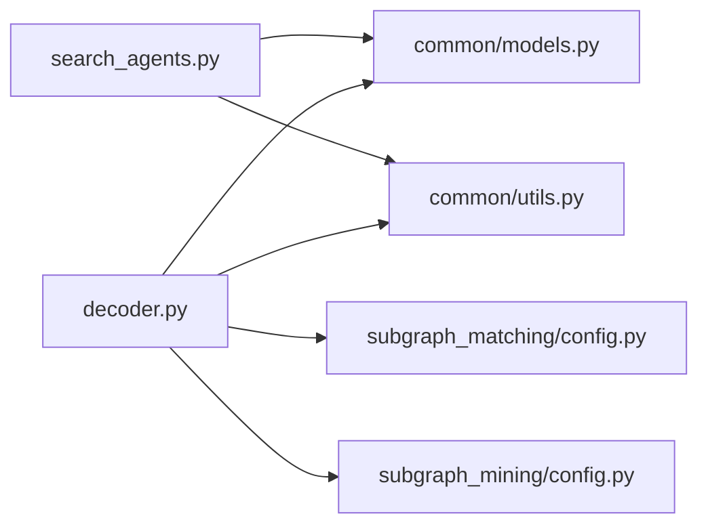

# 子图挖掘解码系统

<cite>
**本文档引用的文件**
- [decoder.py](file://subgraph_mining/decoder.py)
- [search_agents.py](file://subgraph_mining/search_agents.py)
- [config.py](file://subgraph_mining/config.py)
- [config.py](file://subgraph_matching/config.py)
- [models.py](file://common/models.py)
- [utils.py](file://common/utils.py)
- [data.py](file://common/data.py)
- [README.md](file://README.md)
</cite>

## 目录
1. [简介](#简介)
2. [项目结构](#项目结构)
3. [核心组件](#核心组件)
4. [架构总览](#架构总览)
5. [详细组件分析](#详细组件分析)
6. [依赖分析](#依赖分析)
7. [性能考量](#性能考量)
8. [故障排查指南](#故障排查指南)
9. [结论](#结论)
10. [附录](#附录)

## 简介
本文件为“子图挖掘解码系统”的技术文档，聚焦于 SPMiner 解码阶段的完整流程设计与实现细节。系统以“邻域采样-嵌入编码-搜索算法”为主线，将训练好的子图匹配模型作为频繁模式的评分器，通过贪心搜索与蒙特卡洛树搜索（MCTS）两种策略在候选邻域嵌入空间中进行高效搜索，最终输出高频子图模式并进行可视化与序列化保存。

## 项目结构
仓库采用模块化组织，核心围绕“编码器训练”和“解码挖掘”两大主线展开：
- common：通用模型、数据与工具模块
- subgraph_matching：子图匹配训练与评估
- subgraph_mining：频繁子图挖掘（解码）
- analyze：结果分析与可视化
- compare：对比实验与可视化
- data/ckpt/results/plots：数据与输出目录

图表来源
- [decoder.py:1-276](file://subgraph_mining/decoder.py#L1-L276)
- [search_agents.py:1-442](file://subgraph_mining/search_agents.py#L1-L442)
- [config.py:1-65](file://subgraph_mining/config.py#L1-L65)
- [config.py:1-82](file://subgraph_matching/config.py#L1-L82)
- [models.py:1-318](file://common/models.py#L1-L318)
- [utils.py:1-302](file://common/utils.py#L1-L302)
- [data.py:1-447](file://common/data.py#L1-L447)

章节来源
- [README.md:30-62](file://README.md#L30-L62)

## 核心组件
- 解码器入口与主流程：负责加载数据集、构建候选邻域、批量编码嵌入、选择搜索策略并输出结果。
- 搜索代理：抽象基类与具体实现（贪心、MCTS），统一搜索驱动循环，支持前沿剪枝与候选嵌入缓存。
- 子图匹配模型：提供图嵌入编码器与评分器，支撑候选模式的频率估计与相似度打分。
- 通用工具：邻域采样、WL图哈希、批处理、设备选择等。

章节来源
- [decoder.py:62-171](file://subgraph_mining/decoder.py#L62-L171)
- [search_agents.py:14-128](file://subgraph_mining/search_agents.py#L14-L128)
- [models.py:22-100](file://common/models.py#L22-L100)
- [utils.py:18-302](file://common/utils.py#L18-L302)

## 架构总览
解码系统遵循“数据-嵌入-搜索-输出”的流水线设计：
- 数据加载：支持 TUDataset、PPI、本地 SNAP 边列表等多种来源。
- 邻域采样：辐射式（radial）与树形（tree）两种策略，支持整图采样与邻域截断。
- 嵌入编码：将候选子图批量转换为图数据对象，经 GNN 编码器得到嵌入。
- 搜索策略：GreedyBeam 与 MCTS，分别基于贪心扩展与 UCT 探索。
- 结果输出：保存序列化模式与可视化图像。

图表来源
- [decoder.py:62-171](file://subgraph_mining/decoder.py#L62-L171)
- [search_agents.py:54-68](file://subgraph_mining/search_agents.py#L54-L68)
- [models.py:101-226](file://common/models.py#L101-L226)
- [utils.py:286-302](file://common/utils.py#L286-L302)

## 详细组件分析

### 解码器主流程（pattern_growth）
- 模型初始化：根据 method_type 选择 End2EndOrder/BaselineMLP/OrderEmbedder。
- 数据预处理：统一为 NetworkX 图列表，支持按标签过滤与截断。
- 邻域采样：radial 与 tree 两种策略，支持整图采样与邻域截断。
- 嵌入编码：分批将候选子图转换为 DeepSNAP Batch，调用模型嵌入编码器。
- 搜索阶段：根据 search_strategy 选择 GreedySearchAgent 或 MCTSSearchAgent。
- 结果输出：保存模式序列化文件并输出可视化图像。

图表来源
- [decoder.py:62-171](file://subgraph_mining/decoder.py#L62-L171)

章节来源
- [decoder.py:62-171](file://subgraph_mining/decoder.py#L62-L171)

### 搜索代理设计模式与扩展机制
- 抽象基类 SearchAgent：定义统一的 run_search 主循环，子类需实现 init_search、step、is_search_done、finish_search。
- 前沿剪枝与候选缓存：_prune_frontier 与 _get_candidate_embs 提升搜索效率。
- 扩展机制：新增搜索策略只需继承 SearchAgent 并实现上述抽象方法，即可复用统一主循环。

图表来源
- [search_agents.py:14-128](file://subgraph_mining/search_agents.py#L14-L128)
- [search_agents.py:284-442](file://subgraph_mining/search_agents.py#L284-L442)
- [search_agents.py:129-283](file://subgraph_mining/search_agents.py#L129-L283)

章节来源
- [search_agents.py:14-128](file://subgraph_mining/search_agents.py#L14-L128)
- [search_agents.py:284-442](file://subgraph_mining/search_agents.py#L284-L442)

### 贪心搜索（GreedySearchAgent）
- 初始化：按数据集分布随机选择种子节点，形成 beam 集合。
- 每步扩展：对每个 beam 的 frontier 节点计算候选嵌入，基于模型预测分数排序，保留最佳扩展。
- 排序策略：支持 counts（计数）、margin（模型打分）、hybrid（混合）三种策略。
- 结束：按策略汇总候选，去重并输出每种尺寸的 top-K 模式。

图表来源
- [search_agents.py:284-442](file://subgraph_mining/search_agents.py#L284-L442)

章节来源
- [search_agents.py:284-442](file://subgraph_mining/search_agents.py#L284-L442)

### 蒙特卡洛树搜索（MCTSSearchAgent）
- 初始化：维护访问计数、累计价值、WL 哈希到图的映射。
- 每轮模拟：选择已有种子节点（基于UCT准则）或随机新种子，沿 frontier 扩展至目标尺寸。
- 价值回传：将末端评分沿路径累计，更新访问计数与累计价值。
- 结束：按访问次数统计每尺寸的高频模式并输出。

图表来源
- [search_agents.py:129-283](file://subgraph_mining/search_agents.py#L129-L283)

章节来源
- [search_agents.py:129-283](file://subgraph_mining/search_agents.py#L129-L283)

### 嵌入编码与模型设计
- 编码器：SkipLastGNN 支持多种卷积类型（SAGE/GCN/GIN/GAT/PNA），可配置 skip 连接与 dropout。
- 任务头：OrderEmbedder 通过嵌入空间的序关系约束学习子图包含关系；BaselineMLP 作为拼接基线。
- 批处理：utils.batch_nx_graphs 将 NetworkX 图转换为 DeepSNAP Batch 并增强节点特征。

图表来源
- [models.py:101-226](file://common/models.py#L101-L226)
- [models.py:46-100](file://common/models.py#L46-L100)
- [models.py:22-44](file://common/models.py#L22-L44)
- [utils.py:286-302](file://common/utils.py#L286-L302)

章节来源
- [models.py:101-226](file://common/models.py#L101-L226)
- [models.py:46-100](file://common/models.py#L46-L100)
- [models.py:22-44](file://common/models.py#L22-L44)
- [utils.py:286-302](file://common/utils.py#L286-L302)

### 邻域采样与数据加载
- 邻域采样：sample_neigh 支持按图大小加权采样，前沿扩展至目标 size。
- 数据加载：支持 TUDataset、PPI、本地 SNAP 边列表文件，自动取最大连通子图保证连通性。
- WL 哈希：vec_hash/wl_hash 提供稳定的图结构签名，用于去重与计数。

图表来源
- [utils.py:18-53](file://common/utils.py#L18-L53)
- [decoder.py:104-138](file://subgraph_mining/decoder.py#L104-L138)
- [utils.py:70-96](file://common/utils.py#L70-L96)

章节来源
- [utils.py:18-53](file://common/utils.py#L18-L53)
- [decoder.py:104-138](file://subgraph_mining/decoder.py#L104-L138)
- [utils.py:70-96](file://common/utils.py#L70-L96)

## 依赖分析
- 解码器依赖：common.models（嵌入编码器）、common.utils（采样/批处理/WL哈希）、subgraph_matching.config（匹配模型参数）、subgraph_mining.config（解码参数）。
- 搜索代理依赖：common.utils（批处理/哈希）、torch/numpy/scipy/networkx/matplotlib/pickle。
- 数据加载依赖：torch_geometric/TUDataset/PPI、networkx、deep snap。

图表来源
- [decoder.py:12-17](file://subgraph_mining/decoder.py#L12-L17)
- [search_agents.py:1-12](file://subgraph_mining/search_agents.py#L1-L12)
- [config.py:1-82](file://subgraph_matching/config.py#L1-L82)
- [config.py:1-65](file://subgraph_mining/config.py#L1-L65)
- [models.py:1-20](file://common/models.py#L1-L20)
- [utils.py:1-16](file://common/utils.py#L1-L16)

章节来源
- [decoder.py:12-17](file://subgraph_mining/decoder.py#L12-L17)
- [search_agents.py:1-12](file://subgraph_mining/search_agents.py#L1-L12)
- [config.py:1-82](file://subgraph_matching/config.py#L1-L82)
- [config.py:1-65](file://subgraph_mining/config.py#L1-L65)
- [models.py:1-20](file://common/models.py#L1-L20)
- [utils.py:1-16](file://common/utils.py#L1-L16)

## 性能考量
- 批处理与缓存：嵌入编码分批进行，候选嵌入缓存减少重复计算。
- 前沿剪枝：frontier_top_k 控制每步候选数量，显著降低搜索空间。
- 设备选择：懒加载设备，优先使用 GPU。
- 参数调优建议：
  - 减小 n_neighborhoods、n_trials、batch_size 以加速验证。
  - 合理设置 min/max_pattern_size 与 out_batch_size。
  - 使用 radial 采样时合理设置 radius 与 subgraph_sample_size。
  - MCTS 的 c_uct 与 Greedy 的 n_beams 可根据数据规模调整。

章节来源
- [decoder.py:139-151](file://subgraph_mining/decoder.py#L139-L151)
- [search_agents.py:121-127](file://subgraph_mining/search_agents.py#L121-L127)
- [utils.py:235-243](file://common/utils.py#L235-L243)
- [README.md:354-362](file://README.md#L354-L362)

## 故障排查指南
- 找不到依赖包：确认已激活正确 conda 环境并安装 torch、torch_geometric、deepsnap、networkx、numpy、matplotlib、tensorboard。
- Facebook 数据集文件缺失：确保 data/facebook_combined.txt 存在。
- 挖掘速度慢：减小 n_neighborhoods、n_trials、batch_size；或切换到更小的数据集。
- 输出图像过多：这是正常行为，可通过 out_batch_size 控制每尺寸输出数量。
- 模型类型不匹配：确保 method_type 与训练时一致，MCTS 仅支持 order 类型。

章节来源
- [README.md:342-367](file://README.md#L342-L367)
- [decoder.py:73-82](file://subgraph_mining/decoder.py#L73-L82)
- [decoder.py:158-169](file://subgraph_mining/decoder.py#L158-L169)

## 结论
本解码系统通过“邻域采样-嵌入编码-搜索算法”的协同设计，将训练好的子图匹配模型作为评分器，实现了高效的频繁子图挖掘。SearchAgent 抽象与 Greedy/MCTS 两种策略提供了灵活的扩展能力；utils 与 models 模块保证了数据与模型层面的稳定性与可移植性。通过合理的参数配置与性能优化，可在多种真实数据集上快速获得高质量的模式候选。

## 附录

### 使用方法与配置选项
- 训练匹配模型：参考 subgraph_matching 模块的训练与测试入口。
- 运行解码器：使用 subgraph_mining.decoder，常用参数包括 dataset、model_path、n_neighborhoods、n_trials、batch_size、search_strategy、min/max_pattern_size、out_batch_size、frontier_top_k、sample_method、radius、subgraph_sample_size、use_whole_graphs、node_anchored 等。
- 输出结果：results/out-patterns.p 为序列化模式文件；plots/cluster/ 下为 PNG/PDF 可视化图像。

章节来源
- [README.md:129-163](file://README.md#L129-L163)
- [README.md:244-267](file://README.md#L244-L267)
- [decoder.py:197-271](file://subgraph_mining/decoder.py#L197-L271)
- [config.py:4-59](file://subgraph_mining/config.py#L4-L59)
- [config.py:4-77](file://subgraph_matching/config.py#L4-L77)