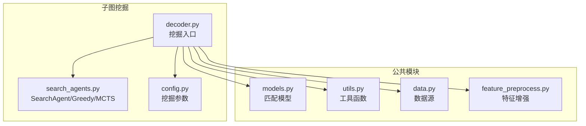
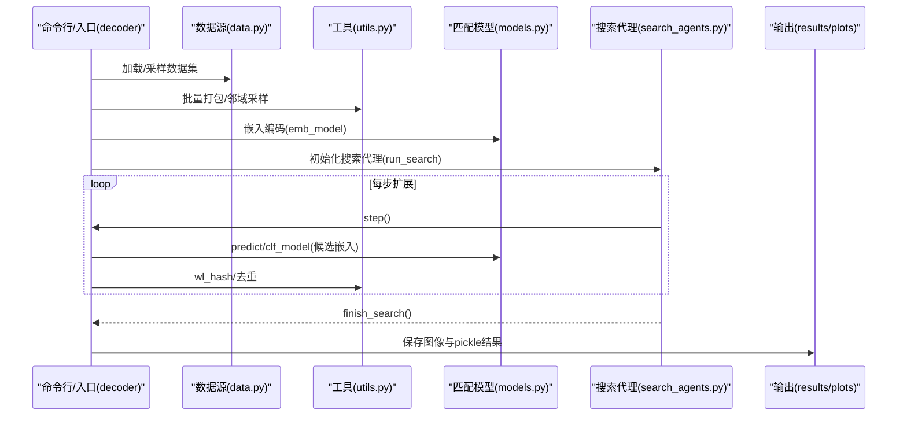
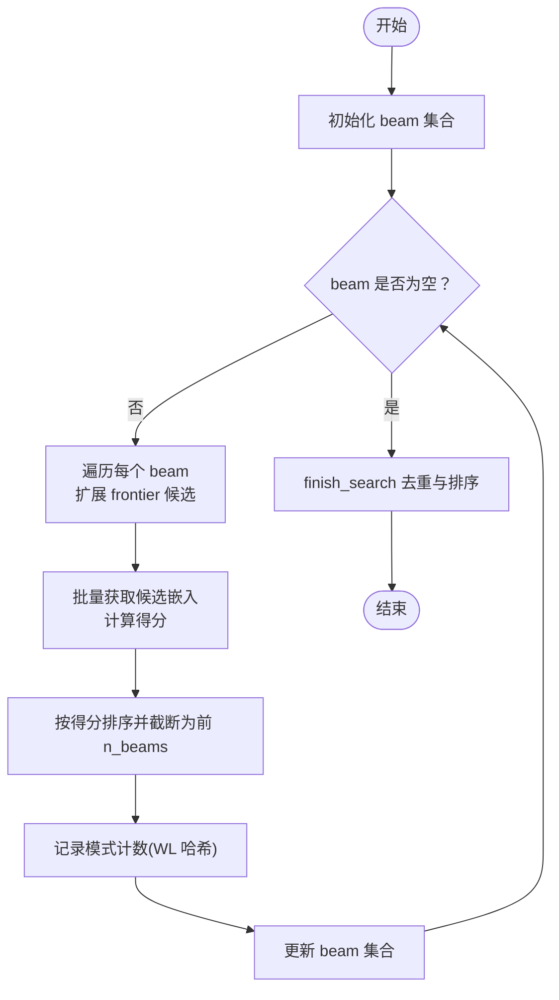
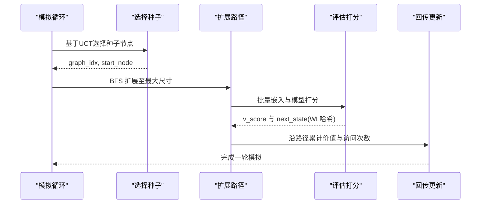
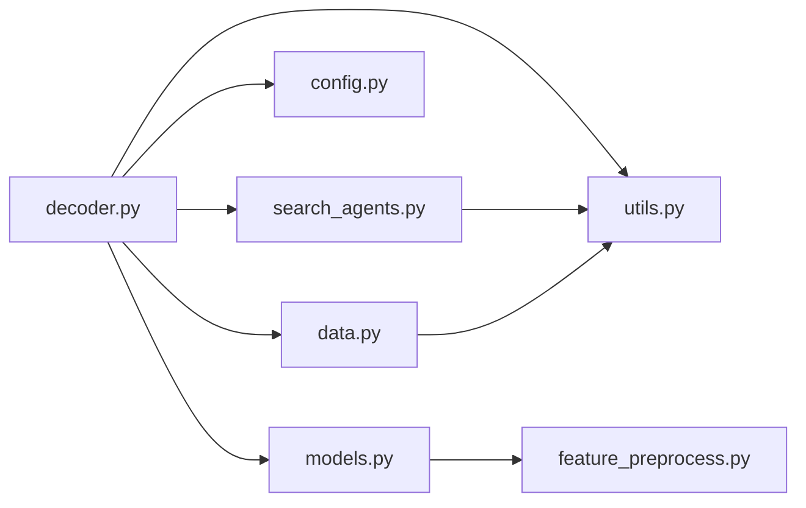

# 搜索算法实现

<cite>
**本文档引用的文件**
- [search_agents.py](file://subgraph_mining/search_agents.py)
- [decoder.py](file://subgraph_mining/decoder.py)
- [config.py](file://subgraph_mining/config.py)
- [models.py](file://common/models.py)
- [utils.py](file://common/utils.py)
- [data.py](file://common/data.py)
- [feature_preprocess.py](file://common/feature_preprocess.py)
- [README.md](file://README.md)
</cite>

## 目录
1. [简介](#简介)
2. [项目结构](#项目结构)
3. [核心组件](#核心组件)
4. [架构总览](#架构总览)
5. [详细组件分析](#详细组件分析)
6. [依赖分析](#依赖分析)
7. [性能考量](#性能考量)
8. [故障排查指南](#故障排查指南)
9. [结论](#结论)
10. [附录](#附录)

## 简介
本技术文档围绕搜索算法实现展开，重点阐述搜索代理的设计模式与架构原理，以及两种关键搜索策略：贪心搜索（GreedySearchAgent）与蒙特卡洛树搜索（MCTSSearchAgent）。文档将从设计思想、实现细节、剪枝与收敛策略、复杂度分析、适用场景与扩展指南等方面进行全面说明，帮助读者在理解代码的同时，掌握如何定制与扩展搜索策略。

## 项目结构
本项目采用模块化组织，搜索算法位于子图挖掘模块中，配合模型、数据与工具模块协同工作。关键文件与职责如下：
- subgraph_mining/search_agents.py：定义 SearchAgent 基类及 GreedySearchAgent、MCTSSearchAgent 两大搜索代理。
- subgraph_mining/decoder.py：挖掘流程入口，负责加载模型、采样候选邻域、批量嵌入、调用搜索代理并输出结果。
- subgraph_mining/config.py：挖掘阶段参数定义与默认值。
- common/models.py：图嵌入与匹配模型（含序嵌入、MLP 基线等），为搜索阶段提供打分能力。
- common/utils.py：通用工具，如邻域采样、WL 标记哈希、设备管理、批量图打包等。
- common/data.py：数据源封装与真实数据集加载。
- common/feature_preprocess.py：节点特征增强与预处理。
- README.md：项目概览与使用说明。

**图表来源**
- [decoder.py:62-170](file://subgraph_mining/decoder.py#L62-L170)
- [search_agents.py:14-128](file://subgraph_mining/search_agents.py#L14-L128)
- [config.py:4-65](file://subgraph_mining/config.py#L4-L65)
- [models.py:22-100](file://common/models.py#L22-L100)
- [utils.py:18-53](file://common/utils.py#L18-L53)
- [data.py:21-75](file://common/data.py#L21-L75)
- [feature_preprocess.py:71-192](file://common/feature_preprocess.py#L71-L192)

**章节来源**
- [README.md:30-62](file://README.md#L30-L62)
- [decoder.py:62-170](file://subgraph_mining/decoder.py#L62-L170)

## 核心组件
本节聚焦 SearchAgent 基类及其抽象接口，以及候选嵌入缓存、前沿剪枝与状态哈希等通用机制。

- SearchAgent 基类
  - 职责：统一搜索驱动器 run_search，封装 init_search、step、finish_search 抽象接口，供子类实现。
  - 关键属性：最小/最大模式尺寸、模型、数据集、嵌入、节点锚定开关、分析开关、模型类型、输出批大小、前沿剪枝阈值等。
  - 通用能力：候选嵌入缓存 cand_emb_cache、批量获取候选嵌入 _get_candidate_embs、前沿剪枝 _prune_frontier、稳定缓存键 _candidate_cache_key。

- 候选嵌入缓存与批量获取
  - 通过 _candidate_cache_key 生成稳定键，避免重复计算。
  - _get_candidate_embs 批量调用模型嵌入接口，将结果写回缓存，提升后续查询效率。

- 前沿剪枝
  - _prune_frontier 基于节点度数与可选阈值 frontier_top_k，限制每步扩展候选数量，降低搜索空间。

- 模式哈希与去重
  - 通过 utils.wl_hash 生成 WL 风格哈希签名，用于将同构/近同构模式归并计数，减少重复输出。

**章节来源**
- [search_agents.py:14-128](file://subgraph_mining/search_agents.py#L14-L128)
- [utils.py:70-96](file://common/utils.py#L70-L96)

## 架构总览
下图展示了从数据采样到搜索再到输出的整体流程，以及搜索代理与模型、工具模块之间的交互关系。

**图表来源**
- [decoder.py:62-170](file://subgraph_mining/decoder.py#L62-L170)
- [search_agents.py:54-128](file://subgraph_mining/search_agents.py#L54-L128)
- [models.py:46-100](file://common/models.py#L46-L100)
- [utils.py:70-96](file://common/utils.py#L70-L96)

## 详细组件分析

### SearchAgent 基类设计与接口
- 设计思想
  - 将“搜索过程”抽象为统一的 run_search 主循环，子类仅需实现 init_search、step、finish_search 三个抽象方法，从而实现策略无关的控制流。
  - 通过候选嵌入缓存与批量嵌入接口，降低模型调用开销，提升吞吐。
  - 通过前沿剪枝与 WL 哈希，兼顾搜索效率与输出质量。

- 抽象接口
  - init_search：初始化搜索运行时状态（如计数表、访问次数、种子节点集合等）。
  - step：执行一步搜索扩展（添加一个节点），并进行必要的打分与回传。
  - finish_search：汇总候选模式，按策略去重与排序，输出最终结果。

- 通用机制
  - 候选嵌入缓存：_candidate_cache_key 生成稳定键，_get_candidate_embs 批量获取并缓存。
  - 前沿剪枝：_prune_frontier 基于度数与阈值限制扩展候选。
  - 模式哈希：wl_hash 用于去重与计数。

**章节来源**
- [search_agents.py:14-128](file://subgraph_mining/search_agents.py#L14-L128)
- [utils.py:70-96](file://common/utils.py#L70-L96)

### 贪心搜索算法（GreedySearchAgent）
- 搜索策略
  - beam 策略：维护多个候选扩展路径（beam），每步对所有 beam 的 frontier 候选进行打分，选择最优扩展，保留前 n_beams 条路径。
  - 打分依据：rank_method 决定打分规则：
    - counts：基于模式计数（WL 哈希）。
    - margin：基于匹配模型 margin 分数。
    - hybrid：在样本较少时用 margin，样本较多时用 counts。

- 剪枝条件
  - frontier_top_k：每步仅保留度数最高的前 K 个候选。
  - beam 截断：每步仅保留得分最优的前 n_beams 条路径。

- 收敛判断
  - 当任一 beam 的 frontier 为空或达到最大模式尺寸时，该 beam 结束扩展。
  - run_search 的终止条件为所有 beam 都结束。

- 实现要点
  - _get_candidate_embs 批量获取候选嵌入，结合模型 predict/clf_model 计算得分。
  - finish_search 阶段根据 rank_method 对候选进行去重与排序，输出每种尺寸的 top-K 模式。

**图表来源**
- [search_agents.py:284-441](file://subgraph_mining/search_agents.py#L284-L441)

**章节来源**
- [search_agents.py:284-441](file://subgraph_mining/search_agents.py#L284-L441)

### 蒙特卡洛树搜索（MCTSSearchAgent）
- 搜索策略
  - UCT（Upper Confidence bounds applied to Trees）准则：q_score + c_uct * sqrt(ln(parent_visits)/visits)。
  - 每轮模拟从现有种子节点或随机种子节点出发，沿树扩展至最大模式尺寸，期间对候选节点进行打分与树更新。

- 树构建与状态表示
  - 状态：(graph_idx, start_node) 与中间子图的 WL 哈希。
  - 访问计数与累计价值：visit_counts、cum_action_values。
  - 种子节点集合：visited_seed_nodes，避免重复选择孤立节点或小连通分量。

- 模拟过程
  - 选择：基于 UCT 选择最佳种子节点。
  - 扩展：随机选择新种子节点，确保可达节点数满足最小模式尺寸。
  - 评估：对候选节点计算 v_score（基于模型预测的 log 形式评分），并生成下一状态的 WL 哈希。
  - 回传：将末端评分沿路径累计更新。

- 剪枝与收敛
  - frontier_top_k：每步保留度数最高的前 K 个候选。
  - has_min_reachable_nodes：过滤孤立节点与小连通分量，保证扩展可行性。
  - max_size：按模式尺寸递增，直至达到 max_pattern_size+1。

- 输出
  - finish_search：按访问次数对模式计数，输出每种尺寸的 top-K 模式。

**图表来源**
- [search_agents.py:129-282](file://subgraph_mining/search_agents.py#L129-L282)

**章节来源**
- [search_agents.py:129-282](file://subgraph_mining/search_agents.py#L129-L282)

### 模型与打分机制
- 模型类型
  - order：使用序嵌入模型，predict 返回违反序关系的平方距离，用于衡量子图包含关系。
  - mlp：使用 MLP 基线，直接对两个图嵌入拼接后进行分类打分。
- 打分流程
  - 对候选邻域嵌入与候选模式嵌入进行批量打分，累加得到最终得分。
  - 在贪心策略中，越小的得分代表更“频繁”的模式；在 MCTS 中，v_score 经过 log 形式转换后参与 UCT 评估。

**章节来源**
- [models.py:22-100](file://common/models.py#L22-L100)
- [search_agents.py:353-362](file://subgraph_mining/search_agents.py#L353-L362)

## 依赖分析
- 模块耦合
  - decoder.py 依赖 search_agents.py（导入 GreedySearchAgent、MCTSSearchAgent）、config.py（参数）、models.py（模型）、utils.py（工具）。
  - search_agents.py 依赖 utils.py（wl_hash、batch_nx_graphs、设备管理）。
  - models.py 依赖 common.feature_preprocess.py（特征增强）与 common.utils.py（设备管理）。
  - data.py 依赖 utils.py（邻域采样、WL 哈希、设备管理）。

- 外部依赖
  - PyTorch、PyTorch Geometric、DeepSNAP、NetworkX、SciPy、Matplotlib 等。

**图表来源**
- [decoder.py:15-24](file://subgraph_mining/decoder.py#L15-L24)
- [search_agents.py:1-12](file://subgraph_mining/search_agents.py#L1-L12)
- [models.py:18-20](file://common/models.py#L18-L20)
- [data.py:16-20](file://common/data.py#L16-L20)

**章节来源**
- [decoder.py:15-24](file://subgraph_mining/decoder.py#L15-L24)
- [search_agents.py:1-12](file://subgraph_mining/search_agents.py#L1-L12)
- [models.py:18-20](file://common/models.py#L18-L20)
- [data.py:16-20](file://common/data.py#L16-L20)

## 性能考量
- 时间复杂度
  - 贪心搜索：每步对 frontier 候选进行批量打分，复杂度近似 O(B*F*D)，其中 B 为 beam 数、F 为 frontier 候选数、D 为模型打分次数（嵌入批大小）。
  - MCTS：每轮模拟从种子节点出发，扩展至最大尺寸，复杂度受 n_trials 与 max_pattern_size 影响，约为 O(N*S*F*D)，其中 N 为模拟次数、S 为平均扩展深度。
- 空间复杂度
  - 候选嵌入缓存：O(C)（C 为候选数量）。
  - MCTS 访问计数与累计价值：O(T)（T 为树节点数量）。
- 优化建议
  - 使用 frontier_top_k 限制每步扩展候选数量。
  - 合理设置 out_batch_size 与 n_trials，平衡精度与速度。
  - 利用设备加速（CUDA）与批量嵌入，减少模型调用次数。

[本节为通用性能讨论，无需特定文件分析]

## 故障排查指南
- 常见问题
  - 模型类型不匹配：MCTS 仅支持 order 模型类型，若传入其他类型会触发断言。
  - 前沿剪枝无效：frontier_top_k 设置为 0 表示不剪枝，可能导致扩展过快。
  - 输出为空：若 n_trials 过小或 min_pattern_size 设置过高，可能导致候选不足。
  - 设备不匹配：确保模型与输入在同一设备上，可通过 utils.get_device 统一管理。
- 调试建议
  - 启用 analyze 开关，观察候选嵌入分布与模式演化。
  - 逐步缩小参数范围（如 n_neighborhoods、n_trials、batch_size）验证流程。
  - 检查数据集加载与邻域采样逻辑，确保 graph 为连通图。

**章节来源**
- [search_agents.py:139-144](file://subgraph_mining/search_agents.py#L139-L144)
- [decoder.py:158-169](file://subgraph_mining/decoder.py#L158-L169)
- [utils.py:235-243](file://common/utils.py#L235-L243)

## 结论
本实现通过 SearchAgent 基类统一了搜索控制流，结合贪心与 MCTS 两种策略，在候选嵌入与 WL 哈希的基础上实现了高效、可控的频繁子图挖掘。贪心策略侧重快速扩展与局部最优，MCTS 则通过 UCT 准则在探索与利用之间取得平衡。通过合理的剪枝与缓存机制，能够在大规模数据集上获得稳定的结果。未来可在此基础上扩展更多搜索策略与评估指标，进一步提升挖掘质量与效率。

[本节为总结性内容，无需特定文件分析]

## 附录

### 适用场景分析
- 贪心搜索（GreedySearchAgent）
  - 适用：对速度敏感、候选规模较大、需要快速产出 top-K 模式的场景。
  - 复杂度：相对较低，适合大规模数据集。
  - 准确性：依赖模型打分与 rank_method，hybrid 策略在样本较少时更稳健。
- 蒙特卡洛树搜索（MCTSSearchAgent）
  - 适用：对全局搜索质量要求较高、可接受较长运行时间的场景。
  - 复杂度：较高，受 n_trials 与 max_pattern_size 影响。
  - 准确性：通过 UCT 平衡探索与利用，更易发现高价值模式。

[本节为概念性分析，无需特定文件分析]

### 算法扩展指南
- 新增搜索策略
  - 继承 SearchAgent，实现 init_search、step、finish_search。
  - 在 decoder.py 中注册新策略并设置默认参数。
- 自定义打分函数
  - 在 models.py 中扩展 predict/criterion，或在 search_agents.py 中自定义打分逻辑。
- 剪枝与收敛策略
  - 通过 frontier_top_k 与 has_min_reachable_nodes 控制扩展范围与可行性。
- 可视化与分析
  - 启用 analyze 开关，保存候选嵌入与模式图像，便于调试与结果分析。

**章节来源**
- [decoder.py:158-170](file://subgraph_mining/decoder.py#L158-L170)
- [config.py:4-65](file://subgraph_mining/config.py#L4-L65)
- [models.py:46-100](file://common/models.py#L46-L100)