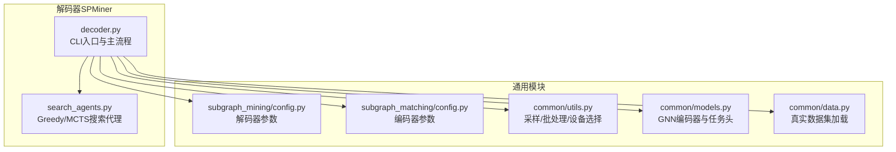
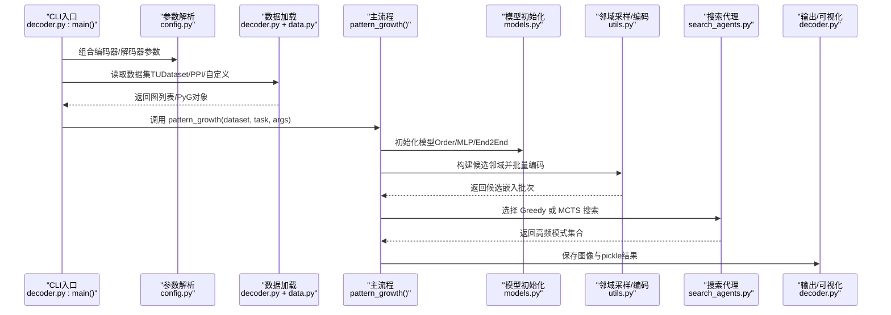
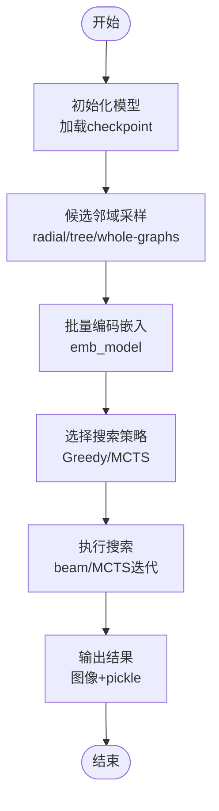
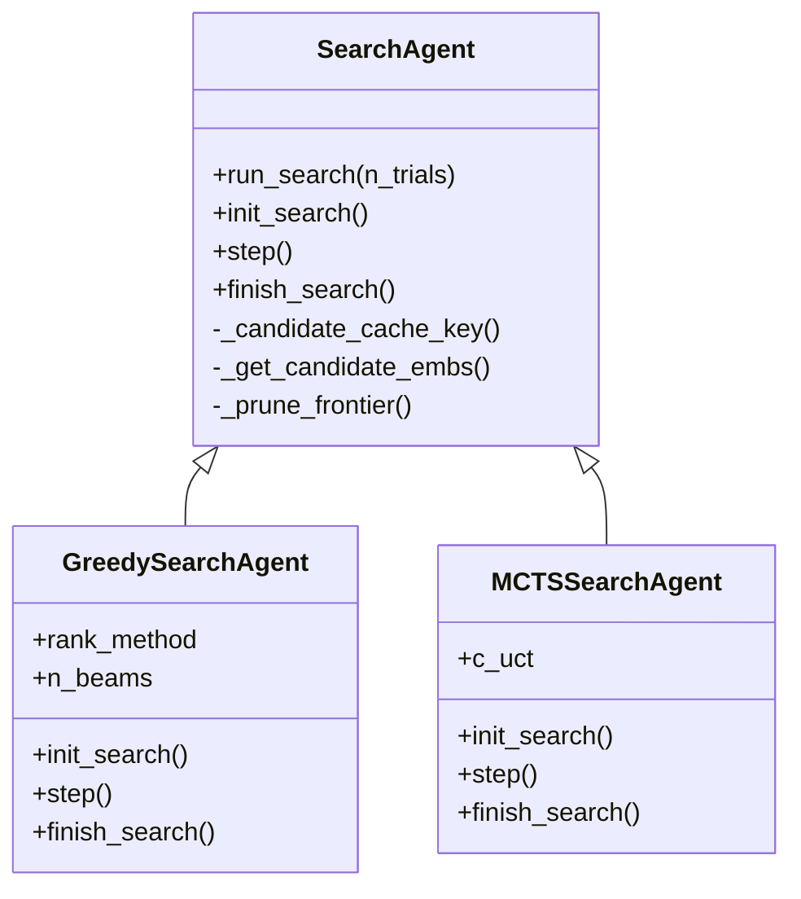
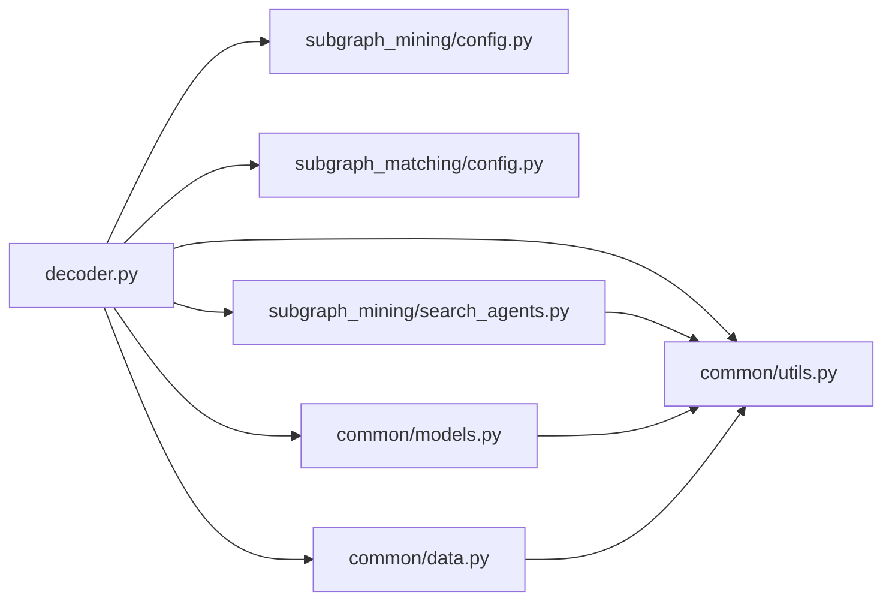

# 解码器入口

<cite>
**本文引用的文件**
- [decoder.py](file://subgraph_mining/decoder.py)
- [search_agents.py](file://subgraph_mining/search_agents.py)
- [config.py（解码器）](file://subgraph_mining/config.py)
- [config.py（编码器）](file://subgraph_matching/config.py)
- [utils.py](file://common/utils.py)
- [models.py](file://common/models.py)
- [data.py](file://common/data.py)
- [README.md](file://README.md)
- [environment.yml](file://environment.yml)
- [run.sh](file://run.sh)
</cite>

## 目录
1. [简介](#简介)
2. [项目结构](#项目结构)
3. [核心组件](#核心组件)
4. [架构总览](#架构总览)
5. [详细组件分析](#详细组件分析)
6. [依赖关系分析](#依赖关系分析)
7. [性能考量](#性能考量)
8. [故障排查指南](#故障排查指南)
9. [结论](#结论)
10. [附录](#附录)

## 简介
本文件围绕解码器入口（SPMiner 频繁子图挖掘的 CLI 入口）进行系统化技术文档编写，重点解释：
- CLI 参数解析与组合（编码器/解码器参数）
- 数据集加载与任务类型处理（TUDataset、PPI、自定义 SNAP 数据等）
- pattern_growth 主流程的五个步骤：模型初始化、候选邻域构建、邻域嵌入编码、搜索代理调用、结果输出
- Greedy 与 MCTS 两种搜索策略的工作机制
- 命令行参数详解与最佳实践建议
- 使用示例与常见问题排查

## 项目结构
该项目采用模块化组织，解码器入口位于 subgraph_mining/decoder.py，配合搜索代理、参数配置、通用工具与模型定义共同构成完整的挖掘流水线。

**图表来源**
- [decoder.py:197-276](file://subgraph_mining/decoder.py#L197-L276)
- [search_agents.py:14-442](file://subgraph_mining/search_agents.py#L14-L442)
- [config.py（解码器）:1-65](file://subgraph_mining/config.py#L1-L65)
- [config.py（编码器）:1-82](file://subgraph_matching/config.py#L1-L82)
- [utils.py:18-302](file://common/utils.py#L18-L302)
- [models.py:1-318](file://common/models.py#L1-L318)
- [data.py:21-76](file://common/data.py#L21-L76)

**章节来源**
- [decoder.py:197-276](file://subgraph_mining/decoder.py#L197-L276)
- [README.md:30-62](file://README.md#L30-L62)

## 核心组件
- CLI 入口与主流程
  - 解码器 CLI 负责组合编码器/解码器参数、读取数据集、调用 pattern_growth 执行完整挖掘。
  - pattern_growth 实现五步主流程：模型初始化、候选邻域构建、邻域嵌入编码、搜索代理调用、结果输出。
- 搜索代理
  - GreedySearchAgent：基于贪心扩展与评分的 beam 搜索。
  - MCTSSearchAgent：基于 MCTS 的探索-利用策略搜索。
- 参数配置
  - 解码器参数组：采样策略、邻域大小、搜索试验次数、输出批大小、前沿剪枝等。
  - 编码器参数组：模型类型、卷积类型、隐藏维度、层数、dropout、优化器等。
- 通用工具
  - 采样函数、WL 哈希、批处理、设备选择、SNAP 边列表加载等。
- 模型与数据
  - GNN 编码器（SkipLastGNN）、序嵌入模型、基线 MLP、TUDataset/PPI 加载、自定义数据集加载。

**章节来源**
- [decoder.py:62-171](file://subgraph_mining/decoder.py#L62-L171)
- [search_agents.py:14-442](file://subgraph_mining/search_agents.py#L14-L442)
- [config.py（解码器）:4-65](file://subgraph_mining/config.py#L4-L65)
- [config.py（编码器）:4-82](file://subgraph_matching/config.py#L4-L82)
- [utils.py:18-302](file://common/utils.py#L18-L302)
- [models.py:21-318](file://common/models.py#L21-L318)
- [data.py:21-76](file://common/data.py#L21-L76)

## 架构总览
解码器入口的整体调用链如下：

**图表来源**
- [decoder.py:197-276](file://subgraph_mining/decoder.py#L197-L276)
- [decoder.py:62-171](file://subgraph_mining/decoder.py#L62-L171)
- [search_agents.py:54-67](file://subgraph_mining/search_agents.py#L54-L67)
- [utils.py:286-302](file://common/utils.py#L286-L302)
- [models.py:46-100](file://common/models.py#L46-L100)

## 详细组件分析

### CLI 入口与参数解析
- 组合参数
  - 解码器入口通过 argparse 组合编码器与解码器参数组，便于在单一命令中控制训练与挖掘。
- 参数来源
  - 编码器参数：conv_type、method_type、hidden_dim、n_layers、batch_size、model_path 等。
  - 解码器参数：sample_method、radius、subgraph_sample_size、n_neighborhoods、n_trials、search_strategy、out_batch_size、frontier_top_k、use_whole_graphs 等。
- 默认值
  - 解码器默认使用较大的 n_neighborhoods 与 n_trials，以换取更全面的搜索覆盖；同时提供合理的 min/max_pattern_size、frontier_top_k 等默认值。

**章节来源**
- [decoder.py:208-211](file://subgraph_mining/decoder.py#L208-L211)
- [config.py（解码器）:4-65](file://subgraph_mining/config.py#L4-L65)
- [config.py（编码器）:4-82](file://subgraph_matching/config.py#L4-L82)

### 数据集加载与任务类型处理
- 支持的数据集类型
  - TUDataset：enzymes、cox2、reddit-binary、dblp、coil 等。
  - PPI：蛋白质互作网络。
  - 自定义 SNAP 数据：facebook、as20000102 等，通过边列表文件加载。
  - 合成数据：plant-* 系列，通过合成生成器构造带植入模式的图集。
  - 其他：roadnet-*、diseasome/usroads/mn-roads/infect 等，从 mtx/edges 文本加载。
- 任务类型
  - graph：标准图分类任务。
  - graph-truncate：对数据集进行截断（如 DBLP），限制遍历数量。
  - graph-labeled：按标签过滤（如仅使用标签 0 的图）。
- 加载逻辑
  - 将 PyG 对象转换为 NetworkX 图，统一后续采样与搜索流程。
  - 对于单图数据（如 Facebook、AS），取最大连通子图以保证连通性。

**章节来源**
- [decoder.py:214-271](file://subgraph_mining/decoder.py#L214-L271)
- [data.py:21-76](file://common/data.py#L21-L76)
- [utils.py:208-233](file://common/utils.py#L208-L233)

### pattern_growth 主流程详解
- 步骤一：模型初始化
  - 根据 method_type 选择模型类型（OrderEmbedder、BaselineMLP、End2EndOrder），加载预训练 checkpoint，切换到设备并设置为 eval。
- 步骤二：候选邻域构建
  - 支持两种采样策略：
    - radial：以每个节点为中心，按 radius 截止的最短路径长度采样邻域，可选 subgraph_sample_size 控制邻域节点数。
    - tree：随机从数据集中抽取图，再扩展一个连通邻域，重复 n_neighborhoods 次。
  - 可选 use_whole_graphs：直接对整图聚类而非采样邻域。
- 步骤三：邻域嵌入编码
  - 按 batch_size 分批，将候选邻域转换为 DeepSNAP Batch，通过模型的 emb_model 获取嵌入，累积到 embs。
- 步骤四：搜索代理调用
  - 根据 search_strategy 选择 Greedy 或 MCTS：
    - Greedy：beam 扩展，按模型评分贪心选择下一节点，支持 counts/margin/hybrid 排序策略。
    - MCTS：基于 UCT 的探索-利用策略，按访问次数统计高频模式。
- 步骤五：结果输出
  - 可视化：按模式大小保存 PNG/PDF 图像。
  - 序列化：将模式集合 pickle 到 out_path。

**图表来源**
- [decoder.py:62-171](file://subgraph_mining/decoder.py#L62-L171)
- [search_agents.py:54-67](file://subgraph_mining/search_agents.py#L54-L67)

**章节来源**
- [decoder.py:62-171](file://subgraph_mining/decoder.py#L62-L171)

### 搜索代理：Greedy 与 MCTS
- GreedySearchAgent
  - 初始化：按图分布随机选择种子，形成 beam 集合。
  - 扩展：对每个 beam，枚举 frontier 节点，计算候选嵌入与候选邻域嵌入的评分，选择最优扩展。
  - 排序策略：counts（按出现频次）、margin（按模型打分）、hybrid（根据出现次数动态切换）。
  - 去重与输出：按模式大小聚合，去重后输出 top-k。
- MCTSSearchAgent
  - 初始化：维护访问次数、累计价值、WL 哈希到图的映射。
  - 扩展：按 UCT 选择种子或新种子，扩展至目标尺寸，记录状态路径。
  - 回传：沿路径累计价值，更新访问次数。
  - 结束：按访问次数统计高频模式并输出。

**图表来源**
- [search_agents.py:14-442](file://subgraph_mining/search_agents.py#L14-L442)

**章节来源**
- [search_agents.py:14-442](file://subgraph_mining/search_agents.py#L14-L442)

### 模型与嵌入空间
- 模型类型
  - OrderEmbedder：学习序嵌入，通过约束“子图嵌入应小于或等于超图嵌入”进行训练。
  - BaselineMLP：双图拼接后用 MLP 分类，作为对比基线。
  - End2EndOrder：端到端序嵌入模型。
- 编码器（SkipLastGNN）
  - 支持多种卷积类型（SAGE/GIN/GCN/GAT/PNA 等），可配置 skip 连接与 learnable skip。
  - 通过全图池化与 MLP 输出固定维度图嵌入。
- 嵌入评分
  - 模型提供 emb_model 用于候选邻域嵌入，clf_model 用于打分（在 Greedy 中使用）。

**章节来源**
- [models.py:21-318](file://common/models.py#L21-L318)

### 通用工具与数据处理
- 采样函数 sample_neigh
  - 按图大小加权采样邻域，支持前沿扩展直至目标大小。
- WL 哈希
  - 通过固定维度向量迭代聚合，最终求和生成稳定签名，用于去重与计数。
- 批处理 batch_nx_graphs
  - 将 NetworkX 图转换为 DeepSNAP Batch，支持节点锚定特征注入与设备迁移。
- 设备选择 get_device
  - 优先使用 CUDA，否则回退 CPU。
- SNAP 边列表加载
  - 自动跳过注释与空行，取最大连通子图。

**章节来源**
- [utils.py:18-302](file://common/utils.py#L18-L302)

## 依赖关系分析
- 模块耦合
  - decoder.py 依赖 config（解码器/编码器）、models、utils、data、search_agents。
  - search_agents 依赖 utils（采样、WL 哈希、批处理）。
  - models 依赖 utils（设备选择）与 feature_preprocess（特征增强）。
  - data.py 依赖 TUDataset/PPI 与 utils（SNAP 加载）。
- 外部依赖
  - PyTorch、PyTorch Geometric、DeepSNAP、NetworkX、NumPy、SciPy、Matplotlib、tqdm 等。

**图表来源**
- [decoder.py:197-276](file://subgraph_mining/decoder.py#L197-L276)
- [search_agents.py:14-442](file://subgraph_mining/search_agents.py#L14-L442)
- [config.py（解码器）:1-65](file://subgraph_mining/config.py#L1-L65)
- [config.py（编码器）:1-82](file://subgraph_matching/config.py#L1-L82)
- [utils.py:18-302](file://common/utils.py#L18-L302)
- [models.py:1-318](file://common/models.py#L1-L318)
- [data.py:1-447](file://common/data.py#L1-L447)

**章节来源**
- [decoder.py:197-276](file://subgraph_mining/decoder.py#L197-L276)
- [search_agents.py:14-442](file://subgraph_mining/search_agents.py#L14-L442)
- [config.py（解码器）:1-65](file://subgraph_mining/config.py#L1-L65)
- [config.py（编码器）:1-82](file://subgraph_matching/config.py#L1-L82)
- [utils.py:18-302](file://common/utils.py#L18-L302)
- [models.py:1-318](file://common/models.py#L1-L318)
- [data.py:1-447](file://common/data.py#L1-L447)

## 性能考量
- 采样与批处理
  - n_neighborhoods 与 n_trials 对耗时影响显著，建议先用较小值验证流程，再逐步增大。
  - batch_size 与设备选择（CUDA）直接影响吞吐，合理设置可提升嵌入编码速度。
- 前沿剪枝
  - frontier_top_k 可在每步保留度数最高的候选，减少搜索空间，提高效率。
- 搜索策略
  - Greedy 更快但可能陷入局部最优；MCTS 更稳健但计算开销更大。
- 数据集规模
  - TUDataset/PPI 通常较大，建议使用 use_whole_graphs 或合理截断（graph-truncate）以控制成本。

[本节为通用指导，无需特定文件引用]

## 故障排查指南
- 找不到依赖包
  - 确认已激活正确 conda 环境，并安装 PyTorch、PyTorch Geometric、DeepSNAP、NetworkX、Matplotlib、tqdm 等。
- Facebook 数据集文件缺失
  - 确保 data/facebook_combined.txt 存在，否则会报错。
- 挖掘耗时过长
  - 减小 n_neighborhoods、n_trials、batch_size，或切换到 MCTS 的更严格剪枝。
- 输出图像过多
  - 这是预期行为，可通过 out_batch_size 控制每种尺寸输出的数量。

**章节来源**
- [README.md:340-367](file://README.md#L340-L367)
- [environment.yml:1-129](file://environment.yml#L1-L129)

## 结论
解码器入口通过清晰的五步主流程与灵活的参数配置，将训练好的子图匹配模型转化为高效的频繁子图挖掘工具。结合 Greedy 与 MCTS 两种搜索策略，既能快速验证流程，也能在稳健性与覆盖率之间取得平衡。建议在实际应用中根据数据规模与资源限制，合理设置采样策略、批大小与搜索参数，并优先使用 GPU 加速以提升整体效率。

[本节为总结，无需特定文件引用]

## 附录

### 使用示例与最佳实践
- 训练子图匹配模型（示例）
  - 合成数据：python -m subgraph_matching.train --node_anchored
  - Facebook 数据：python -m subgraph_matching.train --dataset=facebook --node_anchored
- 运行频繁子图挖掘（示例）
  - ENZYMES：python -m subgraph_mining.decoder --dataset=enzymes --node_anchored
  - Facebook：python -m subgraph_mining.decoder --dataset=facebook --node_anchored
- 最佳实践
  - 先用小参数验证流程（较小 n_neighborhoods、n_trials、batch_size）。
  - 根据数据集规模选择采样策略：radial 适合局部邻域探索，tree 适合全局搜索。
  - 使用 MCTS 时开启 frontier_top_k 以降低搜索复杂度。
  - 优先使用 CUDA，确保模型与批处理在 GPU 上运行。

**章节来源**
- [README.md:129-164](file://README.md#L129-L164)
- [README.md:228-267](file://README.md#L228-L267)

### 命令行参数详解（解码器）
- 采样与邻域
  - --sample_method：tree/radial
  - --radius：邻域半径
  - --subgraph_sample_size：每个邻域采样节点数
  - --use_whole_graphs：是否对整图聚类
- 搜索与输出
  - --search_strategy：greedy/mcts
  - --n_neighborhoods：采样邻域数量
  - --n_trials：搜索试验次数
  - --out_batch_size：每种尺寸输出的模式数量
  - --frontier_top_k：每步保留的前沿候选数量
  - --out_path：输出 pickle 文件路径
- 模式大小
  - --min_pattern_size/--max_pattern_size：模式大小范围
- 其他
  - --analyze：启用分析可视化
  - --node_anchored：是否使用节点锚定（需与编码器一致）

**章节来源**
- [config.py（解码器）:4-65](file://subgraph_mining/config.py#L4-L65)

### 命令行参数详解（编码器）
- 模型与训练
  - --method_type：order/mlp/end2end
  - --conv_type：SAGE/GIN/GCN/GAT/PNA 等
  - --hidden_dim：隐藏维度
  - --n_layers：层数
  - --batch_size：批大小
  - --n_batches：训练步数
  - --margin：损失 margin
  - --dropout：dropout 比率
  - --model_path：模型保存/加载路径
- 数据与评估
  - --dataset：数据集名称
  - --test_set：测试集文件名
  - --eval_interval：评估间隔
  - --val_size：验证集大小
  - --node_anchored：是否使用节点锚定
  - --test：是否测试模式
  - --n_workers：数据加载线程数
  - --tag：运行标签

**章节来源**
- [config.py（编码器）:4-82](file://subgraph_matching/config.py#L4-L82)

### 环境与依赖
- 推荐安装顺序与检查
  - 创建并激活 conda 环境，安装 requirements.txt，补齐 tensorboard，按平台安装 PyTorch Geometric。
- 常见安装检查
  - python -c "import torch, torch_geometric, deepsnap, networkx, numpy; print('imports_ok')"

**章节来源**
- [README.md:75-121](file://README.md#L75-L121)
- [environment.yml:1-129](file://environment.yml#L1-L129)