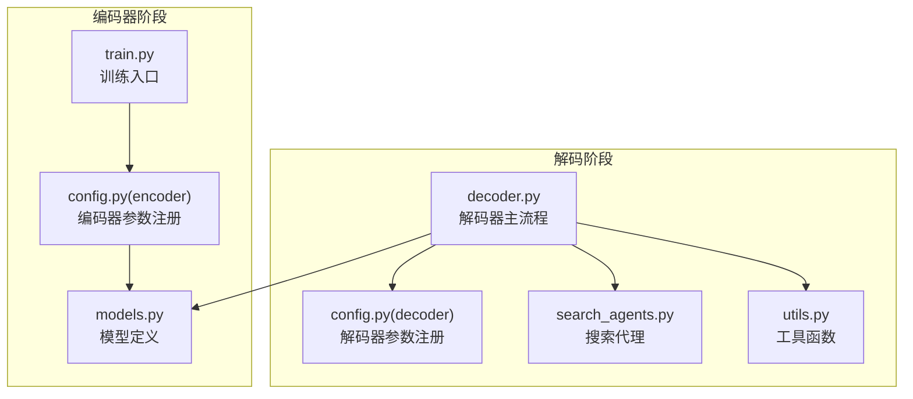
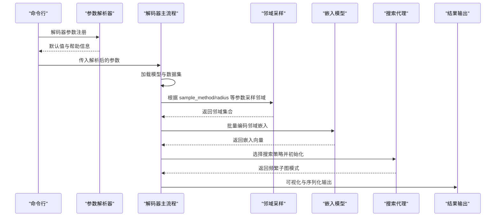
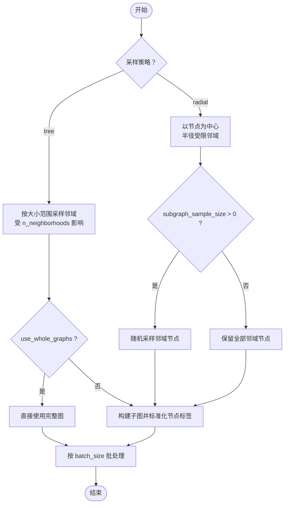
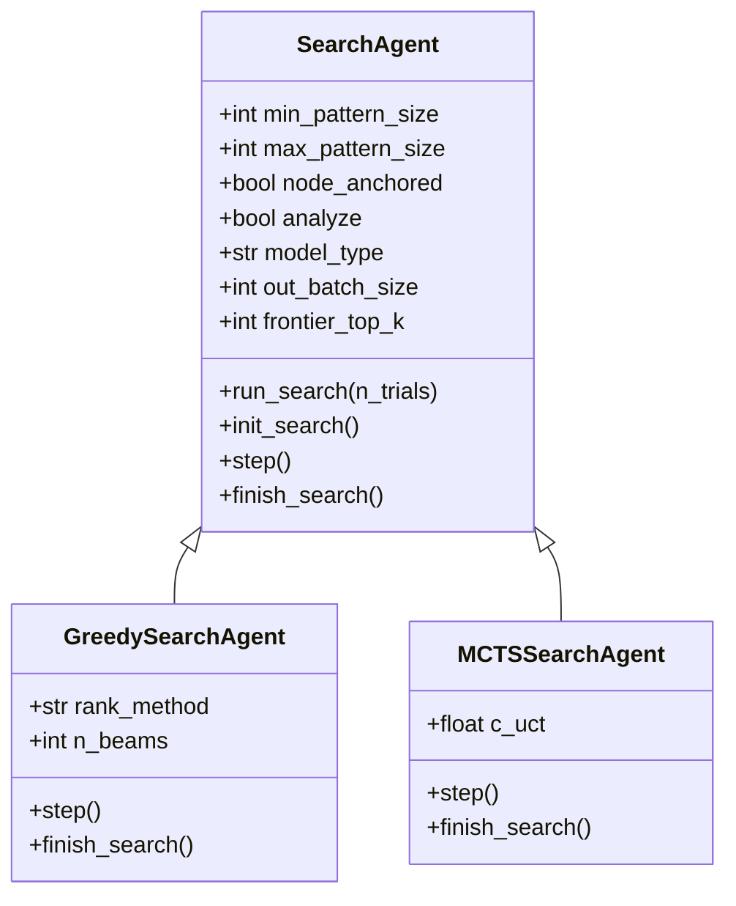
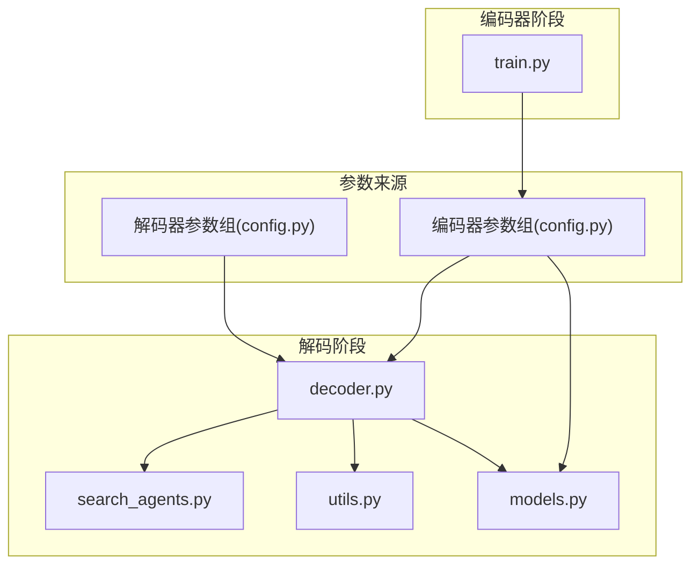

# 解码配置管理

<cite>
**本文引用的文件**
- [decoder.py](file://subgraph_mining/decoder.py)
- [config.py](file://subgraph_mining/config.py)
- [search_agents.py](file://subgraph_mining/search_agents.py)
- [models.py](file://common/models.py)
- [config.py](file://subgraph_matching/config.py)
- [utils.py](file://common/utils.py)
- [train.py](file://subgraph_matching/train.py)
</cite>

## 目录
1. [简介](#简介)
2. [项目结构](#项目结构)
3. [核心组件](#核心组件)
4. [架构概览](#架构概览)
5. [详细组件分析](#详细组件分析)
6. [依赖关系分析](#依赖关系分析)
7. [性能考量](#性能考量)
8. [故障排查指南](#故障排查指南)
9. [结论](#结论)
10. [附录](#附录)

## 简介
本技术文档围绕解码配置管理展开，系统阐述 SPMiner 解码阶段的参数配置体系，涵盖搜索策略参数、邻域采样参数、模型类型参数以及输出控制参数。文档重点解释各参数的作用机制、默认值设定、参数间的相互依赖与约束关系，并提供参数调优的最佳实践与性能影响分析，辅以完整的配置示例与常见场景的参数组合建议，帮助读者在不同数据规模与任务需求下高效完成子图模式挖掘。

## 项目结构
解码配置管理涉及以下关键模块：
- 解码器入口与主流程：负责参数解析、数据集加载、邻域采样、嵌入编码、搜索策略执行与结果输出。
- 解码器参数注册：定义解码阶段所需的全部参数及其默认值。
- 搜索代理：实现贪心与 MCTS 两种搜索策略，负责在嵌入空间中迭代扩展子图模式。
- 模型定义：提供序嵌入与基线 MLP 模型，用于子图匹配与评分。
- 编码器参数：定义训练/测试子图匹配模型所需的参数，解码阶段会复用部分参数。
- 工具函数：提供邻域采样、WL 哈希、设备选择、批处理等通用能力。

图表来源
- [decoder.py:197-276](file://subgraph_mining/decoder.py#L197-L276)
- [config.py:4-65](file://subgraph_mining/config.py#L4-L65)
- [search_agents.py:14-442](file://subgraph_mining/search_agents.py#L14-L442)
- [utils.py:18-302](file://common/utils.py#L18-L302)
- [config.py:4-82](file://subgraph_matching/config.py#L4-L82)
- [models.py:22-318](file://common/models.py#L22-L318)
- [train.py:1-200](file://subgraph_matching/train.py#L1-L200)

章节来源
- [decoder.py:197-276](file://subgraph_mining/decoder.py#L197-L276)
- [config.py:4-65](file://subgraph_mining/config.py#L4-L65)
- [search_agents.py:14-442](file://subgraph_mining/search_agents.py#L14-L442)
- [utils.py:18-302](file://common/utils.py#L18-L302)
- [config.py:4-82](file://subgraph_matching/config.py#L4-L82)
- [models.py:22-318](file://common/models.py#L22-L318)
- [train.py:1-200](file://subgraph_matching/train.py#L1-L200)

## 核心组件
本节聚焦解码配置管理的关键参数类别与作用机制，结合源码定位参数位置与默认值。

- 邻域采样参数
  - sample_method：邻域采样策略，支持 "tree"（树形）与 "radial"（辐射形）。
  - radius：节点邻域半径，用于 radial 采样时限制可达节点距离。
  - subgraph_sample_size：每个邻域中采样的节点数，用于限制邻域规模。
  - n_neighborhoods：采样邻域总数，影响候选邻域集合规模。
  - min_neighborhood_size/max_neighborhood_size：邻域大小范围，用于树形采样。
  - use_whole_graphs：是否对完整图进行聚类而非采样节点邻域。

- 搜索策略参数
  - search_strategy：搜索策略，支持 "greedy"（贪心）与 "mcts"（蒙特卡洛树搜索）。
  - n_trials：搜索试验次数，直接影响搜索强度与耗时。
  - min_pattern_size/max_pattern_size：待识别频繁子图的最小/最大尺寸。
  - frontier_top_k：每步保留的 frontier 候选上限，0 表示不剪枝。
  - node_anchored：是否识别节点锚定的子图模式，需与相应模型类型配合。

- 模型类型参数
  - method_type：子图匹配模型类型，支持 "order"、"mlp"、"end2end"。
  - hidden_dim：模型隐层维度，影响嵌入空间维度与计算复杂度。
  - model_path：已训练模型的加载路径，解码阶段用于加载嵌入模型。

- 输出控制参数
  - out_path：候选模体输出路径，pickle 序列化存储。
  - out_batch_size：每种图大小输出的模体数量，控制最终输出规模。

章节来源
- [config.py:14-59](file://subgraph_mining/config.py#L14-L59)
- [decoder.py:104-138](file://subgraph_mining/decoder.py#L104-L138)
- [decoder.py:158-170](file://subgraph_mining/decoder.py#L158-L170)
- [models.py:22-100](file://common/models.py#L22-L100)

## 架构概览
解码配置管理贯穿“参数解析—数据加载—邻域采样—嵌入编码—搜索策略—结果输出”的完整流程。下图展示了解码器主流程与关键组件的交互关系。

图表来源
- [decoder.py:197-276](file://subgraph_mining/decoder.py#L197-L276)
- [decoder.py:62-171](file://subgraph_mining/decoder.py#L62-L171)
- [config.py:4-65](file://subgraph_mining/config.py#L4-L65)
- [search_agents.py:14-442](file://subgraph_mining/search_agents.py#L14-L442)
- [models.py:22-100](file://common/models.py#L22-L100)

## 详细组件分析

### 解码器参数注册与默认值
解码器参数通过独立的参数组注册，提供一组面向解码阶段的默认值，同时复用编码器阶段的部分参数（如 dataset 与 batch_size），并对解码场景进行适配。

- 关键参数与默认值
  - out_path："results/out-patterns.p"
  - n_neighborhoods：10000
  - n_trials：1000
  - decode_thresh：0.5
  - radius：3
  - subgraph_sample_size：0
  - sample_method："tree"
  - skip："learnable"
  - min_pattern_size：5
  - max_pattern_size：20
  - min_neighborhood_size：20
  - max_neighborhood_size：29
  - search_strategy："greedy"
  - out_batch_size：10
  - frontier_top_k：5
  - node_anchored：True
  - dataset："enzymes"
  - batch_size：1000

- 参数覆盖与复用
  - 解码阶段会覆盖 dataset 与 batch_size 的默认值，使其更适用于解码场景。

章节来源
- [config.py:4-65](file://subgraph_mining/config.py#L4-L65)

### 邻域采样策略与参数约束
邻域采样是解码阶段的关键前置步骤，直接影响候选邻域集合的质量与规模。采样策略与参数之间存在明确的约束关系。

- 树形采样（sample_method="tree"）
  - 依据 min_neighborhood_size 与 max_neighborhood_size 控制邻域大小范围。
  - 通过 n_neighborhoods 控制采样邻域总数。
  - 适合大规模数据集，采样效率高，但可能丢失局部拓扑细节。

- 辐射形采样（sample_method="radial"）
  - 以节点为中心，按 radius 限制可达节点距离。
  - 可结合 subgraph_sample_size 对邻域节点进行随机采样，控制邻域规模。
  - 适合关注局部结构的场景，能保留更精细的邻域拓扑。

- 参数依赖关系
  - 当 use_whole_graphs=True 时，跳过邻域采样，直接对完整图进行聚类。
  - batch_size 与邻域采样结果的批处理密切相关，需确保采样结果能被整除，否则会触发警告提示。

图表来源
- [decoder.py:104-138](file://subgraph_mining/decoder.py#L104-L138)
- [decoder.py:140-152](file://subgraph_mining/decoder.py#L140-L152)

章节来源
- [decoder.py:104-138](file://subgraph_mining/decoder.py#L104-L138)
- [decoder.py:140-152](file://subgraph_mining/decoder.py#L140-L152)

### 搜索策略与参数调优
搜索策略决定了如何在嵌入空间中扩展子图模式，参数调优对性能与质量影响显著。

- 贪心搜索（search_strategy="greedy"）
  - 通过 frontier_top_k 对每步候选进行剪枝，提升搜索效率。
  - 通过 rank_method 控制扩展启发式（counts/margin/hybrid），平衡覆盖率与准确性。
  - 通过 out_batch_size 控制每种尺寸输出的模式数量。

- MCTS 搜索（search_strategy="mcts"）
  - 通过 c_uct 探索常数平衡探索与利用。
  - 通过 n_trials 控制模拟次数，直接影响搜索强度与耗时。
  - 仅支持 node_anchored=True 的模式识别。

- 参数调优建议
  - n_trials 与 n_neighborhoods：两者共同决定候选邻域与搜索强度，建议按数据规模线性增长，注意内存与时间开销。
  - frontier_top_k：适度剪枝可显著降低计算量，但过低可能导致遗漏高质量模式。
  - min_pattern_size/max_pattern_size：结合任务目标设定，过大可能错过小而重要的模式，过小可能引入噪声。
  - out_batch_size：控制输出规模，避免过多冗余模式影响后续分析。

图表来源
- [search_agents.py:14-442](file://subgraph_mining/search_agents.py#L14-L442)

章节来源
- [search_agents.py:14-442](file://subgraph_mining/search_agents.py#L14-L442)
- [decoder.py:158-170](file://subgraph_mining/decoder.py#L158-L170)

### 模型类型与参数映射
解码阶段会根据 method_type 选择不同的嵌入模型，并据此调整搜索策略与评分逻辑。

- 模型类型
  - "order"：序嵌入模型，通过约束子图包含关系学习嵌入空间，支持 node_anchored。
  - "mlp"：基线 MLP 模型，直接拼接两图嵌入进行二分类，适合对比实验。
  - "end2end"：端到端模型，具体实现由 models 模块提供。

- 参数映射
  - hidden_dim：影响嵌入维度与计算复杂度。
  - model_path：加载已训练模型权重，确保解码阶段的嵌入质量。
  - node_anchored：与模型类型强关联，MCTS 仅支持 node_anchored=True。

章节来源
- [decoder.py:73-82](file://subgraph_mining/decoder.py#L73-L82)
- [models.py:22-100](file://common/models.py#L22-L100)
- [config.py:4-82](file://subgraph_matching/config.py#L4-L82)

### 输出控制与可视化
解码阶段支持将候选模式按尺寸输出并进行可视化，便于后续分析与验证。

- 输出路径与格式
  - out_path：pickle 序列化存储候选模式集合。
  - 可视化：按模式尺寸保存 PNG/PDF 图像，支持节点锚定模式的颜色标注。

- 输出控制参数
  - out_batch_size：每种尺寸输出的模式数量。
  - node_anchored：影响可视化颜色与锚点标注。

章节来源
- [decoder.py:175-195](file://subgraph_mining/decoder.py#L175-L195)

## 依赖关系分析
解码配置管理涉及多个模块间的耦合与协作，参数在不同模块间存在复用与覆盖关系。

图表来源
- [config.py:4-65](file://subgraph_mining/config.py#L4-L65)
- [config.py:4-82](file://subgraph_matching/config.py#L4-L82)
- [decoder.py:197-276](file://subgraph_mining/decoder.py#L197-L276)
- [search_agents.py:14-442](file://subgraph_mining/search_agents.py#L14-L442)
- [utils.py:18-302](file://common/utils.py#L18-L302)
- [models.py:22-318](file://common/models.py#L22-L318)
- [train.py:1-200](file://subgraph_matching/train.py#L1-L200)

章节来源
- [config.py:4-65](file://subgraph_mining/config.py#L4-L65)
- [config.py:4-82](file://subgraph_matching/config.py#L4-L82)
- [decoder.py:197-276](file://subgraph_mining/decoder.py#L197-L276)
- [search_agents.py:14-442](file://subgraph_mining/search_agents.py#L14-L442)
- [utils.py:18-302](file://common/utils.py#L18-L302)
- [models.py:22-318](file://common/models.py#L22-L318)
- [train.py:1-200](file://subgraph_matching/train.py#L1-L200)

## 性能考量
- 计算复杂度
  - 邻域采样：树形采样与辐射形采样在时间复杂度上存在差异，树形采样受 n_neighborhoods 与 min/max_neighborhood_size 影响较大；辐射形采样受 radius 与 subgraph_sample_size 影响较大。
  - 搜索策略：贪心搜索的扩展速度较快，但可能陷入局部最优；MCTS 搜索更稳健但计算成本更高，受 n_trials 与 frontier_top_k 影响显著。
  - 嵌入编码：batch_size 与 hidden_dim 共同决定嵌入计算的吞吐量与内存占用。

- 内存与时间开销
  - n_neighborhoods 与 n_trials 的增大将显著增加候选邻域与搜索步数，导致内存与时间开销上升。
  - frontier_top_k 的适度剪枝可有效降低内存压力，但过度剪枝可能丢失高质量模式。
  - use_whole_graphs 会绕过邻域采样，直接对完整图进行聚类，适合小规模数据集。

- 设备与批处理
  - get_device() 优先使用 GPU，batch_size 的合理设置有助于充分利用硬件资源。
  - utils.batch_nx_graphs 提供节点锚定功能，支持在批处理中注入锚点信息。

章节来源
- [decoder.py:104-138](file://subgraph_mining/decoder.py#L104-L138)
- [decoder.py:140-152](file://subgraph_mining/decoder.py#L140-L152)
- [search_agents.py:121-127](file://subgraph_mining/search_agents.py#L121-L127)
- [utils.py:235-243](file://common/utils.py#L235-L243)
- [utils.py:286-302](file://common/utils.py#L286-L302)

## 故障排查指南
- 参数冲突与异常
  - search_strategy="mcts" 时，method_type 必须为 "order"，否则会触发断言错误。
  - node_anchored=True 时，需使用节点锚定模型，否则搜索过程中的锚点信息无法正确传递。
  - batch_size 与邻域采样结果不匹配时，会出现非整除警告，建议调整 batch_size 使采样结果能被整除。

- 常见问题与解决
  - 搜索结果为空：检查 n_trials 与 frontier_top_k 设置，适当增大 n_trials 或关闭剪枝。
  - 模式过于稀疏：调整 min_pattern_size 与 max_pattern_size，或增大 radius/subgraph_sample_size。
  - 内存不足：减小 batch_size、n_neighborhoods、n_trials 或开启 frontier_top_k 剪枝。

章节来源
- [decoder.py:158-163](file://subgraph_mining/decoder.py#L158-L163)
- [decoder.py:140-152](file://subgraph_mining/decoder.py#L140-L152)
- [search_agents.py:129-144](file://subgraph_mining/search_agents.py#L129-L144)

## 结论
解码配置管理通过清晰的参数分类与默认值设计，为子图模式挖掘提供了灵活可控的配置体系。邻域采样参数决定候选邻域的质量与规模，搜索策略参数控制模式扩展的强度与效率，模型类型参数影响嵌入空间的学习方式，输出控制参数保障结果的可复现与可分析。遵循本文提供的参数调优建议与最佳实践，可在不同数据规模与任务需求下取得更优的挖掘效果与性能表现。

## 附录

### 完整配置示例与常见场景建议
- 示例一：小规模数据集 + 辐射形采样
  - 参数组合：sample_method="radial"、radius=2、subgraph_sample_size=0、use_whole_graphs=False、n_neighborhoods=5000、n_trials=500、min_pattern_size=4、max_pattern_size=15、frontier_top_k=3、out_batch_size=5
  - 适用场景：关注局部结构的小型社交网络或生物网络，强调快速原型验证。

- 示例二：中等规模数据集 + 树形采样
  - 参数组合：sample_method="tree"、min_neighborhood_size=20、max_neighborhood_size=29、n_neighborhoods=10000、n_trials=1000、min_pattern_size=5、max_pattern_size=20、frontier_top_k=5、out_batch_size=10
  - 适用场景：标准图数据集，追求稳健的模式发现与可复现性。

- 示例三：大规模数据集 + MCTS 搜索
  - 参数组合：search_strategy="mcts"、n_trials=2000、frontier_top_k=0、min_pattern_size=6、max_pattern_size=25、out_batch_size=8、node_anchored=True
  - 适用场景：对模式质量要求较高且计算资源充足的场景，强调全局搜索能力。

- 示例四：对比实验 + 基线模型
  - 参数组合：method_type="mlp"、hidden_dim=128、model_path="ckpt/model.pt"、out_batch_size=10
  - 适用场景：与序嵌入模型进行对比，验证嵌入学习的有效性。

章节来源
- [config.py:44-59](file://subgraph_mining/config.py#L44-L59)
- [decoder.py:158-170](file://subgraph_mining/decoder.py#L158-L170)
- [search_agents.py:129-144](file://subgraph_mining/search_agents.py#L129-L144)