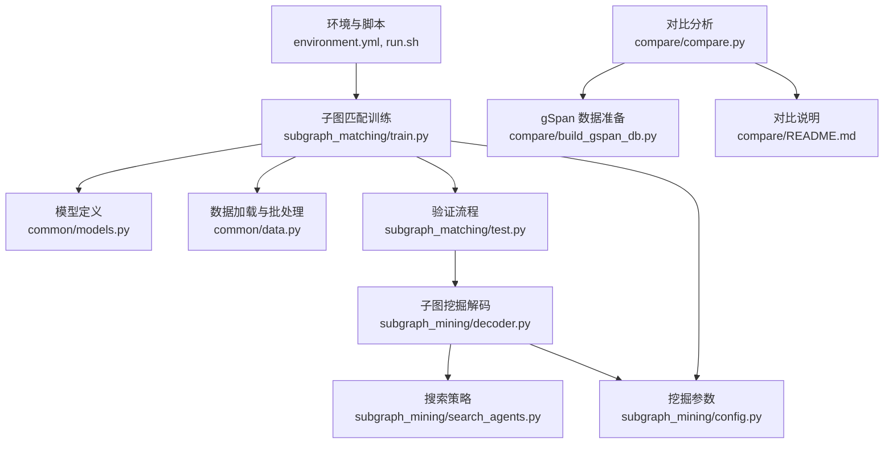
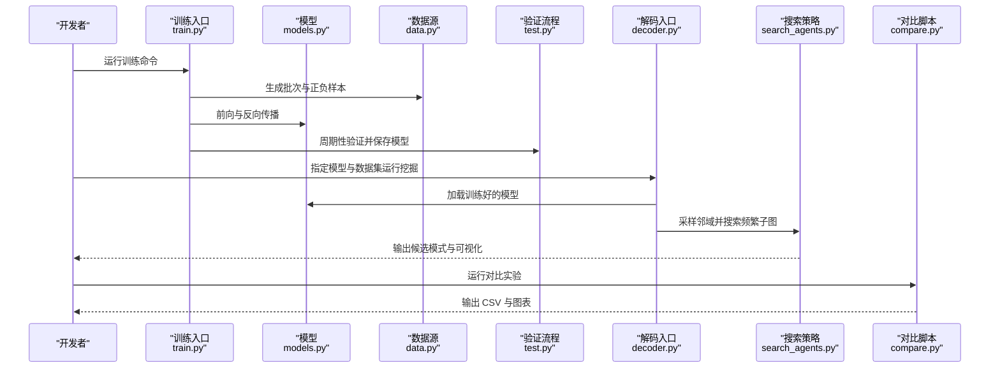
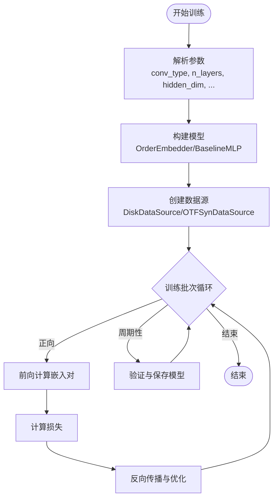
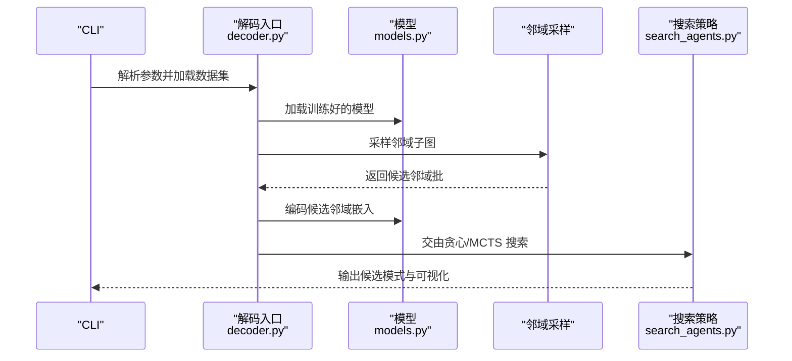
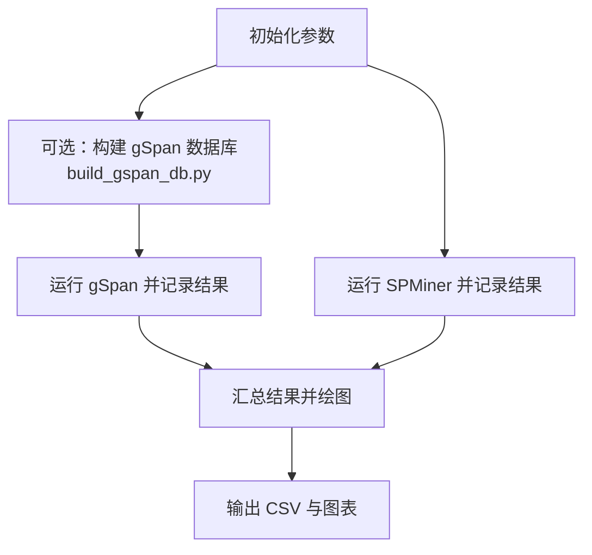
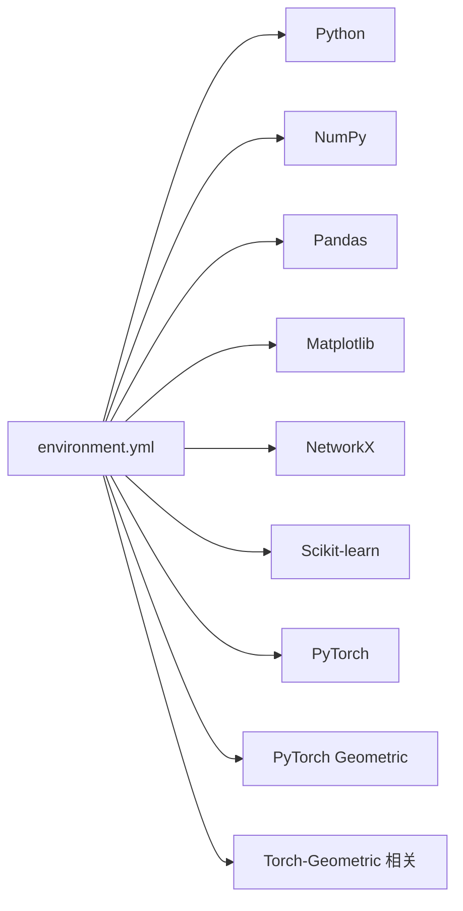

# 快速开始

<cite>
**本文引用的文件**
- [environment.yml](file://environment.yml)
- [run.sh](file://run.sh)
- [README.md](file://README.md)
- [compare/README.md](file://compare/README.md)
- [common/data.py](file://common/data.py)
- [common/models.py](file://common/models.py)
- [common/utils.py](file://common/utils.py)
- [subgraph_matching/train.py](file://subgraph_matching/train.py)
- [subgraph_matching/config.py](file://subgraph_matching/config.py)
- [subgraph_matching/test.py](file://subgraph_matching/test.py)
- [subgraph_mining/decoder.py](file://subgraph_mining/decoder.py)
- [subgraph_mining/config.py](file://subgraph_mining/config.py)
- [subgraph_mining/search_agents.py](file://subgraph_mining/search_agents.py)
- [compare/compare.py](file://compare/compare.py)
- [compare/build_gspan_db.py](file://compare/build_gspan_db.py)
</cite>

## 目录
1. [简介](#简介)
2. [项目结构](#项目结构)
3. [核心组件](#核心组件)
4. [架构总览](#架构总览)
5. [详细组件分析](#详细组件分析)
6. [依赖分析](#依赖分析)
7. [性能注意事项](#性能注意事项)
8. [故障排查指南](#故障排查指南)
9. [结论](#结论)
10. [附录](#附录)

## 简介
本指南面向初学者，帮助你在本地快速搭建 SPMiner 项目并完成以下目标：
- 创建并激活 Conda 环境，安装所有依赖
- 运行子图匹配训练
- 执行模式挖掘（频繁子图发现）
- 进行与 gSpan 的性能对比分析
- 理解常用命令行参数与基础配置

## 项目结构
该项目采用模块化组织，核心模块包括：
- 训练与评估：子图匹配训练与验证
- 模型与数据：图嵌入模型、数据加载与批处理
- 模式挖掘：基于嵌入空间的搜索策略（贪心/MCTS）
- 对比分析：与 gSpan 的运行时间与内存对比

**图示来源**
- [environment.yml](file://environment.yml)
- [run.sh](file://run.sh)
- [subgraph_matching/train.py](file://subgraph_matching/train.py)
- [common/models.py](file://common/models.py)
- [common/data.py](file://common/data.py)
- [subgraph_matching/test.py](file://subgraph_matching/test.py)
- [subgraph_mining/decoder.py](file://subgraph_mining/decoder.py)
- [subgraph_mining/search_agents.py](file://subgraph_mining/search_agents.py)
- [subgraph_mining/config.py](file://subgraph_mining/config.py)
- [compare/compare.py](file://compare/compare.py)
- [compare/build_gspan_db.py](file://compare/build_gspan_db.py)
- [compare/README.md](file://compare/README.md)

**章节来源**
- [environment.yml](file://environment.yml)
- [run.sh](file://run.sh)
- [README.md](file://README.md)

## 核心组件
- 训练入口：子图匹配训练模块负责构建数据源、模型与优化器，执行多进程训练与周期性验证。
- 模型定义：提供多种图神经网络编码器与子图匹配损失函数，支持“序嵌入”与“基线 MLP”等方法。
- 数据管线：支持从真实图数据集与在线合成数据生成正负样本对，支持节点锚定与不平衡采样。
- 模式挖掘：基于嵌入空间的贪心或 MCTS 搜索，从候选邻域中识别频繁子图。
- 对比分析：自动化运行 gSpan 与 SPMiner，记录时间与内存，生成对比图表。

**章节来源**
- [subgraph_matching/train.py](file://subgraph_matching/train.py)
- [common/models.py](file://common/models.py)
- [common/data.py](file://common/data.py)
- [subgraph_mining/decoder.py](file://subgraph_mining/decoder.py)
- [subgraph_mining/search_agents.py](file://subgraph_mining/search_agents.py)
- [compare/compare.py](file://compare/compare.py)

## 架构总览
下图展示了从训练到挖掘再到对比的整体流程：

**图示来源**
- [subgraph_matching/train.py](file://subgraph_matching/train.py)
- [subgraph_matching/test.py](file://subgraph_matching/test.py)
- [common/models.py](file://common/models.py)
- [common/data.py](file://common/data.py)
- [subgraph_mining/decoder.py](file://subgraph_mining/decoder.py)
- [subgraph_mining/search_agents.py](file://subgraph_mining/search_agents.py)
- [compare/compare.py](file://compare/compare.py)

## 详细组件分析

### 环境配置与依赖安装
- 使用 Conda 创建虚拟环境并安装依赖：
  - 建议使用仓库提供的环境文件一次性安装所有依赖。
  - 环境名称与通道、Python 版本、核心包版本均已在环境文件中明确。
- 激活环境后，确认 Python 与关键包版本满足要求（如 PyTorch、PyTorch Geometric、NetworkX、SciPy、Matplotlib、NumPy、Pandas、Scikit-learn 等）。

**章节来源**
- [environment.yml](file://environment.yml)

### 子图匹配训练
- 训练入口与参数：
  - 训练模块支持多进程数据生成与训练循环，周期性验证并保存模型。
  - 关键参数包括卷积类型、层数、隐藏维度、批次大小、学习率、损失 margin、数据集类型、节点锚定等。
- 数据源：
  - 支持“在线合成数据”与“磁盘真实数据集”，并可选择平衡或不平衡采样。
- 模型：
  - 提供“序嵌入”与“基线 MLP”等方法，损失函数针对子图包含关系设计。

**图示来源**
- [subgraph_matching/train.py](file://subgraph_matching/train.py)
- [subgraph_matching/config.py](file://subgraph_matching/config.py)
- [common/models.py](file://common/models.py)
- [common/data.py](file://common/data.py)

**章节来源**
- [subgraph_matching/train.py](file://subgraph_matching/train.py)
- [subgraph_matching/config.py](file://subgraph_matching/config.py)
- [subgraph_matching/test.py](file://subgraph_matching/test.py)
- [common/models.py](file://common/models.py)
- [common/data.py](file://common/data.py)

### 模式挖掘（频繁子图发现）
- 解码入口：
  - 从命令行组合编码器与解码器参数，加载训练好的模型。
  - 支持多种数据集（TUDataset、PPI、自定义 roadnet 等）。
- 采样策略：
  - 支持“树形”与“辐射形”两种邻域采样，控制半径与采样数量。
- 搜索策略：
  - 贪心搜索与 MCTS 搜索，按候选嵌入评分选择扩展节点，输出高频模式。
- 结果输出：
  - 保存候选模式的 Pickle 文件与可视化图像。

**图示来源**
- [subgraph_mining/decoder.py](file://subgraph_mining/decoder.py)
- [subgraph_mining/config.py](file://subgraph_mining/config.py)
- [subgraph_mining/search_agents.py](file://subgraph_mining/search_agents.py)
- [common/models.py](file://common/models.py)

**章节来源**
- [subgraph_mining/decoder.py](file://subgraph_mining/decoder.py)
- [subgraph_mining/config.py](file://subgraph_mining/config.py)
- [subgraph_mining/search_agents.py](file://subgraph_mining/search_agents.py)
- [common/models.py](file://common/models.py)

### 性能对比分析（SPMiner vs gSpan）
- 自动化对比流程：
  - 可选从边列表构建 gSpan 数据库文件，或直接使用已有 gSpan 数据库。
  - 运行 gSpan 与 SPMiner，记录运行时间与最大内存占用。
  - 生成对比 CSV 与时间/内存对比图。
- 常用参数：
  - 数据集名称、gSpan 命令模板、最小支持度、超时时间、轮询间隔、公平共享输入等。

**图示来源**
- [compare/compare.py](file://compare/compare.py)
- [compare/build_gspan_db.py](file://compare/build_gspan_db.py)
- [compare/README.md](file://compare/README.md)

**章节来源**
- [compare/compare.py](file://compare/compare.py)
- [compare/build_gspan_db.py](file://compare/build_gspan_db.py)
- [compare/README.md](file://compare/README.md)

## 依赖分析
- 环境文件中定义了完整的依赖集合，包括 Python、NumPy、SciPy、Pandas、Matplotlib、NetworkX、SciKit-learn、PyTorch、PyTorch Geometric、Torch-Geometric 相关包等。
- 依赖版本在环境文件中明确列出，建议直接使用该文件创建环境以避免版本冲突。

**图示来源**
- [environment.yml](file://environment.yml)

**章节来源**
- [environment.yml](file://environment.yml)

## 性能注意事项
- 训练阶段：
  - 合理设置批次大小与训练步数，避免显存不足。
  - 使用节点锚定可提升某些场景下的稳定性与可解释性。
- 挖掘阶段：
  - 邻域采样数量与搜索策略（贪心/MCTS）直接影响耗时与质量。
  - frontier_top_k 与 out_batch_size 控制搜索剪枝与输出规模。
- 对比阶段：
  - 超时时间与轮询间隔需结合硬件条件调整。
  - 公平共享输入可确保对比一致性。

[本节为通用建议，无需特定文件引用]

## 故障排查指南
- 环境相关
  - 若依赖安装失败，优先检查网络与镜像源，或使用环境文件重建环境。
- 训练相关
  - 若显存不足，降低批次大小或减少层数。
  - 若验证指标异常，检查损失 margin 与学习率设置。
- 挖掘相关
  - 若输出为空或数量过少，增大邻域采样数量或调整搜索策略。
  - 若节点锚定报错，确认模型类型与参数一致。
- 对比相关
  - 若 gSpan 命令无法识别，检查命令模板或启用内置 mining 模式。
  - 若超时，适当提高超时时间或减少搜索试验次数。

**章节来源**
- [subgraph_matching/train.py](file://subgraph_matching/train.py)
- [subgraph_mining/decoder.py](file://subgraph_mining/decoder.py)
- [compare/compare.py](file://compare/compare.py)

## 结论
通过本指南，你可以在本地快速完成环境搭建、训练子图匹配模型、执行模式挖掘以及与 gSpan 的性能对比。建议先从默认参数入手，逐步调整以获得更佳的性能与效果。

[本节为总结，无需特定文件引用]

## 附录

### 常用命令与参数速查
- 训练入口
  - 命令：运行训练模块
  - 关键参数：卷积类型、层数、隐藏维度、批次大小、学习率、损失 margin、数据集类型、节点锚定等
- 模式挖掘
  - 命令：运行解码模块
  - 关键参数：采样方法、邻域半径、采样数量、最小/最大模式大小、搜索策略、输出路径等
- 对比分析
  - 命令：运行对比脚本
  - 关键参数：数据集、gSpan 命令模板、最小支持度、超时时间、公平共享输入等

**章节来源**
- [run.sh](file://run.sh)
- [subgraph_matching/config.py](file://subgraph_matching/config.py)
- [subgraph_mining/config.py](file://subgraph_mining/config.py)
- [compare/README.md](file://compare/README.md)