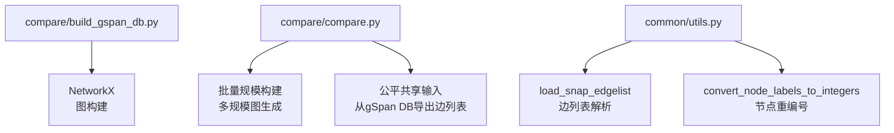
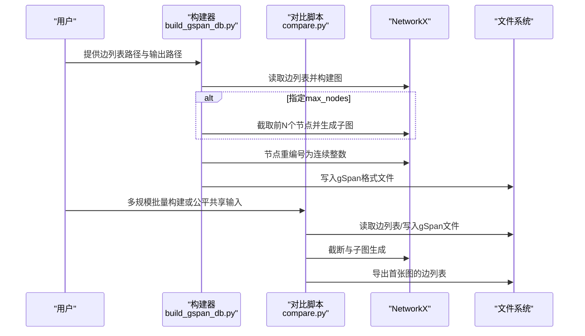
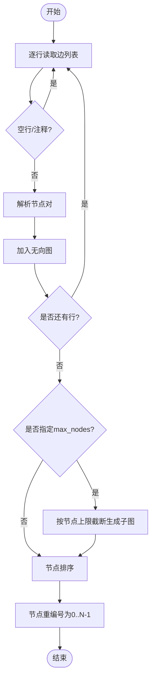
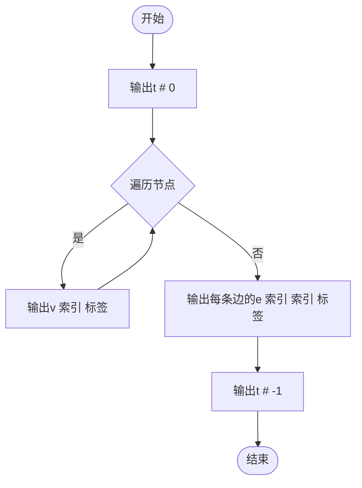
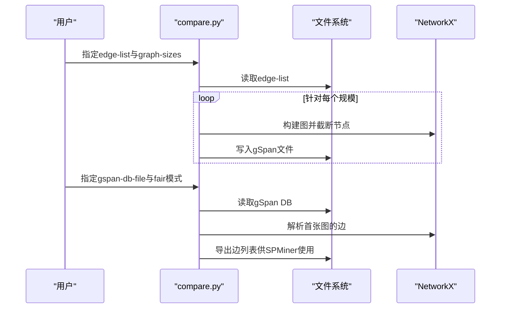
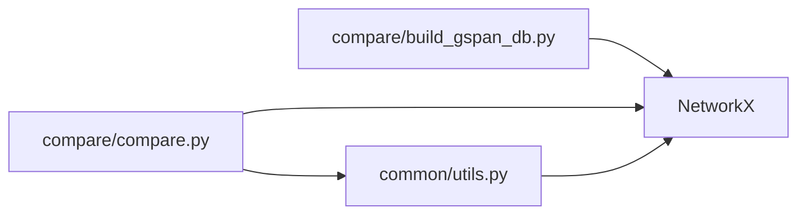

# gSpan数据库构建器

<cite>
**本文档引用的文件**
- [build_gspan_db.py](file://compare/build_gspan_db.py)
- [compare.py](file://compare/compare.py)
- [utils.py](file://common/utils.py)
- [README.md](file://README.md)
- [README.md](file://compare/README.md)
</cite>

## 目录
1. [简介](#简介)
2. [项目结构](#项目结构)
3. [核心组件](#核心组件)
4. [架构总览](#架构总览)
5. [详细组件分析](#详细组件分析)
6. [依赖分析](#依赖分析)
7. [性能考量](#性能考量)
8. [故障排查指南](#故障排查指南)
9. [结论](#结论)
10. [附录](#附录)

## 简介
本文件面向 gSpan 数据库构建器，聚焦于从原始边列表文件构建 gSpan 兼容格式的完整流程，涵盖数据解析、图构建、格式转换与多规模图生成的关键技术细节。文档同时提供输入输出格式说明、数据验证方法、常见问题解决方案以及性能优化建议，帮助用户理解数据转换过程并进行调试。

## 项目结构
围绕 gSpan 数据库构建器的相关模块与文件组织如下：
- compare/build_gspan_db.py：提供从边列表直接构建 gSpan 数据库文件的命令行工具。
- compare/compare.py：对比分析脚本，包含从边列表批量构建多规模 gSpan 数据库、公平共享输入等能力。
- common/utils.py：提供通用工具函数，如从 SNAP 风格边列表加载图、节点重编号等，支撑构建流程。
- README.md（compare 目录）：提供对比分析与构建数据库的快速运行示例。

**图表来源**
- [build_gspan_db.py:14-46](file://compare/build_gspan_db.py#L14-L46)
- [compare.py:133-166](file://compare/compare.py#L133-L166)
- [compare.py:169-214](file://compare/compare.py#L169-L214)
- [utils.py:208-233](file://common/utils.py#L208-L233)
- [utils.py:286-301](file://common/utils.py#L286-L301)

**章节来源**
- [build_gspan_db.py:1-50](file://compare/build_gspan_db.py#L1-L50)
- [compare.py:133-214](file://compare/compare.py#L133-L214)
- [utils.py:208-301](file://common/utils.py#L208-L301)
- [README.md](file://README.md)
- [README.md](file://compare/README.md)

## 核心组件
- 边列表解析与图构建
  - 从边列表逐行读取，跳过空行与注释行，解析节点对并构建无向图。
  - 支持按节点数量上限截断，生成子图。
- gSpan 格式转换
  - 将图转换为 gSpan 数据库文件格式，包含顶点声明、边声明与图结束标记。
  - 节点重编号为连续整数索引，确保 gSpan 输入一致性。
- 多规模图生成
  - 从同一原始边列表按不同节点上限批量生成多个规模的 gSpan 数据库文件，便于对比分析。
- 公平共享输入
  - 将 gSpan 数据库中的首张图导出为边列表，供 SPMiner 等其他方法使用相同输入，确保对比公平性。

**章节来源**
- [build_gspan_db.py:20-42](file://compare/build_gspan_db.py#L20-L42)
- [compare.py:133-166](file://compare/compare.py#L133-L166)
- [compare.py:169-214](file://compare/compare.py#L169-L214)
- [utils.py:208-233](file://common/utils.py#L208-L233)

## 架构总览
gSpan 数据库构建器的端到端流程如下：
- 输入：原始边列表文件（支持空格或制表符分隔，自动跳过注释行）。
- 处理：解析边列表，构建 NetworkX 图；可选按节点上限截断；节点重编号。
- 输出：gSpan 数据库文件（每张图为一组 v/e 声明，以 t 标记图边界）。

**图表来源**
- [build_gspan_db.py:14-46](file://compare/build_gspan_db.py#L14-L46)
- [compare.py:133-166](file://compare/compare.py#L133-L166)
- [compare.py:169-214](file://compare/compare.py#L169-L214)

## 详细组件分析

### 组件A：边列表解析与图构建
- 功能要点
  - 逐行读取，跳过空行与注释行（以特定字符开头）。
  - 解析节点对并加入无向图。
  - 可选按节点数量上限截断，生成子图。
- 数据结构与复杂度
  - 图存储采用邻接集合，边插入与查询为平均 O(1)。
  - 节点排序与重编号为 O(N log N)。
- 错误处理与边界情况
  - 忽略空行与注释行，保证健壮性。
  - 当未找到有效边时，输出提示信息以便调试。

**图表来源**
- [build_gspan_db.py:20-34](file://compare/build_gspan_db.py#L20-L34)

**章节来源**
- [build_gspan_db.py:20-34](file://compare/build_gspan_db.py#L20-L34)

### 组件B：gSpan格式转换
- 功能要点
  - 输出 t # 0 标记图开始，随后为每条边的 v 声明（节点索引），最后为每条边的 e 声明（起止索引），以 t # -1 结束。
  - 节点索引与边索引均为整数，符合 gSpan 输入规范。
- 数据结构与复杂度
  - 顶点与边声明顺序遍历，时间复杂度 O(N + M)。
- 错误处理与边界情况
  - 当节点或边为空时，仍需输出图起止标记，确保格式正确。

**图表来源**
- [build_gspan_db.py:36-42](file://compare/build_gspan_db.py#L36-L42)

**章节来源**
- [build_gspan_db.py:36-42](file://compare/build_gspan_db.py#L36-L42)

### 组件C：多规模图生成与公平共享输入
- 功能要点
  - 从同一原始边列表按不同节点上限批量生成多个规模的 gSpan 数据库文件，便于对比分析。
  - 公平共享输入：将 gSpan 数据库中的首张图导出为边列表，供 SPMiner 等方法使用相同输入。
- 数据结构与复杂度
  - 批量生成为 O(K·(N + M))，K 为规模数量。
- 错误处理与边界情况
  - 当 gSpan DB 文件不存在或未解析到可用边时，抛出异常并提示修复。

**图表来源**
- [compare.py:501-512](file://compare/compare.py#L501-L512)
- [compare.py:133-166](file://compare/compare.py#L133-L166)
- [compare.py:169-214](file://compare/compare.py#L169-L214)

**章节来源**
- [compare.py:501-512](file://compare/compare.py#L501-L512)
- [compare.py:133-166](file://compare/compare.py#L133-L166)
- [compare.py:169-214](file://compare/compare.py#L169-L214)

### 组件D：通用工具函数（边列表加载与节点重编号）
- 功能要点
  - 从 SNAP 风格边列表加载无向图，自动跳过空行与注释行，返回最大连通子图。
  - 节点重编号为连续整数，确保后续处理一致性。
- 数据结构与复杂度
  - 边列表解析为 O(M)，连通子图选取为 O(N + M)。
- 错误处理与边界情况
  - 非连通图时取最大连通子图，保证后续采样与子图扩展的连通性。

**章节来源**
- [utils.py:208-233](file://common/utils.py#L208-L233)
- [utils.py:286-301](file://common/utils.py#L286-L301)

## 依赖分析
- 模块耦合
  - compare/build_gspan_db.py 与 compare/compare.py 均依赖 NetworkX 进行图构建与重编号。
  - compare/compare.py 依赖 common/utils.py 的边列表加载与节点重编号功能。
- 外部依赖
  - NetworkX：图数据结构与算法。
  - Python 标准库：文件读写、路径处理、正则与字符串处理。
- 潜在循环依赖
  - 本模块之间无循环依赖，结构清晰。

**图表来源**
- [build_gspan_db.py:1-50](file://compare/build_gspan_db.py#L1-L50)
- [compare.py:133-214](file://compare/compare.py#L133-L214)
- [utils.py:208-301](file://common/utils.py#L208-L301)

**章节来源**
- [build_gspan_db.py:1-50](file://compare/build_gspan_db.py#L1-L50)
- [compare.py:133-214](file://compare/compare.py#L133-L214)
- [utils.py:208-301](file://common/utils.py#L208-L301)

## 性能考量
- 时间复杂度
  - 边列表解析与图构建为 O(M)；节点排序与重编号为 O(N log N)；输出 gSpan 文件为 O(N + M)。
- 空间复杂度
  - 图存储与中间节点索引为 O(N + M)。
- 优化建议
  - 批量处理：在多规模生成时，尽量减少重复解析与重编号开销。
  - I/O 优化：使用缓冲写入，避免频繁磁盘操作。
  - 内存管理：对大规模边列表，建议分块读取与增量写入。
  - 并行化：在多规模生成场景下，可并行写入多个 gSpan 文件。

[本节为通用性能讨论，无需特定文件来源]

## 故障排查指南
- 输入文件格式错误
  - 确认边列表文件使用空格或制表符分隔，注释行以特定字符开头会被跳过。
  - 检查是否存在空行与非法行，必要时清理文件。
- 节点上限截断无效
  - 确认 --max-nodes 参数大于 0 且小于等于图中节点总数。
  - 检查截断后的子图是否仍为连通图。
- gSpan DB 文件不存在
  - 确认 --gspan-db-file 路径正确，文件存在且可读。
  - 检查 gSpan DB 文件格式是否符合预期（包含 t 标记与 v/e 声明）。
- 公平共享输入导出失败
  - 确认 gSpan DB 中存在首张图，且包含有效的边声明。
  - 检查导出的边列表文件是否成功写入 data/ 目录。

**章节来源**
- [compare.py:171-177](file://compare/compare.py#L171-L177)
- [compare.py:203-204](file://compare/compare.py#L203-L204)
- [compare.py:264-296](file://compare/compare.py#L264-L296)

## 结论
gSpan 数据库构建器通过简洁高效的边列表解析、图构建与格式转换，实现了从原始数据到 gSpan 兼容格式的无缝衔接。配合多规模图生成与公平共享输入能力，能够支撑对比分析与实验复现。遵循本文档的输入输出规范、数据验证方法与优化建议，可显著提升构建效率与结果稳定性。

[本节为总结性内容，无需特定文件来源]

## 附录

### 输入输出格式说明
- 输入：原始边列表文件
  - 每行格式：节点1 节点2（空格或制表符分隔）
  - 注释行：以特定字符开头的行将被忽略
  - 节点标签：支持任意整数标签，最终将被重编号为 0..N-1
- 输出：gSpan 数据库文件
  - 每张图以 t # 0 开始，以 t # -1 结束
  - 顶点声明：v 索引 标签（索引为 0..N-1，标签通常为 0）
  - 边声明：e 起始索引 终止索引 标签（索引为 0..N-1，标签通常为 0）

**章节来源**
- [build_gspan_db.py:20-42](file://compare/build_gspan_db.py#L20-L42)
- [compare.py:133-166](file://compare/compare.py#L133-L166)

### 常见问题与解决方案
- 问：如何从边列表构建 gSpan 数据库？
  - 答：使用 compare/build_gspan_db.py，指定 --edge-list 与 --out 参数。
- 问：如何批量生成多规模数据库？
  - 答：使用 compare/compare.py 的 --graph-sizes 参数，指定多个节点上限。
- 问：如何确保对比公平性？
  - 答：使用 --fair-shared-input，将 gSpan DB 的首张图导出为边列表供 SPMiner 使用。
- 问：如何验证构建结果？
  - 答：检查输出文件是否包含 t 标记、v/e 声明，以及节点与边的数量是否合理。

**章节来源**
- [README.md](file://README.md)
- [README.md](file://compare/README.md)
- [compare.py:534-536](file://compare/compare.py#L534-L536)