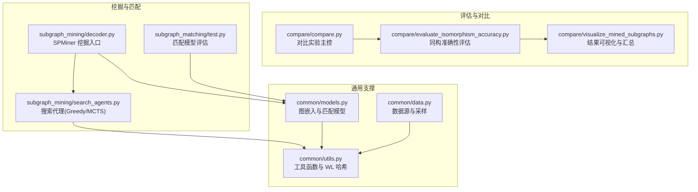
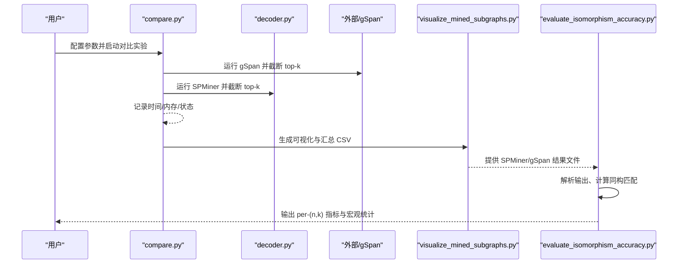
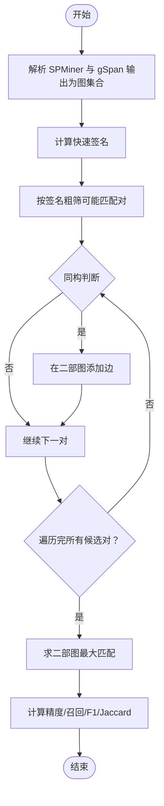
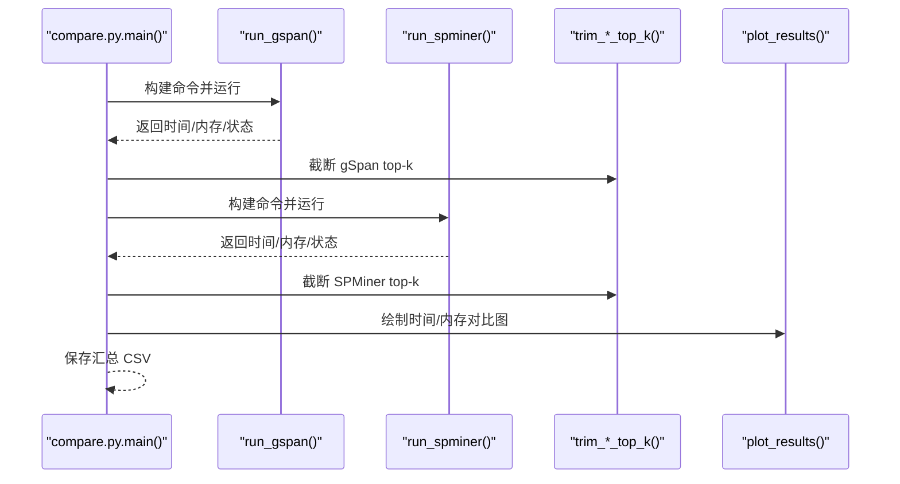
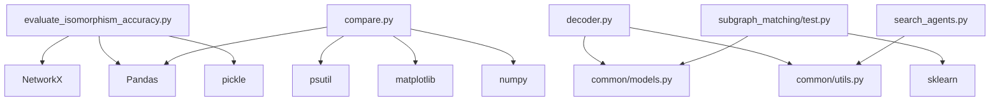

# 准确性评估系统

<cite>
**本文引用的文件**
- [evaluate_isomorphism_accuracy.py](file://compare/evaluate_isomorphism_accuracy.py)
- [compare.py](file://compare/compare.py)
- [visualize_mined_subgraphs.py](file://compare/visualize_mined_subgraphs.py)
- [test.py](file://subgraph_matching/test.py)
- [decoder.py](file://subgraph_mining/decoder.py)
- [search_agents.py](file://subgraph_mining/search_agents.py)
- [models.py](file://common/models.py)
- [data.py](file://common/data.py)
- [utils.py](file://common/utils.py)
- [README.md](file://README.md)
- [compare/README.md](file://compare/README.md)
- [spminer_vs_gspan.md](file://compare/spminer_vs_gspan.md)
</cite>

## 目录
1. [简介](#简介)
2. [项目结构](#项目结构)
3. [核心组件](#核心组件)
4. [架构总览](#架构总览)
5. [详细组件分析](#详细组件分析)
6. [依赖关系分析](#依赖关系分析)
7. [性能考量](#性能考量)
8. [故障排查指南](#故障排查指南)
9. [结论](#结论)
10. [附录](#附录)

## 简介
本文件面向“准确性评估系统”的技术文档，聚焦于同构性测试与模式匹配的准确性评估方法。系统通过对比 SPMiner 与 gSpan 的频繁子图挖掘结果，采用子图同构判断与最大匹配策略，计算精度、召回率、F1、Jaccard 等指标，并提供评估流程、结果解读与性能基准设定方法，帮助用户理解评估结果的含义与可比性。

## 项目结构
本仓库围绕“子图匹配”和“频繁子图挖掘”两大主线构建，准确性评估系统主要位于 compare 目录，配合 subgraph_mining 与 subgraph_matching 的输出进行对比分析。

**图表来源**
- [evaluate_isomorphism_accuracy.py:1-215](file://compare/evaluate_isomorphism_accuracy.py#L1-L215)
- [compare.py:1-612](file://compare/compare.py#L1-L612)
- [visualize_mined_subgraphs.py:1-191](file://compare/visualize_mined_subgraphs.py#L1-L191)
- [decoder.py:1-276](file://subgraph_mining/decoder.py#L1-L276)
- [search_agents.py:1-442](file://subgraph_mining/search_agents.py#L1-L442)
- [test.py:1-140](file://subgraph_matching/test.py#L1-L140)
- [models.py:1-318](file://common/models.py#L1-L318)
- [data.py:1-447](file://common/data.py#L1-L447)
- [utils.py:1-302](file://common/utils.py#L1-L302)

**章节来源**
- [README.md:30-62](file://README.md#L30-L62)
- [compare/README.md:1-34](file://compare/README.md#L1-L34)

## 核心组件
- 同构准确性评估模块：对 SPMiner 与 gSpan 的输出进行子图同构判断，计算匹配指标并生成汇总 CSV。
- 对比实验主控：自动化运行 SPMiner 与 gSpan，收集时间、内存、状态等指标，绘制对比图。
- 结果可视化与汇总：将挖掘结果导出为图像与汇总 CSV，便于后续评估。
- 挖掘与匹配：SPMiner 通过模型打分与搜索策略生成候选模式；匹配模型用于子图关系判别与评估。

**章节来源**
- [evaluate_isomorphism_accuracy.py:103-134](file://compare/evaluate_isomorphism_accuracy.py#L103-L134)
- [compare.py:495-612](file://compare/compare.py#L495-L612)
- [visualize_mined_subgraphs.py:127-186](file://compare/visualize_mined_subgraphs.py#L127-L186)
- [decoder.py:62-171](file://subgraph_mining/decoder.py#L62-L171)
- [test.py:11-119](file://subgraph_matching/test.py#L11-L119)

## 架构总览
准确性评估系统以“结果对比 + 指标计算 + 可视化汇总”为主线，形成闭环的评估流程。

**图表来源**
- [compare.py:495-612](file://compare/compare.py#L495-L612)
- [visualize_mined_subgraphs.py:134-191](file://compare/visualize_mined_subgraphs.py#L134-L191)
- [evaluate_isomorphism_accuracy.py:156-215](file://compare/evaluate_isomorphism_accuracy.py#L156-L215)

## 详细组件分析

### 同构准确性评估模块
- 功能概述
  - 解析 gSpan 文本输出与 SPMiner pickle 结果，构建 NetworkX 图集合。
  - 使用快速签名（节点数、边数、度序列）进行粗筛，再用子图同构判断精确匹配。
  - 建立二部图并求最大匹配，计算匹配数量，进而得到精度、召回、F1、Jaccard 等指标。
  - 支持按 (n,k) 分组输出，并计算宏平均与按 gSpan 数量加权的平均准确率。

- 关键算法与数据结构
  - 快速签名：O(V+E) 时间内对图进行快速判别，减少同构判断次数。
  - 二部图与最大匹配：将 SPMiner 与 gSpan 的候选模式映射为二部图节点，边表示同构匹配，使用最大匹配求最优一对一映射。
  - 指标计算：基于匹配数与集合基数，分别计算精度、召回、F1、Jaccard。

- 复杂度分析
  - 粗筛阶段：对 N 个 SPMiner 图与 M 个 gSpan 图，时间复杂度 O(N+M) 计算签名。
  - 同构判断：平均 O(V^2)（取决于 NetworkX 实现），最坏可达指数级，但通过签名与二部图匹配显著降低。
  - 最大匹配：二部图规模至多 N×M，使用二分图最大匹配算法，复杂度 O(NM√N) 或更优。

- 错误处理与边界情况
  - 空集合：返回 0 匹配与各指标 0.0。
  - 除零保护：分母为 0 时返回 0.0，避免异常。
  - 文件格式校验：对 gSpan 输出与 SPMiner pickle 进行格式检查，抛出错误提示。

**图表来源**
- [evaluate_isomorphism_accuracy.py:14-48](file://compare/evaluate_isomorphism_accuracy.py#L14-L48)
- [evaluate_isomorphism_accuracy.py:66-101](file://compare/evaluate_isomorphism_accuracy.py#L66-L101)
- [evaluate_isomorphism_accuracy.py:103-134](file://compare/evaluate_isomorphism_accuracy.py#L103-L134)

**章节来源**
- [evaluate_isomorphism_accuracy.py:14-215](file://compare/evaluate_isomorphism_accuracy.py#L14-L215)

### 对比实验主控模块
- 功能概述
  - 自动化运行 SPMiner 与 gSpan，支持公平共享输入（gSpan DB 作为 SPMiner 输入）。
  - 支持多规模图批量测试，记录运行时间、最大内存占用、状态等。
  - 截断 top-k 模式，绘制时间与内存对比图，输出汇总 CSV。

- 关键流程
  - gSpan：可使用内置 gspan_mining 或自定义命令模板；支持从边列表构建 gSpan DB。
  - SPMiner：加载训练好的模型，采样邻域，批量嵌入，使用 Greedy/MCTS 搜索策略生成模式。
  - 结果处理：将 gSpan 输出按支持度排序并截断 top-k；SPMiner 读取 pickle 并截断 top-k。
  - 可视化：生成时间与内存对比图，保存到输出目录。

- 性能监控
  - 使用 psutil 监控进程内存峰值；超时控制与退出码处理。
  - 对异常进行捕获并记录状态字符串，便于后续分析。

**图表来源**
- [compare.py:217-348](file://compare/compare.py#L217-L348)
- [compare.py:350-444](file://compare/compare.py#L350-L444)
- [compare.py:450-601](file://compare/compare.py#L450-L601)

**章节来源**
- [compare.py:16-125](file://compare/compare.py#L16-L125)
- [compare.py:133-167](file://compare/compare.py#L133-L167)
- [compare.py:217-348](file://compare/compare.py#L217-L348)
- [compare.py:350-444](file://compare/compare.py#L350-L444)
- [compare.py:450-601](file://compare/compare.py#L450-L601)

### 结果可视化与汇总模块
- 功能概述
  - 将 SPMiner 与 gSpan 的输出图导出为单图与拼贴图，统计平均节点数与边数。
  - 生成可视化汇总 CSV，包含来源、文件路径、数量与图像路径等元信息。
  - 为后续同构准确性评估提供输入文件清单。

- 输出内容
  - 单图 PNG：每张图独立保存，标题包含节点/边数。
  - 拼贴图 PNG：每页最多 12 张，标注序号。
  - 汇总 CSV：记录每条记录的来源、文件、数量、均值与图像路径。

**章节来源**
- [visualize_mined_subgraphs.py:86-186](file://compare/visualize_mined_subgraphs.py#L86-L186)

### 挖掘与匹配支撑模块
- SPMiner 挖掘入口
  - 加载模型（OrderEmbedder/BaselineMLP），采样邻域，批量嵌入，调用搜索代理（Greedy/MCTS）。
  - 输出模式图像与 pickle 结果文件，供评估模块使用。

- 搜索代理
  - GreedySearchAgent：基于贪心策略，按候选扩展得分选择最优节点，支持 counts/margin/hybrid 排序。
  - MCTSSearchAgent：基于 MCTS，使用 UCT 与累计价值回传，按访问统计选择高频模式。

- 匹配模型
  - OrderEmbedder：通过嵌入空间的序关系约束，计算违反程度作为预测分数。
  - SkipLastGNN：消息传递编码器，支持多种卷积类型与跳跃连接。

- 数据与工具
  - data.py：提供真实数据集加载与合成数据源，支持不平衡采样与锚定节点。
  - utils.py：提供邻域采样、WL 哈希、ESU 枚举等工具函数。

**章节来源**
- [decoder.py:62-171](file://subgraph_mining/decoder.py#L62-L171)
- [search_agents.py:129-283](file://subgraph_mining/search_agents.py#L129-L283)
- [search_agents.py:284-442](file://subgraph_mining/search_agents.py#L284-L442)
- [models.py:46-100](file://common/models.py#L46-L100)
- [models.py:101-227](file://common/models.py#L101-L227)
- [data.py:77-430](file://common/data.py#L77-L430)
- [utils.py:18-97](file://common/utils.py#L18-L97)

## 依赖关系分析
- 模块耦合
  - evaluate_isomorphism_accuracy.py 依赖 NetworkX、Pandas、pickle，与 visualize_mined_subgraphs.py 的输出文件强关联。
  - compare.py 依赖 psutil、matplotlib、numpy、pandas，负责实验调度与结果可视化。
  - SPMiner 依赖 common/models.py 与 common/utils.py，搜索代理依赖 utils 的 WL 哈希与批处理工具。
  - 子图匹配评估 test.py 依赖 sklearn 指标，与 models.py 的 predict/criterion 接口交互。

- 外部依赖
  - NetworkX：图结构与同构判断。
  - Pandas/Numpy：数据处理与统计。
  - Matplotlib：结果可视化。
  - scikit-learn：匹配模型评估指标。
  - psutil：进程监控与内存峰值统计。

**图表来源**
- [evaluate_isomorphism_accuracy.py:6-8](file://compare/evaluate_isomorphism_accuracy.py#L6-L8)
- [compare.py:10-13](file://compare/compare.py#L10-L13)
- [decoder.py:12-17](file://subgraph_mining/decoder.py#L12-L17)
- [search_agents.py:1-12](file://subgraph_mining/search_agents.py#L1-L12)
- [test.py:4-5](file://subgraph_matching/test.py#L4-L5)

**章节来源**
- [evaluate_isomorphism_accuracy.py:1-215](file://compare/evaluate_isomorphism_accuracy.py#L1-L215)
- [compare.py:1-612](file://compare/compare.py#L1-L612)
- [decoder.py:1-276](file://subgraph_mining/decoder.py#L1-L276)
- [search_agents.py:1-442](file://subgraph_mining/search_agents.py#L1-L442)
- [test.py:1-140](file://subgraph_matching/test.py#L1-L140)

## 性能考量
- 评估模块性能
  - 快速签名与二部图匹配显著降低同构判断次数，适合大规模对比。
  - 最大匹配算法复杂度与候选对数量相关，建议控制 top-k 与 (n,k) 组合数量。

- 实验对比性能
  - 进程监控与超时控制避免长时间阻塞；内存峰值统计有助于资源规划。
  - 可视化图表与 CSV 汇总便于横向对比不同参数下的性能表现。

- 挖掘与匹配性能
  - SPMiner 的批处理嵌入与搜索策略可调参数较多，需根据硬件与数据规模平衡 n_trials、batch_size、frontier_top_k 等。

[本节为通用指导，无需特定文件引用]

## 故障排查指南
- gSpan 命令执行失败
  - 检查命令模板或内置 gspan_mining 的参数与路径；确认 --gspan-db-file 是否正确提供。
  - 查看返回状态码与日志文件，定位超时或异常原因。

- SPMiner 模型加载失败
  - 确认模型路径与设备兼容；检查 checkpoint 文件完整性。
  - 若使用节点锚定，确保模型类型与参数一致。

- 同构准确性评估无匹配
  - 检查 SPMiner 与 gSpan 的 top-k 截断是否过大；核对文件命名与 (n,k) 标签解析。
  - 确认输出文件格式（pickle 与 gSpan 文本）符合解析器预期。

- 结果可视化缺失
  - 检查输出目录权限与路径；确认生成的图像与汇总 CSV 是否存在。

**章节来源**
- [compare.py:217-262](file://compare/compare.py#L217-L262)
- [compare.py:299-348](file://compare/compare.py#L299-L348)
- [evaluate_isomorphism_accuracy.py:156-215](file://compare/evaluate_isomorphism_accuracy.py#L156-L215)
- [visualize_mined_subgraphs.py:134-191](file://compare/visualize_mined_subgraphs.py#L134-L191)

## 结论
本准确性评估系统通过“同构性测试 + 指标计算 + 可视化汇总”的闭环流程，为 SPMiner 与 gSpan 的频繁子图挖掘结果提供可比性与可解释性。系统在保证算法严谨性的同时，兼顾工程实用性，支持多规模、多参数的对比实验，并提供性能基准设定与结果解读方法，便于用户在不同场景下做出合理决策。

[本节为总结性内容，无需特定文件引用]

## 附录

### 评估流程说明
- 测试数据准备
  - 生成 gSpan 输入数据库（可从边列表构建）。
  - 运行 SPMiner 与 gSpan，分别输出 pickle 与文本结果。
  - 使用可视化脚本生成图像与汇总 CSV。

- 执行过程
  - 运行对比主控脚本，收集时间、内存与状态。
  - 截断 top-k 模式，生成对比图表。
  - 运行同构准确性评估，输出 per-(n,k) 指标与宏观统计。

- 结果分析
  - 查看 per-(n,k) 指标与汇总 CSV。
  - 结合时间/内存对比图，评估不同参数与规模下的性能表现。
  - 解读宏平均与加权平均准确率，判断方法在不同集合规模下的稳健性。

**章节来源**
- [compare/README.md:9-34](file://compare/README.md#L9-L34)
- [spminer_vs_gspan.md:39-83](file://compare/spminer_vs_gspan.md#L39-L83)

### 评估指标与统计方法
- 指标定义
  - 精度（Precision）：匹配数 / SPMiner 模式总数。
  - 召回（Recall）：匹配数 / gSpan 模式总数。
  - F1：2 × Precision × Recall / (Precision + Recall)。
  - Jaccard：匹配数 / (SPMiner 模式数 + gSpan 模式数 - 匹配数)。
  - 宏平均准确率：按 (n,k) 分组取平均。
  - 加权准确率：按 gSpan 模式数加权求和。

- 统计分析
  - 按 (n,k) 分组统计各指标，生成 per-(n,k) CSV。
  - 计算全局宏平均与加权平均，辅助跨组比较。

**章节来源**
- [evaluate_isomorphism_accuracy.py:103-134](file://compare/evaluate_isomorphism_accuracy.py#L103-L134)

### 评估报告解读指南
- 指标趋势
  - 随着 k 增大，召回可能下降（gSpan 更保守），精度可能波动。
  - 随着 n 增大，gSpan 可能因组合爆炸导致性能下降，SPMiner 通过嵌入与搜索策略更具弹性。

- 结果解释
  - 若宏平均准确率较高但加权准确率较低，说明 gSpan 在较大集合上产出更多模式，匹配数占比不高。
  - 若 Jaccard 较低，说明模式集合差异较大，需关注模式语义一致性。

**章节来源**
- [evaluate_isomorphism_accuracy.py:206-212](file://compare/evaluate_isomorphism_accuracy.py#L206-L212)

### 性能基准设定方法
- 基准参数
  - 固定 n 与 k，调整 batch_size、n_trials、frontier_top_k 等，观察指标与时间/内存变化。
  - 使用公平共享输入（gSpan DB 作为 SPMiner 输入），确保对比一致性。

- 基准数据集
  - 选择不同规模与密度的图，覆盖社交网络、生物网络、交通网络等场景。
  - 通过多组 (n,k) 组合，建立横向对比基准。

**章节来源**
- [compare.py:16-125](file://compare/compare.py#L16-L125)
- [compare.py:501-513](file://compare/compare.py#L501-L513)