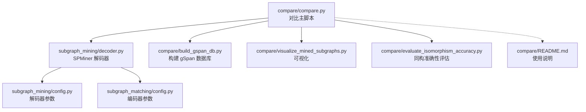
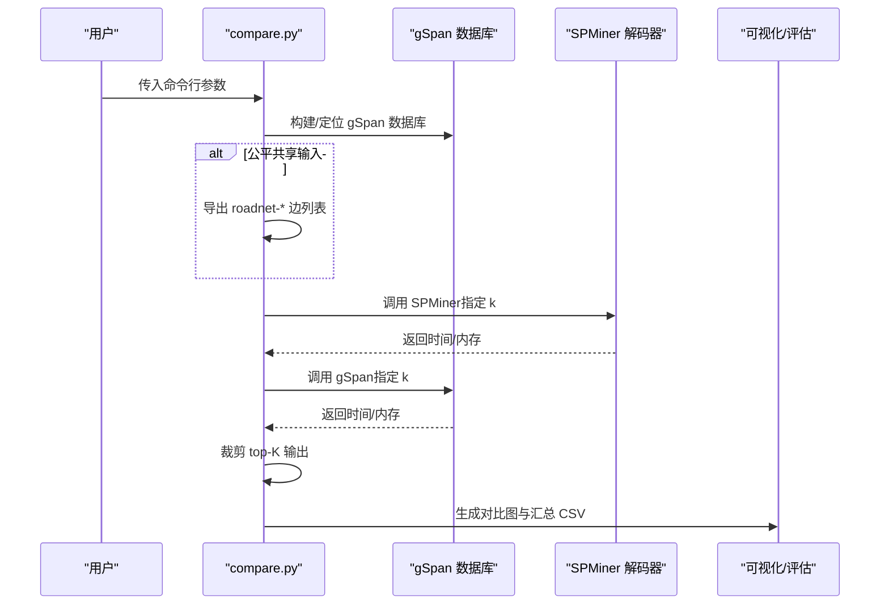
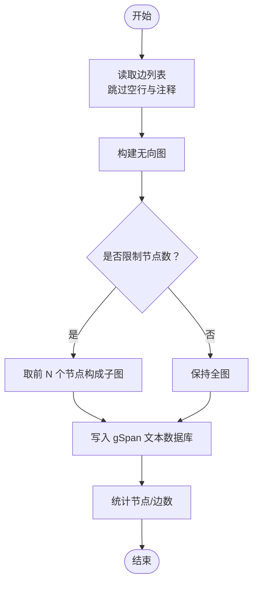
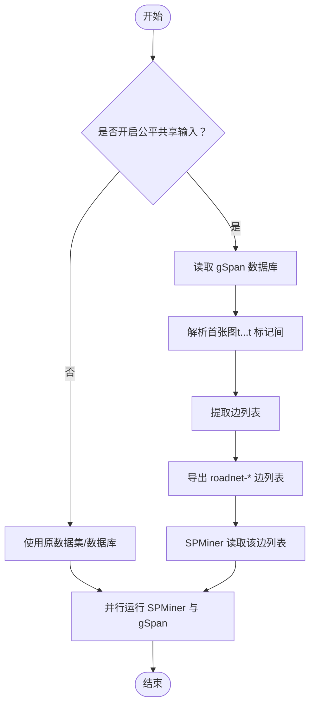
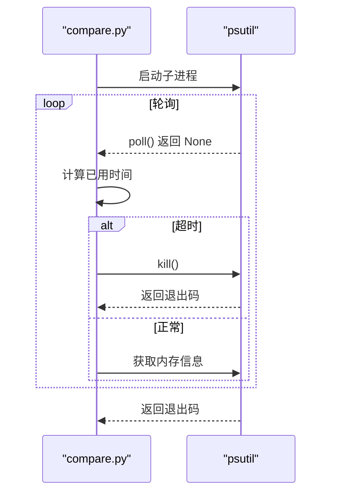
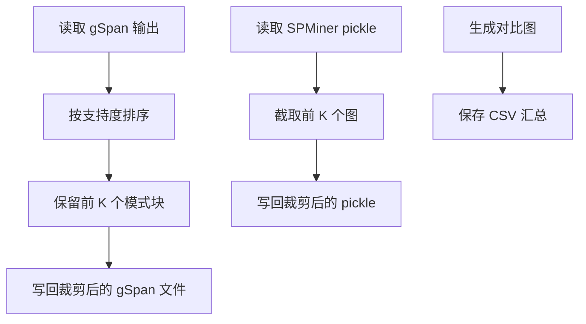
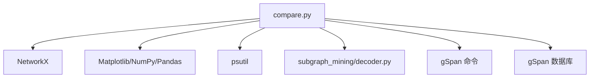

# 对比入口程序

<cite>
**本文引用的文件**
- [compare.py](file://compare/compare.py)
- [build_gspan_db.py](file://compare/build_gspan_db.py)
- [evaluate_isomorphism_accuracy.py](file://compare/evaluate_isomorphism_accuracy.py)
- [visualize_mined_subgraphs.py](file://compare/visualize_mined_subgraphs.py)
- [README.md](file://compare/README.md)
- [decoder.py](file://subgraph_mining/decoder.py)
- [config.py](file://subgraph_mining/config.py)
- [config.py](file://subgraph_matching/config.py)
- [environment.yml](file://environment.yml)
</cite>

## 目录
1. [简介](#简介)
2. [项目结构](#项目结构)
3. [核心组件](#核心组件)
4. [架构总览](#架构总览)
5. [详细组件分析](#详细组件分析)
6. [依赖分析](#依赖分析)
7. [性能考虑](#性能考虑)
8. [故障排查指南](#故障排查指南)
9. [结论](#结论)
10. [附录](#附录)

## 简介
本文件面向对比入口程序，系统性说明其命令行参数、多规模测试实现原理、公平共享输入模式的工作机制，并提供完整的使用示例与最佳实践，帮助用户正确配置与运行 SPMiner 与 gSpan 的性能对比实验。

## 项目结构
- compare 目录包含对比主脚本、辅助工具与可视化/评估脚本：
  - 对比主脚本：compare/compare.py
  - 从边列表构建 gSpan 数据库：compare/build_gspan_db.py
  - 同构准确性评估：compare/evaluate_isomorphism_accuracy.py
  - 结果可视化：compare/visualize_mined_subgraphs.py
  - 使用说明：compare/README.md
- 子图挖掘模块（SPMiner）：
  - 解码器入口与参数：subgraph_mining/decoder.py、subgraph_mining/config.py
  - 匹配（编码器）参数：subgraph_matching/config.py
- 环境配置：environment.yml

**图表来源**
- [compare.py:495-612](file://compare/compare.py#L495-L612)
- [decoder.py:197-276](file://subgraph_mining/decoder.py#L197-L276)
- [build_gspan_db.py:14-50](file://compare/build_gspan_db.py#L14-L50)
- [visualize_mined_subgraphs.py:134-191](file://compare/visualize_mined_subgraphs.py#L134-L191)
- [evaluate_isomorphism_accuracy.py:156-215](file://compare/evaluate_isomorphism_accuracy.py#L156-L215)

**章节来源**
- [compare.py:16-125](file://compare/compare.py#L16-L125)
- [README.md:1-34](file://compare/README.md#L1-L34)

## 核心组件
- 命令行参数解析与执行流程
- 多规模图数据库构建（从边列表）
- 公平共享输入模式（SPMiner 与 gSpan 使用相同输入）
- 进程监控与超时控制
- 结果裁剪与可视化

**章节来源**
- [compare.py:16-125](file://compare/compare.py#L16-L125)
- [compare.py:133-166](file://compare/compare.py#L133-L166)
- [compare.py:169-214](file://compare/compare.py#L169-L214)
- [compare.py:217-262](file://compare/compare.py#L217-L262)
- [compare.py:495-612](file://compare/compare.py#L495-L612)

## 架构总览
对比入口程序通过命令行参数驱动，完成以下流程：
- 解析参数并定位仓库根目录与输出目录
- 若提供多规模参数，则从边列表构建多个 gSpan 数据库；否则使用单个 gSpan 数据库
- 在公平共享模式下，将 gSpan 数据库中的首张图导出为 SPMiner 的 roadnet-* 边列表，确保两算法使用完全一致的输入
- 分别调用 gSpan 与 SPMiner，记录运行时间与最大内存
- 对 gSpan 与 SPMiner 的输出分别进行 top-K 裁剪
- 生成对比结果 CSV 与时间/内存对比图

**图表来源**
- [compare.py:495-612](file://compare/compare.py#L495-L612)
- [compare.py:264-296](file://compare/compare.py#L264-L296)
- [compare.py:299-348](file://compare/compare.py#L299-L348)
- [compare.py:351-363](file://compare/compare.py#L351-L363)
- [compare.py:410-443](file://compare/compare.py#L410-L443)

## 详细组件分析

### 命令行参数与作用
- 数据集与输入
  - --dataset：数据集名称（如 facebook），用于 SPMiner 读取与展示
  - --edge-list：多规模测试时的原始边列表路径
  - --gspan-db-file：gSpan 图数据库文件路径（可为空，启用单图模式）
  - --fair-shared-input：开启公平共享输入模式，强制 SPMiner 与 gSpan 使用同一份 gSpan 子图输入
- 规模与子图大小
  - --graph-sizes：多规模节点数列表（如 40 60 80），为空则进入单图模式
  - --ks：要测试的子图大小列表（k 值）
- 算法与资源控制
  - --min-sup：gSpan 最小支持度
  - --timeout-sec：单次运行超时（秒）
  - --poll-interval：轮询进程状态的时间间隔（秒）
  - --python-bin：运行 SPMiner 的 Python 可执行文件
  - --repo-root：仓库根目录（默认自动定位）
  - --out-dir：对比结果输出目录
- SPMiner 参数
  - --model-path：模型路径（相对或绝对）
  - --spminer-trials：搜索试验次数
  - --spminer-neighborhoods：邻域采样数量
  - --spminer-batch-size：批处理大小
  - --top-k-patterns：保留的高频子图数量（用于裁剪）
- gSpan 参数
  - --gspan-cmd-template：gSpan 命令模板（支持变量：{dataset} {k} {min_sup} {out_file} {gspan_db}）
  - --use-gspan-mining：使用内置 gspan_mining 命令构造（推荐 Windows）

**章节来源**
- [compare.py:16-125](file://compare/compare.py#L16-L125)

### 多规模测试实现原理
- 输入：边列表文件（支持注释行跳过）
- 构建步骤：
  - 读取边列表，构建无向图
  - 可选限制最大节点数（按节点 ID 排序取前 N）
  - 生成 gSpan 文本数据库：写入顶点/边条目与图结束标记
- 输出：每个规模对应一个 gSpan 数据库文件，供 gSpan 与 SPMiner 使用

**图表来源**
- [compare.py:133-166](file://compare/compare.py#L133-L166)
- [build_gspan_db.py:14-46](file://compare/build_gspan_db.py#L14-L46)

**章节来源**
- [compare.py:133-166](file://compare/compare.py#L133-L166)
- [build_gspan_db.py:14-46](file://compare/build_gspan_db.py#L14-L46)

### 公平共享输入模式工作机制
- 条件：开启 --fair-shared-input 且提供 --gspan-db-file
- 步骤：
  - 从 gSpan 数据库中解析首张图（t 标记与图结束标记之间的内容）
  - 提取边列表，生成 SPMiner 可读的 roadnet-<stem>-fair 边列表文件
  - SPMiner 读取该边列表作为其输入数据集
- 效果：确保 SPMiner 与 gSpan 在完全相同的子图输入上进行对比，消除输入差异带来的偏差

**图表来源**
- [compare.py:169-214](file://compare/compare.py#L169-L214)
- [decoder.py:229-236](file://subgraph_mining/decoder.py#L229-L236)

**章节来源**
- [compare.py:169-214](file://compare/compare.py#L169-L214)
- [decoder.py:229-236](file://subgraph_mining/decoder.py#L229-L236)

### 进程监控与超时控制
- 使用 psutil 启动子进程，按轮询间隔检查进程状态
- 超时：超过设定秒数自动终止进程并抛出异常
- 内存：记录进程最大常驻内存（MB），用于对比分析
- 退出码：gSpan 允许 0/1 两种退出码（部分实现可能返回 1）

**图表来源**
- [compare.py:217-262](file://compare/compare.py#L217-L262)

**章节来源**
- [compare.py:217-262](file://compare/compare.py#L217-L262)

### 结果裁剪与可视化
- gSpan 输出裁剪：按支持度排序，保留前 K 个模式块
- SPMiner 输出裁剪：读取 pickle 序列化结果，截取前 K 个
- 可视化：生成时间与内存对比图，支持多规模与单规模
- 评估：基于同构匹配计算准确率、召回、F1、Jaccard 等指标

**图表来源**
- [compare.py:410-443](file://compare/compare.py#L410-L443)
- [compare.py:351-363](file://compare/compare.py#L351-L363)
- [visualize_mined_subgraphs.py:134-191](file://compare/visualize_mined_subgraphs.py#L134-L191)
- [evaluate_isomorphism_accuracy.py:156-215](file://compare/evaluate_isomorphism_accuracy.py#L156-L215)

**章节来源**
- [compare.py:351-363](file://compare/compare.py#L351-L363)
- [compare.py:410-443](file://compare/compare.py#L410-L443)
- [visualize_mined_subgraphs.py:134-191](file://compare/visualize_mined_subgraphs.py#L134-L191)
- [evaluate_isomorphism_accuracy.py:156-215](file://compare/evaluate_isomorphism_accuracy.py#L156-L215)

## 依赖分析
- 对外依赖
  - gSpan：可通过内置命令或自定义命令模板运行
  - NetworkX：用于图构建与解析
  - Matplotlib/NumPy/Pandas：结果可视化与统计
  - psutil：进程监控与内存测量
- 内部依赖
  - SPMiner 解码器：作为子进程被调用，参数来自命令行与内部配置
  - gSpan 数据库：作为 SPMiner 与 gSpan 的共同输入源（公平共享模式）

**图表来源**
- [compare.py:10-14](file://compare/compare.py#L10-L14)
- [compare.py:299-348](file://compare/compare.py#L299-L348)
- [decoder.py:197-276](file://subgraph_mining/decoder.py#L197-L276)

**章节来源**
- [compare.py:10-14](file://compare/compare.py#L10-L14)
- [environment.yml:111-127](file://environment.yml#L111-L127)

## 性能考虑
- 超时与轮询
  - 合理设置 --timeout-sec 与 --poll-interval，避免长时间阻塞
  - 轮询间隔过短会增加开销，过长可能导致误判
- 内存监控
  - 使用 psutil 获取最大内存，注意不同平台的可用性
- 批处理与采样
  - SPMiner 的 --spminer-batch-size 与 --spminer-neighborhoods 影响速度与稳定性
  - 增大 batch_size 可提升吞吐，但需关注显存/内存上限
- 数据规模
  - 多规模测试建议从较小规模起步，逐步扩大，观察性能曲线
- gSpan 支持度
  - --min-sup 过高会导致模式稀少，过低会增加搜索空间与时间

[本节为通用指导，无需特定文件引用]

## 故障排查指南
- 缺少必要参数
  - 使用内置 gSpan 模式但未提供数据库文件：提示缺失参数
  - 未提供 gSpan 命令模板且未启用内置模式：提示缺失模板
  - 开启公平共享输入但未提供 gSpan 数据库：提示缺失参数
- 输入格式错误
  - gSpan 数据库解析失败：检查首张图边界与边格式
  - 边列表注释与空行：确保正确跳过
- 进程异常
  - 超时：增大 --timeout-sec 或优化算法参数
  - 退出码非零：检查命令模板、数据库路径与权限
- 结果为空
  - gSpan 支持度过高导致无模式输出
  - SPMiner 采样不足或 batch_size 过小

**章节来源**
- [compare.py:299-348](file://compare/compare.py#L299-L348)
- [compare.py:169-214](file://compare/compare.py#L169-L214)
- [compare.py:217-262](file://compare/compare.py#L217-L262)

## 结论
对比入口程序提供了标准化的 SPMiner 与 gSpan 对比框架，支持多规模测试与公平共享输入，具备完善的超时控制、内存监控与结果可视化能力。通过合理配置参数与遵循最佳实践，用户可在可控范围内高效开展性能对比实验。

[本节为总结，无需特定文件引用]

## 附录

### 使用示例与最佳实践
- 快速生成小规模 gSpan 数据库
  - 示例命令：[compare/README.md:13-15](file://compare/README.md#L13-L15)
- 单图模式对比（Windows 推荐）
  - 示例命令：[compare/README.md:17-21](file://compare/README.md#L17-L21)
- 多规模批量测试
  - 在命令中提供 --graph-sizes（如 40 60 80），程序将自动构建对应数据库并逐规模运行
- 公平共享输入
  - 同时提供 --gspan-db-file 与 --fair-shared-input，确保 SPMiner 与 gSpan 使用同一份子图输入
- 结果解读
  - 输出目录包含 CSV 汇总与对比图，结合 --top-k-patterns 评估保留模式数量
  - 可使用可视化与同构准确性评估脚本进一步分析一致性

**章节来源**
- [README.md:9-28](file://compare/README.md#L9-L28)
- [compare.py:495-612](file://compare/compare.py#L495-L612)

### 关键参数一览
- 数据集与输入
  - --dataset、--edge-list、--gspan-db-file、--fair-shared-input
- 规模与子图大小
  - --graph-sizes、--ks
- 资源与控制
  - --timeout-sec、--poll-interval、--python-bin、--repo-root、--out-dir
- SPMiner
  - --model-path、--spminer-trials、--spminer-neighborhoods、--spminer-batch-size、--top-k-patterns
- gSpan
  - --min-sup、--gspan-cmd-template、--use-gspan-mining

**章节来源**
- [compare.py:16-125](file://compare/compare.py#L16-L125)