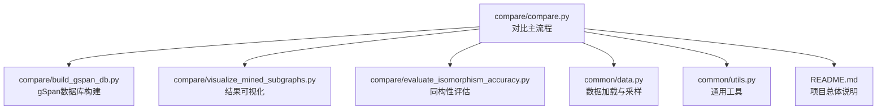
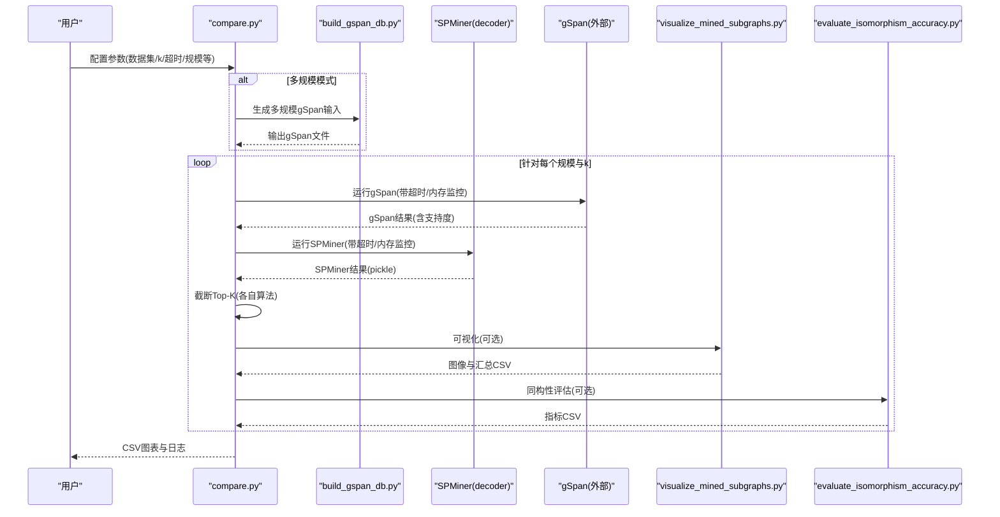
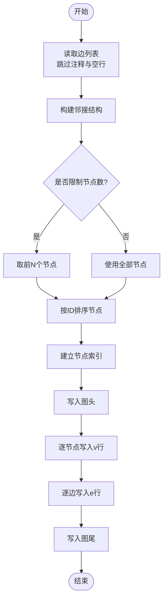
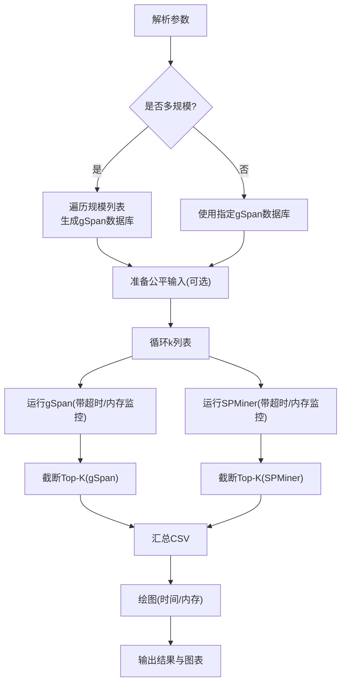
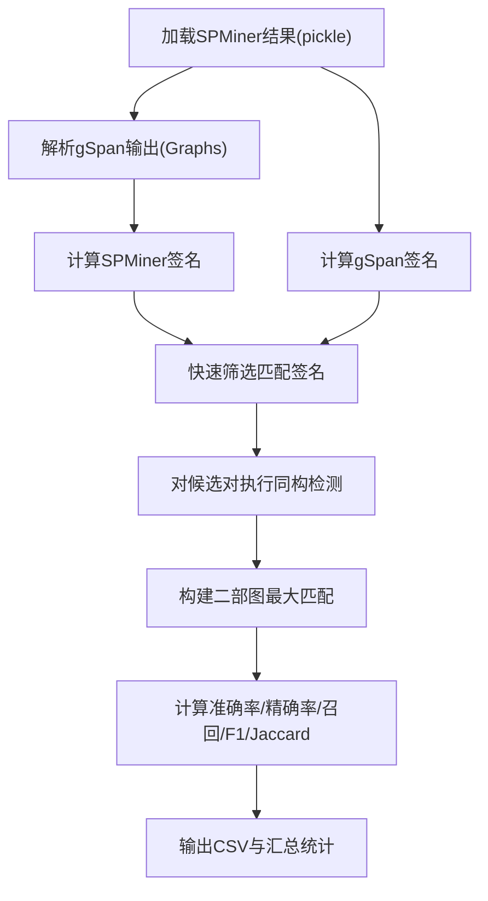
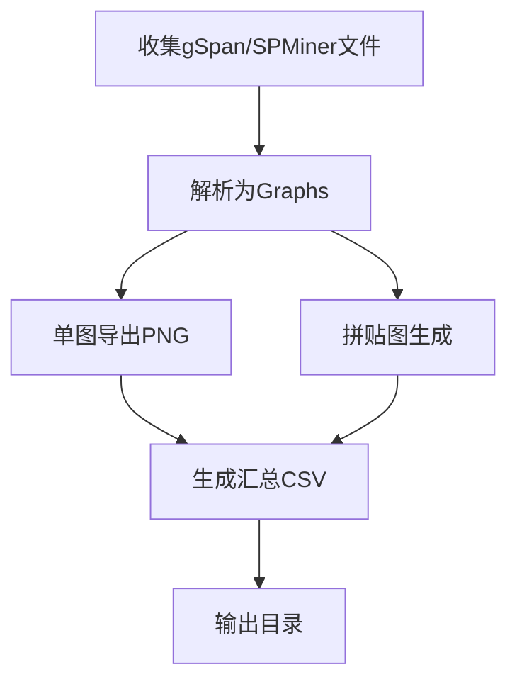
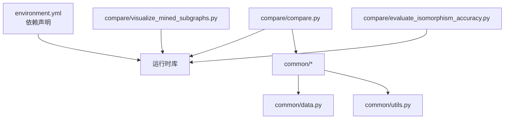

# 性能对比分析系统

<cite>
**本文档引用的文件**
- [compare/README.md](file://compare/README.md)
- [compare/compare.py](file://compare/compare.py)
- [compare/build_gspan_db.py](file://compare/build_gspan_db.py)
- [compare/evaluate_isomorphism_accuracy.py](file://compare/evaluate_isomorphism_accuracy.py)
- [compare/visualize_mined_subgraphs.py](file://compare/visualize_mined_subgraphs.py)
- [README.md](file://README.md)
- [common/data.py](file://common/data.py)
- [common/utils.py](file://common/utils.py)
- [environment.yml](file://environment.yml)
</cite>

## 目录
1. [简介](#简介)
2. [项目结构](#项目结构)
3. [核心组件](#核心组件)
4. [架构总览](#架构总览)
5. [详细组件分析](#详细组件分析)
6. [依赖关系分析](#依赖关系分析)
7. [性能考量](#性能考量)
8. [故障排查指南](#故障排查指南)
9. [结论](#结论)
10. [附录](#附录)

## 简介
本系统围绕 SPMiner 与 gSpan 两种频繁子图挖掘方法的性能对比展开，提供从多规模图构建、超时控制、结果提取与可视化到同构性评估的完整流程。系统设计遵循“公平输入、统一指标、可扩展参数”的原则，既可用于工程落地的基线对比，也可作为教学与研究的可视化分析工具。

## 项目结构
- compare 目录：对比分析主流程与结果可视化
  - compare.py：对比主脚本，负责多规模图生成、超时控制、运行与监控、结果整理与绘图
  - build_gspan_db.py：将边列表转换为 gSpan 输入格式
  - evaluate_isomorphism_accuracy.py：基于同构匹配的准确性评估
  - visualize_mined_subgraphs.py：子图可视化与汇总
  - README.md：快速运行说明与输出清单
- common 目录：数据加载与通用工具
  - data.py：数据集加载与采样
  - utils.py：邻域采样、WL 哈希、ESU 枚举等
- 根目录 README.md：项目总体介绍与模块职责
- environment.yml：环境依赖清单

**图表来源**
- [compare/compare.py:495-612](file://compare/compare.py#L495-L612)
- [compare/build_gspan_db.py:1-50](file://compare/build_gspan_db.py#L1-L50)
- [compare/visualize_mined_subgraphs.py:134-191](file://compare/visualize_mined_subgraphs.py#L134-L191)
- [compare/evaluate_isomorphism_accuracy.py:156-215](file://compare/evaluate_isomorphism_accuracy.py#L156-L215)
- [common/data.py:21-75](file://common/data.py#L21-L75)
- [common/utils.py:18-53](file://common/utils.py#L18-L53)
- [README.md:30-62](file://README.md#L30-L62)

**章节来源**
- [compare/README.md:1-34](file://compare/README.md#L1-L34)
- [README.md:30-62](file://README.md#L30-L62)

## 核心组件
- 多规模图数据库构建：支持从原始边列表按节点上限截断生成多规模 gSpan 输入文件，便于控制实验规模与可比性。
- 对比执行引擎：统一管理 gSpan 与 SPMiner 的运行，支持超时控制、内存监控、结果截断与统计。
- 结果可视化：生成时间与内存对比图，支持多规模与多 k 的对比。
- 同构性评估：基于网络等价与最大匹配，计算准确率、召回、F1 与 Jaccard 系数，形成宏观与加权平均指标。
- 可视化与汇总：将挖掘结果导出为图像与汇总 CSV，便于人工审阅与二次分析。

**章节来源**
- [compare/compare.py:16-125](file://compare/compare.py#L16-L125)
- [compare/build_gspan_db.py:6-50](file://compare/build_gspan_db.py#L6-L50)
- [compare/visualize_mined_subgraphs.py:127-191](file://compare/visualize_mined_subgraphs.py#L127-L191)
- [compare/evaluate_isomorphism_accuracy.py:103-135](file://compare/evaluate_isomorphism_accuracy.py#L103-L135)

## 架构总览
系统采用“对比主流程”为中心的流水线架构，对比主流程负责：
- 解析参数与路径
- 多规模图构建（可选）
- 公平输入准备（可选）
- 两算法并行运行与监控
- 结果截断与统计
- 可视化与汇总输出

**图表来源**
- [compare/compare.py:495-612](file://compare/compare.py#L495-L612)
- [compare/build_gspan_db.py:14-50](file://compare/build_gspan_db.py#L14-L50)
- [compare/visualize_mined_subgraphs.py:134-191](file://compare/visualize_mined_subgraphs.py#L134-L191)
- [compare/evaluate_isomorphism_accuracy.py:156-215](file://compare/evaluate_isomorphism_accuracy.py#L156-L215)

## 详细组件分析

### 组件A：gSpan数据库构建
- 输入格式：支持 SNAP 风格边列表（空行与注释行自动跳过），返回最大连通子图。
- 输出格式：gSpan 标准文本数据库，包含节点与边条目及图结束标记。
- 多规模策略：按节点上限截断，生成不同规模的数据库文件，便于对比不同图规模下的性能。
- 节点重编号：按节点 ID 排序并建立索引，确保输出一致。

**图表来源**
- [compare/build_gspan_db.py:14-46](file://compare/build_gspan_db.py#L14-L46)

**章节来源**
- [compare/build_gspan_db.py:6-50](file://compare/build_gspan_db.py#L6-L50)

### 组件B：对比主流程与超时控制
- 参数解析：支持数据集、边列表、图规模列表、k 列表、最小支持度、超时、轮询间隔、Python 可执行文件、仓库根、模型路径、SPMiner 参数、gSpan 命令模板、输出目录、公平共享输入、Top-K 等。
- 多规模图生成：当提供 graph-sizes 时，自动遍历规模并生成对应 gSpan 数据库。
- 公平输入：可选启用公平模式，将 gSpan DB 的首图导出为 SPMiner 可读的边列表，确保两算法使用同一输入。
- 进程监控：使用 psutil 监控子进程状态、超时与内存峰值，支持自定义退出码。
- 结果截断：gSpan 与 SPMiner 的结果分别按支持度排序后截断 Top-K，便于后续一致性评估。
- 可视化：绘制时间与内存对比图，支持多规模与多 k 的分组展示。

**图表来源**
- [compare/compare.py:495-612](file://compare/compare.py#L495-L612)

**章节来源**
- [compare/compare.py:16-125](file://compare/compare.py#L16-L125)
- [compare/compare.py:501-532](file://compare/compare.py#L501-L532)
- [compare/compare.py:533-590](file://compare/compare.py#L533-L590)
- [compare/compare.py:591-612](file://compare/compare.py#L591-L612)

### 组件C：同构性评估与准确性测试
- 输入：SPMiner 的 pickle 结果与 gSpan 的文本输出。
- 签名预筛：使用节点数、边数与度序列构成的签名进行快速筛选，减少同构检测开销。
- 最大匹配：构建二部图，使用最大匹配计算同构匹配对数。
- 指标：准确率（以 gSpan 为参考集合）、精确率、召回、F1、Jaccard。
- 汇总：支持宏平均与按 gSpan 计数加权平均。

**图表来源**
- [compare/evaluate_isomorphism_accuracy.py:71-135](file://compare/evaluate_isomorphism_accuracy.py#L71-L135)

**章节来源**
- [compare/evaluate_isomorphism_accuracy.py:103-135](file://compare/evaluate_isomorphism_accuracy.py#L103-L135)
- [compare/evaluate_isomorphism_accuracy.py:156-215](file://compare/evaluate_isomorphism_accuracy.py#L156-L215)

### 组件D：结果可视化与汇总
- gSpan 与 SPMiner 结果均可解析为 NetworkX 图列表，支持读取支持度字段。
- 单图导出：将每个图导出为 PNG，标注节点与边数。
- 拼贴图：将一组图拼贴为网格图，便于横向对比。
- 汇总 CSV：记录来源、文件路径、图数量、平均节点与边数、输出路径等。

**图表来源**
- [compare/visualize_mined_subgraphs.py:127-191](file://compare/visualize_mined_subgraphs.py#L127-L191)

**章节来源**
- [compare/visualize_mined_subgraphs.py:134-191](file://compare/visualize_mined_subgraphs.py#L134-L191)

### 组件E：数据加载与采样（支撑 SPMiner）
- 数据集加载：支持 TUDataset 与 SNAP 数据集（如 Facebook），返回训练/测试集合。
- 邻域采样：按图大小加权采样连通邻域，支持节点锚定增强。
- 采样策略：前沿扩展法，确保采样邻域的连通性与多样性。

**章节来源**
- [common/data.py:21-75](file://common/data.py#L21-L75)
- [common/utils.py:18-53](file://common/utils.py#L18-L53)

## 依赖关系分析
- 运行时依赖：matplotlib、numpy、pandas、psutil、networkx、torch、torch_geometric 等。
- 环境配置：建议使用 conda 创建独立环境，按 platform 与 CUDA 版本安装 PyTorch Geometric。
- 仓库模块：compare 依赖 common 的数据与工具函数；SPMiner 依赖 common 的模型与数据接口。

**图表来源**
- [environment.yml:1-129](file://environment.yml#L1-L129)
- [compare/compare.py:1-14](file://compare/compare.py#L1-L14)
- [common/data.py:1-20](file://common/data.py#L1-L20)
- [common/utils.py:1-17](file://common/utils.py#L1-L17)

**章节来源**
- [environment.yml:1-129](file://environment.yml#L1-L129)
- [README.md:75-121](file://README.md#L75-L121)

## 性能考量
- 超时与轮询：通过进程监控与轮询间隔控制实验上限，避免长时间挂起；内存峰值用于衡量资源消耗。
- 多规模对比：通过节点上限截断生成不同规模数据库，控制变量法评估算法在不同图规模下的表现。
- Top-K 截断：统一两算法输出长度，降低后续评估与可视化的不均衡影响。
- 可视化与指标：时间与内存对比图直观呈现性能差异；同构性指标提供结果一致性参考。

[本节为通用指导，无需具体文件分析]

## 故障排查指南
- gSpan 命令缺失：未启用内置 mining 模式时需提供命令模板；Windows 下推荐使用内置模式以避免转义问题。
- 超时与异常：监控器在超时后会终止进程并记录错误；检查超时设置与硬件资源。
- 输入格式：gSpan DB 需包含有效图块与节点/边记录；SPMiner 公平输入需确保首图解析成功。
- 环境依赖：确认 Python 版本、PyTorch 与 PyG 安装正确，必要时补装 tensorboard。

**章节来源**
- [compare/compare.py:328-348](file://compare/compare.py#L328-L348)
- [compare/compare.py:217-262](file://compare/compare.py#L217-L262)
- [compare/README.md:17-21](file://compare/README.md#L17-L21)

## 结论
本系统通过“公平输入 + 统一指标 + 可视化”的设计，实现了 SPMiner 与 gSpan 的可复现实验流程。多规模测试与超时控制保障了实验的可控性与稳定性；同构性评估提供了结果一致性度量；可视化图表帮助直观理解性能差异。建议在工程实践中将 gSpan 作为基线，SPMiner 作为学习驱动的扩展方案，二者互补以覆盖不同场景需求。

[本节为总结性内容，无需具体文件分析]

## 附录
- 快速运行示例与输出说明见 compare/README.md。
- 项目总体模块与参数说明见根目录 README.md。

**章节来源**
- [compare/README.md:9-34](file://compare/README.md#L9-L34)
- [README.md:12-62](file://README.md#L12-L62)