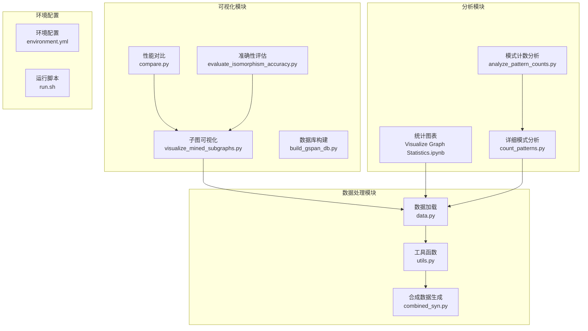
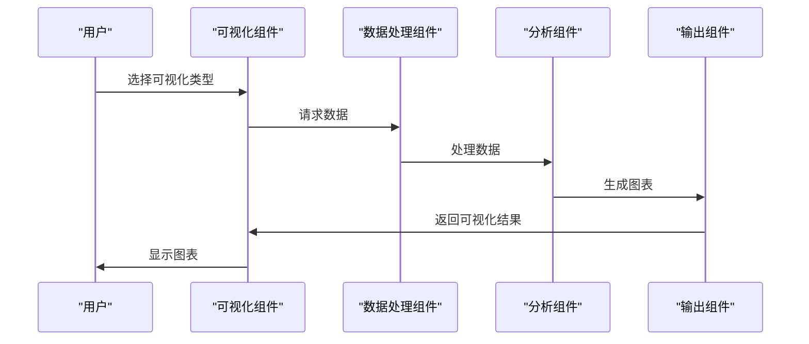
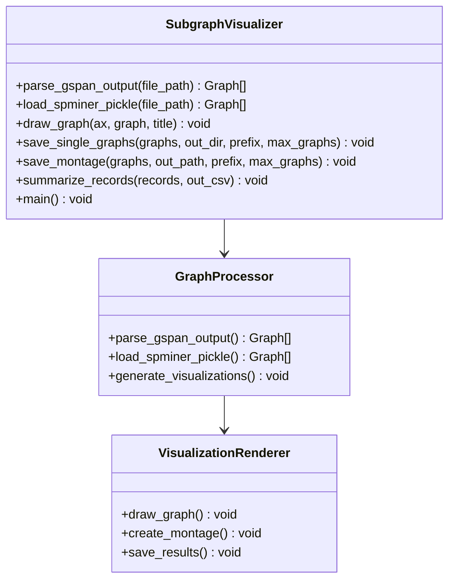
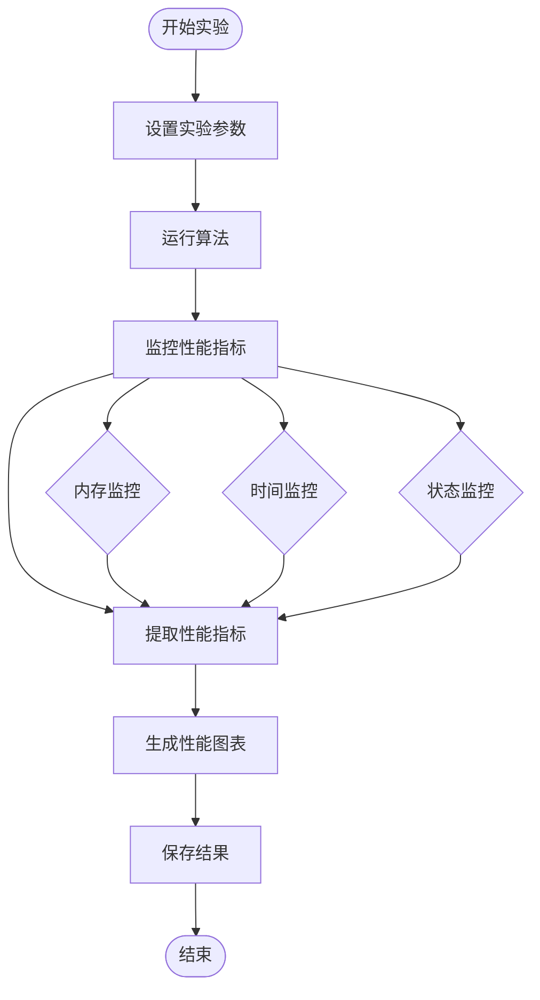
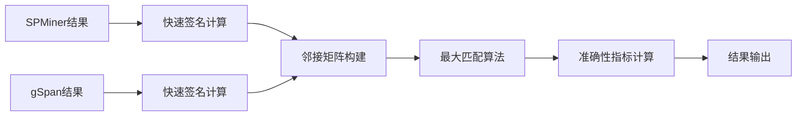
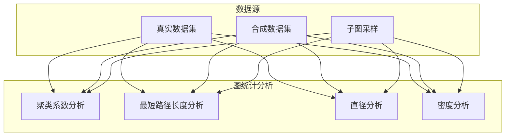
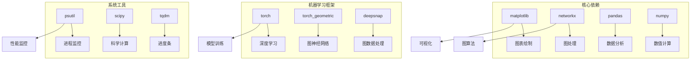
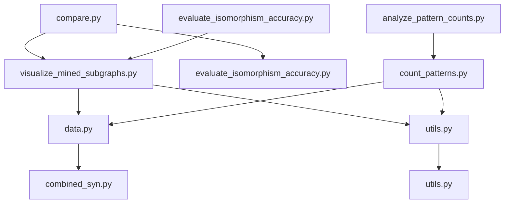

# 结果可视化工具

<cite>
**本文档引用的文件**
- [visualize_mined_subgraphs.py](file://compare/visualize_mined_subgraphs.py)
- [compare.py](file://compare/compare.py)
- [evaluate_isomorphism_accuracy.py](file://compare/evaluate_isomorphism_accuracy.py)
- [build_gspan_db.py](file://compare/build_gspan_db.py)
- [Visualize Graph Statistics.ipynb](file://analyze/Visualize%20Graph%20Statistics.ipynb)
- [analyze_pattern_counts.py](file://analyze/analyze_pattern_counts.py)
- [count_patterns.py](file://analyze/count_patterns.py)
- [data.py](file://common/data.py)
- [utils.py](file://common/utils.py)
- [combined_syn.py](file://common/combined_syn.py)
- [environment.yml](file://environment.yml)
- [run.sh](file://run.sh)
</cite>

## 目录
1. [简介](#简介)
2. [项目结构](#项目结构)
3. [核心组件](#核心组件)
4. [架构概览](#架构概览)
5. [详细组件分析](#详细组件分析)
6. [依赖关系分析](#依赖关系分析)
7. [性能考虑](#性能考虑)
8. [故障排除指南](#故障排除指南)
9. [结论](#结论)
10. [附录](#附录)

## 简介

结果可视化工具是一个专门用于模式挖掘结果可视化的综合系统，主要面向子图挖掘和图模式分析。该工具提供了多种可视化图表类型，包括子图显示、统计图表生成和结果展示，能够帮助用户深入理解和分析模式挖掘的结果。

该系统的核心功能包括：
- **子图可视化**：将挖掘到的频繁子图以图形化方式展示
- **统计图表生成**：生成各种统计图表来分析模式分布
- **性能对比可视化**：对比不同算法的运行时间和内存使用
- **准确性评估可视化**：评估模式挖掘的准确性指标

## 项目结构

项目采用模块化设计，主要分为以下几个核心模块：

**图表来源**
- [visualize_mined_subgraphs.py:1-191](file://compare/visualize_mined_subgraphs.py#L1-L191)
- [compare.py:1-612](file://compare/compare.py#L1-L612)

**章节来源**
- [visualize_mined_subgraphs.py:1-191](file://compare/visualize_mined_subgraphs.py#L1-L191)
- [compare.py:1-612](file://compare/compare.py#L1-L612)

## 核心组件

### 子图可视化组件

子图可视化组件是整个系统的核心，负责将挖掘到的频繁子图以图形化方式展示。该组件支持多种可视化模式：

- **单图显示**：将每个子图单独保存为PNG图像文件
- **拼贴图显示**：将多个子图组合在一个画布上进行展示
- **统计摘要**：生成详细的统计摘要报告

### 性能对比组件

性能对比组件用于对比不同算法（如SPMiner和gSpan）在相同数据集上的表现。该组件能够生成：

- **时间对比图**：展示不同算法的运行时间对比
- **内存占用图**：展示不同算法的内存使用情况
- **详细性能报告**：包含所有性能指标的CSV文件

### 准确性评估组件

准确性评估组件用于评估模式挖掘的准确性，主要通过同构匹配来计算精度、召回率和F1分数。

**章节来源**
- [visualize_mined_subgraphs.py:12-191](file://compare/visualize_mined_subgraphs.py#L12-L191)
- [compare.py:450-493](file://compare/compare.py#L450-L493)

## 架构概览

系统采用分层架构设计，各组件之间通过清晰的接口进行交互：

**图表来源**
- [visualize_mined_subgraphs.py:134-191](file://compare/visualize_mined_subgraphs.py#L134-L191)
- [compare.py:495-612](file://compare/compare.py#L495-L612)

系统的主要特点：
- **模块化设计**：每个组件都有明确的职责和接口
- **可扩展性**：支持添加新的可视化类型和分析方法
- **自动化程度高**：大部分流程可以自动完成
- **结果持久化**：所有可视化结果都会保存到磁盘

## 详细组件分析

### 子图可视化组件分析

#### 核心功能实现

子图可视化组件通过以下核心函数实现完整的可视化流程：

**图表来源**
- [visualize_mined_subgraphs.py:12-191](file://compare/visualize_mined_subgraphs.py#L12-L191)

#### 可视化图表类型

系统支持多种类型的可视化图表：

1. **单图显示图表**
   - 将每个子图单独保存为PNG文件
   - 自动设置合适的画布尺寸和分辨率
   - 包含节点数量和边数量的标题信息

2. **拼贴图显示图表**
   - 将多个子图组合在一个画布上
   - 自动计算网格布局
   - 支持限制显示的子图数量

3. **统计摘要图表**
   - 生成CSV格式的统计摘要
   - 包含算法名称、文件路径、统计信息等
   - 支持批量处理多个数据源

**章节来源**
- [visualize_mined_subgraphs.py:86-125](file://compare/visualize_mined_subgraphs.py#L86-L125)

### 性能对比组件分析

#### 性能监控机制

性能对比组件实现了全面的性能监控机制：

**图表来源**
- [compare.py:217-262](file://compare/compare.py#L217-L262)

#### 性能图表生成

系统能够生成两种主要的性能图表：

1. **时间对比图**
   - X轴：子图大小k（节点数）
   - Y轴：运行时间（秒）
   - 支持多规模图的对比分析
   - 自动标注不同规模的图

2. **内存占用图**
   - X轴：子图大小k（节点数）
   - Y轴：最大内存占用（MB）
   - 实时监控内存使用情况
   - 支持多算法的内存对比

**章节来源**
- [compare.py:450-493](file://compare/compare.py#L450-L493)

### 准确性评估组件分析

#### 同构匹配算法

准确性评估组件使用高效的同构匹配算法来比较不同算法的结果：

**图表来源**
- [evaluate_isomorphism_accuracy.py:66-101](file://compare/evaluate_isomorphism_accuracy.py#L66-L101)

#### 准确性指标计算

系统计算多种准确性指标：

1. **精度（Precision）**：正确匹配的模式数 / SPMiner检测到的模式总数
2. **召回率（Recall）**：正确匹配的模式数 / gSpan检测到的模式总数  
3. **F1分数**：2 × (精度 × 召回率) / (精度 + 召回率)
4. **Jaccard系数**：正确匹配的模式数 / (SPMiner模式数 + gSpan模式数 - 正确匹配数)

**章节来源**
- [evaluate_isomorphism_accuracy.py:103-135](file://compare/evaluate_isomorphism_accuracy.py#L103-L135)

### 统计分析组件分析

#### 图统计分析

统计分析组件提供了丰富的图统计分析功能：

**图表来源**
- [Visualize Graph Statistics.ipynb:1-162](file://analyze/Visualize%20Graph%20Statistics.ipynb#L1-L162)

#### 模式计数分析

模式计数分析组件提供了详细的模式分布统计：

1. **频率分布图**：展示不同大小模式的出现频率
2. **对数尺度分析**：使用对数坐标更好地显示分布
3. **百分位数分析**：计算25%和75%分位数
4. **统计摘要**：生成详细的统计摘要报告

**章节来源**
- [analyze_pattern_counts.py:18-80](file://analyze/analyze_pattern_counts.py#L18-L80)

## 依赖关系分析

### 外部依赖

系统依赖于多个Python库来实现各种功能：

**图表来源**
- [environment.yml:1-129](file://environment.yml#L1-L129)

### 内部依赖关系

系统内部组件之间的依赖关系如下：

**图表来源**
- [visualize_mined_subgraphs.py:1-10](file://compare/visualize_mined_subgraphs.py#L1-L10)
- [compare.py:1-14](file://compare/compare.py#L1-L14)

**章节来源**
- [environment.yml:93-128](file://environment.yml#L93-L128)

## 性能考虑

### 内存优化策略

系统采用了多种内存优化策略来处理大规模图数据：

1. **增量处理**：逐个处理子图而不是一次性加载所有数据
2. **缓存机制**：合理使用缓存来避免重复计算
3. **内存监控**：实时监控内存使用情况并及时释放不需要的资源
4. **批处理**：支持批量处理大量数据以提高效率

### 计算效率优化

为了提高计算效率，系统实现了以下优化：

1. **快速签名算法**：使用快速签名来加速同构匹配
2. **早期终止**：在不可能匹配的情况下提前终止计算
3. **并行处理**：利用多核CPU进行并行计算
4. **算法选择**：根据不同数据特点选择最优算法

### 可扩展性设计

系统具有良好的可扩展性：

1. **模块化设计**：每个组件都可以独立扩展和修改
2. **配置驱动**：通过配置文件控制各种行为
3. **插件机制**：支持添加新的可视化类型和分析方法
4. **批量处理**：支持大规模数据集的批量处理

## 故障排除指南

### 常见问题及解决方案

#### 图形显示问题

**问题**：图表无法正常显示或显示异常
**解决方案**：
1. 检查matplotlib后端配置
2. 确认图形库版本兼容性
3. 验证输出目录权限
4. 检查图像文件格式支持

#### 内存不足问题

**问题**：处理大型图时出现内存不足错误
**解决方案**：
1. 减少同时处理的图数量
2. 降低图像分辨率设置
3. 增加系统内存或使用64位Python
4. 分批处理大数据集

#### 性能问题

**问题**：算法运行速度过慢
**解决方案**：
1. 调整并行处理参数
2. 优化算法参数设置
3. 检查硬件性能瓶颈
4. 考虑使用GPU加速

### 调试技巧

1. **启用详细日志**：通过增加日志级别获取更多信息
2. **逐步调试**：使用断点逐步执行关键代码段
3. **性能分析**：使用性能分析工具识别瓶颈
4. **单元测试**：编写单元测试验证各个组件功能

**章节来源**
- [compare.py:217-262](file://compare/compare.py#L217-L262)

## 结论

结果可视化工具是一个功能完整、设计合理的模式挖掘结果可视化系统。该系统具有以下优势：

1. **功能全面**：涵盖了从子图显示到性能对比的各个方面
2. **易于使用**：提供了简单直观的命令行接口和配置选项
3. **高度可定制**：支持多种自定义选项来满足不同需求
4. **性能优秀**：采用了多种优化策略来处理大规模数据
5. **扩展性强**：模块化设计便于功能扩展和维护

该工具特别适合用于：
- 子图挖掘算法的性能评估
- 模式发现结果的可视化分析
- 不同算法间的对比研究
- 图数据统计分析和探索

## 附录

### 安装和配置

系统使用Conda环境管理，主要依赖包括：
- Python 3.10+
- NetworkX 3.4.2
- Matplotlib 3.10.8
- Pandas 2.3.3
- NumPy 2.2.6
- PyTorch 2.11.0
- Torch Geometric 2.7.0

### 使用示例

基本使用流程：
1. 准备数据文件
2. 运行可视化脚本
3. 查看生成的图表
4. 分析结果并得出结论

### 自定义选项

系统提供了丰富的自定义选项：
- 图像分辨率和尺寸设置
- 颜色主题和样式配置
- 输出格式和质量控制
- 性能监控参数调整
- 算法参数优化