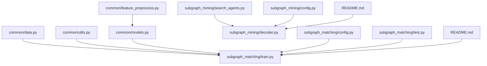
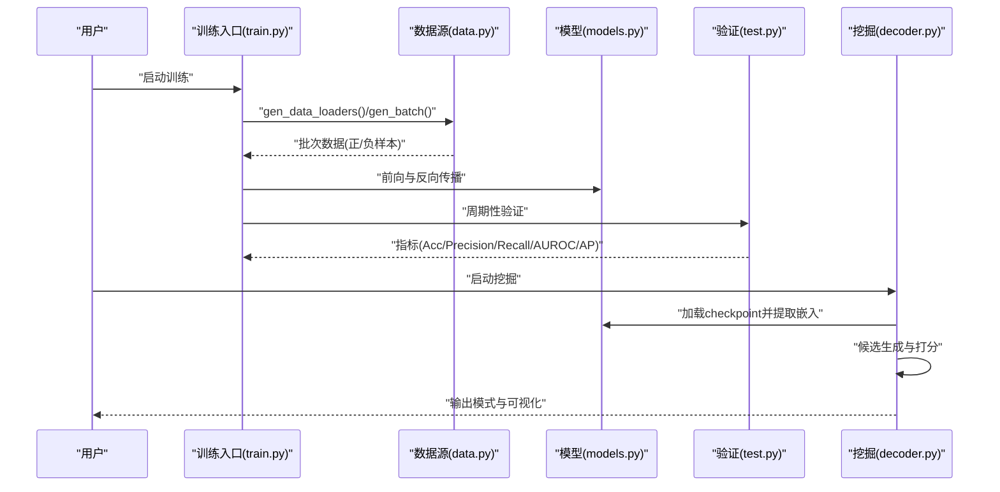
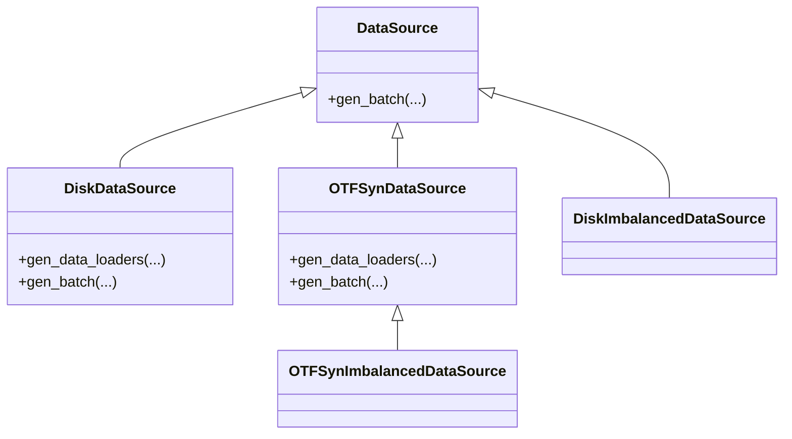
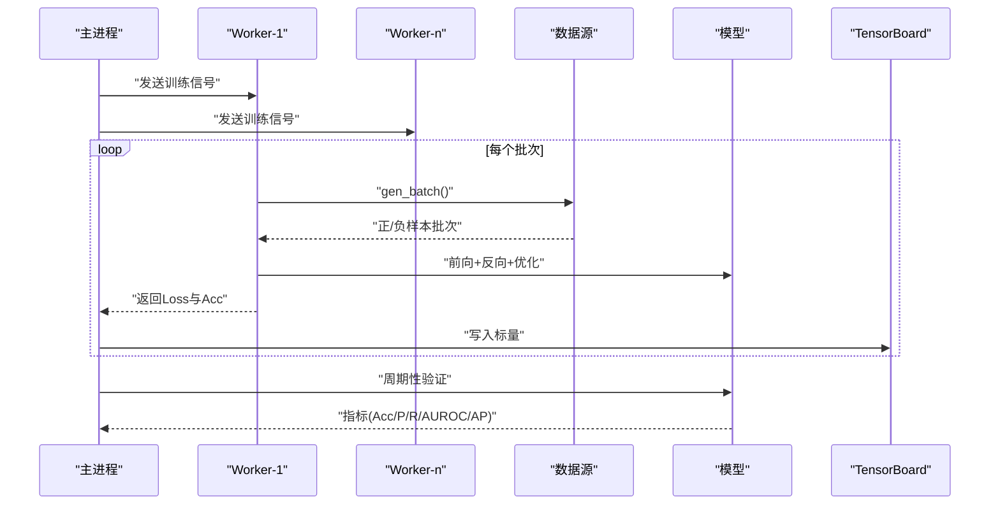
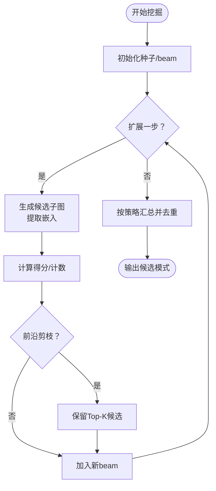
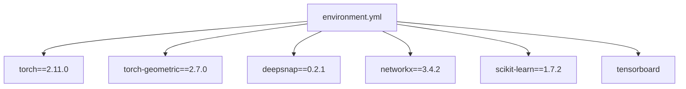

# 故障排除指南

<cite>
**本文档引用的文件**
- [README.md](file://README.md)
- [environment.yml](file://environment.yml)
- [run.sh](file://run.sh)
- [common/data.py](file://common/data.py)
- [common/utils.py](file://common/utils.py)
- [common/models.py](file://common/models.py)
- [common/feature_preprocess.py](file://common/feature_preprocess.py)
- [subgraph_matching/train.py](file://subgraph_matching/train.py)
- [subgraph_matching/test.py](file://subgraph_matching/test.py)
- [subgraph_matching/config.py](file://subgraph_matching/config.py)
- [subgraph_mining/config.py](file://subgraph_mining/config.py)
- [subgraph_mining/search_agents.py](file://subgraph_mining/search_agents.py)
- [compare/README.md](file://compare/README.md)
</cite>

## 目录
1. [简介](#简介)
2. [项目结构](#项目结构)
3. [核心组件](#核心组件)
4. [架构总览](#架构总览)
5. [详细组件分析](#详细组件分析)
6. [依赖分析](#依赖分析)
7. [性能考量](#性能考量)
8. [故障排除指南](#故障排除指南)
9. [结论](#结论)
10. [附录](#附录)

## 简介
本指南聚焦于SPMiner项目的安装、运行与性能问题排查，涵盖常见错误定位方法、日志与错误追踪技巧、内存与GPU资源限制应对、数据格式错误处理，以及性能优化建议与社区支持渠道。内容基于仓库中的源码与文档，帮助用户快速定位并解决实际工程问题。

## 项目结构
SPMiner采用模块化组织，核心模块包括：
- common：数据源、模型、特征预处理与通用工具
- subgraph_matching：子图匹配训练与验证
- subgraph_mining：频繁子图挖掘与搜索代理
- analyze：嵌入分析、模式统计与可视化
- compare：与gSpan等方法的对比实验

**图表来源**
- [common/data.py:1-447](file://common/data.py#L1-L447)
- [subgraph_matching/train.py:1-253](file://subgraph_matching/train.py#L1-L253)
- [subgraph_mining/search_agents.py:1-442](file://subgraph_mining/search_agents.py#L1-L442)
- [subgraph_mining/config.py:1-65](file://subgraph_mining/config.py#L1-L65)
- [subgraph_matching/config.py:1-82](file://subgraph_matching/config.py#L1-L82)
- [README.md:30-62](file://README.md#L30-L62)

**章节来源**
- [README.md:30-62](file://README.md#L30-L62)

## 核心组件
- 数据源与加载：支持真实数据集与在线合成数据，提供平衡/不平衡采样与锚定节点功能
- 模型与训练：支持多种GNN卷积类型与任务头，具备多进程训练与验证
- 挖掘与搜索：基于嵌入空间的贪心与MCTS搜索策略，支持前沿剪枝与模式去重
- 特征预处理：节点度、介数中心性、路径长、PageRank、聚类系数等特征增强
- 工具与日志：设备选择、优化器与学习率调度、TensorBoard日志记录

**章节来源**
- [common/data.py:21-354](file://common/data.py#L21-L354)
- [common/models.py:22-226](file://common/models.py#L22-L226)
- [common/feature_preprocess.py:71-229](file://common/feature_preprocess.py#L71-L229)
- [subgraph_matching/train.py:49-253](file://subgraph_matching/train.py#L49-L253)
- [subgraph_mining/search_agents.py:14-442](file://subgraph_mining/search_agents.py#L14-L442)

## 架构总览
训练与挖掘的总体流程如下：

**图表来源**
- [subgraph_matching/train.py:91-222](file://subgraph_matching/train.py#L91-L222)
- [common/data.py:77-354](file://common/data.py#L77-L354)
- [common/models.py:46-99](file://common/models.py#L46-L99)
- [subgraph_matching/test.py:11-118](file://subgraph_matching/test.py#L11-L118)
- [subgraph_mining/search_agents.py:54-67](file://subgraph_mining/search_agents.py#L54-L67)

## 详细组件分析

### 数据源与数据加载
- 支持TUDataset、PPI、QM9等真实数据集，以及Facebook/AS-733等SNAP数据
- 提供DiskDataSource、OTFSynDataSource、Imbalanced变体，支持锚定节点与前沿剪枝
- 通过DeepSNAP Batch与DataLoader进行高效批处理

**图表来源**
- [common/data.py:77-354](file://common/data.py#L77-L354)

**章节来源**
- [common/data.py:21-354](file://common/data.py#L21-L354)

### 训练与验证流程
- 多进程worker并行生成训练步，主进程负责优化与日志
- 支持多种优化器与学习率调度策略，自动记录TensorBoard指标
- 验证阶段计算准确率、精确率、召回率、AUROC与平均精度

**图表来源**
- [subgraph_matching/train.py:91-222](file://subgraph_matching/train.py#L91-L222)
- [subgraph_matching/test.py:11-118](file://subgraph_matching/test.py#L11-L118)

**章节来源**
- [subgraph_matching/train.py:91-222](file://subgraph_matching/train.py#L91-L222)
- [subgraph_matching/test.py:11-118](file://subgraph_matching/test.py#L11-L118)

### 挖掘与搜索策略
- 贪心搜索：基于候选扩展分数进行beam搜索，支持计数/margin混合策略
- MCTS搜索：使用UCT准则在嵌入空间中探索高频模式，支持前沿剪枝
- 模式去重：基于WL哈希对同构/近似同构模式进行聚类与去重

**图表来源**
- [subgraph_mining/search_agents.py:284-441](file://subgraph_mining/search_agents.py#L284-L441)

**章节来源**
- [subgraph_mining/search_agents.py:14-441](file://subgraph_mining/search_agents.py#L14-L441)

### 模型与特征预处理
- 支持SkipLastGNN编码器与多种卷积类型（SAGE/GCN/GIN/GAT/PNA等）
- 特征增强：节点度、介数中心性、路径长、PageRank、聚类系数、motif计数等
- 设备选择：优先CUDA，否则CPU

**章节来源**
- [common/models.py:101-226](file://common/models.py#L101-L226)
- [common/feature_preprocess.py:71-229](file://common/feature_preprocess.py#L71-L229)
- [common/utils.py:235-243](file://common/utils.py#L235-L243)

## 依赖分析
- 环境与依赖：Python 3.10、PyTorch、PyTorch Geometric、DeepSNAP、NetworkX、NumPy/SciPy、scikit-learn、Matplotlib、TensorBoard
- Conda环境配置与包版本在environment.yml中给出，需注意PyG相关包与CUDA版本匹配

**图表来源**
- [environment.yml:1-129](file://environment.yml#L1-L129)

**章节来源**
- [environment.yml:1-129](file://environment.yml#L1-L129)
- [README.md:75-121](file://README.md#L75-L121)

## 性能考量
- 批大小与内存：增大batch_size会显著提升显存占用，建议从较小值开始逐步调优
- 搜索参数：n_neighborhoods、n_trials、batch_size对挖掘速度影响最大，可按需降低
- 前沿剪枝：frontier_top_k可减少候选扩展数量，提高搜索效率
- 设备选择：优先使用GPU；若显存不足，可切换CPU或减小批大小
- 特征增强：启用motif计数等高维特征会增加计算与内存开销

[本节为通用性能建议，无需特定文件引用]

## 故障排除指南

### 一、安装与环境问题
- 症状：导入torch、torch_geometric、deepsnap或networkx失败
  - 排查要点：确认已激活正确conda环境；检查Python版本为3.10；PyG相关包需与当前torch/CUDA版本匹配
  - 解决方案：参考README的推荐安装顺序，必要时按PyG官方说明安装对应wheel
- 症状：提示找不到tensorboard
  - 排查要点：训练脚本导入SummaryWriter
  - 解决方案：安装tensorboard后重试
- 症状：Facebook/AS-733数据集报文件不存在
  - 排查要点：确认data/目录下存在对应边列表文件
  - 解决方案：下载并放置相应文件至data/目录

**章节来源**
- [README.md:113-121](file://README.md#L113-L121)
- [README.md:340-362](file://README.md#L340-L362)

### 二、运行时错误与日志分析
- 训练阶段
  - 症状：多进程训练卡住或崩溃
    - 排查要点：检查n_workers与系统资源；确认数据源gen_batch返回的Batch对象有效；核对设备选择
    - 日志与追踪：观察TensorBoard曲线与控制台输出；逐步缩小参数范围（减小batch_size、n_batches、eval_interval）
  - 症状：显存不足(OOM)
    - 排查要点：当前设备为CUDA时，显存不足会导致OOM
    - 解决方案：减小batch_size、n_layers或hidden_dim；关闭不必要的特征增强；切换CPU运行
- 验证阶段
  - 症状：验证指标异常（如NaN/Inf）
    - 排查要点：检查标签与预测形状一致性；确认模型predict/criterion实现正确
    - 解决方案：打印部分批次的pred与label，定位异常样本
- 挖掘阶段
  - 症状：挖掘速度过慢
    - 排查要点：n_neighborhoods、n_trials、batch_size过大
    - 解决方案：降低上述参数；启用frontier_top_k剪枝；使用较小min/max_pattern_size

**章节来源**
- [subgraph_matching/train.py:91-222](file://subgraph_matching/train.py#L91-L222)
- [subgraph_matching/test.py:11-118](file://subgraph_matching/test.py#L11-L118)
- [subgraph_mining/config.py:14-59](file://subgraph_mining/config.py#L14-L59)

### 三、数据格式与输入问题
- 症状：SNAP边列表文件格式错误或注释行导致读取异常
  - 排查要点：确认边列表每行至少包含两个节点ID；忽略空行与以#开头的注释
  - 解决方案：修正文件格式；确保最大连通子图非空
- 症状：图数据类型不匹配（NetworkX与PyG）
  - 排查要点：确认Batch.from_data_list与DSGraph转换流程；检查节点特征维度
  - 解决方案：使用utils.batch_nx_graphs进行统一转换；确保节点特征张量化

**章节来源**
- [common/utils.py:208-233](file://common/utils.py#L208-L233)
- [common/utils.py:286-301](file://common/utils.py#L286-L301)
- [common/data.py:114-214](file://common/data.py#L114-L214)

### 四、性能优化建议
- 批处理大小调整
  - 从较小batch_size起步，逐步增大；若显存不足，优先降低batch_size
- 模型参数优化
  - 减小n_layers与hidden_dim；关闭motif计数等高维特征增强
- 硬件配置建议
  - 使用GPU运行；若显存受限，可临时切换CPU；合理设置n_workers
- 搜索策略优化
  - 降低n_neighborhoods、n_trials与batch_size；启用frontier_top_k剪枝；缩短pattern范围

**章节来源**
- [subgraph_mining/config.py:24-59](file://subgraph_mining/config.py#L24-L59)
- [subgraph_mining/search_agents.py:121-127](file://subgraph_mining/search_agents.py#L121-L127)
- [subgraph_matching/config.py:55-77](file://subgraph_matching/config.py#L55-L77)

### 五、调试技巧与日志追踪
- 控制台输出：训练循环会打印每批次Loss与Acc，便于快速定位收敛问题
- TensorBoard：训练期间记录Loss与Accuracy等标量，便于可视化趋势
- 验证指标：AUROC与AP可用于评估模型判别能力；PR曲线可保存至plots/
- 嵌入分析：可使用analyze模块对embedding进行统计与可视化

**章节来源**
- [subgraph_matching/train.py:210-216](file://subgraph_matching/train.py#L210-L216)
- [subgraph_matching/test.py:98-118](file://subgraph_matching/test.py#L98-L118)
- [README.md:283-307](file://README.md#L283-L307)

### 六、社区支持与问题反馈
- 仓库提供了与gSpan对比的分析目录，便于扩展实验与结果对比
- 如需进一步交流，可在仓库内提交Issue或PR，遵循贡献说明

**章节来源**
- [compare/README.md:1-34](file://compare/README.md#L1-L34)

## 结论
通过本指南，用户可以系统地定位与解决SPMiner在安装、运行与性能方面的常见问题。建议从环境验证与最小化参数开始，逐步扩大规模；遇到性能瓶颈时优先从批大小、搜索参数与特征增强入手；利用TensorBoard与验证指标进行持续监控与优化。

## 附录
- 快速开始命令参考
  - 训练：python -m subgraph_matching.train --node_anchored
  - 评估：python -m subgraph_matching.test --node_anchored
  - 挖掘：python -m subgraph_mining.decoder --dataset=enzymes --node_anchored

**章节来源**
- [README.md:129-163](file://README.md#L129-L163)
- [run.sh:1-2](file://run.sh#L1-L2)