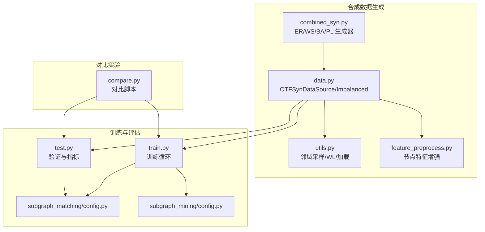
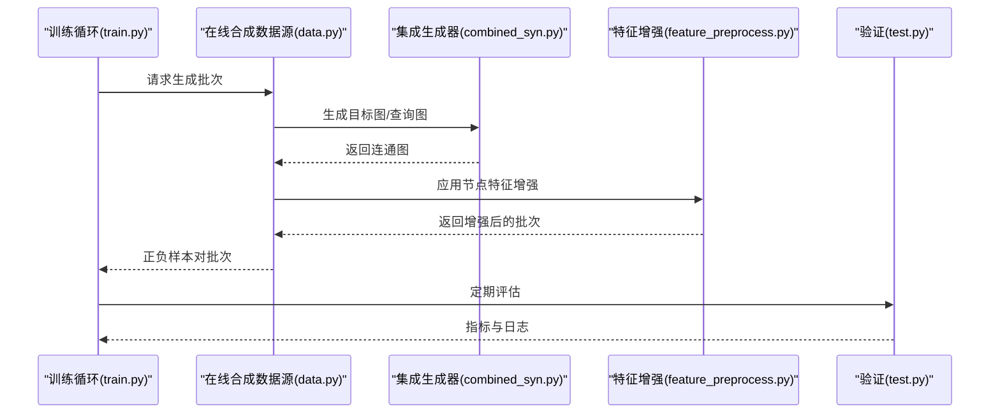
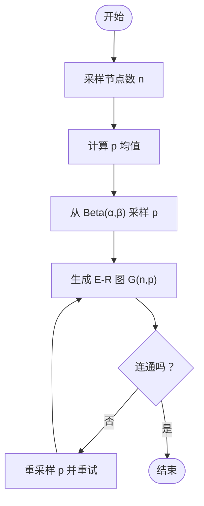
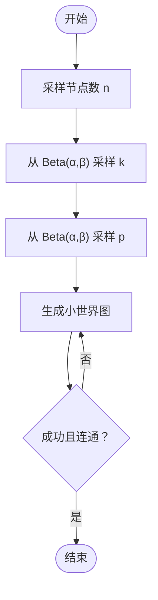
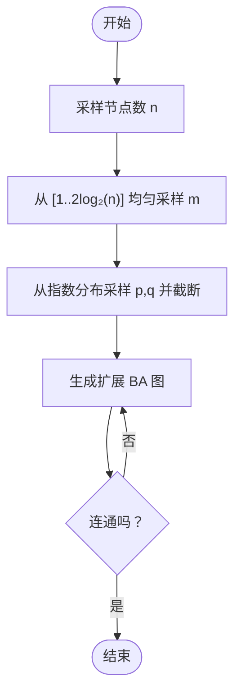
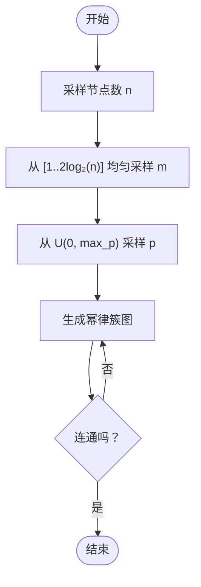
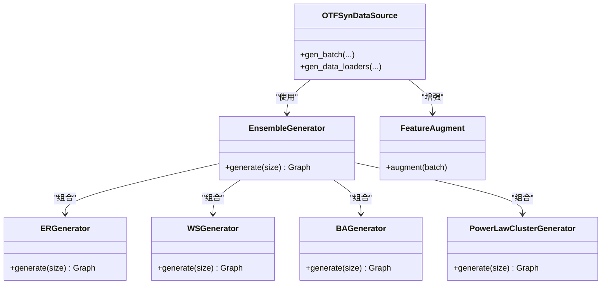
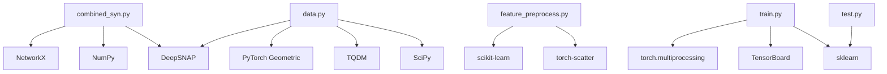

# 合成数据生成器

<cite>
**本文引用的文件**
- [combined_syn.py](file://common/combined_syn.py)
- [data.py](file://common/data.py)
- [utils.py](file://common/utils.py)
- [feature_preprocess.py](file://common/feature_preprocess.py)
- [config.py（子图匹配）](file://subgraph_matching/config.py)
- [config.py（子图挖掘）](file://subgraph_mining/config.py)
- [train.py（子图匹配）](file://subgraph_matching/train.py)
- [test.py（子图匹配）](file://subgraph_matching/test.py)
- [compare.py](file://compare/compare.py)
- [run.sh](file://run.sh)
</cite>

## 目录
1. [简介](#简介)
2. [项目结构](#项目结构)
3. [核心组件](#核心组件)
4. [架构总览](#架构总览)
5. [详细组件分析](#详细组件分析)
6. [依赖分析](#依赖分析)
7. [性能考量](#性能考量)
8. [故障排查指南](#故障排查指南)
9. [结论](#结论)
10. [附录](#附录)

## 简介
本文件面向 SPMiner 的合成数据生成器，系统化阐述组合式合成图生成算法、质量控制机制、配置选项、使用场景与验证方法，并提供参数调优建议与具体示例。合成数据生成器基于多种经典图模型（Erdős–Rényi、Watts–Strogatz、Barabási–Albert 扩展模型、幂律簇模型），通过集成生成器动态产出满足不同拓扑特性的图，用于子图匹配与模体挖掘任务的训练与评测。

## 项目结构
围绕合成数据生成器的关键文件与职责如下：
- common/combined_syn.py：定义四类图生成器与集成生成器工厂，负责按规模与分布生成连通图。
- common/data.py：定义数据源抽象与在线合成数据源，负责从生成器采样正负样本对，构造批次并应用特征增强。
- common/utils.py：提供邻域采样、WL 标签、图加载等通用工具，支撑数据源与评估流程。
- common/feature_preprocess.py：节点特征增强模块，为生成图附加节点度、介数中心性、路径长度、PageRank、聚类系数等特征。
- subgraph_matching/config.py 与 subgraph_mining/config.py：分别定义子图匹配与子图挖掘阶段的参数接口与默认值。
- subgraph_matching/train.py 与 test.py：训练与评估流程，使用合成数据源生成批次并进行模型训练与验证。
- compare/compare.py：对比实验脚本，支持与 gSpan 等工具的公平对比，可作为合成数据使用场景的参考。
- run.sh：训练入口脚本。

图表来源
- [combined_syn.py:101-117](file://common/combined_syn.py#L101-L117)
- [data.py:81-214](file://common/data.py#L81-L214)
- [utils.py:18-53](file://common/utils.py#L18-L53)
- [feature_preprocess.py:71-192](file://common/feature_preprocess.py#L71-L192)
- [train.py:61-89](file://subgraph_matching/train.py#L61-L89)
- [test.py:11-75](file://subgraph_matching/test.py#L11-L75)
- [compare.py:16-125](file://compare/compare.py#L16-L125)

章节来源
- [combined_syn.py:101-117](file://common/combined_syn.py#L101-L117)
- [data.py:81-214](file://common/data.py#L81-L214)
- [utils.py:18-53](file://common/utils.py#L18-L53)
- [feature_preprocess.py:71-192](file://common/feature_preprocess.py#L71-L192)
- [train.py:61-89](file://subgraph_matching/train.py#L61-L89)
- [test.py:11-75](file://subgraph_matching/test.py#L11-L75)
- [compare.py:16-125](file://compare/compare.py#L16-L125)

## 核心组件
- 四类图生成器
  - ERGenerator：基于 E-R 随机图模型，连接概率 p 由 Beta 分布采样，保证连通性。
  - WSGenerator：基于 Watts–Strogatz 小世界模型，k 与重连概率 p 由 Beta 分布采样，保证连通性。
  - BAGenerator：基于 Barabási–Albert 扩展模型，m、p、q 由指数与均匀分布采样，保证连通性。
  - PowerLawClusterGenerator：基于幂律簇模型，m 由均匀分布采样，三角形概率 p 由均匀分布采样，保证连通性。
- 集成生成器工厂：将四类生成器组合为 EnsembleGenerator，按指定规模范围生成图。
- 在线合成数据源：OTFSynDataSource/OTFSynImbalancedDataSource，从生成器采样正负样本对，构造批次并应用特征增强。
- 特征增强：为节点附加度、介数中心性、路径长度、PageRank、聚类系数等特征，提升模型可判别性。

章节来源
- [combined_syn.py:9-100](file://common/combined_syn.py#L9-L100)
- [combined_syn.py:101-117](file://common/combined_syn.py#L101-L117)
- [data.py:81-214](file://common/data.py#L81-L214)
- [feature_preprocess.py:71-192](file://common/feature_preprocess.py#L71-L192)

## 架构总览
合成数据生成器在训练与评估流程中的位置如下：

图表来源
- [train.py:106-150](file://subgraph_matching/train.py#L106-L150)
- [data.py:114-214](file://common/data.py#L114-L214)
- [combined_syn.py:101-117](file://common/combined_syn.py#L101-L117)
- [feature_preprocess.py:186-192](file://common/feature_preprocess.py#L186-L192)
- [test.py:11-75](file://subgraph_matching/test.py#L11-L75)

## 详细组件分析

### 组件A：ERGenerator（Erdős–Rényi 随机图）
- 生成策略
  - 节点数由规模范围采样；连接概率 p 由 Beta 分布采样，均值与形状参数随节点数自适应调整。
  - 当生成的图不连通时，持续重采样直至连通。
- 参数与分布
  - p_alpha 控制 Beta 分布形状，决定平均连接概率与密度。
  - 均值与 beta 形状参数由节点数与 p_alpha 计算得到，确保随着规模增大密度适配。
- 质量控制
  - 连通性检查：若不连通则重试，保证输出图为连通图。
- 复杂度
  - 单次生成复杂度近似 O(n^2)，受连接概率影响；连通性重试期望次数有限。

图表来源
- [combined_syn.py:14-28](file://common/combined_syn.py#L14-L28)

章节来源
- [combined_syn.py:9-28](file://common/combined_syn.py#L9-L28)

### 组件B：WSGenerator（Watts–Strogatz 小世界）
- 生成策略
  - k 由 Beta 分布采样，表示每个节点初始环形连接数；重连概率 p 由 Beta 分布采样。
  - 通过 connected_watts_strogatz_graph 生成连通小世界图，失败则重试。
- 参数与分布
  - density_alpha 控制 k 的分布；rewire_alpha/rewire_beta 控制重连概率 p。
- 质量控制
  - 异常捕获与重试，保证连通性。
- 复杂度
  - 生成复杂度与 k 和重连概率相关，整体近似 O(n·k)。

图表来源
- [combined_syn.py:38-59](file://common/combined_syn.py#L38-L59)

章节来源
- [combined_syn.py:30-59](file://common/combined_syn.py#L30-L59)

### 组件C：BAGenerator（Barabási–Albert 扩展）
- 生成策略
  - m 由离散均匀采样；p、q 由指数分布截断至上限，形成扩展 BA 模型。
  - 通过 extended_barabasi_albert_graph 生成，若不连通则重试。
- 参数与分布
  - max_p/max_q 限制 p、q 上界，避免过度稠密。
- 质量控制
  - 连通性检查与重试。
- 复杂度
  - 生成复杂度与 m 成正比，整体近似 O(n·m)。

图表来源
- [combined_syn.py:67-80](file://common/combined_syn.py#L67-L80)

章节来源
- [combined_syn.py:61-80](file://common/combined_syn.py#L61-L80)

### 组件D：PowerLawClusterGenerator（幂律簇）
- 生成策略
  - m 由均匀分布采样；三角形概率 p 由均匀分布采样，生成幂律簇图。
  - 不连通则重试。
- 参数与分布
  - max_triangle_prob 控制三角形生成概率上限。
- 质量控制
  - 连通性检查与重试。
- 复杂度
  - 生成复杂度与 m 和 p 相关，整体近似 O(n·m)。

图表来源
- [combined_syn.py:87-99](file://common/combined_syn.py#L87-L99)

章节来源
- [combined_syn.py:82-99](file://common/combined_syn.py#L82-L99)

### 组件E：集成生成器与数据源
- 集成生成器工厂
  - 将 ER、WS、BA、PLC 四类生成器组合为 EnsembleGenerator，按规模范围生成图。
- 在线合成数据源
  - OTFSynDataSource：按规模范围在线生成正负样本对，支持节点锚定与困难负例策略。
  - OTFSynImbalancedDataSource：不平衡场景，随机采样两图并判断子图关系，构造不平衡正负样本。
- 特征增强
  - FeatureAugment：为节点附加度、介数中心性、路径长度、PageRank、聚类系数等特征，提升判别能力。

图表来源
- [combined_syn.py:101-117](file://common/combined_syn.py#L101-L117)
- [data.py:81-214](file://common/data.py#L81-L214)
- [feature_preprocess.py:71-192](file://common/feature_preprocess.py#L71-L192)

章节来源
- [combined_syn.py:101-117](file://common/combined_syn.py#L101-L117)
- [data.py:81-214](file://common/data.py#L81-L214)
- [feature_preprocess.py:71-192](file://common/feature_preprocess.py#L71-L192)

## 依赖分析
- 生成器依赖
  - NetworkX：生成各类随机图与连通性检查。
  - NumPy：Beta、指数、均匀分布采样与数学运算。
  - DeepSNAP：Generator/EnsembleGenerator/GraphDataset/Transform。
- 数据源依赖
  - PyTorch Geometric：图数据转换与批处理。
  - TQDM：进度条显示。
  - SciPy：离散分布采样。
- 特征增强依赖
  - scikit-learn：TSNE（注释）。
  - torch-scatter：稀疏矩阵运算。
- 训练与评估依赖
  - 多进程：torch.multiprocessing。
  - TensorBoard：日志记录。
  - sklearn：指标计算。

图表来源
- [combined_syn.py:3-7](file://common/combined_syn.py#L3-L7)
- [data.py:5-15](file://common/data.py#L5-L15)
- [feature_preprocess.py:1-22](file://common/feature_preprocess.py#L1-L22)
- [train.py:24-37](file://subgraph_matching/train.py#L24-L37)
- [test.py:1-7](file://subgraph_matching/test.py#L1-L7)

章节来源
- [combined_syn.py:3-7](file://common/combined_syn.py#L3-L7)
- [data.py:5-15](file://common/data.py#L5-L15)
- [feature_preprocess.py:1-22](file://common/feature_preprocess.py#L1-L22)
- [train.py:24-37](file://subgraph_matching/train.py#L24-L37)
- [test.py:1-7](file://subgraph_matching/test.py#L1-L7)

## 性能考量
- 生成复杂度
  - E-R：O(n^2·p)，连通性重试期望有限。
  - 小世界：O(n·k)，k 与重连概率影响生成成本。
  - 扩展 BA：O(n·m)，m 控制增长速度。
  - 幂律簇：O(n·m)，三角形概率影响边生成。
- 内存与吞吐
  - Online 生成：按需生成，避免持久化大图集合，适合大规模训练。
  - 特征增强：节点特征维度可配置，注意内存占用与前向开销。
- 并行与分布式
  - 训练侧支持多进程与分布式采样，提高吞吐。
- 调优建议
  - 调整规模范围与密度参数，使生成图与下游任务相匹配。
  - 合理设置节点锚定与困难负例比例，提升模型鲁棒性。

[本节为通用性能讨论，无需特定文件来源]

## 故障排查指南
- 连通性问题
  - 症状：生成图非连通导致训练中断或批次为空。
  - 排查：确认生成器的连通性检查与重试逻辑是否生效；适当增大规模或调整密度参数。
- 分布采样异常
  - 症状：Beta/指数/均匀分布采样导致极端密度或 m 值。
  - 排查：检查 p_alpha、density_alpha、max_p/max_q 等参数边界；必要时增加截断或重采样次数。
- 特征维度不匹配
  - 症状：特征增强后节点特征维度与模型不兼容。
  - 排查：核对 FEATURE_AUGMENT 与 FEATURE_AUGMENT_DIMS 的配置；确保维度整除关系满足要求。
- 训练不稳定
  - 症状：AUROC/AP 波动大或收敛慢。
  - 排查：检查数据源的不平衡比例、困难负例策略与锚定设置；调整学习率与优化器配置。

章节来源
- [combined_syn.py:23-25](file://common/combined_syn.py#L23-L25)
- [combined_syn.py:54-56](file://common/combined_syn.py#L54-L56)
- [feature_preprocess.py:118-126](file://common/feature_preprocess.py#L118-L126)
- [train.py:100-133](file://subgraph_matching/train.py#L100-L133)

## 结论
SPMiner 的合成数据生成器通过组合四类经典图模型，结合连通性质量控制与特征增强，为子图匹配与模体挖掘提供了高可控、高多样性的训练数据。其在线生成与分布式训练能力，使其适用于大规模、多尺度的图学习任务。合理配置规模范围、密度参数与特征维度，可显著提升模型性能与泛化能力。

[本节为总结性内容，无需特定文件来源]

## 附录

### A. 配置选项与参数说明
- 生成器参数
  - p_alpha（ERGenerator）：控制 E-R 连接概率 Beta 分布形状，影响平均密度。
  - density_alpha/rewire_alpha/rewire_beta（WSGenerator）：控制 k 与重连概率分布。
  - max_p/max_q（BAGenerator）：限制扩展 BA 的 p、q 上界。
  - max_triangle_prob（PowerLawClusterGenerator）：限制三角形生成概率。
- 数据源参数
  - min_size/max_size：在线生成图规模范围。
  - node_anchored：是否启用节点锚定，影响锚点特征注入与匹配约束。
  - n_workers/max_queue_size：训练并行与队列容量。
- 训练与评估参数
  - batch_size/n_layers/hidden_dim/dropout/margin/opt_scheduler/lr 等，详见子图匹配配置。
  - 子图挖掘阶段的半径、邻域采样数、输出批次大小等，详见子图挖掘配置。

章节来源
- [combined_syn.py:10-12](file://common/combined_syn.py#L10-L12)
- [combined_syn.py:31-36](file://common/combined_syn.py#L31-L36)
- [combined_syn.py:62-65](file://common/combined_syn.py#L62-L65)
- [combined_syn.py:83-85](file://common/combined_syn.py#L83-L85)
- [data.py:89-96](file://common/data.py#L89-L96)
- [subgraph_matching/config.py:18-77](file://subgraph_matching/config.py#L18-L77)
- [subgraph_mining/config.py:14-59](file://subgraph_mining/config.py#L14-L59)

### B. 使用场景与验证方法
- 使用场景
  - 子图匹配训练：使用 OTFSynDataSource/OTFSynImbalancedDataSource 在线生成正负样本对。
  - 模体挖掘：在子图挖掘阶段使用生成器或真实数据集，结合对比实验脚本进行公平对比。
- 验证方法
  - 同构性测试：利用 GraphMatcher 判断子图关系，评估正负样本标签正确性。
  - 统计特性分析：计算平均聚类系数、平均最短路径长度等，与真实数据集对比。
  - 指标评估：AUROC、AP、精度/召回等，见验证脚本。

章节来源
- [data.py:170-178](file://common/data.py#L170-L178)
- [data.py:244-269](file://common/data.py#L244-L269)
- [test.py:11-75](file://subgraph_matching/test.py#L11-L75)
- [compare.py:16-125](file://compare/compare.py#L16-L125)

### C. 生成示例与参数调优
- 示例
  - 在线生成：通过 get_dataset 与 get_generator 创建合成数据集，按规模范围生成图。
  - 训练入口：使用 run.sh 启动训练，或直接运行训练脚本。
- 调优建议
  - 从小规模开始，逐步扩大规模范围，观察 AUROC/AP 变化。
  - 调整密度参数与困难负例比例，缓解类别不平衡带来的偏差。
  - 启用节点锚定以增强锚点一致性，提升匹配稳定性。

章节来源
- [combined_syn.py:119-133](file://common/combined_syn.py#L119-L133)
- [run.sh:1-2](file://run.sh#L1-L2)
- [train.py:152-200](file://subgraph_matching/train.py#L152-L200)