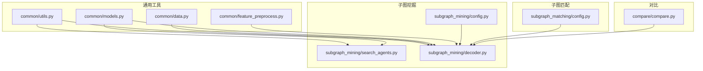
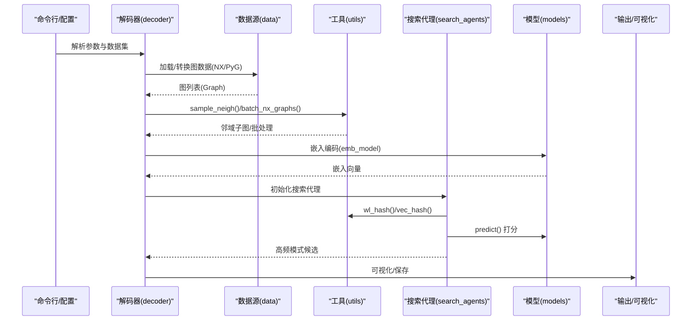
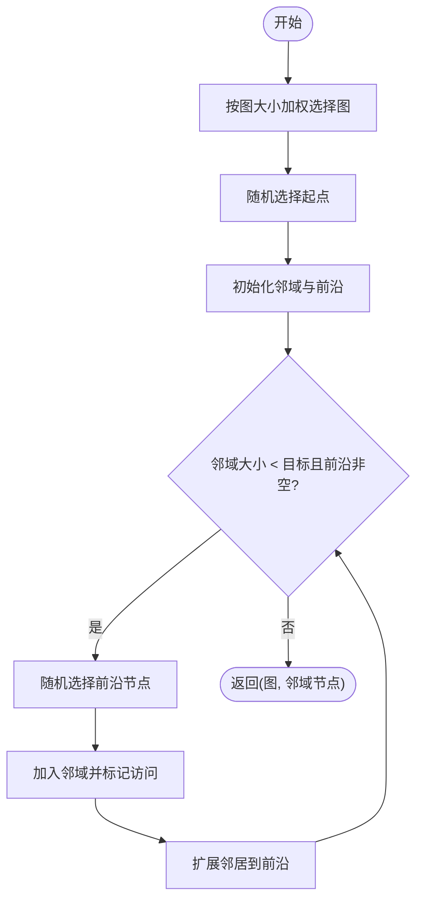
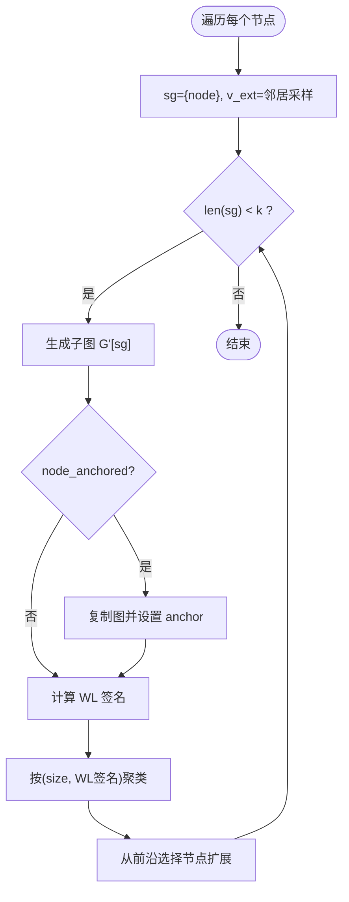
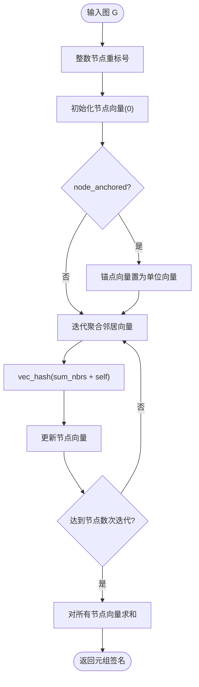
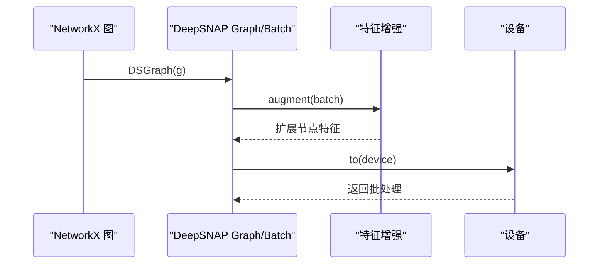
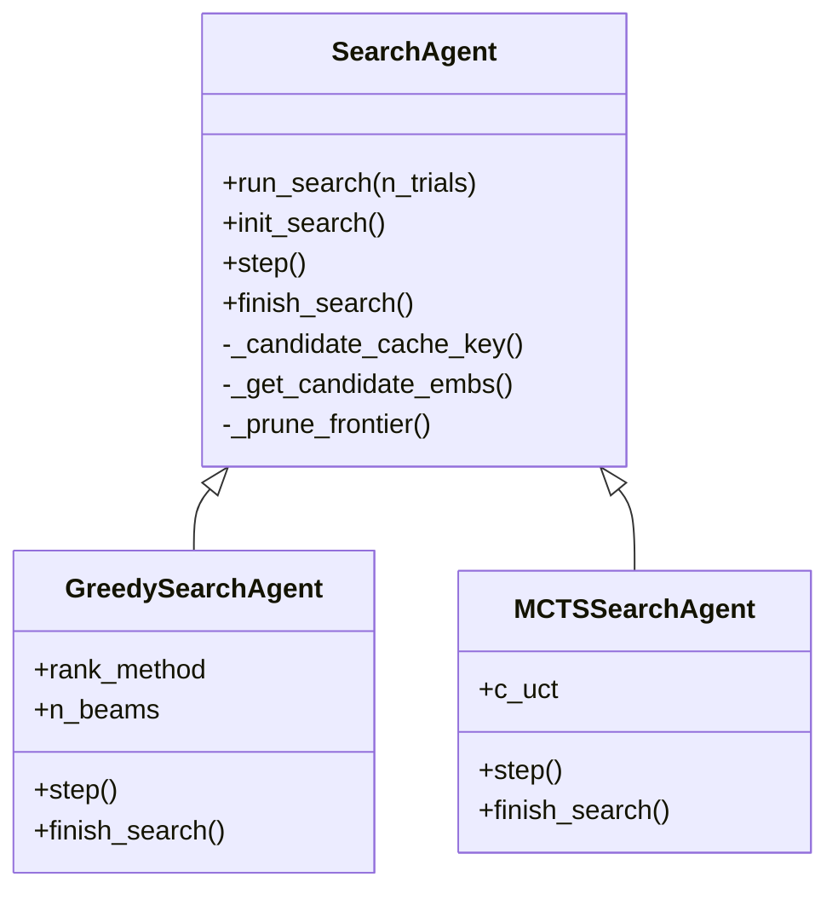
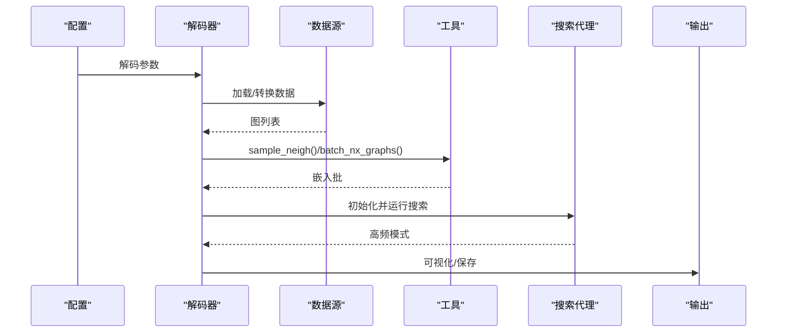
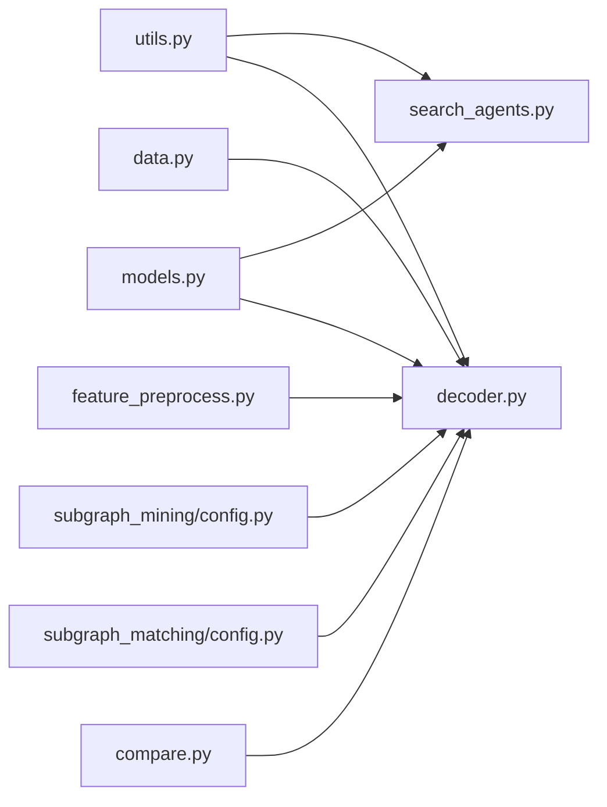

# 图操作工具

<cite>
**本文引用的文件**
- [common/utils.py](file://common/utils.py)
- [common/data.py](file://common/data.py)
- [common/models.py](file://common/models.py)
- [common/feature_preprocess.py](file://common/feature_preprocess.py)
- [subgraph_mining/search_agents.py](file://subgraph_mining/search_agents.py)
- [subgraph_mining/decoder.py](file://subgraph_mining/decoder.py)
- [subgraph_mining/config.py](file://subgraph_mining/config.py)
- [subgraph_matching/config.py](file://subgraph_matching/config.py)
- [compare/compare.py](file://compare/compare.py)
</cite>

## 目录
1. [简介](#简介)
2. [项目结构](#项目结构)
3. [核心组件](#核心组件)
4. [架构总览](#架构总览)
5. [详细组件分析](#详细组件分析)
6. [依赖分析](#依赖分析)
7. [性能考量](#性能考量)
8. [故障排查指南](#故障排查指南)
9. [结论](#结论)
10. [附录](#附录)

## 简介
本文件面向 SPMiner 的图操作工具函数，系统化梳理以下能力：
- 图数据结构转换：NetworkX 图与 PyTorch Geometric 图之间的互转与批处理封装。
- 节点与边操作：邻域采样、前沿扩展、子图提取、自环移除等。
- WL 核哈希：Weisfeiler-Lehman 标签算法的实现细节与节点锚定功能。
- 图枚举与子图搜索：ESU 思想的子图枚举、按 WL 签名聚类、以及搜索代理（贪心与 MCTS）的完整工作流。
- 使用示例与最佳实践：参数配置、性能优化建议与常见问题排查。

## 项目结构
围绕图操作工具的核心模块分布如下：
- common/utils.py：邻域采样、WL 哈希、ESU 枚举、边列表加载、设备与优化器工具、NetworkX 批处理。
- common/data.py：数据集加载、Disk/OTF 数据源、邻域采样与子图生成、PyG 与 NX 的互转。
- common/models.py：GNN 编码器、SkipLastGNN、序嵌入模型、GINConv/SAGEConv 等。
- common/feature_preprocess.py：特征增强、归一化、稀疏矩阵构建、节点特征扩展。
- subgraph_mining/search_agents.py：搜索代理（贪心、MCTS）、候选嵌入缓存、前沿剪枝、WL 哈希缓存。
- subgraph_mining/decoder.py：挖掘主流程（采样 -> 嵌入 -> 搜索 -> 输出），数据集适配与可视化。
- subgraph_mining/config.py：解码阶段参数（采样策略、邻域大小、搜索策略、输出数量等）。
- subgraph_matching/config.py：编码器阶段参数（模型类型、卷积类型、层数、隐藏维度等）。
- compare/compare.py：与 gSpan 对比的基准脚本（命令行、超时控制、公平输入、结果整理与绘图）。

图表来源
- [common/utils.py:18-301](file://common/utils.py#L18-L301)
- [common/data.py:21-75](file://common/data.py#L21-L75)
- [common/models.py:101-200](file://common/models.py#L101-L200)
- [common/feature_preprocess.py:71-192](file://common/feature_preprocess.py#L71-L192)
- [subgraph_mining/search_agents.py:14-442](file://subgraph_mining/search_agents.py#L14-L442)
- [subgraph_mining/decoder.py:62-196](file://subgraph_mining/decoder.py#L62-L196)
- [subgraph_mining/config.py:4-65](file://subgraph_mining/config.py#L4-L65)
- [subgraph_matching/config.py:4-82](file://subgraph_matching/config.py#L4-L82)
- [compare/compare.py:16-125](file://compare/compare.py#L16-L125)

章节来源
- [common/utils.py:18-301](file://common/utils.py#L18-L301)
- [common/data.py:21-75](file://common/data.py#L21-L75)
- [subgraph_mining/decoder.py:62-196](file://subgraph_mining/decoder.py#L62-L196)

## 核心组件
本节聚焦图操作工具的关键函数与类，涵盖数据结构转换、邻域采样、WL 哈希、ESU 枚举与搜索代理。

- 邻域采样与前沿扩展
  - 函数：sample_neigh(graphs, size)
  - 功能：按图大小加权采样，从随机起点开始前沿扩展，直至达到目标节点数；若前沿耗尽则重新采样。
  - 关键点：权重为 |V|，随机起点，前沿去重与访问集合维护，避免重复扩展。
  - 适用：构建子图样本、基线查询生成。

- ESU 枚举与 WL 聚类
  - 函数：enumerate_subgraph(G, k, progress_bar, node_anchored)
  - 递归扩展：extend_subgraph(G, k, sg, v_ext, node_id, motif_counts, ps, node_anchored)
  - 功能：从每个节点出发，按概率采样邻居加入扩展前沿，递归扩展至大小 k；对每个中间子图计算 WL 签名并聚类。
  - 关键点：按节点编号约束避免重复；概率 ps 随子图大小递减；可选节点锚定；自环移除。

- WL 核哈希
  - 函数：wl_hash(g, dim, node_anchored)
  - 实现：将节点标签向量化，迭代聚合邻居标签，使用固定掩码的哈希稳定化，最终对所有节点向量求和得到结构签名。
  - 节点锚定：若启用，将锚点节点对应的向量置为单位向量，参与迭代聚合。

- 图数据结构转换与批处理
  - 函数：batch_nx_graphs(graphs, anchors)
  - 功能：将 NetworkX 图列表转换为 DeepSNAP Batch，应用特征增强，设置锚点节点特征（可选），移动到设备。
  - 互转：to_networkx 与 from_networkx 的使用在数据加载与解码流程中广泛出现。

- 边列表加载
  - 函数：load_snap_edgelist(path)
  - 功能：从 SNAP 风格边列表加载无向图，过滤注释行与空行，取最大连通子图保证连通性。

- 设备与优化器
  - 函数：get_device()、build_optimizer(args, params)
  - 功能：懒加载设备（CUDA/CPU），按配置创建优化器与调度器。

章节来源
- [common/utils.py:18-53](file://common/utils.py#L18-L53)
- [common/utils.py:98-171](file://common/utils.py#L98-L171)
- [common/utils.py:70-96](file://common/utils.py#L70-L96)
- [common/utils.py:286-301](file://common/utils.py#L286-L301)
- [common/utils.py:208-233](file://common/utils.py#L208-L233)
- [common/utils.py:235-284](file://common/utils.py#L235-L284)

## 架构总览
SPMiner 的图操作工具贯穿“采样 -> 嵌入 -> 搜索 -> 输出”主流程。下图展示关键交互：

图表来源
- [subgraph_mining/decoder.py:62-196](file://subgraph_mining/decoder.py#L62-L196)
- [common/data.py:21-75](file://common/data.py#L21-L75)
- [common/utils.py:18-53](file://common/utils.py#L18-L53)
- [common/utils.py:286-301](file://common/utils.py#L286-L301)
- [subgraph_mining/search_agents.py:146-282](file://subgraph_mining/search_agents.py#L146-L282)
- [common/models.py:101-200](file://common/models.py#L101-L200)

## 详细组件分析

### 组件A：邻域采样与前沿扩展
- 目标：从大规模图集中高效采样连通邻域，作为子图样本或基线查询。
- 关键流程：
  - 按图大小加权选择目标图。
  - 随机选择起点，初始化邻域与前沿。
  - 循环从前沿随机选取节点加入邻域，扩展邻居并维护前沿与访问集合。
  - 当邻域达到目标大小或前沿耗尽时返回。

图表来源
- [common/utils.py:18-53](file://common/utils.py#L18-L53)

章节来源
- [common/utils.py:18-53](file://common/utils.py#L18-L53)

### 组件B：ESU 枚举与 WL 聚类
- 目标：在给定图中枚举大小不超过 k 的子图，并按 WL 结构签名聚类，减少重复。
- 关键流程：
  - 为每个节点生成初始候选集合，按概率采样邻居加入扩展前沿。
  - 递归扩展：每次从前沿取出一个节点加入当前子图，同时扩展其邻居作为新的前沿候选。
  - 在每一步对当前子图计算 WL 签名并聚类，终止条件为达到目标大小。
  - 可选节点锚定：在子图上设置 anchor 属性，参与 WL 迭代。

图表来源
- [common/utils.py:121-171](file://common/utils.py#L121-L171)

章节来源
- [common/utils.py:98-171](file://common/utils.py#L98-L171)

### 组件C：WL 核哈希与节点锚定
- 目标：为子图生成稳定的结构签名，用于去重与聚类。
- 实现要点：
  - vec_hash：使用固定随机掩码与哈希组合，构造稳定离散编码。
  - wl_hash：对每个节点维护固定维度向量，迭代聚合邻居向量，最终对所有节点向量求和得到签名。
  - 节点锚定：若启用，将锚点节点向量置为单位向量，参与聚合。

图表来源
- [common/utils.py:55-96](file://common/utils.py#L55-L96)

章节来源
- [common/utils.py:70-96](file://common/utils.py#L70-L96)

### 组件D：图数据结构转换与批处理
- 目标：在 NX 图与 PyG/DeepSNAP 之间进行高效转换与批处理。
- 关键流程：
  - 将 NX 图转换为 DeepSNAP Graph，再构建 Batch。
  - 应用特征增强（如节点度、中心性等），可选设置锚点节点特征。
  - 移动到设备（CUDA/CPU）。

图表来源
- [common/utils.py:286-301](file://common/utils.py#L286-L301)
- [common/feature_preprocess.py:71-192](file://common/feature_preprocess.py#L71-L192)

章节来源
- [common/utils.py:286-301](file://common/utils.py#L286-L301)
- [common/feature_preprocess.py:71-192](file://common/feature_preprocess.py#L71-L192)

### 组件E：搜索代理（贪心与 MCTS）
- 目标：在嵌入空间中搜索频繁子图模式，支持前沿剪枝与候选嵌入缓存。
- 关键机制：
  - 候选嵌入缓存：避免重复计算，加速扩展。
  - 前沿剪枝：按度数保留前 K 个候选，降低搜索复杂度。
  - WL 哈希缓存：记录状态到子图映射，用于去重与输出。
  - 贪心：按模型打分选择最优扩展。
  - MCTS：基于 UCT 的探索与利用，累计回传访问次数与价值。

图表来源
- [subgraph_mining/search_agents.py:14-442](file://subgraph_mining/search_agents.py#L14-L442)

章节来源
- [subgraph_mining/search_agents.py:14-442](file://subgraph_mining/search_agents.py#L14-L442)

### 组件F：解码器主流程与参数配置
- 目标：统一采样、嵌入、搜索与输出流程，支持多种数据集与采样策略。
- 关键流程：
  - 加载/转换数据集（NX/PyG），支持全图或邻域采样。
  - 构造候选邻域集合，批量编码嵌入。
  - 选择搜索策略（贪心/MCTS），输出可视化与序列化结果。
- 参数：
  - 采样策略：tree/radial，邻域半径、采样大小。
  - 搜索策略：greedy/mcts，前沿剪枝 K，输出数量。
  - 模型类型：order/embedding 类型，隐藏维度等。

图表来源
- [subgraph_mining/decoder.py:62-196](file://subgraph_mining/decoder.py#L62-L196)
- [subgraph_mining/config.py:4-65](file://subgraph_mining/config.py#L4-L65)

章节来源
- [subgraph_mining/decoder.py:62-196](file://subgraph_mining/decoder.py#L62-L196)
- [subgraph_mining/config.py:4-65](file://subgraph_mining/config.py#L4-L65)

## 依赖分析
- 工具层依赖
  - utils.py 依赖 NetworkX、NumPy、SciPy、TorchGeometric、DeepSNAP、Matplotlib 等。
  - data.py 依赖 TUDataset、PPI、QM9、PyG utils、DeepSNAP。
  - feature_preprocess.py 依赖 sklearn、TSNE、PyG utils/nn、DeepSNAP。
  - models.py 依赖 PyG nn、utils、feature_preprocess。
- 搜索代理依赖
  - search_agents.py 依赖 utils、models、networkx、matplotlib、scipy。
- 解码器依赖
  - decoder.py 依赖 models、utils、data、search_agents、config、PyG datasets/utils。
- 对比脚本依赖
  - compare.py 依赖 argparse、pandas、matplotlib、psutil、subprocess。

图表来源
- [common/utils.py:1-16](file://common/utils.py#L1-L16)
- [common/data.py:1-19](file://common/data.py#L1-L19)
- [common/feature_preprocess.py:1-24](file://common/feature_preprocess.py#L1-L24)
- [common/models.py:1-20](file://common/models.py#L1-L20)
- [subgraph_mining/search_agents.py:1-12](file://subgraph_mining/search_agents.py#L1-L12)
- [subgraph_mining/decoder.py:1-25](file://subgraph_mining/decoder.py#L1-L25)
- [subgraph_mining/config.py:1-3](file://subgraph_mining/config.py#L1-L3)
- [subgraph_matching/config.py:1-3](file://subgraph_matching/config.py#L1-L3)
- [compare/compare.py:1-10](file://compare/compare.py#L1-L10)

章节来源
- [common/utils.py:1-16](file://common/utils.py#L1-L16)
- [common/data.py:1-19](file://common/data.py#L1-L19)
- [common/feature_preprocess.py:1-24](file://common/feature_preprocess.py#L1-L24)
- [common/models.py:1-20](file://common/models.py#L1-L20)
- [subgraph_mining/search_agents.py:1-12](file://subgraph_mining/search_agents.py#L1-L12)
- [subgraph_mining/decoder.py:1-25](file://subgraph_mining/decoder.py#L1-L25)
- [subgraph_mining/config.py:1-3](file://subgraph_mining/config.py#L1-L3)
- [subgraph_matching/config.py:1-3](file://subgraph_matching/config.py#L1-L3)
- [compare/compare.py:1-10](file://compare/compare.py#L1-L10)

## 性能考量
- 前沿剪枝：frontier_top_k 控制每步保留的候选数量，显著降低搜索空间。
- 候选嵌入缓存：避免重复计算，提升贪心/MCTS 扩展速度。
- 批处理与设备：批量嵌入编码、设备迁移（CUDA/CPU）减少 I/O 与通信开销。
- ESU 采样概率：ps 随子图大小递减，平衡探索与效率。
- 数据集适配：对非 NX 图使用 to_networkx 转换，确保后续流程一致性。

[本节为通用性能讨论，无需列出章节来源]

## 故障排查指南
- 采样失败或邻域不足
  - 现象：sample_neigh 返回失败或邻域节点数不足。
  - 排查：检查图连通性与前沿扩展逻辑；增大目标 size 或调整采样策略。
  - 参考：[common/utils.py:18-53](file://common/utils.py#L18-L53)
- WL 签名不稳定
  - 现象：相同结构签名不一致。
  - 排查：确认 vec_hash 的固定掩码初始化与迭代聚合顺序；避免节点重标号冲突。
  - 参考：[common/utils.py:55-96](file://common/utils.py#L55-L96)
- ESU 枚举重复过多
  - 现象：输出模式数量远超预期。
  - 排查：检查 WL 聚类阈值与签名稳定性；确认节点锚定设置一致。
  - 参考：[common/utils.py:98-171](file://common/utils.py#L98-L171)
- 搜索代理卡顿
  - 现象：贪心/MCTS 扩展缓慢。
  - 排查：启用 frontier_top_k；检查候选嵌入缓存命中率；减少 n_trials。
  - 参考：[subgraph_mining/search_agents.py:121-127](file://subgraph_mining/search_agents.py#L121-L127)
- 设备与显存问题
  - 现象：CUDA OOM 或 CPU 性能瓶颈。
  - 排查：降低 batch_size；切换到 CPU；检查模型维度与层数。
  - 参考：[common/utils.py:235-243](file://common/utils.py#L235-L243)
- 数据集格式错误
  - 现象：load_snap_edgelist 报错或图不连通。
  - 排查：检查边列表格式、注释行与空行；确认最大连通子图提取。
  - 参考：[common/utils.py:208-233](file://common/utils.py#L208-L233)

章节来源
- [common/utils.py:18-53](file://common/utils.py#L18-L53)
- [common/utils.py:55-96](file://common/utils.py#L55-L96)
- [common/utils.py:98-171](file://common/utils.py#L98-L171)
- [subgraph_mining/search_agents.py:121-127](file://subgraph_mining/search_agents.py#L121-L127)
- [common/utils.py:235-243](file://common/utils.py#L235-L243)
- [common/utils.py:208-233](file://common/utils.py#L208-L233)

## 结论
SPMiner 的图操作工具以 utils.py 为核心，结合 data.py 的数据适配、models.py 的嵌入编码、search_agents.py 的搜索策略与 decoder.py 的主流程，形成了从采样、嵌入、搜索到输出的完整链路。ESU 枚举与 WL 哈希提供了高效的子图去重与聚类能力；前沿剪枝与候选嵌入缓存显著提升了搜索效率。通过合理的参数配置与性能优化，可在大规模图上稳定挖掘频繁子图模式。

[本节为总结性内容，无需列出章节来源]

## 附录
- 常用参数速查
  - 采样策略：sample_method（tree/radial）、radius、subgraph_sample_size、n_neighborhoods、min/max_neighborhood_size。
  - 搜索策略：search_strategy（greedy/mcts）、frontier_top_k、n_trials、out_batch_size。
  - 模型与数据：conv_type、n_layers、hidden_dim、batch_size、node_anchored。
- 使用示例路径
  - 邻域采样：[common/utils.py:18-53](file://common/utils.py#L18-L53)
  - ESU 枚举：[common/utils.py:121-171](file://common/utils.py#L121-L171)
  - WL 哈希：[common/utils.py:70-96](file://common/utils.py#L70-L96)
  - 批处理：[common/utils.py:286-301](file://common/utils.py#L286-L301)
  - 解码主流程：[subgraph_mining/decoder.py:62-196](file://subgraph_mining/decoder.py#L62-L196)
  - 搜索代理：[subgraph_mining/search_agents.py:146-282](file://subgraph_mining/search_agents.py#L146-L282)

[本节为附录性内容，无需列出章节来源]