# 工具函数模块

<cite>
**本文档引用的文件**
- [common/utils.py](file://common/utils.py)
- [common/data.py](file://common/data.py)
- [common/combined_syn.py](file://common/combined_syn.py)
- [common/feature_preprocess.py](file://common/feature_preprocess.py)
- [common/models.py](file://common/models.py)
- [analyze/count_patterns.py](file://analyze/count_patterns.py)
- [analyze/visualize_mined_subgraphs.py](file://analyze/visualize_mined_subgraphs.py)
- [compare/evaluate_isomorphism_accuracy.py](file://compare/evaluate_isomorphism_accuracy.py)
- [subgraph_mining/decoder.py](file://subgraph_mining/decoder.py)
- [subgraph_mining/search_agents.py](file://subgraph_mining/search_agents.py)
- [subgraph_mining/config.py](file://subgraph_mining/config.py)
</cite>

## 目录
1. [简介](#简介)
2. [项目结构](#项目结构)
3. [核心组件](#核心组件)
4. [架构概览](#架构概览)
5. [详细组件分析](#详细组件分析)
6. [依赖分析](#依赖分析)
7. [性能考虑](#性能考虑)
8. [故障排除指南](#故障排除指南)
9. [结论](#结论)
10. [附录](#附录)

## 简介

SPMiner的工具函数模块提供了完整的图操作、数据处理、可视化和分析功能。该模块包含四个主要子系统：图操作工具函数、批处理工具、可视化工具和组合合成数据生成器。这些组件协同工作，为子图挖掘和模式识别任务提供强大的基础设施支持。

## 项目结构

工具函数模块位于项目的`common`目录下，包含以下核心文件：

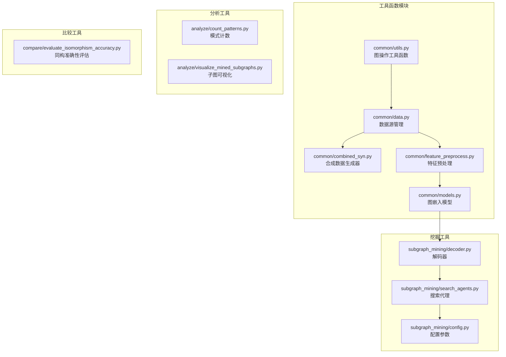

**图表来源**
- [common/utils.py:1-302](file://common/utils.py#L1-L302)
- [common/data.py:1-447](file://common/data.py#L1-L447)

**章节来源**
- [common/utils.py:1-302](file://common/utils.py#L1-L302)
- [common/data.py:1-447](file://common/data.py#L1-L447)

## 核心组件

### 图操作工具函数

图操作工具函数模块提供了丰富的图数据结构转换和操作功能：

#### 图采样和邻域扩展
- `sample_neigh`: 基于图大小加权的连通邻域采样
- `load_snap_edgelist`: 从SNAP风格边列表加载无向图
- `batch_nx_graphs`: 将NetworkX图批量转换为DeepSNAP批次

#### 图同构和WL签名
- `wl_hash`: 计算图的WL风格哈希签名
- `enumerate_subgraph`: 基于ESU思想的子图枚举
- `extend_subgraph`: 递归扩展子图并按WL签名聚类

#### 优化器和设备管理
- `build_optimizer`: 创建优化器和学习率调度器
- `get_device`: 懒加载运行设备（优先CUDA）

**章节来源**
- [common/utils.py:18-302](file://common/utils.py#L18-L302)

### 批处理工具

批处理工具模块提供了高效的数据加载和处理机制：

#### 数据源管理
- `OTFSynDataSource`: 在线合成数据源
- `DiskDataSource`: 磁盘数据源
- `OTFSynImbalancedDataSource`: 不平衡在线合成数据源
- `DiskImbalancedDataSource`: 不平衡磁盘数据源

#### 批处理操作
- `gen_batch`: 生成正负样本批次
- `gen_data_loaders`: 创建数据加载器
- `apply_transform`: 应用变换到批次数据

**章节来源**
- [common/data.py:77-447](file://common/data.py#L77-L447)

### 可视化工具

可视化工具模块提供了多种图和统计信息的可视化功能：

#### 子图可视化
- `draw_graph`: 绘制单个子图
- `save_single_graphs`: 保存单个子图图像
- `save_montage`: 保存子图拼贴图

#### 统计分析可视化
- `Analyze Embeddings`: 嵌入分析和PCA可视化
- `count_patterns`: 模式计数和统计分析

**章节来源**
- [analyze/visualize_mined_subgraphs.py:1-191](file://analyze/visualize_mined_subgraphs.py#L1-L191)
- [analyze/count_patterns.py:1-431](file://analyze/count_patterns.py#L1-L431)

### 组合合成数据生成器

组合合成数据生成器模块提供了多种图生成算法：

#### 图生成器
- `ERGenerator`: E-R随机图生成器
- `WSGenerator`: Watts-Strogatz小世界图生成器
- `BAGenerator`: 扩展Barabási-Albert无标度图生成器
- `PowerLawClusterGenerator`: 幂律簇生成器

#### 数据集管理
- `get_generator`: 获取组合生成器
- `get_dataset`: 创建合成数据集

**章节来源**
- [common/combined_syn.py:1-134](file://common/combined_syn.py#L1-L134)

## 架构概览

工具函数模块采用分层架构设计，各组件之间通过清晰的接口进行交互：

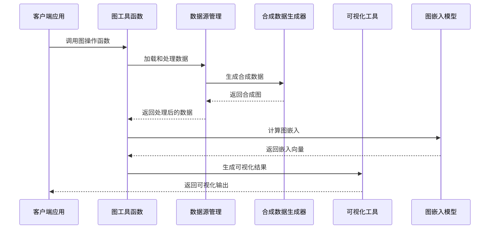

**图表来源**
- [common/utils.py:286-302](file://common/utils.py#L286-L302)
- [common/data.py:114-214](file://common/data.py#L114-L214)
- [common/combined_syn.py:101-117](file://common/combined_syn.py#L101-L117)

## 详细组件分析

### 图操作工具函数分析

#### 图采样算法
图采样函数实现了基于图大小加权的连通邻域采样机制：

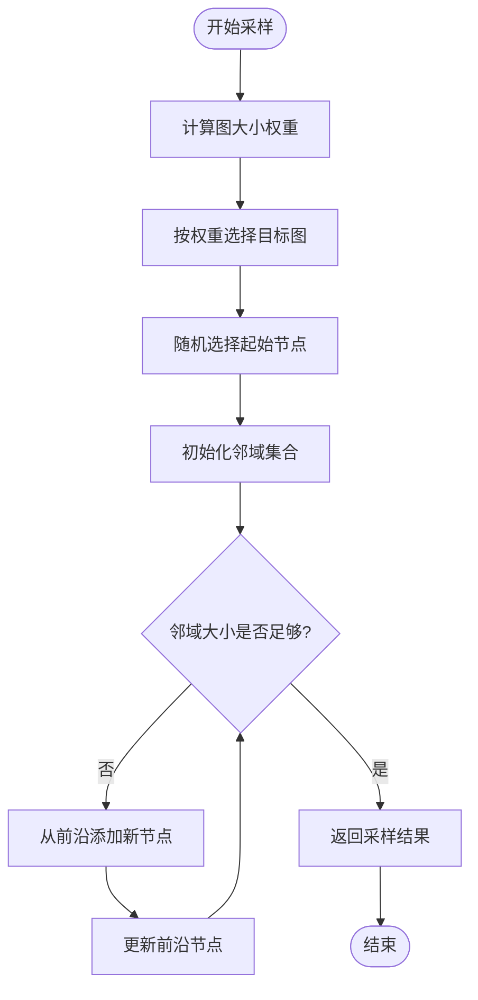

**图表来源**
- [common/utils.py:18-53](file://common/utils.py#L18-L53)

#### WL签名计算
WL（Weisfeiler-Lehman）签名计算实现了图结构的稳定编码：

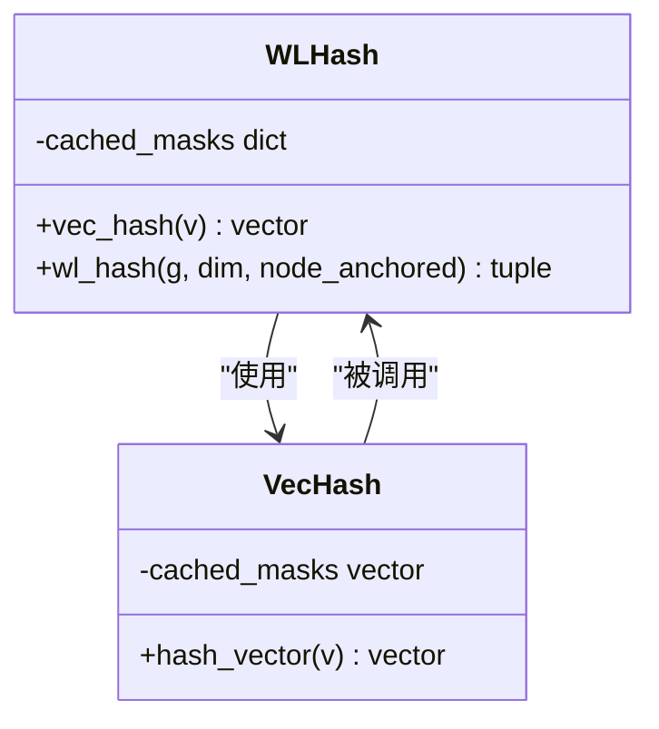

**图表来源**
- [common/utils.py:55-96](file://common/utils.py#L55-L96)

**章节来源**
- [common/utils.py:18-96](file://common/utils.py#L18-L96)

### 批处理工具分析

#### 数据源管理架构
数据源管理模块提供了灵活的数据加载和处理机制：

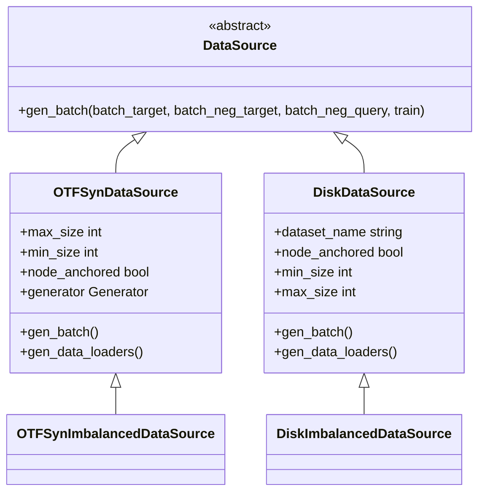

**图表来源**
- [common/data.py:77-447](file://common/data.py#L77-L447)

#### 批处理生成流程
批处理生成器实现了高效的正负样本生成机制：

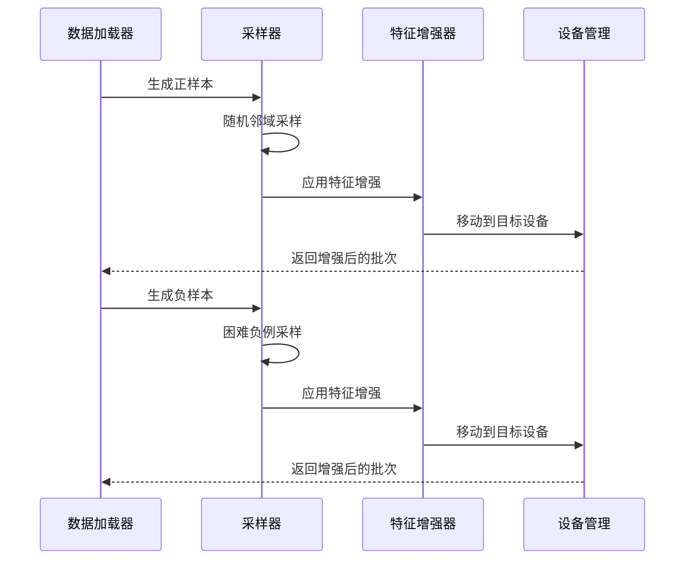

**图表来源**
- [common/data.py:114-214](file://common/data.py#L114-L214)

**章节来源**
- [common/data.py:77-214](file://common/data.py#L77-L214)

### 可视化工具分析

#### 子图可视化系统
子图可视化工具提供了完整的图形渲染和布局功能：

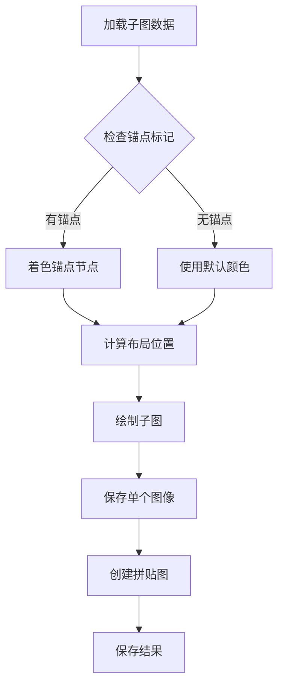

**图表来源**
- [analyze/visualize_mined_subgraphs.py:63-124](file://analyze/visualize_mined_subgraphs.py#L63-L124)

#### 模式计数分析
模式计数工具提供了高效的子图同构检测和统计分析：

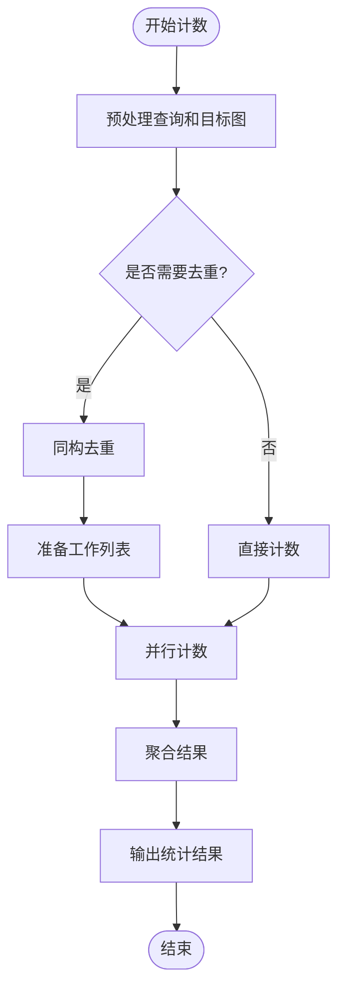

**图表来源**
- [analyze/count_patterns.py:231-278](file://analyze/count_patterns.py#L231-L278)

**章节来源**
- [analyze/visualize_mined_subgraphs.py:1-191](file://analyze/visualize_mined_subgraphs.py#L1-L191)
- [analyze/count_patterns.py:1-431](file://analyze/count_patterns.py#L1-L431)

### 组合合成数据生成器分析

#### 图生成算法
合成数据生成器实现了多种经典图生成算法：

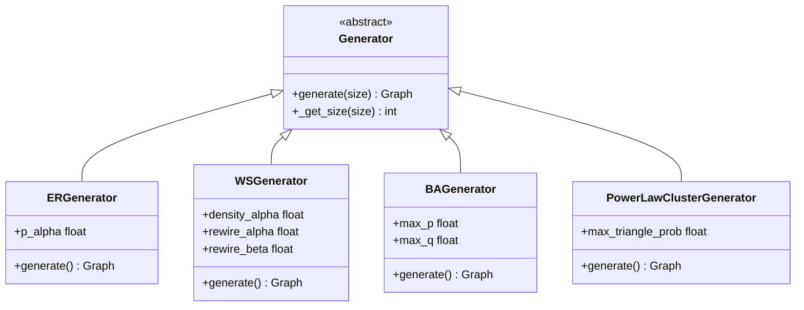

**图表来源**
- [common/combined_syn.py:9-111](file://common/combined_syn.py#L9-L111)

#### 数据集管理
数据集管理模块提供了灵活的合成数据生成和管理功能：

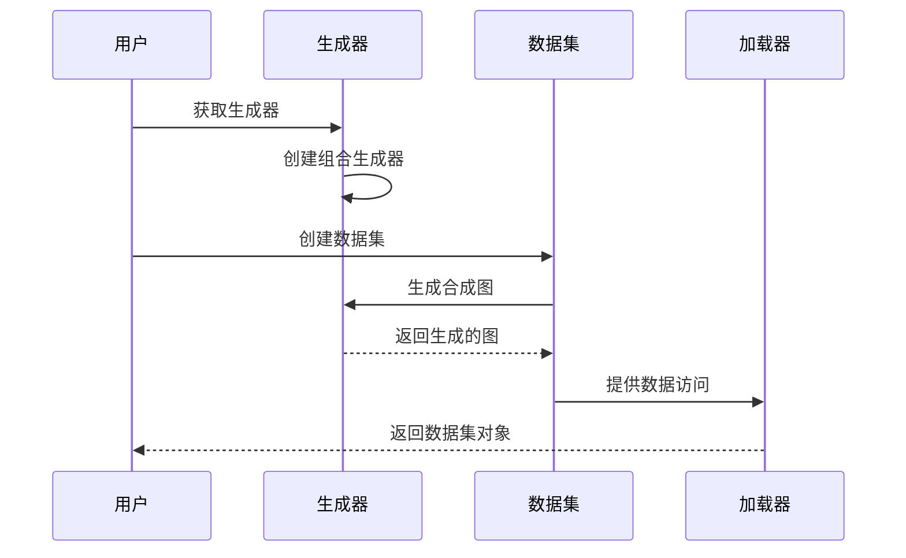

**图表来源**
- [common/combined_syn.py:101-117](file://common/combined_syn.py#L101-L117)

**章节来源**
- [common/combined_syn.py:1-134](file://common/combined_syn.py#L1-L134)

## 依赖分析

工具函数模块的依赖关系呈现清晰的层次结构：

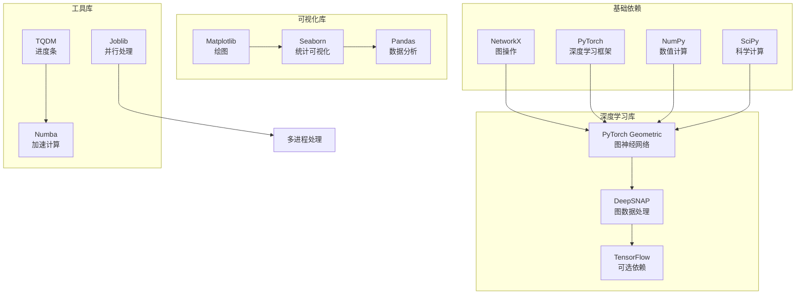

**图表来源**
- [common/utils.py:1-16](file://common/utils.py#L1-L16)
- [common/data.py:1-20](file://common/data.py#L1-L20)

**章节来源**
- [common/utils.py:1-16](file://common/utils.py#L1-L16)
- [common/data.py:1-20](file://common/data.py#L1-L20)

## 性能考虑

### 内存管理优化

工具函数模块采用了多种内存管理策略：

1. **懒加载机制**: 设备和缓存的懒加载减少了不必要的内存占用
2. **批量处理**: 大数据集的批量处理避免了内存碎片化
3. **缓存策略**: 嵌入向量和候选图的缓存机制提高了重复访问效率

### 并行计算优化

模块实现了多层次的并行处理：

1. **多进程并行**: 模式计数使用多进程池进行并行计算
2. **GPU加速**: 自动检测和使用CUDA设备进行深度学习计算
3. **批处理优化**: 深度学习模型的批处理推理提高了吞吐量

### 算法复杂度分析

- 图采样算法: 时间复杂度O(|V| + |E|)，空间复杂度O(|V|)
- WL签名计算: 时间复杂度O(|V|²)，空间复杂度O(|V|×d)
- 子图枚举: 时间复杂度O(|V|!×k)，空间复杂度O(|V|×k)
- 模式计数: 时间复杂度O(|Q|×|T|×|V|)，空间复杂度O(|V|)

## 故障排除指南

### 常见问题及解决方案

#### 设备兼容性问题
- **问题**: CUDA设备不可用
- **解决方案**: 自动降级到CPU设备，检查CUDA版本兼容性

#### 内存不足问题
- **问题**: 大规模图处理内存溢出
- **解决方案**: 调整批处理大小，启用缓存清理，使用更小的图尺寸

#### 性能瓶颈问题
- **问题**: 模式计数速度慢
- **解决方案**: 增加并行进程数，启用前端剪枝，优化数据预处理

#### 数据格式问题
- **问题**: 图数据格式不兼容
- **解决方案**: 使用标准化的NetworkX图格式，检查边列表格式

**章节来源**
- [common/utils.py:235-243](file://common/utils.py#L235-L243)
- [common/data.py:180-214](file://common/data.py#L180-L214)

## 结论

SPMiner的工具函数模块提供了完整的图操作、数据处理和分析基础设施。该模块通过精心设计的架构和优化策略，为子图挖掘和模式识别任务提供了高效、可靠的工具支持。模块的分层设计使得各个组件职责明确，易于维护和扩展。

## 附录

### API参考

#### 图操作函数
- `sample_neigh(graphs, size)`: 连通邻域采样
- `load_snap_edgelist(path)`: SNAP边列表加载
- `batch_nx_graphs(graphs, anchors)`: 批量图转换

#### 数据源管理
- `OTFSynDataSource`: 在线合成数据源
- `DiskDataSource`: 磁盘数据源
- `gen_batch()`: 批次生成

#### 可视化工具
- `draw_graph()`: 子图绘制
- `save_single_graphs()`: 单图保存
- `save_montage()`: 拼贴图生成

#### 合成数据生成
- `get_generator()`: 生成器获取
- `get_dataset()`: 数据集创建

### 使用示例

#### 基本图操作
```python
# 图采样示例
graphs = [...]  # 图列表
graph, neigh = utils.sample_neigh(graphs, size=10)

# 边列表加载
graph = utils.load_snap_edgelist("edges.txt")
```

#### 数据批处理
```python
# 批次生成示例
data_source = data.OTFSynDataSource()
pos_target, pos_query, neg_target, neg_query = data_source.gen_batch(...)
```

#### 可视化生成
```python
# 子图可视化
graphs = [...]  # 子图列表
visualize_mined_subgraphs.save_montage(graphs, "output.png", "tag")
```