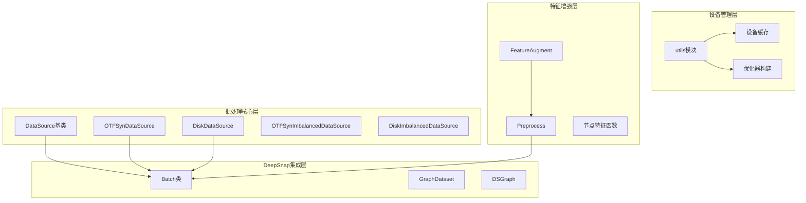
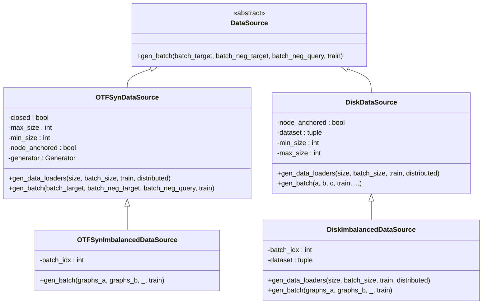
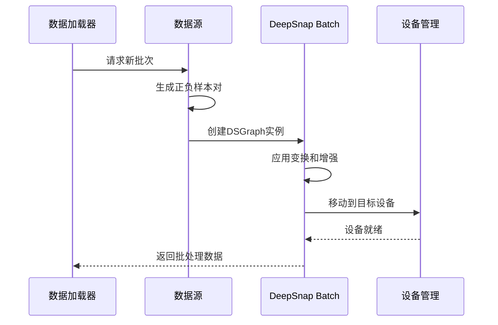
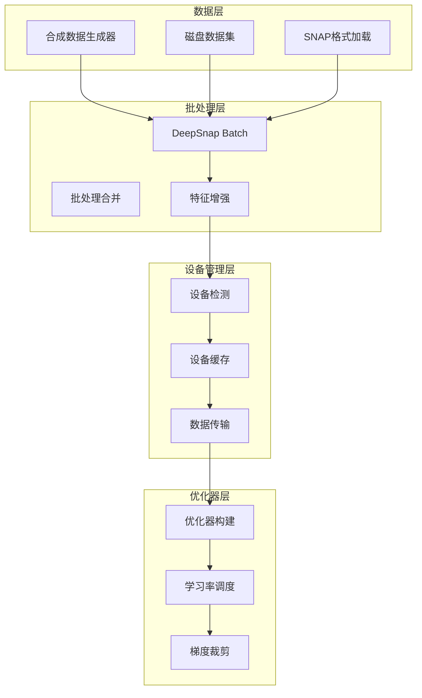
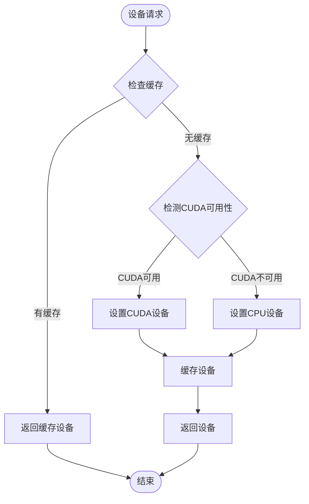
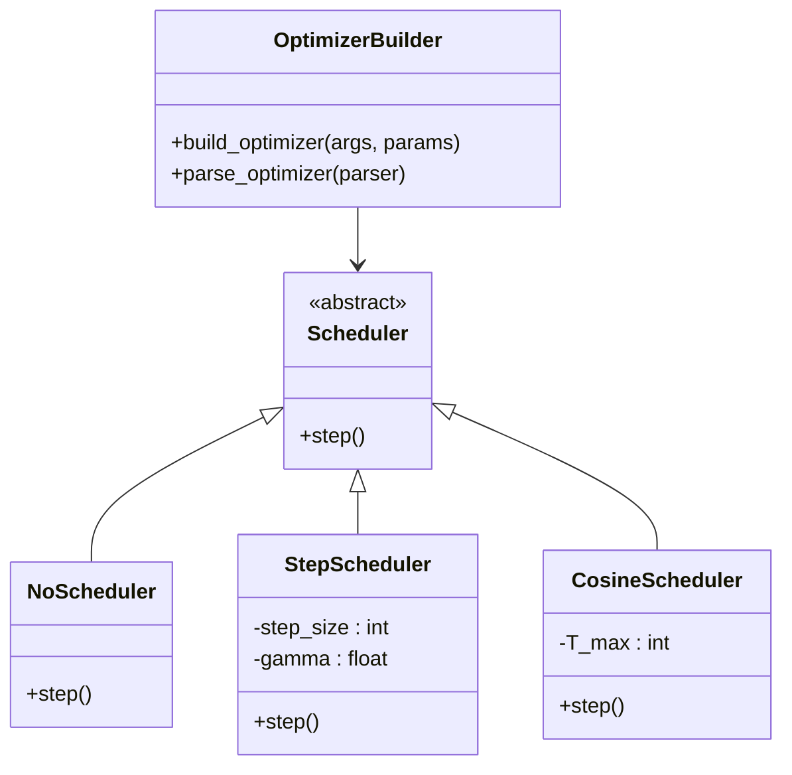
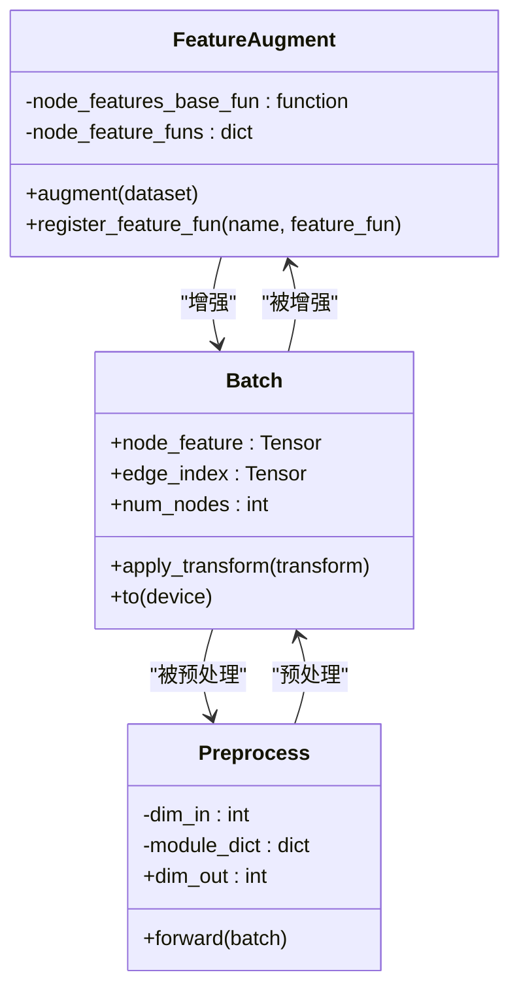
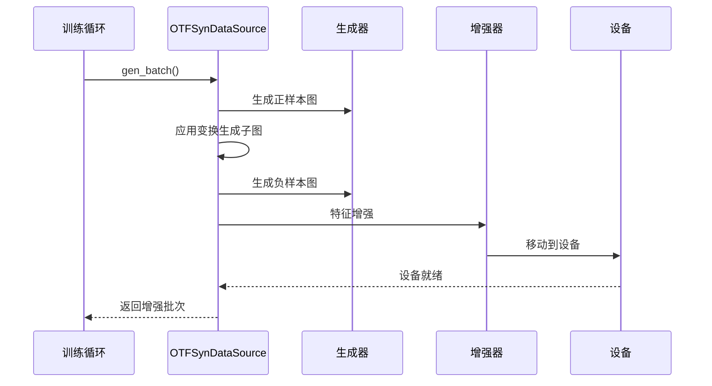
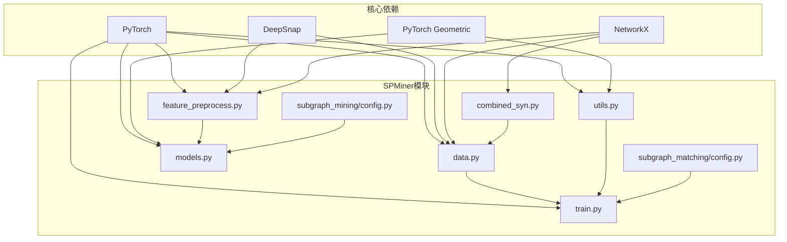

# 批处理工具

<cite>
**本文档引用的文件**
- [common/data.py](file://common/data.py)
- [common/utils.py](file://common/utils.py)
- [common/feature_preprocess.py](file://common/feature_preprocess.py)
- [common/models.py](file://common/models.py)
- [common/combined_syn.py](file://common/combined_syn.py)
- [subgraph_matching/train.py](file://subgraph_matching/train.py)
- [subgraph_matching/config.py](file://subgraph_matching/config.py)
- [subgraph_mining/config.py](file://subgraph_mining/config.py)
</cite>

## 目录
1. [简介](#简介)
2. [项目结构](#项目结构)
3. [核心组件](#核心组件)
4. [架构概览](#架构概览)
5. [详细组件分析](#详细组件分析)
6. [依赖关系分析](#依赖关系分析)
7. [性能考虑](#性能考虑)
8. [故障排除指南](#故障排除指南)
9. [结论](#结论)

## 简介

SPMiner的批处理工具函数是整个子图匹配和挖掘系统的核心基础设施，负责高效地处理大规模图数据的批量操作。本文档深入解析了批处理工具的实现原理，包括DeepSnap Batch的创建和管理、设备管理功能（CUDA和CPU的自动切换）、优化器配置和构建工具，以及批处理数据增强的完整API参考。

该系统采用模块化设计，通过多种数据源（在线合成数据、磁盘数据集）和批处理策略，为子图匹配模型提供了灵活而高效的训练框架。系统特别注重性能优化和内存管理，通过智能的设备分配和批处理策略来最大化计算资源利用率。

## 项目结构

SPMiner的批处理工具分布在多个关键模块中，形成了一个层次化的架构：

**图表来源**
- [common/data.py:77-112](file://common/data.py#L77-L112)
- [common/utils.py:235-284](file://common/utils.py#L235-L284)
- [common/feature_preprocess.py:71-230](file://common/feature_preprocess.py#L71-L230)

**章节来源**
- [common/data.py:1-447](file://common/data.py#L1-L447)
- [common/utils.py:1-302](file://common/utils.py#L1-L302)

## 核心组件

### DataSource抽象层

DataSource是所有数据源的抽象基类，定义了统一的批处理接口：

**图表来源**
- [common/data.py:77-430](file://common/data.py#L77-L430)

### DeepSnap Batch管理系统

DeepSnap Batch是PyTorch Geometric生态系统的批处理核心，SPMiner通过以下方式集成和管理：

**图表来源**
- [common/data.py:114-214](file://common/data.py#L114-L214)
- [common/utils.py:286-301](file://common/utils.py#L286-L301)

**章节来源**
- [common/data.py:77-430](file://common/data.py#L77-L430)
- [common/utils.py:235-301](file://common/utils.py#L235-L301)

## 架构概览

SPMiner的批处理架构采用了分层设计，从底层的DeepSnap集成到高层的应用逻辑：

**图表来源**
- [common/combined_syn.py:101-117](file://common/combined_syn.py#L101-L117)
- [common/feature_preprocess.py:71-192](file://common/feature_preprocess.py#L71-L192)
- [common/utils.py:235-284](file://common/utils.py#L235-L284)

## 详细组件分析

### 设备管理与自动切换机制

SPMiner实现了智能的设备管理机制，通过懒加载和缓存策略来优化GPU/CPU资源的使用：

#### 设备检测与缓存策略

**图表来源**
- [common/utils.py:235-243](file://common/utils.py#L235-L243)

#### 设备切换的最佳实践

设备管理的关键优势在于其懒加载特性，避免了不必要的设备初始化开销。系统通过全局缓存机制确保设备状态在整个应用生命周期内保持一致。

**章节来源**
- [common/utils.py:235-243](file://common/utils.py#L235-L243)

### 优化器配置与构建工具

SPMiner提供了灵活的优化器配置系统，支持多种优化算法和学习率调度策略：

#### 优化器类型支持

| 优化器类型 | 参数配置 | 适用场景 |
|-----------|----------|----------|
| Adam | 学习率、权重衰减 | 一般性训练，收敛稳定 |
| SGD | 学习率、动量、权重衰减 | 需要更强正则化的场景 |
| RMSprop | 学习率、权重衰减 | RNN和深度网络 |
| Adagrad | 学习率、权重衰减 | 稀疏特征 |

#### 学习率调度器配置

**图表来源**
- [common/utils.py:245-284](file://common/utils.py#L245-L284)

**章节来源**
- [common/utils.py:245-284](file://common/utils.py#L245-L284)

### 批处理数据增强API参考

SPMiner的特征增强系统提供了丰富的节点特征生成和数据转换功能：

#### 特征增强方法

| 特征类型 | 描述 | 维度配置 | 使用场景 |
|---------|------|----------|----------|
| node_degree | 节点度数 | one-hot编码 | 图拓扑分析 |
| betweenness_centrality | 中心性 | 连续值 | 关键节点识别 |
| path_len | 最短路径长度 | one-hot编码 | 路径分析 |
| pagerank | PageRank分数 | 连续值 | 重要性评估 |
| clustering_coefficient | 聚类系数 | one-hot/连续 | 局部密度分析 |
| motif_counts | 模体计数 | 73维向量 | 结构模式识别 |
| identity | 图标识矩阵 | k维对角矩阵 | 结构相似性 |

#### 特征预处理模块

**图表来源**
- [common/feature_preprocess.py:71-230](file://common/feature_preprocess.py#L71-L230)

**章节来源**
- [common/feature_preprocess.py:71-230](file://common/feature_preprocess.py#L71-L230)

### 数据源实现详解

#### 在线合成数据源（OTF）

OTFSynDataSource专门用于在线生成合成数据，支持动态图生成和变换：

**图表来源**
- [common/data.py:114-214](file://common/data.py#L114-L214)

#### 磁盘数据源（Disk）

DiskDataSource从预定义的数据集中加载图数据，支持平衡和不平衡采样策略：

**章节来源**
- [common/data.py:81-430](file://common/data.py#L81-L430)

## 依赖关系分析

SPMiner批处理工具的依赖关系体现了清晰的模块化设计：

**图表来源**
- [common/data.py:1-20](file://common/data.py#L1-L20)
- [common/utils.py:1-16](file://common/utils.py#L1-L16)

**章节来源**
- [common/data.py:1-447](file://common/data.py#L1-L447)
- [common/utils.py:1-302](file://common/utils.py#L1-L302)

## 性能考虑

### 内存管理最佳实践

SPMiner在内存管理方面采用了多项优化策略：

#### 设备内存优化

1. **延迟设备分配**：通过设备缓存避免重复的设备初始化
2. **批量数据传输**：减少GPU/CPU之间的数据传输次数
3. **内存池管理**：合理利用PyTorch的内存池机制

#### 批处理性能优化

1. **智能批大小调整**：根据GPU内存动态调整批大小
2. **数据预取**：使用多进程数据加载器提高I/O效率
3. **特征缓存**：对昂贵的特征计算结果进行缓存

### 训练性能优化技巧

#### 优化器选择建议

- **Adam**：适用于大多数场景，收敛稳定
- **SGD**：需要更强正则化时使用
- **RMSprop**：适合RNN和深度网络
- **Adagrad**：处理稀疏特征时表现良好

#### 学习率调度策略

1. **StepLR**：固定间隔衰减，简单易用
2. **CosineAnnealing**：余弦退火，适合长训练周期
3. **No Scheduler**：快速原型开发时使用

## 故障排除指南

### 常见问题及解决方案

#### 设备相关问题

**问题**：CUDA设备不可用
**解决方案**：检查CUDA安装和驱动版本，确认GPU内存充足

**问题**：内存溢出（OOM）
**解决方案**：减小批大小，关闭不必要的特征增强，清理GPU缓存

#### 性能问题

**问题**：训练速度慢
**解决方案**：启用混合精度训练，增加数据加载器的工作进程数

**问题**：内存使用过高
**解决方案**：优化特征维度，使用更高效的特征表示方法

#### 数据加载问题

**问题**：数据加载卡顿
**解决方案**：检查数据预处理管道，优化特征计算逻辑

**章节来源**
- [common/utils.py:235-284](file://common/utils.py#L235-L284)
- [common/data.py:77-430](file://common/data.py#L77-L430)

## 结论

SPMiner的批处理工具函数展现了现代图神经网络训练系统的最佳实践。通过DeepSnap Batch的高效集成、智能的设备管理和灵活的优化器配置，系统为大规模图数据处理提供了强大的基础设施。

关键优势包括：
- **模块化设计**：清晰的抽象层次和职责分离
- **性能优化**：智能的内存管理和设备切换机制
- **灵活性**：支持多种数据源和批处理策略
- **可扩展性**：易于添加新的特征增强方法和优化器类型

这些特性使得SPMiner能够在保持高性能的同时，为研究人员和开发者提供了一个强大而灵活的图数据处理平台。