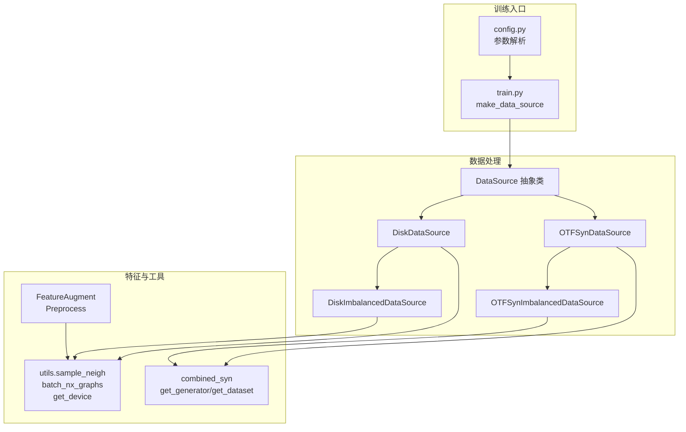
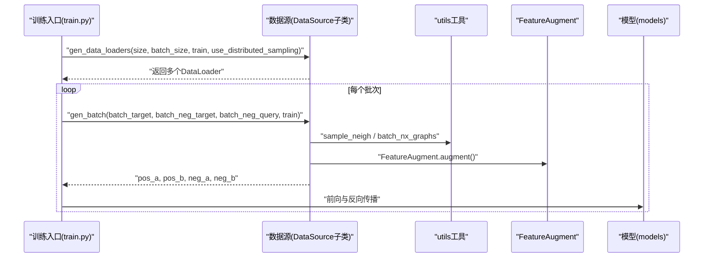
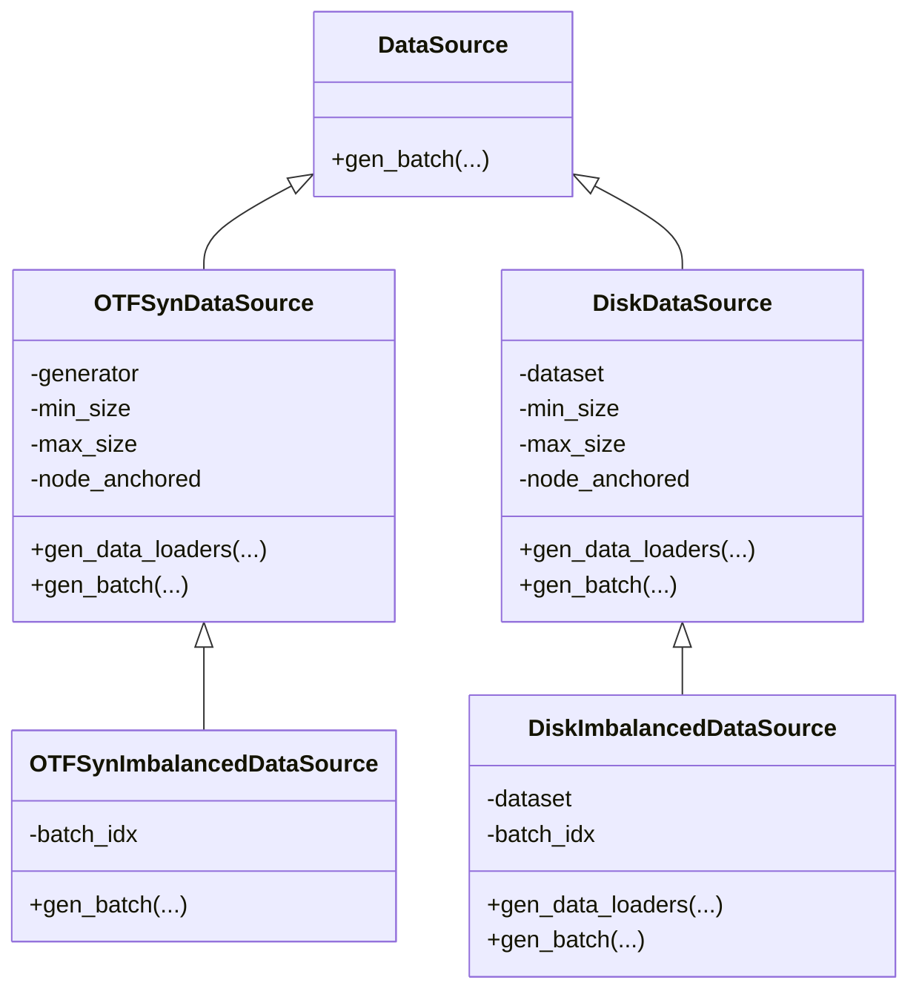
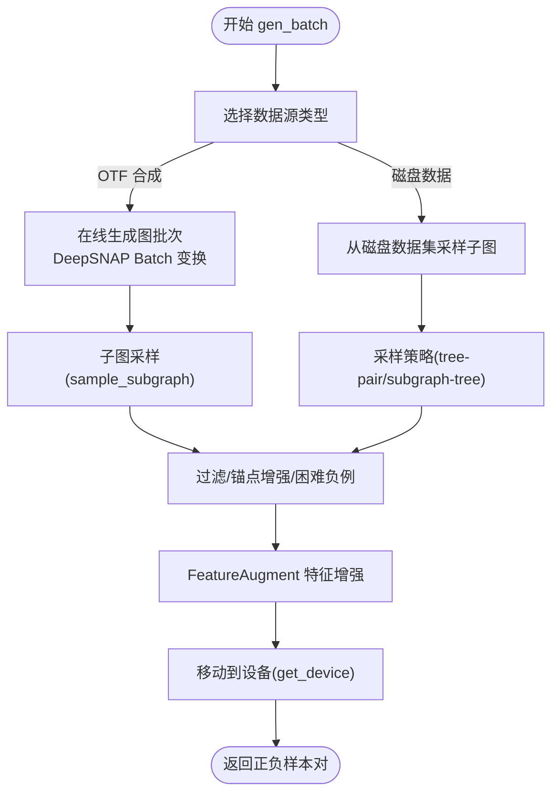
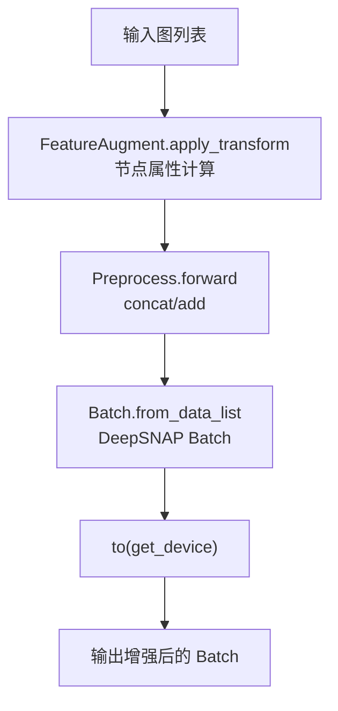
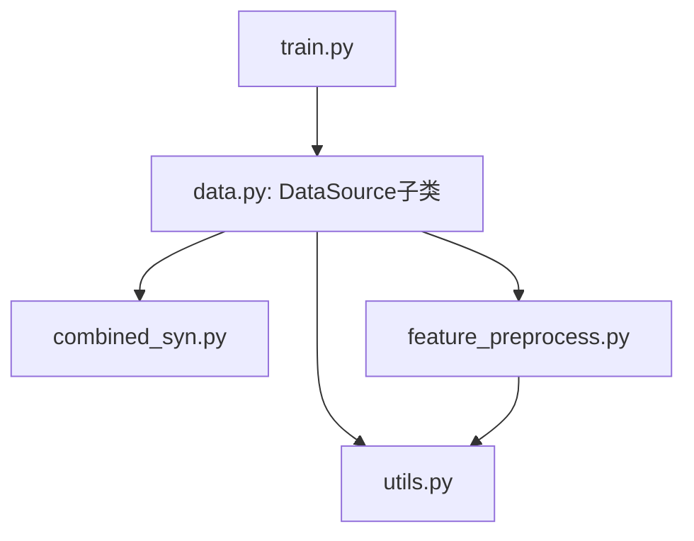

# 数据处理模块

<cite>
**本文引用的文件**
- [common/data.py](file://common/data.py)
- [common/feature_preprocess.py](file://common/feature_preprocess.py)
- [common/utils.py](file://common/utils.py)
- [common/combined_syn.py](file://common/combined_syn.py)
- [subgraph_matching/train.py](file://subgraph_matching/train.py)
- [subgraph_matching/config.py](file://subgraph_matching/config.py)
- [common/models.py](file://common/models.py)
</cite>

## 目录
1. [简介](#简介)
2. [项目结构](#项目结构)
3. [核心组件](#核心组件)
4. [架构总览](#架构总览)
5. [详细组件分析](#详细组件分析)
6. [依赖关系分析](#依赖关系分析)
7. [性能考量](#性能考量)
8. [故障排查指南](#故障排查指南)
9. [结论](#结论)
10. [附录](#附录)

## 简介
本文件系统性梳理 SPMiner 的数据处理模块，重点覆盖以下方面：
- 数据源管理机制：DiskDataSource、OTFSynDataSource、OTFSynImbalancedDataSource 等的实现原理与使用场景
- 数据加载器工作流：数据集划分、批次生成与分布式采样
- 数据预处理流程：特征增强、图变换与数据格式转换
- 数据集支持与配置项：真实世界数据集、合成图生成器、不平衡采样策略
- 实际使用示例与最佳实践：如何选择与配置不同数据源，性能优化与常见问题

## 项目结构
数据处理模块位于 common 子目录，围绕数据源抽象类 DataSource 及其子类展开；训练入口在 subgraph_matching/train.py 中通过 make_data_source 统一构造数据源实例；特征增强与预处理集中在 feature_preprocess.py；工具函数如邻域采样、设备选择等在 utils.py。

图表来源
- [common/data.py:77-388](file://common/data.py#L77-L388)
- [common/feature_preprocess.py:71-230](file://common/feature_preprocess.py#L71-L230)
- [common/utils.py:18-301](file://common/utils.py#L18-L301)
- [common/combined_syn.py:1-134](file://common/combined_syn.py#L1-L134)
- [subgraph_matching/train.py:61-89](file://subgraph_matching/train.py#L61-L89)
- [subgraph_matching/config.py:1-82](file://subgraph_matching/config.py#L1-L82)

章节来源
- [common/data.py:1-447](file://common/data.py#L1-L447)
- [common/feature_preprocess.py:1-230](file://common/feature_preprocess.py#L1-L230)
- [common/utils.py:1-302](file://common/utils.py#L1-L302)
- [common/combined_syn.py:1-134](file://common/combined_syn.py#L1-L134)
- [subgraph_matching/train.py:1-253](file://subgraph_matching/train.py#L1-L253)
- [subgraph_matching/config.py:1-82](file://subgraph_matching/config.py#L1-L82)

## 核心组件
- DataSource 抽象类：定义 gen_batch 接口，所有具体数据源需实现该方法以产出正负样本批次。
- DiskDataSource：基于磁盘上已存在的图数据集，按指定采样策略生成正负样本对。
- OTFSynDataSource：在线合成图数据源，使用合成生成器动态生成图批次，支持 DeepSNAP 变换与锚点节点增强。
- OTFSynImbalancedDataSource：不平衡在线合成数据源，按对采样并判定子图关系，形成不平衡正负样本。
- DiskImbalancedDataSource：不平衡磁盘数据源，与 DiskDataSource 类似，但采用对采样与缓存策略。
- FeatureAugment/Preprocess：节点特征增强与批量预处理模块，支持多种节点属性与可选的线性变换。
- utils 工具：邻域采样、设备选择、优化器构建、批量封装等。
- combined_syn：合成图生成器集合（ER、WS、BA、PowerLawCluster），提供在线生成与数据集封装。

章节来源
- [common/data.py:77-388](file://common/data.py#L77-L388)
- [common/feature_preprocess.py:71-230](file://common/feature_preprocess.py#L71-L230)
- [common/utils.py:18-301](file://common/utils.py#L18-L301)
- [common/combined_syn.py:1-134](file://common/combined_syn.py#L1-L134)

## 架构总览
数据处理模块的控制流如下：训练入口根据参数选择数据源类型，构造数据加载器，按批次调用数据源的 gen_batch 生成正负样本，随后进入模型训练循环。

图表来源
- [subgraph_matching/train.py:106-134](file://subgraph_matching/train.py#L106-L134)
- [common/data.py:98-114](file://common/data.py#L98-L114)
- [common/utils.py:18-301](file://common/utils.py#L18-L301)
- [common/feature_preprocess.py:186-192](file://common/feature_preprocess.py#L186-L192)
- [common/models.py:182-188](file://common/models.py#L182-L188)

## 详细组件分析

### DataSource 抽象类与子类
- 抽象接口：gen_batch 定义了数据源的核心职责，接收目标批次与负样本批次，返回正负样本对。
- OTFSynDataSource
  - 在线合成：使用 combined_syn.get_generator 与 get_dataset 动态生成图批次。
  - 批次生成：gen_batch 内部通过 sample_subgraph 对目标图进行子图采样，构造正负样本对；支持锚点节点增强与困难负例策略。
  - 分布式采样：当 use_distributed_sampling 为真时，使用 DistributedSampler 对生成器数据集进行分布式采样。
- OTFSynImbalancedDataSource
  - 不平衡策略：对两个随机图对进行判定是否为子图关系，缓存结果并按对输出，形成不平衡正负样本。
  - 缓存机制：将每批对的判定结果序列化至 data/cache，避免重复计算。
- DiskDataSource
  - 磁盘数据：基于 load_dataset 返回的训练/测试集，按 tree-pair 或 subgraph-tree 采样策略生成正负样本。
  - 锚点增强：可选 node_anchored，为正负样本添加锚点节点特征。
  - 过滤负样本：filter_negs 可过滤掉与正样本同构的负样本对。
- DiskImbalancedDataSource
  - 不平衡策略：与 DiskDataSource 类似，但采用对采样与缓存，形成不平衡样本分布。

图表来源
- [common/data.py:77-388](file://common/data.py#L77-L388)

章节来源
- [common/data.py:77-388](file://common/data.py#L77-L388)

### 数据加载器与批次生成
- DataLoader 构造：OTFSynDataSource 使用 TorchDataLoader 包装 GraphDataset，collate_fn 采用 DeepSNAP Batch.collate；DiskDataSource/DiskImbalancedDataSource 直接返回批次索引列表或 GraphDataset。
- 批次生成逻辑：
  - OTFSynDataSource：gen_batch 内部通过 sample_subgraph 对 DeepSNAP Batch 应用变换，生成正负样本对，并进行特征增强与设备迁移。
  - DiskDataSource：gen_batch 通过 utils.sample_neigh 在训练/测试集中采样子图，构造正负样本对，支持多种采样策略与过滤。
  - 不平衡数据源：对两图对进行判定并缓存，减少重复计算。
- 分布式采样：当 use_distributed_sampling 为真时，使用 torch.utils.data.distributed.DistributedSampler 对生成器数据集进行分布式采样。

图表来源
- [common/data.py:98-114](file://common/data.py#L98-L114)
- [common/data.py:290-354](file://common/data.py#L290-L354)
- [common/utils.py:18-53](file://common/utils.py#L18-L53)
- [common/feature_preprocess.py:186-192](file://common/feature_preprocess.py#L186-L192)

章节来源
- [common/data.py:98-114](file://common/data.py#L98-L114)
- [common/data.py:290-354](file://common/data.py#L290-L354)
- [common/utils.py:18-53](file://common/utils.py#L18-L53)
- [common/feature_preprocess.py:186-192](file://common/feature_preprocess.py#L186-L192)

### 数据预处理流程
- 特征增强（FeatureAugment）
  - 节点属性：度、介数中心性、平均最短路径、PageRank、聚类系数、身份矩阵对角线等。
  - 归一化与变换：提供图拉普拉斯归一化与幂次对角线提取等图信号处理能力。
  - 增强方式：concat 或 add，结合 Preprocess 模块对节点特征进行拼接或逐元素相加。
- 批量处理（batch_nx_graphs）
  - 将 NetworkX 图批量转换为 DeepSNAP Batch，应用 FeatureAugment 增强，最后迁移到设备。
  - 可选锚点：当传入 anchors 时，为每个图设置锚点节点特征。

图表来源
- [common/feature_preprocess.py:71-230](file://common/feature_preprocess.py#L71-L230)
- [common/utils.py:286-301](file://common/utils.py#L286-L301)

章节来源
- [common/feature_preprocess.py:71-230](file://common/feature_preprocess.py#L71-L230)
- [common/utils.py:286-301](file://common/utils.py#L286-L301)

### 数据集支持与配置
- 真实世界数据集（PyTorch Geometric/TU）：ENZYMES、PROTEINS、COX2、AIDS、REDDIT-BINARY、IMDB-BINARY、FIRSTMM_DB、DBLP_v1、PPI、QM9、graph_atlas、Facebook、AS-733/AS20000102。
- 合成图生成器：ER、WS、BA、PowerLawCluster，支持在线生成与批量封装。
- 配置参数（训练入口）：conv_type、method_type、batch_size、n_layers、hidden_dim、skip、dropout、n_batches、margin、dataset、eval_interval、val_size、model_path、opt_scheduler、node_anchored、test、n_workers 等。

章节来源
- [common/data.py:21-75](file://common/data.py#L21-L75)
- [common/combined_syn.py:1-134](file://common/combined_syn.py#L1-L134)
- [subgraph_matching/config.py:1-82](file://subgraph_matching/config.py#L1-L82)

### 使用示例与最佳实践
- 选择数据源
  - 合成平衡：dataset=syn-balanced
  - 合成不平衡：dataset=syn-imbalanced
  - 磁盘平衡：dataset=enzymes（或其他支持的真实数据集）
  - 磁盘不平衡：dataset=enzymes-imbalanced
- 关键参数
  - node_anchored：启用锚点节点增强，有助于提升子图匹配稳定性
  - batch_size：影响内存占用与吞吐，需结合显存与图规模调整
  - eval_interval/val_size：控制评估频率与验证集大小
  - n_workers：多进程并行生成训练步
- 性能优化建议
  - 合理设置 batch_size 与 n_workers，避免 OOM
  - 启用缓存（不平衡数据源已内置 pickle 缓存），减少重复计算
  - 使用分布式采样（OTFSynDataSource 支持）加速大规模合成数据训练
  - 在模型前使用 feat_preprocess 减少重复预处理开销

章节来源
- [subgraph_matching/train.py:61-89](file://subgraph_matching/train.py#L61-L89)
- [subgraph_matching/config.py:18-77](file://subgraph_matching/config.py#L18-L77)
- [common/data.py:98-114](file://common/data.py#L98-L114)

## 依赖关系分析
- 数据源依赖
  - OTFSynDataSource 依赖 combined_syn 提供的在线生成器与数据集封装
  - DiskDataSource/DiskImbalancedDataSource 依赖 utils.sample_neigh 与 utils.batch_nx_graphs
  - FeatureAugment 依赖 NetworkX 与 torch_geometric 工具进行图信号处理
- 训练入口依赖
  - train.py 通过 make_data_source 统一构造数据源，随后驱动多进程训练循环

图表来源
- [subgraph_matching/train.py:61-89](file://subgraph_matching/train.py#L61-L89)
- [common/data.py:77-388](file://common/data.py#L77-L388)
- [common/combined_syn.py:1-134](file://common/combined_syn.py#L1-L134)
- [common/utils.py:18-301](file://common/utils.py#L18-L301)
- [common/feature_preprocess.py:71-230](file://common/feature_preprocess.py#L71-L230)

章节来源
- [subgraph_matching/train.py:61-89](file://subgraph_matching/train.py#L61-L89)
- [common/data.py:77-388](file://common/data.py#L77-L388)
- [common/combined_syn.py:1-134](file://common/combined_syn.py#L1-L134)
- [common/utils.py:18-301](file://common/utils.py#L18-L301)
- [common/feature_preprocess.py:71-230](file://common/feature_preprocess.py#L71-L230)

## 性能考量
- 合成数据源
  - 在线生成可能带来 CPU/GPU 同步瓶颈，建议开启分布式采样与合理设置 n_workers
  - 使用缓存（不平衡数据源）可显著降低重复计算成本
- 磁盘数据源
  - 邻域采样采用按图大小加权策略，避免大图主导采样偏差
  - 过滤负样本可减少无效负例，提高训练效率
- 特征增强
  - FeatureAugment 的节点属性计算与 Preprocess 的 concat/add 会增加内存与计算开销，建议按需启用并合理设置维度
- 设备选择
  - get_device 优先使用 CUDA，若显存不足则回退 CPU，注意监控显存占用

[本节为通用性能建议，无需特定文件引用]

## 故障排查指南
- 训练卡住或 OOM
  - 检查 batch_size 与 n_workers 设置，适当降低 batch_size 或增加 n_workers
  - 确认分布式采样开关（use_distributed_sampling）与分布式环境配置
- 不平衡数据源缓存缺失
  - 确认 data/cache 目录存在，或手动创建；检查 pickle 缓存文件是否生成成功
- 子图判定异常
  - 检查 node_anchored 与锚点设置是否一致；确认图的节点属性是否正确写入
- 设备不匹配
  - 确认 get_device 返回设备与模型一致；避免将 Batch 放错设备

章节来源
- [common/data.py:240-262](file://common/data.py#L240-L262)
- [common/utils.py:235-243](file://common/utils.py#L235-L243)

## 结论
SPMiner 的数据处理模块通过 DataSource 抽象与多种数据源实现，兼顾真实世界数据与在线合成数据的训练需求；配合 FeatureAugment 与 utils 工具，实现了灵活的特征增强与高效的数据批处理；训练入口通过统一的数据源构造与多进程并行，支撑大规模子图匹配任务。建议在实际使用中结合数据规模与硬件条件，合理配置 batch_size、n_workers、node_anchored 与分布式采样，以获得最佳性能与稳定性。

[本节为总结性内容，无需特定文件引用]

## 附录
- 常用命令行参数（训练入口）
  - --dataset：数据集名称与采样方式组合（如 syn-balanced、enzymes-imbalanced）
  - --batch_size、--n_workers、--eval_interval、--val_size
  - --node_anchored：是否启用锚点节点增强
  - --conv_type、--method_type、--hidden_dim、--n_layers、--skip、--dropout
  - --margin、--opt_scheduler、--opt、--lr、--weight_decay
- 数据集支持清单（部分）
  - PyTorch Geometric/TU：ENZYMES、PROTEINS、COX2、AIDS、REDDIT-BINARY、IMDB-BINARY、FIRSTMM_DB、DBLP_v1、PPI、QM9
  - 自定义 SNAP 数据集：Facebook、AS-733/AS20000102（需放置边列表文件）

章节来源
- [subgraph_matching/config.py:18-77](file://subgraph_matching/config.py#L18-L77)
- [common/data.py:21-75](file://common/data.py#L21-L75)