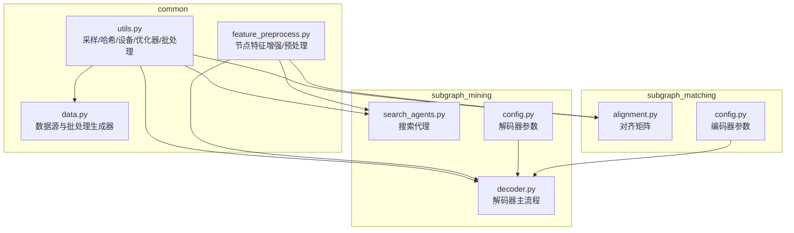
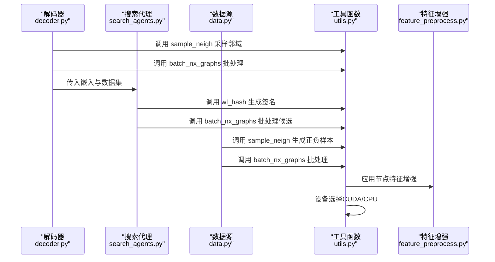
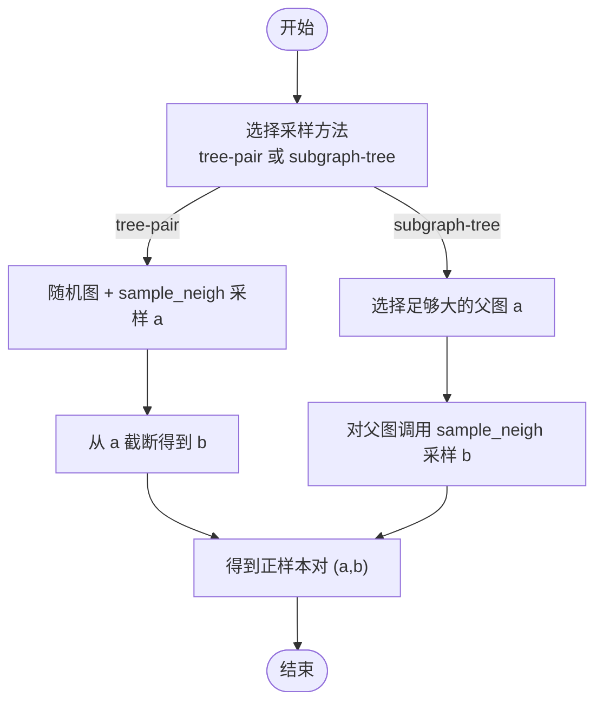
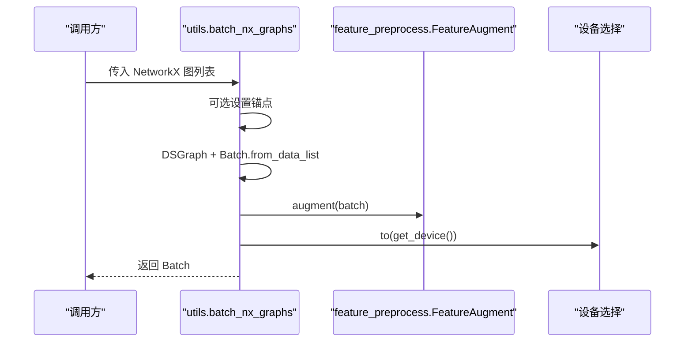
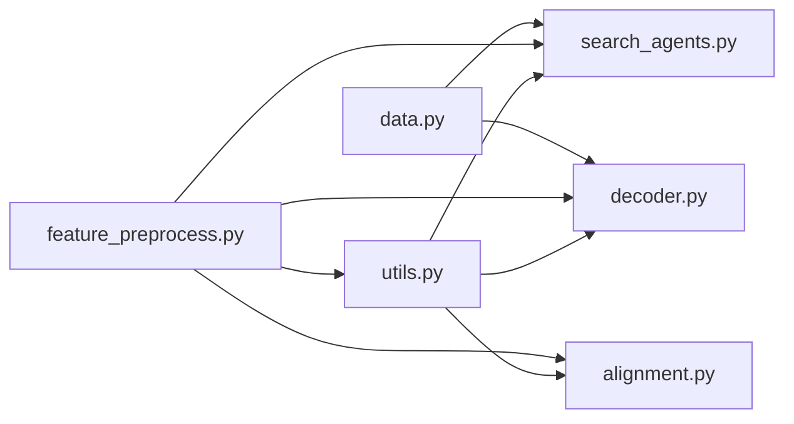

# 数据工具函数

<cite>
**本文引用的文件**
- [common/utils.py](file://common/utils.py)
- [common/data.py](file://common/data.py)
- [common/feature_preprocess.py](file://common/feature_preprocess.py)
- [subgraph_mining/search_agents.py](file://subgraph_mining/search_agents.py)
- [subgraph_mining/decoder.py](file://subgraph_mining/decoder.py)
- [subgraph_matching/alignment.py](file://subgraph_matching/alignment.py)
- [subgraph_mining/config.py](file://subgraph_mining/config.py)
- [subgraph_matching/config.py](file://subgraph_matching/config.py)
</cite>

## 目录
1. [简介](#简介)
2. [项目结构](#项目结构)
3. [核心组件](#核心组件)
4. [架构概览](#架构概览)
5. [详细组件分析](#详细组件分析)
6. [依赖分析](#依赖分析)
7. [性能考虑](#性能考虑)
8. [故障排除指南](#故障排除指南)
9. [结论](#结论)

## 简介
本文件系统性梳理 SPMiner 项目中的数据工具函数，重点覆盖以下方面：
- 图操作函数：邻域采样（sample_neigh）、批处理（batch_nx_graphs）等
- 设备管理函数：懒加载设备（get_device）、优化器构建（build_optimizer）
- 数据格式转换函数：从 SNAP 边列表加载图（load_snap_edgelist）
- 高级工具：WL 样式哈希（vec_hash、wl_hash）、枚举子图（enumerate_subgraph、extend_subgraph）
- 批处理工作机制：NetworkX 图批处理与张量化操作
- 错误处理与边界情况：空图、非连通图、设备不可用等

这些工具贯穿数据准备、模型训练、子图挖掘与匹配等全流程，是 SPMiner 的数据基础设施。

## 项目结构
SPMiner 的数据工具函数主要分布在 common 模块及其子模块中：
- common/utils.py：通用工具函数（采样、哈希、设备、优化器、批处理）
- common/data.py：数据源与批处理生成器（DiskDataSource、OTFSynDataSource 等）
- common/feature_preprocess.py：节点特征增强与预处理
- subgraph_mining/search_agents.py：搜索代理（贪心/MCTS），依赖工具函数
- subgraph_mining/decoder.py：解码器主流程，调用采样与批处理
- subgraph_matching/alignment.py：对齐矩阵构建，使用批处理
- 配置模块：参数解析（subgraph_mining/config.py、subgraph_matching/config.py）

**图表来源**
- [common/utils.py:18-301](file://common/utils.py#L18-L301)
- [common/data.py:77-429](file://common/data.py#L77-L429)
- [common/feature_preprocess.py:71-229](file://common/feature_preprocess.py#L71-L229)
- [subgraph_mining/search_agents.py:14-119](file://subgraph_mining/search_agents.py#L14-L119)
- [subgraph_mining/decoder.py:62-170](file://subgraph_mining/decoder.py#L62-L170)
- [subgraph_matching/alignment.py:34-59](file://subgraph_matching/alignment.py#L34-L59)
- [subgraph_mining/config.py:4-64](file://subgraph_mining/config.py#L4-L64)
- [subgraph_matching/config.py:4-77](file://subgraph_matching/config.py#L4-L77)

**章节来源**
- [common/utils.py:1-302](file://common/utils.py#L1-L302)
- [common/data.py:1-447](file://common/data.py#L1-L447)
- [common/feature_preprocess.py:1-230](file://common/feature_preprocess.py#L1-L230)
- [subgraph_mining/search_agents.py:1-442](file://subgraph_mining/search_agents.py#L1-L442)
- [subgraph_mining/decoder.py:1-276](file://subgraph_mining/decoder.py#L1-L276)
- [subgraph_matching/alignment.py:1-102](file://subgraph_matching/alignment.py#L1-L102)
- [subgraph_mining/config.py:1-65](file://subgraph_mining/config.py#L1-L65)
- [subgraph_matching/config.py:1-82](file://subgraph_matching/config.py#L1-L82)

## 核心组件
本节聚焦数据工具函数的关键实现与用途。

- 邻域采样函数
  - [sample_neigh:18-53](file://common/utils.py#L18-L53)：按图大小加权随机选择图，再从随机起点进行前沿扩展，直至达到目标节点数；若前沿耗尽导致节点不足则重新采样。
  - [enumerate_subgraph:121-138](file://common/utils.py#L121-L138) 与 [extend_subgraph:140-170](file://common/utils.py#L140-L170)：基于 ESU 思想枚举子图，按 WL 签名聚类，支持节点锚定。
  - [gen_baseline_queries_rand_esu:98-119](file://common/utils.py#L98-L119) 与 [gen_baseline_queries_mfinder:172-206](file://common/utils.py#L172-L206)：构造基线查询集，分别基于 ESU 和 mfinder 风格随机邻域采样。

- 批处理函数
  - [batch_nx_graphs:286-301](file://common/utils.py#L286-L301)：将 NetworkX 图列表转换为 DeepSNAP Batch，应用节点特征增强，自动分配到设备（CUDA/CPU）。

- 设备管理与优化器
  - [get_device:235-243](file://common/utils.py#L235-L243)：懒加载设备，优先 CUDA，否则 CPU。
  - [parse_optimizer:245-264](file://common/utils.py#L245-L264) 与 [build_optimizer:265-284](file://common/utils.py#L265-L284)：注册并构建优化器及调度器。

- 数据格式转换
  - [load_snap_edgelist:208-233](file://common/utils.py#L208-L233)：从 SNAP 风格边列表加载无向图，自动过滤注释行与空行，取最大连通子图。

- 高级哈希与特征
  - [vec_hash:55-68](file://common/utils.py#L55-L68) 与 [wl_hash:70-96](file://common/utils.py#L70-L96)：WL 风格哈希签名，用于节点表征更新与图签名。
  - [FeatureAugment.augment:186-192](file://common/feature_preprocess.py#L186-L192)：节点特征增强，支持多种统计特征与几何变换。

**章节来源**
- [common/utils.py:18-301](file://common/utils.py#L18-L301)
- [common/feature_preprocess.py:71-192](file://common/feature_preprocess.py#L71-L192)

## 架构概览
数据工具函数在 SPMiner 中的调用关系如下：

**图表来源**
- [subgraph_mining/decoder.py:125-170](file://subgraph_mining/decoder.py#L125-L170)
- [subgraph_mining/search_agents.py:84-119](file://subgraph_mining/search_agents.py#L84-L119)
- [common/data.py:290-354](file://common/data.py#L290-L354)
- [common/utils.py:18-301](file://common/utils.py#L18-L301)
- [common/feature_preprocess.py:186-192](file://common/feature_preprocess.py#L186-L192)

## 详细组件分析

### 邻域采样算法：树对采样与子图树采样
- 树对采样（tree-pair）
  - 步骤：随机选择目标图，调用 [sample_neigh:18-53](file://common/utils.py#L18-L53) 采样一个连通邻域 a；再从 a 中随机截断得到 b，形成正样本对 (a, b)，其中 b ⊂ a。
  - 特点：简单高效，适合构造强正样本。
- 子图树采样（subgraph-tree）
  - 步骤：先从数据集中随机选择一个足够大的图作为父图，令 a 为该图的所有节点；然后对该图调用 [sample_neigh:18-53](file://common/utils.py#L18-L53) 采样邻域 b；得到正样本对 (a, b)，其中 b ⊂ a。
  - 特点：更贴近“父图包含子图”的真实场景，适合评估模型对大图中子图的识别能力。

**图表来源**
- [common/data.py:290-354](file://common/data.py#L290-L354)
- [common/utils.py:18-53](file://common/utils.py#L18-L53)

**章节来源**
- [common/data.py:290-354](file://common/data.py#L290-L354)
- [common/utils.py:18-53](file://common/utils.py#L18-L53)

### 批处理函数：NetworkX 图批处理与张量化
- [batch_nx_graphs:286-301](file://common/utils.py#L286-L301) 的工作流程：
  1. 可选锚点设置：若提供锚点列表，为每个图的节点属性写入锚点指示。
  2. DeepSNAP 转换：将 NetworkX 图转为 DeepSNAP Graph，再合并为 Batch。
  3. 特征增强：调用 [FeatureAugment.augment:186-192](file://common/feature_preprocess.py#L186-L192) 增加节点特征（如度、介数中心性、路径长度、PageRank、聚类系数等）。
  4. 设备迁移：调用 [get_device:235-243](file://common/utils.py#L235-L243) 获取设备并移动到该设备。
- 适用场景：
  - 模型嵌入计算（如解码器主流程）
  - 子图匹配对齐矩阵构建
  - 搜索代理候选嵌入批量获取

**图表来源**
- [common/utils.py:286-301](file://common/utils.py#L286-L301)
- [common/feature_preprocess.py:186-192](file://common/feature_preprocess.py#L186-L192)
- [common/utils.py:235-243](file://common/utils.py#L235-L243)

**章节来源**
- [common/utils.py:286-301](file://common/utils.py#L286-L301)
- [common/feature_preprocess.py:71-192](file://common/feature_preprocess.py#L71-L192)

### 设备管理与优化器
- [get_device:235-243](file://common/utils.py#L235-L243)：懒加载设备，首次调用时确定 CUDA/CPU，后续复用缓存。
- [parse_optimizer:245-264](file://common/utils.py#L245-L264)：注册优化器相关参数（类型、调度器、重启步数、衰减步长与比率、学习率、梯度裁剪、权重衰减）。
- [build_optimizer:265-284](file://common/utils.py#L265-L284)：根据参数创建优化器与学习率调度器，支持 Adam、SGD、RMSprop、Adagrad 及 Step、Cosine 调度器。

**章节来源**
- [common/utils.py:235-284](file://common/utils.py#L235-L284)

### 数据格式转换：SNAP 边列表加载
- [load_snap_edgelist:208-233](file://common/utils.py#L208-L233)：
  - 支持空格或制表符分隔的边，自动跳过空行与以 '#' 开头的注释行。
  - 自动取最大连通子图，保证后续子图采样的连通性。
  - 返回 NetworkX Graph。

**章节来源**
- [common/utils.py:208-233](file://common/utils.py#L208-L233)

### 高级哈希与特征：WL 样式哈希与特征增强
- [vec_hash:55-68](file://common/utils.py#L55-L68)：固定随机掩码与 Python 哈希组合，构造可重复的离散编码，用于 WL 迭代中的节点表征更新。
- [wl_hash:70-96](file://common/utils.py#L70-L96)：WL 风格哈希签名，迭代聚合节点向量，最终将节点向量求和后转为 tuple 作为“结构签名”，用于同构/近同构候选归并计数。
- [FeatureAugment.augment:186-192](file://common/feature_preprocess.py#L186-L192)：节点特征增强，支持多种统计特征与几何变换，增强图表示能力。

**章节来源**
- [common/utils.py:55-96](file://common/utils.py#L55-L96)
- [common/feature_preprocess.py:71-192](file://common/feature_preprocess.py#L71-L192)

### 数据源与批处理生成器
- DiskDataSource.gen_batch：支持两种采样方法（tree-pair、subgraph-tree），生成正负样本对，并通过 [batch_nx_graphs:286-301](file://common/utils.py#L286-L301) 批处理。
- OTFSynDataSource.gen_batch：在线生成合成图，动态采样子图，支持硬负例与锚点设置。
- OTFSynImbalancedDataSource.gen_batch：不平衡数据源，缓存正负样本对，减少重复计算。
- DiskImbalancedDataSource.gen_data_loaders/gen_batch：基于真实数据集的不平衡采样与缓存。

**章节来源**
- [common/data.py:271-429](file://common/data.py#L271-L429)
- [common/utils.py:286-301](file://common/utils.py#L286-L301)

## 依赖分析
- 工具函数依赖关系
  - [sample_neigh:18-53](file://common/utils.py#L18-L53) 依赖 numpy、scipy.stats、random、networkx。
  - [wl_hash:70-96](file://common/utils.py#L70-L96) 依赖 numpy、networkx。
  - [batch_nx_graphs:286-301](file://common/utils.py#L286-L301) 依赖 deepsnap、torch、torch_geometric、feature_preprocess。
  - [get_device:235-243](file://common/utils.py#L235-L243) 依赖 torch。
  - [load_snap_edgelist:208-233](file://common/utils.py#L208-L233) 依赖 networkx、numpy。
- 搜索代理与解码器依赖
  - [SearchAgent._get_candidate_embs:84-119](file://subgraph_mining/search_agents.py#L84-L119) 依赖 [batch_nx_graphs:286-301](file://common/utils.py#L286-L301)。
  - [decoder.pattern_growth:125-170](file://subgraph_mining/decoder.py#L125-L170) 依赖 [sample_neigh:18-53](file://common/utils.py#L18-L53) 与 [batch_nx_graphs:286-301](file://common/utils.py#L286-L301)。
  - [alignment.gen_alignment_matrix:34-59](file://subgraph_matching/alignment.py#L34-L59) 依赖 [batch_nx_graphs:286-301](file://common/utils.py#L286-L301)。

**图表来源**
- [common/utils.py:18-301](file://common/utils.py#L18-L301)
- [common/feature_preprocess.py:71-192](file://common/feature_preprocess.py#L71-L192)
- [subgraph_mining/search_agents.py:84-119](file://subgraph_mining/search_agents.py#L84-L119)
- [subgraph_mining/decoder.py:125-170](file://subgraph_mining/decoder.py#L125-L170)
- [subgraph_matching/alignment.py:34-59](file://subgraph_matching/alignment.py#L34-L59)
- [common/data.py:271-354](file://common/data.py#L271-L354)

**章节来源**
- [common/utils.py:18-301](file://common/utils.py#L18-L301)
- [common/feature_preprocess.py:71-192](file://common/feature_preprocess.py#L71-L192)
- [subgraph_mining/search_agents.py:84-119](file://subgraph_mining/search_agents.py#L84-L119)
- [subgraph_mining/decoder.py:125-170](file://subgraph_mining/decoder.py#L125-L170)
- [subgraph_matching/alignment.py:34-59](file://subgraph_matching/alignment.py#L34-L59)
- [common/data.py:271-354](file://common/data.py#L271-L354)

## 性能考虑
- 邻域采样
  - 树对采样在大图上扩展成本较高，建议控制目标邻域大小与前沿扩展步数。
  - 若图非连通，需预先取最大连通子图，避免采样失败。
- 批处理
  - [batch_nx_graphs:286-301](file://common/utils.py#L286-L301) 会进行特征增强与设备迁移，建议合理设置批大小以平衡内存与吞吐。
  - 锚点设置会为每个节点写入特征，注意节点数量较多时的内存开销。
- 设备管理
  - [get_device:235-243](file://common/utils.py#L235-L243) 采用懒加载，避免重复初始化；在多 GPU 场景下建议显式设置设备。
- 哈希与特征
  - [wl_hash:70-96](file://common/utils.py#L70-L96) 的维度会影响计算复杂度，建议根据任务规模调整。
  - [FeatureAugment.augment:186-192](file://common/feature_preprocess.py#L186-L192) 的特征维度越大，计算与内存开销越高。

[本节提供一般性指导，无需特定文件分析]

## 故障排除指南
- 设备不可用
  - 现象：CUDA 不可用时仍尝试使用 CUDA。
  - 处理：检查 [get_device:235-243](file://common/utils.py#L235-L243) 的缓存逻辑，确认环境变量与驱动版本。
- 空图或非连通图
  - 现象：SNAP 边列表加载后图为空或非连通。
  - 处理：使用 [load_snap_edgelist:208-233](file://common/utils.py#L208-L233) 自动取最大连通子图；在数据源中再次确认图有效性。
- 批处理维度不匹配
  - 现象：特征增强后节点特征维度与模型期望不一致。
  - 处理：检查 [FeatureAugment.augment:186-192](file://common/feature_preprocess.py#L186-L192) 的配置与 [Preprocess.forward:216-229](file://common/feature_preprocess.py#L216-L229) 的拼接/相加策略。
- 采样失败
  - 现象：前沿耗尽导致无法达到目标邻域大小。
  - 处理：在 [sample_neigh:18-53](file://common/utils.py#L18-L53) 中重新采样；或增大目标邻域大小。
- 优化器参数缺失
  - 现象：构建优化器时报错。
  - 处理：使用 [parse_optimizer:245-264](file://common/utils.py#L245-L264) 注册参数，并在 [build_optimizer:265-284](file://common/utils.py#L265-L284) 中正确传入。

**章节来源**
- [common/utils.py:235-284](file://common/utils.py#L235-L284)
- [common/utils.py:208-233](file://common/utils.py#L208-L233)
- [common/feature_preprocess.py:186-229](file://common/feature_preprocess.py#L186-L229)
- [common/utils.py:18-53](file://common/utils.py#L18-L53)

## 结论
SPMiner 的数据工具函数围绕“邻域采样—批处理—特征增强—设备管理”这一主线，提供了高效、可扩展的数据处理能力。邻域采样算法（树对采样与子图树采样）为正负样本生成提供了稳健策略；批处理函数将 NetworkX 图无缝转换为深度学习框架可处理的张量形式，并集成特征增强与设备迁移；哈希与数据源工具进一步提升了模型训练与子图挖掘的稳定性与效率。通过合理的参数配置与错误处理策略，可在大规模图数据上取得良好性能。