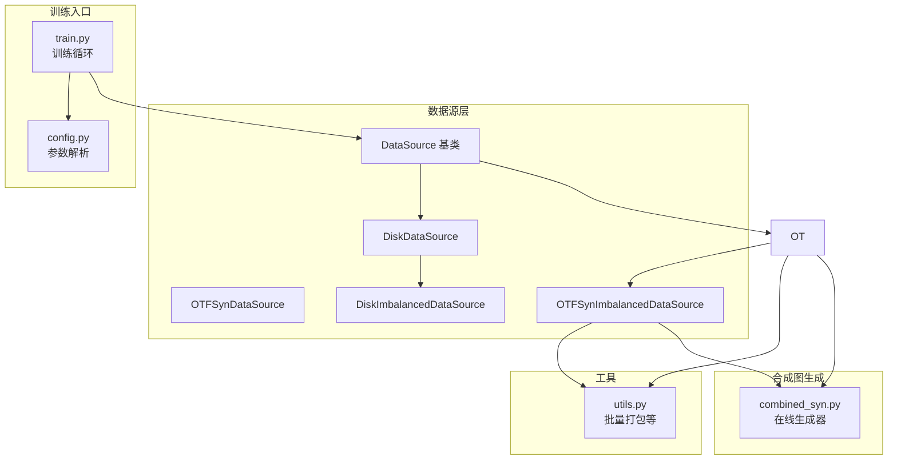
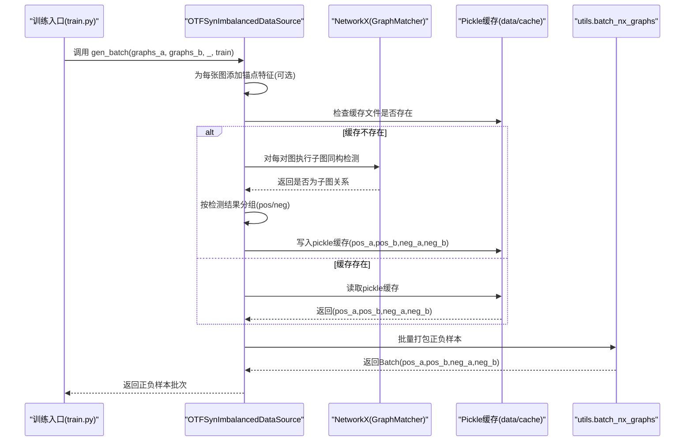
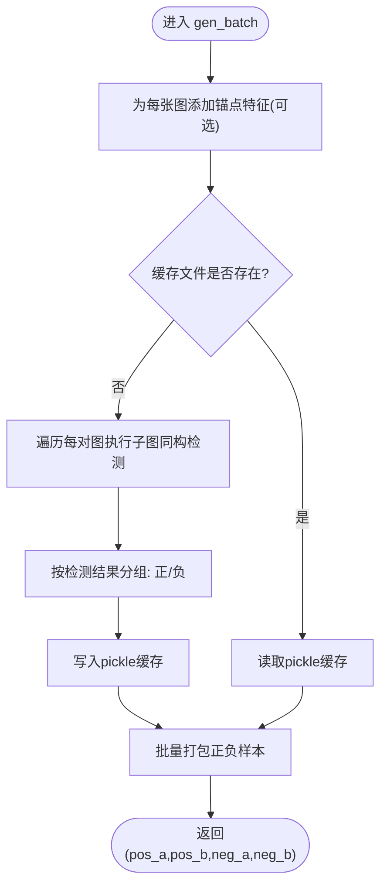
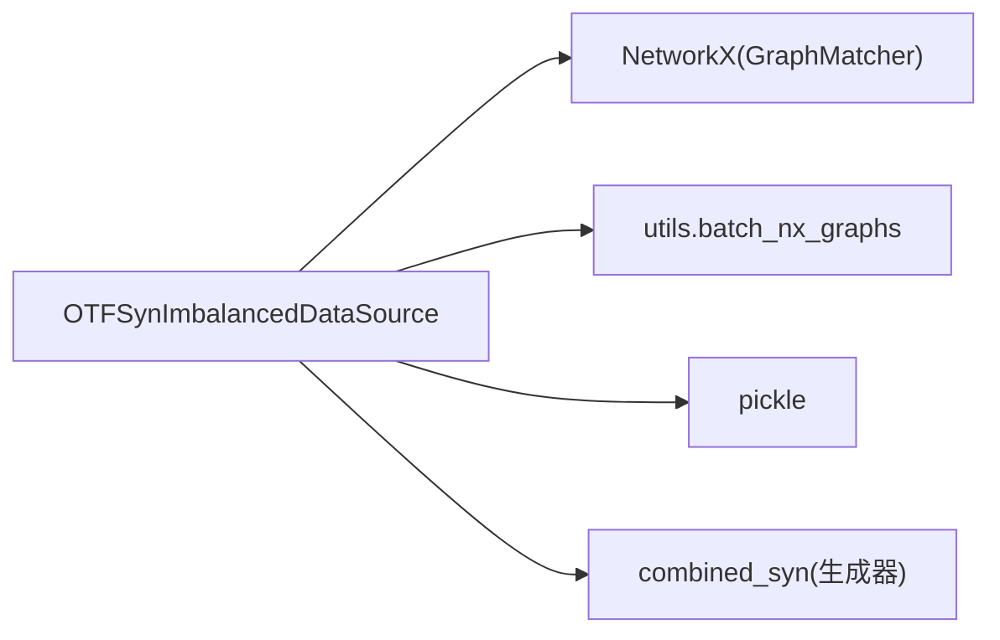

# 不平衡在线合成数据源

<cite>
**本文引用的文件**
- [common/data.py](file://common/data.py)
- [common/combined_syn.py](file://common/combined_syn.py)
- [subgraph_matching/train.py](file://subgraph_matching/train.py)
- [subgraph_matching/config.py](file://subgraph_matching/config.py)
- [common/utils.py](file://common/utils.py)
</cite>

## 目录
1. [简介](#简介)
2. [项目结构](#项目结构)
3. [核心组件](#核心组件)
4. [架构总览](#架构总览)
5. [详细组件分析](#详细组件分析)
6. [依赖关系分析](#依赖关系分析)
7. [性能考量](#性能考量)
8. [故障排查指南](#故障排查指南)
9. [结论](#结论)
10. [附录](#附录)

## 简介
本文件围绕 OTFSynImbalancedDataSource（不平衡在线合成数据源）展开，系统阐述其在不平衡数据生成方面的实现原理，包括：
- 2:1 或更高比例的正负例采样策略
- 困难负例的使用机制
- 与 OTFSynDataSource 的区别
- gen_batch 方法中 pos_a、pos_b、neg_a、neg_b 列表生成逻辑
- pickle 缓存文件的存储与读取机制
- 在模型推理场景中的使用示例、参数配置建议与性能优化技巧

## 项目结构
本项目与数据源相关的关键文件如下：
- common/data.py：定义数据源基类与具体实现（含 OTFSynDataSource、OTFSynImbalancedDataSource、DiskDataSource、DiskImbalancedDataSource）
- common/combined_syn.py：在线合成图生成器（用于 OTFSynDataSource 系列）
- subgraph_matching/train.py：训练入口，负责根据命令行参数选择数据源并驱动训练循环
- subgraph_matching/config.py：训练参数解析与默认值
- common/utils.py：通用工具函数（如批量图打包等）

图表来源
- [common/data.py:77-447](file://common/data.py#L77-L447)
- [common/combined_syn.py:1-134](file://common/combined_syn.py#L1-L134)
- [subgraph_matching/train.py:1-253](file://subgraph_matching/train.py#L1-L253)
- [subgraph_matching/config.py:1-82](file://subgraph_matching/config.py#L1-L82)
- [common/utils.py:1-200](file://common/utils.py#L1-L200)

章节来源
- [common/data.py:77-447](file://common/data.py#L77-L447)
- [common/combined_syn.py:1-134](file://common/combined_syn.py#L1-L134)
- [subgraph_matching/train.py:1-253](file://subgraph_matching/train.py#L1-L253)
- [subgraph_matching/config.py:1-82](file://subgraph_matching/config.py#L1-L82)
- [common/utils.py:1-200](file://common/utils.py#L1-L200)

## 核心组件
- OTFSynDataSource：在线生成合成数据，支持平衡采样与困难负例策略，返回正负样本对用于训练。
- OTFSynImbalancedDataSource：继承自 OTFSynDataSource，但采用不平衡采样策略，按子图同构关系动态划分正负样本，支持缓存以提升重复训练效率。
- DiskDataSource/DiskImbalancedDataSource：使用磁盘上真实数据集，分别提供平衡与不平衡采样策略。
- combined_syn：提供多种图生成器（ER、WS、BA、PowerLawCluster），用于在线合成图数据。
- 训练入口 train.py：根据命令行参数选择数据源，驱动多进程训练循环。

章节来源
- [common/data.py:81-214](file://common/data.py#L81-L214)
- [common/data.py:216-269](file://common/data.py#L216-L269)
- [common/data.py:271-354](file://common/data.py#L271-L354)
- [common/data.py:356-429](file://common/data.py#L356-L429)
- [common/combined_syn.py:101-117](file://common/combined_syn.py#L101-L117)
- [subgraph_matching/train.py:61-89](file://subgraph_matching/train.py#L61-L89)

## 架构总览
OTFSynImbalancedDataSource 的核心流程：
- 输入两个图批次（graphs_a、graphs_b）
- 为每张图添加锚点特征（可选）
- 对每一对图执行子图同构检测（GraphMatcher）
- 将满足条件的配对划分为正样本（pos_a、pos_b），其余为负样本（neg_a、neg_b）
- 将正负样本分别打包为 Batch，返回给训练循环
- 通过 pickle 缓存每批次结果，避免重复计算

图表来源
- [common/data.py:230-269](file://common/data.py#L230-L269)
- [common/data.py:390-429](file://common/data.py#L390-L429)
- [common/utils.py:1-200](file://common/utils.py#L1-L200)

## 详细组件分析

### OTFSynImbalancedDataSource 组件分析
- 不平衡采样策略
  - 与 OTFSynDataSource 的平衡采样不同，OTFSynImbalancedDataSource 不强制 1:1 正负例比例，而是直接对输入的图对执行子图同构检测，将满足条件的配对作为正样本，其余作为负样本。
  - 这种设计模拟真实推理场景中“子图关系较为稀有”的情况，从而提升模型在不平衡数据上的鲁棒性。
- 困难负例机制
  - 在 OTFSynDataSource 中，gen_batch 提供了困难负例采样逻辑（通过 hard_neg_idxs 控制），但在 OTFSynImbalancedDataSource 的 gen_batch 中并未直接使用该机制，而是完全依赖子图同构检测结果。
  - 因此，若需引入困难负例，可在 OTFSynImbalancedDataSource 的 gen_batch 中复用类似逻辑，或在上游数据准备阶段加入困难负例采样。
- gen_batch 中 pos_a、pos_b、neg_a、neg_b 列表生成逻辑
  - 为每张图添加锚点特征（可选），便于节点锚定场景下的匹配。
  - 对每对图执行子图同构检测（GraphMatcher），若满足则加入正样本，否则加入负样本。
  - 最终将正负样本分别打包为 Batch，返回给训练循环。
- pickle 缓存机制
  - 缓存文件命名包含 node_anchored 标识与 batch_idx，避免重复计算。
  - 首次运行会写入缓存，后续运行直接读取，显著减少重复计算开销。
- 与 OTFSynDataSource 的区别
  - OTFSynDataSource 的 gen_batch 会生成正负样本对并进行增强（augment），同时支持困难负例策略。
  - OTFSynImbalancedDataSource 的 gen_batch 直接基于同构检测划分正负样本，不进行额外的正负样本生成与增强，且具备缓存能力。

图表来源
- [common/data.py:230-269](file://common/data.py#L230-L269)

章节来源
- [common/data.py:216-269](file://common/data.py#L216-L269)
- [common/data.py:81-214](file://common/data.py#L81-L214)

### 与 OTFSynDataSource 的差异对比
- 采样策略
  - OTFSynDataSource：平衡采样 + 困难负例策略，适合标准训练场景。
  - OTFSynImbalancedDataSource：不平衡采样，直接基于同构检测划分正负样本，适合模拟真实推理场景。
- 数据生成
  - OTFSynDataSource：通过在线生成器（combined_syn）生成正负样本，并进行增强。
  - OTFSynImbalancedDataSource：直接使用输入的图对，不进行额外生成与增强。
- 缓存机制
  - OTFSynDataSource：未提供针对不平衡采样的缓存。
  - OTFSynImbalancedDataSource：提供 pickle 缓存，显著降低重复计算成本。

章节来源
- [common/data.py:81-214](file://common/data.py#L81-L214)
- [common/data.py:216-269](file://common/data.py#L216-L269)

### 与 DiskImbalancedDataSource 的关系
- DiskImbalancedDataSource 与 OTFSynImbalancedDataSource 类似，均采用不平衡采样策略与缓存机制。
- 区别在于数据来源：前者使用磁盘上真实数据集，后者使用在线合成图生成器。
- 两者在 gen_batch 中均通过 GraphMatcher 判断子图关系，并将结果写入/读取缓存。

章节来源
- [common/data.py:356-429](file://common/data.py#L356-L429)

### 训练入口与参数配置
- 训练入口 train.py
  - 根据命令行参数选择数据源（syn-balanced、syn-imbalanced、disk-balanced、disk-imbalanced）。
  - 通过 gen_data_loaders 生成数据加载器，随后在训练循环中调用 data_source.gen_batch 获取批次数据。
- 参数配置 config.py
  - 提供 dataset、batch_size、n_layers、hidden_dim、node_anchored 等关键参数，默认值偏向稳定训练。
  - node_anchored 参数影响锚点特征的添加，进而影响子图同构检测的匹配条件。

章节来源
- [subgraph_matching/train.py:61-89](file://subgraph_matching/train.py#L61-L89)
- [subgraph_matching/train.py:91-151](file://subgraph_matching/train.py#L91-L151)
- [subgraph_matching/config.py:18-77](file://subgraph_matching/config.py#L18-L77)

## 依赖关系分析
- OTFSynImbalancedDataSource 依赖 NetworkX 的 GraphMatcher 进行子图同构判断。
- 依赖 utils.batch_nx_graphs 将多个 NetworkX 图批量打包为 Batch。
- 依赖 pickle 进行缓存文件的序列化与反序列化。
- 依赖 combined_syn 提供在线合成图生成器（尽管在不平衡数据源中不直接生成正负样本，但可能用于其他场景）。

图表来源
- [common/data.py:230-269](file://common/data.py#L230-L269)
- [common/utils.py:1-200](file://common/utils.py#L1-L200)
- [common/combined_syn.py:101-117](file://common/combined_syn.py#L101-L117)

章节来源
- [common/data.py:230-269](file://common/data.py#L230-L269)
- [common/utils.py:1-200](file://common/utils.py#L1-L200)
- [common/combined_syn.py:101-117](file://common/combined_syn.py#L101-L117)

## 性能考量
- 缓存策略
  - 建议在首次运行后保留 data/cache 目录，以便后续批次直接读取缓存，避免重复的 GraphMatcher 计算。
  - 若需要强制重新计算，可删除缓存文件或调整 batch_idx。
- 锚点特征
  - node_anchored 选项会影响子图同构检测的匹配条件，建议在需要锚点约束时开启，以提升匹配精度。
- 批处理与多进程
  - 训练入口支持多进程 worker 并行生产训练步，合理设置 n_workers 可提升吞吐。
- 计算复杂度
  - 子图同构检测的时间复杂度较高，建议结合缓存与合理的 batch_size 控制整体训练时间。

章节来源
- [common/data.py:230-269](file://common/data.py#L230-L269)
- [subgraph_matching/train.py:152-222](file://subgraph_matching/train.py#L152-L222)

## 故障排查指南
- 缓存文件缺失或损坏
  - 现象：每次运行都重新计算，速度较慢。
  - 处理：确认 data/cache 目录存在且权限正确；删除损坏的缓存文件以触发重新生成。
- 子图同构检测结果异常
  - 现象：正负样本比例异常或全为负样本。
  - 处理：检查 node_anchored 设置；确认输入图对已正确添加锚点特征；必要时关闭锚点匹配以验证基础同构检测。
- 内存与显存占用过高
  - 现象：大批量打包导致内存溢出。
  - 处理：减小 batch_size；仅在存在正样本时进行打包；确保及时释放中间变量。
- 训练不稳定
  - 现象：损失震荡或准确率波动较大。
  - 处理：调整学习率、margin 等超参数；检查数据源是否正确加载；确认缓存一致性。

章节来源
- [common/data.py:230-269](file://common/data.py#L230-L269)
- [subgraph_matching/train.py:91-151](file://subgraph_matching/train.py#L91-L151)

## 结论
OTFSynImbalancedDataSource 通过不平衡采样与缓存机制，有效模拟真实推理场景中的稀疏正样本分布，同时显著降低重复计算成本。与 OTFSynDataSource 相比，它更贴近实际应用需求，适合在模型推理场景中进行训练。建议结合合理的参数配置与性能优化策略，以获得稳定高效的训练效果。

## 附录
- 实际使用示例（命令行）
  - 选择不平衡合成数据源：--dataset syn-imbalanced --node_anchored
  - 设置批大小与训练轮数：--batch_size 64 --n_batches 10000
  - 多进程训练：--n_workers 4
- 参数配置建议
  - node_anchored：在需要锚点约束时开启，有助于提升匹配稳定性。
  - batch_size：根据显存与缓存容量合理设置，避免内存溢出。
  - n_workers：根据 CPU 核心数与 I/O 能力设置，提升吞吐。
- 性能优化技巧
  - 保持 data/cache 目录长期可用，避免重复计算。
  - 在大规模实验中，优先使用不平衡数据源以提升模型泛化能力。
  - 定期清理旧缓存文件，避免磁盘空间占用过大。

章节来源
- [subgraph_matching/config.py:18-77](file://subgraph_matching/config.py#L18-L77)
- [subgraph_matching/train.py:61-89](file://subgraph_matching/train.py#L61-L89)