# 不平衡磁盘数据源

<cite>
**本文档引用的文件**
- [data.py](file://common/data.py)
- [utils.py](file://common/utils.py)
- [combined_syn.py](file://common/combined_syn.py)
- [train.py](file://subgraph_matching/train.py)
- [config.py](file://subgraph_mining/config.py)
</cite>

## 目录
1. [简介](#简介)
2. [项目结构](#项目结构)
3. [核心组件](#核心组件)
4. [架构概览](#架构概览)
5. [详细组件分析](#详细组件分析)
6. [依赖关系分析](#依赖关系分析)
7. [性能考虑](#性能考虑)
8. [故障排除指南](#故障排除指南)
9. [结论](#结论)

## 简介

DiskImbalancedDataSource 是一个专门设计用于处理不平衡真实数据集的子图匹配数据源。它结合了磁盘数据集的持久化存储和不平衡采样策略，能够从真实的图数据库中随机采样并判断子图关系，特别适用于现实世界的复杂网络分析场景。

该数据源的核心特点是：
- **不平衡采样**：模拟现实世界中子图关系稀有但重要的特性
- **磁盘数据集集成**：直接使用已存在的真实数据集
- **缓存机制**：通过文件系统缓存采样结果以提高性能
- **锚点节点支持**：可选的节点锚定功能增强模型训练效果

## 项目结构

该项目采用模块化的组织方式，主要组件分布如下：

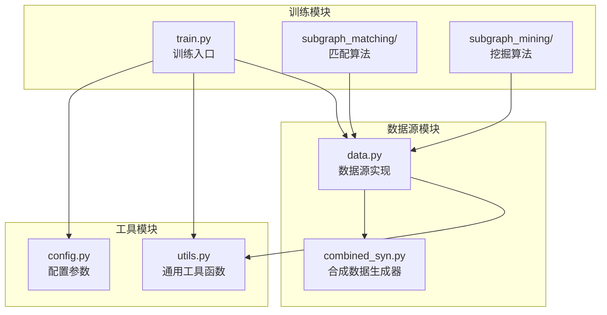

**图表来源**
- [data.py:1-447](file://common/data.py#L1-L447)
- [utils.py:1-302](file://common/utils.py#L1-L302)
- [train.py:1-253](file://subgraph_matching/train.py#L1-L253)

**章节来源**
- [data.py:1-447](file://common/data.py#L1-L447)
- [train.py:1-253](file://subgraph_matching/train.py#L1-L253)

## 核心组件

### DiskImbalancedDataSource 类概述

DiskImbalancedDataSource 继承自 OTFSynDataSource，专门用于处理来自磁盘的真实数据集。其核心功能包括：

- **数据集加载**：从指定的数据集名称加载预定义的真实图集合
- **不平衡采样**：随机采样图对并判断是否存在子图关系
- **缓存管理**：将采样结果缓存到文件系统中
- **批处理生成**：生成正例和负例的批次数据

### 关键属性和方法

| 属性/方法 | 类型 | 描述 |
|-----------|------|------|
| `dataset_name` | 字符串 | 数据集名称标识符 |
| `train_set` | 列表 | 训练集图列表 |
| `test_set` | 列表 | 测试集图列表 |
| `batch_idx` | 整数 | 当前批次索引 |
| `node_anchored` | 布尔值 | 是否启用节点锚定 |
| `gen_data_loaders()` | 方法 | 生成数据加载器 |
| `gen_batch()` | 方法 | 生成批次数据 |

**章节来源**
- [data.py:356-429](file://common/data.py#L356-L429)

## 架构概览

DiskImbalancedDataSource 的整体架构体现了数据驱动的设计理念：

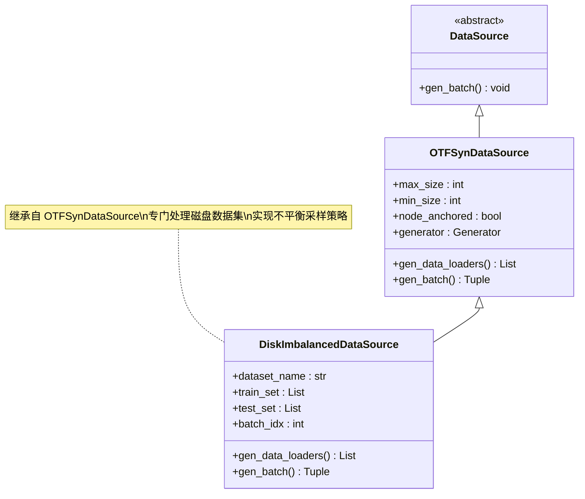

**图表来源**
- [data.py:77-429](file://common/data.py#L77-L429)

### 数据流架构

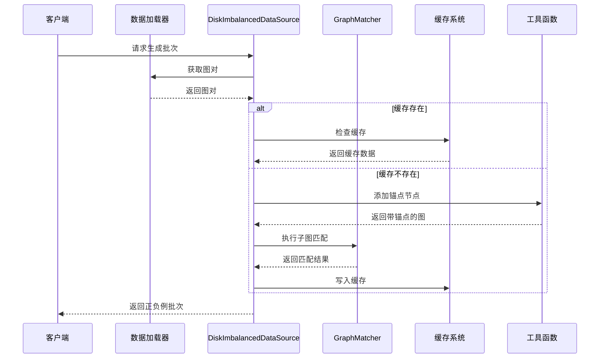

**图表来源**
- [data.py:390-429](file://common/data.py#L390-L429)
- [utils.py:18-53](file://common/utils.py#L18-L53)

## 详细组件分析

### 不平衡采样机制

DiskImbalancedDataSource 的核心创新在于其不平衡采样策略，该策略模拟了现实世界中子图关系的稀有性：

#### 采样流程

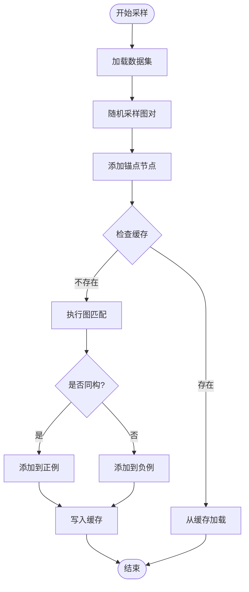

**图表来源**
- [data.py:390-429](file://common/data.py#L390-L429)

#### 子图关系判断

该组件使用 NetworkX 的 GraphMatcher 来判断两个图之间是否存在子图关系：

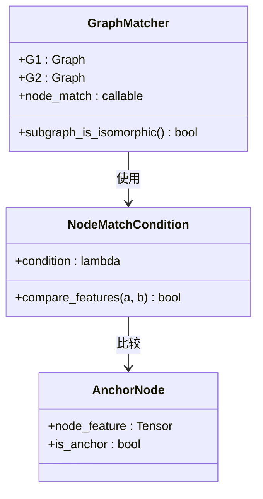

**图表来源**
- [data.py:404-406](file://common/data.py#L404-L406)

**章节来源**
- [data.py:390-429](file://common/data.py#L390-L429)

### 缓存机制实现

为了提高性能，DiskImbalancedDataSource 实现了智能的缓存系统：

#### 缓存策略

| 缓存键 | 内容 | 用途 |
|--------|------|------|
| `dataset_name` | 数据集名称 | 区分不同数据集 |
| `node_anchored` | 锚点状态 | 区分锚点配置 |
| `batch_idx` | 批次索引 | 区分不同批次 |

#### 缓存生命周期

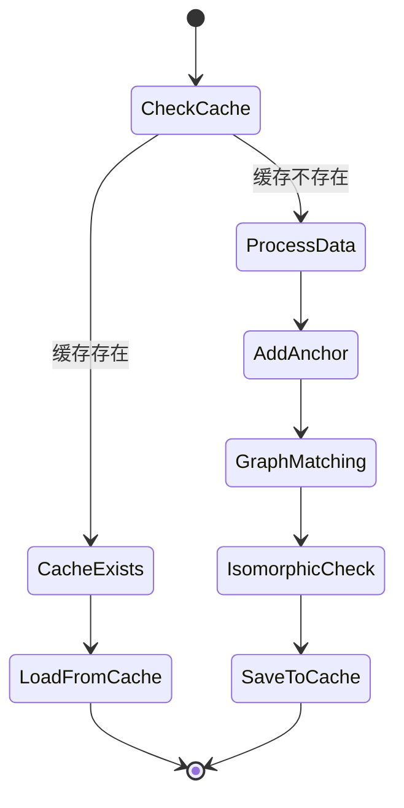

**图表来源**
- [data.py:398-416](file://common/data.py#L398-L416)

**章节来源**
- [data.py:398-416](file://common/data.py#L398-L416)

### 与DiskDataSource的区别

虽然两者都处理磁盘上的真实数据集，但在实现细节上有重要差异：

| 特性 | DiskImbalancedDataSource | DiskDataSource |
|------|-------------------------|----------------|
| **采样策略** | 不平衡采样（随机图对） | 平衡采样（正负例配对） |
| **子图关系** | 通过匹配判断确定 | 显式构造正例 |
| **缓存机制** | 智能缓存采样结果 | 无缓存机制 |
| **锚点支持** | 可选锚点节点 | 可选锚点节点 |
| **应用场景** | 现实世界复杂网络 | 标准基准数据集 |

**章节来源**
- [data.py:271-354](file://common/data.py#L271-L354)
- [data.py:356-429](file://common/data.py#L356-L429)

### 同构性测试过程

gen_batch 方法中的同构性测试是整个数据源的核心功能：

#### 测试流程

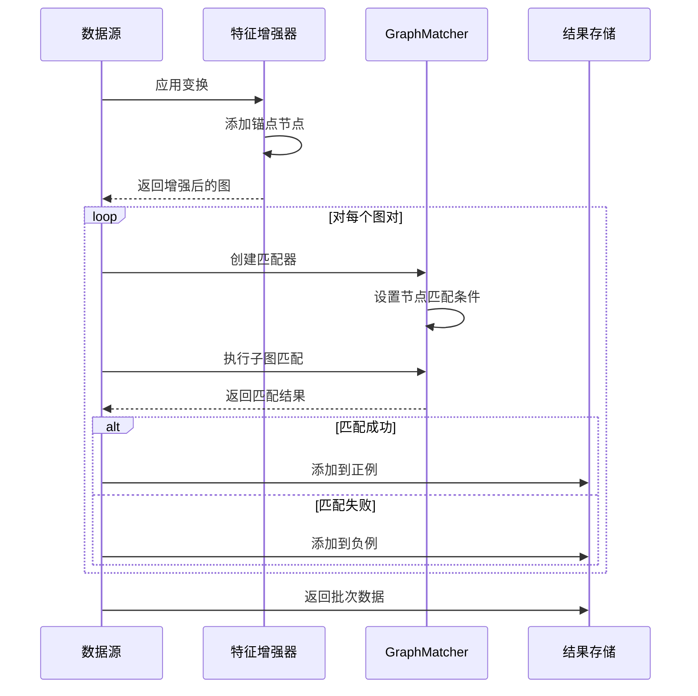

**图表来源**
- [data.py:390-429](file://common/data.py#L390-L429)

#### 节点匹配条件设置

节点匹配条件的设置是实现锚点功能的关键：

| 条件类型 | 设置方式 | 作用 |
|----------|----------|------|
| **无锚点** | `node_match=None` | 标准图匹配 |
| **有锚点** | `node_match=lambda a, b: (a["node_feature"][0] > 0.5) == (b["node_feature"][0] > 0.5)` | 锚点节点必须相同 |

**章节来源**
- [data.py:404-406](file://common/data.py#L404-L406)

### anchor节点的添加逻辑

anchor节点的添加是实现节点锚定功能的重要步骤：

#### 添加流程

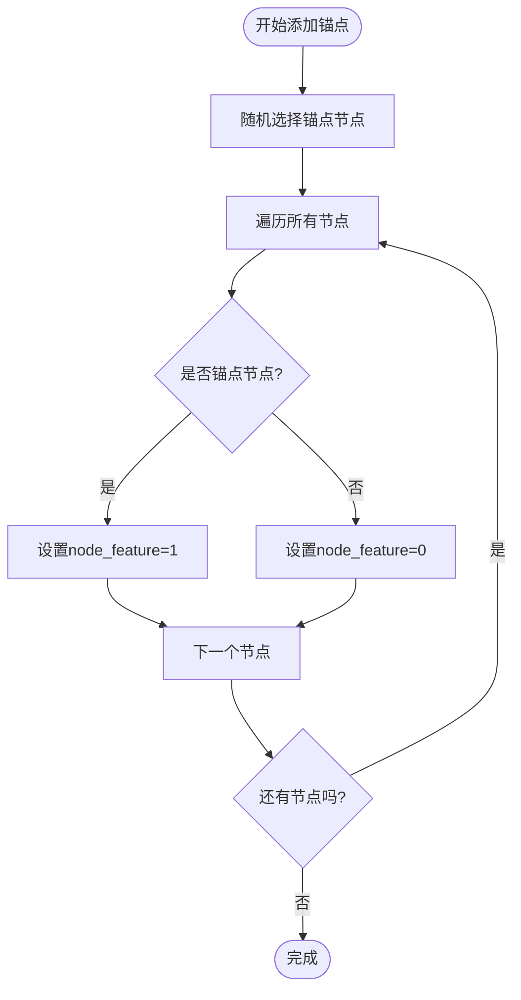

**图表来源**
- [data.py:391-396](file://common/data.py#L391-L396)

**章节来源**
- [data.py:391-396](file://common/data.py#L391-L396)

## 依赖关系分析

### 外部依赖

DiskImbalancedDataSource 依赖多个关键库和模块：

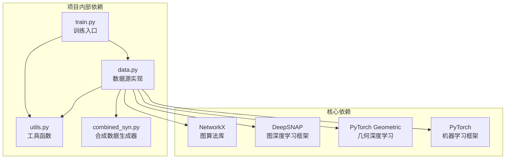

**图表来源**
- [data.py:1-20](file://common/data.py#L1-L20)
- [train.py:39-47](file://subgraph_matching/train.py#L39-L47)

### 内部模块依赖

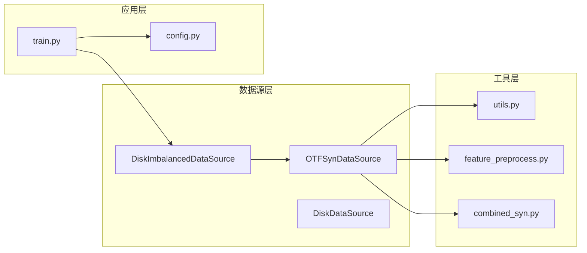

**图表来源**
- [data.py:77-429](file://common/data.py#L77-L429)
- [train.py:61-89](file://subgraph_matching/train.py#L61-L89)

**章节来源**
- [data.py:1-20](file://common/data.py#L1-L20)
- [train.py:39-47](file://subgraph_matching/train.py#L39-L47)

## 性能考虑

### 缓存策略优化

DiskImbalancedDataSource 实现了多层次的缓存策略来优化性能：

#### 缓存层次结构

| 缓存级别 | 存储位置 | 生命周期 | 适用场景 |
|----------|----------|----------|----------|
| **文件系统缓存** | data/cache/ | 持久化 | 批次级缓存 |
| **内存缓存** | Python字典 | 进程内 | 频繁访问的数据 |
| **GPU缓存** | CUDA内存 | 训练期间 | 批次数据 |

#### 性能优化建议

1. **缓存预热**：在训练开始前预生成常用批次
2. **批量处理**：合理设置批次大小以平衡内存和速度
3. **并行采样**：利用多进程并行处理不同的图对
4. **内存管理**：及时释放不需要的中间结果

### 内存管理策略

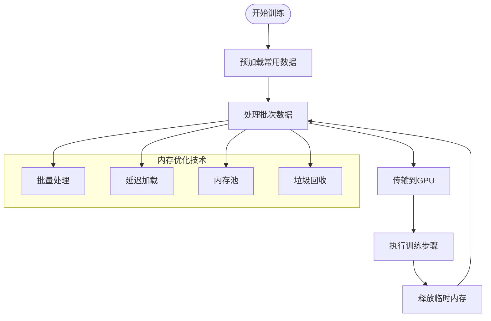

**图表来源**
- [data.py:398-416](file://common/data.py#L398-L416)

### 采样效率优化

为了提高采样效率，DiskImbalancedDataSource 采用了多种优化技术：

#### 采样优化技术

| 技术 | 实现方式 | 性能收益 |
|------|----------|----------|
| **权重采样** | 按图大小加权选择 | 更好的代表性 |
| **前沿扩展** | 逐步扩展邻域 | 避免死胡同 |
| **重试机制** | 前沿耗尽时重新采样 | 提高成功率 |
| **并行处理** | 多进程并行采样 | 显著提升速度 |

**章节来源**
- [utils.py:18-53](file://common/utils.py#L18-L53)
- [data.py:398-416](file://common/data.py#L398-L416)

## 故障排除指南

### 常见问题及解决方案

#### 缓存相关问题

| 问题 | 症状 | 解决方案 |
|------|------|----------|
| 缓存文件损坏 | 无法加载缓存 | 删除损坏文件重新生成 |
| 缓存空间不足 | 内存溢出 | 清理旧缓存文件 |
| 缓存版本不兼容 | 加载失败 | 更新缓存格式 |

#### 性能问题

| 问题 | 症状 | 解决方案 |
|------|------|----------|
| 采样速度慢 | 训练进度缓慢 | 优化批次大小和并行度 |
| 内存占用过高 | OOM错误 | 减少批次大小或增加缓存清理 |
| 匹配时间过长 | 计算超时 | 使用更严格的预筛选条件 |

#### 数据质量问题

| 问题 | 症状 | 解决方案 |
|------|------|----------|
| 子图关系稀少 | 正例过少 | 调整采样策略或增加数据集 |
| 锚点不匹配 | 锚点冲突 | 检查锚点设置和匹配条件 |
| 图质量差 | 匹配失败 | 预处理数据或调整参数 |

**章节来源**
- [data.py:398-416](file://common/data.py#L398-L416)

### 调试技巧

1. **日志监控**：启用详细的日志输出跟踪采样过程
2. **性能分析**：使用性能分析工具识别瓶颈
3. **数据可视化**：可视化采样结果验证正确性
4. **渐进调试**：从小规模数据集开始测试

## 结论

DiskImbalancedDataSource 代表了现代图神经网络训练数据源设计的重要进展。通过将磁盘数据集的持久化优势与不平衡采样策略相结合，它为处理现实世界的复杂网络数据提供了强大的工具。

### 主要贡献

1. **不平衡采样**：真实反映了现实世界中子图关系的稀有性
2. **智能缓存**：显著提升了数据处理效率
3. **灵活配置**：支持多种采样策略和参数配置
4. **性能优化**：内置多种性能优化技术和内存管理策略

### 应用前景

该数据源特别适用于以下应用场景：
- **社交网络分析**：检测社区结构和影响力传播
- **生物信息学**：蛋白质相互作用网络分析
- **推荐系统**：基于图结构的用户行为预测
- **网络安全**：异常模式检测和威胁分析

通过持续的优化和扩展，DiskImbalancedDataSource 有望成为图神经网络领域的重要基础设施组件。