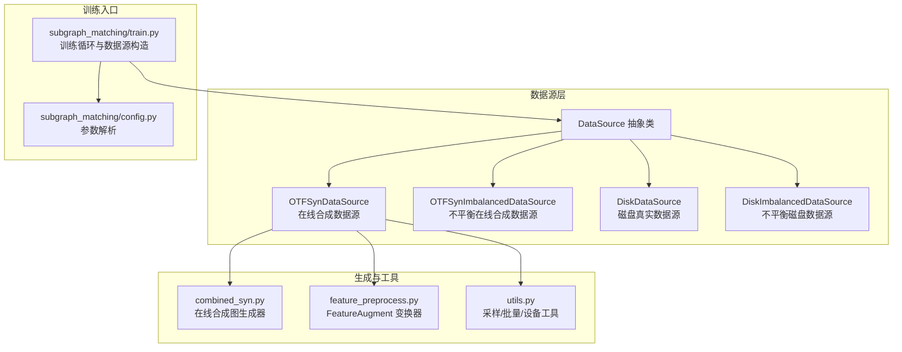
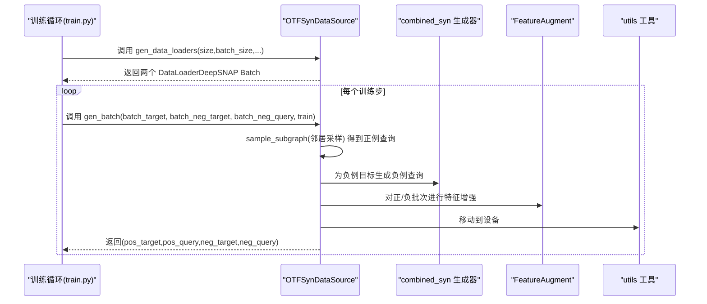
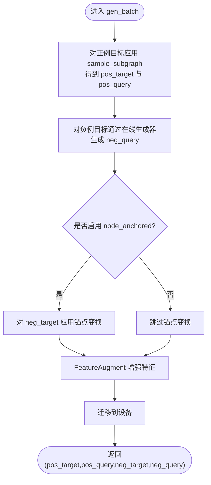
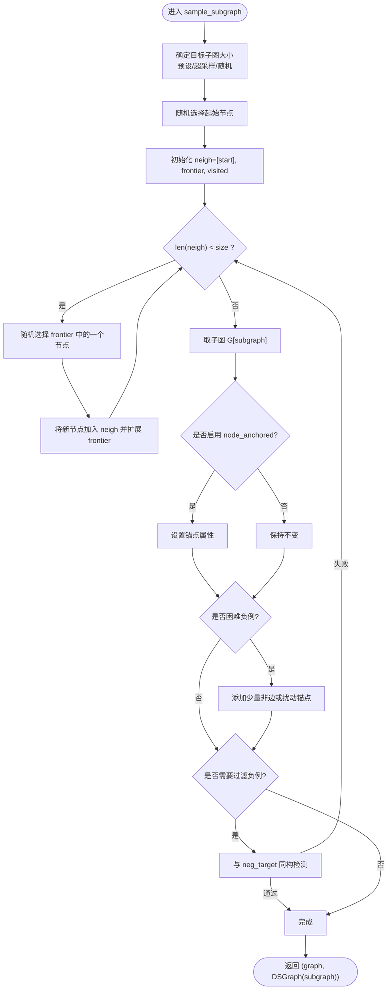
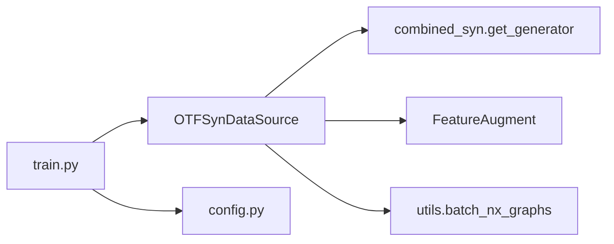

# 在线合成数据源

<cite>
**本文引用的文件**
- [common/data.py](file://common/data.py)
- [common/combined_syn.py](file://common/combined_syn.py)
- [common/utils.py](file://common/utils.py)
- [common/feature_preprocess.py](file://common/feature_preprocess.py)
- [subgraph_matching/train.py](file://subgraph_matching/train.py)
- [subgraph_matching/config.py](file://subgraph_matching/config.py)
</cite>

## 目录
1. [简介](#简介)
2. [项目结构](#项目结构)
3. [核心组件](#核心组件)
4. [架构总览](#架构总览)
5. [详细组件分析](#详细组件分析)
6. [依赖关系分析](#依赖关系分析)
7. [性能考量](#性能考量)
8. [故障排查指南](#故障排查指南)
9. [结论](#结论)
10. [附录](#附录)

## 简介
本文件围绕 OTFSynDataSource（在线合成数据源）展开，系统阐述其动态生成合成图批次的机制、DeepSNAP 变换器的使用、正负例生成策略，以及初始化参数的作用与配置方法。同时给出 gen_batch 方法的工作流程说明，包含 sample_subgraph 函数的实现、邻居采样算法与节点锚定机制。最后提供创建与使用 OTFSynDataSource 的示例路径、不同参数配置下的使用场景与性能特点，并说明与其他数据源类型的差异与适用场景。

## 项目结构
本项目与 OTFSynDataSource 相关的关键文件如下：
- common/data.py：定义 DataSource 抽象类与 OTFSynDataSource、OTFSynImbalancedDataSource、DiskDataSource、DiskImbalancedDataSource 等具体数据源实现。
- common/combined_syn.py：提供基于多种图生成器（ER、WS、BA 扩展、PowerLaw Cluster）的在线合成图生成器与数据集封装。
- common/utils.py：提供采样邻居、批量处理、设备选择等通用工具函数。
- common/feature_preprocess.py：提供 DeepSNAP 变换器 FeatureAugment，用于节点特征增强。
- subgraph_matching/train.py：训练入口，负责构造数据源、生成数据加载器、驱动训练循环。
- subgraph_matching/config.py：训练参数解析，包含 node_anchored 等关键参数。

图表来源
- [common/data.py:81-114](file://common/data.py#L81-L114)
- [common/combined_syn.py:101-117](file://common/combined_syn.py#L101-L117)
- [common/feature_preprocess.py:71-192](file://common/feature_preprocess.py#L71-L192)
- [common/utils.py:286-301](file://common/utils.py#L286-L301)
- [subgraph_matching/train.py:61-89](file://subgraph_matching/train.py#L61-L89)
- [subgraph_matching/config.py:48-77](file://subgraph_matching/config.py#L48-L77)

章节来源
- [common/data.py:81-114](file://common/data.py#L81-L114)
- [common/combined_syn.py:101-117](file://common/combined_syn.py#L101-L117)
- [common/feature_preprocess.py:71-192](file://common/feature_preprocess.py#L71-L192)
- [common/utils.py:286-301](file://common/utils.py#L286-L301)
- [subgraph_matching/train.py:61-89](file://subgraph_matching/train.py#L61-L89)
- [subgraph_matching/config.py:48-77](file://subgraph_matching/config.py#L48-L77)

## 核心组件
- OTFSynDataSource：在线合成数据源，每次迭代动态生成正例与负例批次，使用 DeepSNAP 变换器增强节点特征。
- OTFSynImbalancedDataSource：不平衡在线合成数据源，不强制 1:1 正负例比例，适合挑战性推理场景。
- combined_syn：提供多种图生成器（ER、WS、BA 扩展、PowerLaw Cluster），用于在线生成合成图。
- FeatureAugment：DeepSNAP 变换器，对节点特征进行增强（如度、介数中心性、路径长、PageRank、聚类系数等）。
- utils：提供 sample_neigh 邻居采样、batch_nx_graphs 批量封装、设备选择等工具。

章节来源
- [common/data.py:81-114](file://common/data.py#L81-L114)
- [common/data.py:216-269](file://common/data.py#L216-L269)
- [common/combined_syn.py:9-117](file://common/combined_syn.py#L9-L117)
- [common/feature_preprocess.py:71-192](file://common/feature_preprocess.py#L71-L192)
- [common/utils.py:18-53](file://common/utils.py#L18-L53)
- [common/utils.py:286-301](file://common/utils.py#L286-L301)

## 架构总览
OTFSynDataSource 的工作流包括：
- 初始化：确定 min_size、max_size、node_anchored，并通过 combined_syn 获取在线生成器。
- 数据加载：gen_data_loaders 构造两个合成图数据集的 DataLoader，使用 DeepSNAP Batch.collate 聚合。
- 批次生成：gen_batch 对目标批次应用邻居采样得到正例查询，对负目标批次通过在线生成器生成负例查询，再通过 FeatureAugment 增强特征并移动到设备。

图表来源
- [subgraph_matching/train.py:108-129](file://subgraph_matching/train.py#L108-L129)
- [common/data.py:98-114](file://common/data.py#L98-L114)
- [common/data.py:114-214](file://common/data.py#L114-L214)
- [common/combined_syn.py:101-117](file://common/combined_syn.py#L101-L117)
- [common/feature_preprocess.py:186-192](file://common/feature_preprocess.py#L186-L192)
- [common/utils.py:286-301](file://common/utils.py#L286-L301)

## 详细组件分析

### OTFSynDataSource 类与初始化参数
- 关键参数
  - max_size：合成图的最大节点数（采样与生成均受此限制）。
  - min_size：合成图的最小节点数（采样与生成均受此限制）。
  - n_workers：训练时的进程数（影响数据加载与生成并行度）。
  - max_queue_size：训练时内部队列上限（影响数据生成与消费的缓冲）。
  - node_anchored：是否启用节点锚定（在节点特征中加入锚点指示）。
- 初始化要点
  - 通过 combined_syn.get_generator 构建在线生成器，范围为 [min_size+1, max_size+1]。
  - 保存 max_size、min_size、node_anchored 供采样与锚定逻辑使用。

章节来源
- [common/data.py:89-96](file://common/data.py#L89-L96)
- [common/combined_syn.py:101-111](file://common/combined_syn.py#L101-L111)

### gen_data_loaders：在线合成数据加载
- 作用：为正例与负例分别构造 GraphDataset 与 DataLoader，使用 DeepSNAP Batch.collate 聚合。
- 特点：支持分布式采样（DistributedSampler），便于多卡训练。

章节来源
- [common/data.py:98-112](file://common/data.py#L98-L112)
- [common/combined_syn.py:113-117](file://common/combined_syn.py#L113-L117)

### gen_batch：动态生成正负例批次
- 正例生成
  - 对 batch_target 应用 sample_subgraph，得到 pos_target 与其查询 pos_query。
- 负例生成
  - 对 batch_neg_target 应用在线生成器生成负例查询 neg_query。
  - 若开启 node_anchored，则对 neg_target 应用锚点变换。
- 特征增强与设备迁移
  - 使用 FeatureAugment 对所有批次进行节点特征增强。
  - 统一迁移到设备（CPU/GPU）。

图表来源
- [common/data.py:114-214](file://common/data.py#L114-L214)
- [common/feature_preprocess.py:186-192](file://common/feature_preprocess.py#L186-L192)
- [common/utils.py:235-243](file://common/utils.py#L235-L243)

章节来源
- [common/data.py:114-214](file://common/data.py#L114-L214)

### sample_subgraph：邻居采样与节点锚定
- 输入：graph（NetworkX 图）、offset（偏移）、use_precomp_sizes（是否使用预设尺寸）、filter_negs（过滤负例）、supersample_small_graphs（小图超采样）、neg_target（负例参考）、hard_neg_idxs（困难负例索引集合）。
- 采样策略
  - 若 use_precomp_sizes：直接使用图自带的子图尺寸。
  - 若 train 且 supersample_small_graphs：按幂律分布对较小图进行超采样，提升小图占比。
  - 否则：在 [min_size+offset-d, len(graph)-1+offset] 区间随机采样（d=1 训练时，d=0 非训练时）。
- 邻居采样算法
  - 从随机起点开始，使用 BFS 前沿扩展，逐步将邻居加入子图，直至达到目标大小。
  - frontier 维护待访问邻居，visited 避免重复访问。
- 节点锚定
  - 若 node_anchored：在图节点属性中设置锚点指示（one-hot）。
  - 对困难负例（hard_neg_idxs）：随机添加少量非边或扰动锚点，增强难度。
- 过滤负例
  - 若 filter_negs 且训练且子图较小且存在 neg_target：通过子图同构匹配过滤掉与 neg_target 同构的负例。

图表来源
- [common/data.py:116-178](file://common/data.py#L116-L178)

章节来源
- [common/data.py:116-178](file://common/data.py#L116-L178)

### DeepSNAP 变换器与特征增强
- FeatureAugment 提供多种节点特征增强方法（度、介数中心性、路径长、PageRank、聚类系数、身份矩阵对角线等），并在增强后通过 Batch.apply_transform 应用于 DeepSNAP Batch。
- batch_nx_graphs 将 NetworkX 图批量转换为 DeepSNAP Batch，并应用 FeatureAugment 增强与设备迁移。

章节来源
- [common/feature_preprocess.py:71-192](file://common/feature_preprocess.py#L71-L192)
- [common/utils.py:286-301](file://common/utils.py#L286-L301)

### 与其他数据源类型的对比与适用场景
- OTFSynDataSource vs DiskDataSource
  - OTFSynDataSource：在线合成图，规模可控、可调节 min_size/max_size，适合可控实验与大规模训练。
  - DiskDataSource：使用真实图数据集，需预先加载与划分，适合真实场景评估。
- OTFSynDataSource vs OTFSynImbalancedDataSource
  - OTFSynDataSource：平衡正负例（1:1）。
  - OTFSynImbalancedDataSource：不平衡正负例，适合更贴近现实的推理挑战。
- OTFSynDataSource vs DiskImbalancedDataSource
  - OTFSynDataSource：在线生成负例，可控性强。
  - DiskImbalancedDataSource：使用真实图数据集，结合同构匹配生成正负例，适合真实数据上的不平衡场景。

章节来源
- [common/data.py:216-269](file://common/data.py#L216-L269)
- [common/data.py:271-354](file://common/data.py#L271-L354)
- [common/data.py:356-429](file://common/data.py#L356-L429)

## 依赖关系分析
- OTFSynDataSource 依赖
  - combined_syn.get_generator：在线生成器。
  - DeepSNAP Batch：用于批量封装与 collate。
  - FeatureAugment：节点特征增强。
  - utils.batch_nx_graphs：批量转换与设备迁移。
- 训练入口依赖
  - subgraph_matching/train.py：构造数据源、生成 DataLoader、驱动训练循环。
  - subgraph_matching/config.py：解析 node_anchored 等参数。

图表来源
- [common/data.py:89-96](file://common/data.py#L89-L96)
- [common/data.py:114-214](file://common/data.py#L114-L214)
- [common/combined_syn.py:101-117](file://common/combined_syn.py#L101-L117)
- [common/feature_preprocess.py:186-192](file://common/feature_preprocess.py#L186-L192)
- [common/utils.py:286-301](file://common/utils.py#L286-L301)
- [subgraph_matching/train.py:61-89](file://subgraph_matching/train.py#L61-L89)
- [subgraph_matching/config.py:48-77](file://subgraph_matching/config.py#L48-L77)

章节来源
- [common/data.py:89-96](file://common/data.py#L89-L96)
- [common/data.py:114-214](file://common/data.py#L114-L214)
- [common/combined_syn.py:101-117](file://common/combined_syn.py#L101-L117)
- [common/feature_preprocess.py:186-192](file://common/feature_preprocess.py#L186-L192)
- [common/utils.py:286-301](file://common/utils.py#L286-L301)
- [subgraph_matching/train.py:61-89](file://subgraph_matching/train.py#L61-L89)
- [subgraph_matching/config.py:48-77](file://subgraph_matching/config.py#L48-L77)

## 性能考量
- 在线生成与邻居采样
  - 通过 combined_syn 在线生成合成图，避免存储开销，但会增加 CPU/GPU 间的数据传输与特征增强成本。
  - 邻居采样采用 BFS 前沿扩展，时间复杂度与图密度相关，建议合理设置 min_size/max_size 控制采样规模。
- 节点锚定
  - 启用 node_anchored 会为每个节点添加锚点特征，增加特征维度与计算量，但有助于模型定位与匹配。
- 批量处理与设备迁移
  - 使用 DeepSNAP Batch 聚合，配合 FeatureAugment 增强，建议在 GPU 上进行设备迁移以减少 CPU/GPU 间拷贝。
- 分布式与并行
  - gen_data_loaders 支持 DistributedSampler，适合多卡训练；n_workers 影响数据加载与生成并行度，需结合硬件资源调整。

[本节为通用性能讨论，无需列出章节来源]

## 故障排查指南
- 无法生成连通图
  - 现象：在线生成器生成的图可能非连通。
  - 排查：确认生成器内部的连通性检查与重试逻辑是否生效。
  - 参考实现位置：[common/combined_syn.py:23-28](file://common/combined_syn.py#L23-L28)
- 邻居采样失败或陷入死循环
  - 现象：frontier 耗尽导致无法达到目标大小。
  - 排查：检查图的连通性与 min_size 设置，适当增大 max_size 或降低 min_size。
  - 参考实现位置：[common/data.py:140-149](file://common/data.py#L140-L149)
- 设备不匹配或显存不足
  - 现象：特征增强后未迁移到设备，或批次过大导致显存溢出。
  - 排查：确认 gen_batch 中的设备迁移与 batch_nx_graphs 的设备选择逻辑。
  - 参考实现位置：[common/data.py:209-212](file://common/data.py#L209-L212)、[common/utils.py:235-243](file://common/utils.py#L235-L243)
- 负例过滤无效
  - 现象：负例仍包含与正例同构的子图。
  - 排查：检查 filter_negs 与 GraphMatcher 的使用条件与阈值。
  - 参考实现位置：[common/data.py:170-176](file://common/data.py#L170-L176)

章节来源
- [common/combined_syn.py:23-28](file://common/combined_syn.py#L23-L28)
- [common/data.py:140-149](file://common/data.py#L140-L149)
- [common/data.py:209-212](file://common/data.py#L209-L212)
- [common/utils.py:235-243](file://common/utils.py#L235-L243)
- [common/data.py:170-176](file://common/data.py#L170-L176)

## 结论
OTFSynDataSource 通过在线合成图生成与 DeepSNAP 变换器，实现了可控、可扩展的正负例批次生成。其邻居采样与节点锚定机制为子图匹配任务提供了灵活的训练数据策略。结合不平衡数据源与分布式数据加载，可在大规模训练中取得良好效果。实际使用中应根据硬件资源与任务需求合理配置 min_size/max_size、node_anchored、n_workers 等参数。

[本节为总结性内容，无需列出章节来源]

## 附录

### 创建与使用 OTFSynDataSource 的示例路径
- 在训练入口中按参数构造数据源
  - 示例路径：[subgraph_matching/train.py:61-89](file://subgraph_matching/train.py#L61-L89)
- 训练循环中生成数据加载器与批次
  - 示例路径：[subgraph_matching/train.py:108-129](file://subgraph_matching/train.py#L108-L129)
- 参数解析与默认值
  - 示例路径：[subgraph_matching/config.py:48-77](file://subgraph_matching/config.py#L48-L77)

### 参数配置与使用场景
- node_anchored=True
  - 场景：需要锚点引导的匹配任务，提升定位能力。
  - 配置：在 config.py 中设置 --node_anchored。
  - 参考路径：[subgraph_matching/config.py:48-77](file://subgraph_matching/config.py#L48-L77)
- min_size/max_size
  - 场景：控制子图规模范围，平衡训练难度与效率。
  - 配置：在 OTFSynDataSource 初始化时传入。
  - 参考路径：[common/data.py:89-96](file://common/data.py#L89-L96)
- n_workers
  - 场景：多进程并行加载与生成，提高吞吐。
  - 配置：在 config.py 中设置 --n_workers。
  - 参考路径：[subgraph_matching/config.py:51-77](file://subgraph_matching/config.py#L51-L77)

### 与其他数据源类型的适用场景
- OTFSynDataSource：可控实验、大规模训练、可调节规模。
- OTFSynImbalancedDataSource：不平衡推理挑战、更贴近现实的任务。
- DiskDataSource：真实数据评估、已有图数据集。
- DiskImbalancedDataSource：真实数据上的不平衡场景。

章节来源
- [common/data.py:81-114](file://common/data.py#L81-L114)
- [common/data.py:216-269](file://common/data.py#L216-L269)
- [common/data.py:271-354](file://common/data.py#L271-L354)
- [common/data.py:356-429](file://common/data.py#L356-L429)