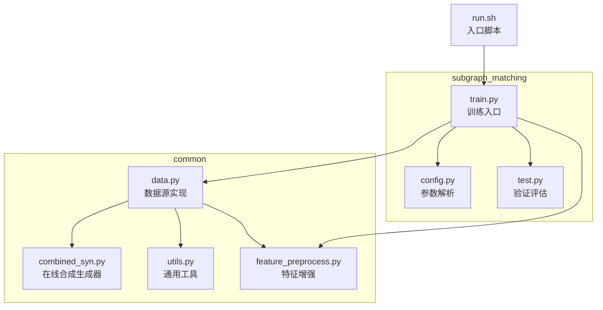
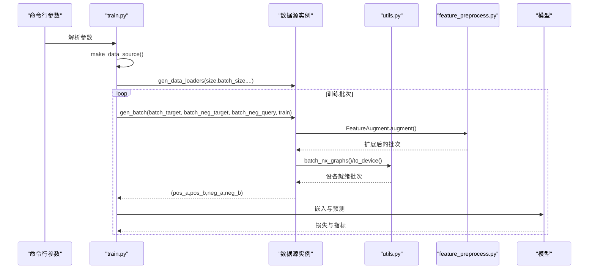
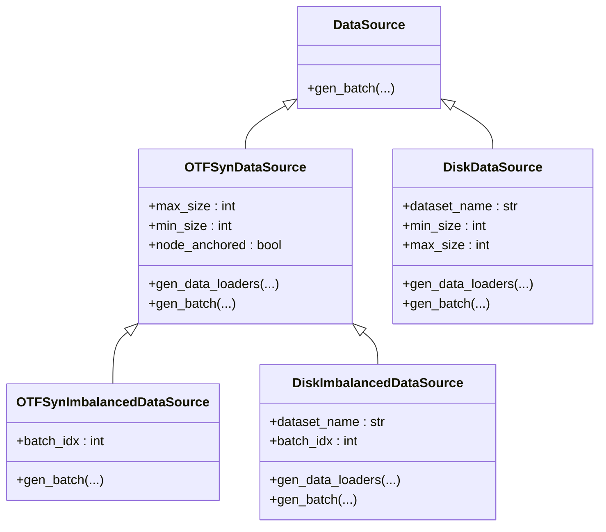

# 数据源类型

<cite>
**本文引用的文件**
- [common/data.py](file://common/data.py)
- [common/combined_syn.py](file://common/combined_syn.py)
- [common/utils.py](file://common/utils.py)
- [common/feature_preprocess.py](file://common/feature_preprocess.py)
- [subgraph_matching/train.py](file://subgraph_matching/train.py)
- [subgraph_matching/config.py](file://subgraph_matching/config.py)
- [subgraph_matching/test.py](file://subgraph_matching/test.py)
- [run.sh](file://run.sh)
</cite>

## 目录
1. [简介](#简介)
2. [项目结构](#项目结构)
3. [核心组件](#核心组件)
4. [架构总览](#架构总览)
5. [详细组件分析](#详细组件分析)
6. [依赖关系分析](#依赖关系分析)
7. [性能考量](#性能考量)
8. [故障排查指南](#故障排查指南)
9. [结论](#结论)
10. [附录](#附录)

## 简介
本文件面向 SPMiner 的数据源类型，系统化梳理四类数据源的实现原理、初始化参数、批次生成流程、适用数据集类型与性能特点，并给出配置建议与最佳实践。四类数据源分别为：
- OTFSynDataSource：在线合成数据源（平衡）
- OTFSynImbalancedDataSource：不平衡在线合成数据源
- DiskDataSource：磁盘数据源（平衡）
- DiskImbalancedDataSource：不平衡磁盘数据源

这些数据源服务于子图匹配任务，通过在线生成或从磁盘加载的真实图集合，动态构造正负样本对，供模型训练与评估使用。

## 项目结构
围绕数据源的核心代码位于 common 与 subgraph_matching 两个目录：
- common/data.py：定义 DataSource 抽象基类与四种具体数据源实现
- common/combined_syn.py：在线合成图生成器与合成数据集工厂
- common/utils.py：通用工具，包括邻域采样、设备选择、批量封装等
- common/feature_preprocess.py：节点特征增强与预处理模块
- subgraph_matching/train.py：训练入口，负责根据命令行参数创建数据源并驱动训练循环
- subgraph_matching/config.py：训练参数解析与默认值
- subgraph_matching/test.py：验证与评估流程
- run.sh：训练脚本入口

图表来源
- [common/data.py:1-447](file://common/data.py#L1-L447)
- [common/combined_syn.py:1-134](file://common/combined_syn.py#L1-L134)
- [common/utils.py:1-302](file://common/utils.py#L1-L302)
- [common/feature_preprocess.py:1-230](file://common/feature_preprocess.py#L1-L230)
- [subgraph_matching/train.py:1-253](file://subgraph_matching/train.py#L1-L253)
- [subgraph_matching/config.py:1-82](file://subgraph_matching/config.py#L1-L82)
- [subgraph_matching/test.py:1-139](file://subgraph_matching/test.py#L1-L139)
- [run.sh:1-2](file://run.sh#L1-L2)

章节来源
- [common/data.py:1-447](file://common/data.py#L1-L447)
- [subgraph_matching/train.py:1-253](file://subgraph_matching/train.py#L1-L253)

## 核心组件
- DataSource 抽象基类：定义 gen_batch 接口，约束所有数据源的批次生成行为
- OTFSynDataSource：在线合成平衡数据源，使用合成生成器动态产生正负样本
- OTFSynImbalancedDataSource：不平衡在线合成数据源，按对采样并判定子图关系，缓存正负样本
- DiskDataSource：磁盘平衡数据源，从真实图数据集中采样子图构造正负样本
- DiskImbalancedDataSource：不平衡磁盘数据源，与 OTFSynImbalancedDataSource 类似，但来源于真实数据集

章节来源
- [common/data.py:77-354](file://common/data.py#L77-L354)
- [common/data.py:356-429](file://common/data.py#L356-L429)

## 架构总览
数据源在训练流程中的角色如下：
- 训练入口根据命令行参数选择具体数据源类型
- 数据源提供 gen_data_loaders 生成数据加载器
- 训练循环调用 gen_batch 产出正负样本批次
- 特征增强模块对批次进行节点特征扩展与设备迁移
- 模型对批次进行前向推理并计算损失

图表来源
- [subgraph_matching/train.py:61-134](file://subgraph_matching/train.py#L61-L134)
- [common/data.py:81-214](file://common/data.py#L81-L214)
- [common/feature_preprocess.py:71-192](file://common/feature_preprocess.py#L71-L192)
- [common/utils.py:286-301](file://common/utils.py#L286-L301)

## 详细组件分析

### OTFSynDataSource（在线合成数据源）
- 角色定位：平衡在线合成数据源，每次迭代动态生成正负样本对
- 初始化参数
  - max_size：合成图最大节点数
  - min_size：合成图最小节点数
  - n_workers：合成生成器工作线程数
  - max_queue_size：生成队列最大容量
  - node_anchored：是否启用节点锚定（在节点特征中加入锚点标记）
- 生成批次流程
  - 使用合成生成器在线生成图批次
  - 对目标与查询图分别采样子图作为正样本
  - 对负样本采用困难负例策略，结合在线生成器扰动
  - 应用特征增强与设备迁移
- 适用场景
  - 需要可控且可重复的合成数据进行训练
  - 对正负样本比例有严格要求的平衡场景
- 性能特点
  - 在线生成，内存占用低
  - 受生成器与特征增强影响，CPU/GPU 利用率取决于 batch_size 与 n_workers

章节来源
- [common/data.py:81-214](file://common/data.py#L81-L214)
- [common/combined_syn.py:101-117](file://common/combined_syn.py#L101-L117)
- [common/feature_preprocess.py:71-192](file://common/feature_preprocess.py#L71-L192)
- [common/utils.py:286-301](file://common/utils.py#L286-L301)

### OTFSynImbalancedDataSource（不平衡在线合成数据源）
- 角色定位：不平衡在线合成数据源，按对采样并判定子图关系，缓存正负样本
- 初始化参数
  - 继承 OTFSynDataSource 的全部参数
  - 内部维护 batch_idx 用于缓存文件命名
- 生成批次流程
  - 对输入批次应用节点锚定变换
  - 逐对比较图是否为子图关系，划分正负样本
  - 缓存至本地 pickle 文件，避免重复计算
  - 将正负样本批量封装并返回
- 适用场景
  - 更贴近真实推理场景的不平衡数据
  - 需要稳定正负样本分布的实验对比
- 性能特点
  - 首次运行会进行大量图同构判定，IO 与 CPU 成本较高
  - 后续批次通过缓存显著降低开销

章节来源
- [common/data.py:216-269](file://common/data.py#L216-L269)

### DiskDataSource（磁盘数据源）
- 角色定位：平衡磁盘数据源，从真实图数据集中采样子图构造正负样本
- 初始化参数
  - dataset_name：真实数据集名称（如 enzymes、reddit-binary 等）
  - node_anchored：是否启用节点锚定
  - min_size/max_size：采样子图规模范围
- 生成批次流程
  - 从 load_dataset 加载训练/测试集
  - 正样本：从同一图中采样子图，形成 a ⊆ b 的树对
  - 负样本：从不同图或不同子图采样，过滤掉意外的子图关系
  - 可选过滤策略 filter_negs，进一步减少伪正样本
  - 批量封装并返回
- 适用场景
  - 使用真实世界图数据进行训练与评估
  - 需要与现有图数据库（TUDataset、PPI、QM9 等）兼容
- 性能特点
  - 依赖磁盘数据集规模与采样复杂度
  - 受邻域采样算法与图同构判定影响

章节来源
- [common/data.py:271-354](file://common/data.py#L271-L354)
- [common/data.py:21-75](file://common/data.py#L21-L75)
- [common/utils.py:18-53](file://common/utils.py#L18-L53)

### DiskImbalancedDataSource（不平衡磁盘数据源）
- 角色定位：不平衡磁盘数据源，与 OTFSynImbalancedDataSource 类似，但来源于真实数据集
- 初始化参数
  - dataset_name：真实数据集名称
  - 继承 OTFSynDataSource 的其余参数
- 生成批次流程
  - 从 load_dataset 获取训练/测试集
  - 对输入批次应用节点锚定变换
  - 逐对判定子图关系，划分正负样本
  - 缓存至本地 pickle 文件，避免重复计算
  - 批量封装并返回
- 适用场景
  - 使用真实数据的不平衡场景
  - 需要稳定正负样本分布的实验对比
- 性能特点
  - 首次运行成本高，后续批次受益于缓存

章节来源
- [common/data.py:356-429](file://common/data.py#L356-L429)
- [common/data.py:21-75](file://common/data.py#L21-L75)

### 数据源选择与使用示例
- 训练入口根据命令行参数自动选择数据源类型
  - dataset=syn-balanced 或省略：OTFSynDataSource
  - dataset=syn-imbalanced：OTFSynImbalancedDataSource
  - dataset=数据集名-balanced：DiskDataSource
  - dataset=数据集名-imbalanced：DiskImbalancedDataSource
- 示例（命令行）
  - 训练合成平衡数据：python3 -m subgraph_matching.train --dataset syn --batch_size 64
  - 训练磁盘不平衡数据：python3 -m subgraph_matching.train --dataset reddit-binary-imbalanced --batch_size 64
- 参数解析与默认值
  - 训练参数由 subgraph_matching/config.py 提供默认值与解析逻辑
  - 关键参数包括 batch_size、n_batches、eval_interval、val_size、model_path、node_anchored 等

章节来源
- [subgraph_matching/train.py:61-89](file://subgraph_matching/train.py#L61-L89)
- [subgraph_matching/config.py:18-77](file://subgraph_matching/config.py#L18-L77)
- [run.sh:1-2](file://run.sh#L1-L2)

## 依赖关系分析
- 数据源依赖
  - OTFSynDataSource/DiskImbalancedDataSource 依赖 combined_syn 生成器与合成数据集
  - 所有数据源依赖 utils 的邻域采样与批量封装
  - 所有数据源依赖 feature_preprocess 的特征增强
- 训练入口依赖
  - train.py 通过 make_data_source 创建数据源实例
  - 训练循环调用数据源的 gen_data_loaders 与 gen_batch
  - 验证流程在 test.py 中进行指标评估

图表来源
- [common/data.py:77-429](file://common/data.py#L77-L429)

章节来源
- [common/data.py:77-429](file://common/data.py#L77-L429)

## 性能考量
- 合成数据源
  - OTFSynDataSource：在线生成，batch_size 与 n_workers 影响吞吐；特征增强与设备迁移为瓶颈
  - OTFSynImbalancedDataSource：首次运行需大量图同构判定与缓存写入，建议预热或合理设置缓存目录权限
- 磁盘数据源
  - DiskDataSource：邻域采样与图同构判定为主要开销；可通过 filter_negs 降低伪正样本
  - DiskImbalancedDataSource：与 OTFSynImbalancedDataSource 类似，受益于缓存
- 通用建议
  - 合理设置 batch_size 与 eval_interval，平衡吞吐与显存占用
  - 使用 node_anchored 提升锚定一致性，但会增加特征维度
  - 在大规模数据集上优先使用不平衡数据源以贴近真实推理场景

[本节为通用性能讨论，无需列出具体文件来源]

## 故障排查指南
- 数据集加载失败
  - 确认数据集名称正确且已安装对应依赖（TUDataset、PPI、QM9 等）
  - 检查路径与权限，确保缓存目录可写
- 缓存命中异常
  - 删除 data/cache 下对应缓存文件，重新生成
  - 检查 node_anchored 与 batch_idx 是否导致缓存键冲突
- 设备与显存问题
  - 确认 utils.get_device 返回期望设备（CUDA/CPU）
  - 适当降低 batch_size 或增大 eval_interval
- 邻域采样效率低
  - 调整 min_size/max_size，避免极端规模导致采样失败重试
  - 对 DiskDataSource 使用 filter_negs 过滤伪正样本

章节来源
- [common/data.py:21-75](file://common/data.py#L21-L75)
- [common/utils.py:235-243](file://common/utils.py#L235-L243)
- [common/data.py:290-354](file://common/data.py#L290-L354)

## 结论
- OTFSynDataSource 适合可控合成数据的平衡训练
- OTFSynImbalancedDataSource 适合不平衡场景的稳定实验
- DiskDataSource 适合真实数据的平衡训练
- DiskImbalancedDataSource 适合真实数据的不平衡实验
- 选择建议：若追求稳定性与可控性，优先合成平衡数据源；若追求真实场景逼近，优先不平衡数据源；在真实数据受限时，可先用合成数据预热，再切换磁盘数据源。

[本节为总结性内容，无需列出具体文件来源]

## 附录

### 数据源初始化参数一览
- OTFSynDataSource
  - max_size、min_size、n_workers、max_queue_size、node_anchored
- OTFSynImbalancedDataSource
  - 继承上述参数，内部维护 batch_idx
- DiskDataSource
  - dataset_name、node_anchored、min_size、max_size
- DiskImbalancedDataSource
  - dataset_name、max_size、min_size、n_workers、max_queue_size、node_anchored

章节来源
- [common/data.py:89-96](file://common/data.py#L89-L96)
- [common/data.py:224-227](file://common/data.py#L224-L227)
- [common/data.py:278-283](file://common/data.py#L278-L283)
- [common/data.py:364-367](file://common/data.py#L364-L367)

### 生成批次方法说明
- OTFSynDataSource.gen_batch
  - 在线生成正负样本，应用特征增强与设备迁移
- OTFSynImbalancedDataSource.gen_batch
  - 逐对判定子图关系，缓存正负样本
- DiskDataSource.gen_batch
  - 从真实数据集中采样子图，构造正负样本，支持过滤策略
- DiskImbalancedDataSource.gen_batch
  - 与 OTFSynImbalancedDataSource 类似，但来源于真实数据集

章节来源
- [common/data.py:114-214](file://common/data.py#L114-L214)
- [common/data.py:230-269](file://common/data.py#L230-L269)
- [common/data.py:290-354](file://common/data.py#L290-L354)
- [common/data.py:390-429](file://common/data.py#L390-L429)

### 适用数据集类型
- TUDataset：enzymes、proteins、cox2、aids、reddit-binary、imdb-binary、firstmm_db、dblp
- PPI：ppi
- QM9：qm9
- Atlas：graph_atlas_g
- 社交网络：facebook、as-733、as20000102（需放置边列表文件）

章节来源
- [common/data.py:21-75](file://common/data.py#L21-L75)

### 配置建议与最佳实践
- 合成数据源
  - 合理设置 min_size/max_size，平衡训练难度与计算成本
  - 使用 node_anchored 提升锚定一致性，注意特征维度增加
  - 控制 n_workers 与 max_queue_size，避免生成器阻塞
- 磁盘数据源
  - 对 DiskDataSource 使用 filter_negs，减少伪正样本
  - 合理设置 eval_interval 与 val_size，控制验证频率
  - 预热缓存（OTFSynImbalancedDataSource/DiskImbalancedDataSource），提升后续批次速度
- 训练参数
  - 通过 subgraph_matching/config.py 设置默认参数，按需覆盖
  - 使用 run.sh 启动训练，或在命令行传入参数

章节来源
- [subgraph_matching/config.py:18-77](file://subgraph_matching/config.py#L18-L77)
- [run.sh:1-2](file://run.sh#L1-L2)