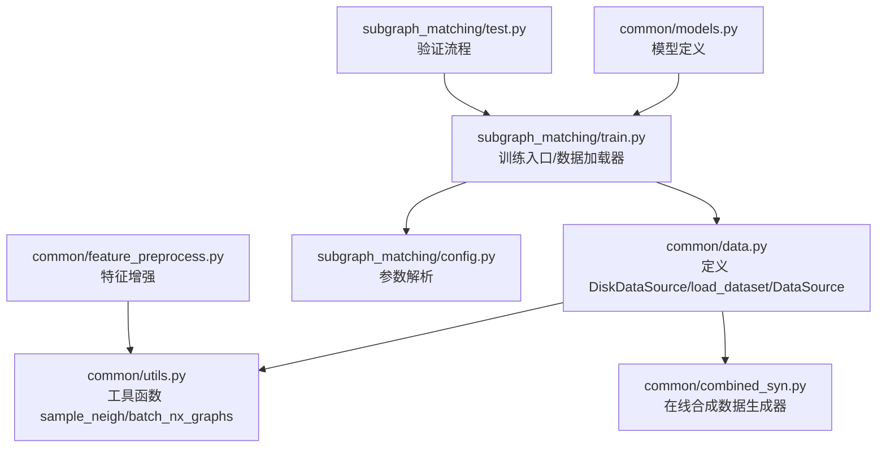
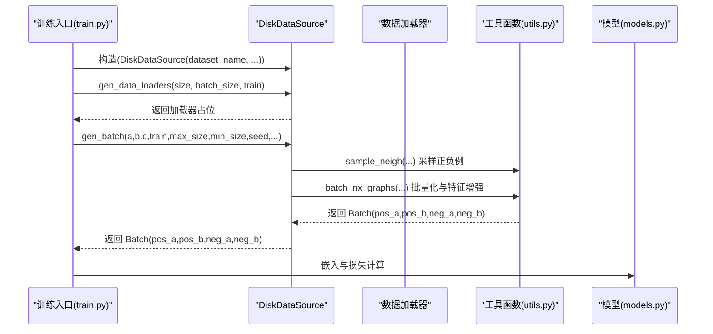
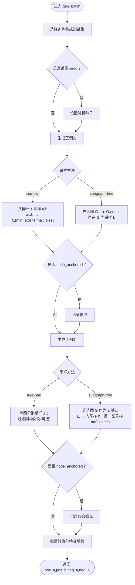
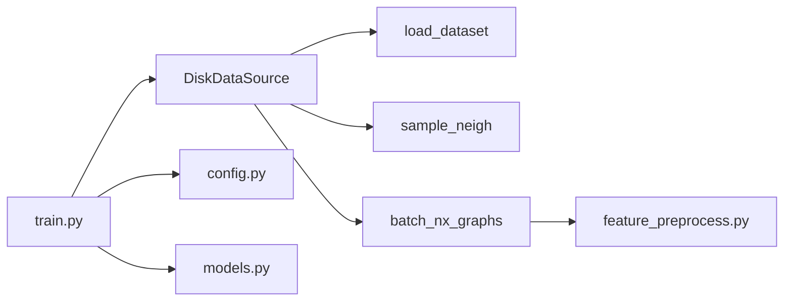

# 磁盘数据源

<cite>
**本文引用的文件**
- [common/data.py](file://common/data.py)
- [common/utils.py](file://common/utils.py)
- [common/combined_syn.py](file://common/combined_syn.py)
- [subgraph_matching/train.py](file://subgraph_matching/train.py)
- [subgraph_matching/config.py](file://subgraph_matching/config.py)
- [common/models.py](file://common/models.py)
- [common/feature_preprocess.py](file://common/feature_preprocess.py)
- [subgraph_matching/test.py](file://subgraph_matching/test.py)
</cite>

## 目录
1. [简介](#简介)
2. [项目结构](#项目结构)
3. [核心组件](#核心组件)
4. [架构总览](#架构总览)
5. [详细组件分析](#详细组件分析)
6. [依赖分析](#依赖分析)
7. [性能考量](#性能考量)
8. [故障排查指南](#故障排查指南)
9. [结论](#结论)
10. [附录](#附录)

## 简介
本文件面向 DiskDataSource（磁盘数据源），系统性阐述其如何从保存在磁盘上的真实数据集中加载图数据，完成子图匹配训练所需的正负样本批次生成。内容涵盖：
- load_dataset 支持的数据集类型（enzymes、proteins、cox2、aids、reddit-binary、imdb-binary、firstmm_db、dblp、ppi、qm9、atlas、facebook、as-733、as20000102 等）
- 初始化参数（dataset_name、node_anchored、min_size、max_size）的配置与作用
- gen_batch 方法中的正负例生成策略，重点解析 tree-pair 与 subgraph-tree 两种采样方法的区别与适用场景
- 数据集划分（训练集/测试集）与任务类型（graph 分类）的处理方式
- 使用示例与最佳实践

## 项目结构
围绕 DiskDataSource 的关键文件与职责如下：
- common/data.py：定义 DataSource 抽象类、DiskDataSource、load_dataset、以及若干数据源变体
- common/utils.py：提供 sample_neigh、batch_nx_graphs、设备选择等工具
- common/combined_syn.py：在线合成数据生成器（用于对比实验）
- subgraph_matching/train.py：训练入口，构造数据源、生成数据加载器、驱动训练循环
- subgraph_matching/config.py：训练参数解析与默认值
- common/models.py：模型定义（如 OrderEmbedder），与数据源配合进行损失计算
- common/feature_preprocess.py：特征增强与预处理
- subgraph_matching/test.py：验证流程，评估指标计算

图表来源
- [common/data.py:1-447](file://common/data.py#L1-L447)
- [common/utils.py:1-302](file://common/utils.py#L1-L302)
- [common/combined_syn.py:1-134](file://common/combined_syn.py#L1-L134)
- [subgraph_matching/train.py:1-253](file://subgraph_matching/train.py#L1-L253)
- [subgraph_matching/config.py:1-82](file://subgraph_matching/config.py#L1-L82)
- [common/models.py:1-318](file://common/models.py#L1-L318)
- [common/feature_preprocess.py:1-230](file://common/feature_preprocess.py#L1-L230)
- [subgraph_matching/test.py:1-140](file://subgraph_matching/test.py#L1-L140)

章节来源
- [common/data.py:1-447](file://common/data.py#L1-L447)
- [common/utils.py:1-302](file://common/utils.py#L1-L302)
- [common/combined_syn.py:1-134](file://common/combined_syn.py#L1-L134)
- [subgraph_matching/train.py:1-253](file://subgraph_matching/train.py#L1-L253)
- [subgraph_matching/config.py:1-82](file://subgraph_matching/config.py#L1-L82)
- [common/models.py:1-318](file://common/models.py#L1-L318)
- [common/feature_preprocess.py:1-230](file://common/feature_preprocess.py#L1-L230)
- [subgraph_matching/test.py:1-140](file://subgraph_matching/test.py#L1-L140)

## 核心组件
- DataSource 抽象类：定义 gen_batch 接口，作为所有数据源的统一契约
- DiskDataSource：从磁盘真实数据集中采样子图，生成正负样本批次
- load_dataset：封装 PyTorch Geometric/TU Dataset/PPI/QM9 等数据集加载与划分
- 工具函数：
  - sample_neigh：按图大小加权采样连通邻域
  - batch_nx_graphs：将 NetworkX 图批量转换为 DeepSNAP Batch 并进行特征增强与设备迁移

章节来源
- [common/data.py:77-354](file://common/data.py#L77-L354)
- [common/utils.py:18-53](file://common/utils.py#L18-L53)
- [common/utils.py:286-301](file://common/utils.py#L286-L301)

## 架构总览
DiskDataSource 的工作流：
- 初始化时通过 load_dataset 加载指定数据集，返回训练集、测试集与任务类型
- 训练/测试阶段根据 train 标志选择使用训练集或测试集
- gen_batch 生成正负样本对，正例来自同一图内的子图对，负例来自不同图的子图对
- 通过 batch_nx_graphs 将子图批量转换为模型可处理的 Batch，并可选地加入节点锚定特征

图表来源
- [subgraph_matching/train.py:107-134](file://subgraph_matching/train.py#L107-L134)
- [common/data.py:285-354](file://common/data.py#L285-L354)
- [common/utils.py:18-53](file://common/utils.py#L18-L53)
- [common/utils.py:286-301](file://common/utils.py#L286-L301)
- [common/models.py:46-99](file://common/models.py#L46-L99)

## 详细组件分析

### DiskDataSource 类与初始化参数
- 初始化参数
  - dataset_name：数据集名称，需与 load_dataset 支持的名称一致
  - node_anchored：是否启用节点锚定（在节点特征中加入锚点指示）
  - min_size：采样子图的最小节点数
  - max_size：采样子图的最大节点数
- 关键行为
  - 通过 load_dataset 获取 train_set、test_set、task
  - gen_data_loaders 返回占位列表，便于训练循环统一管理
  - gen_batch 生成正负样本对，支持两种采样策略与过滤选项

章节来源
- [common/data.py:271-288](file://common/data.py#L271-L288)
- [common/data.py:278-283](file://common/data.py#L278-L283)

### load_dataset：支持的数据集类型与划分
- 支持的数据集
  - TUDataset：enzymes、proteins、cox2、aids、reddit-binary、imdb-binary、firstmm_db、dblp
  - PPI：ppi
  - QM9：qm9
  - 自定义图：atlas（图谱）、facebook（单个大图）、as-733、as20000102（单个大图）
- 划分与任务类型
  - 任务类型为 graph（图分类）
  - 将数据集随机打乱后按 8:2 划分为训练集与测试集
  - 若数据项不是 NetworkX 图，会转换为 NetworkX 无向图
- 返回值
  - train_set：训练集（NetworkX 图列表）
  - test_set：测试集（NetworkX 图列表）
  - task：任务类型字符串（graph）

章节来源
- [common/data.py:21-75](file://common/data.py#L21-L75)

### gen_batch：正负例生成策略与采样方法
- 输入参数
  - a, b, c：占位参数（gen_batch 内部使用 a 作为 batch_size）
  - train：是否训练阶段
  - max_size/min_size：采样上限/下限
  - seed：随机种子
  - filter_negs：是否过滤负例（若负例与正例同构则丢弃）
  - sample_method：采样策略，支持 "tree-pair" 与 "subgraph-tree"
- 正例生成（pos_a, pos_b）
  - tree-pair：从同一图中采样两个节点集合 a 和 b，满足 a ⊂ b，且 |a| ∈ [min_size+1, max_size]
  - subgraph-tree：先从图集中随机选择一个图，然后在该图内采样 a（全节点集合），再从该图采样 b（|b| ∈ [min_size, |a|-1]）
  - 若 node_anchored 为真，为正例对记录锚点节点
- 负例生成（neg_a, neg_b）
  - tree-pair：分别从两个不同图中采样 a、b，且要求 a 与 b 不同构（可选 filter_negs 过滤同构负例）
  - subgraph-tree：从图集中随机选择一个图作为 a 的基础，然后在该图内采样 b；另一个图从图集中随机选择，采样 a 的节点集合
  - 若 node_anchored 为真，为负例对记录各自的锚点节点
- 批量化与特征增强
  - 使用 batch_nx_graphs 将子图批量转换为 DeepSNAP Batch，并应用特征增强与设备迁移
  - 若 node_anchored 为真，会在节点特征中加入锚点指示

图表来源
- [common/data.py:290-354](file://common/data.py#L290-L354)
- [common/utils.py:18-53](file://common/utils.py#L18-L53)
- [common/utils.py:286-301](file://common/utils.py#L286-L301)

章节来源
- [common/data.py:290-354](file://common/data.py#L290-L354)
- [common/utils.py:18-53](file://common/utils.py#L18-L53)
- [common/utils.py:286-301](file://common/utils.py#L286-L301)

### 数据集划分与任务类型
- 划分策略
  - 将数据集整体打乱后按 8:2 划分训练/测试
  - 适用于图分类任务（task="graph"）
- 任务类型
  - 任务类型为 "graph"，表示每个样本是一个图，目标是图级分类
- 特殊数据集
  - facebook、as-733、as20000102 返回单个大图作为训练/测试集

章节来源
- [common/data.py:61-75](file://common/data.py#L61-L75)

### 使用示例与最佳实践
- 加载不同类型的 PyTorch Geometric 数据集
  - enzymes、proteins、cox2、aids、reddit-binary、imdb-binary、firstmm_db、dblp、ppi、qm9、atlas、facebook、as-733、as20000102
  - 示例：构造 DiskDataSource("enzymes", node_anchored=True, min_size=5, max_size=29)
- 配置采样参数
  - min_size、max_size 控制采样子图规模范围
  - filter_negs 可过滤负例中的同构对，提高负例质量
  - sample_method 选择 tree-pair 或 subgraph-tree
- 训练与验证
  - 训练入口通过 gen_data_loaders 生成加载器占位，gen_batch 生成批次
  - 训练循环中使用模型进行嵌入与损失计算，验证阶段评估指标

章节来源
- [subgraph_matching/train.py:61-89](file://subgraph_matching/train.py#L61-L89)
- [subgraph_matching/train.py:107-134](file://subgraph_matching/train.py#L107-L134)
- [subgraph_matching/config.py:36-77](file://subgraph_matching/config.py#L36-L77)
- [common/models.py:46-99](file://common/models.py#L46-L99)

## 依赖分析
- DiskDataSource 依赖
  - load_dataset：加载与划分数据集
  - sample_neigh：按图大小加权采样邻域
  - batch_nx_graphs：批量转换与特征增强
- 训练入口依赖
  - train.py：构造数据源、生成加载器、驱动训练循环
  - config.py：参数解析与默认值
  - models.py：模型定义与损失计算
- 特征增强依赖
  - feature_preprocess.py：节点特征增强与预处理

图表来源
- [common/data.py:271-354](file://common/data.py#L271-L354)
- [common/utils.py:18-53](file://common/utils.py#L18-L53)
- [common/utils.py:286-301](file://common/utils.py#L286-L301)
- [subgraph_matching/train.py:61-89](file://subgraph_matching/train.py#L61-L89)
- [subgraph_matching/config.py:1-82](file://subgraph_matching/config.py#L1-L82)
- [common/models.py:1-318](file://common/models.py#L1-L318)
- [common/feature_preprocess.py:1-230](file://common/feature_preprocess.py#L1-L230)

章节来源
- [common/data.py:271-354](file://common/data.py#L271-L354)
- [common/utils.py:18-53](file://common/utils.py#L18-L53)
- [common/utils.py:286-301](file://common/utils.py#L286-L301)
- [subgraph_matching/train.py:61-89](file://subgraph_matching/train.py#L61-L89)
- [subgraph_matching/config.py:1-82](file://subgraph_matching/config.py#L1-L82)
- [common/models.py:1-318](file://common/models.py#L1-L318)
- [common/feature_preprocess.py:1-230](file://common/feature_preprocess.py#L1-L230)

## 性能考量
- 采样效率
  - sample_neigh 采用按图大小加权的概率分布选择图，再进行前沿扩展采样，避免小图被过度采样
- 批量化与设备迁移
  - batch_nx_graphs 将子图批量转换为 DeepSNAP Batch，并进行特征增强与设备迁移，减少显存碎片
- 负例过滤
  - filter_negs 可过滤负例中的同构对，提升负例多样性，有助于模型区分能力
- 训练稳定性
  - 训练入口通过多进程并行生成批次，结合验证流程定期评估，提升训练稳定性

[本节为通用指导，无需特定文件来源]

## 故障排查指南
- 数据集加载失败
  - 确认 dataset_name 与 load_dataset 支持的名称一致
  - 检查 PyTorch Geometric 数据集根目录是否存在相应数据文件
- 采样异常
  - 若出现前沿耗尽导致节点不足，sample_neigh 会重新采样，确认图的连通性
- 负例质量问题
  - 启用 filter_negs 过滤同构负例，或调整 min_size/max_size 以控制负例难度
- 设备与显存
  - 确认 batch_nx_graphs 已将 Batch 迁移到正确设备，必要时降低 batch_size 或 max_size

章节来源
- [common/data.py:21-75](file://common/data.py#L21-L75)
- [common/utils.py:18-53](file://common/utils.py#L18-L53)
- [common/utils.py:286-301](file://common/utils.py#L286-L301)

## 结论
DiskDataSource 提供了从真实数据集中高效采样子图并生成正负样本批次的能力，支持多种数据集与采样策略。通过合理的参数配置与采样方法选择，可在图分类任务中取得良好的训练效果。建议在实际使用中结合数据集特性与任务需求，合理设置 min_size/max_size、采样方法与负例过滤策略，并充分利用节点锚定与特征增强提升模型表现。

[本节为总结性内容，无需特定文件来源]

## 附录
- 常用数据集名称
  - enzymes、proteins、cox2、aids、reddit-binary、imdb-binary、firstmm_db、dblp、ppi、qm9、atlas、facebook、as-733、as20000102
- 采样方法选择建议
  - tree-pair：适合强调同一图内部子图关系的学习
  - subgraph-tree：适合强调图内邻域结构与拓扑差异的学习
- 参数配置建议
  - node_anchored：在需要锚点信息时启用
  - filter_negs：在负例较多同构时启用以提升质量
  - min_size/max_size：根据数据集规模与任务复杂度调整

[本节为补充信息，无需特定文件来源]