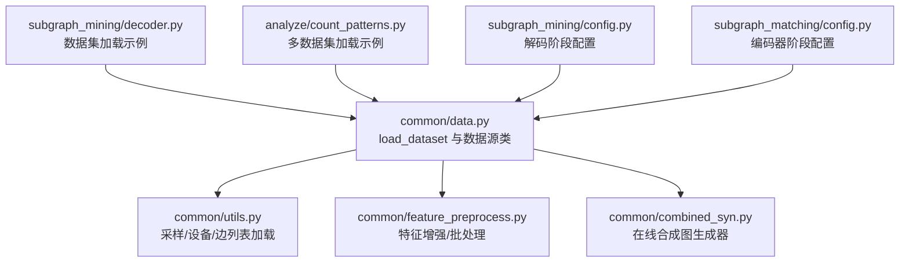
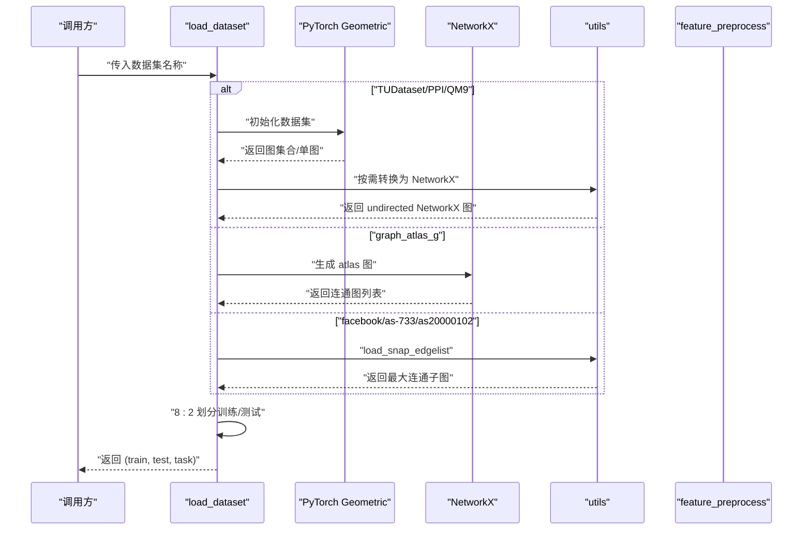
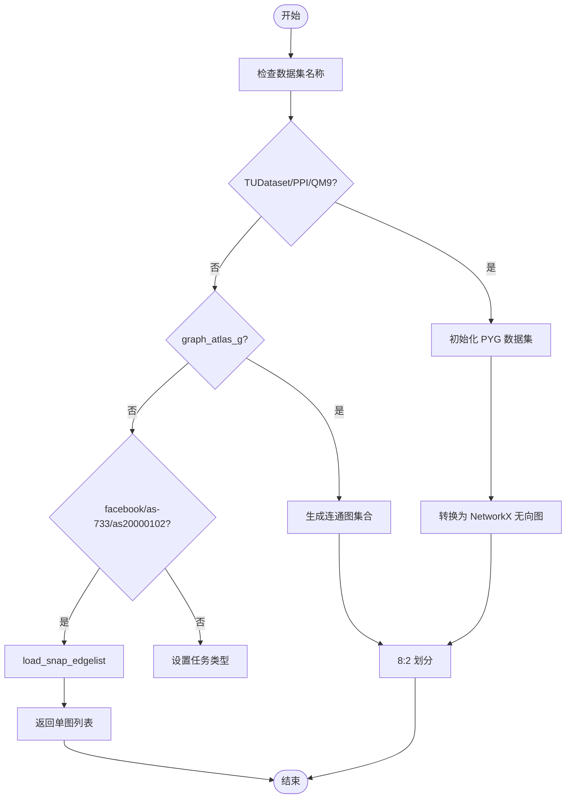
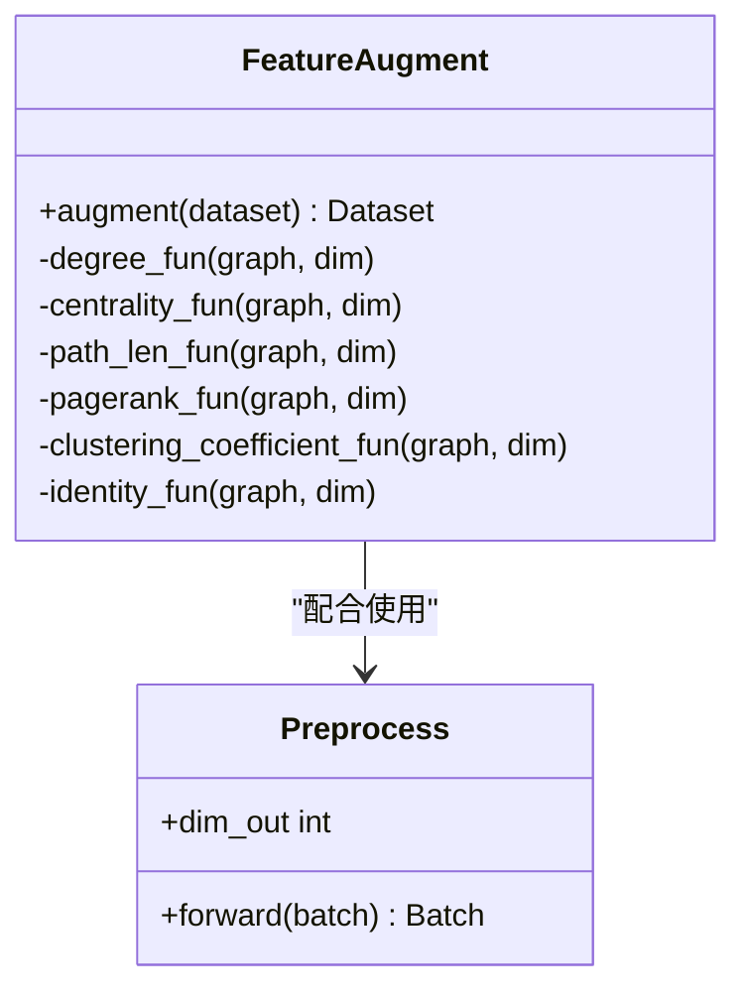
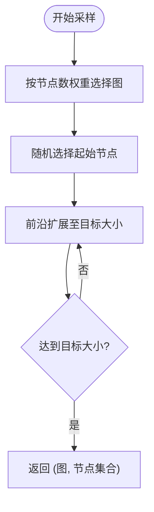
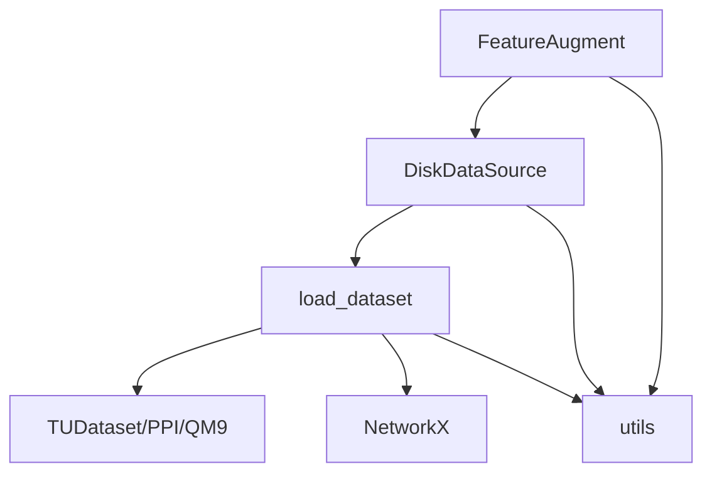

# 数据集加载

<cite>
**本文引用的文件**
- [common/data.py](file://common/data.py)
- [common/utils.py](file://common/utils.py)
- [common/feature_preprocess.py](file://common/feature_preprocess.py)
- [common/combined_syn.py](file://common/combined_syn.py)
- [subgraph_mining/decoder.py](file://subgraph_mining/decoder.py)
- [analyze/count_patterns.py](file://analyze/count_patterns.py)
- [subgraph_mining/config.py](file://subgraph_mining/config.py)
- [subgraph_matching/config.py](file://subgraph_matching/config.py)
</cite>

## 目录
1. [简介](#简介)
2. [项目结构](#项目结构)
3. [核心组件](#核心组件)
4. [架构总览](#架构总览)
5. [详细组件分析](#详细组件分析)
6. [依赖分析](#依赖分析)
7. [性能考量](#性能考量)
8. [故障排查指南](#故障排查指南)
9. [结论](#结论)
10. [附录](#附录)

## 简介
本文件聚焦于 SPMiner 的数据集加载与预处理机制，系统阐述 load_dataset 函数的实现原理与扩展方法，覆盖以下方面：
- 支持的数据集类型与真实世界数据集的加载方式（TUDataset、PPI、QM9、graph_atlas_g 等）
- 数据格式转换与任务类型判定（graph 或 graph-truncate 等）
- 训练/测试集划分策略
- 不同图数据格式的处理（NetworkX、PyTorch Geometric、自定义格式）
- 数据集配置选项与自定义数据集的接入方法

## 项目结构
围绕数据集加载与预处理的关键文件如下：
- common/data.py：提供 load_dataset、DiskDataSource、OTFSynDataSource 等核心数据源与加载逻辑
- common/utils.py：提供采样、设备选择、边列表加载等通用工具
- common/feature_preprocess.py：提供节点特征增强与批处理转换
- common/combined_syn.py：提供在线合成图生成器（用于合成数据源）
- subgraph_mining/decoder.py：展示部分数据集加载与任务类型的使用示例
- analyze/count_patterns.py：展示多种数据集加载方式（TUDataset、自定义 CSV/MATRX/TXT 等）
- subgraph_mining/config.py、subgraph_matching/config.py：提供数据集相关的配置项说明

**图表来源**
- [common/data.py:21-75](file://common/data.py#L21-L75)
- [common/utils.py:18-233](file://common/utils.py#L18-L233)
- [common/feature_preprocess.py:71-230](file://common/feature_preprocess.py#L71-L230)
- [common/combined_syn.py:9-117](file://common/combined_syn.py#L9-L117)
- [subgraph_mining/decoder.py:213-246](file://subgraph_mining/decoder.py#L213-L246)
- [analyze/count_patterns.py:337-367](file://analyze/count_patterns.py#L337-L367)
- [subgraph_mining/config.py:42-65](file://subgraph_mining/config.py#L42-L65)
- [subgraph_matching/config.py:55-77](file://subgraph_matching/config.py#L55-L77)

**章节来源**
- [common/data.py:21-75](file://common/data.py#L21-L75)
- [common/utils.py:18-233](file://common/utils.py#L18-L233)
- [common/feature_preprocess.py:71-230](file://common/feature_preprocess.py#L71-L230)
- [common/combined_syn.py:9-117](file://common/combined_syn.py#L9-L117)
- [subgraph_mining/decoder.py:213-246](file://subgraph_mining/decoder.py#L213-L246)
- [analyze/count_patterns.py:337-367](file://analyze/count_patterns.py#L337-L367)
- [subgraph_mining/config.py:42-65](file://subgraph_mining/config.py#L42-L65)
- [subgraph_matching/config.py:55-77](file://subgraph_matching/config.py#L55-L77)

## 核心组件
- load_dataset：统一的数据集入口，根据名称选择具体数据源，完成格式转换与训练/测试划分
- DiskDataSource：基于磁盘上已有图集合的数据源，支持从训练/测试集中采样子图
- OTFSynDataSource：在线合成数据源，动态生成正负样本
- utils.sample_neigh：按图大小加权采样连通邻域，支持树形/辐射形扩展
- utils.load_snap_edgelist：从 SNAP 风格边列表加载无向图
- feature_preprocess.FeatureAugment：节点特征增强（度、中心性、聚类系数、PageRank、身份矩阵谱等）
- combined_syn：多种随机图生成器（ER、WS、BA 扩展、幂律簇）

**章节来源**
- [common/data.py:21-75](file://common/data.py#L21-L75)
- [common/data.py:271-354](file://common/data.py#L271-L354)
- [common/data.py:77-114](file://common/data.py#L77-L114)
- [common/utils.py:18-53](file://common/utils.py#L18-L53)
- [common/utils.py:208-233](file://common/utils.py#L208-L233)
- [common/feature_preprocess.py:71-192](file://common/feature_preprocess.py#L71-L192)
- [common/combined_syn.py:9-117](file://common/combined_syn.py#L9-L117)

## 架构总览
下面的序列图展示了 load_dataset 的调用链与数据流：

**图表来源**
- [common/data.py:21-75](file://common/data.py#L21-L75)
- [common/utils.py:208-233](file://common/utils.py#L208-L233)

## 详细组件分析

### load_dataset 实现机制
- 支持的数据集名称与来源
  - TUDataset：ENZYMES、PROTEINS、COX2、AIDS、REDDIT-BINARY、IMDB-BINARY、FIRSTMM_DB、DBLP_v1
  - PPI：蛋白质相互作用网络
  - QM9：分子性质预测数据集
  - graph_atlas_g：生成连通图集合
  - 自定义 SNAP 边列表：facebook、as-733、as20000102
- 数据格式转换
  - 对 PyTorch Geometric 图对象，使用 to_networkx 转换为 NetworkX，并转为无向图
  - 对自定义边列表，先取最大连通子图，再作为单图返回
- 训练/测试划分
  - 将数据集打乱后按 8:2 划分，返回训练集与测试集
- 任务类型
  - 默认为 "graph"；DBLP_v1 示例中存在 "graph-truncate" 任务类型（用于特定场景）

**图表来源**
- [common/data.py:21-75](file://common/data.py#L21-L75)
- [common/utils.py:208-233](file://common/utils.py#L208-L233)

**章节来源**
- [common/data.py:21-75](file://common/data.py#L21-L75)
- [common/data.py:271-354](file://common/data.py#L271-L354)
- [common/utils.py:208-233](file://common/utils.py#L208-L233)

### 数据集类型与真实世界数据集
- TUDataset 类型
  - ENZYMES、COX2、REDDIT-BINARY 等：标准图分类数据集
  - DBLP_v1：示例中存在 "graph-truncate" 任务类型
- PPI：蛋白质相互作用网络
- QM9：分子性质预测
- graph_atlas_g：图论中的小规模连通图集合
- 自定义数据集
  - facebook：从边列表加载，取最大连通子图
  - as-733、as20000102：从 SNAP 边列表加载，取最大连通子图

**章节来源**
- [common/data.py:27-48](file://common/data.py#L27-L48)
- [common/data.py:49-60](file://common/data.py#L49-L60)
- [subgraph_mining/decoder.py:213-246](file://subgraph_mining/decoder.py#L213-L246)
- [analyze/count_patterns.py:337-367](file://analyze/count_patterns.py#L337-L367)

### 数据预处理流程
- 节点特征增强
  - 支持度、介数中心性、平均路径长、PageRank、聚类系数、身份矩阵谱等
  - 可通过配置选择拼接或加和方式融合增强特征
- 批处理与设备迁移
  - 将 NetworkX 图转换为 DeepSNAP Batch，并迁移到 GPU/CPU 设备
- 节点锚定
  - 可为每个图设置锚定节点，便于区分正负样本

**图表来源**
- [common/feature_preprocess.py:71-230](file://common/feature_preprocess.py#L71-L230)

**章节来源**
- [common/feature_preprocess.py:71-192](file://common/feature_preprocess.py#L71-L192)
- [common/feature_preprocess.py:194-230](file://common/feature_preprocess.py#L194-L230)
- [common/utils.py:286-301](file://common/utils.py#L286-L301)

### 训练/测试集划分与采样
- 划分策略
  - 将数据集打乱后按 8:2 划分训练/测试
- 子图采样
  - sample_neigh：按图大小加权采样，支持前沿扩展，保证连通性
  - 支持树形/辐射形两种扩展策略（在 DiskDataSource 中体现）

**图表来源**
- [common/utils.py:18-53](file://common/utils.py#L18-L53)

**章节来源**
- [common/data.py:61-75](file://common/data.py#L61-L75)
- [common/utils.py:18-53](file://common/utils.py#L18-L53)
- [common/data.py:290-354](file://common/data.py#L290-L354)

### 不同图数据格式的处理
- PyTorch Geometric 图
  - 转换为 NetworkX 无向图，确保后续处理一致性
- NetworkX 图
  - 直接使用，支持锚定节点与特征增强
- 自定义格式（边列表）
  - SNAP 风格边列表：自动跳过注释与空行，取最大连通子图
  - CSV/TXT/MATRX：读取边并构建图，用于特定分析脚本

**章节来源**
- [common/data.py:67-70](file://common/data.py#L67-L70)
- [common/utils.py:208-233](file://common/utils.py#L208-L233)
- [analyze/count_patterns.py:346-363](file://analyze/count_patterns.py#L346-L363)

### 数据集配置选项与自定义数据集添加方法
- 配置项（来自配置文件）
  - 编码器阶段：dataset、batch_size、n_layers、hidden_dim、conv_type、method_type、node_anchored 等
  - 解码阶段：dataset、out_path、n_neighborhoods、n_trials、min/max_pattern_size、search_strategy 等
- 自定义数据集添加步骤
  - 在 load_dataset 中新增分支，支持新名称并返回 (train, test, task)
  - 若为自定义边列表，使用 utils.load_snap_edgelist 并返回单图列表
  - 若为 PYG 数据集，直接初始化 TUDataset/PPI/QM9 并按需转换为 NetworkX
  - 若为图集合，按 8:2 划分并返回

**章节来源**
- [subgraph_matching/config.py:55-77](file://subgraph_matching/config.py#L55-L77)
- [subgraph_mining/config.py:42-65](file://subgraph_mining/config.py#L42-L65)
- [common/data.py:21-75](file://common/data.py#L21-L75)
- [common/utils.py:208-233](file://common/utils.py#L208-L233)

## 依赖分析
- 组件耦合
  - load_dataset 依赖 PyTorch Geometric 与 NetworkX，以及 utils 的转换与加载函数
  - DiskDataSource 依赖 load_dataset 与 utils 的采样函数
  - FeatureAugment 依赖 DeepSNAP 与 utils 的设备选择
- 外部依赖
  - PyTorch Geometric：TUDataset、PPI、QM9、to_networkx
  - NetworkX：图构建、连通性判断、图算法
  - DeepSNAP：Graph/Batch/Dataset

**图表来源**
- [common/data.py:21-75](file://common/data.py#L21-L75)
- [common/data.py:271-354](file://common/data.py#L271-L354)
- [common/feature_preprocess.py:71-192](file://common/feature_preprocess.py#L71-L192)
- [common/utils.py:235-243](file://common/utils.py#L235-L243)

**章节来源**
- [common/data.py:21-75](file://common/data.py#L21-L75)
- [common/data.py:271-354](file://common/data.py#L271-L354)
- [common/feature_preprocess.py:71-192](file://common/feature_preprocess.py#L71-L192)
- [common/utils.py:235-243](file://common/utils.py#L235-L243)

## 性能考量
- 图转换成本
  - 将 PyTorch Geometric 图转换为 NetworkX 会带来额外开销，建议在需要频繁操作节点属性时统一转换一次
- 训练/测试划分
  - 8:2 划分简单高效，适合大多数场景；如需更严格的验证，可考虑交叉验证
- 特征增强
  - 聚类系数、PageRank 等计算复杂度较高，可根据需求选择性启用
- 设备迁移
  - 批处理完成后统一迁移到设备，避免多次设备切换

## 故障排查指南
- 数据集名称错误
  - 确认名称与 load_dataset 分支一致，注意大小写与拼写
- 边列表格式问题
  - 确保边列表文件中不含注释行与空行，节点 ID 从 0 或 1 连续
- 连通性问题
  - 自定义边列表需取最大连通子图；若图不连通，可能导致采样失败
- 设备不可用
  - 若 CUDA 不可用，系统会回退到 CPU；可通过 utils.get_device 查看当前设备

**章节来源**
- [common/data.py:21-75](file://common/data.py#L21-L75)
- [common/utils.py:208-233](file://common/utils.py#L208-L233)
- [common/utils.py:235-243](file://common/utils.py#L235-L243)

## 结论
load_dataset 提供了统一、可扩展的数据集加载入口，覆盖了主流图数据集与自定义格式。通过合理的数据格式转换、任务类型判定与训练/测试划分，结合特征增强与批处理工具，能够高效支撑子图匹配与模式挖掘任务。对于新数据集，只需在 load_dataset 中添加相应分支并遵循统一的返回约定，即可无缝接入现有流水线。

## 附录
- 常用数据集名称
  - TUDataset：enzymes、proteins、cox2、aids、reddit-binary、imdb-binary、firstmm_db、dblp
  - 其他：ppi、qm9、atlas、facebook、as-733、as20000102
- 关键函数路径
  - [load_dataset:21-75](file://common/data.py#L21-L75)
  - [sample_neigh:18-53](file://common/utils.py#L18-L53)
  - [load_snap_edgelist:208-233](file://common/utils.py#L208-L233)
  - [batch_nx_graphs:286-301](file://common/utils.py#L286-L301)
  - [FeatureAugment.augment:186-192](file://common/feature_preprocess.py#L186-L192)