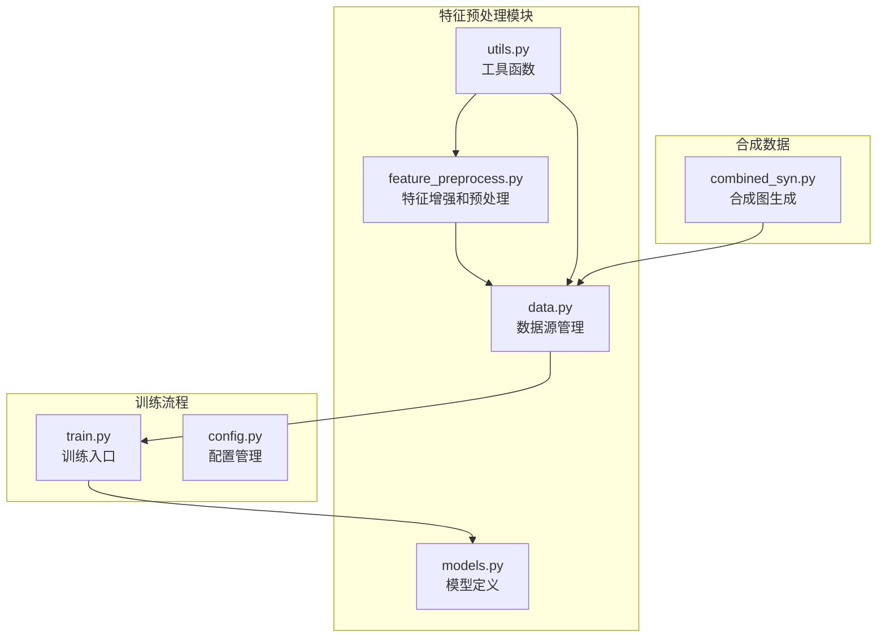
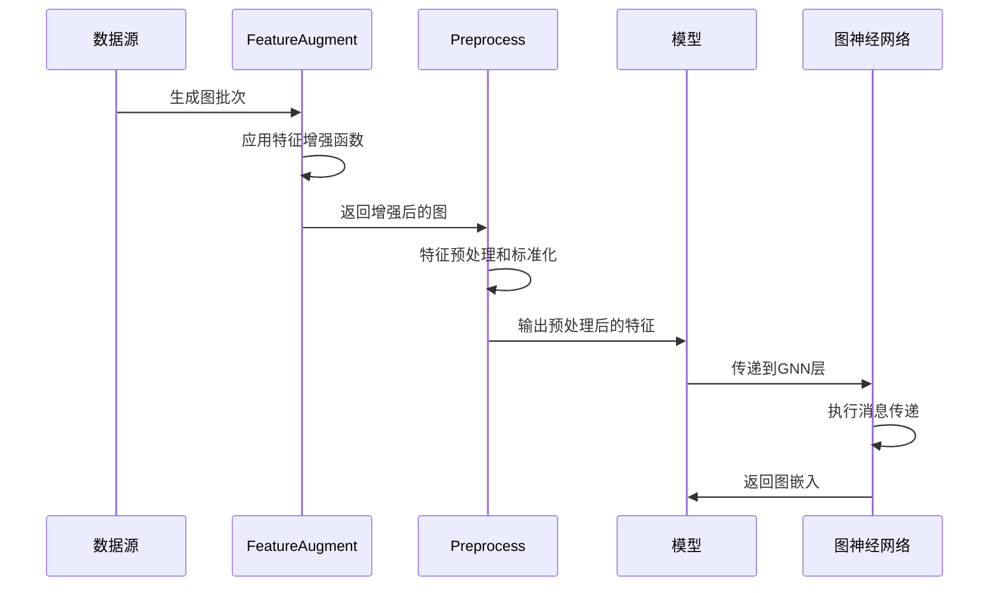
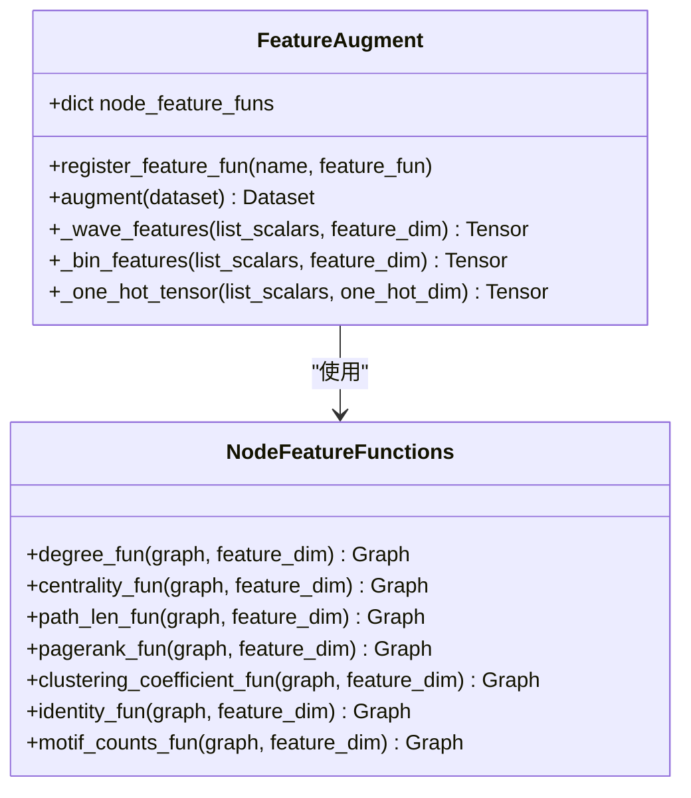
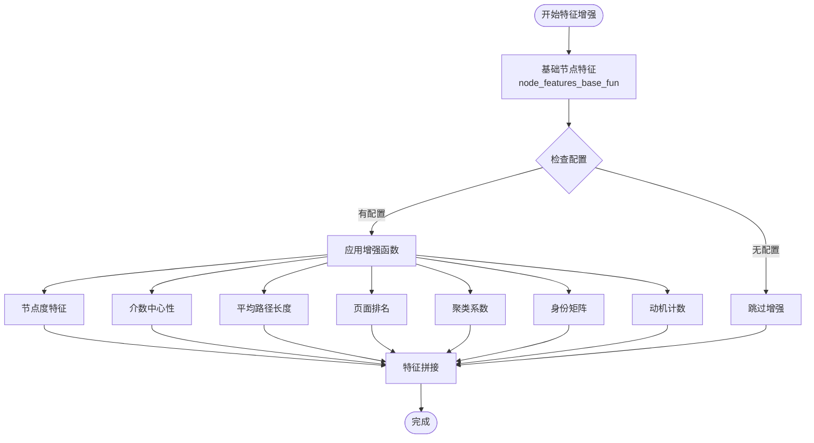
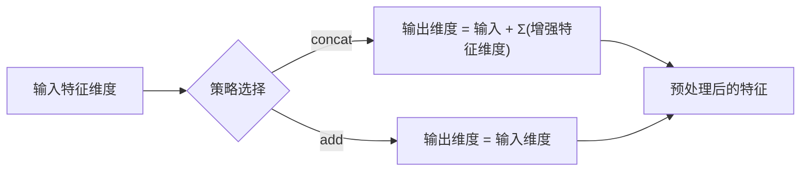
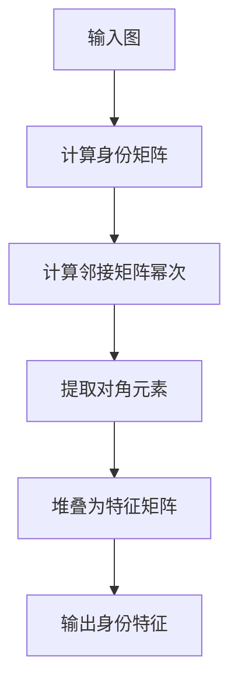
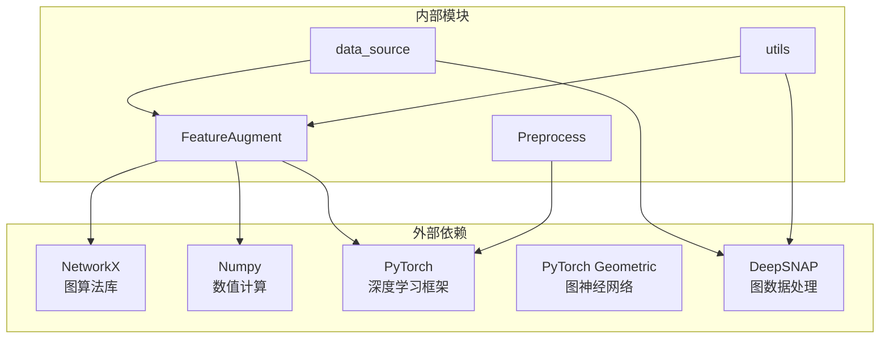

# 特征预处理

<cite>
**本文档引用的文件**
- [feature_preprocess.py](file://common/feature_preprocess.py)
- [data.py](file://common/data.py)
- [utils.py](file://common/utils.py)
- [models.py](file://common/models.py)
- [train.py](file://subgraph_matching/train.py)
- [config.py](file://subgraph_matching/config.py)
- [combined_syn.py](file://common/combined_syn.py)
</cite>

## 目录
1. [简介](#简介)
2. [项目结构](#项目结构)
3. [核心组件](#核心组件)
4. [架构概览](#架构概览)
5. [详细组件分析](#详细组件分析)
6. [依赖关系分析](#依赖关系分析)
7. [性能考虑](#性能考虑)
8. [故障排除指南](#故障排除指南)
9. [结论](#结论)

## 简介

SPMiner的特征预处理模块是图神经网络训练过程中的关键组件，负责对图数据进行特征增强和预处理。该模块实现了多种特征工程技术，包括节点特征、边特征和全局特征的处理，为后续的图神经网络编码器提供高质量的输入特征。

该模块的核心目标是：
- 提升图数据的表示能力
- 标准化和归一化不同类型的特征
- 为图神经网络提供丰富的上下文信息
- 支持多种图数据类型的特征工程

## 项目结构

特征预处理模块位于`common`目录下，与数据加载、模型定义等核心组件紧密协作：

**图表来源**
- [feature_preprocess.py:1-230](file://common/feature_preprocess.py#L1-L230)
- [data.py:1-447](file://common/data.py#L1-L447)
- [models.py:1-318](file://common/models.py#L1-L318)

**章节来源**
- [feature_preprocess.py:1-230](file://common/feature_preprocess.py#L1-L230)
- [data.py:1-447](file://common/data.py#L1-L447)

## 核心组件

特征预处理模块包含两个核心类：`FeatureAugment`和`Preprocess`，它们协同工作实现完整的特征工程流程。

### 主要特性

1. **多类型特征支持**：支持数值特征、分类特征和混合特征
2. **动态特征增强**：根据配置动态添加特征
3. **标准化处理**：提供多种特征标准化方法
4. **内存优化**：针对大规模图数据的内存管理
5. **可扩展设计**：支持自定义特征函数注册

**章节来源**
- [feature_preprocess.py:71-230](file://common/feature_preprocess.py#L71-L230)

## 架构概览

特征预处理系统的整体架构采用模块化设计，各组件职责明确：

**图表来源**
- [data.py:180-214](file://common/data.py#L180-L214)
- [models.py:182-226](file://common/models.py#L182-L226)

## 详细组件分析

### FeatureAugment 类分析

`FeatureAugment`类是特征增强的核心实现，提供了多种特征工程方法：

#### 主要功能

1. **节点特征增强**：计算节点度、介数中心性、路径长度等
2. **图特征计算**：计算聚类系数、页面排名等全局特征
3. **身份矩阵计算**：生成图的幂次邻接矩阵
4. **动机计数**：计算节点轨道计数

#### 特征增强方法

**图表来源**
- [feature_preprocess.py:71-192](file://common/feature_preprocess.py#L71-L192)

#### 特征处理算法

**图表来源**
- [feature_preprocess.py:186-192](file://common/feature_preprocess.py#L186-L192)

**章节来源**
- [feature_preprocess.py:71-192](file://common/feature_preprocess.py#L71-L192)

### Preprocess 类分析

`Preprocess`类负责特征预处理和标准化：

#### 预处理策略

1. **连接策略** (`concat`)：将原始特征与增强特征拼接
2. **相加策略** (`add`)：通过线性层将增强特征与原始特征相加

#### 维度计算

**图表来源**
- [feature_preprocess.py:194-229](file://common/feature_preprocess.py#L194-L229)

**章节来源**
- [feature_preprocess.py:194-229](file://common/feature_preprocess.py#L194-L229)

### 标准化和归一化方法

特征预处理模块提供了多种标准化技术：

#### 数值特征标准化

1. **波形特征**：使用正弦余弦变换将标量转换为高维特征
2. **分箱特征**：将连续值按区间分组并进行独热编码
3. **独热编码**：将离散特征转换为二进制向量

#### 图特征计算

**图表来源**
- [feature_preprocess.py:50-69](file://common/feature_preprocess.py#L50-L69)

**章节来源**
- [feature_preprocess.py:50-69](file://common/feature_preprocess.py#L50-L69)

## 依赖关系分析

特征预处理模块与其他组件的依赖关系：

**图表来源**
- [feature_preprocess.py:1-25](file://common/feature_preprocess.py#L1-L25)
- [data.py:17-19](file://common/data.py#L17-L19)

**章节来源**
- [feature_preprocess.py:1-25](file://common/feature_preprocess.py#L1-L25)
- [data.py:17-19](file://common/data.py#L17-L19)

## 性能考虑

### 内存优化策略

1. **延迟计算**：只在需要时计算特征
2. **批处理优化**：支持大规模图数据的批处理
3. **设备迁移**：智能的GPU/CPU内存管理

### 计算效率

1. **向量化操作**：充分利用NumPy和PyTorch的向量化能力
2. **稀疏矩阵**：使用稀疏矩阵表示邻接关系
3. **缓存机制**：缓存计算结果避免重复计算

### 最佳实践建议

1. **特征维度规划**：合理设置特征维度避免维度爆炸
2. **内存监控**：定期监控内存使用情况
3. **批大小调整**：根据硬件条件调整批大小
4. **特征选择**：选择对任务最有价值的特征

## 故障排除指南

### 常见问题及解决方案

#### 特征维度不匹配

**问题**：增强后的特征维度与模型期望不符
**解决方案**：检查`FEATURE_AUGMENT_DIMS`配置，确保维度设置正确

#### 内存溢出

**问题**：处理大型图时出现内存不足
**解决方案**：降低批大小，使用更高效的特征表示

#### 计算性能问题

**问题**：特征计算速度慢
**解决方案**：启用GPU加速，优化特征计算算法

**章节来源**
- [feature_preprocess.py:26-32](file://common/feature_preprocess.py#L26-L32)

## 结论

SPMiner的特征预处理模块通过精心设计的特征增强和标准化技术，为图神经网络提供了高质量的输入特征。该模块具有以下优势：

1. **灵活性**：支持多种特征增强策略和标准化方法
2. **可扩展性**：易于添加新的特征工程方法
3. **性能优化**：针对大规模图数据进行了专门优化
4. **集成性**：与整个SPMiner系统无缝集成

通过合理配置和使用，该模块能够显著提升图神经网络的性能，为子图匹配和图挖掘任务提供强大的特征基础。