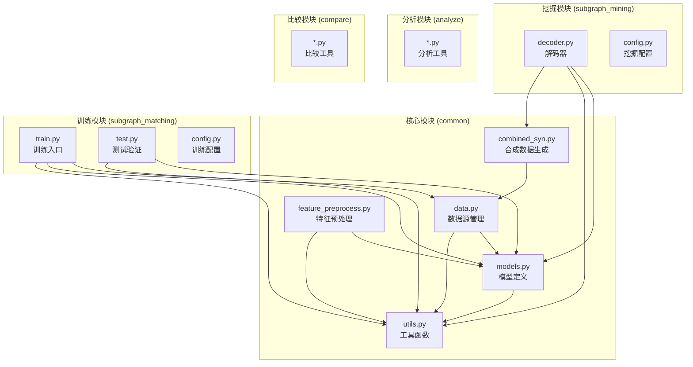
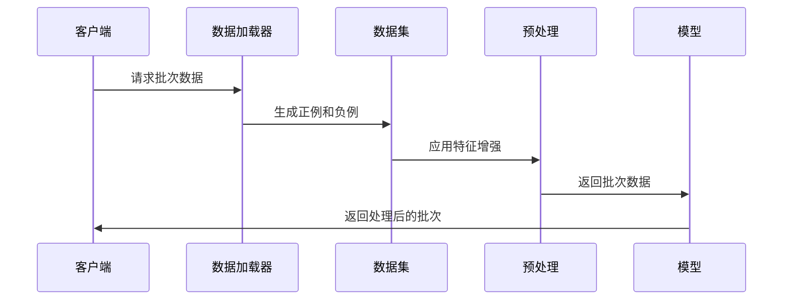
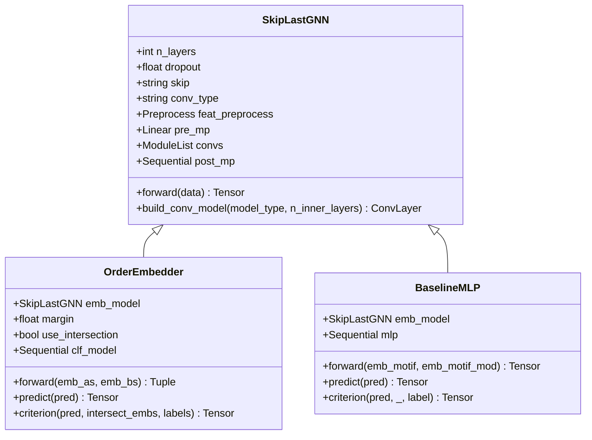
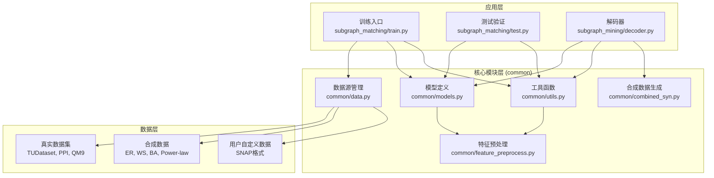
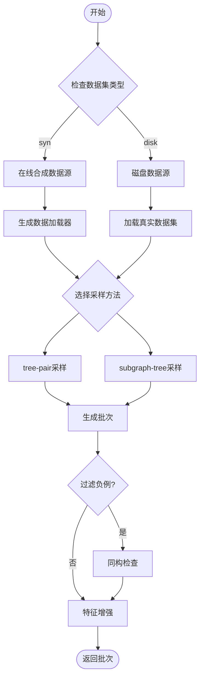
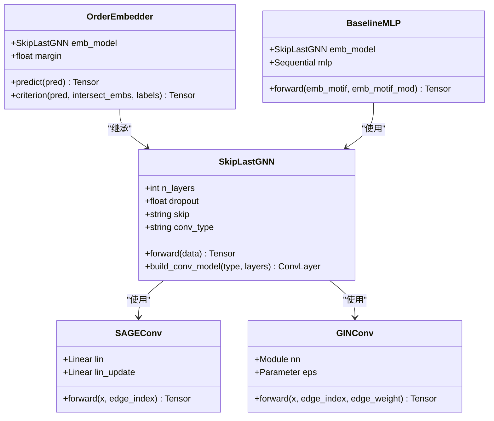
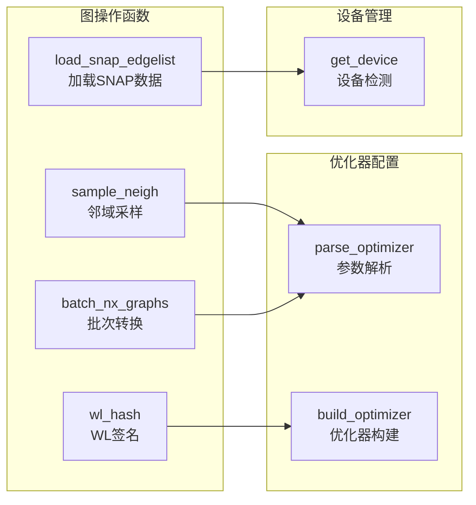
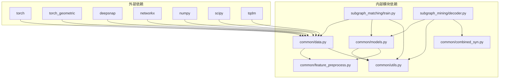

# 核心模块架构

<cite>
**本文档引用的文件**
- [common/data.py](file://common/data.py)
- [common/models.py](file://common/models.py)
- [common/utils.py](file://common/utils.py)
- [common/feature_preprocess.py](file://common/feature_preprocess.py)
- [common/combined_syn.py](file://common/combined_syn.py)
- [subgraph_matching/train.py](file://subgraph_matching/train.py)
- [subgraph_matching/test.py](file://subgraph_matching/test.py)
- [subgraph_mining/decoder.py](file://subgraph_mining/decoder.py)
- [subgraph_mining/config.py](file://subgraph_mining/config.py)
- [subgraph_matching/config.py](file://subgraph_matching/config.py)
</cite>

## 目录
1. [简介](#简介)
2. [项目结构](#项目结构)
3. [核心组件](#核心组件)
4. [架构概览](#架构概览)
5. [详细组件分析](#详细组件分析)
6. [依赖关系分析](#依赖关系分析)
7. [性能考虑](#性能考虑)
8. [故障排除指南](#故障排除指南)
9. [结论](#结论)

## 简介

SPMiner是一个基于深度学习的子图挖掘和模式发现系统，专注于从大规模图数据中识别频繁出现的子结构模式。该项目的核心模块围绕common包构建，提供了完整的数据处理、模型定义和工具函数体系，支撑着从子图匹配训练到模式挖掘解码的完整流水线。

本项目采用模块化设计，将数据源管理、特征预处理、图嵌入模型和实用工具分离到独立的模块中，实现了高内聚低耦合的架构设计。通过这种组织方式，开发者可以灵活地扩展和定制各个组件，同时保持系统的整体一致性。

## 项目结构

SPMiner项目采用清晰的功能模块划分，主要包含以下核心目录：

**图表来源**
- [common/data.py:1-447](file://common/data.py#L1-L447)
- [common/models.py:1-318](file://common/models.py#L1-L318)
- [common/utils.py:1-302](file://common/utils.py#L1-L302)

**章节来源**
- [common/data.py:1-447](file://common/data.py#L1-L447)
- [common/models.py:1-318](file://common/models.py#L1-L318)
- [common/utils.py:1-302](file://common/utils.py#L1-L302)

## 核心组件

### 数据源管理模块 (common/data.py)

数据源管理模块是SPMiner的核心基础设施，负责处理各种类型的图数据源，包括真实世界数据集和在线合成数据。该模块提供了统一的接口来抽象不同的数据获取方式。

#### 主要数据源类型

1. **DiskDataSource**: 处理存储在磁盘上的真实数据集
2. **OTFSynDataSource**: 在线生成合成数据
3. **OTFSynImbalancedDataSource**: 不平衡的在线合成数据
4. **DiskImbalancedDataSource**: 不平衡的真实数据

#### 数据加载器工作机制

**图表来源**
- [common/data.py:271-354](file://common/data.py#L271-L354)
- [common/feature_preprocess.py:71-192](file://common/feature_preprocess.py#L71-L192)

**章节来源**
- [common/data.py:77-430](file://common/data.py#L77-L430)

### 模型定义模块 (common/models.py)

模型定义模块包含了SPMiner的核心图嵌入模型，主要分为三类：

1. **SkipLastGNN**: 支持跳跃连接的图神经网络编码器
2. **OrderEmbedder**: 序嵌入模型，学习子图包含关系
3. **BaselineMLP**: 双图拼接分类基线模型

#### GNN架构设计

**图表来源**
- [common/models.py:22-318](file://common/models.py#L22-L318)

**章节来源**
- [common/models.py:1-318](file://common/models.py#L1-L318)

### 工具函数模块 (common/utils.py)

工具函数模块提供了系统运行所需的通用功能，包括图采样、特征处理、设备管理等。

#### 核心工具函数

1. **sample_neigh**: 在图集合中按图大小加权采样连通邻域
2. **wl_hash**: 计算图的WL风格哈希签名
3. **batch_nx_graphs**: 将NetworkX图批量转换为PyTorch几何格式
4. **get_device**: 懒加载运行设备（优先CUDA）

**章节来源**
- [common/utils.py:18-302](file://common/utils.py#L18-L302)

### 特征预处理模块 (common/feature_preprocess.py)

特征预处理模块负责为图数据添加丰富的节点特征，提升模型的表达能力。

#### 特征增强方法

1. **基础特征**: 节点度、介数中心性、路径长度、PageRank
2. **拓扑特征**: 聚类系数、身份矩阵、模体计数
3. **特征融合**: 支持拼接和相加两种融合方式

**章节来源**
- [common/feature_preprocess.py:1-230](file://common/feature_preprocess.py#L1-L230)

## 架构概览

SPMiner的整体架构采用分层设计，从底层的数据处理到顶层的应用逻辑形成了清晰的层次结构：

**图表来源**
- [subgraph_matching/train.py:1-253](file://subgraph_matching/train.py#L1-L253)
- [subgraph_mining/decoder.py:1-276](file://subgraph_mining/decoder.py#L1-L276)

## 详细组件分析

### 数据源管理机制详解

数据源管理机制是SPMiner的核心基础设施，提供了统一的数据获取和处理接口。该机制支持多种数据源类型和采样策略。

#### 数据加载器工作原理

**图表来源**
- [common/data.py:290-354](file://common/data.py#L290-L354)

#### 数据预处理流程

数据预处理流程确保输入数据的质量和一致性，主要包括以下步骤：

1. **图转换**: 将PyTorch几何格式转换为NetworkX格式
2. **特征增强**: 添加节点属性和拓扑特征
3. **批次构建**: 将多个图合并为批次
4. **设备迁移**: 将数据移动到合适的计算设备

**章节来源**
- [common/data.py:21-75](file://common/data.py#L21-L75)
- [common/feature_preprocess.py:186-192](file://common/feature_preprocess.py#L186-L192)

### 模型定义模块深入分析

模型定义模块采用了模块化设计，每个模型都有明确的职责和接口规范。

#### 图嵌入模型设计思路

**图表来源**
- [common/models.py:101-318](file://common/models.py#L101-L318)

#### 序嵌入模型的约束机制

序嵌入模型通过数学约束学习子图包含关系：

1. **违反量计算**: `e = Σ(max(0, emb_bs - emb_as))²`
2. **正例训练**: 使违反量趋近于0
3. **负例训练**: 使违反量至少大于margin

**章节来源**
- [common/models.py:46-100](file://common/models.py#L46-L100)

### 工具函数模块详解

工具函数模块提供了系统运行所需的各种实用功能，每个函数都有明确的设计目标和使用场景。

#### 图操作工具函数

**图表来源**
- [common/utils.py:18-302](file://common/utils.py#L18-L302)

**章节来源**
- [common/utils.py:18-302](file://common/utils.py#L18-L302)

## 依赖关系分析

SPMiner的模块间依赖关系体现了清晰的分层架构和松耦合设计：

**图表来源**
- [common/data.py:17-19](file://common/data.py#L17-L19)
- [common/models.py:18-19](file://common/models.py#L18-L19)

### 模块耦合度分析

SPMiner在模块设计上遵循了高内聚低耦合的原则：

1. **高内聚**: 每个模块专注于特定功能领域
2. **低耦合**: 模块间通过明确定义的接口交互
3. **可替换性**: 关键组件支持插件式替换

**章节来源**
- [common/data.py:17-19](file://common/data.py#L17-L19)
- [common/models.py:18-19](file://common/models.py#L18-L19)

## 性能考虑

SPMiner在设计时充分考虑了性能优化，主要体现在以下几个方面：

### 计算效率优化

1. **批量处理**: 通过DeepSNAP的Batch类实现高效的图批次处理
2. **设备管理**: 懒加载设备检测，优先使用GPU加速
3. **内存优化**: 合理的内存管理和垃圾回收策略

### 算法复杂度分析

- **数据加载**: O(N × M)，其中N是图数量，M是平均节点数
- **特征预处理**: O(N × M × K)，K是特征维度
- **模型训练**: O(E × L)，E是边数量，L是层数

### 扩展性设计

1. **分布式支持**: 支持分布式采样和训练
2. **可配置性**: 通过参数控制各种行为
3. **插件架构**: 支持自定义卷积层和损失函数

## 故障排除指南

### 常见问题及解决方案

#### 设备相关问题

**问题**: CUDA不可用或内存不足
**解决方案**: 
- 检查CUDA版本兼容性
- 调整批次大小参数
- 使用CPU模式进行调试

#### 数据加载问题

**问题**: 数据集加载失败
**解决方案**:
- 确认数据文件路径正确
- 检查数据格式符合要求
- 验证网络连接状态

#### 模型训练问题

**问题**: 训练不收敛或性能不佳
**解决方案**:
- 调整学习率和批次大小
- 检查数据质量
- 验证模型配置参数

**章节来源**
- [common/utils.py:235-243](file://common/utils.py#L235-L243)

## 结论

SPMiner的核心模块架构展现了优秀的软件工程实践，通过模块化设计实现了高度的可维护性和可扩展性。该架构的主要优势包括：

1. **清晰的分层设计**: 从数据处理到应用逻辑的层次分明
2. **模块化的组件设计**: 每个模块职责明确，易于理解和维护
3. **灵活的扩展机制**: 支持自定义数据源、模型和特征
4. **高性能的实现**: 通过批处理和设备优化确保运行效率

对于开发者而言，SPMiner提供了良好的扩展平台，可以通过以下方式进行定制：

- **数据源扩展**: 实现新的DataSource子类
- **模型定制**: 继承现有模型类或创建全新模型
- **特征工程**: 添加新的特征预处理方法
- **算法集成**: 集成新的图挖掘算法

这种设计使得SPMiner不仅是一个完整的子图挖掘系统，更是一个开放的研究平台，为图数据分析领域的研究和应用提供了坚实的基础。