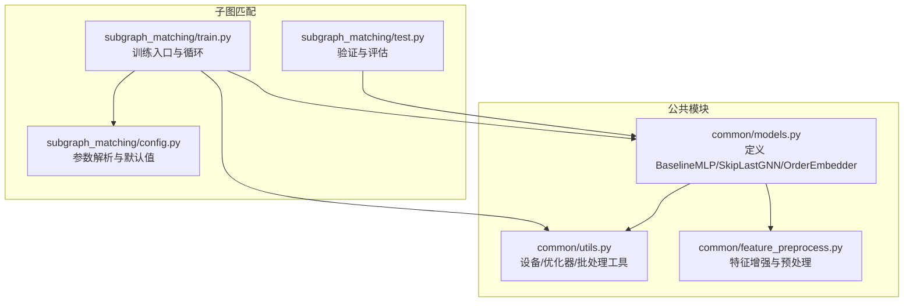
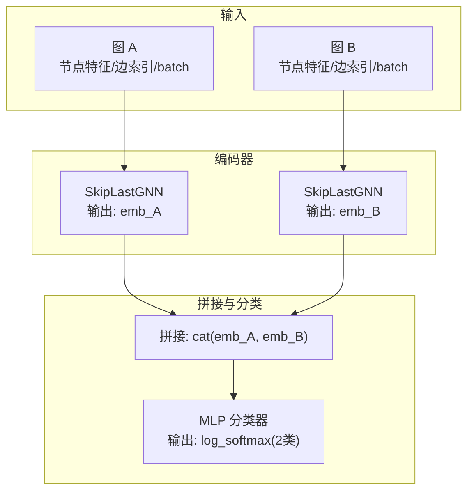
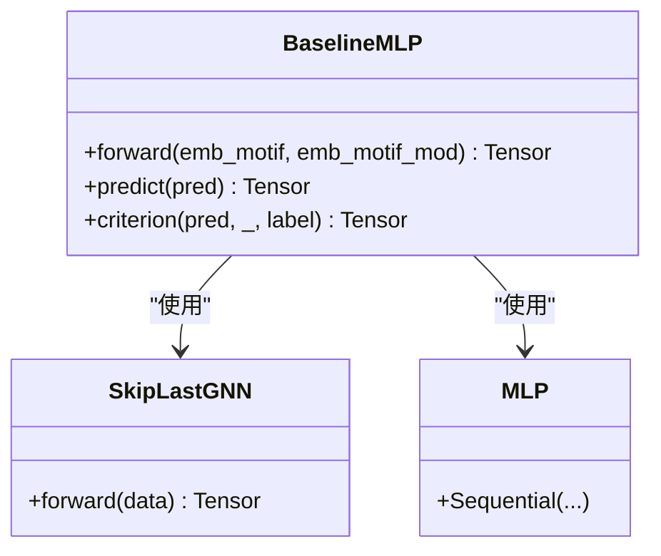
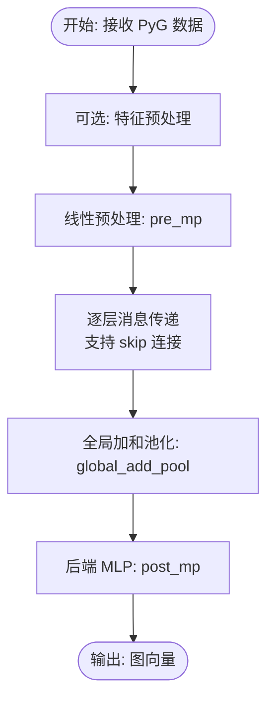
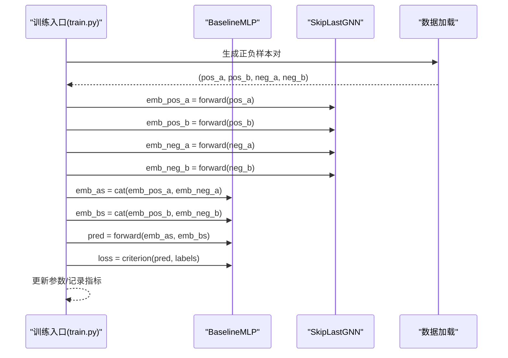
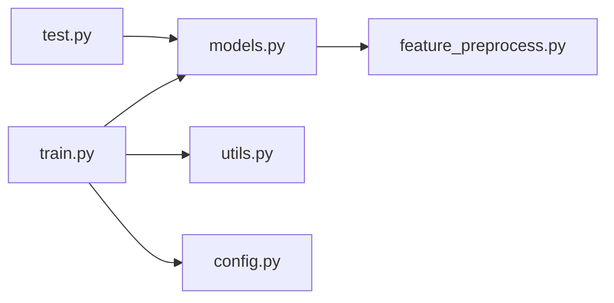

# 基线MLP模型

<cite>
**本文引用的文件**
- [models.py](file://common/models.py)
- [utils.py](file://common/utils.py)
- [feature_preprocess.py](file://common/feature_preprocess.py)
- [train.py](file://subgraph_matching/train.py)
- [config.py](file://subgraph_matching/config.py)
- [test.py](file://subgraph_matching/test.py)
</cite>

## 目录
1. [简介](#简介)
2. [项目结构](#项目结构)
3. [核心组件](#核心组件)
4. [架构总览](#架构总览)
5. [详细组件分析](#详细组件分析)
6. [依赖关系分析](#依赖关系分析)
7. [性能考量](#性能考量)
8. [故障排查指南](#故障排查指南)
9. [结论](#结论)
10. [附录](#附录)

## 简介
本技术文档围绕 SPMiner 中的基线 MLP 模型（BaselineMLP）展开，系统阐述其作为“双图拼接分类基线”的设计目的、应用场景以及与 order embedding 的对比价值。BaselineMLP 将两个图的向量表示通过拼接后送入 MLP 进行二分类，用于衡量不同图嵌入策略（如 SkipLastGNN）在子图包含关系判别上的有效性。文档还详细说明模型的输入处理流程、架构组成、关键参数配置、forward/predict/criterion 的实现细节，并提供使用示例与性能基准参考，帮助开发者理解更复杂模型的改进效果。

## 项目结构
本项目采用模块化组织，与基线 MLP 直接相关的关键文件如下：
- common/models.py：定义 BaselineMLP、SkipLastGNN、OrderEmbedder 等模型组件
- common/utils.py：通用工具，包括设备选择、优化器构建、数据批处理等
- common/feature_preprocess.py：特征增强与预处理模块
- subgraph_matching/train.py：子图匹配训练入口，包含模型构建与训练循环
- subgraph_matching/config.py：训练参数解析与默认配置
- subgraph_matching/test.py：验证与评估流程（包含对 mlp 方法的处理）

图表来源
- [models.py:1-318](file://common/models.py#L1-L318)
- [utils.py:1-302](file://common/utils.py#L1-L302)
- [feature_preprocess.py:1-230](file://common/feature_preprocess.py#L1-L230)
- [train.py:1-253](file://subgraph_matching/train.py#L1-L253)
- [config.py:1-82](file://subgraph_matching/config.py#L1-L82)
- [test.py:58-118](file://subgraph_matching/test.py#L58-L118)

章节来源
- [models.py:1-318](file://common/models.py#L1-L318)
- [utils.py:1-302](file://common/utils.py#L1-L302)
- [feature_preprocess.py:1-230](file://common/feature_preprocess.py#L1-L230)
- [train.py:1-253](file://subgraph_matching/train.py#L1-L253)
- [config.py:1-82](file://subgraph_matching/config.py#L1-L82)
- [test.py:58-118](file://subgraph_matching/test.py#L58-L118)

## 核心组件
- BaselineMLP：双图拼接分类基线。输入为两个图的向量表示，直接拼接后经 MLP 二分类，常用于对比 order embedding 效果。
- SkipLastGNN：支持 skip connection 的图神经网络编码器，先做线性预处理，再堆叠多层消息传递，最后通过全图池化与 MLP 得到固定维度图表示。
- OrderEmbedder：序嵌入模型，学习表达“子图包含关系”的嵌入空间，通常与分类器配合使用。

章节来源
- [models.py:22-44](file://common/models.py#L22-L44)
- [models.py:101-229](file://common/models.py#L101-L229)
- [models.py:46-99](file://common/models.py#L46-L99)

## 架构总览
BaselineMLP 的整体架构由两部分组成：
- 编码器：SkipLastGNN 将原始图数据转换为固定维度的图向量表示
- 分类器：MLP 将两个图向量拼接后进行二分类（a 是否为 b 的子图）

图表来源
- [models.py:28-37](file://common/models.py#L28-L37)
- [models.py:107-226](file://common/models.py#L107-L226)

## 详细组件分析

### BaselineMLP 组件
- 设计目的：作为简单有效的基线，验证图嵌入质量对二分类任务的影响，便于与更复杂的序嵌入模型对比。
- 架构组成：
  - 编码器：SkipLastGNN(input_dim, hidden_dim, hidden_dim, args)
  - 分类器：Sequential(Linear(2*hidden_dim -> 256), ReLU, Linear(256 -> 2))
- 输入处理：接收两个图的向量表示 emb_motif 与 emb_motif_mod，直接拼接后进入 MLP
- 输出：log_softmax 归一化的二分类对数概率
- 关键方法：
  - forward：拼接 + MLP + log_softmax
  - predict：返回原始预测（用于后续阈值/分类决策）
  - criterion：NLLLoss，直接对 log_softmax 结果与标签计算

图表来源
- [models.py:22-44](file://common/models.py#L22-L44)
- [models.py:101-229](file://common/models.py#L101-L229)

章节来源
- [models.py:22-44](file://common/models.py#L22-L44)

### SkipLastGNN 组件
- 设计目的：提供稳定的图嵌入能力，支持多种图卷积类型与 skip 连接策略，最终输出固定维度的图向量。
- 关键特性：
  - 特征增强：可选地对节点特征进行预处理（拼接/相加）
  - 卷积层：支持 GCN/GIN/SAGE/GraphConv/GAT/Gated/PNA 等
  - 跳跃连接：支持 'all'、'learnable'、'last' 等策略
  - 全图池化：global_add_pool 后接 MLP 得到图级表示
- 输入：PyG 数据对象（node_feature, edge_index, batch）
- 输出：形状为 [batch_size, output_dim] 的图向量

图表来源
- [models.py:107-226](file://common/models.py#L107-L226)
- [feature_preprocess.py:186-229](file://common/feature_preprocess.py#L186-L229)

章节来源
- [models.py:101-229](file://common/models.py#L101-L229)
- [feature_preprocess.py:71-229](file://common/feature_preprocess.py#L71-L229)

### 训练与使用流程（与 BaselineMLP 相关）
- 模型构建：在训练入口中根据 method_type 选择 BaselineMLP 或 OrderEmbedder
- 嵌入计算：分别对正负样本对的两个图调用 SkipLastGNN 获取向量表示
- 拼接与分类：将两图向量拼接后送入 BaselineMLP 的 MLP 进行二分类
- 损失计算：使用 NLLLoss 对 log_softmax 结果与标签计算损失
- 评估：在验证阶段对所有样本进行预测并统计指标（准确率、精确率、召回率、AUROC、AP 等）

图表来源
- [train.py:49-59](file://subgraph_matching/train.py#L49-L59)
- [train.py:118-150](file://subgraph_matching/train.py#L118-L150)
- [models.py:28-43](file://common/models.py#L28-L43)

章节来源
- [train.py:49-150](file://subgraph_matching/train.py#L49-L150)
- [models.py:22-44](file://common/models.py#L22-L44)

## 依赖关系分析
- 模块内依赖
  - BaselineMLP 依赖 SkipLastGNN 作为编码器，依赖 MLP 分类器
  - SkipLastGNN 依赖 feature_preprocess 进行特征增强，依赖 torch_geometric 进行消息传递与池化
- 训练入口依赖
  - train.py 通过 utils 构建优化器与设备，通过 config 注册参数，通过 models 构建模型
- 评估依赖
  - test.py 对 mlp 方法进行特殊处理（取第二列作为正类得分），并计算各类指标

图表来源
- [train.py:1-253](file://subgraph_matching/train.py#L1-L253)
- [models.py:1-318](file://common/models.py#L1-L318)
- [utils.py:1-302](file://common/utils.py#L1-L302)
- [feature_preprocess.py:1-230](file://common/feature_preprocess.py#L1-L230)
- [config.py:1-82](file://subgraph_matching/config.py#L1-L82)
- [test.py:58-118](file://subgraph_matching/test.py#L58-L118)

章节来源
- [train.py:1-253](file://subgraph_matching/train.py#L1-L253)
- [models.py:1-318](file://common/models.py#L1-L318)
- [utils.py:1-302](file://common/utils.py#L1-L302)
- [feature_preprocess.py:1-230](file://common/feature_preprocess.py#L1-L230)
- [config.py:1-82](file://subgraph_matching/config.py#L1-L82)
- [test.py:58-118](file://subgraph_matching/test.py#L58-L118)

## 性能考量
- 计算复杂度
  - SkipLastGNN 的消息传递复杂度受图规模与层数影响，池化与 MLP 的开销相对较小
  - BaselineMLP 的拼接与 MLP 层在隐藏维度固定时具有线性复杂度
- 内存占用
  - 训练时建议合理设置 batch_size 与 hidden_dim，避免显存溢出
  - 使用 learnable skip 连接可能增加参数量与内存占用
- 训练稳定性
  - Dropout 与 LeakyReLU 等正则化有助于提升泛化
  - 优化器与学习率需结合任务规模与数据分布调整

## 故障排查指南
- 设备与显存
  - 若报错提示设备不可用，检查 utils.get_device 的返回值与 CUDA 可用性
- 数据批处理
  - 确保传入的 PyG 数据对象包含 node_feature、edge_index、batch 字段
- 模型加载
  - 测试模式下加载模型权重需指定正确的 model_path 与 map_location
- 指标异常
  - 若 AUROC/AP 为 NaN，检查标签分布与预测概率范围，确认 log_softmax 输出正确

章节来源
- [utils.py:235-243](file://common/utils.py#L235-L243)
- [train.py:56-58](file://subgraph_matching/train.py#L56-L58)
- [test.py:78-88](file://subgraph_matching/test.py#L78-L88)

## 结论
BaselineMLP 通过“双图拼接 + MLP”的简单设计，有效验证了图嵌入质量对子图包含关系判别任务的重要性。它与 OrderEmbedder 形成对照，前者强调嵌入质量，后者强调序关系建模与分类器融合。在实际应用中，开发者可先以 BaselineMLP 作为基线，再引入更复杂的嵌入策略与损失函数，以量化改进效果。

## 附录

### 模型配置参数说明
- input_dim：输入节点特征维度（在 BaselineMLP 中通常为 1，因为 SkipLastGNN 的预处理会将其扩展）
- hidden_dim：隐层维度，控制编码器与分类器的宽度
- args.n_layers：SkipLastGNN 的消息传递层数
- args.conv_type：图卷积类型（如 SAGE、GIN、GCN、GAT、GraphConv、Gated、PNA）
- args.skip：跳跃连接策略（'all'、'learnable'、'last'）
- args.dropout：训练时的丢弃率
- args.margin：序嵌入模型的边界参数（在 BaselineMLP 中不使用）
- args.batch_size：训练批大小
- args.lr：学习率
- args.weight_decay：权重衰减
- args.opt_scheduler：优化器调度器类型（如 step、cos）
- args.model_path：模型保存/加载路径
- args.test：测试模式开关

章节来源
- [config.py:18-77](file://subgraph_matching/config.py#L18-L77)
- [models.py:107-157](file://common/models.py#L107-L157)

### forward/predict/criterion 实现要点
- forward
  - 输入：两个图的向量表示 emb_motif 与 emb_motif_mod
  - 处理：拼接后经 MLP，再进行 log_softmax 归一化
  - 输出：二分类对数概率
- predict
  - BaselineMLP 的 predict 返回原始预测（用于后续阈值/分类决策）
- criterion
  - 使用 NLLLoss 对 log_softmax 结果与标签计算损失

章节来源
- [models.py:34-43](file://common/models.py#L34-L43)

### 使用示例与性能基准参考
- 训练入口
  - 在训练入口中选择 method_type 为 "mlp"，即可构建 BaselineMLP
  - 训练循环中对正负样本对分别调用 SkipLastGNN 获取嵌入，再送入 BaselineMLP 进行二分类
- 性能指标
  - 验证阶段输出准确率、精确率、召回率、AUROC、平均精度等指标，可用于与更复杂模型对比
- 基准参考
  - 建议以 BaselineMLP 作为基线，观察在相同数据集与参数设置下，引入序嵌入或更复杂编码器后的性能变化

章节来源
- [train.py:49-59](file://subgraph_matching/train.py#L49-L59)
- [train.py:118-150](file://subgraph_matching/train.py#L118-L150)
- [test.py:78-118](file://subgraph_matching/test.py#L78-L118)