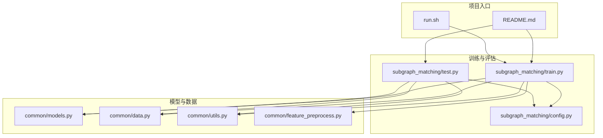
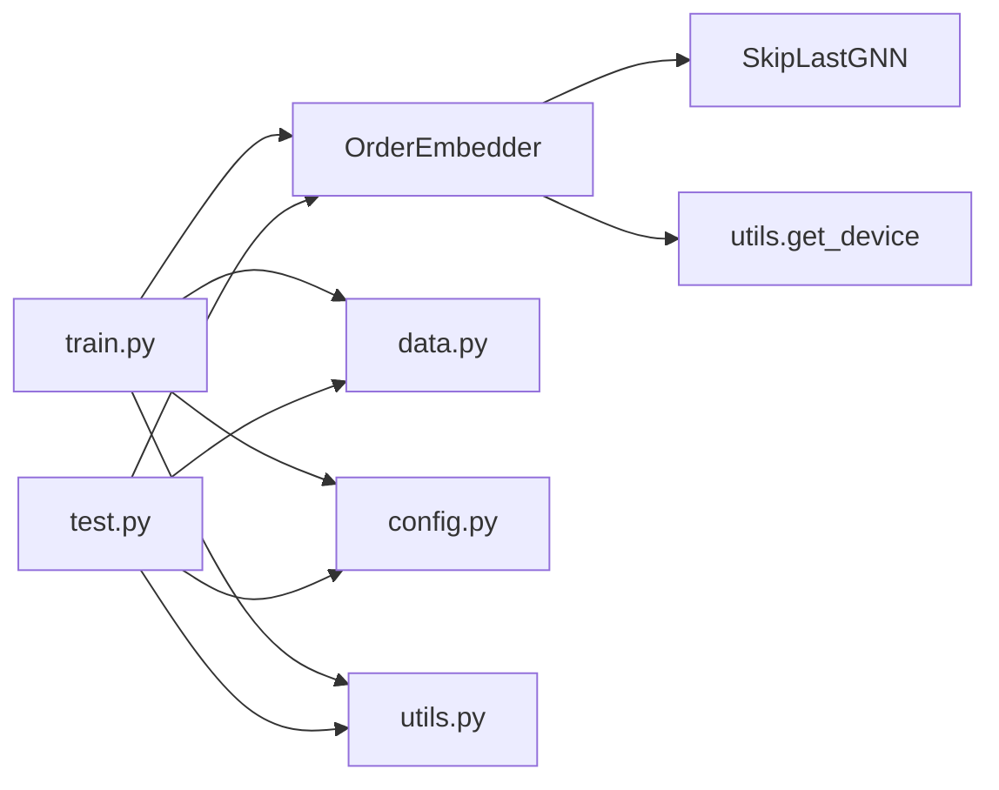

# 序嵌入模型

<cite>
**本文引用的文件**
- [common/models.py](file://common/models.py)
- [subgraph_matching/train.py](file://subgraph_matching/train.py)
- [subgraph_matching/test.py](file://subgraph_matching/test.py)
- [subgraph_matching/config.py](file://subgraph_matching/config.py)
- [common/data.py](file://common/data.py)
- [common/utils.py](file://common/utils.py)
- [common/feature_preprocess.py](file://common/feature_preprocess.py)
- [README.md](file://README.md)
- [run.sh](file://run.sh)
</cite>

## 目录
1. [简介](#简介)
2. [项目结构](#项目结构)
3. [核心组件](#核心组件)
4. [架构总览](#架构总览)
5. [详细组件分析](#详细组件分析)
6. [依赖关系分析](#依赖关系分析)
7. [性能考量](#性能考量)
8. [故障排查指南](#故障排查指南)
9. [结论](#结论)
10. [附录](#附录)

## 简介
本文件聚焦于SPMiner中的序嵌入模型（OrderEmbedder），系统阐述其核心设计理念、数学原理、损失函数设计与训练/推理流程。序嵌入通过约束“子图嵌入应小于或等于超图嵌入”的方式，学习表达子图包含关系的嵌入空间。本文将从模型结构、forward/predict实现、损失函数与margin机制、参数配置、使用示例与最佳实践等方面进行深入说明，帮助开发者高效理解与应用该模型。

## 项目结构
围绕序嵌入模型的关键文件与职责如下：
- common/models.py：定义OrderEmbedder、SkipLastGNN以及基线模型BaselineMLP等。
- subgraph_matching/train.py：训练入口，构建模型、数据源、多进程训练循环与周期性验证。
- subgraph_matching/test.py：验证/测试入口，评估指标与保存checkpoint。
- subgraph_matching/config.py：训练参数注册与默认值。
- common/data.py：数据源抽象与多种合成/真实数据集的生成与采样。
- common/utils.py：通用工具，如设备选择、优化器构建、批处理等。
- common/feature_preprocess.py：节点特征增强与预处理模块。
- README.md：项目总体介绍与使用说明。
- run.sh：训练入口脚本。



图表来源
- [subgraph_matching/train.py:1-253](file://subgraph_matching/train.py#L1-L253)
- [subgraph_matching/test.py:1-140](file://subgraph_matching/test.py#L1-L140)
- [subgraph_matching/config.py:1-82](file://subgraph_matching/config.py#L1-L82)
- [common/models.py:1-318](file://common/models.py#L1-L318)
- [common/data.py:1-447](file://common/data.py#L1-L447)
- [common/utils.py:1-302](file://common/utils.py#L1-L302)
- [common/feature_preprocess.py:1-230](file://common/feature_preprocess.py#L1-L230)
- [README.md:1-419](file://README.md#L1-L419)
- [run.sh:1-2](file://run.sh#L1-L2)

章节来源
- [README.md:30-62](file://README.md#L30-L62)
- [run.sh:1-2](file://run.sh#L1-L2)

## 核心组件
- OrderEmbedder：序嵌入模型主体，包含图嵌入编码器与二分类头。forward返回嵌入对，predict计算违反量，criterion实现基于margin的关系损失。
- SkipLastGNN：支持skip connection的GNN编码器，负责将图转换为固定维度嵌入。
- 数据源：OTFSynDataSource、DiskDataSource等，负责在线/离线生成正负样本对。
- 训练/测试流程：train.py与test.py分别实现训练循环与验证评估。

章节来源
- [common/models.py:46-100](file://common/models.py#L46-L100)
- [common/models.py:101-226](file://common/models.py#L101-L226)
- [subgraph_matching/train.py:49-151](file://subgraph_matching/train.py#L49-L151)
- [subgraph_matching/test.py:11-119](file://subgraph_matching/test.py#L11-L119)

## 架构总览
序嵌入模型的训练与推理流程如下：
- 训练阶段：从数据源生成正负样本对，分别通过SkipLastGNN编码为嵌入，传入OrderEmbedder的forward得到嵌入对，随后计算关系损失并反向传播；同时对违反量送入二分类头进行监督学习。
- 推理阶段：在验证/测试时，同样编码样本对，predict得到违反量，再经二分类头得到最终类别预测。

```mermaid
sequenceDiagram
participant DS as "数据源"
participant ENC as "SkipLastGNN"
participant OED as "OrderEmbedder"
participant CLF as "二分类头"
participant OPT as "优化器"
DS->>ENC : "正负样本对"
ENC-->>OED : "嵌入对 (emb_as, emb_bs)"
OED->>OED : "forward 返回嵌入对"
OED->>OED : "predict 计算违反量 e"
OED->>OPT : "criterion 计算关系损失"
OED->>CLF : "违反量送入二分类头"
CLF->>OPT : "分类损失"
OPT-->>OED : "参数更新"
```

图表来源
- [subgraph_matching/train.py:110-144](file://subgraph_matching/train.py#L110-L144)
- [common/models.py:60-99](file://common/models.py#L60-L99)

## 详细组件分析

### OrderEmbedder 设计理念与数学原理
- 设计理念：通过约束“子图嵌入应小于或等于超图嵌入”的方式，学习表达子图包含关系的嵌入空间。该约束在嵌入空间中自然地将子图关系建模为嵌入向量的逐元素比较与平方范数累积。
- 数学形式：
  - 违反量定义：对每对嵌入向量，计算逐元素的最大值与平方和，得到标量违反量 e。
  - 正例（b 是 a 的子图）：e 越小越好，目标是使其趋近于 0。
  - 负例（b 不是 a 的子图）：e 至少大于 margin，以确保嵌入空间中子图关系的可分离性。
- 关系损失：对所有样本的违反量求和，形成整体关系损失，用于端到端优化。

章节来源
- [common/models.py:46-51](file://common/models.py#L46-L51)
- [common/models.py:77-99](file://common/models.py#L77-L99)

### forward 方法与嵌入对处理
- forward：接收两个嵌入向量组，直接返回它们组成的元组，供后续predict与criterion使用。该设计将嵌入编码与关系建模解耦，便于灵活组合不同的任务头。
- 嵌入对处理：在训练/推理中，正负样本对分别编码为嵌入，拼接后作为一对输入，统一走关系损失与分类头。

章节来源
- [common/models.py:60-62](file://common/models.py#L60-L62)
- [subgraph_matching/train.py:120-127](file://subgraph_matching/train.py#L120-L127)
- [subgraph_matching/test.py:30-41](file://subgraph_matching/test.py#L30-L41)

### predict 方法与违反量计算
- predict：接收forward返回的嵌入对，计算违反量 e。该过程在设备上进行，确保与模型参数在同一设备上。
- 违反量含义：当 b 是 a 的子图时，emb_bs - emb_as 的逐元素最大值应接近 0；e 越小，违反关系越弱，预测越倾向于正例。

章节来源
- [common/models.py:64-75](file://common/models.py#L64-L75)

### criterion 方法与关系损失设计
- criterion：实现基于margin的关系损失。对正例，e 被最小化；对负例，e 被强制至少大于 margin，从而在嵌入空间中建立清晰的边界。
- margin 作用机制：通过在负例上施加最小间隔约束，提升模型对子图关系的判别能力，缓解嵌入空间中正负例重叠。

章节来源
- [common/models.py:77-99](file://common/models.py#L77-L99)

### SkipLastGNN 编码器
- 结构特点：线性预处理 + 多层消息传递 + skip connection + 全图池化 + MLP，输出固定维度图嵌入。
- skip connection：支持“all”“learnable”等策略，增强深层信息流动与表征质量。
- 特征增强：可选地对节点特征进行增强（如度、中心性、motif计数等），提升编码器对结构信息的感知。

章节来源
- [common/models.py:101-226](file://common/models.py#L101-L226)
- [common/feature_preprocess.py:71-192](file://common/feature_preprocess.py#L71-L192)

### 数据源与采样策略
- OTFSynDataSource：在线生成合成数据，动态构造正负样本对，支持平衡/不平衡采样与节点锚定。
- DiskDataSource：使用真实数据集，按树对/子图-树等策略采样正负样本。
- 采样与锚定：节点锚定通过在图中设置特定节点特征，使模型关注锚点附近的局部上下文，提高匹配鲁棒性。

章节来源
- [common/data.py:81-214](file://common/data.py#L81-L214)
- [common/data.py:271-354](file://common/data.py#L271-L354)
- [common/data.py:356-429](file://common/data.py#L356-L429)

### 训练与验证流程
- 训练：多进程并行生成批次，编码正负样本对，计算关系损失与分类损失，周期性评估与保存checkpoint。
- 验证：在固定测试点上进行推理，汇总准确率、精确率、召回率、AUROC、平均精度等指标。

章节来源
- [subgraph_matching/train.py:91-151](file://subgraph_matching/train.py#L91-L151)
- [subgraph_matching/test.py:11-119](file://subgraph_matching/test.py#L11-L119)

### 参数配置与最佳实践
- 关键参数（来自配置注册与默认值）：
  - method_type：嵌入类型（默认 order）。
  - conv_type：卷积类型（默认 SAGE）。
  - hidden_dim：隐藏维度（默认 64）。
  - n_layers：图卷积层数（默认 8）。
  - skip：skip连接策略（默认 learnable）。
  - dropout：丢弃率（默认 0.0）。
  - batch_size：批大小（默认 64）。
  - n_batches：训练小批次数量（默认 1000000）。
  - margin：关系损失的margin（默认 0.1）。
  - dataset：数据集（默认 syn）。
  - eval_interval：评估频率（默认 1000）。
  - val_size：验证集大小（默认 4096）。
  - model_path：模型保存/加载路径（默认 ckpt/model.pt）。
  - node_anchored：是否使用节点锚定（默认开启）。
  - n_workers：训练进程数（默认 4）。
- 最佳实践：
  - 使用节点锚定提升局部上下文敏感性。
  - 合理设置margin，避免过小导致边界模糊或过大导致收敛困难。
  - 平衡/不平衡数据集的选择取决于下游任务需求与数据分布。
  - 适当增大batch_size与n_layers以提升表征能力，注意显存限制。

章节来源
- [subgraph_matching/config.py:18-77](file://subgraph_matching/config.py#L18-L77)

## 依赖关系分析
- 模块内依赖：OrderEmbedder依赖SkipLastGNN进行图编码；predict/criterion依赖utils.get_device保证设备一致性。
- 训练/测试依赖：train.py/test.py依赖common/models.py与common/data.py；config.py提供参数注册；utils.py提供设备与优化器工具。
- 数据依赖：数据源依赖DeepSNAP、NetworkX与PyG进行图批处理与特征增强。



图表来源
- [common/models.py:46-100](file://common/models.py#L46-L100)
- [common/models.py:101-226](file://common/models.py#L101-L226)
- [common/utils.py:235-243](file://common/utils.py#L235-L243)
- [subgraph_matching/train.py:49-151](file://subgraph_matching/train.py#L49-L151)
- [subgraph_matching/test.py:11-119](file://subgraph_matching/test.py#L11-L119)

章节来源
- [common/models.py:46-100](file://common/models.py#L46-L100)
- [common/models.py:101-226](file://common/models.py#L101-L226)
- [common/utils.py:235-243](file://common/utils.py#L235-L243)
- [subgraph_matching/train.py:49-151](file://subgraph_matching/train.py#L49-L151)
- [subgraph_matching/test.py:11-119](file://subgraph_matching/test.py#L11-L119)

## 性能考量
- 设备选择：优先使用CUDA，若不可用则回退至CPU，减少设备切换开销。
- 梯度裁剪：在训练中对参数梯度进行裁剪，提升稳定性。
- skip连接：合理使用skip连接策略，有助于深层网络的稳定训练与特征融合。
- 数据并行：多进程并行生成批次，提升吞吐量。
- 特征增强：在节点特征中加入度、中心性等统计特征，有助于提升编码质量。

章节来源
- [common/utils.py:235-243](file://common/utils.py#L235-L243)
- [subgraph_matching/train.py:130-133](file://subgraph_matching/train.py#L130-L133)
- [common/models.py:129-131](file://common/models.py#L129-L131)
- [subgraph_matching/train.py:194-221](file://subgraph_matching/train.py#L194-L221)
- [common/feature_preprocess.py:71-192](file://common/feature_preprocess.py#L71-L192)

## 故障排查指南
- 设备不匹配：确保模型与数据在同一设备上，可通过utils.get_device统一管理。
- 训练不稳定：检查margin设置与学习率调度器配置；必要时降低学习率或增大margin。
- 显存不足：减小batch_size或n_layers；关闭不必要的特征增强。
- 数据集文件缺失：确保Facebook等数据集的本地边列表文件存在于data/目录。
- 验证指标异常：检查数据源采样策略与标签生成逻辑，确认正负样本比例与锚定设置。

章节来源
- [common/utils.py:235-243](file://common/utils.py#L235-L243)
- [subgraph_matching/config.py:55-77](file://subgraph_matching/config.py#L55-L77)
- [common/data.py:208-233](file://common/data.py#L208-L233)
- [README.md:350-366](file://README.md#L350-L366)

## 结论
序嵌入模型通过“子图嵌入应小于或等于超图嵌入”的约束，在嵌入空间中自然地建模子图包含关系。OrderEmbedder将图编码与关系建模解耦，配合基于margin的关系损失与二分类头，实现了稳定高效的训练与推理。结合SkipLastGNN的深度消息传递与特征增强策略，模型在合成与真实数据集上均具备良好的表现。建议在实践中根据任务需求合理设置参数与采样策略，并利用节点锚定与skip连接提升模型鲁棒性。

## 附录

### 使用示例与最佳实践
- 训练子图匹配模型（合成数据）：
  - 命令：python -m subgraph_matching.train --node_anchored
  - 说明：默认使用SAGE卷积、order嵌入、learnable skip连接与0.1的margin。
- 使用真实数据训练（以Facebook为例）：
  - 命令：python -m subgraph_matching.train --dataset=facebook --node_anchored
  - 说明：需确保data/facebook_combined.txt存在。
- 评估模型：
  - 命令：python -m subgraph_matching.test --node_anchored
  - 说明：在固定测试点上评估Accuracy、Precision、Recall、AUROC、AP等指标。
- 运行频繁子图挖掘：
  - 命令：python -m subgraph_mining.decoder --dataset=enzymes --node_anchored
  - 说明：使用训练好的匹配模型对候选pattern进行评分与搜索。

章节来源
- [README.md:129-163](file://README.md#L129-L163)
- [run.sh:1-2](file://run.sh#L1-L2)