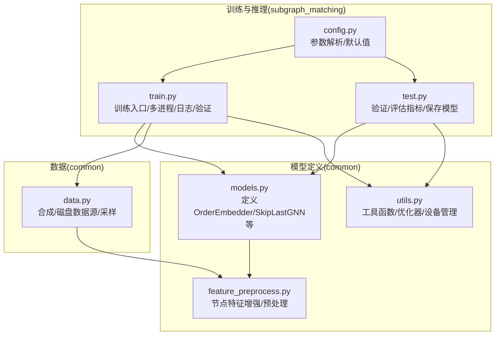
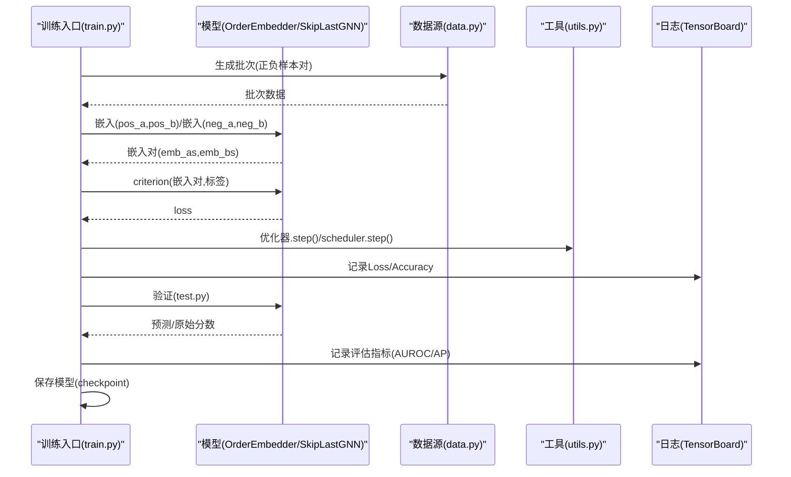
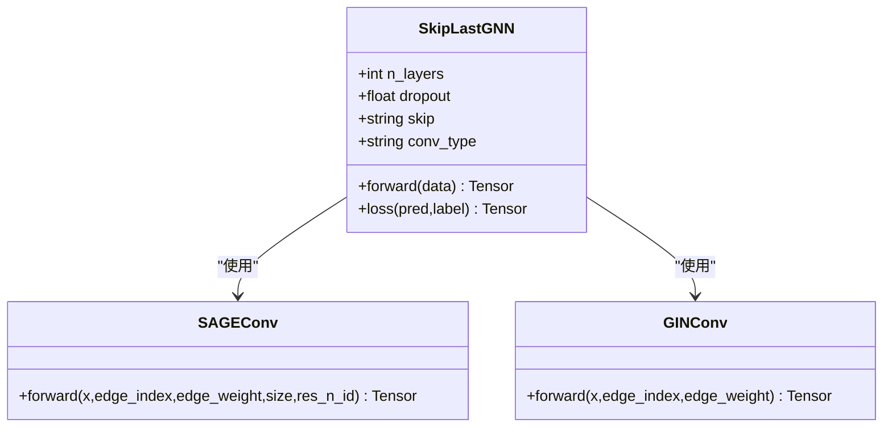
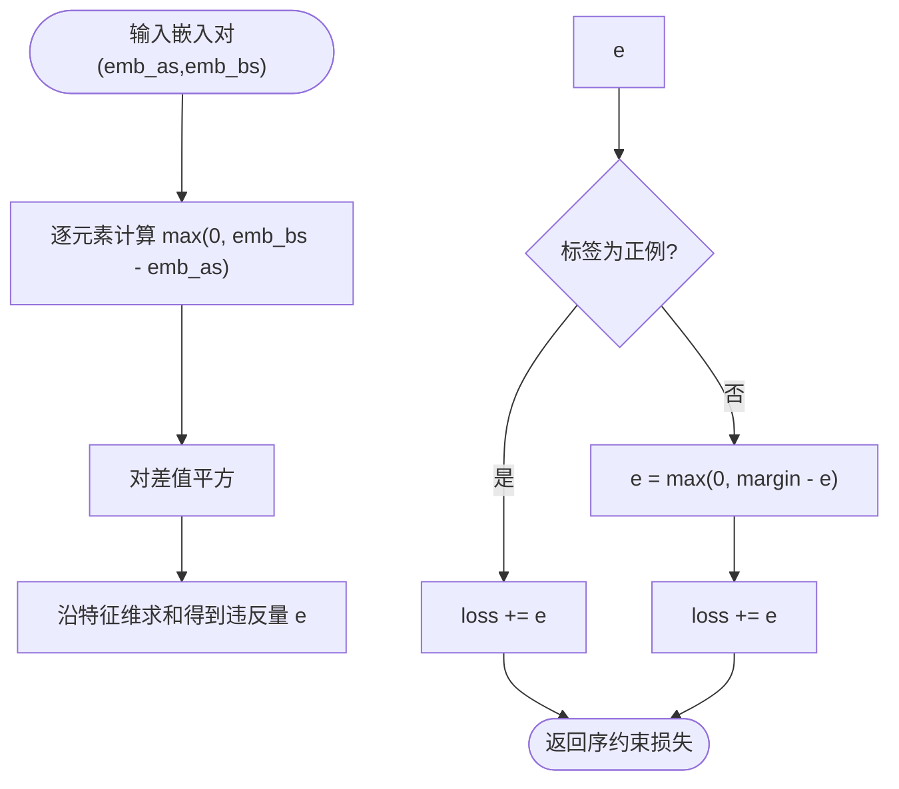
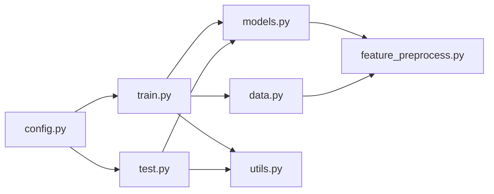

# 模型定义模块

<cite>
**本文引用的文件**
- [common/models.py](file://common/models.py)
- [subgraph_matching/train.py](file://subgraph_matching/train.py)
- [subgraph_matching/test.py](file://subgraph_matching/test.py)
- [subgraph_matching/config.py](file://subgraph_matching/config.py)
- [common/data.py](file://common/data.py)
- [common/feature_preprocess.py](file://common/feature_preprocess.py)
- [common/utils.py](file://common/utils.py)
- [run.sh](file://run.sh)
- [environment.yml](file://environment.yml)
</cite>

## 目录
1. [简介](#简介)
2. [项目结构](#项目结构)
3. [核心组件](#核心组件)
4. [架构总览](#架构总览)
5. [详细组件分析](#详细组件分析)
6. [依赖分析](#依赖分析)
7. [性能考虑](#性能考虑)
8. [故障排查指南](#故障排查指南)
9. [结论](#结论)
10. [附录](#附录)

## 简介
本文件面向SPMiner的模型定义模块，系统性阐述图嵌入模型的设计理念与实现细节，重点覆盖：
- OrderEmbedder序嵌入模型的核心算法与数学原理
- SkipLastGNN支持跳跃连接的图神经网络架构及其在子图匹配任务中的优势
- 模型配置参数详解（网络层数、隐藏维度、激活函数、跳跃策略、卷积类型等）
- 模型训练与推理的完整流程，以及模型保存与加载的最佳实践
- 自定义模型扩展的指导与接口规范

## 项目结构
模型定义模块位于common目录，训练与推理入口位于subgraph_matching目录，数据加载与增强位于common目录的data与feature_preprocess模块，工具函数位于common/utils.py。

图表来源
- [common/models.py:1-318](file://common/models.py#L1-L318)
- [subgraph_matching/train.py:1-253](file://subgraph_matching/train.py#L1-L253)
- [subgraph_matching/test.py:1-140](file://subgraph_matching/test.py#L1-L140)
- [subgraph_matching/config.py:1-82](file://subgraph_matching/config.py#L1-L82)
- [common/data.py:1-447](file://common/data.py#L1-L447)
- [common/feature_preprocess.py:1-230](file://common/feature_preprocess.py#L1-L230)
- [common/utils.py:1-302](file://common/utils.py#L1-L302)

章节来源
- [common/models.py:1-318](file://common/models.py#L1-L318)
- [subgraph_matching/train.py:1-253](file://subgraph_matching/train.py#L1-L253)
- [subgraph_matching/test.py:1-140](file://subgraph_matching/test.py#L1-L140)
- [subgraph_matching/config.py:1-82](file://subgraph_matching/config.py#L1-L82)
- [common/data.py:1-447](file://common/data.py#L1-L447)
- [common/feature_preprocess.py:1-230](file://common/feature_preprocess.py#L1-L230)
- [common/utils.py:1-302](file://common/utils.py#L1-L302)

## 核心组件
- SkipLastGNN：支持跳跃连接的图神经网络编码器，具备可配置的卷积类型（GCN/GIN/SAGE/graph/GAT/gated/PNA），多层消息传递，全图池化与MLP映射到固定维度图表示。
- OrderEmbedder：序嵌入模型，通过约束“子图嵌入应小于或等于超图嵌入”的方式学习表达子图包含关系的空间，并结合分类器将违反量映射为二分类结果。
- BaselineMLP：双图拼接分类基线，直接拼接两个图嵌入后经MLP二分类，用于对比OrderEmbedder的效果。
- 数据源：OTFSynDataSource/OTFSynImbalancedDataSource/DiskDataSource/DiskImbalancedDataSource，支持在线合成与真实数据集，提供正负样本对生成与批处理。
- 特征增强：Preprocess与FeatureAugment，支持节点特征拼接/相加、度、介数中心性、路径长、PageRank、聚类系数、motif计数、身份矩阵等。

章节来源
- [common/models.py:22-318](file://common/models.py#L22-L318)
- [common/data.py:77-447](file://common/data.py#L77-L447)
- [common/feature_preprocess.py:71-230](file://common/feature_preprocess.py#L71-L230)

## 架构总览
模型定义模块围绕“编码器-判别器”两阶段设计：
- 编码器：SkipLastGNN将图转换为固定维度嵌入
- 判别器：OrderEmbedder对嵌入对施加序约束，计算违反量并用分类器映射为二分类
- 训练：多进程并行生成批次，优化编码器参数与判别器分类器参数
- 推理：在测试集上评估Accuracy/Precision/Recall/AUROC/AP等指标，并保存模型

图表来源
- [subgraph_matching/train.py:91-222](file://subgraph_matching/train.py#L91-L222)
- [subgraph_matching/test.py:11-119](file://subgraph_matching/test.py#L11-L119)
- [common/models.py:46-100](file://common/models.py#L46-L100)
- [common/utils.py:265-284](file://common/utils.py#L265-L284)

## 详细组件分析

### SkipLastGNN：支持跳跃连接的图神经网络
- 设计要点
  - 线性预处理：将输入节点特征映射到中间维度
  - 多层消息传递：支持GCN/GIN/SAGE/graph/GAT/gated/PNA等卷积类型
  - 跳跃连接策略：支持“all”、“learnable”、“none”
  - 全图池化：global_add_pool聚合节点表示
  - 后端MLP：将聚合后的表示映射到输出维度
- 数学与实现要点
  - 邻居聚合与中心节点拼接更新：SAGEConv风格的消息传递
  - GINConv支持边权，允许加权邻居聚合
  - PNA分支：sum/mean/max三种聚合分支拼接
  - 跳跃连接：learnable参数控制各层贡献，all策略直接拼接所有层特征
- 关键属性与参数
  - n_layers：层数
  - hidden_dim：隐层维度
  - dropout：丢弃率
  - conv_type：卷积类型
  - skip：跳跃策略
  - feat_preprocess：节点特征增强（可选）

图表来源
- [common/models.py:101-226](file://common/models.py#L101-L226)
- [common/models.py:231-281](file://common/models.py#L231-L281)
- [common/models.py:287-317](file://common/models.py#L287-L317)

章节来源
- [common/models.py:101-226](file://common/models.py#L101-L226)
- [common/models.py:231-317](file://common/models.py#L231-L317)

### OrderEmbedder：序嵌入模型
- 设计理念
  - 通过“子图嵌入应小于或等于超图嵌入”的序约束，学习表达子图包含关系的空间
  - 将嵌入对映射为违反量，结合分类器输出最终二分类
- 数学原理
  - 违反量定义为逐元素(max(0, b-a))^2的和，衡量b是否为a的子图
  - 正例（b是a的子图）：违反量越小越好（趋近0）
  - 负例（b不是a的子图）：违反量至少大于margin
- 关键方法
  - forward：返回嵌入对
  - predict：计算违反量
  - criterion：按标签调整违反量，返回序约束损失

图表来源
- [common/models.py:77-99](file://common/models.py#L77-L99)

章节来源
- [common/models.py:46-99](file://common/models.py#L46-L99)

### BaselineMLP：双图拼接分类基线
- 设计：将两个图嵌入拼接后经MLP二分类
- 用途：对比OrderEmbedder的效果
- 结构：SkipLastGNN嵌入器 + MLP分类头

章节来源
- [common/models.py:22-44](file://common/models.py#L22-L44)

### 数据源与特征增强
- 数据源
  - OTFSynDataSource：在线生成合成数据，动态采样子图，支持节点锚定
  - OTFSynImbalancedDataSource：不平衡合成数据，缓存正负样本对
  - DiskDataSource：使用真实数据集，按树对/子图-树方式采样
  - DiskImbalancedDataSource：不平衡真实数据，缓存正负样本对
- 特征增强
  - Preprocess：节点特征拼接/相加，输出维度随增强方式变化
  - FeatureAugment：支持度、介数中心性、路径长、PageRank、聚类系数、motif计数、身份矩阵等

章节来源
- [common/data.py:77-447](file://common/data.py#L77-L447)
- [common/feature_preprocess.py:71-230](file://common/feature_preprocess.py#L71-L230)

## 依赖分析
- 模块耦合
  - 训练入口依赖模型、数据源、工具函数与配置
  - 模型依赖PyG几何库与自定义卷积层
  - 数据源依赖DeepSNAP批处理与NetworkX
  - 特征增强依赖sklearn与torch-scatter
- 外部依赖
  - PyTorch/TorchGeometric/TorchScatter
  - NetworkX/DeepSNAP
  - scikit-learn/TensorBoard

图表来源
- [subgraph_matching/train.py:1-253](file://subgraph_matching/train.py#L1-L253)
- [subgraph_matching/test.py:1-140](file://subgraph_matching/test.py#L1-L140)
- [common/models.py:1-318](file://common/models.py#L1-L318)
- [common/data.py:1-447](file://common/data.py#L1-L447)
- [common/feature_preprocess.py:1-230](file://common/feature_preprocess.py#L1-L230)
- [common/utils.py:1-302](file://common/utils.py#L1-L302)
- [subgraph_matching/config.py:1-82](file://subgraph_matching/config.py#L1-L82)

章节来源
- [subgraph_matching/train.py:1-253](file://subgraph_matching/train.py#L1-L253)
- [subgraph_matching/test.py:1-140](file://subgraph_matching/test.py#L1-L140)
- [common/models.py:1-318](file://common/models.py#L1-L318)
- [common/data.py:1-447](file://common/data.py#L1-L447)
- [common/feature_preprocess.py:1-230](file://common/feature_preprocess.py#L1-L230)
- [common/utils.py:1-302](file://common/utils.py#L1-L302)
- [subgraph_matching/config.py:1-82](file://subgraph_matching/config.py#L1-L82)

## 性能考虑
- 跳跃连接
  - learnable策略通过可学习权重融合多层特征，提升表达能力但增加参数量
  - all策略直接拼接所有层特征，显著提升容量但内存与计算开销增大
- 卷积类型
  - SAGEConv在SkipLastGNN中默认使用，适合一般图结构
  - PNA分支在conv_type="PNA"时采用sum/mean/max聚合，增强聚合能力
- Dropout与归一化
  - 训练中使用Dropout抑制过拟合
  - 可选BatchNorm在注释中，需根据数据稳定性测试
- 多进程训练
  - 使用多进程worker并行生成批次，提高吞吐
  - 通过队列通信协调训练步与验证
- 设备与批处理
  - 自动选择CUDA或CPU，减少显存占用
  - 批大小与评估间隔影响收敛速度与资源消耗

[本节为通用性能建议，无需特定文件来源]

## 故障排查指南
- 训练不收敛或震荡
  - 检查学习率与优化器调度器设置
  - 调整dropout与batch大小
  - 观察梯度裁剪是否生效
- 内存不足
  - 降低n_layers或hidden_dim
  - 减少batch_size或eval_interval
  - 关闭learnable跳跃连接
- 验证指标异常
  - 检查数据源是否正确生成正负样本对
  - 确认节点锚定设置与特征增强配置一致
- 模型保存/加载失败
  - 确认model_path存在且有写权限
  - 使用与训练相同的设备加载（map_location）

章节来源
- [common/utils.py:265-284](file://common/utils.py#L265-L284)
- [subgraph_matching/train.py:154-222](file://subgraph_matching/train.py#L154-L222)
- [subgraph_matching/test.py:107-119](file://subgraph_matching/test.py#L107-L119)

## 结论
SPMiner的模型定义模块以SkipLastGNN为核心编码器，结合OrderEmbedder的序约束学习与分类器映射，形成高效的子图匹配框架。通过灵活的跳跃连接策略、多卷积类型支持与特征增强机制，模型在合成与真实数据集上均具备良好表现。建议在实际部署中根据硬件条件与任务复杂度合理配置网络深度与隐藏维度，并采用多进程训练与定期验证以获得稳定收敛。

[本节为总结性内容，无需特定文件来源]

## 附录

### 模型配置参数详解
- 训练与模型
  - --conv_type：卷积类型（GCN/GIN/SAGE/graph/GAT/gated/PNA）
  - --method_type：嵌入类型（order/mlp）
  - --batch_size：训练批大小
  - --n_layers：图卷积层数
  - --hidden_dim：隐层维度
  - --skip：跳跃策略（all/learnable/none）
  - --dropout：Dropout比率
  - --n_batches：训练小批次数量
  - --margin：序约束损失的margin
  - --opt_scheduler：优化器调度器（none/step/cos）
  - --opt：优化器类型（adam/sgd/rmsprop/adagrad）
  - --lr：学习率
  - --weight_decay：权重衰减
  - --clip：梯度裁剪阈值
- 数据与运行
  - --dataset：数据集名称或syn/不平衡变体
  - --test_set：测试集文件名
  - --eval_interval：训练中评估频率
  - --val_size：验证集大小
  - --model_path：模型保存/加载路径
  - --node_anchored：训练时是否使用节点锚定
  - --test：测试模式（仅验证，不更新参数）
  - --n_workers：多进程worker数量
  - --tag：运行标签

章节来源
- [subgraph_matching/config.py:18-77](file://subgraph_matching/config.py#L18-L77)

### 训练与推理流程
- 训练流程
  - 初始化参数与优化器
  - 多进程worker并行生成批次
  - 前向得到嵌入对，计算序约束损失并反向传播
  - 可选地训练分类器将违反量映射为二分类
  - 定期验证并记录指标，保存模型
- 推理流程
  - 加载已训练模型
  - 对测试集样本对做前向推理
  - 计算原始分数与分类结果
  - 汇总Accuracy/Precision/Recall/AUROC/AP等指标

章节来源
- [subgraph_matching/train.py:91-222](file://subgraph_matching/train.py#L91-L222)
- [subgraph_matching/test.py:11-119](file://subgraph_matching/test.py#L11-L119)

### 模型保存与加载最佳实践
- 保存
  - 验证阶段结束后保存state_dict至指定路径
  - 确保目录存在且有写权限
- 加载
  - 测试模式下从model_path加载权重
  - 使用与训练相同的设备映射（map_location）

章节来源
- [subgraph_matching/test.py:117-119](file://subgraph_matching/test.py#L117-L119)
- [subgraph_matching/train.py:56-58](file://subgraph_matching/train.py#L56-L58)

### 自定义模型扩展指导
- 新增卷积层
  - 在build_conv_model中注册新类型并返回对应构造器
  - 如需PNA分支，注意sum/mean/max三分支拼接
- 新增跳跃策略
  - 在forward中实现新的拼接/融合逻辑
  - 更新参数初始化与前向传播
- 新增判别器
  - 实现forward/predict/criterion接口
  - 在训练入口中选择使用
- 新增数据源
  - 继承DataSource并实现gen_batch
  - 支持平衡/不平衡采样与节点锚定
- 新增特征增强
  - 在FeatureAugment中注册新特征函数
  - 在Preprocess中决定拼接/相加策略与输出维度

章节来源
- [common/models.py:159-181](file://common/models.py#L159-L181)
- [common/models.py:182-226](file://common/models.py#L182-L226)
- [common/data.py:77-447](file://common/data.py#L77-L447)
- [common/feature_preprocess.py:144-192](file://common/feature_preprocess.py#L144-L192)