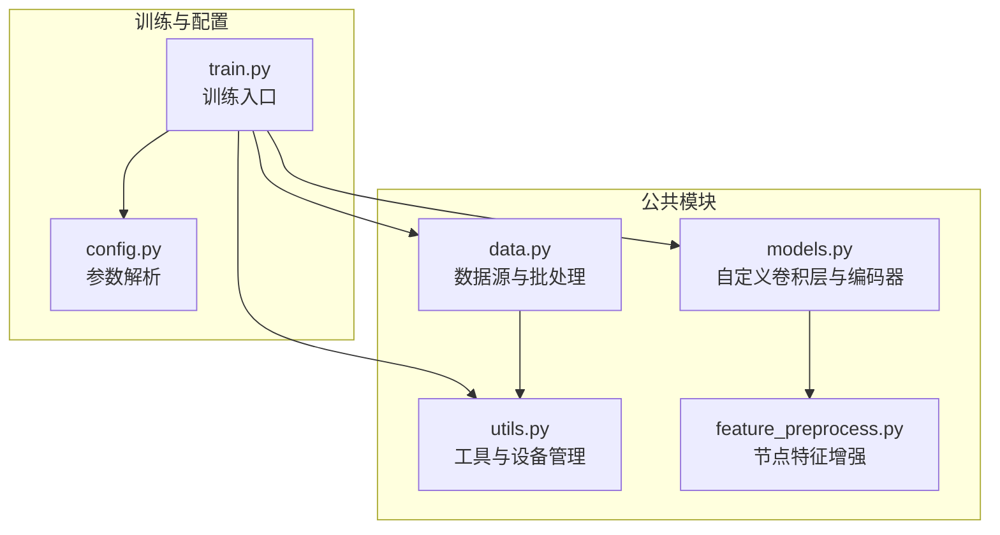
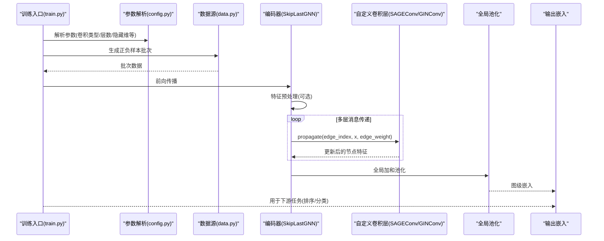
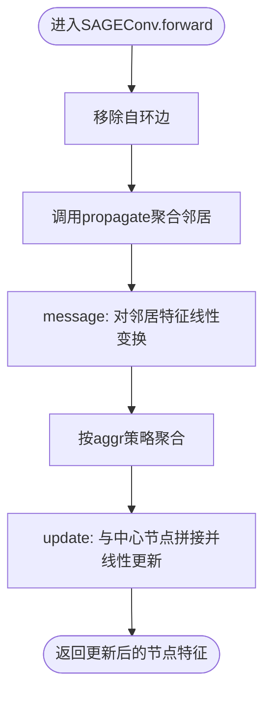
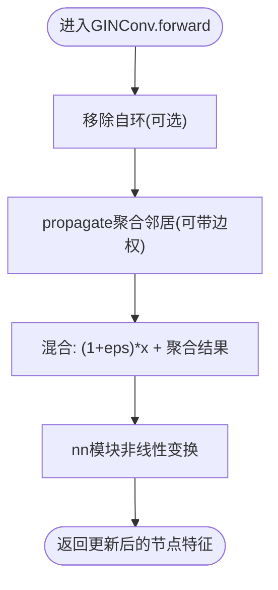
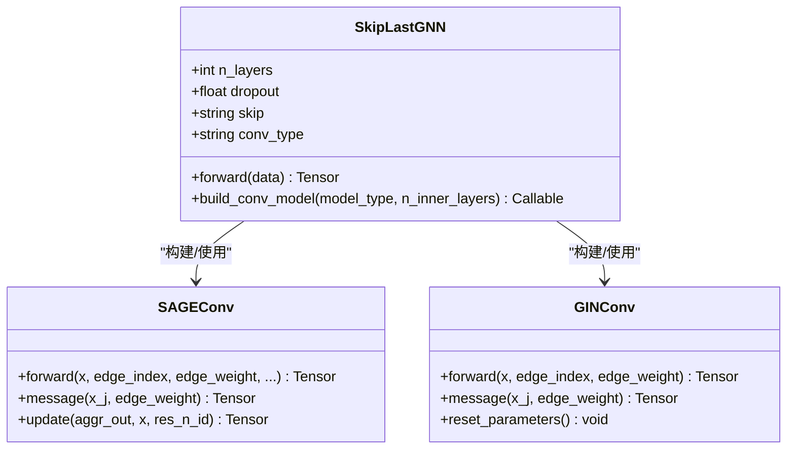
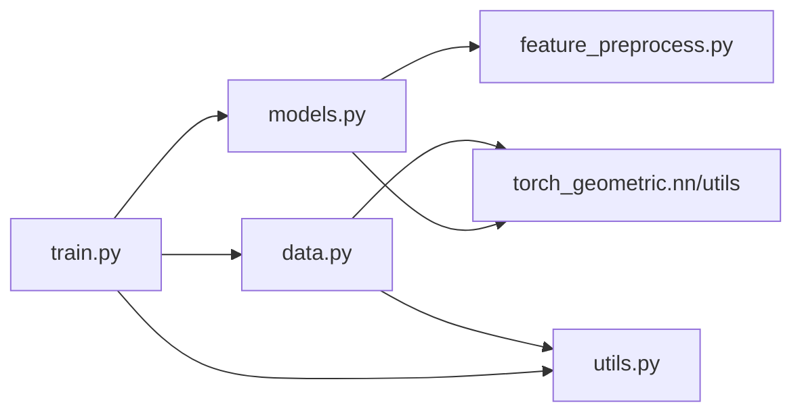

# 自定义卷积层

<cite>
**本文引用的文件**
- [models.py](file://common/models.py)
- [data.py](file://common/data.py)
- [utils.py](file://common/utils.py)
- [config.py](file://subgraph_matching/config.py)
- [train.py](file://subgraph_matching/train.py)
- [feature_preprocess.py](file://common/feature_preprocess.py)
</cite>

## 目录
1. [简介](#简介)
2. [项目结构](#项目结构)
3. [核心组件](#核心组件)
4. [架构总览](#架构总览)
5. [详细组件分析](#详细组件分析)
6. [依赖分析](#依赖分析)
7. [性能考量](#性能考量)
8. [故障排查指南](#故障排查指南)
9. [结论](#结论)
10. [附录](#附录)

## 简介
本文件面向SPMiner项目中的自定义图卷积层，系统性阐述SAGEConv与GINConv两种实现的设计理念、消息传递机制、邻居聚合流程、参数配置与使用场景，并提供扩展开发指导与性能对比建议。读者无需深厚的图神经网络背景即可理解与使用。

## 项目结构
围绕自定义卷积层的核心代码位于common/models.py，配合数据加载与特征预处理模块，以及训练入口与参数配置模块共同构成完整流水线。

图表来源
- [models.py:101-226](file://common/models.py#L101-L226)
- [data.py:77-354](file://common/data.py#L77-L354)
- [utils.py:235-301](file://common/utils.py#L235-L301)
- [feature_preprocess.py:71-230](file://common/feature_preprocess.py#L71-L230)
- [config.py:4-82](file://subgraph_matching/config.py#L4-L82)
- [train.py:49-253](file://subgraph_matching/train.py#L49-L253)

章节来源
- [models.py:101-226](file://common/models.py#L101-L226)
- [data.py:77-354](file://common/data.py#L77-L354)
- [utils.py:235-301](file://common/utils.py#L235-L301)
- [feature_preprocess.py:71-230](file://common/feature_preprocess.py#L71-L230)
- [config.py:4-82](file://subgraph_matching/config.py#L4-L82)
- [train.py:49-253](file://subgraph_matching/train.py#L49-L253)

## 核心组件
- 自定义卷积层
  - SAGEConv：GraphSAGE风格的消息传递，显式去自环、邻居线性变换、聚合后与中心节点拼接更新。
  - GINConv：带边权支持的GIN卷积，消息传递时可乘以边权重，epsilon参数控制中心节点与聚合结果的混合比例。
- 编码器SkipLastGNN：支持跳接连接的多层消息传递网络，内置SAGEConv与GINConv的工厂方法，统一接入PyG MessagePassing框架。
- 数据与特征：数据源负责生成正负样本批次，特征增强模块可扩展节点特征维度，提升表达能力。

章节来源
- [models.py:231-316](file://common/models.py#L231-L316)
- [models.py:101-226](file://common/models.py#L101-L226)
- [data.py:77-354](file://common/data.py#L77-L354)
- [feature_preprocess.py:71-230](file://common/feature_preprocess.py#L71-L230)

## 架构总览
自定义卷积层与编码器的整体调用链如下：

图表来源
- [train.py:91-150](file://subgraph_matching/train.py#L91-L150)
- [models.py:101-226](file://common/models.py#L101-L226)
- [models.py:231-316](file://common/models.py#L231-L316)
- [data.py:77-354](file://common/data.py#L77-L354)

## 详细组件分析

### SAGEConv：GraphSAGE风格卷积
设计理念
- 显式去除自环，避免中心节点信息对聚合的额外影响。
- 邻居消息通过线性层处理，聚合后再与中心节点特征拼接，经另一线性层更新。
- 保持与PyG MessagePassing一致的接口，便于在SkipLastGNN中堆叠使用。

消息传递机制与邻居聚合
- message阶段：对邻居特征进行线性变换，边权接口保留但默认不使用。
- aggregate阶段：按aggr策略（默认加和）聚合邻居消息。
- update阶段：将聚合结果与中心节点特征拼接，再经线性层更新。

关键实现要点
- 去自环：在forward中调用移除自环的工具函数。
- 拼接更新：在update中将aggr_out与x拼接，再线性变换得到新特征。
- 接口兼容：遵循MessagePassing约定，支持edge_index与edge_weight传入。

图表来源
- [models.py:231-284](file://common/models.py#L231-L284)

章节来源
- [models.py:231-284](file://common/models.py#L231-L284)

### GINConv：GIN卷积（带边权支持）
设计理念
- 支持边权参与消息传递，消息权重可为None或标量权重向量。
- 引入epsilon参数控制(1+eps)倍中心节点特征与聚合结果的混合比例，支持可训练epsilon。
- 通过nn模块对(1+eps)*x + aggregated进行非线性变换，符合GIN理论形式。

消息传递与epsilon作用
- message阶段：若存在edge_weight则按权重缩放邻居特征，否则直接使用邻居特征。
- aggregate阶段：加和聚合邻居消息。
- forward阶段：(1+eps)*x与propagate结果相加后，经nn模块变换。

图表来源
- [models.py:287-316](file://common/models.py#L287-L316)

章节来源
- [models.py:287-316](file://common/models.py#L287-L316)

### 编码器SkipLastGNN：多层消息传递与跳接
SkipLastGNN通过build_conv_model按conv_type选择SAGEConv或GINConv实例化，支持：
- 可学习跳接（learnable）与全跳接（all），将历史层特征拼接后输入当前层。
- Dropout与LeakyReLU等激活与正则化。
- 全图加和池化得到图级嵌入，再经MLP映射到最终嵌入空间。

图表来源
- [models.py:101-226](file://common/models.py#L101-L226)
- [models.py:231-316](file://common/models.py#L231-L316)

章节来源
- [models.py:101-226](file://common/models.py#L101-L226)
- [models.py:231-316](file://common/models.py#L231-L316)

### 参数配置与使用场景
- 卷积类型
  - SAGE：适合一般图结构，强调邻居聚合与中心节点融合，训练稳定。
  - GIN：适合需要边权或希望显式控制中心节点与聚合混合比例的任务。
- 层数与隐藏维
  - n_layers决定堆叠深度，hidden_dim控制通道宽度，需结合GPU显存与收敛速度权衡。
- 跳接策略
  - learnable：对历史层特征进行可学习加权拼接，通常能提升表达能力。
  - all：将所有历史层特征拼接，容量更大但更易过拟合。
- Dropout与优化器
  - dropout用于正则化；优化器与调度器在utils中统一配置。
- 数据与特征
  - feature_preprocess支持节点度、介数中心性、路径长、PageRank、聚类系数等特征增强，可提升模型泛化。

章节来源
- [config.py:18-77](file://subgraph_matching/config.py#L18-L77)
- [utils.py:245-284](file://common/utils.py#L245-L284)
- [feature_preprocess.py:71-230](file://common/feature_preprocess.py#L71-L230)

## 依赖分析
- 模块耦合
  - models.py依赖torch_geometric.nn与utils，定义自定义卷积层与编码器。
  - data.py依赖deepsnap与utils，提供数据源与批处理。
  - train.py依赖models与data，组织训练循环。
  - feature_preprocess.py与models.py形成弱耦合，通过Preprocess在编码器前对节点特征进行增强。
- 外部依赖
  - PyTorch Geometric：MessagePassing、global_add_pool、remove_self_loops等。
  - NetworkX与NumPy：图数据与统计特征。
  - DeepSNAP：图批处理与数据集封装。

图表来源
- [models.py:101-226](file://common/models.py#L101-L226)
- [data.py:77-354](file://common/data.py#L77-L354)
- [train.py:49-253](file://subgraph_matching/train.py#L49-L253)
- [utils.py:235-301](file://common/utils.py#L235-L301)
- [feature_preprocess.py:71-230](file://common/feature_preprocess.py#L71-L230)

章节来源
- [models.py:101-226](file://common/models.py#L101-L226)
- [data.py:77-354](file://common/data.py#L77-L354)
- [train.py:49-253](file://subgraph_matching/train.py#L49-L253)
- [utils.py:235-301](file://common/utils.py#L235-L301)
- [feature_preprocess.py:71-230](file://common/feature_preprocess.py#L71-L230)

## 性能考量
- 计算复杂度
  - SAGEConv：每层消息传递涉及邻居线性变换与聚合，复杂度与边数近似线性；跳接会增加拼接与线性层开销。
  - GINConv：消息传递可带边权缩放，epsilon混合引入一次加法与一次非线性变换，整体仍近似线性。
- 内存占用
  - 增大n_layers与hidden_dim显著提升内存；learnable跳接比all跳接更节省显存。
  - Dropout与BatchNorm可缓解过拟合并微幅增加内存。
- 训练稳定性
  - SAGEConv默认稳定，适合初学者与大规模数据。
  - GINConv的epsilon可训练时需注意数值稳定性与学习率设置。
- 设备与批处理
  - utils.get_device自动选择CUDA或CPU，建议在GPU上训练；批大小与eval_interval需结合显存与吞吐权衡。

[本节为通用性能讨论，不直接分析具体文件，故无章节来源]

## 故障排查指南
- 自环干扰
  - SAGEConv与GINConv均在forward中移除自环，若仍出现异常，请检查输入edge_index是否正确。
- 边权无效
  - GINConv的message阶段仅在edge_weight非None时按权重缩放；若边权为None，将直接使用邻居特征。
- 维度不匹配
  - Preprocess模块支持concat/add两种增强方式，确保输出维度与后续线性层匹配。
- 设备不一致
  - utils.get_device统一设备；若出现CUDA错误，请确认数据与模型在同一设备上。
- 训练不收敛
  - 调整dropout、学习率与优化器；对于GINConv，可尝试固定epsilon或开启可训练epsilon。

章节来源
- [models.py:231-316](file://common/models.py#L231-L316)
- [feature_preprocess.py:194-230](file://common/feature_preprocess.py#L194-L230)
- [utils.py:235-301](file://common/utils.py#L235-L301)

## 结论
SAGEConv与GINConv分别代表了GraphSAGE与GIN的经典思想在SPMiner中的落地实现。前者强调邻居聚合与中心节点融合，后者引入边权与epsilon混合，二者均可在SkipLastGNN中灵活堆叠。通过合理的参数配置与特征增强，可在子图匹配等任务中取得良好效果。建议新手从SAGEConv开始，逐步探索GINConv的边权与epsilon特性。

[本节为总结性内容，不直接分析具体文件，故无章节来源]

## 附录

### 使用示例（路径指引）
- 训练入口与参数
  - 训练脚本入口与参数解析：[train.py:223-253](file://subgraph_matching/train.py#L223-L253)，[config.py:4-82](file://subgraph_matching/config.py#L4-L82)
- 自定义卷积层
  - SAGEConv实现：[models.py:231-284](file://common/models.py#L231-L284)
  - GINConv实现：[models.py:287-316](file://common/models.py#L287-L316)
- 编码器与消息传递
  - SkipLastGNN与build_conv_model：[models.py:101-226](file://common/models.py#L101-L226)
- 数据与批处理
  - 数据源与批处理工具：[data.py:77-354](file://common/data.py#L77-L354)，[utils.py:286-301](file://common/utils.py#L286-L301)
- 特征增强
  - 节点特征增强与预处理：[feature_preprocess.py:71-230](file://common/feature_preprocess.py#L71-L230)

### 扩展开发指导
- 新增自定义卷积层
  - 继承MessagePassing，实现forward、message、update等方法，遵循与SAGEConv/GINConv一致的接口风格。
  - 在SkipLastGNN.build_conv_model中注册新层工厂，以便通过conv_type动态选择。
- 消息传递框架要点
  - propagate负责触发message与aggregate，update负责节点特征更新。
  - edge_index与edge_weight为标准输入，确保在forward中正确处理。
- 参数与配置
  - 通过config.py扩展参数，train.py中读取并传入SkipLastGNN构造函数。
  - 合理设置n_layers、hidden_dim、skip策略与dropout，平衡表达能力与训练稳定性。

章节来源
- [models.py:159-180](file://common/models.py#L159-L180)
- [models.py:231-316](file://common/models.py#L231-L316)
- [config.py:18-77](file://subgraph_matching/config.py#L18-L77)
- [train.py:49-60](file://subgraph_matching/train.py#L49-L60)