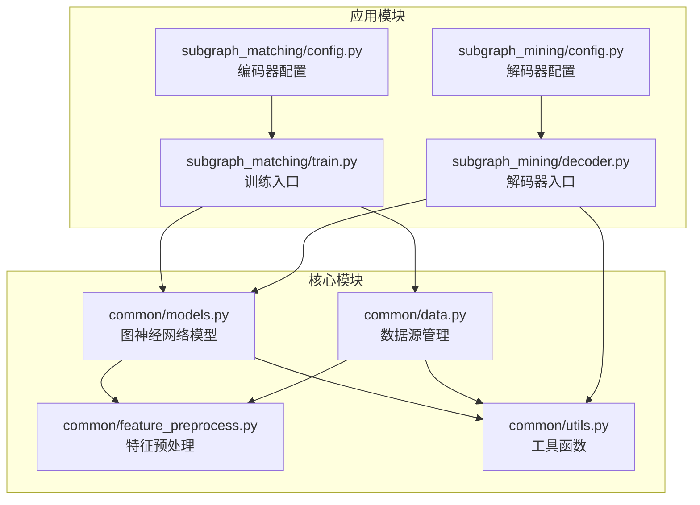
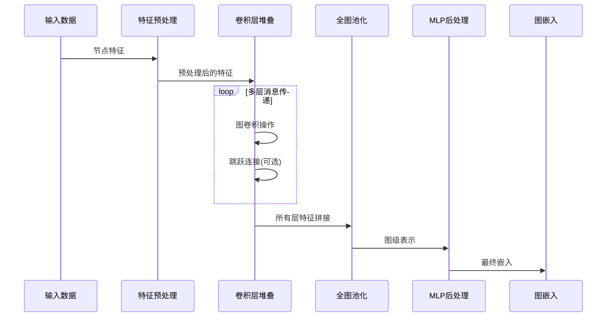
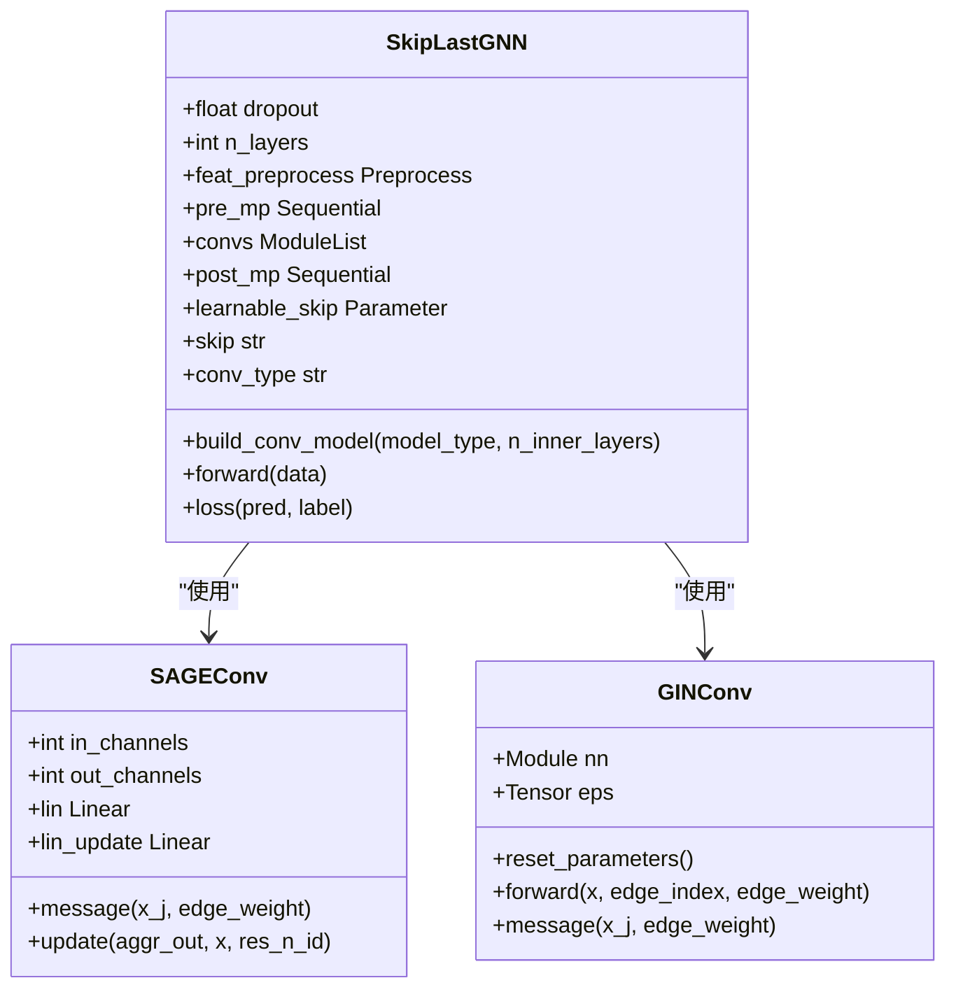
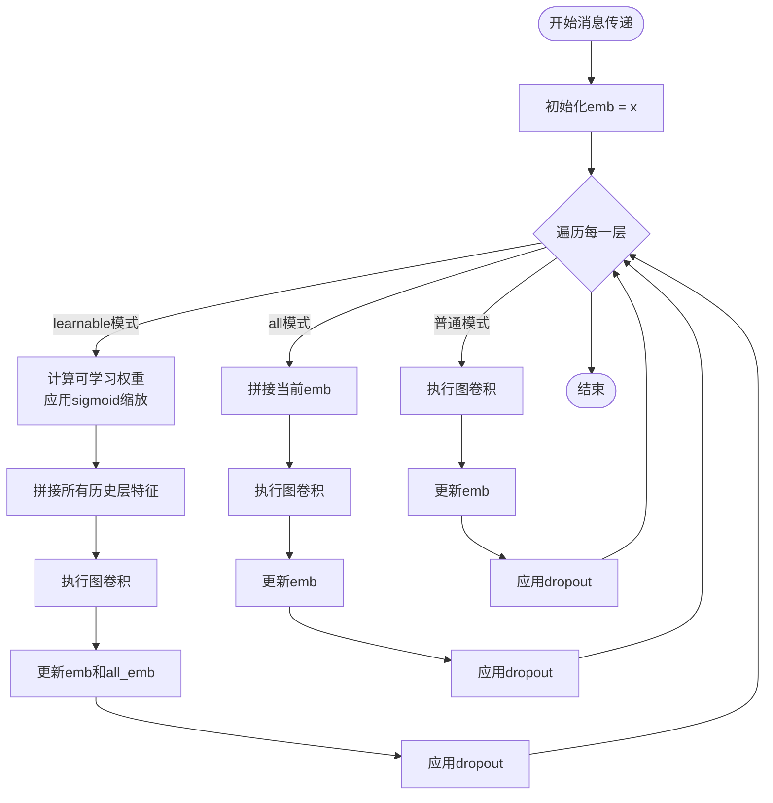
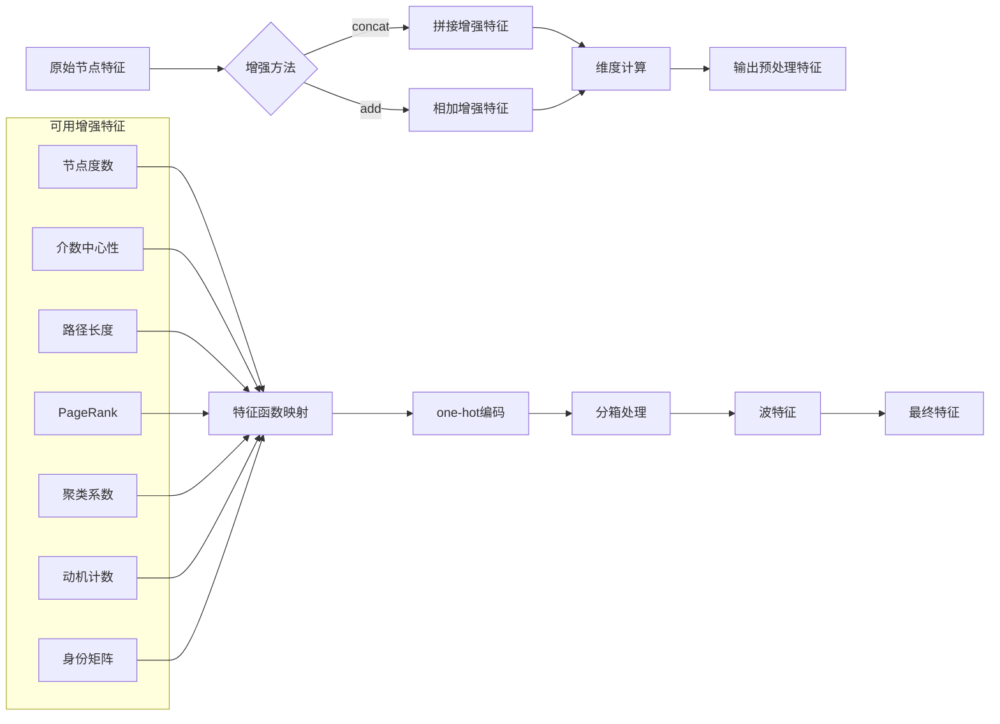
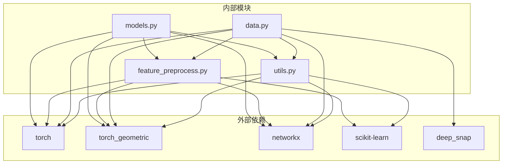

# 跳跃连接GNN

<cite>
**本文档引用的文件**
- [models.py](file://common/models.py)
- [feature_preprocess.py](file://common/feature_preprocess.py)
- [data.py](file://common/data.py)
- [utils.py](file://common/utils.py)
- [config.py](file://subgraph_matching/config.py)
- [config.py](file://subgraph_mining/config.py)
- [train.py](file://subgraph_matching/train.py)
- [decoder.py](file://subgraph_mining/decoder.py)
</cite>

## 目录
1. [简介](#简介)
2. [项目结构](#项目结构)
3. [核心组件](#核心组件)
4. [架构总览](#架构总览)
5. [详细组件分析](#详细组件分析)
6. [依赖关系分析](#依赖关系分析)
7. [性能考虑](#性能考虑)
8. [故障排除指南](#故障排除指南)
9. [结论](#结论)

## 简介
SPMiner是一个基于图神经网络的子图挖掘系统，其核心是支持跳跃连接的SkipLastGNN架构。该架构通过多层消息传递机制和全图池化过程，实现了高效的图嵌入学习。本文档详细解释了跳跃连接GNN的设计原理，包括不同图卷积类型的实现、跳跃连接模式的选择、以及完整的网络配置参数体系。

## 项目结构
SPMiner项目采用模块化设计，主要包含以下核心模块：

**图表来源**
- [models.py:1-318](file://common/models.py#L1-L318)
- [data.py:1-447](file://common/data.py#L1-L447)

**章节来源**
- [models.py:1-318](file://common/models.py#L1-L318)
- [data.py:1-447](file://common/data.py#L1-L447)

## 核心组件
SkipLastGNN是SPMiner的核心组件，它实现了支持跳跃连接的图神经网络编码器。该组件具有以下关键特性：

### 主要功能
- **特征预处理**：支持多种节点特征增强方法
- **多层消息传递**：可配置的图卷积层堆叠
- **跳跃连接**：支持learnable和all两种跳跃连接模式
- **全图池化**：通过global_add_pool实现图级表示
- **MLP后处理**：将图级表示映射到最终嵌入空间

### 关键参数
- `input_dim`: 输入特征维度
- `hidden_dim`: 隐层维度
- `output_dim`: 输出维度
- `args`: 配置参数对象

**章节来源**
- [models.py:101-230](file://common/models.py#L101-L230)

## 架构总览
SkipLastGNN的整体架构采用流水线设计，从特征预处理到最终嵌入输出的完整流程如下：

**图表来源**
- [models.py:182-226](file://common/models.py#L182-L226)

## 详细组件分析

### SkipLastGNN类详解

SkipLastGNN是整个架构的核心，实现了完整的跳跃连接GNN设计：

#### 构造函数分析

**图表来源**
- [models.py:101-318](file://common/models.py#L101-L318)

#### 跳跃连接机制
SkipLastGNN支持两种跳跃连接模式：

1. **learnable模式**：通过可学习参数控制各层特征的权重分配
2. **all模式**：将所有历史层的特征都参与当前层的计算

**图表来源**
- [models.py:182-226](file://common/models.py#L182-L226)

**章节来源**
- [models.py:101-230](file://common/models.py#L101-L230)

### 图卷积层实现

#### GCNConv实现
标准的图卷积层，适用于对称邻接矩阵的处理。

#### GINConv实现
带有边权支持的图同构网络卷积，通过epsilon参数控制消息传递的自环影响。

#### SAGEConv实现
自定义的GraphSAGE风格卷积，显式去除自环并采用线性变换处理邻居消息。

#### 其他卷积类型
- **GraphConv**：通用图卷积层
- **GATConv**：图注意力网络
- **GatedGraphConv**：门控图卷积
- **PNAConv**：聚合网络算子

**章节来源**
- [models.py:159-181](file://common/models.py#L159-L181)
- [models.py:231-318](file://common/models.py#L231-L318)

### 特征预处理系统

特征预处理系统提供了灵活的节点特征增强机制：

**图表来源**
- [feature_preprocess.py:71-230](file://common/feature_preprocess.py#L71-L230)

**章节来源**
- [feature_preprocess.py:1-230](file://common/feature_preprocess.py#L1-L230)

### 数据源管理

系统支持多种数据源类型，满足不同的训练需求：

#### 合成数据源
- **OTFSynDataSource**：在线生成合成数据
- **OTFSynImbalancedDataSource**：不平衡的在线合成数据

#### 磁盘数据源
- **DiskDataSource**：使用保存在磁盘上的图数据集
- **DiskImbalancedDataSource**：不平衡的真实数据

**章节来源**
- [data.py:77-430](file://common/data.py#L77-L430)

## 依赖关系分析

**图表来源**
- [models.py:10-19](file://common/models.py#L10-L19)
- [feature_preprocess.py:1-25](file://common/feature_preprocess.py#L1-L25)
- [data.py:1-20](file://common/data.py#L1-L20)

**章节来源**
- [models.py:10-19](file://common/models.py#L10-L19)
- [feature_preprocess.py:1-25](file://common/feature_preprocess.py#L1-L25)
- [data.py:1-20](file://common/data.py#L1-L20)

## 性能考虑

### 计算复杂度
- **消息传递复杂度**：O(E·d)，其中E是边数，d是特征维度
- **跳跃连接开销**：learnable模式增加额外的参数学习成本
- **内存使用**：all模式需要存储所有历史层的特征

### 优化建议
1. **层间跳跃连接**：在深层网络中使用跳跃连接可以缓解梯度消失问题
2. **特征维度调整**：根据数据规模调整hidden_dim以平衡性能和内存
3. **dropout策略**：合理设置dropout比率防止过拟合
4. **批处理优化**：利用torch_geometric的Batch功能提高GPU利用率

## 故障排除指南

### 常见问题及解决方案

#### 训练不稳定
- **症状**：损失震荡或发散
- **原因**：学习率过高或梯度爆炸
- **解决**：降低学习率，添加梯度裁剪

#### 过拟合
- **症状**：训练集表现好但验证集表现差
- **原因**：模型复杂度过高
- **解决**：增加dropout，减少n_layers

#### 内存不足
- **症状**：CUDA out of memory错误
- **原因**：批处理过大或图尺寸过大
- **解决**：减小batch_size，限制最大图尺寸

**章节来源**
- [train.py:129-134](file://subgraph_matching/train.py#L129-L134)
- [utils.py:265-284](file://common/utils.py#L265-L284)

## 结论

SPMiner的跳跃连接GNN架构通过精心设计的消息传递机制和灵活的跳跃连接策略，实现了高效的图嵌入学习。该架构的主要优势包括：

1. **模块化设计**：清晰的组件分离便于理解和扩展
2. **灵活性**：支持多种图卷积类型和跳跃连接模式
3. **可扩展性**：易于添加新的卷积层和特征预处理方法
4. **实用性**：经过实际子图挖掘任务验证的有效性

通过深入理解SkipLastGNN的设计原理和实现细节，开发者可以更好地利用这一架构进行图神经网络相关的研究和应用开发。