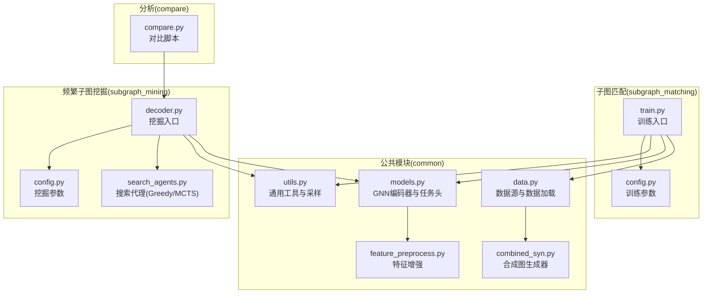
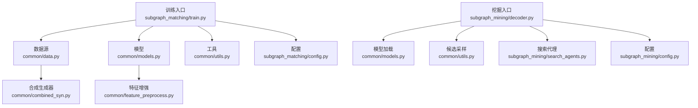
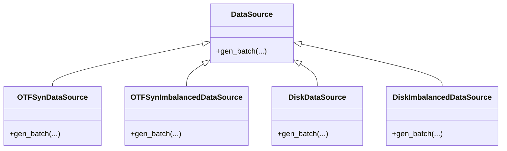
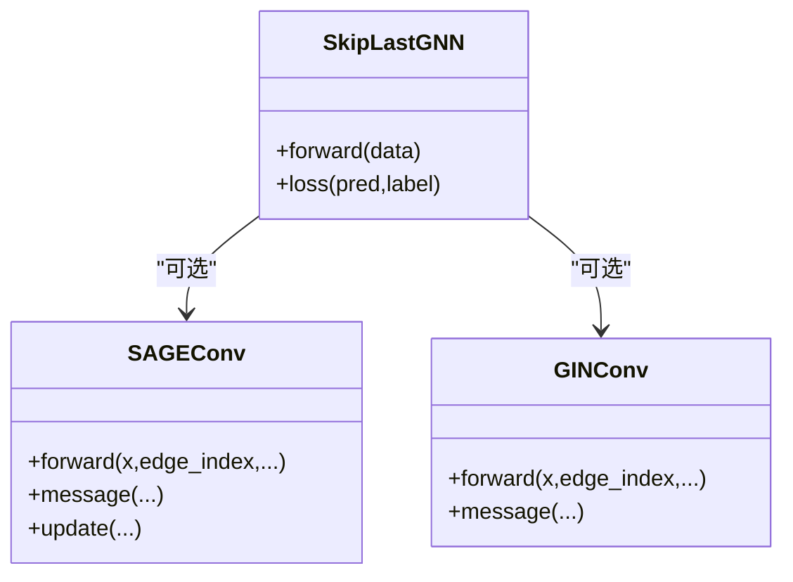
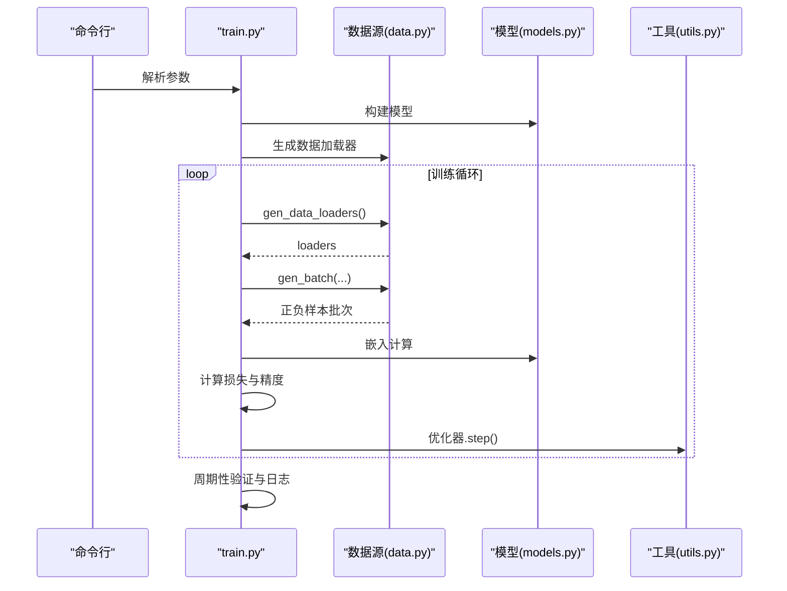
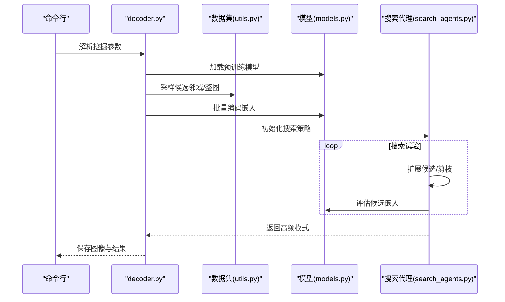
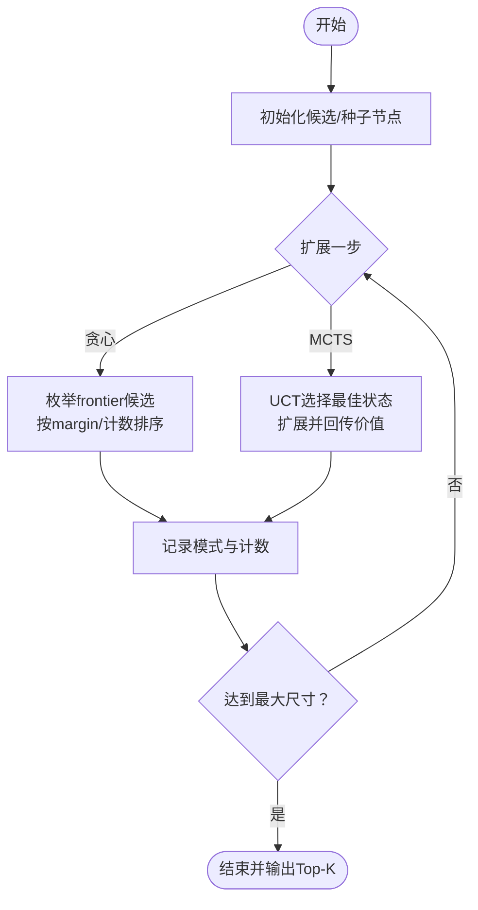
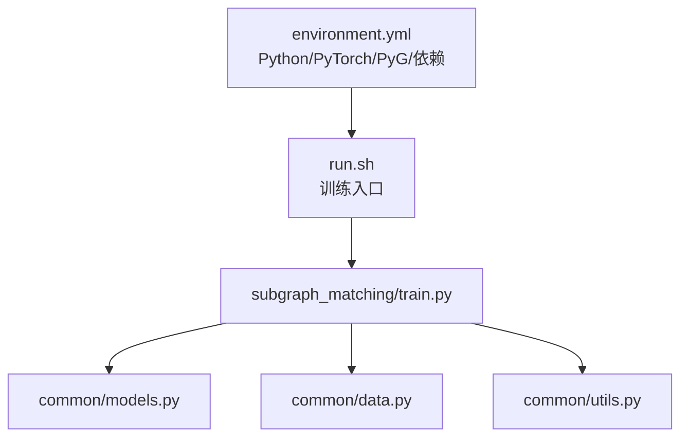

# 项目概述

<cite>
**本文档引用的文件**
- [README.md](file://README.md)
- [environment.yml](file://environment.yml)
- [run.sh](file://run.sh)
- [common/data.py](file://common/data.py)
- [common/models.py](file://common/models.py)
- [common/utils.py](file://common/utils.py)
- [common/feature_preprocess.py](file://common/feature_preprocess.py)
- [common/combined_syn.py](file://common/combined_syn.py)
- [subgraph_matching/config.py](file://subgraph_matching/config.py)
- [subgraph_matching/train.py](file://subgraph_matching/train.py)
- [subgraph_mining/config.py](file://subgraph_mining/config.py)
- [subgraph_mining/decoder.py](file://subgraph_mining/decoder.py)
- [subgraph_mining/search_agents.py](file://subgraph_mining/search_agents.py)
- [compare/compare.py](file://compare/compare.py)
</cite>

## 目录
1. [简介](#简介)
2. [项目结构](#项目结构)
3. [核心组件](#核心组件)
4. [架构总览](#架构总览)
5. [详细组件分析](#详细组件分析)
6. [依赖分析](#依赖分析)
7. [性能考量](#性能考量)
8. [故障排查指南](#故障排查指南)
9. [结论](#结论)
10. [附录](#附录)

## 简介
本项目名为 Neural Subgraph Learning Library（NSL），聚焦于“子图关系学习与频繁子图挖掘”。其核心目标是：
- 将“子图匹配”作为可学习的判别器，学习图的结构嵌入；
- 基于该嵌入空间，对候选子图进行打分与搜索，挖掘高频结构模式；
- 提供从训练、推理、挖掘、统计分析到可视化的完整工作流。

项目在图挖掘领域具有明确的价值定位：
- 将深度学习（GNN）与传统图算法（如子图同构检测、邻域采样、WL 标签）有机结合；
- 在子图匹配与模式发现之间建立统一的表示学习框架；
- 支持多种数据源（合成数据与真实图数据集）与多种搜索策略（贪心、MCTS）。

## 项目结构
仓库采用按功能域划分的模块化组织方式，核心模块包括：
- common：通用数据、模型、工具与特征预处理；
- subgraph_matching：子图匹配训练与评估；
- subgraph_mining：频繁子图挖掘（解码器与搜索代理）；
- analyze：结果分析与可视化；
- compare：与 gSpan 等基准方法的对比脚本；
- 根目录：环境配置与运行入口。

图表来源
- [common/data.py](file://common/data.py)
- [common/models.py](file://common/models.py)
- [common/utils.py](file://common/utils.py)
- [common/feature_preprocess.py](file://common/feature_preprocess.py)
- [common/combined_syn.py](file://common/combined_syn.py)
- [subgraph_matching/config.py](file://subgraph_matching/config.py)
- [subgraph_matching/train.py](file://subgraph_matching/train.py)
- [subgraph_mining/config.py](file://subgraph_mining/config.py)
- [subgraph_mining/decoder.py](file://subgraph_mining/decoder.py)
- [subgraph_mining/search_agents.py](file://subgraph_mining/search_agents.py)
- [compare/compare.py](file://compare/compare.py)

章节来源
- [README.md: 第30-62行:30-62](file://README.md#L30-L62)

## 核心组件
- 数据与数据源（common/data.py）
  - 支持真实图数据集（TUDataset、PPI、QM9）与本地 SNAP 边列表；
  - 提供在线合成数据源（OTF）、不平衡采样、节点锚定等能力；
  - 将 NetworkX 图转换为 PyG/DeepSNAP 批次，统一特征增强与设备放置。
- 图神经网络与任务头（common/models.py）
  - 支持 GCN、GIN、GraphSAGE、GAT、SAGEConv、GINConv 等卷积变体；
  - 提供“序嵌入”（Order Embedding）与基线 MLP 两类匹配头；
  - 全图池化 + MLP 得到固定维度图嵌入，支撑子图匹配与挖掘。
- 通用工具（common/utils.py）
  - 邻域采样、WL 标记、节点锚定、设备选择、优化器构建等；
  - 将 NetworkX 图批量转换为 PyG 数据并增强特征。
- 特征预处理（common/feature_preprocess.py）
  - 节点度、介数中心性、路径长、PageRank、聚类系数、身份矩阵对角等；
  - 支持拼接或加和两种增强方式，统一输出维度。
- 合成图生成（common/combined_syn.py）
  - 基于 ER、WS、BA 扩展模型与幂律簇生成器的集成；
  - 保证连通性与尺寸分布，支持按需生成大规模图数据集。
- 训练参数（subgraph_matching/config.py）
  - 卷积类型、匹配方式、批大小、层数、隐藏维、dropout、学习率、margin 等；
  - 默认稳定配置（SAGE + order embedding）。
- 训练入口（subgraph_matching/train.py）
  - 多进程数据生成与训练循环；
  - 周期性验证、日志记录、checkpoint 保存。
- 挖掘参数（subgraph_mining/config.py）
  - 挖掘策略（贪心/MCTS）、邻域采样方式、半径、候选规模、搜索试验次数等；
  - 默认参数针对性能与稳定性折中。
- 挖掘入口（subgraph_mining/decoder.py）
  - 加载预训练模型，采样候选邻域，批量编码嵌入，调用搜索代理，输出模式与可视化。
- 搜索代理（subgraph_mining/search_agents.py）
  - GreedySearchAgent：贪心扩展，支持计数/margin/hybrid 排序；
  - MCTSSearchAgent：UCT 搜索，基于访问计数与价值回传。
- 对比脚本（compare/compare.py）
  - 与 gSpan 对比运行时间与内存，支持公平输入（共享 gSpan DB）。

章节来源
- [common/data.py: 第21-75行:21-75](file://common/data.py#L21-L75)
- [common/models.py: 第22-100行:22-100](file://common/models.py#L22-L100)
- [common/utils.py: 第18-53行:18-53](file://common/utils.py#L18-L53)
- [common/feature_preprocess.py: 第71-192行:71-192](file://common/feature_preprocess.py#L71-L192)
- [common/combined_syn.py: 第101-117行:101-117](file://common/combined_syn.py#L101-L117)
- [subgraph_matching/config.py: 第14-77行:14-77](file://subgraph_matching/config.py#L14-L77)
- [subgraph_matching/train.py: 第49-89行:49-89](file://subgraph_matching/train.py#L49-L89)
- [subgraph_mining/config.py: 第13-59行:13-59](file://subgraph_mining/config.py#L13-L59)
- [subgraph_mining/decoder.py: 第72-82行:72-82](file://subgraph_mining/decoder.py#L72-L82)
- [subgraph_mining/search_agents.py: 第14-51行:14-51](file://subgraph_mining/search_agents.py#L14-L51)
- [compare/compare.py: 第16-125行:16-125](file://compare/compare.py#L16-L125)

## 架构总览
整体架构分为“训练阶段（子图匹配）”和“挖掘阶段（频繁子图）”两大闭环：
- 训练阶段：构建数据源 → 训练 GNN 编码器 → 保存 checkpoint；
- 挖掘阶段：加载 checkpoint → 采样候选邻域 → 批量嵌入 → 搜索策略 → 输出模式。

图表来源
- [subgraph_matching/train.py: 第49-89行:49-89](file://subgraph_matching/train.py#L49-L89)
- [common/data.py: 第77-114行:77-114](file://common/data.py#L77-L114)
- [common/models.py: 第101-226行:101-226](file://common/models.py#L101-L226)
- [common/utils.py: 第286-301行:286-301](file://common/utils.py#L286-L301)
- [subgraph_mining/decoder.py: 第72-82行:72-82](file://subgraph_mining/decoder.py#L72-L82)
- [subgraph_mining/search_agents.py: 第14-51行:14-51](file://subgraph_mining/search_agents.py#L14-L51)
- [common/combined_syn.py: 第101-117行:101-117](file://common/combined_syn.py#L101-L117)
- [common/feature_preprocess.py: 第186-192行:186-192](file://common/feature_preprocess.py#L186-L192)

## 详细组件分析

### 数据与数据源（OTF/Disk/不平衡）
- 在线合成数据（OTF）：动态生成正负样本对，支持节点锚定与困难负例；
- 磁盘真实数据：统一加载 TUDataset/PPI/QM9 与本地 SNAP 边列表；
- 不平衡采样：模拟真实场景中子图关系的稀疏性，提升模型泛化能力。

图表来源
- [common/data.py: 第77-114行:77-114](file://common/data.py#L77-L114)
- [common/data.py: 第216-269行:216-269](file://common/data.py#L216-L269)
- [common/data.py: 第271-354行:271-354](file://common/data.py#L271-L354)
- [common/data.py: 第356-429行:356-429](file://common/data.py#L356-L429)

章节来源
- [common/data.py: 第77-114行:77-114](file://common/data.py#L77-L114)
- [common/data.py: 第216-269行:216-269](file://common/data.py#L216-L269)
- [common/data.py: 第271-354行:271-354](file://common/data.py#L271-L354)
- [common/data.py: 第356-429行:356-429](file://common/data.py#L356-L429)

### 模型与消息传递（SkipLastGNN + 自定义卷积）
- 支持 skip connection 与 learnable skip 参数；
- 自定义 SAGEConv/GINConv，显式移除自环，邻居消息线性变换后与中心节点拼接；
- 全图加和池化 + MLP 得到图级嵌入，适配子图匹配与挖掘。

图表来源
- [common/models.py: 第101-226行:101-226](file://common/models.py#L101-L226)
- [common/models.py: 第231-280行:231-280](file://common/models.py#L231-L280)
- [common/models.py: 第287-316行:287-316](file://common/models.py#L287-L316)

章节来源
- [common/models.py: 第101-226行:101-226](file://common/models.py#L101-L226)
- [common/models.py: 第231-280行:231-280](file://common/models.py#L231-L280)
- [common/models.py: 第287-316行:287-316](file://common/models.py#L287-L316)

### 训练流程（多进程 + 验证）
- 构建模型与优化器，按配置选择训练数据源；
- 多进程并行生成 batch，反向传播与梯度裁剪；
- 周期性评估验证集，记录 TensorBoard 日志，保存 checkpoint。

图表来源
- [subgraph_matching/train.py: 第91-151行:91-151](file://subgraph_matching/train.py#L91-L151)
- [subgraph_matching/train.py: 第152-222行:152-222](file://subgraph_matching/train.py#L152-L222)
- [common/data.py: 第77-114行:77-114](file://common/data.py#L77-L114)
- [common/models.py: 第101-226行:101-226](file://common/models.py#L101-L226)
- [common/utils.py: 第265-284行:265-284](file://common/utils.py#L265-L284)

章节来源
- [subgraph_matching/train.py: 第91-151行:91-151](file://subgraph_matching/train.py#L91-L151)
- [subgraph_matching/train.py: 第152-222行:152-222](file://subgraph_matching/train.py#L152-L222)

### 挖掘流程（候选采样 → 嵌入 → 搜索 → 输出）
- 从目标数据集中采样邻域或整图，批量编码为嵌入；
- Greedy/MCTS 搜索代理在嵌入空间中扩展候选，按访问计数或 margin 分数排序；
- 输出模式并可视化，保存序列化结果。

图表来源
- [subgraph_mining/decoder.py: 第62-171行:62-171](file://subgraph_mining/decoder.py#L62-L171)
- [subgraph_mining/decoder.py: 第197-271行:197-271](file://subgraph_mining/decoder.py#L197-L271)
- [subgraph_mining/search_agents.py: 第54-67行:54-67](file://subgraph_mining/search_agents.py#L54-L67)
- [subgraph_mining/search_agents.py: 第129-282行:129-282](file://subgraph_mining/search_agents.py#L129-L282)
- [subgraph_mining/search_agents.py: 第284-441行:284-441](file://subgraph_mining/search_agents.py#L284-L441)

章节来源
- [subgraph_mining/decoder.py: 第62-171行:62-171](file://subgraph_mining/decoder.py#L62-L171)
- [subgraph_mining/decoder.py: 第197-271行:197-271](file://subgraph_mining/decoder.py#L197-L271)
- [subgraph_mining/search_agents.py: 第54-67行:54-67](file://subgraph_mining/search_agents.py#L54-L67)
- [subgraph_mining/search_agents.py: 第129-282行:129-282](file://subgraph_mining/search_agents.py#L129-L282)
- [subgraph_mining/search_agents.py: 第284-441行:284-441](file://subgraph_mining/search_agents.py#L284-L441)

### 搜索策略（贪心 vs MCTS）
- 贪心搜索：beam 扩展，按候选 margin 或计数排序，支持 hybrid 策略；
- MCTS：UCT 准则，基于访问计数与价值回传，适合探索更广的模式空间。

图表来源
- [subgraph_mining/search_agents.py: 第284-441行:284-441](file://subgraph_mining/search_agents.py#L284-L441)
- [subgraph_mining/search_agents.py: 第129-282行:129-282](file://subgraph_mining/search_agents.py#L129-L282)

章节来源
- [subgraph_mining/search_agents.py: 第284-441行:284-441](file://subgraph_mining/search_agents.py#L284-L441)
- [subgraph_mining/search_agents.py: 第129-282行:129-282](file://subgraph_mining/search_agents.py#L129-L282)

## 依赖分析
- 环境与依赖（environment.yml）
  - Python 3.10、PyTorch 2.x、PyTorch-Geometric 2.x、DeepSNAP、NetworkX、NumPy、SciPy、Scikit-learn、Matplotlib、TensorBoard 等；
  - 针对不同平台（CPU/CUDA）的 torch-scatter/sparse 版本；
- 运行入口（run.sh）
  - 直接调用子图匹配训练模块，便于快速启动。

图表来源
- [environment.yml: 第1-129行:1-129](file://environment.yml#L1-L129)
- [run.sh: 第1-2行:1-2](file://run.sh#L1-L2)
- [subgraph_matching/train.py: 第49-89行:49-89](file://subgraph_matching/train.py#L49-L89)
- [common/models.py: 第101-226行:101-226](file://common/models.py#L101-L226)
- [common/data.py: 第77-114行:77-114](file://common/data.py#L77-L114)
- [common/utils.py: 第286-301行:286-301](file://common/utils.py#L286-L301)

章节来源
- [environment.yml: 第1-129行:1-129](file://environment.yml#L1-L129)
- [run.sh: 第1-2行:1-2](file://run.sh#L1-L2)

## 性能考量
- 训练阶段
  - 多进程数据生成与并行训练，减少 I/O 等待；
  - 梯度裁剪与合理 dropout，提升稳定性；
  - 优化器与学习率调度器可按配置灵活选择。
- 挖掘阶段
  - 候选邻域采样规模与搜索试验次数直接影响耗时；
  - frontier_top_k 剪枝可显著降低每步扩展复杂度；
  - 批量嵌入与缓存候选嵌入（cand_emb_cache）减少重复计算。

章节来源
- [subgraph_matching/train.py: 第130-134行:130-134](file://subgraph_matching/train.py#L130-L134)
- [subgraph_mining/search_agents.py: 第84-119行:84-119](file://subgraph_mining/search_agents.py#L84-L119)
- [subgraph_mining/search_agents.py: 第121-127行:121-127](file://subgraph_mining/search_agents.py#L121-L127)

## 故障排查指南
- 依赖缺失
  - 确认已正确激活 conda 环境并安装 PyTorch、PyG、DeepSNAP、NetworkX、TensorBoard；
  - 可通过导入检查验证安装完整性。
- 数据集文件
  - Facebook/AS-733 等依赖本地边列表文件，需放置于 data/ 目录；
  - 确保文件存在且格式符合预期。
- 挖掘耗时过长
  - 适当减小 n_neighborhoods、n_trials、batch_size；
  - 启用 frontier_top_k 剪枝与节点锚定以加速。
- 训练不稳定
  - 调整 margin、dropout、学习率与优化器；
  - 使用不平衡数据源模拟真实场景，提升鲁棒性。

章节来源
- [README.md: 第115-119行:115-119](file://README.md#L115-L119)
- [README.md: 第340-367行:340-367](file://README.md#L340-L367)
- [subgraph_mining/config.py: 第42-59行:42-59](file://subgraph_mining/config.py#L42-L59)

## 结论
本项目通过“子图匹配 + 频繁子图挖掘”的统一框架，将深度学习与传统图算法有机结合，既可用于判别式学习，也可用于模式发现。其模块化设计与丰富的参数配置，使其既能满足初学者快速上手，也能为有经验的研究者提供深入定制与扩展的空间。

## 附录
- 快速开始命令（训练/评估/挖掘）
  - 训练：python -m subgraph_matching.train --node_anchored
  - 评估：python -m subgraph_matching.test --node_anchored
  - 挖掘：python -m subgraph_mining.decoder --dataset=enzymes --node_anchored
- 对比脚本
  - 支持与 gSpan 的运行时间/内存对比，可配置公平输入与 top-K 输出。

章节来源
- [README.md: 第129-163行:129-163](file://README.md#L129-L163)
- [compare/compare.py: 第495-612行:495-612](file://compare/compare.py#L495-L612)